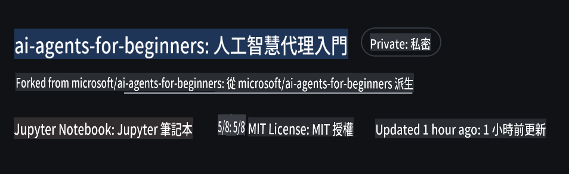
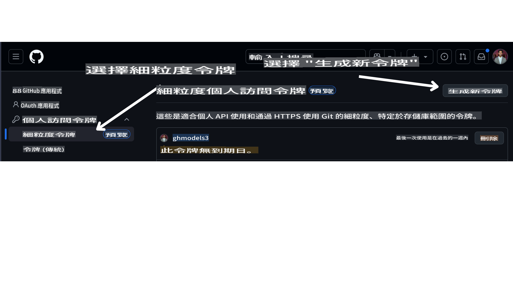

<!--
CO_OP_TRANSLATOR_METADATA:
{
  "original_hash": "366bc6709dd95b8a32ec7c705b0f179c",
  "translation_date": "2025-03-28T11:34:34+00:00",
  "source_file": "00-course-setup\\README.md",
  "language_code": "hk"
}
-->
# 課程設置

## 簡介

這節課將講解如何運行本課程的代碼示例。

## 要求

- GitHub 帳戶
- Python 3.12+
- Azure 訂閱
- Azure AI Foundry 帳戶

## 克隆或分叉這個倉庫

首先，請克隆或分叉 GitHub 倉庫。這樣您就能擁有課程材料的自己的版本，方便您運行、測試和調整代碼！

可以通過點擊以下鏈接完成：

您現在應該在以下鏈接擁有課程的分叉版本：



## 獲取您的 GitHub 個人訪問令牌 (PAT)

目前，本課程使用 GitHub 模型市場提供免費訪問大型語言模型 (LLMs)，這些模型將用於創建 AI Agents。

要訪問此服務，您需要創建一個 GitHub 個人訪問令牌。

您可以通過訪問您的 GitHub 帳戶來完成此操作。

在屏幕左側選擇 `Fine-grained tokens` 選項。

然後選擇 `Generate new token`。



複製您剛剛創建的新令牌。接下來，您需要將其添加到本課程包含的 `.env` 文件中。

## 添加到環境變量中

要創建您的 `.env` 文件，請在終端中運行以下命令：

```bash
cp .env.example .env
```

此命令將複製示例文件並在您的目錄中創建 `.env`，然後填寫環境變量的值。您可以在 [Azure AI Foundry](https://ai.azure.com?WT.mc_id=academic-105485-koreyst) 門戶的以下位置找到每個環境變量的值：

打開該文件，並將您創建的令牌粘貼到 `GITHUB_TOKEN=` field of the .env file. 
- `AZURE_SUBSCRIPTION_ID` - On the **Overview** page of your project within **Project details**.
- `AZURE_AI_PROJECT_NAME` - At the top of the **Overview** page for your project.
- `AZURE_OPENAI_RESOURCE_GROUP` - On the **Overview** page of the **Management Center** within **Project properties**.
- `AZURE_OPENAI_SERVICE` - On the **Overview** page of your project in the **Included capabilities** tab for **Azure OpenAI Service**.
- `AZURE_OPENAI_API_VERSION` - On the [API version lifecycle](https://learn.microsoft.com/azure/ai-services/openai/api-version-deprecation#latest-ga-api-release?WT.mc_id=academic-105485-koreyst) webpage within the **Latest GA API release** section.
- `AZURE_OPENAI_ENDPOINT` 中 - 在 **Endpoint** 的 **Details** 標籤內（例如 **Target URI**）

## 安裝所需的包

為了確保您擁有運行代碼所需的所有 Python 包，請在終端中運行以下命令。

我們建議創建 Python 虛擬環境以避免任何衝突和問題。

```bash
pip install -r requirements.txt
```

此命令應該會安裝所需的 Python 包。

# 登錄 Azure

作為安全最佳實踐，我們將使用 [無密鑰身份驗證](https://learn.microsoft.com/azure/developer/ai/keyless-connections?tabs=csharp%2Cazure-cli?WT.mc_id=academic-105485-koreyst) 通過 Microsoft Entra ID 驗證 Azure OpenAI。在此之前，您需要按照您的操作系統的 [安裝指南](https://learn.microsoft.com/cli/azure/install-azure-cli?WT.mc_id=academic-105485-koreyst) 安裝 **Azure CLI**。

接下來，打開終端並運行 `az login` to sign in to your Azure account.

## Sign in to Azure

Login with your Azure AI account used to provision the Azure resources.

Open a new terminal and enter the following command and follow the instructions in the terminal:

`az login --use-device-code`

Once you've logged in, select your subscription in the terminal.

## Access the environment variables.

We'll import `os` and `load_dotenv` 以便訪問環境變量。

```python
import os
from dotenv import load_dotenv

load_dotenv()
```

## 設置無密鑰身份驗證

與其硬編碼憑據，我們將使用 Azure OpenAI 的無密鑰連接。為此，我們將導入 `DefaultAzureCredential` and later call the `DefaultAzureCredential` 函數來獲取憑據。

```python
from azure.identity import DefaultAzureCredential, InteractiveBrowserCredential
```

現在，您已準備好運行本課程的代碼，祝您愉快地學習 AI Agents 的世界！

如果您在運行設置時遇到任何問題，請加入我們的論壇或社群。

## 下一課

[AI Agents 介紹及應用場景](../01-intro-to-ai-agents/README.md)

**免責聲明**：  
本文件使用AI翻譯服務 [Co-op Translator](https://github.com/Azure/co-op-translator) 進行翻譯。我們致力於提供準確的翻譯，但請注意，自動翻譯可能包含錯誤或不準確之處。原文檔的母語版本應被視為權威來源。對於重要信息，建議尋求專業人工翻譯。我們不對因使用本翻譯而產生的任何誤解或錯誤解釋承擔責任。