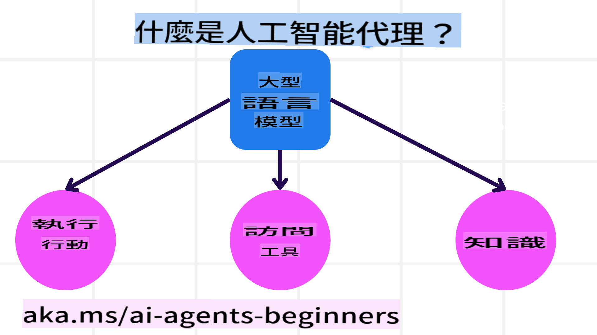
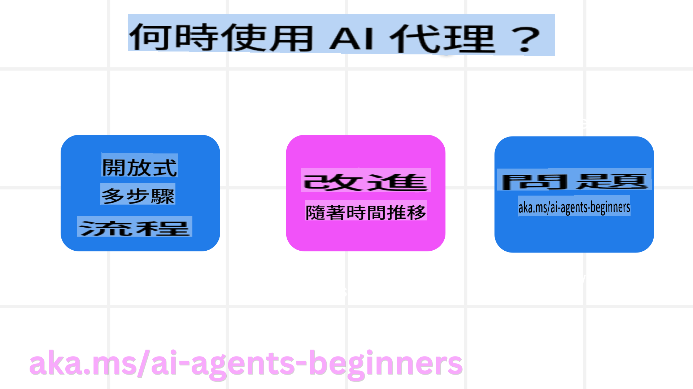

<!--
CO_OP_TRANSLATOR_METADATA:
{
  "original_hash": "233e7a18025a27eae95b653e9b5b5aa5",
  "translation_date": "2025-03-28T11:36:39+00:00",
  "source_file": "01-intro-to-ai-agents\\README.md",
  "language_code": "hk"
}
-->

> _(點擊上面圖片觀看此課程影片)_

# AI代理及其應用案例簡介

歡迎來到「初學者AI代理課程」！此課程提供構建AI代理的基本知識及實際應用範例。

加入社群與其他學習者及AI代理開發者交流，並提出你對課程的任何問題。

開始課程前，我們先了解什麼是AI代理，以及如何在應用及工作流程中使用它們。

## 課程簡介

本課程涵蓋以下內容：

- 什麼是AI代理？有哪些不同類型的代理？
- 哪些使用場景最適合AI代理？它們如何幫助我們？
- 設計代理解決方案時有哪些基本構建塊？

## 學習目標

完成此課程後，你應該能夠：

- 理解AI代理的概念及其與其他AI解決方案的不同之處。
- 高效應用AI代理。
- 為用戶及客戶設計高效的代理解決方案。

## 定義AI代理及其類型

### 什麼是AI代理？

AI代理是一種**系統**，透過給予**大型語言模型(LLMs)** **工具**和**知識**的訪問權限，讓LLMs能夠**執行操作**。

讓我們把這個定義拆解成幾個部分：

- **系統** - 不應只將代理視為單一元件，而是由多個元件組成的系統。AI代理的基本元件包括：
  - **環境** - AI代理操作的定義空間。例如，若有一個旅行預訂AI代理，環境可能是代理用來完成任務的旅行預訂系統。
  - **感測器** - 環境提供資訊及反饋。AI代理使用感測器來收集並解釋有關環境當前狀態的資訊。在旅行預訂代理的例子中，旅行預訂系統可能提供如酒店可用性或航班價格等資訊。
  - **執行器** - AI代理接收到環境的當前狀態後，針對任務判斷應執行的操作以改變環境。對於旅行預訂代理來說，可能是為用戶預訂一間可用的房間。

**大型語言模型** - 代理的概念在LLMs出現之前就已存在。使用LLMs構建AI代理的優勢在於其能解釋人類語言及數據的能力。這使得LLMs能夠解釋環境資訊並制定改變環境的計劃。

**執行操作** - 在AI代理系統之外，LLMs的操作通常局限於生成內容或資訊，根據用戶的提示進行回應。而在AI代理系統內，LLMs能透過解釋用戶的需求並使用環境中的工具來完成任務。

**工具訪問權限** - LLM可使用的工具取決於1) 它操作的環境，以及2) AI代理的開發者。在旅行代理的例子中，代理的工具可能受限於預訂系統的操作功能，或者開發者可以限制代理的工具訪問範圍，例如僅限航班預訂。

**知識** - 除了環境提供的資訊外，AI代理還可以從其他系統、服務、工具甚至其他代理中獲取知識。在旅行代理的例子中，這些知識可能包括位於客戶數據庫中的用戶旅行偏好資訊。

### 不同類型的代理

現在我們已經對AI代理有了一個大致的定義，接下來看看一些具體的代理類型及它們在旅行預訂AI代理中的應用。

| **代理類型**                  | **描述**                                                                                                                         | **例子**                                                                                                                                                                                                                   |
| ----------------------------- | ----------------------------------------------------------------------------------------------------------------------------- | ----------------------------------------------------------------------------------------------------------------------------------------------------------------------------------------------------------------------------- |
| **簡單反射代理**              | 根據預定規則執行即時操作。                                                                                                      | 旅行代理解讀電子郵件內容並將旅行投訴轉發至客服部門。                                                                                                                          |
| **基於模型的反射代理**        | 根據世界模型及其變化執行操作。                                                                                                  | 旅行代理基於訪問歷史價格數據的模型，優先考慮價格變化顯著的路線。                                                                                                             |
| **基於目標的代理**            | 通過解讀目標並制定行動計劃來達成特定目標。                                                                                      | 旅行代理根據用戶的起始地點及目的地，規劃必要的旅行安排（如汽車、公共交通、航班）並完成預訂。                                                                                |
| **基於效用的代理**            | 考慮偏好並以數字權衡取捨來決定如何達成目標。                                                                                   | 旅行代理在預訂旅行時平衡便利性與成本，以最大化效用。                                                                                                                                          |
| **學習型代理**                | 通過回饋逐步改善並相應調整操作。                                                                                              | 旅行代理根據旅後調查的客戶回饋，改進未來的預訂方式。                                                                                                               |
| **分層代理**                  | 包含多個代理的分層系統，高層代理將任務分解為子任務，由低層代理完成。                                                             | 旅行代理取消行程時，將任務分解為子任務（例如取消特定預訂），並由低層代理完成，然後向高層代理報告進度。                                     |
| **多代理系統 (MAS)**          | 代理獨立完成任務，可合作或競爭。                                                                                              | 合作型：多個代理分別預訂特定的旅行服務，如酒店、航班及娛樂活動。競爭型：多個代理管理並競爭共享的酒店預訂日曆，為客戶安排入住。 |

## 何時使用AI代理

在之前的部分中，我們用旅行代理的使用案例解釋了不同類型代理在旅行預訂場景中的應用。我們將在課程中持續使用此應用案例。

接下來看看AI代理最適合的使用場景：

- **開放式問題** - 允許LLM決定完成任務所需的步驟，因為這些步驟無法總是硬編碼到工作流程中。
- **多步驟流程** - 需要一定複雜性的任務，AI代理需要在多輪交互中使用工具或資訊，而非一次性檢索。
- **逐步改進** - 代理能夠通過接收來自環境或用戶的回饋，逐步改進以提供更好的效用。

我們會在「構建可信AI代理」課程中進一步探討使用AI代理的考量。

## 代理解決方案基礎

### 代理開發

設計AI代理系統的第一步是定義工具、操作及行為。在本課程中，我們專注於使用**Azure AI Agent Service**來定義代理。它提供以下功能：

- 選擇開放模型，如OpenAI、Mistral及Llama
- 通過Tripadvisor等供應商使用授權數據
- 使用標準化的OpenAPI 3.0工具

### 代理模式

與LLM的溝通是通過提示進行的。由於AI代理的半自主性質，在環境改變後並不總是需要或可能手動重新提示LLM。我們使用**代理模式**，允許在多個步驟中以更具規模性的方式提示LLM。

本課程分為一些目前流行的代理模式。

### 代理框架

代理框架使開發者能夠通過代碼實現代理模式。這些框架提供模板、插件及工具，以促進更好的AI代理協作。這些優勢使AI代理系統具備更好的可觀察性及故障排除能力。

在本課程中，我們將探索以研究為導向的AutoGen框架以及Semantic Kernel的生產就緒代理框架。

## 前一課程

[課程設置](../00-course-setup/README.md)

## 下一課程

[探索代理框架](../02-explore-agentic-frameworks/README.md)

**免責聲明**：  
此文件已使用AI翻譯服務 [Co-op Translator](https://github.com/Azure/co-op-translator) 翻譯。我們致力於提供準確的翻譯，但請注意，自動翻譯可能包含錯誤或不準確之處。應以原文作為權威來源。對於關鍵資訊，建議尋求專業的人工作翻譯。我們對因使用此翻譯而產生的任何誤解或誤釋不承擔責任。