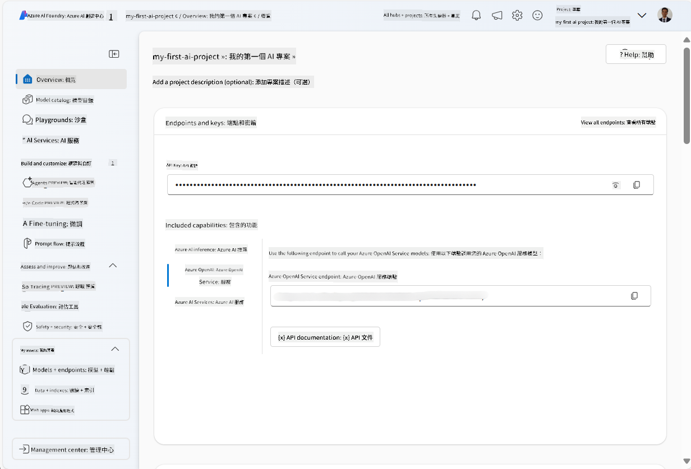
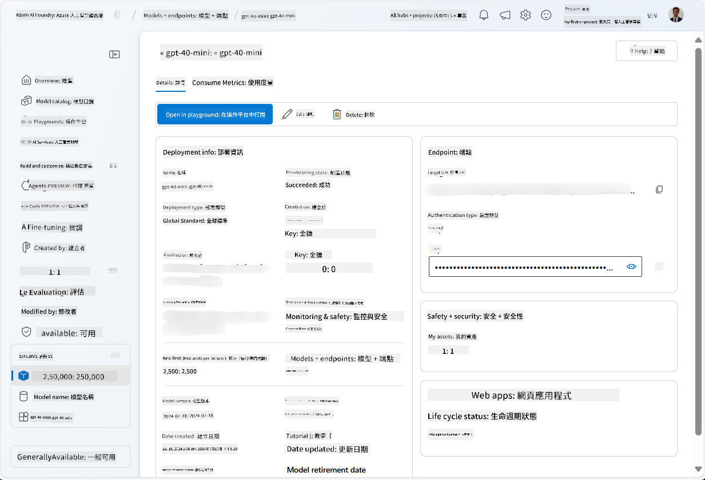
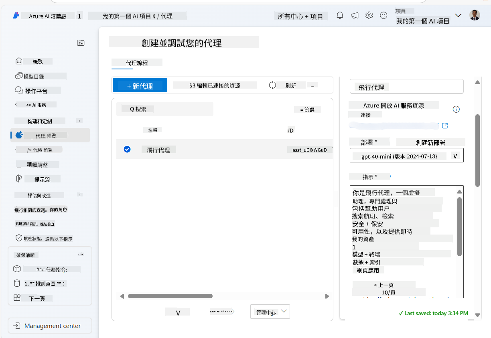
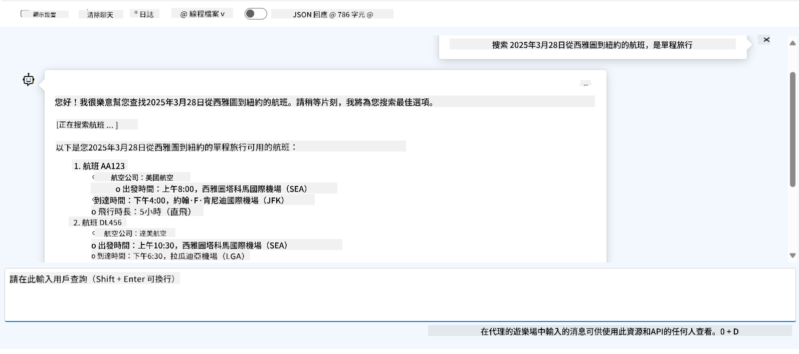

<!--
CO_OP_TRANSLATOR_METADATA:
{
  "original_hash": "664afc6dd1bf275b0eafd126b71da420",
  "translation_date": "2025-03-28T11:39:36+00:00",
  "source_file": "02-explore-agentic-frameworks\\azure-ai-foundry-agent-creation.md",
  "language_code": "hk"
}
-->
# Azure AI Agent 服務開發

在這個練習中，你會使用 [Azure AI Foundry portal](https://ai.azure.com/?WT.mc_id=academic-105485-koreyst) 中的 Azure AI Agent 服務工具來建立一個航班預訂的代理。這個代理可以與使用者互動並提供航班相關資訊。

## 必備條件

完成這個練習，你需要以下條件：
1. 一個有有效訂閱的 Azure 帳戶。[免費建立帳戶](https://azure.microsoft.com/free/?WT.mc_id=academic-105485-koreyst)。
2. 你需要擁有建立 Azure AI Foundry hub 的權限，或者已經有人幫你建立好。
    - 如果你的角色是 Contributor 或 Owner，你可以按照本教程的步驟進行。

## 建立 Azure AI Foundry hub

> **Note:** Azure AI Foundry 以前稱為 Azure AI Studio。

1. 按照 [Azure AI Foundry](https://learn.microsoft.com/en-us/azure/ai-studio/?WT.mc_id=academic-105485-koreyst) 部落格文章中的指南來建立 Azure AI Foundry hub。
2. 當你的專案建立完成後，關閉所有顯示的提示並檢視 Azure AI Foundry portal 中的專案頁面，應該看起來類似以下圖片：

    

## 部署模型

1. 在專案左側的面板中，進入 **My assets** 部分，選擇 **Models + endpoints** 頁面。
2. 在 **Models + endpoints** 頁面的 **Model deployments** 標籤下，點擊 **+ Deploy model** 菜單，選擇 **Deploy base model**。
3. 在列表中搜尋 `gpt-4o-mini` 模型，然後選擇並確認。

    > **Note**: 降低 TPM 可以避免過度使用你訂閱中的配額。

    

## 建立代理

現在你已部署了一個模型，可以建立代理。代理是一種可以與使用者互動的對話式 AI 模型。

1. 在專案左側的面板中，進入 **Build & Customize** 部分，選擇 **Agents** 頁面。
2. 點擊 **+ Create agent** 來建立新的代理。在 **Agent Setup** 對話框中：
    - 為代理命名，例如 `FlightAgent`。
    - 確保選擇了你之前建立的 `gpt-4o-mini` 模型部署。
    - 根據你希望代理遵循的提示設置 **Instructions**。以下是一個範例：
    ```
    You are FlightAgent, a virtual assistant specialized in handling flight-related queries. Your role includes assisting users with searching for flights, retrieving flight details, checking seat availability, and providing real-time flight status. Follow the instructions below to ensure clarity and effectiveness in your responses:

    ### Task Instructions:
    1. **Recognizing Intent**:
       - Identify the user's intent based on their request, focusing on one of the following categories:
         - Searching for flights
         - Retrieving flight details using a flight ID
         - Checking seat availability for a specified flight
         - Providing real-time flight status using a flight number
       - If the intent is unclear, politely ask users to clarify or provide more details.
        
    2. **Processing Requests**:
        - Depending on the identified intent, perform the required task:
        - For flight searches: Request details such as origin, destination, departure date, and optionally return date.
        - For flight details: Request a valid flight ID.
        - For seat availability: Request the flight ID and date and validate inputs.
        - For flight status: Request a valid flight number.
        - Perform validations on provided data (e.g., formats of dates, flight numbers, or IDs). If the information is incomplete or invalid, return a friendly request for clarification.

    3. **Generating Responses**:
    - Use a tone that is friendly, concise, and supportive.
    - Provide clear and actionable suggestions based on the output of each task.
    - If no data is found or an error occurs, explain it to the user gently and offer alternative actions (e.g., refine search, try another query).
    
    ```
> [!NOTE]
> 如果需要詳細的提示，你可以參考 [這個倉庫](https://github.com/ShivamGoyal03/RoamMind) 了解更多資訊。
    
> 此外，你可以添加 **Knowledge Base** 和 **Actions**，以提升代理的能力，提供更多資訊並根據使用者需求執行自動化任務。在這個練習中，可以跳過這些步驟。
    


3. 若要建立新的多 AI 代理，只需點擊 **New Agent**。新建立的代理將顯示在 Agents 頁面上。

## 測試代理

建立代理後，你可以在 Azure AI Foundry portal 的 playground 中測試它，看看它如何回應使用者查詢。

1. 在代理的 **Setup** 面板頂部，選擇 **Try in playground**。
2. 在 **Playground** 面板中，你可以透過在聊天視窗中輸入查詢來與代理互動。例如，你可以要求代理搜尋 28 日從西雅圖到紐約的航班。

    > **Note**: 由於這個練習中未使用即時數據，代理可能無法提供準確的回應。這個目的是測試代理理解和回應使用者查詢的能力，基於所提供的指令。

    

3. 測試代理後，你可以進一步自訂它，添加更多意圖、訓練數據和操作，以提升其能力。

## 清理資源

完成代理測試後，你可以刪除它以避免產生額外費用。
1. 打開 [Azure portal](https://portal.azure.com)，查看你在這個練習中部署 hub 資源的資源群組內容。
2. 在工具列上，選擇 **Delete resource group**。
3. 輸入資源群組名稱並確認你要刪除它。

## 資源

- [Azure AI Foundry 文件](https://learn.microsoft.com/en-us/azure/ai-studio/?WT.mc_id=academic-105485-koreyst)
- [Azure AI Foundry portal](https://ai.azure.com/?WT.mc_id=academic-105485-koreyst)
- [Azure AI Studio 入門](https://techcommunity.microsoft.com/blog/educatordeveloperblog/getting-started-with-azure-ai-studio/4095602?WT.mc_id=academic-105485-koreyst)
- [Azure 上 AI 代理的基礎知識](https://learn.microsoft.com/en-us/training/modules/ai-agent-fundamentals/?WT.mc_id=academic-105485-koreyst)
- [Azure AI Discord](https://aka.ms/AzureAI/Discord)

**免責聲明**：  
本文件已使用人工智能翻譯服務 [Co-op Translator](https://github.com/Azure/co-op-translator) 進行翻譯。儘管我們致力於提供準確的翻譯，但請注意，自動翻譯可能包含錯誤或不準確之處。原始語言版本的文件應被視為權威來源。對於重要信息，建議使用專業人工翻譯。我們對因使用本翻譯而產生的任何誤解或錯誤解釋概不負責。