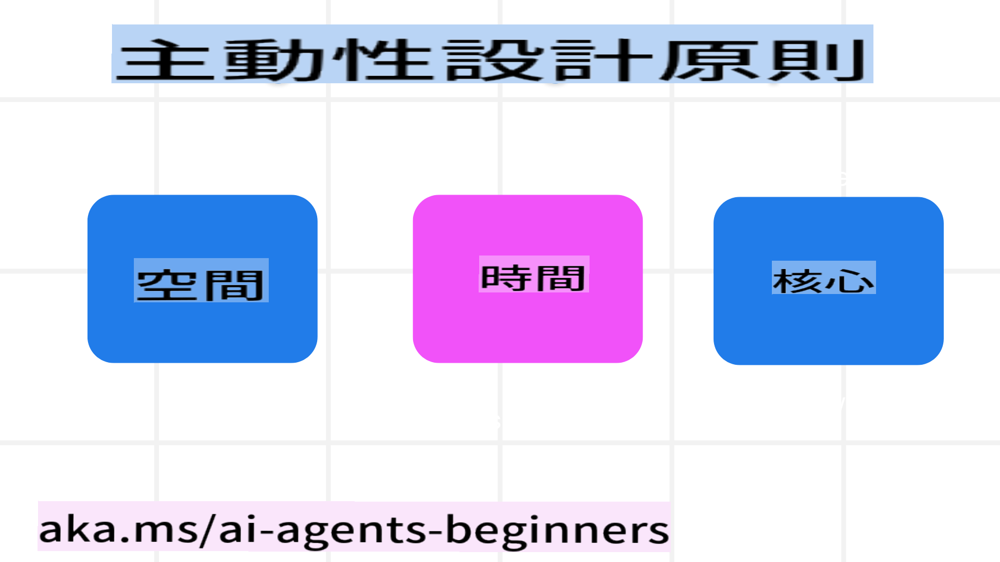

<!--
CO_OP_TRANSLATOR_METADATA:
{
  "original_hash": "969885aab5f923f67f134ce115fbbcaf",
  "translation_date": "2025-03-28T11:47:31+00:00",
  "source_file": "03-agentic-design-patterns\\README.md",
  "language_code": "hk"
}
-->

> _(點擊上方圖片觀看本課程影片)_
# AI代理設計原則

## 簡介

建立AI代理系統有很多種方式。由於生成式AI設計中模糊性是一種特性而非缺陷，工程師有時可能不知道該從何著手。我們制定了一套以人為本的UX設計原則，幫助開發者打造以客戶為中心的代理系統，解決他們的業務需求。這些設計原則並非硬性規定的架構，而是為正在定義並構建代理體驗的團隊提供一個起點。

一般來說，代理應該：

- 擴展和提升人類能力（如頭腦風暴、解決問題、自動化等）
- 填補知識空白（例如幫助快速了解知識領域、翻譯等）
- 促進並支持我們個人喜歡的合作方式
- 讓我們成為更好的自己（例如生活教練/任務管理者，幫助我們學習情緒調節和正念技能，建立韌性等）

## 本課程內容

- 什麼是代理設計原則
- 實施這些設計原則時需要遵循哪些指導方針
- 使用設計原則的一些示例

## 學習目標

完成本課程後，您將能夠：

1. 解釋什麼是代理設計原則
2. 解釋使用代理設計原則的指導方針
3. 理解如何使用代理設計原則構建代理

## 代理設計原則

### 代理（空間）

這是代理運作的環境。這些原則指導我們如何為物理和數字世界設計代理。

- **連接，而非取代** – 幫助人們連接其他人、事件以及可操作的知識，以促進協作和聯繫。
  - 代理幫助連接事件、知識和人。
  - 代理讓人們更緊密地聯繫在一起，而不是取代或貶低人類。
- **易於訪問但偶爾隱形** – 代理主要在背景中運作，只有在相關和合適的時候才會提示我們。
  - 代理可以在任何設備或平台上被授權用戶輕鬆發現和訪問。
  - 代理支持多模態輸入和輸出（聲音、語音、文字等）。
  - 代理可以根據用戶需求的感知，在前景和背景之間、主動和被動之間無縫切換。
  - 代理可以以隱形形式運作，但其背景過程和與其他代理的合作對用戶是透明且可控的。

### 代理（時間）

這是代理如何隨時間運作。這些原則指導我們如何設計代理在過去、現在和未來的互動。

- **過去**：反思包含狀態和上下文的歷史。
  - 代理基於對更豐富的歷史數據的分析提供更相關的結果，而不僅僅是事件、人或狀態。
  - 代理從過去事件中創建聯繫，並積極反思記憶以應對當前情況。
- **現在**：推動而非通知。
  - 代理採用全面的方式與人互動。當事件發生時，代理超越了靜態通知或其他形式的靜態互動。代理可以簡化流程或動態生成提示，在適當的時刻吸引用戶的注意力。
  - 代理根據環境、社會和文化變化以及用戶意圖提供信息。
  - 代理的互動可以逐步進行，隨著時間的推移逐漸演變/增強複雜性，從而提升用戶的能力。
- **未來**：適應並演變。
  - 代理適應各種設備、平台和模式。
  - 代理適應用戶行為、可訪問性需求，並且可以自由定制。
  - 代理通過持續的用戶互動塑造並演變。

### 代理（核心）

這是代理設計核心的關鍵要素。

- **接受不確定性，但建立信任**。
  - 預期代理存在一定程度的不確定性。不確定性是代理設計的關鍵元素。
  - 信任和透明是代理設計的基礎層。
  - 人類可以控制代理何時開啟/關閉，代理狀態始終清晰可見。

## 實施這些原則的指導方針

在使用上述設計原則時，請遵循以下指導方針：

1. **透明性**：告知用戶AI的參與方式、其運作方式（包括過去的操作），以及如何提供反饋和修改系統。
2. **控制**：讓用戶能夠自定義、指定偏好並個性化，並掌控系統及其屬性（包括忘記功能）。
3. **一致性**：在各設備和端點之間提供一致的多模態體驗。儘可能使用熟悉的UI/UX元素（例如用麥克風圖標表示語音互動），並最大程度地減少用戶的認知負擔（例如提供簡明的回應、視覺輔助和“了解更多”內容）。

## 如何使用這些原則和指導方針設計旅行代理

假設您正在設計一個旅行代理，以下是使用設計原則和指導方針的思路：

1. **透明性** – 告知用戶旅行代理是一個AI驅動的代理。提供一些基本的操作指導（例如“你好”消息、示例提示）。在產品頁面上清楚記錄這些信息。展示用戶過去詢問的提示列表。明確說明如何提供反饋（例如“點讚”和“點踩”按鈕、發送反饋按鈕等）。清楚表明代理是否有使用或話題限制。
2. **控制** – 確保用戶能夠在代理創建後進行修改，例如系統提示等。讓用戶選擇代理的詳細程度、寫作風格以及代理不應涉及的話題。允許用戶查看並刪除任何相關文件或數據、提示和過去的對話。
3. **一致性** – 確保“分享提示”、添加文件或照片以及標記某人或某物的圖標是標準且易於識別的。使用回形針圖標表示文件上傳/分享給代理，使用圖片圖標表示圖形上傳。

## 其他資源

## 上一課程

[探索代理框架](../02-explore-agentic-frameworks/README.md)

## 下一課程

[工具使用設計模式](../04-tool-use/README.md)

**免責聲明**：  
本文檔已使用人工智能翻譯服務 [Co-op Translator](https://github.com/Azure/co-op-translator) 進行翻譯。我們致力於提供準確的翻譯，但請注意，自動翻譯可能會包含錯誤或不準確之處。應以原始語言的文件作為權威來源。對於重要信息，建議使用專業人工翻譯。我們不對因使用此翻譯而產生的任何誤解或錯誤解釋承擔責任。