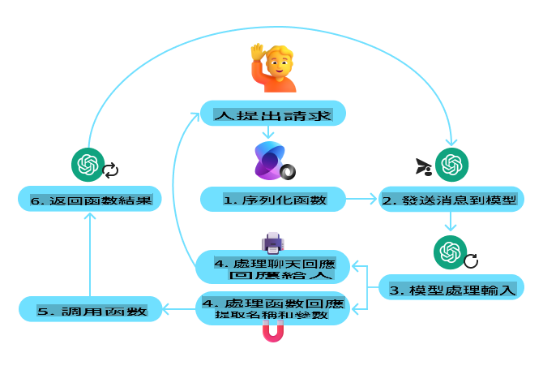
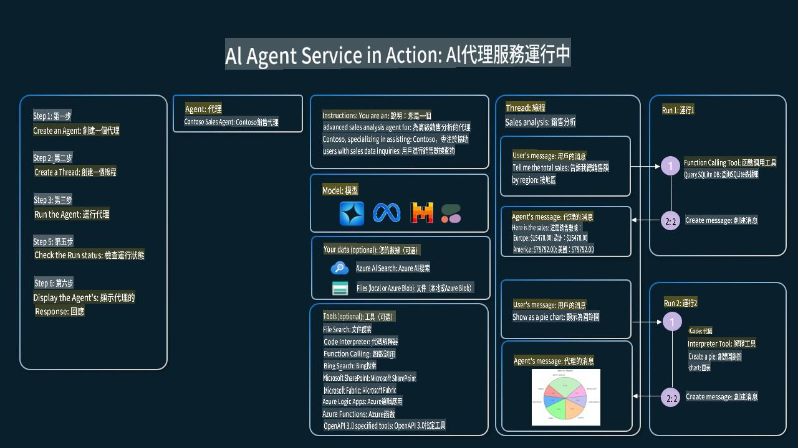

<!--
CO_OP_TRANSLATOR_METADATA:
{
  "original_hash": "b8ea2abd1a674f736d5fc08982e6ec06",
  "translation_date": "2025-03-28T11:49:42+00:00",
  "source_file": "04-tool-use\\README.md",
  "language_code": "hk"
}
-->
[](https://youtu.be/vieRiPRx-gI?si=cEZ8ApnT6Sus9rhn)

> _(點擊上方圖片觀看本課程的影片)_

# 工具使用設計模式

工具很有趣，因為它們能讓AI代理擁有更廣泛的能力範圍。與代理只能執行有限的動作相比，加入工具後，代理就能執行更多不同的操作。在本章中，我們會探討工具使用設計模式，該模式描述了AI代理如何使用特定工具來達成目標。

## 簡介

在本課程中，我們將探討以下問題：

- 什麼是工具使用設計模式？
- 它適用於哪些使用案例？
- 實現該設計模式需要哪些元素/構建模塊？
- 使用工具使用設計模式來構建值得信賴的AI代理需要注意哪些特殊事項？

## 學習目標

完成本課程後，您將能夠：

- 定義工具使用設計模式及其目的。
- 確定工具使用設計模式的適用使用案例。
- 理解實現該設計模式所需的關鍵元素。
- 認識到使用此設計模式來確保AI代理可信任的注意事項。

## 什麼是工具使用設計模式？

**工具使用設計模式**的核心是讓LLMs能夠與外部工具互動以實現特定目標。工具是可以由代理執行的代碼，用於執行操作。工具可以是簡單的函數（例如計算器），也可以是第三方服務的API調用（例如股票價格查詢或天氣預報）。在AI代理的背景下，工具設計為可以由代理根據**模型生成的函數調用**來執行。

## 它適用於哪些使用案例？

AI代理可以利用工具完成複雜任務、檢索信息或做出決策。工具使用設計模式通常用於需要與外部系統動態交互的場景，例如數據庫、網絡服務或代碼解釋器。這種能力在許多使用案例中非常有用，包括：

- **動態信息檢索**：代理可以查詢外部API或數據庫以獲取最新數據（例如查詢SQLite數據庫進行數據分析、獲取股票價格或天氣信息）。
- **代碼執行與解釋**：代理可以執行代碼或腳本以解決數學問題、生成報告或進行模擬。
- **工作流程自動化**：通過集成工具（如任務調度器、電子郵件服務或數據管道）來自動化重複或多步驟的工作流程。
- **客戶支持**：代理可以與CRM系統、工單平台或知識庫交互以解決用戶查詢。
- **內容生成與編輯**：代理可以利用工具（如語法檢查器、文本摘要器或內容安全評估器）協助完成內容創建任務。

## 實現工具使用設計模式需要哪些元素/構建模塊？

這些構建模塊使AI代理能夠執行多種任務。以下是實現工具使用設計模式所需的關鍵元素：

- **函數/工具調用**：這是讓LLMs與工具交互的主要方式。函數或工具是代理用來執行任務的可重用代碼塊。這些可以是簡單的函數（如計算器）或第三方服務的API調用（如股票價格查詢或天氣預報）。

- **動態信息檢索**：代理可以查詢外部API或數據庫以獲取最新數據，適用於數據分析、股票價格或天氣信息等任務。

- **代碼執行與解釋**：代理可以執行代碼或腳本以解決數學問題、生成報告或進行模擬。

- **工作流程自動化**：通過集成工具（如任務調度器、電子郵件服務或數據管道）來自動化重複或多步驟的工作流程。

- **客戶支持**：代理可以與CRM系統、工單平台或知識庫交互以解決用戶查詢。

- **內容生成與編輯**：代理可以利用工具（如語法檢查器、文本摘要器或內容安全評估器）協助完成內容創建任務。

接下來，我們將更詳細地探討函數/工具調用。

### 函數/工具調用

函數調用是讓大型語言模型（LLMs）與工具交互的主要方式。您經常會看到“函數”和“工具”交替使用，因為“函數”（可重用代碼塊）是代理用來執行任務的“工具”。要調用函數的代碼，LLM必須將用戶的請求與函數的描述進行比較。為此，需要向LLM發送包含所有可用函數描述的架構。LLM會選擇最適合任務的函數並返回其名稱和參數。選定的函數被調用，其響應被發送回LLM，LLM使用該信息來回應用戶的請求。

開發人員要為代理實現函數調用，您需要：

1. 支持函數調用的LLM模型
2. 包含函數描述的架構
3. 每個描述函數的代碼

以下是一個獲取城市當前時間的例子：

1. **初始化支持函數調用的LLM：**

    並非所有模型都支持函數調用，因此重要的是要檢查您使用的LLM是否支持。例如，<a href="https://learn.microsoft.com/azure/ai-services/openai/how-to/function-calling" target="_blank">Azure OpenAI</a>支持函數調用。我們可以通過初始化Azure OpenAI客戶端來開始。

    ```python
    # Initialize the Azure OpenAI client
    client = AzureOpenAI(
        azure_endpoint = os.getenv("AZURE_OPENAI_ENDPOINT"), 
        api_key=os.getenv("AZURE_OPENAI_API_KEY"),  
        api_version="2024-05-01-preview"
    )
    ```

1. **創建函數架構**：

    接下來，我們將定義一個JSON架構，其中包含函數名稱、函數的描述以及函數參數的名稱和描述。我們將把這個架構與之前創建的客戶端以及用戶查詢舊金山時間的請求一起傳遞。需要注意的是，返回的是**工具調用**，而不是問題的最終答案。如前所述，LLM返回它選擇的函數名稱及其參數。

    ```python
    # Function description for the model to read
    tools = [
        {
            "type": "function",
            "function": {
                "name": "get_current_time",
                "description": "Get the current time in a given location",
                "parameters": {
                    "type": "object",
                    "properties": {
                        "location": {
                            "type": "string",
                            "description": "The city name, e.g. San Francisco",
                        },
                    },
                    "required": ["location"],
                },
            }
        }
    ]
    ```
   
    ```python
  
    # Initial user message
    messages = [{"role": "user", "content": "What's the current time in San Francisco"}] 
  
    # First API call: Ask the model to use the function
      response = client.chat.completions.create(
          model=deployment_name,
          messages=messages,
          tools=tools,
          tool_choice="auto",
      )
  
      # Process the model's response
      response_message = response.choices[0].message
      messages.append(response_message)
  
      print("Model's response:")  

      print(response_message)
  
    ```

    ```bash
    Model's response:
    ChatCompletionMessage(content=None, role='assistant', function_call=None, tool_calls=[ChatCompletionMessageToolCall(id='call_pOsKdUlqvdyttYB67MOj434b', function=Function(arguments='{"location":"San Francisco"}', name='get_current_time'), type='function')])
    ```
  
1. **執行任務所需的函數代碼：**

    現在LLM已選擇需要運行的函數，我們需要實現並執行執行任務的代碼。我們可以用Python實現獲取當前時間的代碼。我們還需要編寫代碼，從response_message中提取名稱和參數以獲得最終結果。

    ```python
      def get_current_time(location):
        """Get the current time for a given location"""
        print(f"get_current_time called with location: {location}")  
        location_lower = location.lower()
        
        for key, timezone in TIMEZONE_DATA.items():
            if key in location_lower:
                print(f"Timezone found for {key}")  
                current_time = datetime.now(ZoneInfo(timezone)).strftime("%I:%M %p")
                return json.dumps({
                    "location": location,
                    "current_time": current_time
                })
      
        print(f"No timezone data found for {location_lower}")  
        return json.dumps({"location": location, "current_time": "unknown"})
    ```

     ```python
     # Handle function calls
      if response_message.tool_calls:
          for tool_call in response_message.tool_calls:
              if tool_call.function.name == "get_current_time":
     
                  function_args = json.loads(tool_call.function.arguments)
     
                  time_response = get_current_time(
                      location=function_args.get("location")
                  )
     
                  messages.append({
                      "tool_call_id": tool_call.id,
                      "role": "tool",
                      "name": "get_current_time",
                      "content": time_response,
                  })
      else:
          print("No tool calls were made by the model.")  
  
      # Second API call: Get the final response from the model
      final_response = client.chat.completions.create(
          model=deployment_name,
          messages=messages,
      )
  
      return final_response.choices[0].message.content
     ```

     ```bash
      get_current_time called with location: San Francisco
      Timezone found for san francisco
      The current time in San Francisco is 09:24 AM.
     ```

函數調用是大多數代理工具使用設計的核心，但從頭開始實現可能有些挑戰。正如我們在[第2課](../../../02-explore-agentic-frameworks)中學到的，代理框架為我們提供了預構建的構建模塊來實現工具使用。

## 使用代理框架的工具使用示例

以下是使用不同代理框架實現工具使用設計模式的一些示例：

### Semantic Kernel

<a href="https://learn.microsoft.com/azure/ai-services/agents/overview" target="_blank">Semantic Kernel</a>是一個開源AI框架，適用於使用大型語言模型（LLMs）的.NET、Python和Java開發者。它通過自動向模型描述您的函數及其參數（稱為<a href="https://learn.microsoft.com/semantic-kernel/concepts/ai-services/chat-completion/function-calling/?pivots=programming-language-python#1-serializing-the-functions" target="_blank">序列化</a>）簡化了使用函數調用的過程。它還處理模型與代碼之間的來回通信。使用像Semantic Kernel這樣的代理框架的另一個優勢是，它允許您訪問預構建工具，例如<a href="https://github.com/microsoft/semantic-kernel/blob/main/python/samples/getting_started_with_agents/openai_assistant/step4_assistant_tool_file_search.py" target="_blank">文件搜索</a>和<a href="https://github.com/microsoft/semantic-kernel/blob/main/python/samples/getting_started_with_agents/openai_assistant/step3_assistant_tool_code_interpreter.py" target="_blank">代碼解釋器</a>。

以下圖表說明了使用Semantic Kernel進行函數調用的過程：



在Semantic Kernel中，函數/工具被稱為<a href="https://learn.microsoft.com/semantic-kernel/concepts/plugins/?pivots=programming-language-python" target="_blank">插件</a>。我們可以將`get_current_time` function we saw earlier into a plugin by turning it into a class with the function in it. We can also import the `kernel_function`裝飾器轉換，該裝飾器接受函數的描述。當您使用GetCurrentTimePlugin創建內核時，內核會自動序列化函數及其參數，並創建發送到LLM的架構。

```python
from semantic_kernel.functions import kernel_function

class GetCurrentTimePlugin:
    async def __init__(self, location):
        self.location = location

    @kernel_function(
        description="Get the current time for a given location"
    )
    def get_current_time(location: str = ""):
        ...

```

```python 
from semantic_kernel import Kernel

# Create the kernel
kernel = Kernel()

# Create the plugin
get_current_time_plugin = GetCurrentTimePlugin(location)

# Add the plugin to the kernel
kernel.add_plugin(get_current_time_plugin)
```
  
### Azure AI Agent Service

<a href="https://learn.microsoft.com/azure/ai-services/agents/overview" target="_blank">Azure AI Agent Service</a>是一個較新的代理框架，旨在幫助開發者安全地構建、部署和擴展高質量且可擴展的AI代理，而無需管理底層計算和存儲資源。它對企業應用特別有用，因為它是一個具有企業級安全性的完全托管服務。

與直接使用LLM API開發相比，Azure AI Agent Service提供了一些優勢，包括：

- 自動工具調用——無需解析工具調用、調用工具並處理響應；所有這些現在都在服務端完成。
- 安全管理的數據——您可以依賴線程存儲所需的所有信息，而不是自己管理對話狀態。
- 開箱即用的工具——可以用於與數據源交互的工具，例如Bing、Azure AI Search和Azure Functions。

Azure AI Agent Service中的工具可以分為兩類：

1. 知識工具：
    - <a href="https://learn.microsoft.com/azure/ai-services/agents/how-to/tools/bing-grounding?tabs=python&pivots=overview" target="_blank">使用Bing搜索進行信息擬合</a>
    - <a href="https://learn.microsoft.com/azure/ai-services/agents/how-to/tools/file-search?tabs=python&pivots=overview" target="_blank">文件搜索</a>
    - <a href="https://learn.microsoft.com/azure/ai-services/agents/how-to/tools/azure-ai-search?tabs=azurecli%2Cpython&pivots=overview-azure-ai-search" target="_blank">Azure AI搜索</a>

2. 行動工具：
    - <a href="https://learn.microsoft.com/azure/ai-services/agents/how-to/tools/function-calling?tabs=python&pivots=overview" target="_blank">函數調用</a>
    - <a href="https://learn.microsoft.com/azure/ai-services/agents/how-to/tools/code-interpreter?tabs=python&pivots=overview" target="_blank">代碼解釋器</a>
    - <a href="https://learn.microsoft.com/azure/ai-services/agents/how-to/tools/openapi-spec?tabs=python&pivots=overview" target="_blank">OpenAI定義工具</a>
    - <a href="https://learn.microsoft.com/azure/ai-services/agents/how-to/tools/azure-functions?pivots=overview" target="_blank">Azure Functions</a>

Agent Service允許我們根據用戶請求使用這些工具組合，例如`toolset`. It also utilizes `threads` which keep track of the history of messages from a particular conversation.

Imagine you are a sales agent at a company called Contoso. You want to develop a conversational agent that can answer questions about your sales data.

The following image illustrates how you could use Azure AI Agent Service to analyze your sales data:



To use any of these tools with the service we can create a client and define a tool or toolset. To implement this practically we can use the following Python code. The LLM will be able to look at the toolset and decide whether to use the user created function, `fetch_sales_data_using_sqlite_query`或預構建的代碼解釋器。

```python 
import os
from azure.ai.projects import AIProjectClient
from azure.identity import DefaultAzureCredential
from fecth_sales_data_functions import fetch_sales_data_using_sqlite_query # fetch_sales_data_using_sqlite_query function which can be found in a fetch_sales_data_functions.py file.
from azure.ai.projects.models import ToolSet, FunctionTool, CodeInterpreterTool

project_client = AIProjectClient.from_connection_string(
    credential=DefaultAzureCredential(),
    conn_str=os.environ["PROJECT_CONNECTION_STRING"],
)

# Initialize function calling agent with the fetch_sales_data_using_sqlite_query function and adding it to the toolset
fetch_data_function = FunctionTool(fetch_sales_data_using_sqlite_query)
toolset = ToolSet()
toolset.add(fetch_data_function)

# Initialize Code Interpreter tool and adding it to the toolset. 
code_interpreter = code_interpreter = CodeInterpreterTool()
toolset = ToolSet()
toolset.add(code_interpreter)

agent = project_client.agents.create_agent(
    model="gpt-4o-mini", name="my-agent", instructions="You are helpful agent", 
    toolset=toolset
)
```

## 使用工具使用設計模式構建值得信賴的AI代理需要注意哪些特殊事項？

LLM生成的SQL的一個常見擔憂是安全性，尤其是SQL注入或惡意操作（如刪除或篡改數據庫）的風險。雖然這些擔憂是合理的，但可以通過正確配置數據庫訪問權限有效緩解。對於大多數數據庫，這涉及將數據庫配置為只讀模式。對於像PostgreSQL或Azure SQL這樣的數據庫服務，應為應用分配只讀（SELECT）角色。

在安全環境中運行應用進一步增強了保護。在企業場景中，數據通常從運營系統中提取並轉換到只讀數據庫或數據倉庫中，並且具有用戶友好的架構。這種方法確保了數據的安全性、性能和可訪問性得到了優化，並且應用具有受限的只讀訪問權限。

## 其他資源

- <a href="https://microsoft.github.io/build-your-first-agent-with-azure-ai-agent-service-workshop/" target="_blank">Azure AI Agents Service Workshop</a>
- <a href="https://github.com/Azure-Samples/contoso-creative-writer/tree/main/docs/workshop" target="_blank">Contoso Creative Writer Multi-Agent Workshop</a>
- <a href="https://learn.microsoft.com/semantic-kernel/concepts/ai-services/chat-completion/function-calling/?pivots=programming-language-python#1-serializing-the-functions" target="_blank">Semantic Kernel Function Calling Tutorial</a>
- <a href="https://github.com/microsoft/semantic-kernel/blob/main/python/samples/getting_started_with_agents/openai_assistant/step3_assistant_tool_code_interpreter.py" target="_blank">Semantic Kernel Code Interpreter</a>
- <a href="https://microsoft.github.io/autogen/dev/user-guide/core-user-guide/components/tools.html" target="_blank">Autogen Tools</a>

## 上一課程

[理解代理設計模式](../03-agentic-design-patterns/README.md)

## 下一課程

[Agentic RAG](../05-agentic-rag/README.md)

**免責聲明**：  
此文件已使用 AI 翻譯服務 [Co-op Translator](https://github.com/Azure/co-op-translator) 進行翻譯。雖然我們努力確保準確性，但請注意，自動翻譯可能包含錯誤或不準確之處。應以原文文件作為權威來源。對於關鍵資訊，建議尋求專業人工翻譯。我們對於使用此翻譯而引起的任何誤解或錯誤解釋概不負責。