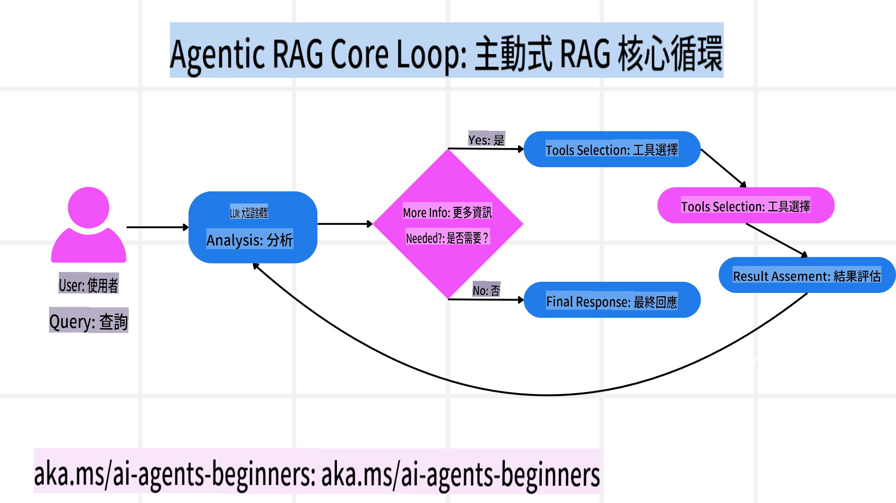
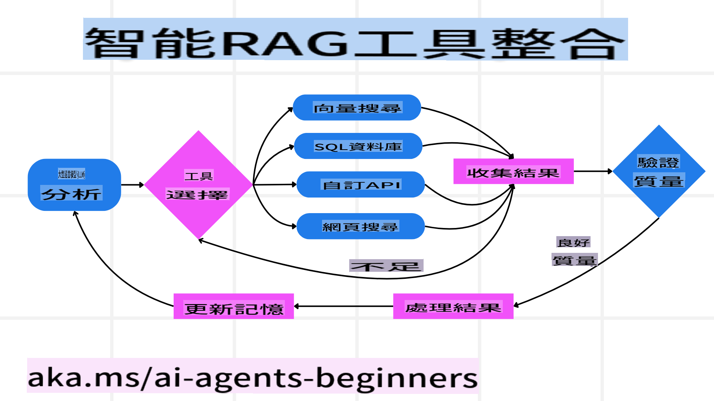
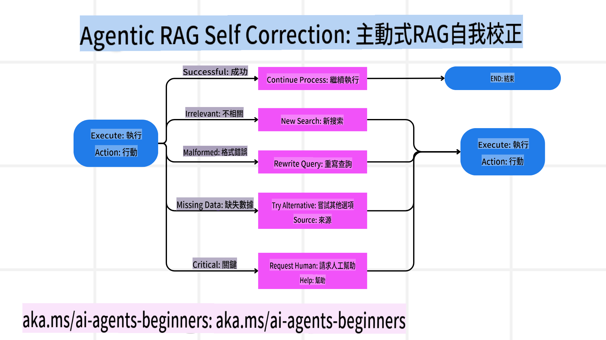
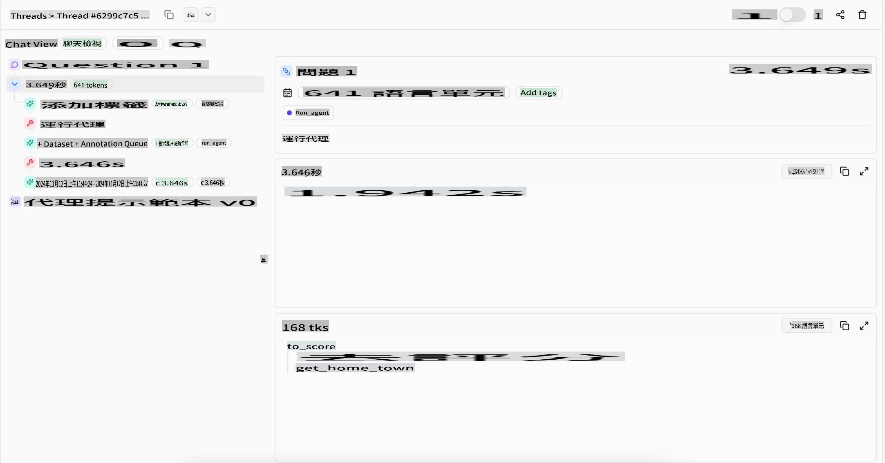
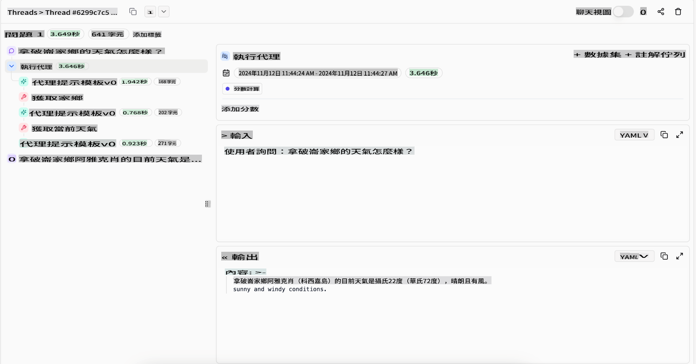

<!--
CO_OP_TRANSLATOR_METADATA:
{
  "original_hash": "4d215d159f2f3b96644fd62657988d23",
  "translation_date": "2025-03-28T11:53:07+00:00",
  "source_file": "05-agentic-rag\\README.md",
  "language_code": "hk"
}
-->

> _(按上方圖片觀看本課程影片)_

# Agentic RAG

本課程全面介紹了 Agentic Retrieval-Augmented Generation (Agentic RAG)，這是一種新興的 AI 模式，讓大型語言模型 (LLMs) 在拉取外部資訊的同時，自主規劃下一步行動。與靜態的檢索後閱讀模式不同，Agentic RAG 涉及多次迭代地呼叫 LLM，並在過程中穿插工具或函數調用以及結構化輸出。系統會評估結果、改進查詢、在必要時使用額外工具，並持續這個循環直到找到令人滿意的解決方案。

## 課程簡介

本課程將涵蓋以下內容：

- **了解 Agentic RAG:** 探索 AI 中的一種新興模式，讓大型語言模型 (LLMs) 在拉取外部數據的同時自主規劃下一步行動。
- **掌握迭代式 Maker-Checker 流程:** 理解 LLM 的迭代呼叫循環，穿插工具或函數調用以及結構化輸出，旨在提高正確性並處理不良查詢。
- **探索實際應用:** 識別 Agentic RAG 的適用場景，例如以正確性為優先的環境、複雜的數據庫交互和延展的工作流程。

## 學習目標

完成本課程後，您將能夠：

- **理解 Agentic RAG:** 探索 AI 中的一種新興模式，讓大型語言模型 (LLMs) 在拉取外部數據的同時自主規劃下一步行動。
- **迭代式 Maker-Checker 流程:** 掌握 LLM 的迭代呼叫循環，穿插工具或函數調用以及結構化輸出，旨在提高正確性並處理不良查詢。
- **掌控推理過程:** 理解系統掌控其推理過程的能力，能自主決定解決問題的方法，而不依賴預設的路徑。
- **工作流程:** 理解 agentic 模型如何自主決定檢索市場趨勢報告、識別競爭者數據、關聯內部銷售指標、綜合結果並評估策略。
- **迭代循環、工具整合與記憶:** 學習系統如何依賴循環交互模式，並在各步驟中保持狀態與記憶，避免重複循環並做出更明智的決策。
- **處理失敗模式與自我修正:** 探索系統的強大自我修正機制，包括迭代與重新查詢、使用診斷工具以及依靠人類監督。
- **自主邊界:** 理解 Agentic RAG 的限制，專注於特定領域的自主性、基礎設施依賴性以及對安全框架的尊重。
- **實際應用場景與價值:** 識別 Agentic RAG 的適用場景，例如以正確性為優先的環境、複雜的數據庫交互和延展的工作流程。
- **治理、透明度與信任:** 探索治理與透明度的重要性，包括可解釋的推理、偏見控制與人類監督。

## 什麼是 Agentic RAG?

Agentic Retrieval-Augmented Generation (Agentic RAG) 是一種新興的 AI 模式，讓大型語言模型 (LLMs) 在拉取外部資訊的同時，自主規劃下一步行動。與靜態的檢索後閱讀模式不同，Agentic RAG 涉及多次迭代地呼叫 LLM，並在過程中穿插工具或函數調用以及結構化輸出。系統會評估結果、改進查詢、在必要時使用額外工具，並持續這個循環直到找到令人滿意的解決方案。

這種迭代式的「Maker-Checker」運作方式旨在提高正確性，處理結構化數據庫的錯誤查詢（例如 NL2SQL），並確保平衡且高品質的結果。系統不僅僅依賴精心設計的提示鏈，還能主動掌控其推理過程。它能重寫失敗的查詢、選擇不同的檢索方法，並整合多種工具，例如 Azure AI Search 的向量搜索、SQL 數據庫或自定義 API，最終完成答案。這減少了過度複雜的編排框架需求，而是通過簡單的「LLM 呼叫 → 工具使用 → LLM 呼叫 → …」循環，實現精密且有根據的輸出。

## 掌控推理過程

使系統「agentic」的區別特性在於其掌控推理過程的能力。傳統的 RAG 實現通常依賴人類預先定義模型的路徑：一條檢索和操作的思路。
但真正的 agentic 系統會內部決定如何處理問題。它不僅僅執行腳本，而是根據所找到資訊的質量自主決定步驟順序。
例如，如果要求它制定產品發布策略，它不僅僅依賴提示來列出整個研究和決策工作流程。相反，agentic 模型會自主決定：

1. 使用 Bing Web Grounding 檢索當前市場趨勢報告。
2. 使用 Azure AI Search 識別相關競爭者數據。
3. 使用 Azure SQL Database 關聯歷史內部銷售指標。
4. 通過 Azure OpenAI Service 綜合結果形成連貫的策略。
5. 評估策略是否存在缺陷或不一致之處，必要時進行另一輪檢索。
所有這些步驟——改進查詢、選擇來源、迭代直到「滿意」答案——均由模型決定，而非由人類預先編寫。

## 迭代循環、工具整合與記憶

agentic 系統依賴於循環交互模式：

- **初次呼叫:** 用戶目標（即用戶提示）呈現給 LLM。
- **工具調用:** 如果模型識別出缺失資訊或指令不明確，它會選擇工具或檢索方法，例如向量數據庫查詢（例如 Azure AI Search Hybrid search 用於私人數據）或結構化 SQL 調用，來獲取更多上下文。
- **評估與改進:** 在審查返回的數據後，模型決定資訊是否足夠。如果不夠，它會改進查詢、嘗試不同的工具或調整方法。
- **重複直到滿意:** 這個循環會持續進行，直到模型認為它有足夠的清晰度和證據來提供最終的、經過深思熟慮的回應。
- **記憶與狀態:** 系統能在各步驟中保持狀態與記憶，因此能回憶之前的嘗試及其結果，避免重複循環，並在過程中做出更明智的決策。

隨著時間推移，這種方式會創造出一種逐步進化的理解，讓模型能夠處理複雜的多步驟任務，而不需要人類不斷介入或重新塑造提示。

## 處理失敗模式與自我修正

Agentic RAG 的自主性還包括強大的自我修正機制。當系統遇到瓶頸，例如檢索到無關文件或出現錯誤查詢時，它可以：

- **迭代與重新查詢:** 模型不會返回低價值回應，而是嘗試新的搜索策略、重寫數據庫查詢或查看替代數據集。
- **使用診斷工具:** 系統可能調用額外的功能，幫助其調試推理步驟或確認檢索數據的正確性。工具如 Azure AI Tracing 將成為實現強大可觀察性與監控的重要部分。
- **依賴人類監督:** 在高風險或多次失敗的情境中，模型可能會標記不確定性並請求人類指導。一旦人類提供糾正性反饋，模型可以在後續整合這些教訓。

這種迭代且動態的方式讓模型能夠持續改進，確保它不僅僅是一個一次性系統，而是能在特定會話中從失誤中學習。

## 自主邊界

儘管在任務中具備自主性，Agentic RAG 並不等同於人工通用智能。其「agentic」能力局限於人類開發者提供的工具、數據來源與政策範圍內。它無法自行創建工具或超越既定的領域邊界，而是擅長於動態協調現有資源。
與更先進 AI 形式的主要區別包括：

1. **特定領域的自主性:** Agentic RAG 系統專注於在已知領域內達成用戶定義的目標，採用查詢重寫或工具選擇等策略來改善結果。
2. **依賴基礎設施:** 系統的能力依賴於開發者整合的工具與數據。它無法在沒有人工干預的情況下超越這些邊界。
3. **遵守安全框架:** 道德指導、合規規則與業務政策仍然非常重要。agent 的自由始終受限於安全措施與監管機制（希望如此）。

## 實際應用場景與價值

Agentic RAG 在需要迭代改進與精確度的場景中表現突出：

1. **以正確性為優先的環境:** 在合規檢查、監管分析或法律研究中，agentic 模型可以反覆驗證事實、諮詢多個來源並重寫查詢，直到產生經過充分審核的答案。
2. **複雜的數據庫交互:** 在處理結構化數據時，查詢可能經常失敗或需要調整，系統可以自主使用 Azure SQL 或 Microsoft Fabric OneLake 改進查詢，確保最終檢索與用戶意圖一致。
3. **延展的工作流程:** 隨著新資訊浮現，長時間運行的會話可能演變。Agentic RAG 可以不斷整合新數據，根據問題空間的更多瞭解調整策略。

## 治理、透明度與信任

隨著這些系統在推理方面變得更加自主，治理與透明度至關重要：

- **可解釋的推理:** 模型可以提供其查詢過程、諮詢的來源以及推理步驟的審計記錄。工具如 Azure AI Content Safety 和 Azure AI Tracing / GenAIOps 有助於保持透明度並降低風險。
- **偏見控制與平衡檢索:** 開發者可以調整檢索策略，確保考慮到平衡、具代表性的數據來源，並定期審核輸出以檢測偏見或偏斜模式，使用 Azure Machine Learning 的自定義模型進行進階數據科學。
- **人類監督與合規:** 在敏感任務中，人類審查仍然至關重要。Agentic RAG 不會取代人類在高風險決策中的判斷，而是通過提供經過充分審核的選項來輔助人類。

擁有能清楚記錄行動的工具至關重要。沒有這些工具，調試多步驟過程可能非常困難。以下是 Literal AI（Chainlit 背後的公司）提供的 Agent 運行示例：

## 結論

Agentic RAG 代表了 AI 系統在處理複雜且依賴數據的任務方面的一種自然進化。通過採用循環交互模式、自主選擇工具以及改進查詢直到達成高品質結果，系統超越了靜態的提示執行，成為更具適應性且能理解上下文的決策者。儘管仍受限於人類定義的基礎設施與道德準則，這些 agentic 能力為企業和終端用戶提供了更豐富、更動態且最終更有用的 AI 交互。

## 其他資源

- <a href="https://learn.microsoft.com/training/modules/use-own-data-azure-openai" target="_blank">使用 Azure OpenAI Service 實現 Retrieval Augmented Generation (RAG): 學習如何使用您自己的數據與 Azure OpenAI Service。本 Microsoft Learn 模塊提供了實現 RAG 的全面指南</a>
- <a href="https://learn.microsoft.com/azure/ai-studio/concepts/evaluation-approach-gen-ai" target="_blank">使用 Azure AI Foundry 評估生成式 AI 應用: 本文涵蓋了基於公共數據集評估和比較模型的內容，包括 Agentic AI 應用和 RAG 架構</a>
- <a href="https://weaviate.io/blog/what-is-agentic-rag" target="_blank">什麼是 Agentic RAG | Weaviate</a>
- <a href="https://ragaboutit.com/agentic-rag-a-complete-guide-to-agent-based-retrieval-augmented-generation/" target="_blank">Agentic RAG: Agent-Based Retrieval Augmented Generation 的完整指南 – generation RAG 的最新消息</a>
- <a href="https://huggingface.co/learn/cookbook/agent_rag" target="_blank">Agentic RAG: 使用查詢重構和自我查詢提升您的 RAG！Hugging Face 開源 AI Cookbook</a>
- <a href="https://youtu.be/aQ4yQXeB1Ss?si=2HUqBzHoeB5tR04U" target="_blank">為 RAG 添加 Agentic 層</a>
- <a href="https://www.youtube.com/watch?v=zeAyuLc_f3Q&t=244s" target="_blank">知識助手的未來: Jerry Liu</a>
- <a href="https://www.youtube.com/watch?v=AOSjiXP1jmQ" target="_blank">如何構建 Agentic RAG 系統</a>
- <a href="https://ignite.microsoft.com/sessions/BRK102?source=sessions" target="_blank">使用 Azure AI Foundry Agent Service 擴展您的 AI agents</a>

### 學術論文

- <a href="https://arxiv.org/abs/2303.17651" target="_blank">2303.17651 Self-Refine: 使用自我反饋進行迭代改進</a>
- <a href="https://arxiv.org/abs/2303.11366" target="_blank">2303.11366 Reflexion: 帶有語言增強學習的語言 Agent</a>
- <a href="https://arxiv.org/abs/2305.11738" target="_blank">2305.11738 CRITIC: 大型語言模型可以使用工具互動批評進行自我修正</a>
- <a href="https://arxiv.org/abs/2501.09136" target="_blank">2501.09136 Agentic Retrieval-Augmented Generation: Agentic RAG 的調查</a>

## 上一課程

[工具使用設計模式](../04-tool-use/README.md)

## 下一課程

[構建可信的 AI agents](../06-building-trustworthy-agents/README.md)

**免責聲明**:  
本文件已使用人工智能翻譯服務 [Co-op Translator](https://github.com/Azure/co-op-translator) 進行翻譯。我們致力於提供準確的翻譯，但請注意，自動翻譯可能包含錯誤或不準確之處。應以原文檔的母語版本作為權威來源。對於重要信息，建議尋求專業人工翻譯。我們不對因使用此翻譯而引起的任何誤解或錯誤解釋承擔責任。