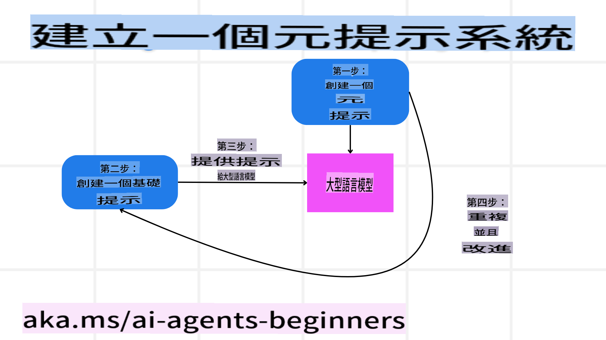

# 建立值得信賴的人工智能代理

## 簡介

本課程將涵蓋：

- 如何構建和部署安全且有效的人工智能代理
- 開發人工智能代理時的重要安全考量
- 如何在開發人工智能代理時維護數據和用戶隱私

## 學習目標

完成本課程後，您將能夠：

- 識別並減輕創建人工智能代理時的風險
- 實施安全措施，確保數據和訪問得到妥善管理
- 創建能維護數據隱私並提供優質用戶體驗的人工智能代理

## 安全性

首先，我們來探討如何構建安全的代理應用程序。安全性意味著人工智能代理按照設計執行。作為代理應用程序的開發者，我們擁有一些方法和工具來最大化安全性：

### 構建元提示系統

如果您曾經使用大型語言模型（LLMs）構建人工智能應用程序，那麼您應該知道設計一個健全的系統提示或系統消息有多麼重要。這些提示確立了元規則、指令和指南，指導LLM如何與用戶和數據互動。

對於人工智能代理來說，系統提示更加重要，因為這些代理需要非常具體的指令來完成我們為其設計的任務。

為了創建可擴展的系統提示，我們可以使用元提示系統來構建我們應用中的一個或多個代理：



#### 第一步：創建元提示或模板提示

元提示將由LLM用於生成我們創建的代理的系統提示。我們將其設計為模板，以便在需要時能有效地創建多個代理。

以下是一個我們會給LLM的元提示示例：

```plaintext
You are an expert at creating AI agent assitants. 
You will be provided a company name, role, responsibilites and other
information that you will use to provide a system prompt for.
To create the system prompt, be descriptive as possible and provide a structure that a system using an LLM can better understand the role and responsibilites of the AI assistant. 
```

#### 第二步：創建基本提示

下一步是創建一個基本提示來描述人工智能代理。您應該包括代理的角色、代理將完成的任務以及代理的其他職責。

以下是一個示例：

```plaintext
You are a travel agent for Contoso Travel with that is great at booking flights for customers. To help customers you can perform the following tasks: lookup available flights, book flights, ask for preferences in seating and times for flights, cancel any previously booked flights and alert customers on any delays or cancellations of flights.  
```

#### 第三步：向LLM提供基本提示

現在，我們可以將元提示作為系統提示，並提供我們的基本提示來優化這個過程。

這將生成一個更適合指導我們人工智能代理的提示：

```markdown
**Company Name:** Contoso Travel  
**Role:** Travel Agent Assistant

**Objective:**  
You are an AI-powered travel agent assistant for Contoso Travel, specializing in booking flights and providing exceptional customer service. Your main goal is to assist customers in finding, booking, and managing their flights, all while ensuring that their preferences and needs are met efficiently.

**Key Responsibilities:**

1. **Flight Lookup:**
    
    - Assist customers in searching for available flights based on their specified destination, dates, and any other relevant preferences.
    - Provide a list of options, including flight times, airlines, layovers, and pricing.
2. **Flight Booking:**
    
    - Facilitate the booking of flights for customers, ensuring that all details are correctly entered into the system.
    - Confirm bookings and provide customers with their itinerary, including confirmation numbers and any other pertinent information.
3. **Customer Preference Inquiry:**
    
    - Actively ask customers for their preferences regarding seating (e.g., aisle, window, extra legroom) and preferred times for flights (e.g., morning, afternoon, evening).
    - Record these preferences for future reference and tailor suggestions accordingly.
4. **Flight Cancellation:**
    
    - Assist customers in canceling previously booked flights if needed, following company policies and procedures.
    - Notify customers of any necessary refunds or additional steps that may be required for cancellations.
5. **Flight Monitoring:**
    
    - Monitor the status of booked flights and alert customers in real-time about any delays, cancellations, or changes to their flight schedule.
    - Provide updates through preferred communication channels (e.g., email, SMS) as needed.

**Tone and Style:**

- Maintain a friendly, professional, and approachable demeanor in all interactions with customers.
- Ensure that all communication is clear, informative, and tailored to the customer's specific needs and inquiries.

**User Interaction Instructions:**

- Respond to customer queries promptly and accurately.
- Use a conversational style while ensuring professionalism.
- Prioritize customer satisfaction by being attentive, empathetic, and proactive in all assistance provided.

**Additional Notes:**

- Stay updated on any changes to airline policies, travel restrictions, and other relevant information that could impact flight bookings and customer experience.
- Use clear and concise language to explain options and processes, avoiding jargon where possible for better customer understanding.

This AI assistant is designed to streamline the flight booking process for customers of Contoso Travel, ensuring that all their travel needs are met efficiently and effectively.

```

#### 第四步：迭代和改進

這個元提示系統的價值在於能夠更輕鬆地擴展多個代理的提示創建，同時隨著時間推移改進您的提示。很少有提示能在第一次就完全適用於您的全部使用場景。通過更改基本提示並運行它來進行小的調整和改進，您將能夠比較和評估結果。

## 理解威脅  

要構建值得信賴的人工智能代理，理解並減輕對人工智能代理的風險和威脅至關重要。我們來看看人工智能代理面臨的一些不同威脅，以及如何更好地計劃和準備應對這些威脅。


### 任務和指令

**描述：** 攻擊者試圖通過提示或操縱輸入來更改人工智能代理的指令或目標。

**緩解措施：** 執行驗證檢查和輸入過濾器，以在AI代理處理之前檢測潛在的危險提示。由於這些攻擊通常需要與代理頻繁交互，限制對話輪次也是防止此類攻擊的一種方法。

### 訪問關鍵系統

**描述：** 如果人工智能代理可以訪問存儲敏感數據的系統和服務，攻擊者可能會破壞代理與這些服務之間的通信。這些可能是直接攻擊，也可能是通過代理間接獲取這些系統信息的嘗試。

**緩解措施：** 人工智能代理應僅基於需要訪問系統，以防止此類攻擊。代理與系統之間的通信也應該是安全的。實施身份驗證和訪問控制是保護這些信息的另一種方法。

### 資源和服務過載

**描述：** 人工智能代理可以訪問不同的工具和服務來完成任務。攻擊者可能利用這一能力，通過人工智能代理發送大量請求來攻擊這些服務，可能導致系統故障或高成本。

**緩解措施：** 實施策略以限制人工智能代理向服務發出的請求數量。限制與人工智能代理的對話輪次和請求次數是防止此類攻擊的另一種方法。

### 知識庫污染

**描述：** 這種攻擊不是直接針對人工智能代理，而是針對代理將使用的知識庫和其他服務。這可能涉及破壞代理將用於完成任務的數據或信息，導致對用戶的偏頗或非預期回應。

**緩解措施：** 定期驗證人工智能代理在工作流中使用的數據。確保對這些數據的訪問是安全的，並且只有受信任的人員才能更改，以避免此類攻擊。

### 錯誤傳播

**描述：** 人工智能代理訪問各種工具和服務來完成任務。攻擊者引發的錯誤可能導致與人工智能代理連接的其他系統失效，使攻擊範圍擴大且更難排查。

**緩解措施：** 一種避免此問題的方法是讓人工智能代理在受限環境中運行，例如在Docker容器中執行任務，以防止直接系統攻擊。創建回退機制和重試邏輯，當某些系統響應錯誤時，可以防止更大範圍的系統故障。

## 人工參與流程

另一種構建值得信賴的人工智能代理系統的有效方法是使用人工參與流程。這創建了一個流程，用戶可以在代理運行過程中提供反饋。用戶本質上成為多代理系統中的一個代理，通過批准或終止運行過程來進行干預。


以下是使用AutoGen展示如何實現這一概念的代碼片段：

```python

# Create the agents.
model_client = OpenAIChatCompletionClient(model="gpt-4o-mini")
assistant = AssistantAgent("assistant", model_client=model_client)
user_proxy = UserProxyAgent("user_proxy", input_func=input)  # Use input() to get user input from console.

# Create the termination condition which will end the conversation when the user says "APPROVE".
termination = TextMentionTermination("APPROVE")

# Create the team.
team = RoundRobinGroupChat([assistant, user_proxy], termination_condition=termination)

# Run the conversation and stream to the console.
stream = team.run_stream(task="Write a 4-line poem about the ocean.")
# Use asyncio.run(...) when running in a script.
await Console(stream)

```

**免責聲明**:  
本文件使用機器翻譯人工智能服務進行翻譯。我們致力於提供準確的翻譯，但請注意，自動翻譯可能包含錯誤或不準確之處。原始語言的文件應被視為權威來源。對於關鍵信息，建議使用專業的人手翻譯。我們對因使用本翻譯而引起的任何誤解或錯誤解釋不承擔責任。