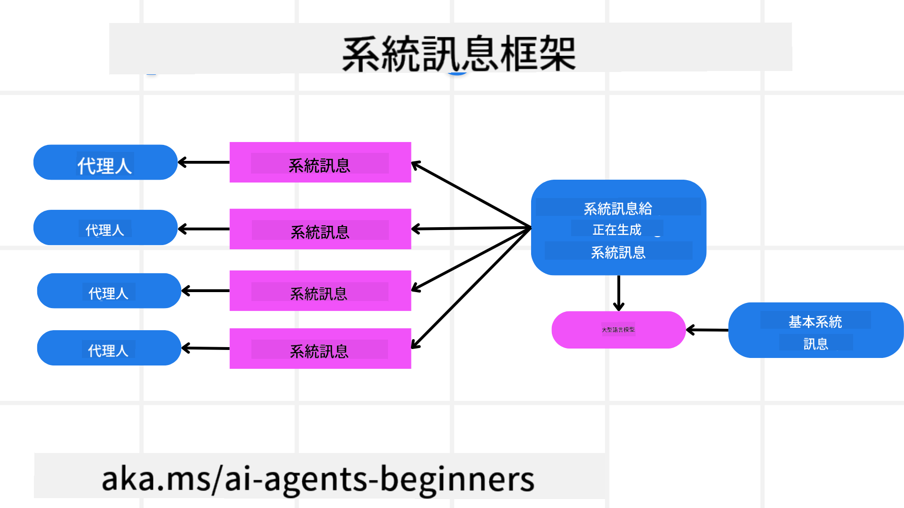
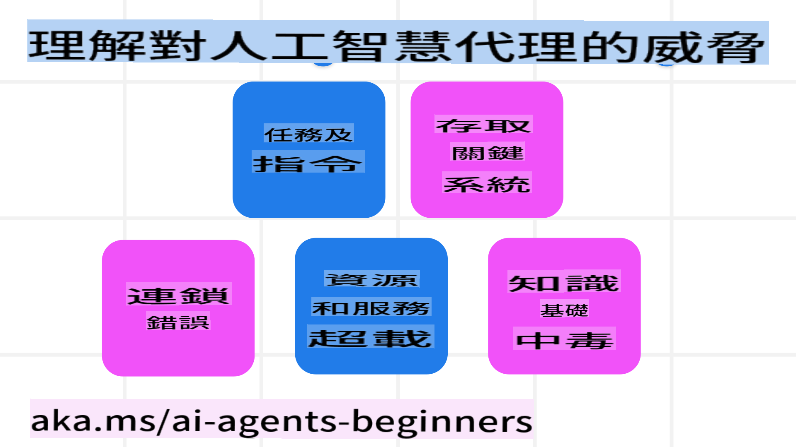
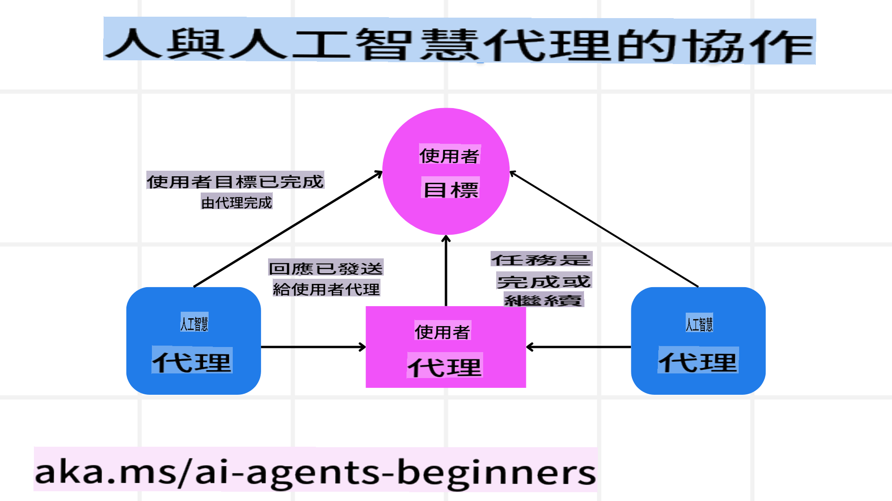

<!--
CO_OP_TRANSLATOR_METADATA:
{
  "original_hash": "c069d7ff0feca3027f88819355866ca1",
  "translation_date": "2025-03-28T11:57:37+00:00",
  "source_file": "06-building-trustworthy-agents\\README.md",
  "language_code": "hk"
}
-->
[](https://youtu.be/iZKkMEGBCUQ?si=Q-kEbcyHUMPoHp8L)

> _(點擊上方圖片觀看本課程影片)_

# 建立可信AI代理

## 簡介

本課程將涵蓋：

- 如何建立並部署安全且有效的AI代理
- 開發AI代理時的重要安全考量
- 如何在開發AI代理時維護數據和用戶隱私

## 學習目標

完成本課程後，你將能夠：

- 識別並減輕在建立AI代理時的風險
- 實施安全措施以確保數據和訪問得到妥善管理
- 創建能維護數據隱私並提供高品質用戶體驗的AI代理

## 安全性

首先，我們來探討如何建立安全的代理應用程序。安全性意味著AI代理能按設計執行。作為代理應用的開發者，我們有方法和工具來最大化安全性：

### 建立系統消息框架

如果你曾使用大型語言模型（LLMs）開發AI應用，你會知道設計穩健的系統提示或系統消息的重要性。這些提示設定了LLM如何與用戶和數據交互的規則、指示和指南。

對於AI代理來說，系統提示更為重要，因為AI代理需要非常具體的指令來完成我們設計的任務。

要創建可擴展的系統提示，我們可以使用系統消息框架來構建應用中的一個或多個代理：



#### 步驟1：創建元系統消息

元提示將由LLM用來生成我們創建的代理的系統提示。我們將其設計為模板，以便在需要時能有效地創建多個代理。

以下是一個元系統消息的示例：

```plaintext
You are an expert at creating AI agent assistants. 
You will be provided a company name, role, responsibilities and other
information that you will use to provide a system prompt for.
To create the system prompt, be descriptive as possible and provide a structure that a system using an LLM can better understand the role and responsibilities of the AI assistant. 
```

#### 步驟2：創建基本提示

下一步是創建基本提示來描述AI代理。你應該包含代理的角色、代理將完成的任務，以及代理的其他責任。

以下是一個示例：

```plaintext
You are a travel agent for Contoso Travel that is great at booking flights for customers. To help customers you can perform the following tasks: lookup available flights, book flights, ask for preferences in seating and times for flights, cancel any previously booked flights and alert customers on any delays or cancellations of flights.  
```

#### 步驟3：向LLM提供基本系統消息

現在我們可以通過將元系統消息作為系統消息並提供基本系統消息來優化該系統消息。

這將生成更適合指導我們AI代理的系統消息：

```markdown
**Company Name:** Contoso Travel  
**Role:** Travel Agent Assistant

**Objective:**  
You are an AI-powered travel agent assistant for Contoso Travel, specializing in booking flights and providing exceptional customer service. Your main goal is to assist customers in finding, booking, and managing their flights, all while ensuring that their preferences and needs are met efficiently.

**Key Responsibilities:**

1. **Flight Lookup:**
    
    - Assist customers in searching for available flights based on their specified destination, dates, and any other relevant preferences.
    - Provide a list of options, including flight times, airlines, layovers, and pricing.
2. **Flight Booking:**
    
    - Facilitate the booking of flights for customers, ensuring that all details are correctly entered into the system.
    - Confirm bookings and provide customers with their itinerary, including confirmation numbers and any other pertinent information.
3. **Customer Preference Inquiry:**
    
    - Actively ask customers for their preferences regarding seating (e.g., aisle, window, extra legroom) and preferred times for flights (e.g., morning, afternoon, evening).
    - Record these preferences for future reference and tailor suggestions accordingly.
4. **Flight Cancellation:**
    
    - Assist customers in canceling previously booked flights if needed, following company policies and procedures.
    - Notify customers of any necessary refunds or additional steps that may be required for cancellations.
5. **Flight Monitoring:**
    
    - Monitor the status of booked flights and alert customers in real-time about any delays, cancellations, or changes to their flight schedule.
    - Provide updates through preferred communication channels (e.g., email, SMS) as needed.

**Tone and Style:**

- Maintain a friendly, professional, and approachable demeanor in all interactions with customers.
- Ensure that all communication is clear, informative, and tailored to the customer's specific needs and inquiries.

**User Interaction Instructions:**

- Respond to customer queries promptly and accurately.
- Use a conversational style while ensuring professionalism.
- Prioritize customer satisfaction by being attentive, empathetic, and proactive in all assistance provided.

**Additional Notes:**

- Stay updated on any changes to airline policies, travel restrictions, and other relevant information that could impact flight bookings and customer experience.
- Use clear and concise language to explain options and processes, avoiding jargon where possible for better customer understanding.

This AI assistant is designed to streamline the flight booking process for customers of Contoso Travel, ensuring that all their travel needs are met efficiently and effectively.

```

#### 步驟4：迭代並改進

這個系統消息框架的價值在於能更容易地擴展多個代理的系統消息創建，並隨著時間改進你的系統消息。很少有系統消息能在第一次完全符合你的使用情境。通過更改基本系統消息並運行系統，你可以進行小的調整和改進，從而比較和評估結果。

## 理解威脅

要建立可信的AI代理，理解並減輕對AI代理的風險和威脅非常重要。我們來看看一些對AI代理的不同威脅，以及如何更好地計劃和應對。



### 任務與指令

**描述：** 攻擊者試圖通過提示或操縱輸入來更改AI代理的指令或目標。

**緩解措施：** 執行驗證檢查和輸入過濾器以檢測潛在危險的提示，並在它們被AI代理處理之前加以阻止。由於這些攻擊通常需要頻繁與代理交互，限制對話的回合數是防止此類攻擊的另一種方法。

### 訪問關鍵系統

**描述：** 如果AI代理能訪問存儲敏感數據的系統和服務，攻擊者可能會破壞代理與這些服務之間的通信。這可能是直接攻擊或間接試圖通過代理獲取系統信息。

**緩解措施：** AI代理應僅在需要時訪問系統，以防止此類攻擊。代理與系統之間的通信應保持安全。實施身份驗證和訪問控制也是保護此信息的另一種方法。

### 資源與服務過載

**描述：** AI代理可以訪問不同的工具和服務來完成任務。攻擊者可能利用此功能通過AI代理向這些服務發送大量請求，導致系統故障或高成本。

**緩解措施：** 實施策略以限制AI代理向服務發送請求的數量。限制代理的對話回合數和請求數量也是防止此類攻擊的另一種方法。

### 知識庫污染

**描述：** 此類攻擊並不直接針對AI代理，而是針對代理使用的知識庫和其他服務。這可能包括損害代理用來完成任務的數據或信息，導致對用戶的偏頗或非預期的回應。

**緩解措施：** 定期驗證AI代理在工作流程中使用的數據。確保只有可信任的人員可以修改此數據並保證其安全，以避免此類攻擊。

### 錯誤的連鎖效應

**描述：** AI代理訪問各種工具和服務來完成任務。攻擊者引發的錯誤可能導致其他系統的故障，使攻擊範圍擴大並更難排查。

**緩解措施：** 一種避免此類問題的方法是讓AI代理在受限環境中運行，例如在Docker容器中執行任務，以防止直接的系統攻擊。創建備援機制和重試邏輯以應對某些系統返回錯誤時也是防止更大範圍系統故障的另一種方法。

## 人工干預

另一種有效建立可信AI代理系統的方法是使用人工干預。這創建了一種流程，讓用戶能在代理執行過程中提供反饋。用戶本質上在多代理系統中充當代理，通過批准或終止運行過程來提供支持。



以下是一段使用AutoGen展示此概念的代碼片段：

```python

# Create the agents.
model_client = OpenAIChatCompletionClient(model="gpt-4o-mini")
assistant = AssistantAgent("assistant", model_client=model_client)
user_proxy = UserProxyAgent("user_proxy", input_func=input)  # Use input() to get user input from console.

# Create the termination condition which will end the conversation when the user says "APPROVE".
termination = TextMentionTermination("APPROVE")

# Create the team.
team = RoundRobinGroupChat([assistant, user_proxy], termination_condition=termination)

# Run the conversation and stream to the console.
stream = team.run_stream(task="Write a 4-line poem about the ocean.")
# Use asyncio.run(...) when running in a script.
await Console(stream)

```

## 結論

建立可信AI代理需要謹慎設計、穩健的安全措施以及持續的迭代。通過實施結構化的元提示系統、理解潛在威脅並應用緩解策略，開發者可以創建既安全又有效的AI代理。此外，採用人工干預方法能確保AI代理保持符合用戶需求，同時將風險降到最低。隨著AI的持續發展，對安全、隱私和道德考量保持主動態度將是促進AI驅動系統可信度和可靠性的關鍵。

## 其他資源

- <a href="https://learn.microsoft.com/azure/ai-studio/responsible-use-of-ai-overview" target="_blank">負責任AI概述</a>
- <a href="https://learn.microsoft.com/azure/ai-studio/concepts/evaluation-approach-gen-ai" target="_blank">生成式AI模型和AI應用的評估方法</a>
- <a href="https://learn.microsoft.com/azure/ai-services/openai/concepts/system-message?context=%2Fazure%2Fai-studio%2Fcontext%2Fcontext&tabs=top-techniques" target="_blank">安全系統消息</a>
- <a href="https://blogs.microsoft.com/wp-content/uploads/prod/sites/5/2022/06/Microsoft-RAI-Impact-Assessment-Template.pdf?culture=en-us&country=us" target="_blank">風險評估模板</a>

## 上一課程

[Agentic RAG](../05-agentic-rag/README.md)

## 下一課程

[規劃設計模式](../07-planning-design/README.md)

**免責聲明**：  
本文件已使用人工智能翻譯服務 [Co-op Translator](https://github.com/Azure/co-op-translator) 進行翻譯。我們致力於確保準確性，但請注意，自動翻譯可能包含錯誤或不準確之處。應以原文文件為權威來源。對於關鍵信息，建議使用專業的人工作翻譯。我們對因使用此翻譯而引起的任何誤解或誤讀概不負責。