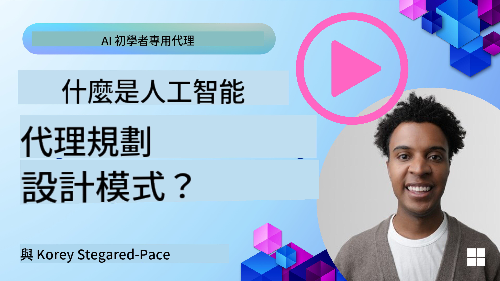
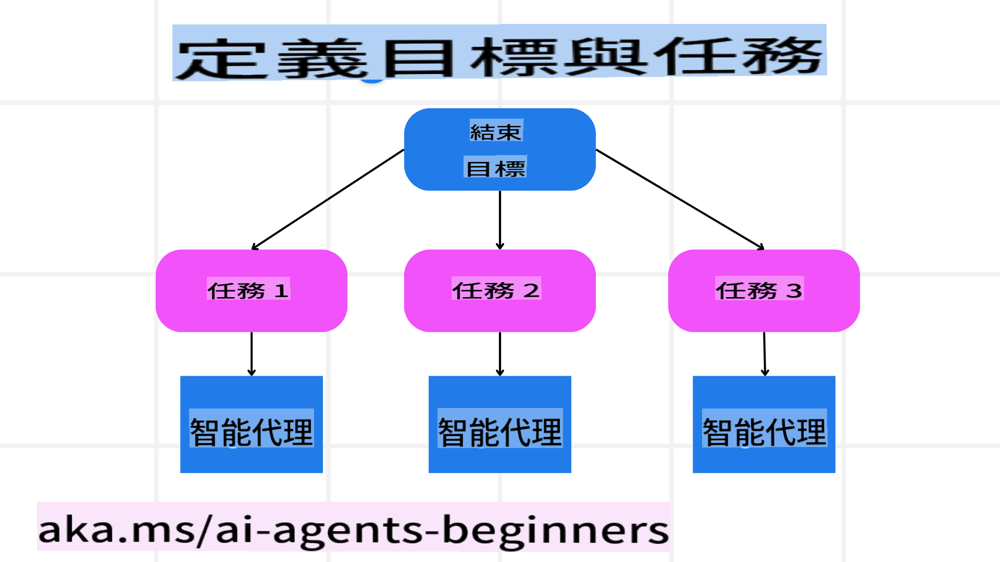

<!--
CO_OP_TRANSLATOR_METADATA:
{
  "original_hash": "8dd9a05d4dc18d3ff510e68e3798a080",
  "translation_date": "2025-03-28T12:00:07+00:00",
  "source_file": "07-planning-design\\README.md",
  "language_code": "hk"
}
-->
[](https://youtu.be/kPfJ2BrBCMY?si=9pYpPXp0sSbK91Dr)

> _(點擊上方圖片觀看本課程影片)_

# 計劃設計

## 簡介

本課程將涵蓋以下內容：

* 定義明確的整體目標，並將複雜任務分解為可管理的子任務。
* 利用結構化輸出以獲得更可靠且易於機器讀取的回應。
* 採用事件驅動的方式來處理動態任務和意外輸入。

## 學習目標

完成本課程後，您將了解：

* 如何為 AI 智能體設定清晰的整體目標，確保它明確知道需要完成的任務。
* 將複雜任務分解為可管理的子任務，並將它們組織成合理的順序。
* 配備智能體所需的工具（例如搜尋工具或數據分析工具），決定何時以及如何使用這些工具，並處理可能出現的突發情況。
* 評估子任務結果，衡量表現，並通過迭代行動來改善最終輸出。

## 定義整體目標並分解任務



大多數現實世界的任務都過於複雜，無法在一步內完成。AI 智能體需要一個簡潔的目標來指導其計劃和行動。例如，考慮以下目標：

    "生成一個三天的旅行行程。"

雖然目標陳述簡單，但仍需進一步完善。目標越清晰，智能體（以及任何人類協作者）越能專注於達成正確的結果，例如生成包含航班選項、酒店推薦和活動建議的完整行程。

### 任務分解

將大型或複雜的任務分解為較小的、目標導向的子任務，能讓它更易於管理。
以旅行行程為例，可以將目標分解為以下子任務：

* 航班預訂
* 酒店預訂
* 租車安排
* 個性化設置

每個子任務都可以由專門的智能體或流程處理。例如，一個智能體可能專門負責搜尋最優惠的航班，另一個則專注於酒店預訂，依此類推。一個協調或“下游”智能體可以將這些結果整合成一個完整的行程供最終用戶使用。

這種模塊化方法還允許逐步改進。例如，您可以添加專門的智能體來提供餐飲推薦或當地活動建議，並隨時間推進改進行程。

### 結構化輸出

大型語言模型（LLMs）能生成結構化輸出（例如 JSON），這對於下游智能體或服務解析和處理特別有用。在多智能體場景中，我們可以在接收到計劃輸出後，根據這些結構化數據執行後續任務。請參考以下簡介。

以下 Python 代碼片段展示了一個簡單的計劃智能體如何將目標分解為子任務並生成結構化計劃：

```python
from pydantic import BaseModel
from enum import Enum
from typing import List, Optional, Union
import json
import os
from typing import Optional
from pprint import pprint
from autogen_core.models import UserMessage, SystemMessage, AssistantMessage
from autogen_ext.models.azure import AzureAIChatCompletionClient
from azure.core.credentials import AzureKeyCredential

class AgentEnum(str, Enum):
    FlightBooking = "flight_booking"
    HotelBooking = "hotel_booking"
    CarRental = "car_rental"
    ActivitiesBooking = "activities_booking"
    DestinationInfo = "destination_info"
    DefaultAgent = "default_agent"
    GroupChatManager = "group_chat_manager"

# Travel SubTask Model
class TravelSubTask(BaseModel):
    task_details: str
    assigned_agent: AgentEnum  # we want to assign the task to the agent

class TravelPlan(BaseModel):
    main_task: str
    subtasks: List[TravelSubTask]
    is_greeting: bool

client = AzureAIChatCompletionClient(
    model="gpt-4o-mini",
    endpoint="https://models.inference.ai.azure.com",
    # To authenticate with the model you will need to generate a personal access token (PAT) in your GitHub settings.
    # Create your PAT token by following instructions here: https://docs.github.com/en/authentication/keeping-your-account-and-data-secure/managing-your-personal-access-tokens
    credential=AzureKeyCredential(os.environ["GITHUB_TOKEN"]),
    model_info={
        "json_output": False,
        "function_calling": True,
        "vision": True,
        "family": "unknown",
    },
)

# Define the user message
messages = [
    SystemMessage(content="""You are an planner agent.
    Your job is to decide which agents to run based on the user's request.
                      Provide your response in JSON format with the following structure:
{'main_task': 'Plan a family trip from Singapore to Melbourne.',
 'subtasks': [{'assigned_agent': 'flight_booking',
               'task_details': 'Book round-trip flights from Singapore to '
                               'Melbourne.'}
    Below are the available agents specialised in different tasks:
    - FlightBooking: For booking flights and providing flight information
    - HotelBooking: For booking hotels and providing hotel information
    - CarRental: For booking cars and providing car rental information
    - ActivitiesBooking: For booking activities and providing activity information
    - DestinationInfo: For providing information about destinations
    - DefaultAgent: For handling general requests""", source="system"),
    UserMessage(
        content="Create a travel plan for a family of 2 kids from Singapore to Melboune", source="user"),
]

response = await client.create(messages=messages, extra_create_args={"response_format": 'json_object'})

response_content: Optional[str] = response.content if isinstance(
    response.content, str) else None
if response_content is None:
    raise ValueError("Response content is not a valid JSON string" )

pprint(json.loads(response_content))

# # Ensure the response content is a valid JSON string before loading it
# response_content: Optional[str] = response.content if isinstance(
#     response.content, str) else None
# if response_content is None:
#     raise ValueError("Response content is not a valid JSON string")

# # Print the response content after loading it as JSON
# pprint(json.loads(response_content))

# Validate the response content with the MathReasoning model
# TravelPlan.model_validate(json.loads(response_content))
```

### 使用多智能體協作的計劃智能體

在此示例中，一個語義路由智能體接收到用戶請求（例如，“我需要一個旅行酒店計劃。”）。

計劃者接著進行以下步驟：

* 接收酒店計劃：計劃者接收用戶的消息，並根據系統提示（包括可用智能體的詳細信息）生成結構化的旅行計劃。
* 列出智能體及其工具：智能體註冊表保存了一份智能體列表（例如，航班、酒店、租車和活動），以及它們提供的功能或工具。
* 將計劃分配給相關智能體：根據子任務的數量，計劃者要麼直接將消息發送給專門智能體（單任務場景），要麼通過群聊管理器協調多智能體合作。
* 總結結果：最後，計劃者總結生成的計劃以供清晰呈現。

以下 Python 代碼示例展示了這些步驟：

```python

from pydantic import BaseModel

from enum import Enum
from typing import List, Optional, Union

class AgentEnum(str, Enum):
    FlightBooking = "flight_booking"
    HotelBooking = "hotel_booking"
    CarRental = "car_rental"
    ActivitiesBooking = "activities_booking"
    DestinationInfo = "destination_info"
    DefaultAgent = "default_agent"
    GroupChatManager = "group_chat_manager"

# Travel SubTask Model

class TravelSubTask(BaseModel):
    task_details: str
    assigned_agent: AgentEnum # we want to assign the task to the agent

class TravelPlan(BaseModel):
    main_task: str
    subtasks: List[TravelSubTask]
    is_greeting: bool
import json
import os
from typing import Optional

from autogen_core.models import UserMessage, SystemMessage, AssistantMessage
from autogen_ext.models.openai import AzureOpenAIChatCompletionClient

# Create the client with type-checked environment variables

client = AzureOpenAIChatCompletionClient(
    azure_deployment=os.getenv("AZURE_OPENAI_DEPLOYMENT_NAME"),
    model=os.getenv("AZURE_OPENAI_DEPLOYMENT_NAME"),
    api_version=os.getenv("AZURE_OPENAI_API_VERSION"),
    azure_endpoint=os.getenv("AZURE_OPENAI_ENDPOINT"),
    api_key=os.getenv("AZURE_OPENAI_API_KEY"),
)

from pprint import pprint

# Define the user message

messages = [
    SystemMessage(content="""You are an planner agent.
    Your job is to decide which agents to run based on the user's request.
    Below are the available agents specialized in different tasks:
    - FlightBooking: For booking flights and providing flight information
    - HotelBooking: For booking hotels and providing hotel information
    - CarRental: For booking cars and providing car rental information
    - ActivitiesBooking: For booking activities and providing activity information
    - DestinationInfo: For providing information about destinations
    - DefaultAgent: For handling general requests""", source="system"),
    UserMessage(content="Create a travel plan for a family of 2 kids from Singapore to Melbourne", source="user"),
]

response = await client.create(messages=messages, extra_create_args={"response_format": TravelPlan})

# Ensure the response content is a valid JSON string before loading it

response_content: Optional[str] = response.content if isinstance(response.content, str) else None
if response_content is None:
    raise ValueError("Response content is not a valid JSON string")

# Print the response content after loading it as JSON

pprint(json.loads(response_content))
```

上面代碼的輸出示例展示了如何使用結構化輸出將任務分配給 `assigned_agent`，並向最終用戶總結旅行計劃。

```json
{
    "is_greeting": "False",
    "main_task": "Plan a family trip from Singapore to Melbourne.",
    "subtasks": [
        {
            "assigned_agent": "flight_booking",
            "task_details": "Book round-trip flights from Singapore to Melbourne."
        },
        {
            "assigned_agent": "hotel_booking",
            "task_details": "Find family-friendly hotels in Melbourne."
        },
        {
            "assigned_agent": "car_rental",
            "task_details": "Arrange a car rental suitable for a family of four in Melbourne."
        },
        {
            "assigned_agent": "activities_booking",
            "task_details": "List family-friendly activities in Melbourne."
        },
        {
            "assigned_agent": "destination_info",
            "task_details": "Provide information about Melbourne as a travel destination."
        }
    ]
}
```

包含上述代碼示例的 notebook 可在 [這裡](../../../07-planning-design/07-autogen.ipynb) 找到。

### 迭代計劃

某些任務需要來回反覆或重新計劃，其中一個子任務的結果可能影響下一步。例如，如果智能體在預訂航班時發現意外的數據格式，它可能需要在繼續酒店預訂之前調整策略。

此外，用戶反饋（例如用戶選擇更早的航班）可能觸發部分重新計劃。這種動態、迭代的方法確保最終解決方案符合現實世界的限制和用戶不斷變化的偏好。

例如，以下代碼展示了樣例：

```python
from autogen_core.models import UserMessage, SystemMessage, AssistantMessage
#.. same as previous code and pass on the user history, current plan
messages = [
    SystemMessage(content="""You are a planner agent to optimize the
    Your job is to decide which agents to run based on the user's request.
    Below are the available agents specialized in different tasks:
    - FlightBooking: For booking flights and providing flight information
    - HotelBooking: For booking hotels and providing hotel information
    - CarRental: For booking cars and providing car rental information
    - ActivitiesBooking: For booking activities and providing activity information
    - DestinationInfo: For providing information about destinations
    - DefaultAgent: For handling general requests""", source="system"),
    UserMessage(content="Create a travel plan for a family of 2 kids from Singapore to Melbourne", source="user"),
    AssistantMessage(content=f"Previous travel plan - {TravelPlan}", source="assistant")
]
# .. re-plan and send the tasks to respective agents
```

如需更全面的計劃，請查看 Magnetic One 解決方案。

## 總結

本文介紹了如何創建一個能動態選擇定義智能體的計劃者。計劃者的輸出會分解任務並分配給智能體執行。假設智能體能訪問完成任務所需的功能/工具。除了智能體外，您還可以加入其他模式，例如反思、總結器或輪詢聊天等，以進一步定制功能。

## 其他資源

* AutoGen Magnetic One - 一個通用的多智能體系統，用於解決複雜任務，並在多個具有挑戰性的智能體基準測試中取得了令人印象深刻的成果。參考：

. 在此實現中，協調器創建特定於任務的計劃，並將這些任務委派給可用的智能體。除了計劃外，協調器還採用了跟踪機制來監控任務進度並在需要時重新計劃。

## 上一課程

[構建可信賴的 AI 智能體](../06-building-trustworthy-agents/README.md)

## 下一課程

[多智能體設計模式](../08-multi-agent/README.md)

**免責聲明**:  
本文件使用AI翻譯服務[Co-op Translator](https://github.com/Azure/co-op-translator)進行翻譯。我們致力於提供準確的翻譯，但請注意，自動翻譯可能包含錯誤或不準確之處。原文檔的母語版本應被視為權威來源。對於關鍵信息，建議尋求專業人工翻譯。我們對因使用此翻譯而引起的任何誤解或誤釋不承擔責任。