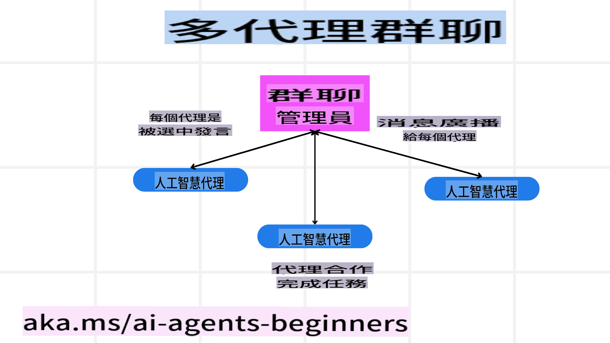
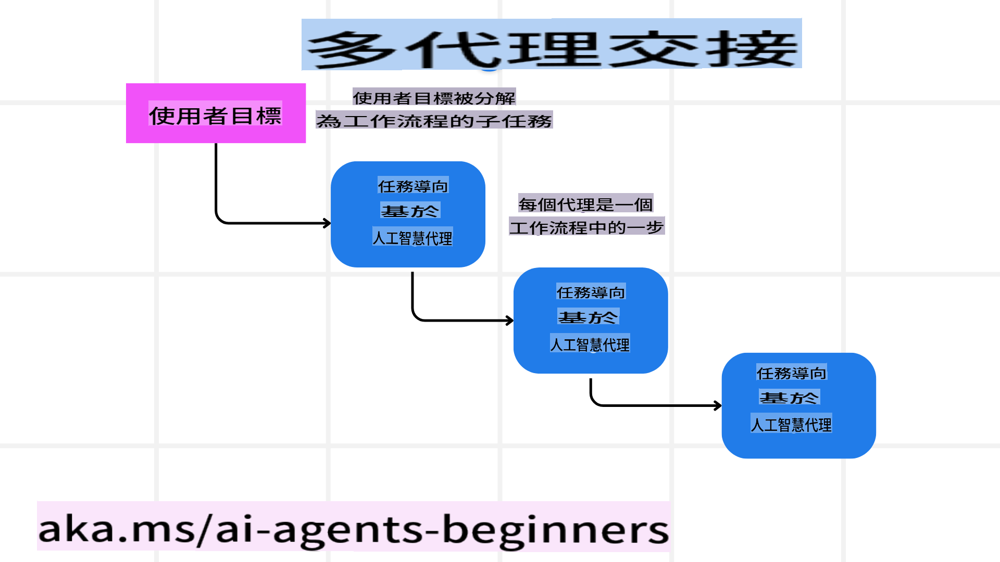
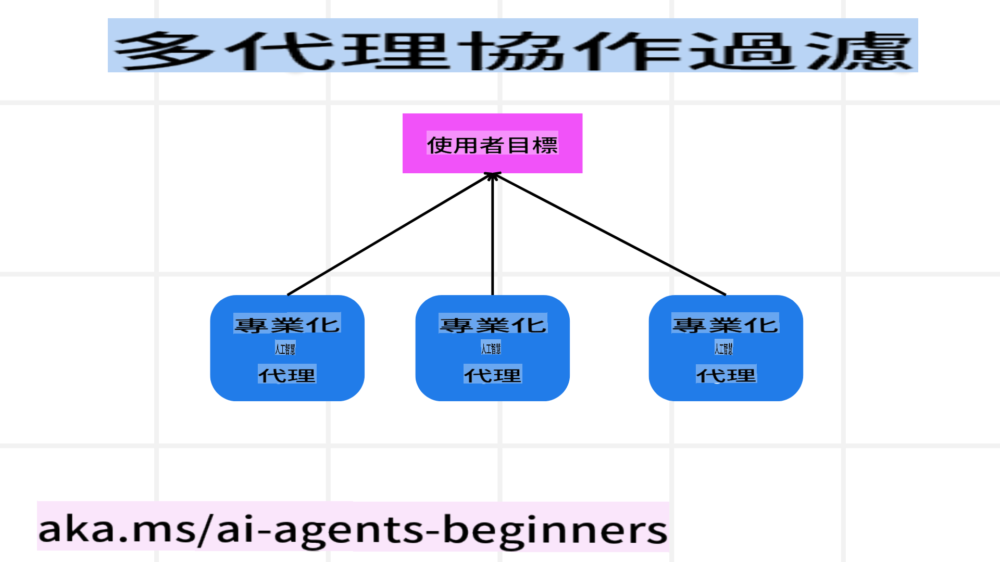

<!--
CO_OP_TRANSLATOR_METADATA:
{
  "original_hash": "bdb0a92e5a437d5fa985a6863f4a836c",
  "translation_date": "2025-03-28T12:02:36+00:00",
  "source_file": "08-multi-agent\\README.md",
  "language_code": "hk"
}
-->

> _(點擊上方圖片觀看本課視頻)_

# 多代理設計模式

當你開始處理涉及多個代理的項目時，你需要考慮多代理設計模式。然而，何時切換到多代理模式以及其優勢可能並不立即清晰。

## 簡介

在本課中，我們將回答以下問題：

- 哪些情景適合使用多代理？
- 使用多代理相比單一代理執行多項任務有什麼優勢？
- 實現多代理設計模式的基本構建塊是什麼？
- 我們如何了解多個代理之間的互動？

## 學習目標

學完本課後，你應該能夠：

- 辨識哪些情景適合使用多代理。
- 認識使用多代理相比單一代理的優勢。
- 理解實現多代理設計模式的基本構建塊。

更大的圖景是什麼？

*多代理是一種設計模式，允許多個代理協同合作以達成共同目標*。

這種模式廣泛應用於各個領域，包括機器人、自主系統和分布式計算。

## 適用多代理的情景

那麼，哪些情景適合使用多代理呢？答案是，有許多情景特別適合使用多代理，尤其是在以下情況：

- **大工作量**：大工作量可以分解成小任務並分配給不同代理，從而實現並行處理並加快完成速度。例如，處理大型數據任務就是一個典型例子。
- **複雜任務**：複雜任務可以像大工作量一樣分解成小任務，並分配給擅長特定方面的代理。例如，自主車輛中不同代理分別負責導航、障礙物檢測和與其他車輛通信。
- **多樣化專業知識**：不同代理具備多樣化的專業知識，能比單一代理更有效地處理任務的不同方面。例如，在醫療領域，代理可分別管理診斷、治療計劃和病人監測。

## 使用多代理相比單一代理的優勢

單一代理系統在處理簡單任務時可能表現良好，但對於更複雜的任務，多代理能提供以下幾個優勢：

- **專業化**：每個代理可以專注於特定任務。單一代理缺乏專業化，可能面對複雜任務時無法有效應對，甚至執行不適合的任務。
- **可擴展性**：相比過度負載單一代理，增加代理更容易擴展系統。
- **容錯性**：如果一個代理失效，其他代理仍能繼續運行，確保系統可靠性。

舉個例子，假設要幫用戶預訂旅行。一個單一代理系統需要處理旅行預訂的所有方面，包括找航班、訂酒店和租車。這要求單一代理擁有處理所有這些任務的工具，導致系統複雜且難以維護和擴展。而多代理系統則可讓不同代理分別專注於找航班、訂酒店和租車，使系統更模塊化、更易維護且更具可擴展性。

這可以類比為一個家庭式旅行社與連鎖旅行社的運作方式。家庭式旅行社由一個代理處理所有旅行預訂事宜，而連鎖旅行社則由不同代理分別處理旅行預訂的各個方面。

## 實現多代理設計模式的基本構建塊

在實現多代理設計模式之前，你需要了解該模式的基本構建塊。

讓我們以幫用戶預訂旅行為例更具體地探討。在這種情景下，基本構建塊包括：

- **代理間通信**：找航班、訂酒店和租車的代理需要互相通信並分享用戶偏好和限制。你需要決定通信的協議和方式。具體而言，找航班的代理需要與訂酒店的代理通信，確保酒店的預訂日期與航班日期一致。這意味著代理需要共享用戶的旅行日期，因此你需要決定*哪些代理共享信息以及如何共享信息*。
- **協調機制**：代理需要協調行動以滿足用戶的偏好和限制。例如，用戶可能希望酒店靠近機場，而限制可能是租車只能在機場提供。這意味著訂酒店的代理需要與租車的代理協調，以確保滿足用戶的偏好和限制。你需要決定*代理如何協調行動*。
- **代理架構**：代理需要具備內部結構來做出決策並從與用戶的互動中學習。例如，找航班的代理需要具備內部結構來決定向用戶推薦哪些航班。這意味著你需要決定*代理如何做出決策並從與用戶的互動中學習*。代理學習和改進的例子包括找航班的代理可以使用機器學習模型，根據用戶的過往偏好推薦航班。
- **多代理互動的可見性**：你需要了解多個代理之間的互動情況。這意味著需要工具和技術來跟踪代理的活動和互動。例如，日誌和監控工具、可視化工具以及性能指標。
- **多代理模式**：有多種模式可以實現多代理系統，如集中式、分散式和混合架構。你需要選擇最適合你的使用場景的模式。
- **人類介入**：在大多數情況下，你會有一個人類介入環節，需要指導代理何時尋求人類干預。例如，用戶可能要求特定酒店或航班，而代理未推薦，或者要求在預訂航班或酒店前確認。

## 多代理互動的可見性

了解多個代理之間的互動非常重要。這種可見性對於調試、優化以及確保整體系統的有效性至關重要。為了實現這一點，你需要工具和技術來跟踪代理的活動和互動，例如日誌和監控工具、可視化工具以及性能指標。

例如，在幫用戶預訂旅行的情景中，你可以設置一個儀表板，顯示每個代理的狀態、用戶的偏好和限制，以及代理之間的互動。這個儀表板可以展示用戶的旅行日期、航班代理推薦的航班、酒店代理推薦的酒店，以及租車代理推薦的租車。這樣可以清楚地看到代理之間的互動，以及是否滿足了用戶的偏好和限制。

讓我們更詳細地看每個方面：

- **日誌和監控工具**：你需要為代理的每個行動進行日誌記錄。一條日誌條目可以存儲代理採取的行動、行動的時間以及行動的結果等信息。這些信息可以用於調試、優化等。
- **可視化工具**：可視化工具可以幫助你以更直觀的方式了解代理之間的互動。例如，你可以設計一個圖表展示代理之間的信息流。這可以幫助你識別系統中的瓶頸、低效以及其他問題。
- **性能指標**：性能指標可以幫助你追蹤多代理系統的有效性。例如，你可以追蹤完成任務所需的時間、每單位時間完成的任務數量，以及代理推薦的準確性。這些信息可以幫助你識別改進的領域並優化系統。

## 多代理模式

讓我們深入探討一些可以用來創建多代理應用的具體模式。以下是一些值得考慮的有趣模式：

### 群聊

當你希望創建一個多代理可以互相通信的群聊應用時，此模式非常有用。典型用例包括團隊協作、客戶支持和社交網絡。

在此模式中，每個代理代表群聊中的一個用戶，並通過消息協議交換信息。代理可以向群聊發送消息，接收群聊的消息，並回應其他代理的消息。

此模式可以使用集中式架構（所有消息通過中央服務器路由）或分散式架構（消息直接交換）來實現。

### 任務交接

當你希望創建一個多代理可以互相交接任務的應用時，此模式非常有用。

典型用例包括客戶支持、任務管理和工作流自動化。

在此模式中，每個代理代表工作流中的一個任務或步驟，並根據預定規則將任務交接給其他代理。

### 協作過濾

當你希望創建一個多代理可以協作為用戶提供推薦的應用時，此模式非常有用。

為什麼需要多代理協作？因為每個代理可以具備不同專業知識，並以不同方式為推薦過程做出貢獻。

例如，用戶希望獲得股市中最佳股票的推薦：

- **行業專家**：一個代理可以是某個特定行業的專家。
- **技術分析**：另一個代理可以是技術分析的專家。
- **基本分析**：還有一個代理可以是基本分析的專家。通過協作，這些代理可以為用戶提供更全面的推薦。

## 情景：退款流程

考慮一個客戶嘗試為某產品申請退款的情景，此過程可能涉及多個代理。我們可以將代理分為特定於退款流程的代理和可以在其他流程中使用的通用代理。

**特定於退款流程的代理**：

以下是一些可能涉及退款流程的代理：

- **客戶代理**：代表客戶並負責啟動退款流程。
- **賣家代理**：代表賣家並負責處理退款。
- **支付代理**：代表支付過程並負責退款到客戶的支付方式。
- **解決代理**：代表解決過程並負責解決退款過程中出現的任何問題。
- **合規代理**：代表合規過程並負責確保退款流程符合規章和政策。

**通用代理**：

這些代理可以在業務的其他部分使用。

- **物流代理**：代表物流過程並負責將產品退回給賣家。此代理既可用於退款流程，也可用於例如購買產品的一般物流過程。
- **反饋代理**：代表反饋過程並負責收集客戶的反饋。反饋可以隨時收集，而不僅限於退款過程。
- **升級代理**：代表升級過程並負責將問題升級到更高層次的支持。此類代理可用於任何需要升級問題的流程。
- **通知代理**：代表通知過程並負責在退款流程的各個階段向客戶發送通知。
- **分析代理**：代表分析過程並負責分析與退款流程相關的數據。
- **審核代理**：代表審核過程並負責審核退款流程，確保其正確進行。
- **報告代理**：代表報告過程並負責生成退款流程的報告。
- **知識代理**：代表知識過程並負責維護與退款流程相關的信息知識庫。此代理既可以了解退款，也可以了解業務的其他部分。
- **安全代理**：代表安全過程並負責確保退款流程的安全性。
- **質量代理**：代表質量過程並負責確保退款流程的質量。

上述列出的代理既包括退款流程的特定代理，也包括業務其他部分可以使用的通用代理。希望這能幫助你決定在你的多代理系統中使用哪些代理。

## 作業

設計一個客戶支持流程的多代理系統。確定流程中涉及的代理、它們的角色和職責，以及它們如何互相互動。同時考慮客戶支持流程特定的代理和業務其他部分可以使用的通用代理。

> 在閱讀以下解決方案前，先自己思考一下，你可能需要的代理比想像中更多。

> TIP: 考慮客戶支持流程的不同階段，同時也考慮任何系統可能需要的代理。

## 解決方案

[解決方案](./solution/solution.md)

## 知識檢查

問題：什麼時候應考慮使用多代理？

- [ ] A1: 當工作量小且任務簡單時。
- [ ] A2: 當工作量大時。
- [ ] A3: 當任務簡單時。

[解決方案測驗](./solution/solution-quiz.md)

## 總結

在本課中，我們探討了多代理設計模式，包括適用多代理的情景、使用多代理相比單一代理的優勢、實現多代理設計模式的基本構建塊，以及如何了解多個代理之間的互動。

## 附加資源

- ## 上一課

[設計規劃](../07-planning-design/README.md)

## 下一課

[AI代理中的元認知](../09-metacognition/README.md)

**免責聲明**:  
本文件使用人工智能翻譯服務 [Co-op Translator](https://github.com/Azure/co-op-translator) 進行翻譯。雖然我們致力於提供準確的翻譯，但請注意，自動翻譯可能包含錯誤或不準確之處。原始文件的母語版本應被視為權威來源。對於重要信息，建議尋求專業人工翻譯。我們不對因使用本翻譯而引起的任何誤解或誤釋承擔責任。