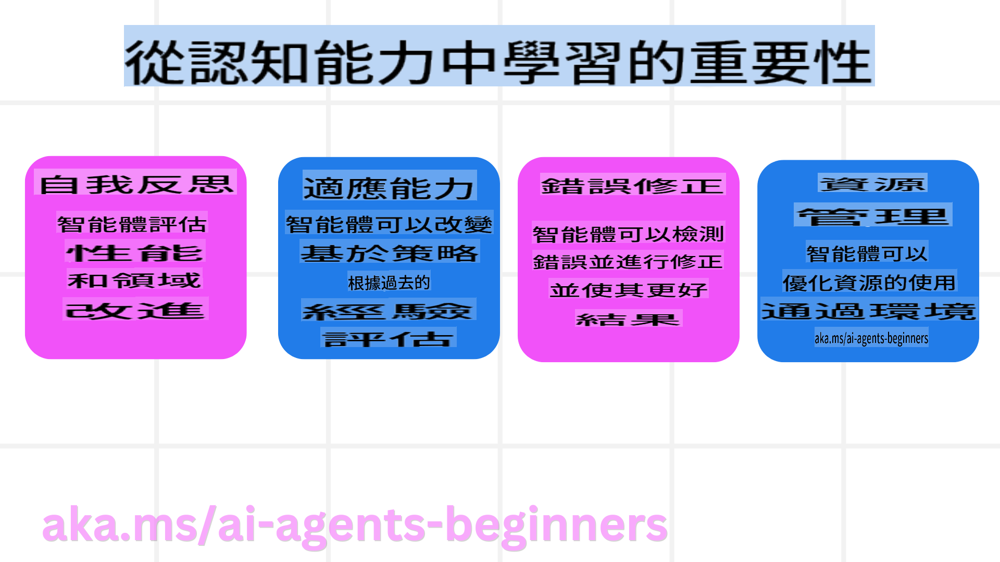
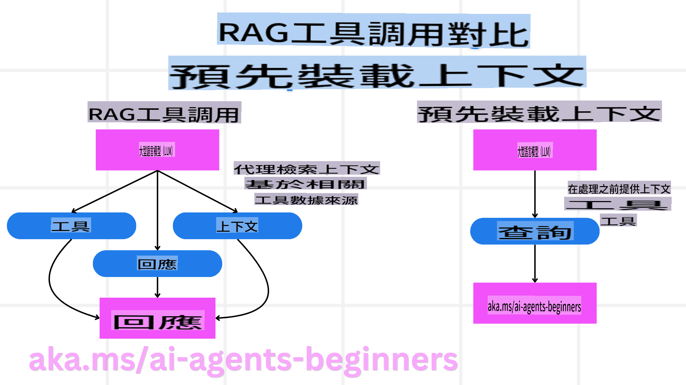

<!--
CO_OP_TRANSLATOR_METADATA:
{
  "original_hash": "3171ed887315c3ddeaccf966e40e9a50",
  "translation_date": "2025-03-28T12:09:11+00:00",
  "source_file": "09-metacognition\\README.md",
  "language_code": "hk"
}
-->
[](https://youtu.be/His9R6gw6Ec?si=3_RMb8VprNvdLRhX)

> _(點擊上方圖片觀看此課堂影片)_
# AI代理的元認知 ## 簡介 歡迎來到AI代理元認知的課堂！這章節是為對AI代理如何思考自己思維過程感到好奇的初學者而設計的。完成本課堂後，您將理解核心概念，並能應用元認知於AI代理設計的實際例子。 ## 學習目標 完成本課後，您將能夠： 1. 理解代理定義中的推理迴路影響。 2. 使用規劃和評估技術協助自我修正代理。 3. 創建能操作程式碼完成任務的代理。 ## 元認知介紹 元認知指的是更高層次的認知過程，包括思考自己的思維。對AI代理而言，這意味著能根據自我意識和過去經驗評估並調整自己的行動。 元認知，或「思考思維」，是設計具代理性AI系統的重要概念。它涉及AI系統能察覺自身內部過程，並監控、調節及適應其行為。就像我們在察言觀色或面對問題時所做的那樣。 這種自我意識能幫助AI系統做出更好的決策、識別錯誤並隨時間改善性能——這又回到圖靈測試及AI是否會接管的辯論。 在代理性AI系統的背景下，元認知能幫助解決以下幾個挑戰： - 透明度：確保AI系統能解釋其推理及決策。 - 推理能力：提升AI系統綜合信息並做出合理決定的能力。 - 適應性：讓AI系統能調整至新環境及變化條件。 - 感知能力：提高AI系統在辨識及解釋環境數據的準確性。 ### 什麼是元認知？ 元認知，或「思考思維」，是一種更高層次的認知過程，涉及對自身認知過程的自我意識和自我調節。 在AI領域，元認知賦予代理評估及調整策略和行動的能力，進而提升解決問題及決策能力。 透過理解元認知，您可以設計出更智能、更具適應性及效率的AI代理。 真正的元認知表現為AI明確地推理自己的推理過程。 範例：「我優先選擇便宜的航班是因為……可能錯過了直飛航班，所以我需要重新檢查。」記錄它如何或為何選擇某條路徑。 - 注意到它因過度依賴上次的使用者偏好而犯錯，因此它修改的不僅是最終推薦，還包括決策策略。 - 診斷模式，例如：「每當我看到使用者提到‘太擁擠’，我不僅應該排除某些景點，還要反思我挑選‘熱門景點’的方法是否過於依賴人氣排名。」 ### 元認知在AI代理中的重要性 元認知在AI代理設計中至關重要，原因如下：  - 自我反思：代理能評估自身表現並找出需改善的地方。 - 適應性：代理能根據過去經驗及變化的環境調整策略。 - 錯誤修正：代理能自動檢測並修正錯誤，提供更準確的結果。 - 資源管理：代理能通過規劃及評估行動來優化資源使用，例如時間及計算能力。 ## AI代理的組成 在深入探討元認知過程之前，理解AI代理的基本組成是必要的。 AI代理通常由以下部分組成： - 人格：代理的性格及特徵，定義它與使用者的互動方式。 - 工具：代理能執行的功能及能力。 - 技能：代理擁有的知識及專業。 這些部分共同構成一個能執行特定任務的「專業單元」。 **範例**：考慮一個旅遊代理，它的服務不僅能規劃您的假期，還能根據即時數據及過往客戶旅程經驗調整路徑。 ### 範例：旅遊代理服務中的元認知 假設您正在設計一個由AI驅動的旅遊代理服務。這個代理「旅遊代理」協助使用者規劃假期。 為了融入元認知，旅遊代理需要根據自我意識及過去經驗評估並調整行動。 元認知的應用如下： #### 當前任務 當前任務是幫助使用者規劃巴黎之旅。 #### 完成任務的步驟 1. **收集使用者偏好**：詢問使用者旅行日期、預算、興趣（如博物館、美食、購物）及任何特定要求。 2. **檢索信息**：搜索符合使用者偏好的航班選項、住宿、景點及餐廳。 3. **生成推薦**：提供個性化行程，包括航班詳情、酒店預訂及建議活動。 4. **根據反饋調整**：詢問使用者對推薦的反饋並進行必要調整。 #### 所需資源 - 訪問航班及酒店預訂數據庫。 - 巴黎景點及餐廳信息。 - 過往互動的使用者反饋數據。 #### 經驗及自我反思 旅遊代理使用元認知評估其表現並從過去經驗中學習。例如： 1. **分析使用者反饋**：旅遊代理審查使用者反饋以判斷哪些推薦受到好評，哪些不受歡迎，並據此調整未來建議。 2. **適應性**：如果使用者之前提到不喜歡擁擠場所，旅遊代理未來將避免在高峰時間推薦熱門景點。 3. **錯誤修正**：如果旅遊代理在過去的預訂中犯錯，例如推薦了一家已滿房的酒店，它將學會在做出推薦前更嚴格地檢查可用性。 #### 實際開發者範例 以下是旅遊代理程式代碼如何融入元認知的簡化範例： ```python
class Travel_Agent:
    def __init__(self):
        self.user_preferences = {}
        self.experience_data = []

    def gather_preferences(self, preferences):
        self.user_preferences = preferences

    def retrieve_information(self):
        # Search for flights, hotels, and attractions based on preferences
        flights = search_flights(self.user_preferences)
        hotels = search_hotels(self.user_preferences)
        attractions = search_attractions(self.user_preferences)
        return flights, hotels, attractions

    def generate_recommendations(self):
        flights, hotels, attractions = self.retrieve_information()
        itinerary = create_itinerary(flights, hotels, attractions)
        return itinerary

    def adjust_based_on_feedback(self, feedback):
        self.experience_data.append(feedback)
        # Analyze feedback and adjust future recommendations
        self.user_preferences = adjust_preferences(self.user_preferences, feedback)

# Example usage
travel_agent = Travel_Agent()
preferences = {
    "destination": "Paris",
    "dates": "2025-04-01 to 2025-04-10",
    "budget": "moderate",
    "interests": ["museums", "cuisine"]
}
travel_agent.gather_preferences(preferences)
itinerary = travel_agent.generate_recommendations()
print("Suggested Itinerary:", itinerary)
feedback = {"liked": ["Louvre Museum"], "disliked": ["Eiffel Tower (too crowded)"]}
travel_agent.adjust_based_on_feedback(feedback)
``` #### 元認知的重要性 - **自我反思**：代理能分析自身表現並找出需改善的地方。 - **適應性**：代理能根據反饋及變化條件調整策略。 - **錯誤修正**：代理能自動檢測並修正錯誤。 - **資源管理**：代理能優化資源使用，例如時間及計算能力。 通過融入元認知，旅遊代理能提供更個性化及準確的旅遊建議，提升整體使用者體驗。 --- ## 2. 代理中的規劃 規劃是AI代理行為中的關鍵組成部分。它包括根據當前狀態、資源及可能障礙列出達成目標所需的步驟。 ### 規劃的元素 - **當前任務**：明確定義任務。 - **完成任務的步驟**：將任務分解為可管理的步驟。 - **所需資源**：識別必要資源。 - **經驗**：利用過去經驗指導規劃。 **範例**：以下是旅遊代理需要採取的步驟，以有效協助使用者規劃旅程： ### 旅遊代理的步驟 1. **收集使用者偏好** - 詢問使用者旅行日期、預算、興趣及任何特定要求。 - 範例：「您計劃什麼時候旅行？」 「您的預算範圍是多少？」 「您在假期中喜歡什麼活動？」 2. **檢索信息** - 根據使用者偏好搜索相關旅行選項。 - **航班**：查找符合使用者預算及偏好日期的航班。 - **住宿**：尋找符合使用者地點、價格及設施偏好的酒店或租屋。 - **景點及餐廳**：識別符合使用者興趣的熱門景點、活動及餐飲選項。 3. **生成推薦** - 將檢索到的信息整合為個性化行程。 - 提供詳細的航班選項、酒店預訂及建議活動，確保推薦符合使用者偏好。 4. **向使用者展示行程** - 與使用者分享建議行程供其審核。 - 範例：「這是您巴黎旅行的建議行程，包含航班詳情、酒店預訂及建議活動和餐廳。請告訴我您的想法！」 5. **收集反饋** - 詢問使用者對建議行程的反饋。 - 範例：「您喜歡這些航班選項嗎？」 「酒店是否符合您的需求？」 「有沒有活動需要添加或移除？」 6. **根據反饋調整** - 根據使用者反饋修改行程。 - 對航班、住宿及活動推薦進行必要調整以更好地符合使用者偏好。 7. **最終確認** - 向使用者展示更新後的行程供其最終確認。 - 範例：「我根據您的反饋進行了調整。這是更新後的行程。看起來是否滿意？」 8. **預訂及確認** - 使用者批准行程後，進行航班、住宿及任何預定活動的預訂。 - 將確認詳情發送給使用者。 9. **提供持續支持** - 在旅行前及旅行期間隨時為使用者提供協助或額外需求。 - 範例：「如果您在旅途中需要任何進一步的協助，請隨時聯繫我！」 ### 範例互動 ```python
class Travel_Agent:
    def __init__(self):
        self.user_preferences = {}
        self.experience_data = []

    def gather_preferences(self, preferences):
        self.user_preferences = preferences

    def retrieve_information(self):
        flights = search_flights(self.user_preferences)
        hotels = search_hotels(self.user_preferences)
        attractions = search_attractions(self.user_preferences)
        return flights, hotels, attractions

    def generate_recommendations(self):
        flights, hotels, attractions = self.retrieve_information()
        itinerary = create_itinerary(flights, hotels, attractions)
        return itinerary

    def adjust_based_on_feedback(self, feedback):
        self.experience_data.append(feedback)
        self.user_preferences = adjust_preferences(self.user_preferences, feedback)

# Example usage within a booing request
travel_agent = Travel_Agent()
preferences = {
    "destination": "Paris",
    "dates": "2025-04-01 to 2025-04-10",
    "budget": "moderate",
    "interests": ["museums", "cuisine"]
}
travel_agent.gather_preferences(preferences)
itinerary = travel_agent.generate_recommendations()
print("Suggested Itinerary:", itinerary)
feedback = {"liked": ["Louvre Museum"], "disliked": ["Eiffel Tower (too crowded)"]}
travel_agent.adjust_based_on_feedback(feedback)
``` ## 3. 修正型RAG系統 首先讓我們了解RAG工具與預先載入上下文的差異  ### 檢索增強生成（RAG） RAG結合了檢索系統與生成模型。當進行查詢時，檢索系統從外部來源提取相關文檔或數據，並使用這些提取信息增強生成模型的輸入。這幫助模型生成更準確及上下文相關的回應。 在RAG系統中，代理從知識庫中檢索相關信息並用於生成適當的回應或行動。 ### 修正型RAG方法 修正型RAG方法專注於使用RAG技術修正錯誤及提高AI代理的準確性。這包括： 1. **提示技術**：使用特定提示引導代理檢索相關信息。 2. **工具**：實施算法及機制，使代理能評估檢索信息的相關性並生成準確回應。 3. **評估**：持續評估代理性能並進行調整以提高其準確性及效率。
考正式RAG於搜尋代理

考慮一個從網絡檢索資訊以回答用戶查詢的搜尋代理。考正式RAG方法可能包括：

1. **提示技術**：根據用戶輸入制定搜尋查詢。
2. **工具**：使用自然語言處理和機器學習算法對搜尋結果進行排序和篩選。
3. **評估**：分析用戶反饋以識別和糾正檢索資訊中的不準確之處。

### 考正式RAG於旅行代理

考正式RAG（檢索增強生成）提高了AI在檢索和生成資訊時糾正不準確資訊的能力。讓我們看看旅行代理如何利用考正式RAG方法提供更準確和相關的旅行建議。這包括：

- **提示技術**：使用特定的提示來引導代理檢索相關資訊。
- **工具**：實施使代理能夠評估檢索資訊相關性並生成準確回應的算法和機制。
- **評估**：持續評估代理的性能並進行調整以提高其準確性和效率。

#### 在旅行代理中實施考正式RAG的步驟

1. **初始用戶交互**
   - 旅行代理收集用戶的初始偏好，如目的地、旅行日期、預算和興趣。
   - 例子：```python
     preferences = {
         "destination": "Paris",
         "dates": "2025-04-01 to 2025-04-10",
         "budget": "moderate",
         "interests": ["museums", "cuisine"]
     }
     ```

2. **檢索資訊**
   - 旅行代理根據用戶偏好檢索有關航班、住宿、景點和餐廳的資訊。
   - 例子：```python
     flights = search_flights(preferences)
     hotels = search_hotels(preferences)
     attractions = search_attractions(preferences)
     ```

3. **生成初步建議**
   - 旅行代理使用檢索到的資訊生成個性化行程。
   - 例子：```python
     itinerary = create_itinerary(flights, hotels, attractions)
     print("Suggested Itinerary:", itinerary)
     ```

4. **收集用戶反饋**
   - 旅行代理向用戶詢問初步建議的反饋。
   - 例子：```python
     feedback = {
         "liked": ["Louvre Museum"],
         "disliked": ["Eiffel Tower (too crowded)"]
     }
     ```

5. **考正式RAG過程**
   - **提示技術**：旅行代理根據用戶反饋制定新的搜尋查詢。
     - 例子：```python
       if "disliked" in feedback:
           preferences["avoid"] = feedback["disliked"]
       ```
   - **工具**：旅行代理使用算法對新的搜尋結果進行排序和篩選，強調基於用戶反饋的相關性。
     - 例子：```python
       new_attractions = search_attractions(preferences)
       new_itinerary = create_itinerary(flights, hotels, new_attractions)
       print("Updated Itinerary:", new_itinerary)
       ```
   - **評估**：旅行代理通過分析用戶反饋並進行必要的調整，持續評估其建議的相關性和準確性。
     - 例子：```python
       def adjust_preferences(preferences, feedback):
           if "liked" in feedback:
               preferences["favorites"] = feedback["liked"]
           if "disliked" in feedback:
               preferences["avoid"] = feedback["disliked"]
           return preferences

       preferences = adjust_preferences(preferences, feedback)
       ```

#### 實用例子

以下是一個簡化的Python代碼例子，展示了如何在旅行代理中應用考正式RAG方法：```python
class Travel_Agent:
    def __init__(self):
        self.user_preferences = {}
        self.experience_data = []

    def gather_preferences(self, preferences):
        self.user_preferences = preferences

    def retrieve_information(self):
        flights = search_flights(self.user_preferences)
        hotels = search_hotels(self.user_preferences)
        attractions = search_attractions(self.user_preferences)
        return flights, hotels, attractions

    def generate_recommendations(self):
        flights, hotels, attractions = self.retrieve_information()
        itinerary = create_itinerary(flights, hotels, attractions)
        return itinerary

    def adjust_based_on_feedback(self, feedback):
        self.experience_data.append(feedback)
        self.user_preferences = adjust_preferences(self.user_preferences, feedback)
        new_itinerary = self.generate_recommendations()
        return new_itinerary

# Example usage
travel_agent = Travel_Agent()
preferences = {
    "destination": "Paris",
    "dates": "2025-04-01 to 2025-04-10",
    "budget": "moderate",
    "interests": ["museums", "cuisine"]
}
travel_agent.gather_preferences(preferences)
itinerary = travel_agent.generate_recommendations()
print("Suggested Itinerary:", itinerary)
feedback = {"liked": ["Louvre Museum"], "disliked": ["Eiffel Tower (too crowded)"]}
new_itinerary = travel_agent.adjust_based_on_feedback(feedback)
print("Updated Itinerary:", new_itinerary)
```

### 預先上下文加載

預先上下文加載是指在處理查詢之前將相關上下文或背景資訊加載到模型中。這意味著模型從一開始就可以訪問這些資訊，從而在過程中無需檢索額外數據即可生成更有見地的回應。

以下是一個簡化的例子，展示了預先上下文加載在旅行代理應用中的Python代碼：```python
class TravelAgent:
    def __init__(self):
        # Pre-load popular destinations and their information
        self.context = {
            "Paris": {"country": "France", "currency": "Euro", "language": "French", "attractions": ["Eiffel Tower", "Louvre Museum"]},
            "Tokyo": {"country": "Japan", "currency": "Yen", "language": "Japanese", "attractions": ["Tokyo Tower", "Shibuya Crossing"]},
            "New York": {"country": "USA", "currency": "Dollar", "language": "English", "attractions": ["Statue of Liberty", "Times Square"]},
            "Sydney": {"country": "Australia", "currency": "Dollar", "language": "English", "attractions": ["Sydney Opera House", "Bondi Beach"]}
        }

    def get_destination_info(self, destination):
        # Fetch destination information from pre-loaded context
        info = self.context.get(destination)
        if info:
            return f"{destination}:\nCountry: {info['country']}\nCurrency: {info['currency']}\nLanguage: {info['language']}\nAttractions: {', '.join(info['attractions'])}"
        else:
            return f"Sorry, we don't have information on {destination}."

# Example usage
travel_agent = TravelAgent()
print(travel_agent.get_destination_info("Paris"))
print(travel_agent.get_destination_info("Tokyo"))
```

#### 解釋

1. **初始化**（`__init__` method)**: The `TravelAgent` class pre-loads a dictionary containing information about popular destinations such as Paris, Tokyo, New York, and Sydney. This dictionary includes details like the country, currency, language, and major attractions for each destination.

2. **Retrieving Information (`get_destination_info` method)**: When a user queries about a specific destination, the `get_destination_info`方法）：
   - 該方法從預加載的上下文字典中檢索相關資訊。通過預加載上下文，旅行代理應用可以快速回應用戶查詢，而無需即時從外部來源檢索資訊。這使得應用更加高效和響應迅速。

### 在迭代前以目標啟動計劃

以目標啟動計劃是指以明確的目標或預期結果為起點。通過提前定義這一目標，模型可以將其作為整個迭代過程的指導原則。這有助於確保每次迭代都更接近實現預期結果，從而使過程更高效和集中。

以下是一個例子，展示了如何在迭代前以目標啟動旅行計劃：
代理應推斷使用者查詢背後的意圖，以提供最相關的信息。  
- 範例：如果使用者詢問「經濟實惠的酒店」，代理應優先考慮可負擔的選項。  

4. **反饋循環**：  
   - 持續收集和分析使用者反饋，有助於代理改進其相關性評估流程。  
   - 範例：結合使用者對之前推薦的評分和反饋，以改進未來的回應。  

#### 評估相關性的實用技術  
1. **相關性評分**：  
   - 根據每個檢索項目與使用者查詢和偏好匹配的程度分配相關性分數。  
   - 範例：```python
     def relevance_score(item, query):
         score = 0
         if item['category'] in query['interests']:
             score += 1
         if item['price'] <= query['budget']:
             score += 1
         if item['location'] == query['destination']:
             score += 1
         return score
     ```  

2. **篩選和排序**：  
   - 篩選掉不相關的項目，並根據相關性分數對剩餘項目進行排序。  
   - 範例：```python
     def filter_and_rank(items, query):
         ranked_items = sorted(items, key=lambda item: relevance_score(item, query), reverse=True)
         return ranked_items[:10]  # Return top 10 relevant items
     ```  

3. **自然語言處理 (NLP)**：  
   - 使用 NLP 技術來理解使用者查詢並檢索相關信息。  
   - 範例：```python
     def process_query(query):
         # Use NLP to extract key information from the user's query
         processed_query = nlp(query)
         return processed_query
     ```  

4. **使用者反饋整合**：  
   - 收集使用者對推薦的反饋，並據此調整未來的相關性評估。  
   - 範例：```python
     def adjust_based_on_feedback(feedback, items):
         for item in items:
             if item['name'] in feedback['liked']:
                 item['relevance'] += 1
             if item['name'] in feedback['disliked']:
                 item['relevance'] -= 1
         return items
     ```  

#### 範例：在旅行代理中評估相關性  
以下是一個旅行代理如何評估旅行推薦相關性的實用範例：  
```python
class Travel_Agent:
    def __init__(self):
        self.user_preferences = {}
        self.experience_data = []

    def gather_preferences(self, preferences):
        self.user_preferences = preferences

    def retrieve_information(self):
        flights = search_flights(self.user_preferences)
        hotels = search_hotels(self.user_preferences)
        attractions = search_attractions(self.user_preferences)
        return flights, hotels, attractions

    def generate_recommendations(self):
        flights, hotels, attractions = self.retrieve_information()
        ranked_hotels = self.filter_and_rank(hotels, self.user_preferences)
        itinerary = create_itinerary(flights, ranked_hotels, attractions)
        return itinerary

    def filter_and_rank(self, items, query):
        ranked_items = sorted(items, key=lambda item: self.relevance_score(item, query), reverse=True)
        return ranked_items[:10]  # Return top 10 relevant items

    def relevance_score(self, item, query):
        score = 0
        if item['category'] in query['interests']:
            score += 1
        if item['price'] <= query['budget']:
            score += 1
        if item['location'] == query['destination']:
            score += 1
        return score

    def adjust_based_on_feedback(self, feedback, items):
        for item in items:
            if item['name'] in feedback['liked']:
                item['relevance'] += 1
            if item['name'] in feedback['disliked']:
                item['relevance'] -= 1
        return items

# Example usage
travel_agent = Travel_Agent()
preferences = {
    "destination": "Paris",
    "dates": "2025-04-01 to 2025-04-10",
    "budget": "moderate",
    "interests": ["museums", "cuisine"]
}
travel_agent.gather_preferences(preferences)
itinerary = travel_agent.generate_recommendations()
print("Suggested Itinerary:", itinerary)
feedback = {"liked": ["Louvre Museum"], "disliked": ["Eiffel Tower (too crowded)"]}
updated_items = travel_agent.adjust_based_on_feedback(feedback, itinerary['hotels'])
print("Updated Itinerary with Feedback:", updated_items)
```  

### 意圖搜索  
意圖搜索涉及理解和解釋使用者查詢背後的目的或目標，以檢索和生成最相關和有用的信息。這種方法超越了簡單的關鍵字匹配，重點在於掌握使用者的實際需求和上下文。  

#### 意圖搜索中的關鍵概念  
1. **理解使用者意圖**：  
   - 使用者意圖可以分為三種類型：信息型、導航型和交易型。  
   - **信息型意圖**：使用者尋求某主題的信息（例如，「巴黎最好的博物館有哪些？」）。  
   - **導航型意圖**：使用者希望導航到特定網站或頁面（例如，「盧浮宮官方網站」）。  
   - **交易型意圖**：使用者旨在進行交易，例如預訂航班或購買商品（例如，「預訂飛往巴黎的航班」）。  

2. **上下文意識**：  
   - 分析使用者查詢的上下文，有助於準確識別其意圖。這包括考慮之前的互動、使用者偏好以及當前查詢的具體細節。  

3. **自然語言處理 (NLP)**：  
   - 使用 NLP 技術來理解和解釋使用者提供的自然語言查詢。這包括實體識別、情感分析和查詢解析等任務。  

4. **個性化**：  
   - 根據使用者的歷史、偏好和反饋對搜索結果進行個性化處理，提升檢索信息的相關性。  

#### 實用範例：在旅行代理中進行意圖搜索  
以下是一個範例，展示旅行代理如何實施意圖搜索：  
1. **收集使用者偏好**  
```python
   class Travel_Agent:
       def __init__(self):
           self.user_preferences = {}

       def gather_preferences(self, preferences):
           self.user_preferences = preferences
   ```  

2. **理解使用者意圖**  
```python
   def identify_intent(query):
       if "book" in query or "purchase" in query:
           return "transactional"
       elif "website" in query or "official" in query:
           return "navigational"
       else:
           return "informational"
   ```  

3. **上下文意識**  
```python
   def analyze_context(query, user_history):
       # Combine current query with user history to understand context
       context = {
           "current_query": query,
           "user_history": user_history
       }
       return context
   ```  

4. **搜索並個性化結果**  
```python
   def search_with_intent(query, preferences, user_history):
       intent = identify_intent(query)
       context = analyze_context(query, user_history)
       if intent == "informational":
           search_results = search_information(query, preferences)
       elif intent == "navigational":
           search_results = search_navigation(query)
       elif intent == "transactional":
           search_results = search_transaction(query, preferences)
       personalized_results = personalize_results(search_results, user_history)
       return personalized_results

   def search_information(query, preferences):
       # Example search logic for informational intent
       results = search_web(f"best {preferences['interests']} in {preferences['destination']}")
       return results

   def search_navigation(query):
       # Example search logic for navigational intent
       results = search_web(query)
       return results

   def search_transaction(query, preferences):
       # Example search logic for transactional intent
       results = search_web(f"book {query} to {preferences['destination']}")
       return results

   def personalize_results(results, user_history):
       # Example personalization logic
       personalized = [result for result in results if result not in user_history]
       return personalized[:10]  # Return top 10 personalized results
   ```  

5. **範例用法**  
```python
   travel_agent = Travel_Agent()
   preferences = {
       "destination": "Paris",
       "interests": ["museums", "cuisine"]
   }
   travel_agent.gather_preferences(preferences)
   user_history = ["Louvre Museum website", "Book flight to Paris"]
   query = "best museums in Paris"
   results = search_with_intent(query, preferences, user_history)
   print("Search Results:", results)
   ```  

---  

## 4. 作為工具的代碼生成  
代碼生成代理使用 AI 模型編寫和執行代碼，以解決複雜問題並自動化任務。  

### 代碼生成代理  
代碼生成代理使用生成式 AI 模型編寫和執行代碼。這些代理可以通過生成和運行各種編程語言的代碼來解決複雜問題、自動化任務並提供有價值的洞察。  

#### 實用應用  
1. **自動代碼生成**：生成特定任務的代碼片段，例如數據分析、網頁抓取或機器學習。  
2. **SQL 作為 RAG**：使用 SQL 查詢從數據庫檢索和操作數據。  
3. **問題解決**：創建並執行代碼以解決特定問題，例如優化算法或分析數據。  

#### 範例：用於數據分析的代碼生成代理  
假設您正在設計一個代碼生成代理。以下是它可能的工作方式：  
1. **任務**：分析數據集以識別趨勢和模式。  
2. **步驟**：  
   - 將數據集加載到數據分析工具中。  
   - 生成 SQL 查詢以篩選和聚合數據。  
   - 執行查詢並檢索結果。  
   - 使用結果生成可視化和洞察。  
3. **所需資源**：訪問數據集、數據分析工具和 SQL 功能。  
4. **經驗**：使用過去的分析結果來提高未來分析的準確性和相關性。  

### 範例：用於旅行代理的代碼生成代理  
在此範例中，我們將設計一個代碼生成代理「旅行代理」，以生成和執行代碼來協助使用者規劃旅行。該代理可以處理諸如檢索旅行選項、篩選結果以及使用生成式 AI 編輯行程的任務。  

#### 代碼生成代理概述  
1. **收集使用者偏好**：收集使用者輸入，例如目的地、旅行日期、預算和興趣。  
2. **生成代碼以檢索數據**：生成代碼片段以檢索有關航班、酒店和景點的信息。  
3. **執行生成的代碼**：運行生成的代碼以檢索實時信息。  
4. **生成行程**：將檢索到的數據編輯為個性化旅行計劃。  
5. **基於反饋進行調整**：接收使用者反饋，如果需要，重新生成代碼以改進結果。  

#### 分步實施  
1. **收集使用者偏好**  
```python
   class Travel_Agent:
       def __init__(self):
           self.user_preferences = {}

       def gather_preferences(self, preferences):
           self.user_preferences = preferences
   ```  

2. **生成代碼以檢索數據**  
```python
   def generate_code_to_fetch_data(preferences):
       # Example: Generate code to search for flights based on user preferences
       code = f"""
       def search_flights():
           import requests
           response = requests.get('https://api.example.com/flights', params={preferences})
           return response.json()
       """
       return code

   def generate_code_to_fetch_hotels(preferences):
       # Example: Generate code to search for hotels
       code = f"""
       def search_hotels():
           import requests
           response = requests.get('https://api.example.com/hotels', params={preferences})
           return response.json()
       """
       return code
   ```  

3. **執行生成的代碼**  
```python
   def execute_code(code):
       # Execute the generated code using exec
       exec(code)
       result = locals()
       return result

   travel_agent = Travel_Agent()
   preferences = {
       "destination": "Paris",
       "dates": "2025-04-01 to 2025-04-10",
       "budget": "moderate",
       "interests": ["museums", "cuisine"]
   }
   travel_agent.gather_preferences(preferences)
   
   flight_code = generate_code_to_fetch_data(preferences)
   hotel_code = generate_code_to_fetch_hotels(preferences)
   
   flights = execute_code(flight_code)
   hotels = execute_code(hotel_code)

   print("Flight Options:", flights)
   print("Hotel Options:", hotels)
   ```  

4. **生成行程**  
```python
   def generate_itinerary(flights, hotels, attractions):
       itinerary = {
           "flights": flights,
           "hotels": hotels,
           "attractions": attractions
       }
       return itinerary

   attractions = search_attractions(preferences)
   itinerary = generate_itinerary(flights, hotels, attractions)
   print("Suggested Itinerary:", itinerary)
   ```  

5. **基於反饋進行調整**  
```python
   def adjust_based_on_feedback(feedback, preferences):
       # Adjust preferences based on user feedback
       if "liked" in feedback:
           preferences["favorites"] = feedback["liked"]
       if "disliked" in feedback:
           preferences["avoid"] = feedback["disliked"]
       return preferences

   feedback = {"liked": ["Louvre Museum"], "disliked": ["Eiffel Tower (too crowded)"]}
   updated_preferences = adjust_based_on_feedback(feedback, preferences)
   
   # Regenerate and execute code with updated preferences
   updated_flight_code = generate_code_to_fetch_data(updated_preferences)
   updated_hotel_code = generate_code_to_fetch_hotels(updated_preferences)
   
   updated_flights = execute_code(updated_flight_code)
   updated_hotels = execute_code(updated_hotel_code)
   
   updated_itinerary = generate_itinerary(updated_flights, updated_hotels, attractions)
   print("Updated Itinerary:", updated_itinerary)
   ```  
過程中，你可以設計出更智能、適應性更強且更高效的代理。利用額外的資源進一步探索人工智能代理中元認知的迷人世界。  
## 上一課 [多代理設計模式](../08-multi-agent/README.md)  
## 下一課 [生產中的人工智能代理](../10-ai-agents-production/README.md)  

**免責聲明**：  
本文件使用 AI 翻譯服務 [Co-op Translator](https://github.com/Azure/co-op-translator) 進行翻譯。我們致力於提供準確的翻譯，但請注意，機器翻譯可能包含錯誤或不準確之處。應以原文檔的母語版本作為權威來源。對於重要資訊，建議尋求專業人工翻譯。我們對因使用本翻譯而產生的任何誤解或錯誤解釋概不負責。