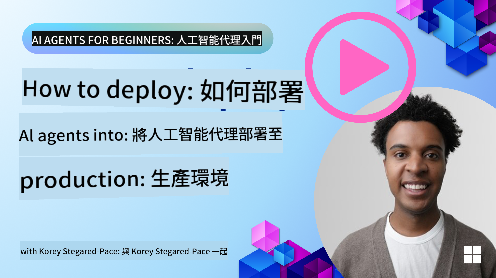

<!--
CO_OP_TRANSLATOR_METADATA:
{
  "original_hash": "44013a98d980c8b92d4b814dc49b545d",
  "translation_date": "2025-03-28T12:24:45+00:00",
  "source_file": "10-ai-agents-production\\README.md",
  "language_code": "hk"
}
-->

> _(點擊上方圖片觀看本課程影片)_
# AI Agents 在生產環境中的應用

## 簡介

這一課將探討：

- 如何有效規劃將 AI Agent 部署到生產環境。
- 部署 AI Agent 到生產環境時可能遇到的常見錯誤和問題。
- 如何在保持 AI Agent 性能的同時管理成本。

## 學習目標

完成這一課後，你將了解如何：

- 提升生產環境中 AI Agent 系統的性能、成本效益和效果的技巧。
- 評估 AI Agent 的方法和內容。
- 控制部署 AI Agent 到生產環境的成本。

部署值得信賴的 AI Agent 非常重要。可以參考「建立值得信賴的 AI Agents」課程。

## 評估 AI Agents

在部署 AI Agent 前、中和後，建立一個合適的系統來評估你的 AI Agent 是至關重要的。這能確保你的系統與你和用戶的目標一致。

評估 AI Agent 時，不僅需要評估 Agent 的輸出，還需要評估其運行的整個系統。這包括但不限於：

- 初始模型請求。
- Agent 辨識用戶意圖的能力。
- Agent 辨識完成任務所需工具的能力。
- 工具對 Agent 請求的回應。
- Agent 解讀工具回應的能力。
- 用戶對 Agent 回應的反饋。

這種方式能以更模塊化的方式幫助你識別改進的區域。接著，你可以更高效地監控模型、提示、工具及其他組件的變更效果。

## AI Agents 的常見問題及可能解決方案

| **問題**                                     | **可能解決方案**                                                                                                                                                                                                         |
| -------------------------------------------- | ---------------------------------------------------------------------------------------------------------------------------------------------------------------------------------------------------------------------- |
| AI Agent 無法穩定完成任務                     | - 精細化提供給 AI Agent 的提示；明確目標。 - 確定是否可以將任務分解為子任務並由多個 Agents 處理。                                                                                                                   |
| AI Agent 遇到持續循環的問題                   | - 確保設置明確的終止條件，讓 Agent 知道何時停止過程。 - 對需要推理和規劃的複雜任務，使用專門針對推理任務的大型模型。                                                                                              |
| AI Agent 的工具調用表現不佳                   | - 在 Agent 系統外測試並驗證工具的輸出。 - 精細化工具的參數設定、提示和命名。                                                                                                                                       |
| 多 Agent 系統表現不穩定                       | - 精細化提供給每個 Agent 的提示，確保它們具體且彼此區分。 - 構建一個層次化系統，使用「路由」或控制 Agent 決定哪個 Agent 是最合適的。                                                                            |

## 成本管理

以下是一些管理 AI Agent 部署到生產環境成本的策略：

- **緩存回應** - 識別常見請求和任務，並在它們進入 Agent 系統之前提供回應是一種減少相似請求量的好方法。你甚至可以實施一個流程，利用更基礎的 AI 模型識別請求與緩存回應的相似程度。

- **使用小型模型** - 小型語言模型 (SLM) 在某些 Agent 使用場景中表現良好，並能顯著降低成本。如前所述，建立一個評估系統來判斷和比較小型模型與大型模型的性能是了解 SLM 是否適合你的使用場景的最佳方式。

- **使用路由模型** - 類似的策略是使用不同大小的模型。你可以使用 LLM/SLM 或無伺服器函數根據請求的複雜性將其路由到最適合的模型。這樣不僅能降低成本，還能確保適合的任務能保持性能。

## 恭喜

這是「AI Agents 初學者指南」的最後一課。

我們計劃根據反饋和這個快速成長的行業的變化，持續增加課程內容，因此歡迎未來再次回來查看。

如果你希望繼續學習和使用 AI Agents，可以加入 <a href="https://discord.gg/kzRShWzttr" target="_blank">Azure AI 社區 Discord</a>。

我們在那裡舉辦工作坊、社區圓桌會議以及「隨便問」環節。

我們還有一個學習資源集合，提供額外材料幫助你開始在生產環境中構建 AI Agents。

## 上一課

[Metacognition 設計模式](../09-metacognition/README.md)

**免責聲明**：  
此文件已使用 AI 翻譯服務 [Co-op Translator](https://github.com/Azure/co-op-translator) 進行翻譯。雖然我們致力於提供準確的翻譯，但請注意，自動翻譯可能包含錯誤或不準確之處。原始文件的母語版本應被視為具權威性的來源。對於關鍵信息，建議使用專業的人工翻譯。我們對於因使用此翻譯而引起的任何誤解或誤解概不負責。