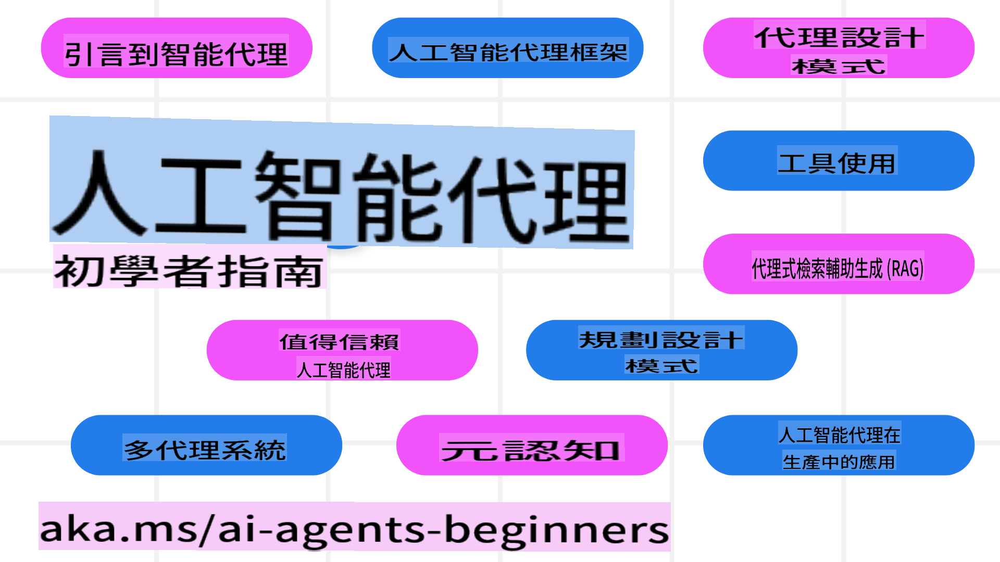

<!--
CO_OP_TRANSLATOR_METADATA:
{
  "original_hash": "09e975d95b470ee45ab546c22ee35d33",
  "translation_date": "2025-03-28T11:23:57+00:00",
  "source_file": "README.md",
  "language_code": "hk"
}
-->
# AI Agents 初學者課程

## 10 篇課程，教你如何開始建立 AI Agents

### 語言支援

     
 

 

  
 
 

## 🌱 快速入門

這個課程包含 10 篇教學，涵蓋建立 AI Agents 的基礎知識。每篇教學都有自己的主題，隨你選擇從哪裡開始！

課程提供多語言支援。你可以前往 [查看可用語言](../..)。

如果你是第一次使用生成式 AI 模型，可以先查看我們的 [Generative AI For Beginners](https://aka.ms/genai-beginners) 課程，裡面有 21 篇教學，教你如何使用生成式 AI。

記得 [給這個 repo 加星 (🌟)](https://docs.github.com/en/get-started/exploring-projects-on-github/saving-repositories-with-stars?WT.mc_id=academic-105485-koreyst) 和 [fork 這個 repo](https://github.com/microsoft/ai-agents-for-beginners/fork) 來執行程式碼。

### 需要準備什麼

每篇教學都包含程式碼範例，可以在 code_samples 資料夾找到。你可以 [fork 這個 repo](https://github.com/microsoft/ai-agents-for-beginners/fork) 來建立自己的副本。

這些練習中的程式碼範例使用 Azure AI Foundry 和 GitHub Model Catalogs 來與語言模型互動：

- [Github Models](https://aka.ms/ai-agents-beginners/github-models) - 免費 / 有限制
- [Azure AI Foundry](https://aka.ms/ai-agents-beginners/ai-foundry) - 需要 Azure 帳戶

這個課程也使用了以下來自 Microsoft 的 AI Agent 框架和服務：

- [Azure AI Agent Service](https://aka.ms/ai-agents-beginners/ai-agent-service)
- [Semantic Kernel](https://aka.ms/ai-agents-beginners/semantic-kernel)  
- [AutoGen](https://aka.ms/ai-agents/autogen)  

想了解更多有關如何運行本課程的代碼，請查看 [課程設置](./00-course-setup/README.md)。  

## 🙏 想幫忙？  

有任何建議或發現拼寫或代碼錯誤？[提交問題](https://github.com/microsoft/ai-agents-for-beginners/issues?WT.mc_id=academic-105485-koreyst) 或 [創建拉取請求](https://github.com/microsoft/ai-agents-for-beginners/pulls?WT.mc_id=academic-105485-koreyst)。  

如果你遇到困難或有任何關於構建 AI Agents 的問題，歡迎加入我們的 [Azure AI 社區 Discord](https://discord.gg/kzRShWzttr)。  

## 📂 每節課包括  

- README 中的書面課程和短視頻  
- 支持 Azure AI Foundry 和 Github Models 的 Python 代碼示例（免費）  
- 繼續學習的額外資源鏈接  

## 🗃️ 課程  

| **課程**                                 | **文字與代碼**                                    | **視頻**                                                  | **額外學習**                                                                     |  
|------------------------------------------|----------------------------------------------------|------------------------------------------------------------|----------------------------------------------------------------------------------------|  
| AI Agents 和 Agent 用例介紹               | [鏈接](./01-intro-to-ai-agents/README.md)          | [視頻](https://youtu.be/3zgm60bXmQk?si=z8QygFvYQv-9WtO1)    | [鏈接](https://aka.ms/ai-agents-beginners/collection?WT.mc_id=academic-105485-koreyst)  |  
| 探索 AI Agentic 框架                      | [鏈接](./02-explore-agentic-frameworks/README.md)  | [視頻](https://youtu.be/ODwF-EZo_O8?si=Vawth4hzVaHv-u0H)    | [鏈接](https://aka.ms/ai-agents-beginners/collection?WT.mc_id=academic-105485-koreyst)  |  
| 理解 AI Agentic 設計模式                  | [鏈接](./03-agentic-design-patterns/README.md)     | [視頻](https://youtu.be/m9lM8qqoOEA?si=BIzHwzstTPL8o9GF)    | [鏈接](https://aka.ms/ai-agents-beginners/collection?WT.mc_id=academic-105485-koreyst)  |  
| 工具使用設計模式                          | [鏈接](./04-tool-use/README.md)                    | [視頻](https://youtu.be/vieRiPRx-gI?si=2z6O2Xu2cu_Jz46N)    | [鏈接](https://aka.ms/ai-agents-beginners/collection?WT.mc_id=academic-105485-koreyst)  |  
| Agentic RAG                              | [鏈接](./05-agentic-rag/README.md)                 | [視頻](https://youtu.be/WcjAARvdL7I?si=gKPWsQpKiIlDH9A3)    | [鏈接](https://aka.ms/ai-agents-beginners/collection?WT.mc_id=academic-105485-koreyst)  |  
| 構建可信的 AI Agents                      | [鏈接](./06-building-trustworthy-agents/README.md) | [視頻](https://youtu.be/iZKkMEGBCUQ?si=jZjpiMnGFOE9L8OK )   | [鏈接](https://aka.ms/ai-agents-beginners/collection?WT.mc_id=academic-105485-koreyst)  |  
| 規劃設計模式                              | [鏈接](./07-planning-design/README.md)             | [視頻](https://youtu.be/kPfJ2BrBCMY?si=6SC_iv_E5-mzucnC)    | [鏈接](https://aka.ms/ai-agents-beginners/collection?WT.mc_id=academic-105485-koreyst)  |  
| 多 Agent 設計模式                         | [鏈接](./08-multi-agent/README.md)                 | [視頻](https://youtu.be/V6HpE9hZEx0?si=rMgDhEu7wXo2uo6g)    | [鏈接](https://aka.ms/ai-agents-beginners/collection?WT.mc_id=academic-105485-koreyst)  |  
| 元認知設計模式             | [Link](./09-metacognition/README.md)               | [Video](https://youtu.be/His9R6gw6Ec?si=8gck6vvdSNCt6OcF)  | [Link](https://aka.ms/ai-agents-beginners/collection?WT.mc_id=academic-105485-koreyst) |
| AI代理在生產環境中的應用   | [Link](./10-ai-agents-production/README.md)        | [Video](https://youtu.be/l4TP6IyJxmQ?si=31dnhexRo6yLRJDl)  | [Link](https://aka.ms/ai-agents-beginners/collection?WT.mc_id=academic-105485-koreyst) |

## 🌐 多語言支援

| 語言                 | 代碼 | 翻譯版README連結                                       | 最後更新日期 |
|----------------------|------|---------------------------------------------------------|--------------|
| 中文 (簡體)          | zh   | [中文翻譯](../zh/README.md)                | 2025-03-24   |
| 中文 (繁體)          | tw   | [中文翻譯](../tw/README.md)                | 2025-02-13   |
| 中文 (香港)          | hk   | [中文 (香港) 翻譯](./README.md)         | 2025-02-13   |
| 法文                 | fr   | [法文翻譯](../fr/README.md)                | 2025-02-13   |
| 日文                 | ja   | [日文翻譯](../ja/README.md)                | 2025-02-13   |
| 韓文                 | ko   | [韓文翻譯](../ko/README.md)                | 2025-02-13   |
| 葡萄牙文             | pt   | [葡萄牙文翻譯](../pt/README.md)            | 2025-02-13   |
| 西班牙文             | es   | [西班牙文翻譯](../es/README.md)            | 2025-02-13   |
| 德文                 | de   | [德文翻譯](../de/README.md)                | 2025-02-13   |
| 波斯文               | fa   | [波斯文翻譯](../fa/README.md)              | 2025-03-26   |
| 波蘭文               | pl   | [波蘭文翻譯](../pl/README.md)              | 2025-03-26   |

## 🎒 其他課程

我們的團隊還製作了其他課程！歡迎查看：

- [**新** 使用.NET學習生成式AI入門](https://github.com/microsoft/Generative-AI-for-beginners-dotnet?WT.mc_id=academic-105485-koreyst)
- [生成式AI入門](https://github.com/microsoft/generative-ai-for-beginners?WT.mc_id=academic-105485-koreyst)
- [機器學習入門](https://aka.ms/ml-beginners?WT.mc_id=academic-105485-koreyst)
- [數據科學入門](https://aka.ms/datascience-beginners?WT.mc_id=academic-105485-koreyst)
- [AI入門](https://aka.ms/ai-beginners?WT.mc_id=academic-105485-koreyst)
- [網絡安全入門](https://github.com/microsoft/Security-101??WT.mc_id=academic-96948-sayoung)
- [Web開發入門](https://aka.ms/webdev-beginners?WT.mc_id=academic-105485-koreyst)
- [IoT入門](https://aka.ms/iot-beginners?WT.mc_id=academic-105485-koreyst)
- [XR開發入門](https://github.com/microsoft/xr-development-for-beginners?WT.mc_id=academic-105485-koreyst)
- [精通GitHub Copilot，用於AI配對編程](https://aka.ms/GitHubCopilotAI?WT.mc_id=academic-105485-koreyst)
- [精通GitHub Copilot，專為C#/.NET開發者設計](https://github.com/microsoft/mastering-github-copilot-for-dotnet-csharp-developers?WT.mc_id=academic-105485-koreyst)
- [選擇你的Copilot冒險](https://github.com/microsoft/CopilotAdventures?WT.mc_id=academic-105485-koreyst)

## 🌟 社群感謝

感謝 [Shivam Goyal](https://www.linkedin.com/in/shivam2003/) 提供重要的代碼範例，展示了Agentic RAG。

## 貢獻

此項目歡迎貢獻和建議。大多數貢獻需要您同意一份貢獻者許可協議 (CLA)，聲明您有權且確實授予我們使用您貢獻的權利。有關詳細信息，請訪問 <https://cla.opensource.microsoft.com>。

當您提交拉取請求時，CLA機器人會自動判定您是否需要提供CLA並適當地標記PR（例如，狀態檢查、評論）。只需按照機器人提供的指示操作。您只需要在所有使用CLA的倉庫中執行一次。
此項目採用了 [Microsoft 開源行為準則](https://opensource.microsoft.com/codeofconduct/)。  
如需更多資訊，請參閱 [行為準則常見問題](https://opensource.microsoft.com/codeofconduct/faq/)，或聯絡 [opencode@microsoft.com](mailto:opencode@microsoft.com) 提出其他問題或意見。

## 商標

此項目可能包含項目、產品或服務的商標或標誌。使用 Microsoft 商標或標誌需獲授權，並且必須遵守  
[Microsoft 的商標與品牌指南](https://www.microsoft.com/legal/intellectualproperty/trademarks/usage/general)。  
在修改版本的此項目中使用 Microsoft 商標或標誌，不得引起混淆或暗示 Microsoft 的贊助。  
使用第三方商標或標誌需遵守相關第三方的政策。  

**免責聲明**：  
本文件已使用人工智能翻譯服務 [Co-op Translator](https://github.com/Azure/co-op-translator) 進行翻譯。儘管我們努力確保翻譯的準確性，但請注意，機器翻譯可能包含錯誤或不準確之處。應以原始語言的文件作為權威來源。對於關鍵信息，建議尋求專業人工翻譯。我們對因使用此翻譯而產生的任何誤解或錯誤解讀概不負責。