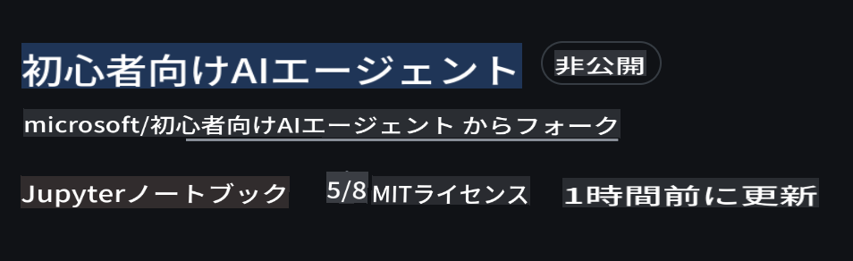
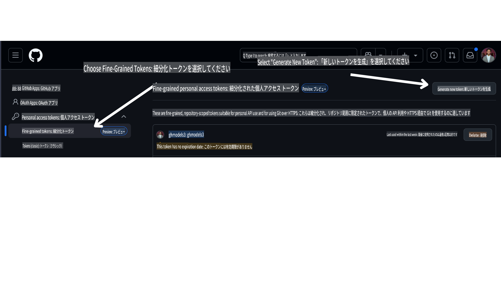

<!--
CO_OP_TRANSLATOR_METADATA:
{
  "original_hash": "366bc6709dd95b8a32ec7c705b0f179c",
  "translation_date": "2025-03-28T11:36:14+00:00",
  "source_file": "00-course-setup\\README.md",
  "language_code": "ja"
}
-->
# コースセットアップ

## はじめに

このレッスンでは、コースのコードサンプルを実行する方法について説明します。

## 必要条件

- GitHubアカウント
- Python 3.12以上
- Azureサブスクリプション
- Azure AI Foundryアカウント

## このリポジトリをクローンまたはフォークする

まずは、GitHubリポジトリをクローンまたはフォークしてください。これにより、コース教材の独自バージョンを作成し、コードを実行、テスト、調整することができます！

以下のリンクをクリックして行うことができます。



## GitHubのパーソナルアクセストークン（PAT）を取得する

現在、このコースではGitHub Models Marketplaceを利用して、大規模言語モデル（LLM）への無料アクセスを提供しています。このモデルはAIエージェントを作成するために使用されます。

このサービスにアクセスするには、GitHubのパーソナルアクセストークンを作成する必要があります。

以下の手順で作成できます。

GitHubアカウントにログインしてください。

画面左側で `Fine-grained tokens` オプションを選択します。

次に `Generate new token` を選択します。



作成したばかりの新しいトークンをコピーしてください。このトークンをコースに含まれる `.env` ファイルに追加します。

## 環境変数に追加する

`.env` ファイルを作成するには、ターミナルで以下のコマンドを実行してください。

```bash
cp .env.example .env
```

これにより、例ファイルがコピーされ、ディレクトリ内に `.env` が作成されます。環境変数の値を記入してください。各環境変数の値は [Azure AI Foundry](https://ai.azure.com?WT.mc_id=academic-105485-koreyst) ポータルの以下の場所で確認できます。

そのファイルを開き、作成したトークンを以下の形式で貼り付けてください：
`GITHUB_TOKEN=` field of the .env file. 
- `AZURE_SUBSCRIPTION_ID` - On the **Overview** page of your project within **Project details**.
- `AZURE_AI_PROJECT_NAME` - At the top of the **Overview** page for your project.
- `AZURE_OPENAI_RESOURCE_GROUP` - On the **Overview** page of the **Management Center** within **Project properties**.
- `AZURE_OPENAI_SERVICE` - On the **Overview** page of your project in the **Included capabilities** tab for **Azure OpenAI Service**.
- `AZURE_OPENAI_API_VERSION` - On the [API version lifecycle](https://learn.microsoft.com/azure/ai-services/openai/api-version-deprecation#latest-ga-api-release?WT.mc_id=academic-105485-koreyst) webpage within the **Latest GA API release** section.
- `AZURE_OPENAI_ENDPOINT` - モデルデプロイメントの**Details**タブ内の**Endpoint**（例：**Target URI**）

## 必要なパッケージをインストールする

コードを実行するために必要なPythonパッケージをすべてインストールするには、ターミナルで以下のコマンドを実行してください。

Python仮想環境を作成することをお勧めします。これにより、競合や問題を避けることができます。

```bash
pip install -r requirements.txt
```

これにより必要なPythonパッケージがインストールされます。

# Azureにサインインする

セキュリティのベストプラクティスとして、Microsoft Entra IDを使用した[キーなし認証](https://learn.microsoft.com/azure/developer/ai/keyless-connections?tabs=csharp%2Cazure-cli?WT.mc_id=academic-105485-koreyst)を利用してAzure OpenAIに認証します。これを行う前に、オペレーティングシステムに応じた[Azure CLIのインストール手順](https://learn.microsoft.com/cli/azure/install-azure-cli?WT.mc_id=academic-105485-koreyst)に従って**Azure CLI**をインストールする必要があります。

次に、ターミナルを開き、以下のコマンドを実行してください：
`az login` to sign in to your Azure account.

## Sign in to Azure

Login with your Azure AI account used to provision the Azure resources.

Open a new terminal and enter the following command and follow the instructions in the terminal:

`az login --use-device-code`

Once you've logged in, select your subscription in the terminal.

## Access the environment variables.

We'll import `os` and `load_dotenv` これにより環境変数にアクセスできます。

```python
import os
from dotenv import load_dotenv

load_dotenv()
```

## キーなし認証を設定する

資格情報をハードコードする代わりに、Azure OpenAIでキーなし接続を使用します。そのために、`DefaultAzureCredential` and later call the `DefaultAzureCredential` 関数をインポートして資格情報を取得します。

```python
from azure.identity import DefaultAzureCredential, InteractiveBrowserCredential
```

これでコースのコードを実行する準備が整いました。AIエージェントの世界について学ぶことを楽しんでください！

セットアップを実行する際に問題が発生した場合は、ぜひ私たちの

## 次のレッスン

[AIエージェントとエージェントのユースケースの紹介](../01-intro-to-ai-agents/README.md)

**免責事項**:  
この文書は、AI翻訳サービス [Co-op Translator](https://github.com/Azure/co-op-translator) を使用して翻訳されています。正確性を追求しておりますが、自動翻訳には誤りや不正確な箇所が含まれる可能性があります。元の言語で記載された文書が正式な情報源とみなされるべきです。重要な情報については、専門の人間による翻訳を推奨します。この翻訳の使用に起因する誤解や誤認について、当方は一切の責任を負いません。