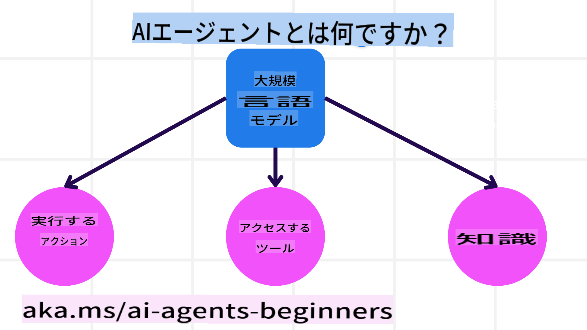
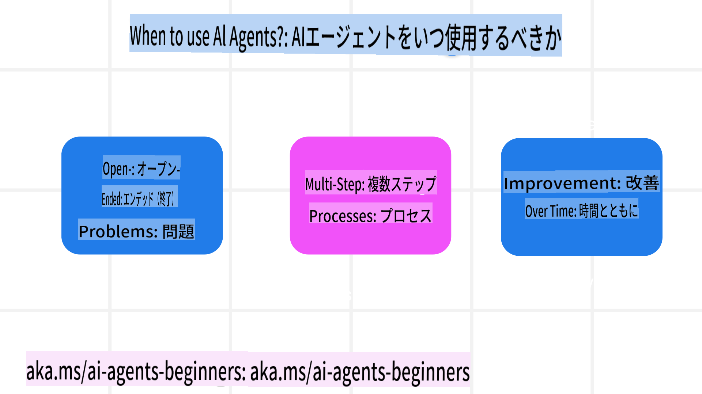

<!--
CO_OP_TRANSLATOR_METADATA:
{
  "original_hash": "233e7a18025a27eae95b653e9b5b5aa5",
  "translation_date": "2025-03-28T11:38:23+00:00",
  "source_file": "01-intro-to-ai-agents\\README.md",
  "language_code": "ja"
}
-->

> _(上の画像をクリックすると、このレッスンの動画を視聴できます)_

# AIエージェントとその利用ケースの紹介

「初心者向けAIエージェント」コースへようこそ！このコースでは、AIエージェントの基本的な知識と実践的なサンプルを提供します。

他の学習者やAIエージェント開発者と交流し、このコースに関する質問をしてください。

このコースの最初のステップとして、AIエージェントとは何か、そして私たちが構築するアプリケーションやワークフローでどのように活用できるかを理解していきます。

## はじめに

このレッスンで学ぶ内容:

- AIエージェントとは何か、そしてその種類は？
- AIエージェントが最適な利用ケースとその利点は？
- エージェントソリューションを設計する際の基本的な構成要素とは？

## 学習目標
このレッスンを終えると、次のことができるようになります:

- AIエージェントの概念を理解し、他のAIソリューションとの違いを把握する。
- AIエージェントを効率的に適用する。
- ユーザーと顧客の両方にとって生産的なエージェントソリューションを設計する。

## AIエージェントの定義と種類

### AIエージェントとは？

AIエージェントは、**システム**が**大規模言語モデル（LLM）**を活用して**アクションを実行**することを可能にするものです。これにより、LLMが**ツール**や**知識**にアクセスできるようになります。

この定義を細かく分解してみましょう:

- **システム** - エージェントを単一のコンポーネントではなく、複数のコンポーネントからなるシステムとして考えることが重要です。AIエージェントの基本的な構成要素は次の通りです:
  - **環境** - AIエージェントが動作する定義された空間。例えば、旅行予約AIエージェントの場合、環境はエージェントがタスクを完了するために使用する旅行予約システムです。
  - **センサー** - 環境には情報があり、フィードバックを提供します。AIエージェントはセンサーを使用して、環境の現在の状態に関する情報を収集・解釈します。旅行予約エージェントの例では、ホテルの空室状況やフライトの料金情報を提供する予約システムがセンサーの役割を果たします。
  - **アクチュエータ** - AIエージェントが環境の現在の状態を受け取った後、現在のタスクに基づいて環境を変更するためのアクションを決定します。旅行予約エージェントの場合、ユーザーのために利用可能な部屋を予約することがアクションに該当します。

**大規模言語モデル** - エージェントの概念はLLMが登場する前から存在していました。LLMを使用してAIエージェントを構築する利点は、人間の言語やデータを解釈できる能力にあります。この能力により、LLMは環境情報を解釈し、環境を変更するための計画を立てることができます。

**アクションの実行** - AIエージェントシステムの外では、LLMはユーザーのプロンプトに基づいてコンテンツや情報を生成する状況に限定されます。一方、AIエージェントシステム内では、LLMはユーザーのリクエストを解釈し、環境内で利用可能なツールを使用してタスクを完了することができます。

**ツールへのアクセス** - LLMがアクセスできるツールは、1) 動作する環境、2) AIエージェントの開発者によって定義されます。旅行エージェントの例では、エージェントのツールは予約システム内で利用可能な操作に限定されるか、開発者がフライトに限定したツールアクセスを設定することもできます。

**知識** - 環境から提供される情報以外に、AIエージェントは他のシステム、サービス、ツール、さらには他のエージェントから知識を取得することもできます。旅行エージェントの例では、この知識は顧客データベースに保存されているユーザーの旅行の好みに関する情報である可能性があります。

### エージェントの種類

AIエージェントの一般的な定義を理解したところで、旅行予約AIエージェントに適用できる具体的なエージェントタイプを見てみましょう。

| **エージェントタイプ**          | **説明**                                                                                                               | **例**                                                                                                                                                                                                                   |
| ----------------------------- | ---------------------------------------------------------------------------------------------------------------------- | ----------------------------------------------------------------------------------------------------------------------------------------------------------------------------------------------------------------------------- |
| **単純反射型エージェント**       | 定義済みのルールに基づいて即時のアクションを実行します。                                                                 | 旅行エージェントがメールの内容を解釈し、旅行の苦情を顧客サービスに転送します。                                                                                                                          |
| **モデルベース反射型エージェント** | 世界のモデルとその変化に基づいてアクションを実行します。                                                                 | 旅行エージェントが過去の価格データへのアクセスを基に、大幅な価格変動があるルートを優先します。                                                                                                             |
| **目標ベースエージェント**       | 目標を解釈し、それを達成するためのアクションを決定して計画を作成します。                                                   | 旅行エージェントが現在地から目的地までの必要な移動手段（車、公共交通機関、フライト）を決定して旅程を予約します。                                                                                |
| **効用ベースエージェント**       | 数値的にトレードオフを考慮して目標を達成する方法を決定します。                                                             | 旅行エージェントが利便性とコストを比較して効用を最大化しながら旅行を予約します。                                                                                                                                          |
| **学習型エージェント**           | フィードバックに応じて行動を調整し、時間とともに改善します。                                                               | 旅行エージェントが旅行後のアンケートから顧客フィードバックを活用し、将来の予約を改善します。                                                                                                               |
| **階層型エージェント**           | 複数のエージェントが階層構造で動作し、上位のエージェントがタスクをサブタスクに分割し、下位のエージェントがそれを完了します。 | 旅行エージェントが旅程をキャンセルする際に、特定の予約をキャンセルするなどのサブタスクに分割し、下位のエージェントがそれを完了し、上位のエージェントに報告します。                                     |
| **マルチエージェントシステム (MAS)** | エージェントが協力的または競争的に独立してタスクを完了します。                                                             | 協力的: 複数のエージェントがホテル、フライト、エンターテインメントなど特定の旅行サービスを予約します。競争的: 複数のエージェントが共有のホテル予約カレンダーを管理し、顧客のホテル予約を競争します。 |

## AIエージェントを使用する場面

前のセクションでは、旅行エージェントのユースケースを使って、さまざまなエージェントタイプが旅行予約の異なるシナリオでどのように使用されるかを説明しました。このコースでは引き続きこのアプリケーションを使用します。

次に、AIエージェントが最適に使用されるユースケースの種類を見ていきましょう:

- **オープンエンドな問題** - 必要なステップをLLMが判断するタスク。これらは常にワークフローにハードコーディングできるわけではありません。
- **マルチステッププロセス** - 単一の情報取得ではなく、複数のターンでツールや情報を使用する必要がある複雑なタスク。
- **時間とともに改善** - エージェントが環境やユーザーからのフィードバックを受け取ることで、より良い結果を提供するように改善できるタスク。

AIエージェントの利用に関するさらなる考慮事項については、「信頼できるAIエージェントの構築」レッスンで詳しく説明します。

## エージェントソリューションの基本

### エージェント開発

AIエージェントシステムを設計する最初のステップは、ツール、アクション、動作を定義することです。このコースでは、**Azure AI Agent Service**を使用してエージェントを定義する方法に焦点を当てます。このサービスは以下の機能を提供します:

- OpenAI、Mistral、Llamaなどのオープンモデルの選択
- Tripadvisorなどのプロバイダーによるライセンスデータの利用
- 標準化されたOpenAPI 3.0ツールの利用

### エージェントパターン

LLMとのコミュニケーションはプロンプトを通じて行います。AIエージェントの半自律的な性質を考慮すると、環境の変更後にLLMを手動で再プロンプトする必要がない場合があります。**エージェントパターン**を使用することで、複数のステップにわたってLLMをスケーラブルにプロンプトすることが可能です。

このコースでは、現在人気のあるエージェントパターンをいくつか取り上げます。

### エージェントフレームワーク

エージェントフレームワークは、コードを通じてエージェントパターンを実装するためのものです。これらのフレームワークはテンプレート、プラグイン、ツールを提供し、AIエージェントのコラボレーションを向上させます。これらの利点により、AIエージェントシステムの可観測性やトラブルシューティングが改善されます。

このコースでは、研究主導のAutoGenフレームワークと、Semantic Kernelの実用的なAgentフレームワークを探ります。

## 前のレッスン

[コース設定](../00-course-setup/README.md)

## 次のレッスン

[エージェントフレームワークの探索](../02-explore-agentic-frameworks/README.md)

**免責事項**:  
この文書はAI翻訳サービス[Co-op Translator](https://github.com/Azure/co-op-translator)を使用して翻訳されています。正確性を追求していますが、自動翻訳には誤りや不正確な箇所が含まれる可能性があることをご承知ください。元の言語で記載された文書を公式な情報源と見なしてください。重要な情報については、専門の人間による翻訳を推奨します。この翻訳を使用したことによる誤解や誤認に関して、当社は一切責任を負いません。