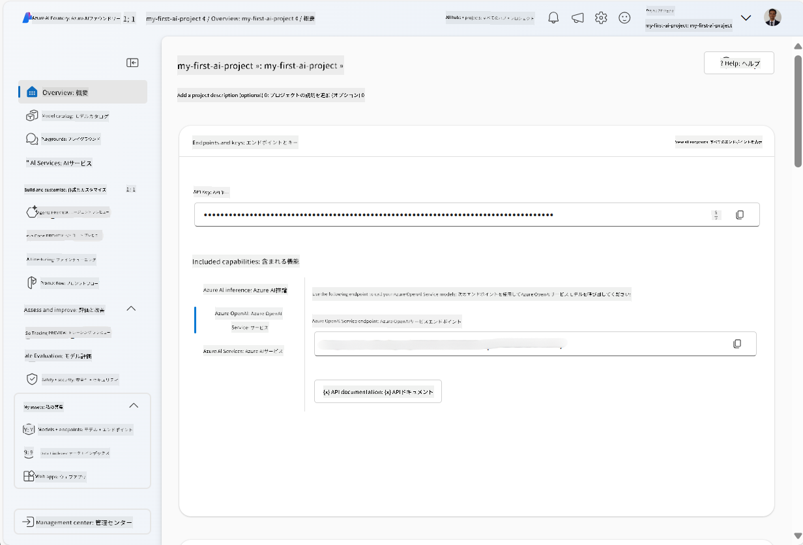
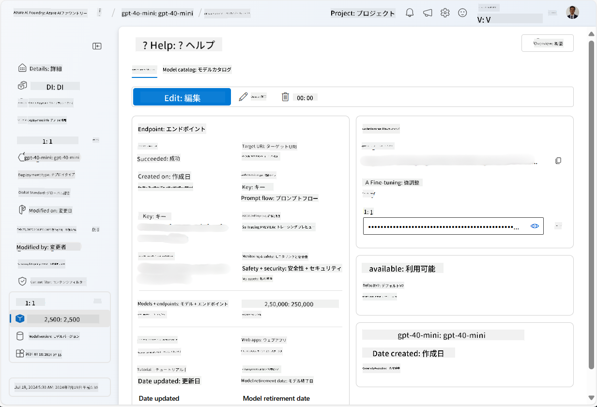
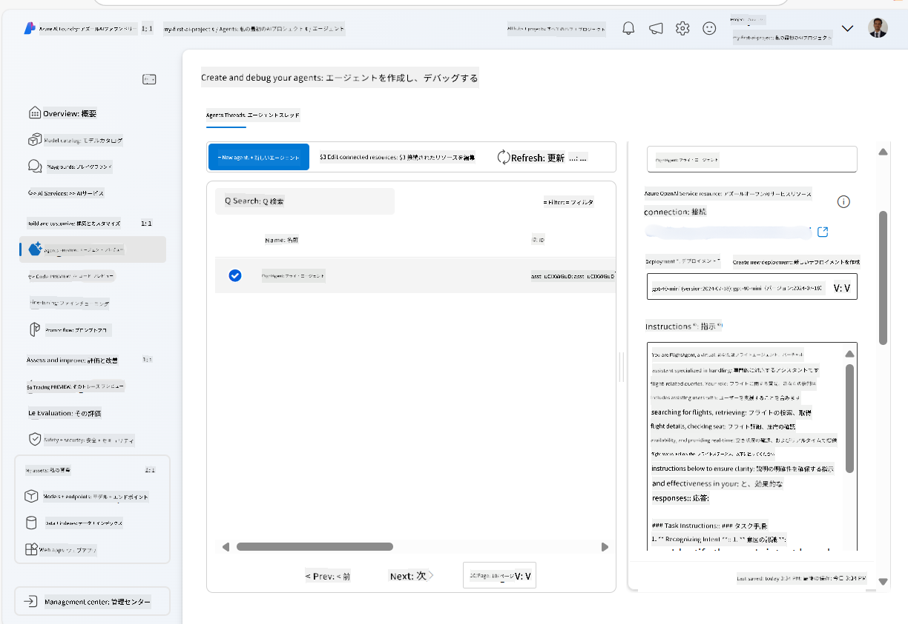
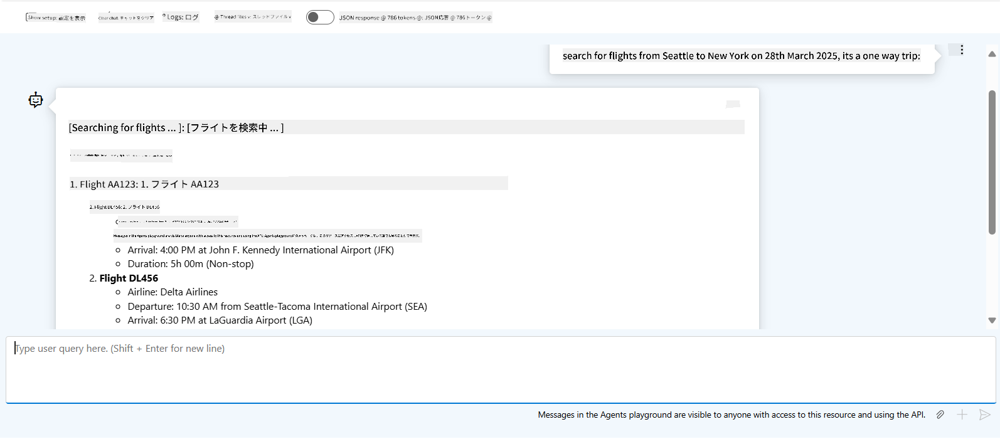

<!--
CO_OP_TRANSLATOR_METADATA:
{
  "original_hash": "664afc6dd1bf275b0eafd126b71da420",
  "translation_date": "2025-03-28T11:40:37+00:00",
  "source_file": "02-explore-agentic-frameworks\\azure-ai-foundry-agent-creation.md",
  "language_code": "ja"
}
-->
# Azure AI Agent サービス開発

この演習では、[Azure AI Foundry ポータル](https://ai.azure.com/?WT.mc_id=academic-105485-koreyst)の Azure AI Agent サービスツールを使用して、フライト予約のエージェントを作成します。このエージェントは、ユーザーと対話し、フライトに関する情報を提供できるようになります。

## 必要条件

この演習を完了するには、以下が必要です：
1. アクティブなサブスクリプションを持つ Azure アカウント。[無料でアカウントを作成する](https://azure.microsoft.com/free/?WT.mc_id=academic-105485-koreyst)。
2. Azure AI Foundry ハブを作成する権限があるか、既に作成されていること。
    - あなたの役割が Contributor または Owner の場合、このチュートリアルの手順に従うことができます。

## Azure AI Foundry ハブを作成する

> **Note:** Azure AI Foundry は以前は Azure AI Studio と呼ばれていました。

1. [Azure AI Foundry](https://learn.microsoft.com/en-us/azure/ai-studio/?WT.mc_id=academic-105485-koreyst) のブログ記事に記載されているガイドラインに従い、Azure AI Foundry ハブを作成します。
2. プロジェクトが作成されたら、表示されるヒントを閉じ、Azure AI Foundry ポータルのプロジェクトページを確認します。以下の画像に似たページが表示されるはずです：

    

## モデルをデプロイする

1. プロジェクトの左側のペインで、**My assets** セクション内の **Models + endpoints** ページを選択します。
2. **Models + endpoints** ページの **Model deployments** タブで、**+ Deploy model** メニューから **Deploy base model** を選択します。
3. リスト内の `gpt-4o-mini` モデルを検索し、選択して確認します。

    > **Note**: TPM を削減すると、使用しているサブスクリプションで利用可能なクォータの過剰使用を防ぐことができます。

    

## エージェントを作成する

モデルをデプロイしたら、エージェントを作成することができます。エージェントは、ユーザーと対話するために使用できる会話型 AI モデルです。

1. プロジェクトの左側のペインで、**Build & Customize** セクション内の **Agents** ページを選択します。
2. **+ Create agent** をクリックして新しいエージェントを作成します。**Agent Setup** ダイアログボックスで以下を設定します：
    - エージェントの名前を入力します（例：`FlightAgent`）。
    - 以前に作成した `gpt-4o-mini` モデルのデプロイメントが選択されていることを確認します。
    - **Instructions** をエージェントに従わせたいプロンプトに応じて設定します。以下は例です：
    ```
    You are FlightAgent, a virtual assistant specialized in handling flight-related queries. Your role includes assisting users with searching for flights, retrieving flight details, checking seat availability, and providing real-time flight status. Follow the instructions below to ensure clarity and effectiveness in your responses:

    ### Task Instructions:
    1. **Recognizing Intent**:
       - Identify the user's intent based on their request, focusing on one of the following categories:
         - Searching for flights
         - Retrieving flight details using a flight ID
         - Checking seat availability for a specified flight
         - Providing real-time flight status using a flight number
       - If the intent is unclear, politely ask users to clarify or provide more details.
        
    2. **Processing Requests**:
        - Depending on the identified intent, perform the required task:
        - For flight searches: Request details such as origin, destination, departure date, and optionally return date.
        - For flight details: Request a valid flight ID.
        - For seat availability: Request the flight ID and date and validate inputs.
        - For flight status: Request a valid flight number.
        - Perform validations on provided data (e.g., formats of dates, flight numbers, or IDs). If the information is incomplete or invalid, return a friendly request for clarification.

    3. **Generating Responses**:
    - Use a tone that is friendly, concise, and supportive.
    - Provide clear and actionable suggestions based on the output of each task.
    - If no data is found or an error occurs, explain it to the user gently and offer alternative actions (e.g., refine search, try another query).
    
    ```
> [!NOTE]
> 詳細なプロンプトについては、[このリポジトリ](https://github.com/ShivamGoyal03/RoamMind) をチェックしてください。

> さらに、エージェントの機能を強化するために **Knowledge Base** や **Actions** を追加して、ユーザーの要求に基づいてより多くの情報を提供したり、自動化されたタスクを実行したりすることができます。この演習ではこれらの手順を省略できます。



3. 新しいマルチ AI エージェントを作成するには、**New Agent** をクリックするだけです。作成されたエージェントは Agents ページに表示されます。

## エージェントをテストする

エージェントを作成した後、Azure AI Foundry ポータルのプレイグラウンドでユーザーのクエリにどのように応答するかをテストできます。

1. エージェントの **Setup** ペインの上部で **Try in playground** を選択します。
2. **Playground** ペインで、チャットウィンドウにクエリを入力してエージェントと対話できます。例えば、シアトルからニューヨークへのフライトを 28 日に検索するようエージェントに依頼できます。

    > **Note**: この演習ではリアルタイムデータを使用していないため、エージェントが正確な応答を提供しない場合があります。この演習の目的は、指示に基づいてユーザーのクエリを理解し応答するエージェントの能力をテストすることです。

    

3. エージェントをテストした後、さらに多くの意図やトレーニングデータ、アクションを追加してエージェントの機能を強化することができます。

## リソースをクリーンアップする

エージェントのテストが終了したら、追加のコストを回避するためにエージェントを削除できます。
1. [Azure ポータル](https://portal.azure.com) を開き、この演習で使用したハブリソースをデプロイしたリソースグループの内容を表示します。
2. ツールバーで **Delete resource group** を選択します。
3. リソースグループ名を入力し、削除することを確認します。

## リソース

- [Azure AI Foundry ドキュメント](https://learn.microsoft.com/en-us/azure/ai-studio/?WT.mc_id=academic-105485-koreyst)
- [Azure AI Foundry ポータル](https://ai.azure.com/?WT.mc_id=academic-105485-koreyst)
- [Azure AI Studio の使い方](https://techcommunity.microsoft.com/blog/educatordeveloperblog/getting-started-with-azure-ai-studio/4095602?WT.mc_id=academic-105485-koreyst)
- [Azure の AI エージェントの基礎](https://learn.microsoft.com/en-us/training/modules/ai-agent-fundamentals/?WT.mc_id=academic-105485-koreyst)
- [Azure AI Discord](https://aka.ms/AzureAI/Discord)

**免責事項**:  
この文書はAI翻訳サービス [Co-op Translator](https://github.com/Azure/co-op-translator) を使用して翻訳されています。正確性を追求しておりますが、自動翻訳には誤りや不正確な点が含まれる可能性があります。元の言語で記載された原文が正式な情報源とみなされるべきです。重要な情報については、専門の人間による翻訳を推奨します。この翻訳の利用に起因する誤解や解釈の違いについて、当方は一切責任を負いません。