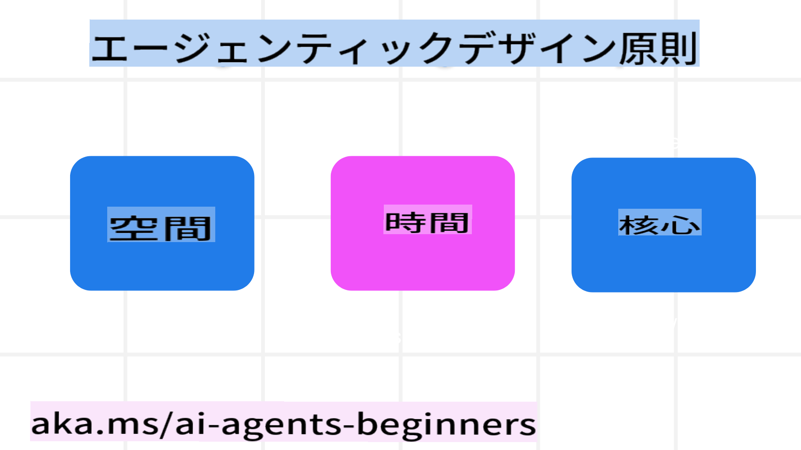

<!--
CO_OP_TRANSLATOR_METADATA:
{
  "original_hash": "969885aab5f923f67f134ce115fbbcaf",
  "translation_date": "2025-03-28T11:48:50+00:00",
  "source_file": "03-agentic-design-patterns\\README.md",
  "language_code": "ja"
}
-->

> _(上記の画像をクリックすると、このレッスンの動画が表示されます)_
# AIエージェント設計の原則

## はじめに

AIエージェントシステムを構築する方法は数多くあります。生成型AI設計において曖昧さがバグではなく特徴であるため、エンジニアがどこから手をつければよいのか迷うこともあります。そこで、開発者が顧客中心のエージェントシステムを構築し、ビジネスニーズを解決するための人間中心のUX設計原則を作成しました。この設計原則は規範的なアーキテクチャではなく、エージェント体験を定義し構築するチームにとっての出発点です。

一般的に、エージェントは以下を目指すべきです：

- 人間の能力を拡張し、規模を広げる（ブレインストーミング、問題解決、オートメーションなど）
- 知識のギャップを埋める（知識領域の理解、翻訳など）
- 個々が好む方法で他者との協働を促進・支援する
- 自分自身をより良いバージョンにする（例：ライフコーチやタスクマスターとして、感情の調整やマインドフルネススキルの習得を助け、レジリエンスを構築するなど）

## このレッスンで学ぶ内容

- エージェント設計の原則とは何か
- これらの設計原則を実装する際のガイドライン
- 設計原則を活用した例

## 学習目標

このレッスンを完了すると、以下ができるようになります：

1. エージェント設計の原則とは何か説明できる
2. エージェント設計の原則を使用するためのガイドラインを説明できる
3. エージェント設計の原則を活用してエージェントを構築する方法を理解できる

## エージェント設計の原則

### エージェント（空間）

これはエージェントが動作する環境です。この原則は、物理的およびデジタルの世界でエージェントを設計する方法を示します。

- **つなげる、壊さない** – 人々、イベント、実行可能な知識をつなげ、協力とつながりを可能にする。
  - エージェントはイベント、知識、そして人々を結びつけます。
  - エージェントは人々をより近づけます。人々を置き換えたり軽視するために設計されているわけではありません。
- **簡単にアクセスできるが、時には目立たない** – エージェントは主に背景で動作し、関連性があり適切な場合にのみ促します。
  - エージェントは、認可されたユーザーがどのデバイスやプラットフォームでも簡単に発見しアクセスできるようにします。
  - エージェントは、音声、テキストなどのマルチモーダルな入力と出力をサポートします。
  - エージェントは、ユーザーのニーズを感知し、前景と背景、積極的と受動的の間をシームレスに移行できます。
  - エージェントは見えない形で動作することもありますが、その背景プロセスや他のエージェントとの協力はユーザーに透明であり、制御可能です。

### エージェント（時間）

これはエージェントが時間を通じてどのように動作するかを示します。この原則は、過去、現在、未来を横断するエージェントの設計方法を示します。

- **過去**：状態とコンテキストを含む歴史を振り返る。
  - エージェントは、イベント、人々、状態だけではなく、より豊かな履歴データを分析して、より関連性の高い結果を提供します。
  - エージェントは過去のイベントからつながりを作り、記憶を活用して現在の状況に対応します。
- **現在**：通知以上の促し。
  - エージェントは人々との相互作用に包括的なアプローチを取ります。イベントが発生した場合、静的な通知や形式的な応答を超えて動作します。エージェントはフローを簡略化したり、ユーザーの注意を適切な瞬間に向ける動的なヒントを生成できます。
  - エージェントは、コンテキスト環境、社会的・文化的変化、ユーザーの意図に合わせた情報を提供します。
  - エージェントの相互作用は段階的で、長期的にユーザーを強化するために進化し複雑化する可能性があります。
- **未来**：適応と進化。
  - エージェントは様々なデバイス、プラットフォーム、モダリティに適応します。
  - エージェントはユーザーの行動やアクセシビリティニーズに適応し、自由にカスタマイズ可能です。
  - エージェントは継続的なユーザーとの相互作用を通じて形作られ進化します。

### エージェント（コア）

これはエージェント設計の中心的な要素です。

- **不確実性を受け入れつつ信頼を構築**。
  - エージェントに一定の不確実性があることは想定されています。不確実性はエージェント設計の重要な要素です。
  - 信頼と透明性はエージェント設計の基盤となるレイヤーです。
  - エージェントがオン/オフになるタイミングは人間が制御し、エージェントの状態は常に明確に表示されます。

## これらの原則を実装するためのガイドライン

上記の設計原則を使用する際には、以下のガイドラインを参考にしてください：

1. **透明性**：AIが関与していること、その動作（過去の行動を含む）、フィードバックを提供しシステムを変更する方法をユーザーに知らせます。
2. **制御**：ユーザーがカスタマイズし、好みを指定し、個別化し、システムやその属性を制御できるようにします（忘れる機能も含む）。
3. **一貫性**：デバイスやエンドポイント間で一貫したマルチモーダルな体験を目指します。可能であれば馴染みのあるUI/UX要素を使用し（例：音声操作のマイクアイコン）、ユーザーの認知負荷を可能な限り軽減します（例：簡潔な応答、視覚的補助、「詳細を学ぶ」コンテンツなど）。

## これらの原則とガイドラインを使用した旅行エージェントの設計方法

旅行エージェントを設計すると仮定して、以下のように設計原則とガイドラインを活用することができます：

1. **透明性** – 旅行エージェントがAI対応エージェントであることをユーザーに知らせます。「こんにちは」メッセージやサンプルプロンプトなどの基本的な指示を提供します。これを製品ページに明記します。ユーザーが過去に尋ねたプロンプトのリストを表示します。フィードバックの提供方法（例：親指の上げ下げ、フィードバック送信ボタンなど）を明確にします。エージェントに使用制限やトピック制限がある場合は明確に説明します。
2. **制御** – 作成後にエージェントを変更する方法を明確にします（例：システムプロンプトなど）。エージェントの冗長さ、書き方のスタイル、話題にしてはいけない内容などをユーザーが選択できるようにします。関連ファイルやデータ、プロンプト、過去の会話を表示・削除できるようにします。
3. **一貫性** – プロンプトの共有、ファイルや写真の追加、誰かや何かのタグ付けのアイコンを標準的で認識しやすいものにします。ファイルのアップロード/共有を示すためにクリップアイコンを使用し、グラフィックのアップロードを示すために画像アイコンを使用します。

## 追加リソース

- 

## 前のレッスン

[エージェントフレームワークの探求](../02-explore-agentic-frameworks/README.md)

## 次のレッスン

[ツール利用設計パターン](../04-tool-use/README.md)

**免責事項**:  
この文書はAI翻訳サービス [Co-op Translator](https://github.com/Azure/co-op-translator) を使用して翻訳されています。正確性を追求していますが、自動翻訳には誤りや不正確な点が含まれる可能性があります。元の文書（原文）が信頼できる情報源として扱われるべきです。重要な情報については、プロの人間による翻訳を推奨します。この翻訳の使用により生じた誤解や解釈の誤りについて、当社は責任を負いません。