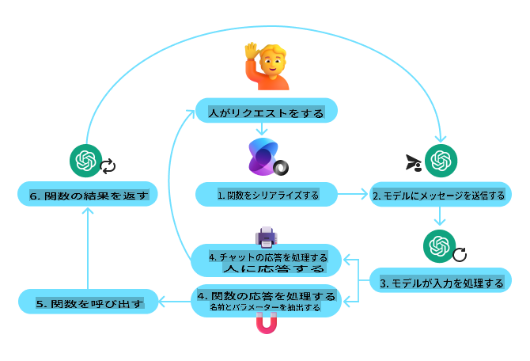
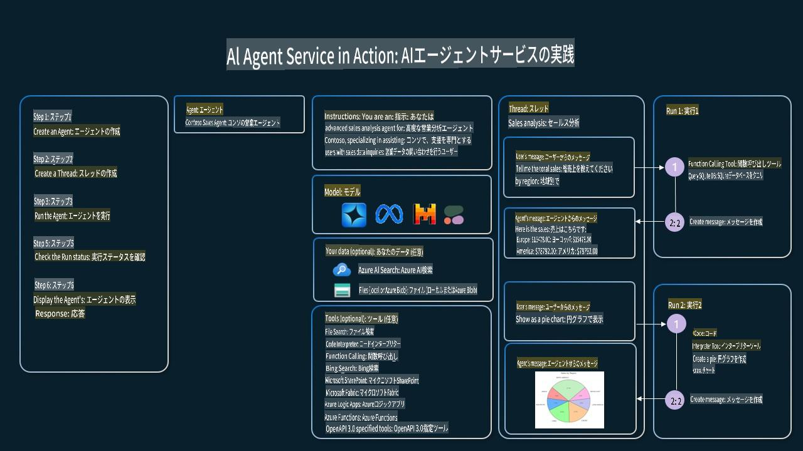

<!--
CO_OP_TRANSLATOR_METADATA:
{
  "original_hash": "b8ea2abd1a674f736d5fc08982e6ec06",
  "translation_date": "2025-03-28T11:51:21+00:00",
  "source_file": "04-tool-use\\README.md",
  "language_code": "ja"
}
-->
[](https://youtu.be/vieRiPRx-gI?si=cEZ8ApnT6Sus9rhn)

> _(上記の画像をクリックすると、このレッスンの動画が視聴できます)_

# ツール使用デザインパターン

ツールは、AIエージェントに幅広い能力を持たせるために重要です。エージェントが実行できるアクションが限られている代わりに、ツールを追加することで、エージェントはより多くのアクションを実行できるようになります。この章では、AIエージェントが特定のツールを使用して目標を達成する方法を説明するツール使用デザインパターンについて学びます。

## はじめに

このレッスンでは、次の質問に答えることを目指します：

- ツール使用デザインパターンとは何か？
- どのようなユースケースに適用できるのか？
- デザインパターンを実装するために必要な要素/構成要素は何か？
- 信頼できるAIエージェントを構築するためにツール使用デザインパターンを使用する際の特別な考慮事項は何か？

## 学習目標

このレッスンを完了すると、以下ができるようになります：

- ツール使用デザインパターンとその目的を定義する。
- ツール使用デザインパターンが適用できるユースケースを特定する。
- デザインパターンを実装するために必要な重要な要素を理解する。
- このデザインパターンを使用するAIエージェントにおいて信頼性を確保するための考慮事項を認識する。

## ツール使用デザインパターンとは？

**ツール使用デザインパターン**は、LLMが特定の目標を達成するために外部ツールと対話できる能力を持たせることに焦点を当てています。ツールとは、エージェントがアクションを実行するために使用できるコードです。ツールは、計算機のような単純な関数や、株価の検索や天気予報のようなサードパーティサービスへのAPIコールなどがあります。AIエージェントの文脈では、ツールは**モデル生成の関数呼び出し**に応じてエージェントによって実行されるよう設計されています。

## 適用できるユースケースは何か？

AIエージェントは、ツールを活用して複雑なタスクを完了したり、情報を取得したり、意思決定を行うことができます。ツール使用デザインパターンは、データベース、ウェブサービス、コードインタープリターなどの外部システムと動的にやり取りする必要があるシナリオでよく使用されます。この能力は、以下のような多くのユースケースで役立ちます：

- **動的情報取得**：エージェントが外部APIやデータベースを照会して最新データを取得（例：SQLiteデータベースを使ったデータ分析、株価や天気情報の取得）。
- **コードの実行と解釈**：エージェントがコードやスクリプトを実行して数学問題を解いたり、レポートを生成したり、シミュレーションを行ったりする。
- **ワークフローの自動化**：タスクスケジューラー、メールサービス、データパイプラインなどのツールを統合して繰り返しやマルチステップのワークフローを自動化。
- **カスタマーサポート**：エージェントがCRMシステム、チケティングプラットフォーム、ナレッジベースと対話してユーザーの問い合わせを解決。
- **コンテンツ生成と編集**：エージェントが文法チェック、テキスト要約、コンテンツ安全性評価などのツールを活用してコンテンツ作成タスクを支援。

## ツール使用デザインパターンを実装するために必要な要素/構成要素は何か？

これらの構成要素により、AIエージェントは幅広いタスクを実行できるようになります。ツール使用デザインパターンを実装するために必要な主要な要素を見てみましょう：

- **関数/ツール呼び出し**：LLMがツールと対話するための主な方法。関数やツールはエージェントがタスクを実行するために使用する再利用可能なコードブロックです。計算機のような単純な関数から、株価検索や天気予報などのサードパーティサービスへのAPIコールまで幅広いものがあります。

- **動的情報取得**：エージェントが外部APIやデータベースを照会して最新データを取得。この機能は、データ分析、株価や天気情報の取得などのタスクに役立ちます。

- **コードの実行と解釈**：エージェントがコードやスクリプトを実行して数学問題を解いたり、レポートを生成したり、シミュレーションを行ったりする。

- **ワークフローの自動化**：タスクスケジューラー、メールサービス、データパイプラインなどのツールを統合して繰り返しやマルチステップのワークフローを自動化。

- **カスタマーサポート**：エージェントがCRMシステム、チケティングプラットフォーム、ナレッジベースと対話してユーザーの問い合わせを解決。

- **コンテンツ生成と編集**：エージェントが文法チェック、テキスト要約、コンテンツ安全性評価などのツールを活用してコンテンツ作成タスクを支援。

次に、関数/ツール呼び出しについて詳しく見ていきます。

### 関数/ツール呼び出し

関数呼び出しは、Large Language Models (LLMs) がツールと対話するための主な方法です。「関数」と「ツール」はしばしば同義語として使用されます。なぜなら、関数（再利用可能なコードブロック）がエージェントがタスクを実行するために使用する「ツール」だからです。関数のコードが呼び出されるためには、LLMがユーザーのリクエストを関数の説明と比較する必要があります。このため、利用可能な関数の説明を含むスキーマがLLMに送信されます。LLMはタスクに最も適した関数を選択し、その名前と引数を返します。選択された関数が呼び出され、そのレスポンスがLLMに返され、LLMがユーザーのリクエストに応答するための情報として使用します。

エージェントに関数呼び出しを実装するために、開発者が必要とするもの：

1. 関数呼び出しをサポートするLLMモデル
2. 関数の説明を含むスキーマ
3. 説明された各関数のコード

サンフランシスコの現在時刻を取得する例を使って説明します：

1. **関数呼び出しをサポートするLLMを初期化する**：

    すべてのモデルが関数呼び出しをサポートしているわけではないため、使用しているLLMが対応しているか確認することが重要です。<a href="https://learn.microsoft.com/azure/ai-services/openai/how-to/function-calling" target="_blank">Azure OpenAI</a> は関数呼び出しをサポートしています。まずAzure OpenAIクライアントを初期化します。

    ```python
    # Initialize the Azure OpenAI client
    client = AzureOpenAI(
        azure_endpoint = os.getenv("AZURE_OPENAI_ENDPOINT"), 
        api_key=os.getenv("AZURE_OPENAI_API_KEY"),  
        api_version="2024-05-01-preview"
    )
    ```

1. **関数スキーマを作成する**：

    次に、関数名、関数の説明、および関数パラメータの名前と説明を含むJSONスキーマを定義します。このスキーマを先ほど作成したクライアントに渡し、サンフランシスコの時刻を取得するユーザーのリクエストと共に送信します。重要な点は、返されるのが**ツール呼び出し**であり、質問への最終的な答えではないことです。前述したように、LLMはタスクに選択した関数の名前とその引数を返します。

    ```python
    # Function description for the model to read
    tools = [
        {
            "type": "function",
            "function": {
                "name": "get_current_time",
                "description": "Get the current time in a given location",
                "parameters": {
                    "type": "object",
                    "properties": {
                        "location": {
                            "type": "string",
                            "description": "The city name, e.g. San Francisco",
                        },
                    },
                    "required": ["location"],
                },
            }
        }
    ]
    ```
   
    ```python
  
    # Initial user message
    messages = [{"role": "user", "content": "What's the current time in San Francisco"}] 
  
    # First API call: Ask the model to use the function
      response = client.chat.completions.create(
          model=deployment_name,
          messages=messages,
          tools=tools,
          tool_choice="auto",
      )
  
      # Process the model's response
      response_message = response.choices[0].message
      messages.append(response_message)
  
      print("Model's response:")  

      print(response_message)
  
    ```

    ```bash
    Model's response:
    ChatCompletionMessage(content=None, role='assistant', function_call=None, tool_calls=[ChatCompletionMessageToolCall(id='call_pOsKdUlqvdyttYB67MOj434b', function=Function(arguments='{"location":"San Francisco"}', name='get_current_time'), type='function')])
    ```
  
1. **タスクを実行するために必要な関数コード**：

    LLMが実行すべき関数を選択した後、そのタスクを実行するコードを実装し、実行する必要があります。Pythonで現在時刻を取得するコードを実装できます。また、response_messageから名前と引数を抽出して最終結果を得るコードも書く必要があります。

    ```python
      def get_current_time(location):
        """Get the current time for a given location"""
        print(f"get_current_time called with location: {location}")  
        location_lower = location.lower()
        
        for key, timezone in TIMEZONE_DATA.items():
            if key in location_lower:
                print(f"Timezone found for {key}")  
                current_time = datetime.now(ZoneInfo(timezone)).strftime("%I:%M %p")
                return json.dumps({
                    "location": location,
                    "current_time": current_time
                })
      
        print(f"No timezone data found for {location_lower}")  
        return json.dumps({"location": location, "current_time": "unknown"})
    ```

     ```python
     # Handle function calls
      if response_message.tool_calls:
          for tool_call in response_message.tool_calls:
              if tool_call.function.name == "get_current_time":
     
                  function_args = json.loads(tool_call.function.arguments)
     
                  time_response = get_current_time(
                      location=function_args.get("location")
                  )
     
                  messages.append({
                      "tool_call_id": tool_call.id,
                      "role": "tool",
                      "name": "get_current_time",
                      "content": time_response,
                  })
      else:
          print("No tool calls were made by the model.")  
  
      # Second API call: Get the final response from the model
      final_response = client.chat.completions.create(
          model=deployment_name,
          messages=messages,
      )
  
      return final_response.choices[0].message.content
     ```

     ```bash
      get_current_time called with location: San Francisco
      Timezone found for san francisco
      The current time in San Francisco is 09:24 AM.
     ```

関数呼び出しは、ほぼすべてのエージェントツール使用設計の中心にありますが、ゼロから実装するのは時に難しい場合があります。[レッスン2](../../../02-explore-agentic-frameworks) で学んだように、エージェンティックフレームワークを使うと、ツール使用を実装するための事前構築された構成要素を利用できます。

## エージェンティックフレームワークを使用したツール使用の例

以下は、さまざまなエージェンティックフレームワークを使用してツール使用デザインパターンを実装する例です：

### Semantic Kernel

<a href="https://learn.microsoft.com/azure/ai-services/agents/overview" target="_blank">Semantic Kernel</a> は、.NET、Python、Java開発者がLarge Language Models (LLMs) を利用する際に役立つオープンソースAIフレームワークです。関数呼び出しを簡素化するため、モデルに関数とそのパラメータを説明するプロセスである<a href="https://learn.microsoft.com/semantic-kernel/concepts/ai-services/chat-completion/function-calling/?pivots=programming-language-python#1-serializing-the-functions" target="_blank">シリアライズ</a>を自動的に行います。また、モデルとコード間の通信を処理します。Semantic Kernelのようなエージェンティックフレームワークを使用するもう一つの利点は、<a href="https://github.com/microsoft/semantic-kernel/blob/main/python/samples/getting_started_with_agents/openai_assistant/step4_assistant_tool_file_search.py" target="_blank">ファイル検索</a>や<a href="https://github.com/microsoft/semantic-kernel/blob/main/python/samples/getting_started_with_agents/openai_assistant/step3_assistant_tool_code_interpreter.py" target="_blank">コードインタープリター</a>のような事前構築されたツールにアクセスできることです。

以下の図は、Semantic Kernelでの関数呼び出しのプロセスを示しています：



Semantic Kernelでは関数/ツールは<a href="https://learn.microsoft.com/semantic-kernel/concepts/plugins/?pivots=programming-language-python" target="_blank">プラグイン</a>と呼ばれます。`get_current_time` function we saw earlier into a plugin by turning it into a class with the function in it. We can also import the `kernel_function` デコレーターを使用して関数の説明を入力できます。その後、GetCurrentTimePluginを使用してカーネルを作成すると、カーネルが関数とそのパラメータを自動的にシリアライズし、LLMに送信するスキーマを作成します。

```python
from semantic_kernel.functions import kernel_function

class GetCurrentTimePlugin:
    async def __init__(self, location):
        self.location = location

    @kernel_function(
        description="Get the current time for a given location"
    )
    def get_current_time(location: str = ""):
        ...

```

```python 
from semantic_kernel import Kernel

# Create the kernel
kernel = Kernel()

# Create the plugin
get_current_time_plugin = GetCurrentTimePlugin(location)

# Add the plugin to the kernel
kernel.add_plugin(get_current_time_plugin)
```
  
### Azure AI Agent Service

<a href="https://learn.microsoft.com/azure/ai-services/agents/overview" target="_blank">Azure AI Agent Service</a> は、開発者が高品質で拡張性のあるAIエージェントを安全に構築、展開、スケールできるように設計された新しいエージェンティックフレームワークです。基盤となるコンピュートやストレージリソースを管理する必要がないため、特にエンタープライズアプリケーションで役立ちます。これは完全管理型サービスであり、エンタープライズグレードのセキュリティを備えています。

LLM APIを直接使用して開発する場合と比較して、Azure AI Agent Serviceには以下の利点があります：

- 自動ツール呼び出し – ツール呼び出しを解析し、ツールを実行し、レスポンスを処理する必要がなく、これらすべてがサーバーサイドで行われます。
- 安全に管理されたデータ – 会話状態を管理する代わりに、スレッドを使用して必要な情報をすべて保存できます。
- すぐに使えるツール – Bing、Azure AI Search、Azure Functionsなどのデータソースと対話するためのツールを利用できます。

Azure AI Agent Serviceで利用可能なツールは、以下の2つのカテゴリに分けられます：

1. 知識ツール：
    - <a href="https://learn.microsoft.com/azure/ai-services/agents/how-to/tools/bing-grounding?tabs=python&pivots=overview" target="_blank">Bing検索によるグラウンディング</a>
    - <a href="https://learn.microsoft.com/azure/ai-services/agents/how-to/tools/file-search?tabs=python&pivots=overview" target="_blank">ファイル検索</a>
    - <a href="https://learn.microsoft.com/azure/ai-services/agents/how-to/tools/azure-ai-search?tabs=azurecli%2Cpython&pivots=overview-azure-ai-search" target="_blank">Azure AI Search</a>

2. アクションツール：
    - <a href="https://learn.microsoft.com/azure/ai-services/agents/how-to/tools/function-calling?tabs=python&pivots=overview" target="_blank">関数呼び出し</a>
    - <a href="https://learn.microsoft.com/azure/ai-services/agents/how-to/tools/code-interpreter?tabs=python&pivots=overview" target="_blank">コードインタープリター</a>
    - <a href="https://learn.microsoft.com/azure/ai-services/agents/how-to/tools/openapi-spec?tabs=python&pivots=overview" target="_blank">OpenAPIで定義されたツール</a>
    - <a href="https://learn.microsoft.com/azure/ai-services/agents/how-to/tools/azure-functions?pivots=overview" target="_blank">Azure Functions</a>

Agent Serviceでは、これらのツールを`toolset`. It also utilizes `threads` which keep track of the history of messages from a particular conversation.

Imagine you are a sales agent at a company called Contoso. You want to develop a conversational agent that can answer questions about your sales data.

The following image illustrates how you could use Azure AI Agent Service to analyze your sales data:



To use any of these tools with the service we can create a client and define a tool or toolset. To implement this practically we can use the following Python code. The LLM will be able to look at the toolset and decide whether to use the user created function, `fetch_sales_data_using_sqlite_query`や、ユーザーリクエストに応じた事前構築されたコードインタープリターとして使用できます。

```python 
import os
from azure.ai.projects import AIProjectClient
from azure.identity import DefaultAzureCredential
from fecth_sales_data_functions import fetch_sales_data_using_sqlite_query # fetch_sales_data_using_sqlite_query function which can be found in a fetch_sales_data_functions.py file.
from azure.ai.projects.models import ToolSet, FunctionTool, CodeInterpreterTool

project_client = AIProjectClient.from_connection_string(
    credential=DefaultAzureCredential(),
    conn_str=os.environ["PROJECT_CONNECTION_STRING"],
)

# Initialize function calling agent with the fetch_sales_data_using_sqlite_query function and adding it to the toolset
fetch_data_function = FunctionTool(fetch_sales_data_using_sqlite_query)
toolset = ToolSet()
toolset.add(fetch_data_function)

# Initialize Code Interpreter tool and adding it to the toolset. 
code_interpreter = code_interpreter = CodeInterpreterTool()
toolset = ToolSet()
toolset.add(code_interpreter)

agent = project_client.agents.create_agent(
    model="gpt-4o-mini", name="my-agent", instructions="You are helpful agent", 
    toolset=toolset
)
```

## 信頼できるAIエージェントを構築するためにツール使用デザインパターンを使用する際の特別な考慮事項は何か？

LLMによって動的に生成されるSQLに関する一般的な懸念は、セキュリティ、特にSQLインジェクションやデータベースの削除や改ざんのリスクです。これらの懸念は有効ですが、データベースのアクセス権限を適切に設定することで効果的に軽減できます。ほとんどのデータベースでは、データベースを読み取り専用に設定する必要があります。PostgreSQLやAzure SQLのようなデータベースサービスでは、アプリに読み取り専用（SELECT）ロールを割り当てるべきです。

アプリを安全な環境で実行することでさらに保護が強化されます。エンタープライズシナリオでは、通常、データは運用システムから読み取り専用データベースまたはデータウェアハウスに抽出され、変換されます。このアプローチにより、データが安全で、パフォーマンスとアクセス性が最適化され、アプリのアクセスが制限されて読み取り専用になります。

## 追加リソース

- <a href="https://microsoft.github.io/build-your-first-agent-with-azure-ai-agent-service-workshop/" target="_blank">Azure AI Agents Service Workshop</a>
- <a href="https://github.com/Azure-Samples/contoso-creative-writer/tree/main/docs/workshop" target="_blank">Contoso Creative Writer Multi-Agent Workshop</a>
- <a href="https://learn.microsoft.com/semantic-kernel/concepts/ai-services/chat-completion/function-calling/?pivots=programming-language-python#1-serializing-the-functions" target="_blank">Semantic Kernel Function Calling Tutorial</a>
- <a href="https://github.com/microsoft/semantic-kernel/blob/main/python/samples/getting_started_with_agents/openai_assistant/step3_assistant_tool_code

**免責事項**:  
本書類は、AI翻訳サービス [Co-op Translator](https://github.com/Azure/co-op-translator) を使用して翻訳されています。正確性を期すよう努めておりますが、自動翻訳には誤りや不正確さが含まれる可能性があります。原文（原本）が信頼できる情報源とみなされるべきです。重要な情報については、専門の人間による翻訳を推奨します。本翻訳の利用に起因する誤解や誤訳について、当社は一切の責任を負いません。