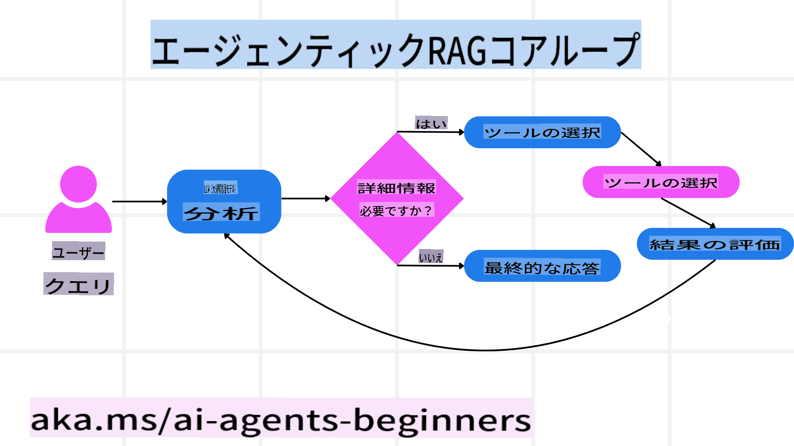
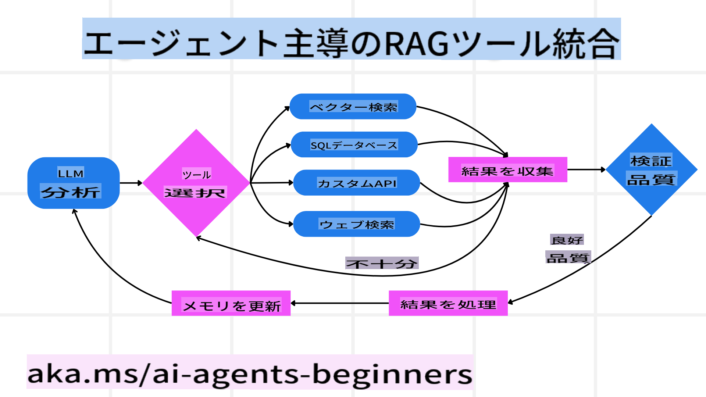
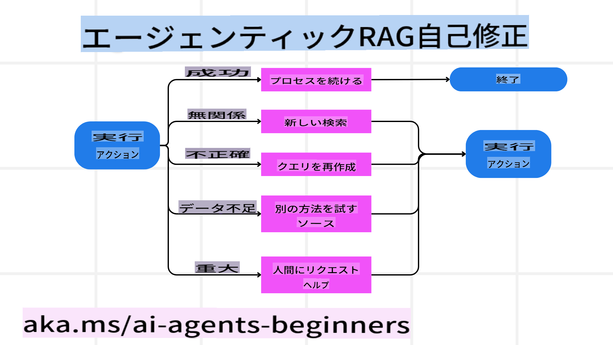
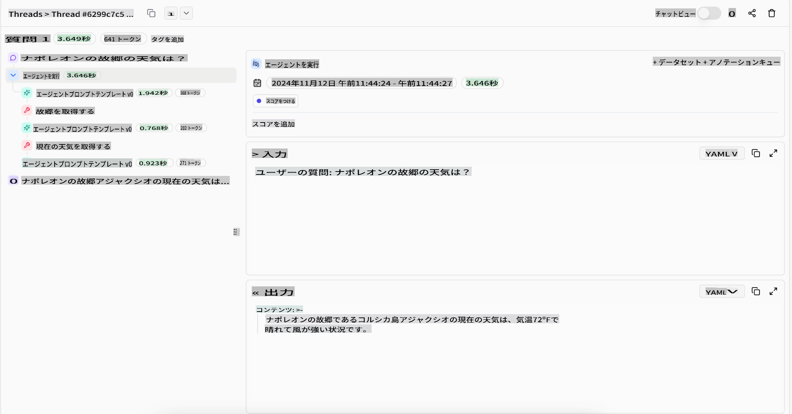

<!--
CO_OP_TRANSLATOR_METADATA:
{
  "original_hash": "4d215d159f2f3b96644fd62657988d23",
  "translation_date": "2025-03-28T11:56:36+00:00",
  "source_file": "05-agentic-rag\\README.md",
  "language_code": "ja"
}
-->

> _(このレッスンの動画を見るには、上の画像をクリックしてください)_

# Agentic RAG

このレッスンでは、Agentic Retrieval-Augmented Generation (Agentic RAG) について詳しく解説します。Agentic RAG は、新たな AI パラダイムであり、大規模言語モデル (LLM) が外部ソースから情報を引き出しながら次のステップを自律的に計画する仕組みです。静的な「検索して読む」パターンとは異なり、Agentic RAG はツールや関数呼び出し、構造化された出力を交えた反復的な LLM 呼び出しを伴います。このシステムは結果を評価し、クエリを修正し、必要に応じて追加のツールを呼び出し、満足のいく解決策に達するまでこのサイクルを続けます。

## はじめに

このレッスンでは以下を学びます：

- **Agentic RAG の理解:** 大規模言語モデル (LLM) が外部データソースから情報を引き出しながら次のステップを自律的に計画するという新たな AI パラダイムについて学びます。
- **反復的な Maker-Checker スタイル:** ツールや関数呼び出し、構造化された出力を交えた反復的な LLM 呼び出しのループを理解し、正確性の向上や誤ったクエリの処理方法を学びます。
- **実用的な応用の探索:** 正確性が重要な環境、複雑なデータベース操作、長期的なワークフローなど、Agentic RAG が活躍するシナリオを特定します。

## 学習目標

このレッスンを終えた後、以下が理解できるようになります：

- **Agentic RAG の理解:** 外部データソースから情報を引き出しながら次のステップを自律的に計画するという新たな AI パラダイムについて学びます。
- **反復的 Maker-Checker スタイル:** ツールや関数呼び出し、構造化された出力を交えた反復的な LLM 呼び出しのループを理解し、正確性を向上させ、誤ったクエリを処理する方法を学びます。
- **推論プロセスの所有:** システムがどのように問題へのアプローチを決定するかを理解し、事前定義された経路に頼らない方法を学びます。
- **ワークフロー:** エージェントモデルが市場動向レポートを取得し、競合他社データを特定し、内部売上データを相関させ、結果を統合し、戦略を評価するプロセスを理解します。
- **反復ループ、ツール統合、メモリ:** 反復的な対話パターンに依存し、ステップ間で状態やメモリを維持する仕組みを学び、無駄なループを回避し、情報に基づいた決定を下します。
- **失敗モードと自己修正の処理:** 診断ツールの使用や人間の監督に頼ることで、システムがどのように自己修正を行うかを探ります。
- **エージェンシーの限界:** ドメイン固有の自律性、インフラ依存性、ガードレールの尊重に焦点を当て、Agentic RAG の限界を理解します。
- **実用的なユースケースと価値:** 正確性が重要な環境、複雑なデータベース操作、長期的なワークフローなど、Agentic RAG が活躍するシナリオを特定します。
- **ガバナンス、透明性、信頼性:** 説明可能な推論、バイアス制御、人間の監督など、ガバナンスと透明性の重要性を学びます。

## Agentic RAG とは？

Agentic Retrieval-Augmented Generation (Agentic RAG) は、新たな AI パラダイムであり、大規模言語モデル (LLM) が外部ソースから情報を引き出しながら次のステップを自律的に計画します。静的な「検索して読む」パターンとは異なり、Agentic RAG はツールや関数呼び出し、構造化された出力を交えた反復的な LLM 呼び出しを伴います。このシステムは結果を評価し、クエリを修正し、必要に応じて追加のツールを呼び出し、満足のいく解決策に達するまでこのサイクルを続けます。この反復的な「Maker-Checker」スタイルは、正確性を向上させ、誤ったクエリを処理し、高品質な結果を保証します。

システムは推論プロセスを自律的に管理し、失敗したクエリを書き直したり、異なる検索方法を選択したり、複数のツール (Azure AI Search のベクター検索、SQL データベース、カスタム API など) を統合したりすることができます。エージェント型システムの際立った特性は、推論プロセスを自律的に所有する能力にあります。従来の RAG 実装は事前定義された経路に依存しますが、エージェント型システムは取得した情報の質に基づいてステップの順序を自律的に決定します。

## Agentic Retrieval-Augmented Generation (Agentic RAG) の定義

Agentic Retrieval-Augmented Generation (Agentic RAG) は、外部データソースから情報を引き出すだけでなく、次のステップを自律的に計画する LLM を用いた AI 開発の新たなパラダイムです。静的な「検索して読む」パターンや慎重にスクリプト化されたプロンプトシーケンスとは異なり、Agentic RAG はツールや関数呼び出し、構造化された出力を交えた反復的な LLM 呼び出しのループを伴います。システムは取得した結果を評価し、クエリを修正するか、必要に応じて追加のツールを呼び出し、満足のいく解決策に達するまでこのサイクルを続けます。

この反復的な「Maker-Checker」スタイルの操作は、正確性を向上させ、構造化データベース (例: NL2SQL) への誤ったクエリを処理し、バランスの取れた高品質な結果を保証するよう設計されています。複雑に設計されたプロンプトチェーンに頼るのではなく、システムは推論プロセスを自律的に管理します。失敗したクエリを書き直したり、異なる検索方法を選択したり、Azure AI Search のベクター検索、SQL データベース、カスタム API など複数のツールを統合したりすることが可能です。これにより、複雑なオーケストレーションフレームワークが不要になり、比較的シンプルな「LLM 呼び出し → ツール使用 → LLM 呼び出し → …」のループで洗練された、根拠のある出力を得ることができます。

## 推論プロセスの所有

システムを「エージェント型」にする際立った特性は、推論プロセスを自律的に所有する能力です。従来の RAG 実装では、人間がモデルの経路を事前に定義することに依存しています。つまり、何を取得するか、いつ取得するかを示す思考の連鎖です。
しかし、システムが真にエージェント型である場合、問題へのアプローチ方法を内部で決定します。それは単にスクリプトを実行するだけではなく、取得した情報の質に基づいてステップの順序を自律的に決定します。
例えば、製品ローンチ戦略を作成するよう求められた場合、エージェント型モデルは次のような手順を自律的に実行します：

1. Bing Web Grounding を使用して現在の市場動向レポートを取得
2. Azure AI Search を使用して関連する競合データを特定
3. Azure SQL Database を使用して過去の内部売上データを相関
4. Azure OpenAI Service を介して統合された戦略を作成
5. 戦略のギャップや矛盾を評価し、必要に応じて再取得を促す
これらすべてのステップ（クエリの修正、ソースの選択、満足するまでの反復）は、モデルが決定し、人間が事前にスクリプト化するものではありません。

## 反復ループ、ツール統合、メモリ

エージェント型システムは、次のようなループ型の対話パターンに依存します：

- **初回呼び出し:** ユーザーの目標（ユーザープロンプト）が LLM に提示されます。
- **ツール呼び出し:** モデルが不足している情報や曖昧な指示を特定した場合、ベクターデータベースクエリ（例: Azure AI Search のハイブリッド検索）や構造化 SQL 呼び出しなど、適切なツールや検索方法を選択して追加のコンテキストを収集します。
- **評価と修正:** 戻ってきたデータを確認し、情報が十分であるかをモデルが判断します。不十分であれば、クエリを修正したり、別のツールを試したり、アプローチを調整します。
- **満足するまで繰り返し:** このサイクルは、モデルが十分な明確さと証拠を得て、最終的なよく練られた回答を提供できると判断するまで続きます。
- **メモリと状態:** システムはステップ間で状態とメモリを維持するため、以前の試みとその結果を記憶し、無駄なループを回避し、進むにつれてより情報に基づいた決定を下すことができます。

時間が経つにつれて、これにより進化する理解が生まれ、モデルは複雑で多段階のタスクを人間がプロンプトを修正したり介入したりすることなく処理できるようになります。

## 失敗モードと自己修正の処理

Agentic RAG の自律性は、強力な自己修正機構も含んでいます。システムが行き詰まった場合（例えば、無関係なドキュメントを取得したり、誤ったクエリに遭遇したりした場合）、以下を行うことができます：

- **反復と再クエリ:** 価値の低い回答を返す代わりに、新しい検索戦略を試したり、データベースクエリを書き直したり、代替データセットを参照したりします。
- **診断ツールの使用:** システムは、推論ステップをデバッグしたり、取得したデータの正確性を確認したりするための追加機能を呼び出すことがあります。Azure AI Tracing などのツールは、堅牢な観測性とモニタリングを可能にする上で重要です。
- **人間の監督に依存:** 高リスクまたは繰り返し失敗するシナリオでは、モデルが不確実性を示し、人間の指導を求める場合があります。人間が修正フィードバックを提供すると、モデルはその教訓を以後に活用することができます。

この反復的で動的なアプローチにより、モデルは継続的に改善し、単なる一発勝負のシステムではなく、セッション中の失敗から学習するシステムになります。

## エージェンシーの限界

タスク内での自律性にもかかわらず、Agentic RAG は人工汎用知能と同義ではありません。その「エージェンシー」の能力は、人間の開発者が提供するツール、データソース、ポリシーに限定されています。独自のツールを発明したり、設定されたドメインの境界を超えたりすることはできません。むしろ、手元にあるリソースを動的にオーケストレーションする点で優れています。
より高度な AI 形式との主な違いは次のとおりです：

1. **ドメイン固有の自律性:** Agentic RAG システムは、既知のドメイン内でユーザー定義の目標を達成することに焦点を当てており、クエリの書き直しやツール選択などの戦略を使用して成果を向上させます。
2. **インフラ依存性:** システムの能力は、開発者が統合したツールやデータに依存します。これらの境界を人間の介入なしに超えることはできません。
3. **ガードレールの尊重:** 倫理的ガイドライン、コンプライアンスルール、ビジネスポリシーは依然として非常に重要です。エージェントの自由は常に安全対策と監視メカニズムによって制約されています（おそらく？）。

## 実用的なユースケースと価値

Agentic RAG は、反復的な改良と精度が求められるシナリオで特に優れています：

1. **正確性重視の環境:** コンプライアンスチェック、規制分析、法的調査などでは、エージェント型モデルが事実を繰り返し確認し、複数のソースを参照し、クエリを書き直して、徹底的に精査された回答を生成します。
2. **複雑なデータベース操作:** クエリが失敗したり調整が必要になることが多い構造化データを扱う場合、システムは Azure SQL や Microsoft Fabric OneLake を使用してクエリを自律的に改良し、最終的な取得結果がユーザーの意図に沿うようにします。
3. **長期的なワークフロー:** 新しい情報が浮上するにつれて進化する長期セッションでは、Agentic RAG が新しいデータを継続的に取り込み、問題空間についてより多くを学ぶにつれて戦略を変更できます。

## ガバナンス、透明性、信頼性

これらのシステムが推論においてより自律的になるにつれ、ガバナンスと透明性が重要になります：

- **説明可能な推論:** モデルは、行ったクエリ、参照したソース、結論に至るために取った推論ステップの監査証跡を提供できます。Azure AI Content Safety や Azure AI Tracing / GenAIOps などのツールは、透明性を維持し、リスクを軽減するのに役立ちます。
- **バイアス制御とバランスの取れた取得:** 開発者は取得戦略を調整してバランスの取れた代表的なデータソースを考慮し、Azure Machine Learning を使用して高度なデータサイエンス組織向けのカスタムモデルで出力を定期的に監査し、バイアスや偏りを検出できます。
- **人間の監督とコンプライアンス:** 敏感なタスクでは、人間のレビューが依然として重要です。Agentic RAG は高リスクの決定において人間の判断を置き換えるものではなく、より徹底的に精査されたオプションを提供することでそれを補完します。

マルチステッププロセスをデバッグするのは非常に難しいため、行動の明確な記録を提供するツールが必要です。以下は、Literal AI（Chainlit の背後にある企業）によるエージェント実行の例です：

## 結論

Agentic RAG は、AI システムが複雑でデータ集約

**免責事項**:  
この文書は、AI翻訳サービス[Co-op Translator](https://github.com/Azure/co-op-translator)を使用して翻訳されています。正確性を追求しておりますが、自動翻訳には誤りや不正確さが含まれる可能性があります。元の言語で記載された文書が公式の情報源とみなされるべきです。重要な情報については、専門の人間による翻訳をお勧めします。本翻訳の利用によって生じる誤解や誤認に対して、当社は責任を負いません。