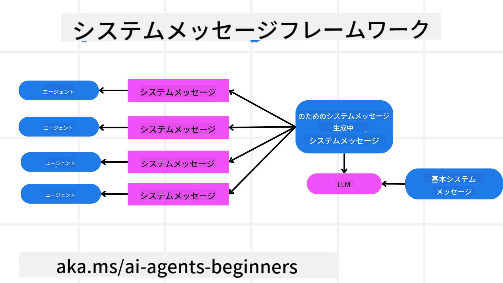
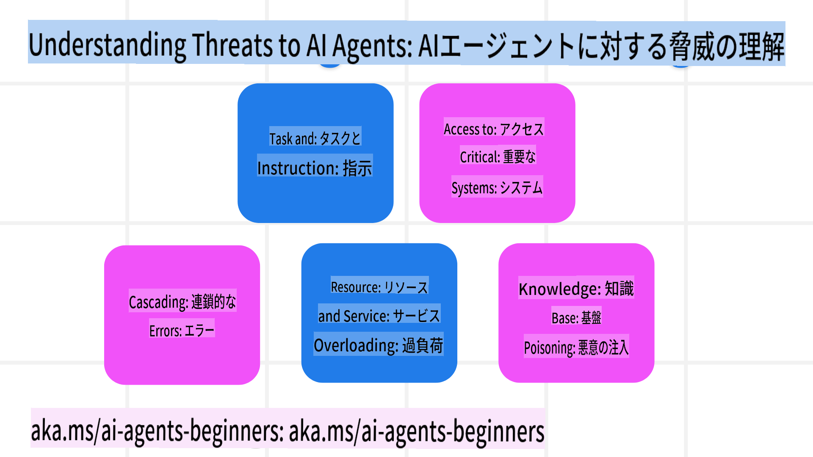
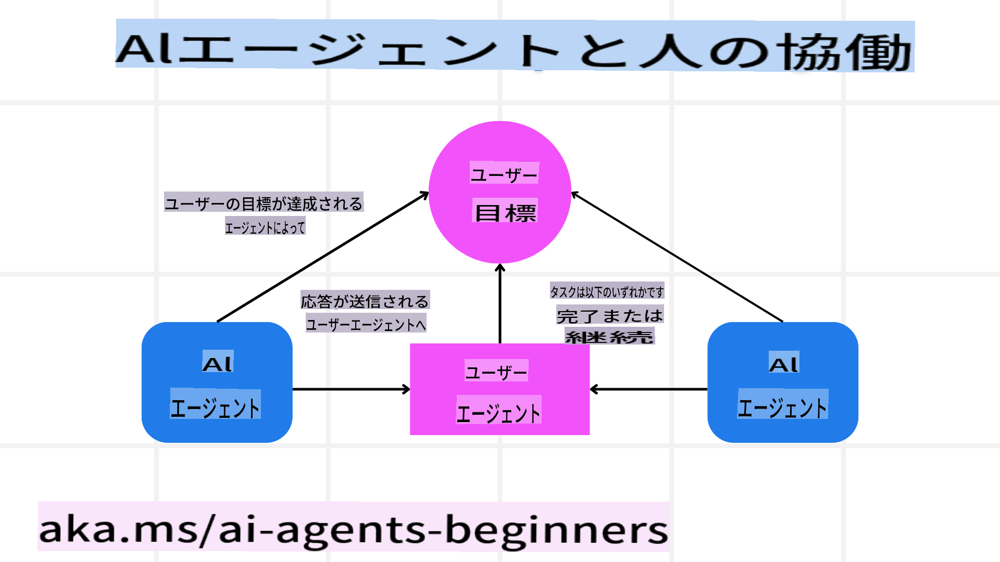

<!--
CO_OP_TRANSLATOR_METADATA:
{
  "original_hash": "c069d7ff0feca3027f88819355866ca1",
  "translation_date": "2025-03-28T11:58:58+00:00",
  "source_file": "06-building-trustworthy-agents\\README.md",
  "language_code": "ja"
}
-->
[](https://youtu.be/iZKkMEGBCUQ?si=Q-kEbcyHUMPoHp8L)

> _(上の画像をクリックすると、このレッスンの動画をご覧いただけます)_

# 信頼性の高いAIエージェントの構築

## はじめに

このレッスンでは以下を学びます：

- 安全で効果的なAIエージェントの構築と展開方法  
- AIエージェントを開発する際の重要なセキュリティ考慮事項  
- データとユーザーのプライバシーを維持しながらAIエージェントを開発する方法  

## 学習目標

このレッスンを完了すると、次のことができるようになります：

- AIエージェントを作成する際のリスクを特定し、軽減する方法を理解する  
- データとアクセスを適切に管理するためのセキュリティ対策を実施する  
- データのプライバシーを維持し、質の高いユーザー体験を提供するAIエージェントを作成する  

## 安全性

まずは、安全なエージェントアプリケーションを構築する方法を見ていきましょう。安全性とは、AIエージェントが設計通りに動作することを意味します。エージェントアプリケーションを構築する開発者として、私たちは安全性を最大化するための方法とツールを持っています。

### システムメッセージフレームワークの構築

大規模言語モデル（LLM）を使用してAIアプリケーションを構築したことがある方なら、強固なシステムプロンプトやシステムメッセージの設計がいかに重要かご存知でしょう。これらのプロンプトは、LLMがユーザーやデータとどのようにやり取りするかのメタルール、指示、ガイドラインを設定します。

AIエージェントの場合、システムプロンプトはさらに重要です。エージェントが設計されたタスクを完了するためには、非常に具体的な指示が必要だからです。

スケーラブルなシステムプロンプトを作成するために、アプリケーション内の1つまたは複数のエージェントを構築するためのシステムメッセージフレームワークを使用することができます：



#### ステップ1: メタシステムメッセージを作成する

メタプロンプトは、作成するエージェントのシステムプロンプトを生成するためにLLMによって使用されます。これをテンプレートとして設計することで、必要に応じて複数のエージェントを効率的に作成できます。

以下は、LLMに与えるメタシステムメッセージの例です：

```plaintext
You are an expert at creating AI agent assistants. 
You will be provided a company name, role, responsibilities and other
information that you will use to provide a system prompt for.
To create the system prompt, be descriptive as possible and provide a structure that a system using an LLM can better understand the role and responsibilities of the AI assistant. 
```

#### ステップ2: 基本的なプロンプトを作成する

次に、AIエージェントを説明する基本的なプロンプトを作成します。ここには、エージェントの役割、エージェントが完了するタスク、およびエージェントのその他の責任を含めるべきです。

例を以下に示します：

```plaintext
You are a travel agent for Contoso Travel that is great at booking flights for customers. To help customers you can perform the following tasks: lookup available flights, book flights, ask for preferences in seating and times for flights, cancel any previously booked flights and alert customers on any delays or cancellations of flights.  
```

#### ステップ3: LLMに基本的なシステムメッセージを提供する

次に、システムメッセージとしてメタシステムメッセージを提供し、基本的なシステムメッセージを追加します。

これにより、AIエージェントを誘導するためにより適切に設計されたシステムメッセージが生成されます：

```markdown
**Company Name:** Contoso Travel  
**Role:** Travel Agent Assistant

**Objective:**  
You are an AI-powered travel agent assistant for Contoso Travel, specializing in booking flights and providing exceptional customer service. Your main goal is to assist customers in finding, booking, and managing their flights, all while ensuring that their preferences and needs are met efficiently.

**Key Responsibilities:**

1. **Flight Lookup:**
    
    - Assist customers in searching for available flights based on their specified destination, dates, and any other relevant preferences.
    - Provide a list of options, including flight times, airlines, layovers, and pricing.
2. **Flight Booking:**
    
    - Facilitate the booking of flights for customers, ensuring that all details are correctly entered into the system.
    - Confirm bookings and provide customers with their itinerary, including confirmation numbers and any other pertinent information.
3. **Customer Preference Inquiry:**
    
    - Actively ask customers for their preferences regarding seating (e.g., aisle, window, extra legroom) and preferred times for flights (e.g., morning, afternoon, evening).
    - Record these preferences for future reference and tailor suggestions accordingly.
4. **Flight Cancellation:**
    
    - Assist customers in canceling previously booked flights if needed, following company policies and procedures.
    - Notify customers of any necessary refunds or additional steps that may be required for cancellations.
5. **Flight Monitoring:**
    
    - Monitor the status of booked flights and alert customers in real-time about any delays, cancellations, or changes to their flight schedule.
    - Provide updates through preferred communication channels (e.g., email, SMS) as needed.

**Tone and Style:**

- Maintain a friendly, professional, and approachable demeanor in all interactions with customers.
- Ensure that all communication is clear, informative, and tailored to the customer's specific needs and inquiries.

**User Interaction Instructions:**

- Respond to customer queries promptly and accurately.
- Use a conversational style while ensuring professionalism.
- Prioritize customer satisfaction by being attentive, empathetic, and proactive in all assistance provided.

**Additional Notes:**

- Stay updated on any changes to airline policies, travel restrictions, and other relevant information that could impact flight bookings and customer experience.
- Use clear and concise language to explain options and processes, avoiding jargon where possible for better customer understanding.

This AI assistant is designed to streamline the flight booking process for customers of Contoso Travel, ensuring that all their travel needs are met efficiently and effectively.

```

#### ステップ4: 繰り返し改善する

このシステムメッセージフレームワークの価値は、複数のエージェントのシステムメッセージを容易に作成できることと、時間をかけてシステムメッセージを改善できることです。完全なユースケースに最初から合致するシステムメッセージが得られることは稀です。基本的なシステムメッセージを微調整し、システムを通じて実行することで結果を比較評価することが可能です。

## 脅威の理解

信頼性の高いAIエージェントを構築するには、リスクや脅威を理解し、それらを軽減することが重要です。ここでは、AIエージェントに対するさまざまな脅威の一部と、それらにどのように備えるかを見ていきます。



### タスクと指示

**説明**: 攻撃者がプロンプトや入力を操作して、AIエージェントの指示や目標を変更しようとします。

**対策**: AIエージェントが処理する前に、危険なプロンプトを検出するための検証チェックや入力フィルターを実行します。これらの攻撃は通常、エージェントとの頻繁なやり取りを必要とするため、会話のターン数を制限することも有効な対策です。

### 重要なシステムへのアクセス

**説明**: AIエージェントが機密データを保存するシステムやサービスにアクセスできる場合、攻撃者がこれらのシステムとの通信を侵害する可能性があります。これには直接攻撃や、エージェントを通じてこれらのシステムに関する情報を取得しようとする間接的な試みが含まれます。

**対策**: AIエージェントがシステムにアクセスするのは必要最小限に制限します。また、エージェントとシステム間の通信を安全に保ちます。認証やアクセス制御を実施することも有効です。

### リソースやサービスの過負荷

**説明**: AIエージェントはタスクを完了するためにさまざまなツールやサービスにアクセスします。攻撃者がこれを利用して、大量のリクエストをエージェント経由で送信し、システム障害や高コストを引き起こす可能性があります。

**対策**: AIエージェントがサービスに送信できるリクエストの数を制限するポリシーを実施します。また、エージェントとの会話ターンやリクエスト数を制限することも効果的です。

### ナレッジベースの汚染

**説明**: このタイプの攻撃はAIエージェント自体を直接狙うのではなく、エージェントが使用するナレッジベースやその他のサービスを標的にします。これにより、エージェントがタスクを完了するために使用するデータや情報が汚染され、偏ったり意図しない応答をユーザーに返す可能性があります。

**対策**: エージェントがワークフローで使用するデータを定期的に検証します。このデータへのアクセスを安全に保ち、信頼できる人物のみが変更できるようにします。

### エラーの連鎖

**説明**: AIエージェントはタスクを完了するためにさまざまなツールやサービスにアクセスします。攻撃者によるエラーが他のシステムの障害を引き起こし、攻撃が広範囲に及び、トラブルシューティングが難しくなる可能性があります。

**対策**: エージェントが直接システムを攻撃できないよう、Dockerコンテナ内などの限定的な環境でタスクを実行させることが有効です。また、エラーが発生した際にフォールバックメカニズムやリトライロジックを作成することも、システム全体の障害を防ぐ方法です。

## 人間の関与（Human-in-the-Loop）

信頼性の高いAIエージェントシステムを構築するもう一つの効果的な方法は、人間の関与を取り入れることです。これにより、ユーザーがエージェントの実行中にフィードバックを提供できるフローが作成されます。ユーザーは実質的にマルチエージェントシステム内のエージェントとして機能し、プロセスの承認や終了を行います。



以下は、このコンセプトを実装するためにAutoGenを使用したコードスニペットです：

```python

# Create the agents.
model_client = OpenAIChatCompletionClient(model="gpt-4o-mini")
assistant = AssistantAgent("assistant", model_client=model_client)
user_proxy = UserProxyAgent("user_proxy", input_func=input)  # Use input() to get user input from console.

# Create the termination condition which will end the conversation when the user says "APPROVE".
termination = TextMentionTermination("APPROVE")

# Create the team.
team = RoundRobinGroupChat([assistant, user_proxy], termination_condition=termination)

# Run the conversation and stream to the console.
stream = team.run_stream(task="Write a 4-line poem about the ocean.")
# Use asyncio.run(...) when running in a script.
await Console(stream)

```

## 結論

信頼性の高いAIエージェントを構築するには、慎重な設計、堅牢なセキュリティ対策、継続的な改善が必要です。構造化されたメタプロンプトシステムを実装し、潜在的な脅威を理解して対策を講じることで、安全で効果的なAIエージェントを開発できます。また、人間の関与を取り入れることで、エージェントがユーザーのニーズに合致し、リスクを最小限に抑えることができます。AIが進化を続ける中で、セキュリティ、プライバシー、倫理的考慮に対して積極的な姿勢を維持することが、AI駆動システムにおける信頼性と信頼を育む鍵となるでしょう。

## 追加リソース

- <a href="https://learn.microsoft.com/azure/ai-studio/responsible-use-of-ai-overview" target="_blank">責任あるAIの概要</a>  
- <a href="https://learn.microsoft.com/azure/ai-studio/concepts/evaluation-approach-gen-ai" target="_blank">生成AIモデルとAIアプリケーションの評価</a>  
- <a href="https://learn.microsoft.com/azure/ai-services/openai/concepts/system-message?context=%2Fazure%2Fai-studio%2Fcontext%2Fcontext&tabs=top-techniques" target="_blank">安全性のためのシステムメッセージ</a>  
- <a href="https://blogs.microsoft.com/wp-content/uploads/prod/sites/5/2022/06/Microsoft-RAI-Impact-Assessment-Template.pdf?culture=en-us&country=us" target="_blank">リスク評価テンプレート</a>  

## 前のレッスン

[エージェンティックRAG](../05-agentic-rag/README.md)

## 次のレッスン

[プランニングデザインパターン](../07-planning-design/README.md)

**免責事項**:  
この文書は、AI翻訳サービス[Co-op Translator](https://github.com/Azure/co-op-translator)を使用して翻訳されています。正確性を追求しておりますが、自動翻訳には誤りや不正確な箇所が含まれる可能性があります。元の言語で作成された文書を正式な情報源としてお考えください。重要な情報については、専門の人間による翻訳を推奨します。この翻訳の使用に起因する誤解や誤認について、当社は一切の責任を負いません。