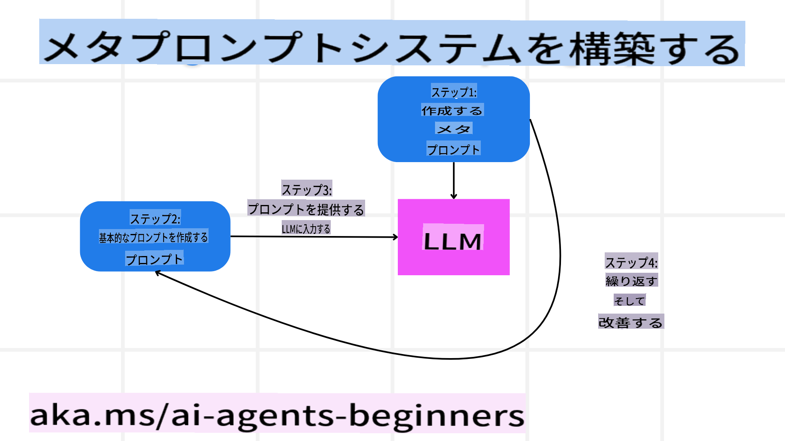

# 信頼できるAIエージェントの構築

## はじめに

このレッスンでは以下について学びます：

- 安全で効果的なAIエージェントの構築とデプロイ方法
- AIエージェント開発時の重要なセキュリティ考慮点
- データとユーザーのプライバシーを保護しながらAIエージェントを開発する方法

## 学習目標

このレッスンを完了すると、次のことができるようになります：

- AIエージェントを作成する際のリスクを特定し、軽減する方法を理解する。
- データとアクセスが適切に管理されるようにセキュリティ対策を実装する。
- データプライバシーを保ち、質の高いユーザー体験を提供するAIエージェントを作成する。

## 安全性

まず、安全なエージェントアプリケーションの構築について考えてみましょう。安全性とは、AIエージェントが設計通りに動作することを意味します。エージェントアプリケーションの開発者として、安全性を最大化するための方法とツールを活用することができます。

### メタプロンプトシステムの構築

もし大規模言語モデル（LLM）を使用してAIアプリケーションを構築したことがあるなら、堅牢なシステムプロンプトやシステムメッセージを設計する重要性をご存じでしょう。これらのプロンプトは、LLMがユーザーやデータとどのようにやり取りするかのメタルールや指示、ガイドラインを設定します。

AIエージェントの場合、システムプロンプトはさらに重要です。なぜなら、エージェントが設計されたタスクを完了するためには、非常に具体的な指示が必要だからです。

スケーラブルなシステムプロンプトを作成するために、アプリケーション内で1つ以上のエージェントを構築する際にメタプロンプトシステムを活用できます。



#### ステップ1: メタプロンプトまたはテンプレートプロンプトの作成

メタプロンプトは、作成するエージェントのシステムプロンプトを生成するためにLLMによって使用されます。これをテンプレートとして設計することで、必要に応じて複数のエージェントを効率的に作成できます。

以下は、LLMに渡すメタプロンプトの例です：

```plaintext
You are an expert at creating AI agent assitants. 
You will be provided a company name, role, responsibilites and other
information that you will use to provide a system prompt for.
To create the system prompt, be descriptive as possible and provide a structure that a system using an LLM can better understand the role and responsibilites of the AI assistant. 
```

#### ステップ2: 基本プロンプトの作成

次に、AIエージェントを説明する基本プロンプトを作成します。ここでは、エージェントの役割、エージェントが完了するタスク、その他の責任を含めるべきです。

例を示します：

```plaintext
You are a travel agent for Contoso Travel with that is great at booking flights for customers. To help customers you can perform the following tasks: lookup available flights, book flights, ask for preferences in seating and times for flights, cancel any previously booked flights and alert customers on any delays or cancellations of flights.  
```

#### ステップ3: 基本プロンプトをLLMに提供

次に、このプロンプトを最適化するために、システムプロンプトとしてメタプロンプトを使用し、基本プロンプトを提供します。

これにより、AIエージェントを誘導するために適切に設計されたプロンプトが生成されます：

```markdown
**Company Name:** Contoso Travel  
**Role:** Travel Agent Assistant

**Objective:**  
You are an AI-powered travel agent assistant for Contoso Travel, specializing in booking flights and providing exceptional customer service. Your main goal is to assist customers in finding, booking, and managing their flights, all while ensuring that their preferences and needs are met efficiently.

**Key Responsibilities:**

1. **Flight Lookup:**
    
    - Assist customers in searching for available flights based on their specified destination, dates, and any other relevant preferences.
    - Provide a list of options, including flight times, airlines, layovers, and pricing.
2. **Flight Booking:**
    
    - Facilitate the booking of flights for customers, ensuring that all details are correctly entered into the system.
    - Confirm bookings and provide customers with their itinerary, including confirmation numbers and any other pertinent information.
3. **Customer Preference Inquiry:**
    
    - Actively ask customers for their preferences regarding seating (e.g., aisle, window, extra legroom) and preferred times for flights (e.g., morning, afternoon, evening).
    - Record these preferences for future reference and tailor suggestions accordingly.
4. **Flight Cancellation:**
    
    - Assist customers in canceling previously booked flights if needed, following company policies and procedures.
    - Notify customers of any necessary refunds or additional steps that may be required for cancellations.
5. **Flight Monitoring:**
    
    - Monitor the status of booked flights and alert customers in real-time about any delays, cancellations, or changes to their flight schedule.
    - Provide updates through preferred communication channels (e.g., email, SMS) as needed.

**Tone and Style:**

- Maintain a friendly, professional, and approachable demeanor in all interactions with customers.
- Ensure that all communication is clear, informative, and tailored to the customer's specific needs and inquiries.

**User Interaction Instructions:**

- Respond to customer queries promptly and accurately.
- Use a conversational style while ensuring professionalism.
- Prioritize customer satisfaction by being attentive, empathetic, and proactive in all assistance provided.

**Additional Notes:**

- Stay updated on any changes to airline policies, travel restrictions, and other relevant information that could impact flight bookings and customer experience.
- Use clear and concise language to explain options and processes, avoiding jargon where possible for better customer understanding.

This AI assistant is designed to streamline the flight booking process for customers of Contoso Travel, ensuring that all their travel needs are met efficiently and effectively.

```

#### ステップ4: 繰り返しと改善

このメタプロンプトシステムの価値は、複数のエージェントのプロンプトを簡単に作成できるだけでなく、プロンプトを時間をかけて改善できることです。完全なユースケースに対して最初から機能するプロンプトを持つことは稀です。基本プロンプトを少しずつ変更し、システムを通じて実行することで、結果を比較し評価することが可能になります。

## 脅威の理解

信頼できるAIエージェントを構築するには、エージェントに対するリスクや脅威を理解し、それを軽減することが重要です。ここでは、AIエージェントに対するさまざまな脅威の一部と、それに対してどのように計画し準備できるかを見ていきます。


### タスクと指示

**説明:** 攻撃者がプロンプトや入力を操作することで、AIエージェントの指示や目標を変更しようとします。

**軽減策:** 危険なプロンプトをAIエージェントが処理する前に検出するためのバリデーションチェックや入力フィルターを実行します。これらの攻撃は通常、エージェントとの頻繁なやり取りを必要とするため、会話のターン数を制限することも防止策の一つです。

### 重要なシステムへのアクセス

**説明:** AIエージェントが機密データを保存するシステムやサービスにアクセスできる場合、攻撃者はこれらのサービスとの通信を侵害する可能性があります。これには、直接的な攻撃やエージェントを介してこれらのシステムに関する情報を得ようとする間接的な試みが含まれます。

**軽減策:** この種の攻撃を防ぐために、AIエージェントは必要最小限のアクセス権のみを持つべきです。エージェントとシステム間の通信も安全にする必要があります。認証とアクセス制御を実装することも、この情報を保護する方法の一つです。

### リソースとサービスの過負荷

**説明:** AIエージェントはタスクを完了するためにさまざまなツールやサービスにアクセスします。攻撃者はこの能力を利用して、AIエージェントを介して大量のリクエストを送信し、システム障害や高額なコストを引き起こす可能性があります。

**軽減策:** AIエージェントがサービスに送信できるリクエストの数を制限するポリシーを実装します。AIエージェントとの会話のターン数やリクエスト数を制限することも、この種の攻撃を防ぐ方法です。

### 知識ベースの汚染

**説明:** この種の攻撃はAIエージェントそのものを直接狙うのではなく、エージェントが使用する知識ベースやその他のサービスを標的とします。これには、エージェントがタスクを完了するために使用するデータや情報を改ざんし、偏ったり意図しない応答をユーザーに返すようにすることが含まれます。

**軽減策:** AIエージェントがワークフローで使用するデータを定期的に検証します。このデータへのアクセスを安全に保ち、信頼できる人物のみが変更できるようにすることで、この種の攻撃を防ぎます。

### エラーの連鎖

**説明:** AIエージェントはタスクを完了するためにさまざまなツールやサービスにアクセスします。攻撃者によって引き起こされたエラーが、エージェントが接続している他のシステムの障害につながり、攻撃が広範囲に広がり、トラブルシューティングが困難になる可能性があります。

**軽減策:** この問題を回避する一つの方法は、AIエージェントがDockerコンテナ内でタスクを実行するなど、制限された環境で動作するようにすることです。特定のシステムがエラーを返した場合に備えたフォールバックメカニズムやリトライロジックを作成することも、大規模なシステム障害を防ぐ方法です。

## ヒューマン・イン・ザ・ループ

信頼できるAIエージェントシステムを構築するもう一つの効果的な方法は、ヒューマン・イン・ザ・ループを活用することです。これにより、ユーザーがエージェントの実行中にフィードバックを提供できるフローが作られます。ユーザーは、マルチエージェントシステム内のエージェントとして機能し、実行中のプロセスを承認または終了させる役割を果たします。


以下は、この概念をAutoGenを使用して実装するコードスニペットの例です：

```python

# Create the agents.
model_client = OpenAIChatCompletionClient(model="gpt-4o-mini")
assistant = AssistantAgent("assistant", model_client=model_client)
user_proxy = UserProxyAgent("user_proxy", input_func=input)  # Use input() to get user input from console.

# Create the termination condition which will end the conversation when the user says "APPROVE".
termination = TextMentionTermination("APPROVE")

# Create the team.
team = RoundRobinGroupChat([assistant, user_proxy], termination_condition=termination)

# Run the conversation and stream to the console.
stream = team.run_stream(task="Write a 4-line poem about the ocean.")
# Use asyncio.run(...) when running in a script.
await Console(stream)

```

**免責事項**:  
この文書は、機械翻訳AIサービスを使用して翻訳されています。正確さを期すよう努めておりますが、自動翻訳には誤りや不正確な表現が含まれる可能性があります。原文（元の言語で記載された文書）を信頼できる情報源としてお考えください。重要な情報については、専門の人間による翻訳を推奨します。この翻訳の使用に起因する誤解や誤った解釈について、当方は一切の責任を負いかねます。