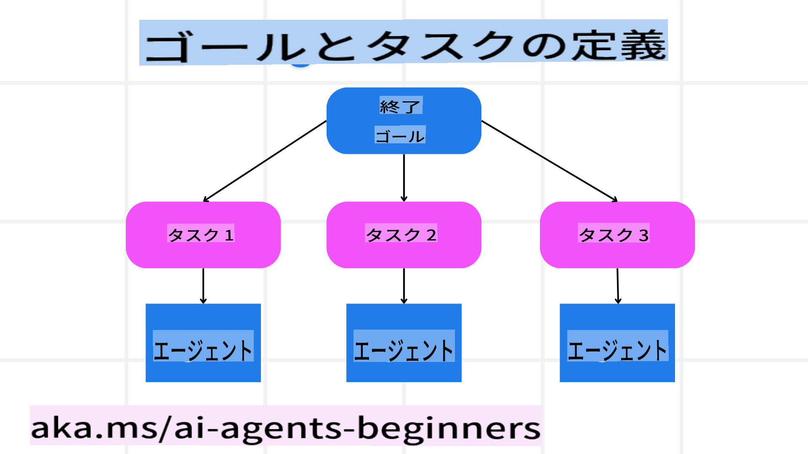

<!--
CO_OP_TRANSLATOR_METADATA:
{
  "original_hash": "8dd9a05d4dc18d3ff510e68e3798a080",
  "translation_date": "2025-03-28T12:01:47+00:00",
  "source_file": "07-planning-design\\README.md",
  "language_code": "ja"
}
-->
[](https://youtu.be/kPfJ2BrBCMY?si=9pYpPXp0sSbK91Dr)

> _(上の画像をクリックすると、このレッスンの動画を視聴できます)_

# 計画設計

## はじめに

このレッスンでは以下について学びます：

* 明確な全体目標を定義し、複雑なタスクを管理可能なタスクに分割する方法。
* 構造化された出力を活用して、より信頼性が高く機械が読み取りやすい応答を得る方法。
* イベント駆動型のアプローチを適用して、動的なタスクや予期しない入力に対応する方法。

## 学習目標

このレッスンを終えると、以下について理解できるようになります：

* AIエージェントの全体目標を特定し設定することで、達成すべきことを明確にする。
* 複雑なタスクを管理可能なサブタスクに分解し、それらを論理的な順序で整理する。
* エージェントに適切なツール（例：検索ツールやデータ分析ツール）を提供し、それらをいつどのように使用するかを決定し、発生する予期しない状況に対応する。
* サブタスクの結果を評価し、パフォーマンスを測定し、最終的な出力を改善するためのアクションを繰り返す。

## 全体目標の定義とタスクの分解



ほとんどの現実世界のタスクは、一度に取り組むには複雑すぎます。AIエージェントには、計画と行動を導く簡潔な目的が必要です。例えば、以下の目標を考えてみましょう：

    「3日間の旅行プランを作成する。」

この目標は簡単に述べられていますが、さらに洗練が必要です。目標が明確であればあるほど、エージェント（および人間の協力者）が適切な結果を達成することに集中できます。例えば、フライトオプション、ホテルのおすすめ、アクティビティの提案を含む包括的な旅行プランを作成することです。

### タスク分解

大規模または複雑なタスクは、小さく目標指向のサブタスクに分割することで、管理しやすくなります。
旅行プランの例では、目標を以下のように分解できます：

* フライト予約
* ホテル予約
* レンタカー手配
* パーソナライズ

それぞれのサブタスクは、専用のエージェントやプロセスによって処理されます。一つのエージェントが最適なフライトを探し、別のエージェントがホテル予約を担当するなどです。そして、調整役や「下流」エージェントがこれらの結果をまとめ、最終的な旅行プランとしてユーザーに提供します。

このモジュール型アプローチにより、段階的な改善も可能になります。例えば、食事のおすすめや地元のアクティビティの提案を専門とするエージェントを追加し、旅行プランをより充実させることができます。

### 構造化された出力

大規模言語モデル（LLM）は、下流のエージェントやサービスが解析・処理しやすい構造化された出力（例：JSON）を生成できます。これは特に複数のエージェントが連携するコンテキストで有用で、計画結果が受信された後にタスクを実行する際に役立ちます。以下は簡単な概要です：

以下のPythonコードスニペットは、目標をサブタスクに分解し、構造化された計画を生成するシンプルな計画エージェントを示しています：

```python
from pydantic import BaseModel
from enum import Enum
from typing import List, Optional, Union
import json
import os
from typing import Optional
from pprint import pprint
from autogen_core.models import UserMessage, SystemMessage, AssistantMessage
from autogen_ext.models.azure import AzureAIChatCompletionClient
from azure.core.credentials import AzureKeyCredential

class AgentEnum(str, Enum):
    FlightBooking = "flight_booking"
    HotelBooking = "hotel_booking"
    CarRental = "car_rental"
    ActivitiesBooking = "activities_booking"
    DestinationInfo = "destination_info"
    DefaultAgent = "default_agent"
    GroupChatManager = "group_chat_manager"

# Travel SubTask Model
class TravelSubTask(BaseModel):
    task_details: str
    assigned_agent: AgentEnum  # we want to assign the task to the agent

class TravelPlan(BaseModel):
    main_task: str
    subtasks: List[TravelSubTask]
    is_greeting: bool

client = AzureAIChatCompletionClient(
    model="gpt-4o-mini",
    endpoint="https://models.inference.ai.azure.com",
    # To authenticate with the model you will need to generate a personal access token (PAT) in your GitHub settings.
    # Create your PAT token by following instructions here: https://docs.github.com/en/authentication/keeping-your-account-and-data-secure/managing-your-personal-access-tokens
    credential=AzureKeyCredential(os.environ["GITHUB_TOKEN"]),
    model_info={
        "json_output": False,
        "function_calling": True,
        "vision": True,
        "family": "unknown",
    },
)

# Define the user message
messages = [
    SystemMessage(content="""You are an planner agent.
    Your job is to decide which agents to run based on the user's request.
                      Provide your response in JSON format with the following structure:
{'main_task': 'Plan a family trip from Singapore to Melbourne.',
 'subtasks': [{'assigned_agent': 'flight_booking',
               'task_details': 'Book round-trip flights from Singapore to '
                               'Melbourne.'}
    Below are the available agents specialised in different tasks:
    - FlightBooking: For booking flights and providing flight information
    - HotelBooking: For booking hotels and providing hotel information
    - CarRental: For booking cars and providing car rental information
    - ActivitiesBooking: For booking activities and providing activity information
    - DestinationInfo: For providing information about destinations
    - DefaultAgent: For handling general requests""", source="system"),
    UserMessage(
        content="Create a travel plan for a family of 2 kids from Singapore to Melboune", source="user"),
]

response = await client.create(messages=messages, extra_create_args={"response_format": 'json_object'})

response_content: Optional[str] = response.content if isinstance(
    response.content, str) else None
if response_content is None:
    raise ValueError("Response content is not a valid JSON string" )

pprint(json.loads(response_content))

# # Ensure the response content is a valid JSON string before loading it
# response_content: Optional[str] = response.content if isinstance(
#     response.content, str) else None
# if response_content is None:
#     raise ValueError("Response content is not a valid JSON string")

# # Print the response content after loading it as JSON
# pprint(json.loads(response_content))

# Validate the response content with the MathReasoning model
# TravelPlan.model_validate(json.loads(response_content))
```

### マルチエージェント調整を伴う計画エージェント

この例では、Semantic Router Agentがユーザーのリクエスト（例：「旅行のためのホテルプランが必要です」）を受け取ります。

プランナーは以下を実行します：

* ホテルプランを受け取る：プランナーはユーザーのメッセージを受け取り、システムプロンプト（利用可能なエージェントの詳細を含む）に基づいて構造化された旅行プランを生成します。
* エージェントとそのツールをリストアップ：エージェントレジストリには、フライト、ホテル、レンタカー、アクティビティなどのエージェントとそれらが提供する機能やツールのリストが含まれています。
* プランを各エージェントにルーティング：サブタスクの数に応じて、プランナーはメッセージを専用エージェントに直接送信（単一タスクの場合）するか、グループチャットマネージャーを介して複数のエージェント間で調整します。
* 結果を要約する：最後に、プランナーは生成されたプランをわかりやすく要約します。
以下のPythonコードサンプルはこれらのステップを示しています：

```python

from pydantic import BaseModel

from enum import Enum
from typing import List, Optional, Union

class AgentEnum(str, Enum):
    FlightBooking = "flight_booking"
    HotelBooking = "hotel_booking"
    CarRental = "car_rental"
    ActivitiesBooking = "activities_booking"
    DestinationInfo = "destination_info"
    DefaultAgent = "default_agent"
    GroupChatManager = "group_chat_manager"

# Travel SubTask Model

class TravelSubTask(BaseModel):
    task_details: str
    assigned_agent: AgentEnum # we want to assign the task to the agent

class TravelPlan(BaseModel):
    main_task: str
    subtasks: List[TravelSubTask]
    is_greeting: bool
import json
import os
from typing import Optional

from autogen_core.models import UserMessage, SystemMessage, AssistantMessage
from autogen_ext.models.openai import AzureOpenAIChatCompletionClient

# Create the client with type-checked environment variables

client = AzureOpenAIChatCompletionClient(
    azure_deployment=os.getenv("AZURE_OPENAI_DEPLOYMENT_NAME"),
    model=os.getenv("AZURE_OPENAI_DEPLOYMENT_NAME"),
    api_version=os.getenv("AZURE_OPENAI_API_VERSION"),
    azure_endpoint=os.getenv("AZURE_OPENAI_ENDPOINT"),
    api_key=os.getenv("AZURE_OPENAI_API_KEY"),
)

from pprint import pprint

# Define the user message

messages = [
    SystemMessage(content="""You are an planner agent.
    Your job is to decide which agents to run based on the user's request.
    Below are the available agents specialized in different tasks:
    - FlightBooking: For booking flights and providing flight information
    - HotelBooking: For booking hotels and providing hotel information
    - CarRental: For booking cars and providing car rental information
    - ActivitiesBooking: For booking activities and providing activity information
    - DestinationInfo: For providing information about destinations
    - DefaultAgent: For handling general requests""", source="system"),
    UserMessage(content="Create a travel plan for a family of 2 kids from Singapore to Melbourne", source="user"),
]

response = await client.create(messages=messages, extra_create_args={"response_format": TravelPlan})

# Ensure the response content is a valid JSON string before loading it

response_content: Optional[str] = response.content if isinstance(response.content, str) else None
if response_content is None:
    raise ValueError("Response content is not a valid JSON string")

# Print the response content after loading it as JSON

pprint(json.loads(response_content))
```

前述のコードからの出力例を以下に示します。この構造化された出力を使用して `assigned_agent` にルーティングし、最終的な旅行プランをユーザーに要約して提供することができます。

```json
{
    "is_greeting": "False",
    "main_task": "Plan a family trip from Singapore to Melbourne.",
    "subtasks": [
        {
            "assigned_agent": "flight_booking",
            "task_details": "Book round-trip flights from Singapore to Melbourne."
        },
        {
            "assigned_agent": "hotel_booking",
            "task_details": "Find family-friendly hotels in Melbourne."
        },
        {
            "assigned_agent": "car_rental",
            "task_details": "Arrange a car rental suitable for a family of four in Melbourne."
        },
        {
            "assigned_agent": "activities_booking",
            "task_details": "List family-friendly activities in Melbourne."
        },
        {
            "assigned_agent": "destination_info",
            "task_details": "Provide information about Melbourne as a travel destination."
        }
    ]
}
```

前述のコードサンプルを含む例のノートブックは [こちら](../../../07-planning-design/07-autogen.ipynb) で確認できます。

### 繰り返し計画

いくつかのタスクは、結果に基づいた再計画や調整が必要であり、一つのサブタスクの結果が次のタスクに影響を与えることがあります。例えば、エージェントがフライト予約中に予期しないデータ形式を発見した場合、ホテル予約に進む前に戦略を適応させる必要があります。

さらに、ユーザーのフィードバック（例：ユーザーがより早いフライトを選びたいと決定する）によって部分的な再計画がトリガーされることもあります。この動的で反復的なアプローチにより、最終的な解決策が現実世界の制約や進化するユーザーの好みに合致するようになります。

例：サンプルコード

```python
from autogen_core.models import UserMessage, SystemMessage, AssistantMessage
#.. same as previous code and pass on the user history, current plan
messages = [
    SystemMessage(content="""You are a planner agent to optimize the
    Your job is to decide which agents to run based on the user's request.
    Below are the available agents specialized in different tasks:
    - FlightBooking: For booking flights and providing flight information
    - HotelBooking: For booking hotels and providing hotel information
    - CarRental: For booking cars and providing car rental information
    - ActivitiesBooking: For booking activities and providing activity information
    - DestinationInfo: For providing information about destinations
    - DefaultAgent: For handling general requests""", source="system"),
    UserMessage(content="Create a travel plan for a family of 2 kids from Singapore to Melbourne", source="user"),
    AssistantMessage(content=f"Previous travel plan - {TravelPlan}", source="assistant")
]
# .. re-plan and send the tasks to respective agents
```

複雑なタスクを解決するためのより包括的な計画については、Magnetic Oneをチェックしてください。

## まとめ

この記事では、利用可能なエージェントを動的に選択するプランナーを作成する方法の例を見てきました。プランナーの出力はタスクを分解し、エージェントを割り当ててタスクを実行できるようにします。エージェントがタスクを実行するために必要な機能やツールにアクセスできることが前提となっています。エージェントに加えて、反映、要約、ラウンドロビンチャットなどのパターンを含めることでさらにカスタマイズすることも可能です。

## 追加リソース

* AutoGen Magnetic One - 複雑なタスクを解決する汎用型マルチエージェントシステムであり、複数の難しいエージェントベンチマークで優れた結果を達成しています。参考資料：

この実装では、オーケストレーターがタスク固有の計画を作成し、これらのタスクを利用可能なエージェントに委任します。計画だけでなく、オーケストレーターはタスクの進捗を監視し、必要に応じて再計画する追跡メカニズムも採用しています。

## 前のレッスン

[信頼性の高いAIエージェントの構築](../06-building-trustworthy-agents/README.md)

## 次のレッスン

[マルチエージェント設計パターン](../08-multi-agent/README.md)

**免責事項**:  
この文書はAI翻訳サービス [Co-op Translator](https://github.com/Azure/co-op-translator) を使用して翻訳されています。正確性を追求しておりますが、自動翻訳には誤りや不正確な部分が含まれる可能性があることをご承知ください。原文の母国語による文書を正式な情報源として扱うべきです。重要な情報については、専門の人間による翻訳を推奨します。この翻訳の使用によって生じた誤解や誤解釈について、当社は責任を負いません。