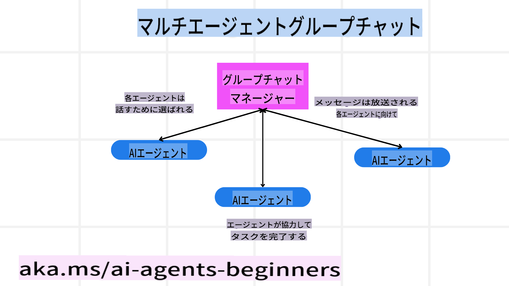
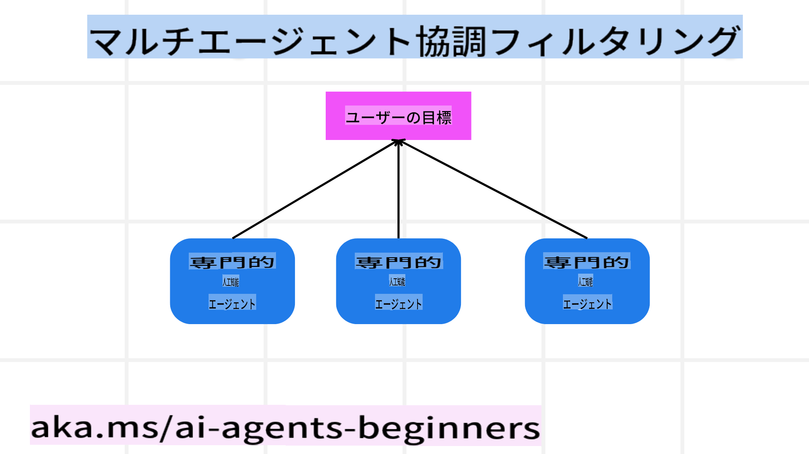

<!--
CO_OP_TRANSLATOR_METADATA:
{
  "original_hash": "bdb0a92e5a437d5fa985a6863f4a836c",
  "translation_date": "2025-03-28T12:05:55+00:00",
  "source_file": "08-multi-agent\\README.md",
  "language_code": "ja"
}
-->

> _(上の画像をクリックすると、このレッスンの動画をご覧いただけます)_

# マルチエージェント設計パターン

複数のエージェントを含むプロジェクトに取り組む際には、マルチエージェント設計パターンを検討する必要があります。しかし、いつマルチエージェントに切り替えるべきか、その利点は何かがすぐには明確でない場合があります。

## はじめに

このレッスンでは、次の質問に答えることを目指します:

- マルチエージェントが適用されるシナリオはどのようなものか？
- 単一のエージェントが複数のタスクを行う場合と比べて、マルチエージェントを使用する利点は何か？
- マルチエージェント設計パターンを実装する際の基本構成要素は何か？
- 複数のエージェントがどのように相互作用しているかを把握するにはどうすればよいか？

## 学習目標

このレッスンを終えた後には、以下ができるようになることを目指します:

- マルチエージェントが適用されるシナリオを特定する
- 単一のエージェントよりもマルチエージェントを使用する利点を理解する
- マルチエージェント設計パターンを実装するための基本構成要素を理解する

全体像は？

*マルチエージェントは、複数のエージェントが共通の目標を達成するために協力するデザインパターン*です。

このパターンは、ロボティクス、自律システム、分散コンピューティングなど、さまざまな分野で広く使用されています。

## マルチエージェントが適用されるシナリオ

では、どのようなシナリオがマルチエージェントを使用するのに適しているのでしょうか？答えは多くのシナリオで役立つということですが、特に以下の場合が挙げられます:

- **大量の作業負荷**: 大量の作業負荷を小さなタスクに分割し、異なるエージェントに割り当てることで、並列処理が可能になり、より早く完了します。例としては、大規模なデータ処理タスクがあります。
- **複雑なタスク**: 大量の作業負荷と同様に、複雑なタスクも小さなサブタスクに分割し、特定の側面に特化したエージェントに割り当てることができます。例えば、自律走行車では、異なるエージェントがナビゲーション、障害物検出、他の車両との通信を管理します。
- **多様な専門性**: 異なるエージェントが多様な専門性を持つことで、単一のエージェントよりも効果的にタスクの異なる側面を処理できます。例えば、医療分野では、診断、治療計画、患者モニタリングを管理するエージェントが挙げられます。

## 単一エージェントよりもマルチエージェントを使用する利点

単一エージェントシステムは単純なタスクには適していますが、より複雑なタスクには、マルチエージェントを使用することで以下のような利点が得られます:

- **専門性**: 各エージェントが特定のタスクに特化できます。単一エージェントでは専門性が欠けるため、複雑なタスクに直面した際に適切な対応が難しくなる場合があります。例えば、エージェントが最適ではないタスクを実行してしまう可能性があります。
- **スケーラビリティ**: 単一のエージェントに負荷をかけるよりも、エージェントを追加することでシステムをスケールアップする方が簡単です。
- **フォールトトレランス**: 1つのエージェントが故障しても、他のエージェントが引き続き機能することで、システムの信頼性を確保できます。

例を挙げてみましょう。ユーザーの旅行予約をする場合、単一エージェントシステムでは、フライト検索、ホテル予約、レンタカー予約など、旅行予約プロセスのすべての側面を処理しなければなりません。このためには、単一エージェントがこれらすべてのタスクを処理するツールを持つ必要があります。結果として、保守やスケーリングが困難な複雑で一体化したシステムになる可能性があります。一方で、マルチエージェントシステムでは、フライト検索、ホテル予約、レンタカー予約に特化したエージェントを持つことができます。これにより、システムはよりモジュール化され、保守が容易になり、スケーラビリティも向上します。

これは、小規模な家族経営の旅行代理店とフランチャイズ形式の旅行代理店を比較するようなものです。家族経営の旅行代理店では、単一のエージェントが旅行予約プロセスのすべてを担当しますが、フランチャイズ形式の旅行代理店では、異なるエージェントが異なる側面を担当します。

## マルチエージェント設計パターンを実装するための基本構成要素

マルチエージェント設計パターンを実装する前に、このパターンを構成する基本要素を理解する必要があります。

ここでも、ユーザーの旅行予約の例を使って具体的に考えてみましょう。この場合、基本構成要素には以下が含まれます:

- **エージェント間の通信**: フライト検索、ホテル予約、レンタカー予約を担当するエージェントが、ユーザーの好みや制約に関する情報を共有する必要があります。この通信のプロトコルや方法を決定する必要があります。具体的には、フライト検索エージェントがホテル予約エージェントと通信して、フライトの日程とホテルの予約日が一致するようにする必要があります。つまり、*どのエージェントがどのように情報を共有するか*を決定する必要があります。
- **調整メカニズム**: エージェントは、ユーザーの好みや制約を満たすために行動を調整する必要があります。例えば、ユーザーの好みとして「空港に近いホテルを希望する」があり、制約として「レンタカーは空港でしか利用できない」という場合、ホテル予約エージェントはレンタカー予約エージェントと調整して、ユーザーの希望と制約を満たす必要があります。つまり、*エージェントがどのように行動を調整するか*を決定する必要があります。
- **エージェントのアーキテクチャ**: エージェントは、ユーザーとのやり取りから学び、意思決定を行うための内部構造を持つ必要があります。例えば、フライト検索エージェントは、ユーザーに推奨するフライトを決定するための内部構造を持つ必要があります。つまり、*エージェントがどのように意思決定を行い、学習するか*を決定する必要があります。エージェントが学習して改善する例としては、フライト検索エージェントが過去のユーザーの好みに基づいてフライトを推奨する機械学習モデルを使用することが挙げられます。
- **マルチエージェントの相互作用の可視性**: 複数のエージェントがどのように相互作用しているかを把握する必要があります。これには、エージェントの活動や相互作用を追跡するためのツールや技術が必要です。例えば、ログやモニタリングツール、可視化ツール、パフォーマンスメトリクスなどが挙げられます。
- **マルチエージェントパターン**: マルチエージェントシステムを実装するためのパターンには、中央集権型、分散型、ハイブリッド型のアーキテクチャがあります。使用ケースに最適なパターンを選択する必要があります。
- **ヒューマン・イン・ザ・ループ**: 多くの場合、人間が介在する必要があり、エージェントにいつ人間の介入を求めるべきかを指示する必要があります。例えば、エージェントが推奨していない特定のホテルやフライトをユーザーが要求したり、フライトやホテルを予約する前に確認を求めたりする場合です。

## マルチエージェントの相互作用の可視性

複数のエージェントがどのように相互作用しているかを把握することは重要です。この可視性は、デバッグ、最適化、システム全体の有効性を確保するために不可欠です。これを実現するには、エージェントの活動や相互作用を追跡するためのツールや技術が必要です。例えば、ログやモニタリングツール、可視化ツール、パフォーマンスメトリクスなどです。

ユーザーの旅行予約の例では、各エージェントのステータス、ユーザーの好みや制約、エージェント間の相互作用を表示するダッシュボードを用意することができます。このダッシュボードには、ユーザーの旅行日程、フライトエージェントが推奨するフライト、ホテルエージェントが推奨するホテル、レンタカーエージェントが推奨するレンタカーが表示されます。これにより、エージェントがどのように相互作用しているか、ユーザーの好みや制約が満たされているかを明確に把握できます。

以下は、それぞれの側面について詳しく見ていきます。

- **ログとモニタリングツール**: 各エージェントが実行したアクションをログに記録します。ログエントリには、アクションを実行したエージェント、実行されたアクション、アクションが実行された時間、アクションの結果に関する情報が含まれることがあります。この情報はデバッグや最適化に利用できます。
- **可視化ツール**: 可視化ツールは、エージェント間の相互作用をより直感的に把握するのに役立ちます。例えば、エージェント間の情報の流れを示すグラフを作成することができます。これにより、ボトルネックや非効率性、その他のシステム上の問題を特定できます。
- **パフォーマンスメトリクス**: パフォーマンスメトリクスは、マルチエージェントシステムの有効性を追跡するのに役立ちます。例えば、タスクを完了するのにかかった時間、単位時間あたりに完了したタスクの数、エージェントが推奨した内容の正確性などを追跡できます。この情報を基に改善点を特定し、システムを最適化できます。

## マルチエージェントパターン

マルチエージェントアプリを作成するために使用できる具体的なパターンをいくつか見ていきましょう。以下は、検討する価値のある興味深いパターンです。

### グループチャット

このパターンは、複数のエージェントが互いに通信できるグループチャットアプリケーションを作成したい場合に役立ちます。このパターンの典型的な使用例には、チームコラボレーション、カスタマーサポート、ソーシャルネットワーキングが含まれます。

このパターンでは、各エージェントがグループチャット内のユーザーを表し、メッセージプロトコルを使用してエージェント間でメッセージを交換します。エージェントはグループチャットにメッセージを送信したり、受信したり、他のエージェントからのメッセージに応答したりできます。

このパターンは、すべてのメッセージが中央サーバーを介してルーティングされる集中型アーキテクチャや、メッセージが直接交換される分散型アーキテクチャを使用して実装できます。

### 引き継ぎ

このパターンは、複数のエージェントがタスクを互いに引き継ぐことができるアプリケーションを作成したい場合に役立ちます。

このパターンの典型的な使用例には、カスタマーサポート、タスク管理、ワークフローの自動化が含まれます。

このパターンでは、各エージェントがタスクまたはワークフローのステップを表し、事前定義されたルールに基づいてエージェント間でタスクを引き継ぐことができます。

### 協調フィルタリング

このパターンは、複数のエージェントが協力してユーザーに推奨を行うアプリケーションを作成したい場合に役立ちます。

複数のエージェントが協力する理由は、各エージェントが異なる専門性を持ち、それぞれ異なる方法で推奨プロセスに貢献できるからです。

例として、ユーザーが株式市場で最適な株を購入するための推奨を求めている場合を考えてみましょう。

- **業界の専門家**: 1つのエージェントは特定の業界に精通しているかもしれません。
- **テクニカル分析**: 別のエージェントはテクニカル分析に精通しているかもしれません。
- **ファンダメンタル分析**: さらに別のエージェントはファンダメンタル分析に精通しているかもしれません。これらのエージェントが協力することで、ユーザーにより包括的な推奨を提供できます。

## シナリオ: 返金プロセス

顧客が商品の返金を求めているシナリオを考えてみましょう。このプロセスには多くのエージェントが関与する可能性がありますが、返金プロセスに特化したエージェントと他のプロセスでも使用できる一般的なエージェントに分けてみましょう。

**返金プロセスに特化したエージェント**:

以下は、返金プロセスに関与する可能性のあるエージェントです:

- **顧客エージェント**: 顧客を代表し、返金プロセスを開始する役割を持ちます。
- **販売者エージェント**: 販売者を代表し、返金を処理する役割を持ちます。
- **支払いエージェント**: 支払いプロセスを代表し、顧客への支払い返金を担当します。
- **解決エージェント**: 問題解決プロセスを代表し、返金プロセス中に発生する問題を解決します。
- **コンプライアンスエージェント**: コンプライアンスプロセスを代表し、返金プロセスが規制やポリシーに準拠していることを確認します。

**一般的なエージェント**:

これらのエージェントは、ビジネスの他の部分でも使用できます。

- **配送エージェント**: 配送プロセスを代表し、商品の販売者への返送を担当します。このエージェントは、返金プロセスだけでなく、購入時の一般的な配送にも使用できます。
- **フィードバックエージェント**: フィードバックプロセスを代表し、顧客からのフィードバックを収集します。フィードバックは返金プロセスだけでなく、いつでも収集できます。
- **エスカレーションエージェント**: エスカレーションプロセスを代表し、問題をより高いレベルのサポートに

**免責事項**:  
この文書は、AI翻訳サービス[Co-op Translator](https://github.com/Azure/co-op-translator)を使用して翻訳されています。正確性を追求しておりますが、自動翻訳には誤りや不正確さが含まれる可能性があります。原文（元の言語で書かれた文書）を正式な情報源として考慮してください。重要な情報については、専門の人間による翻訳を推奨します。この翻訳の使用に起因する誤解や誤解釈について、当社は責任を負いません。