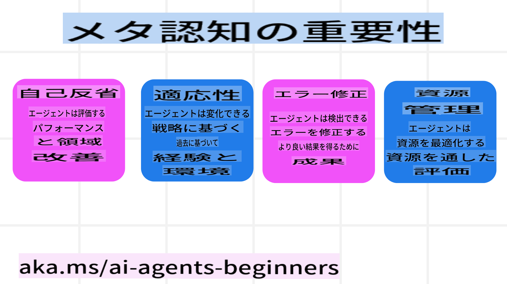
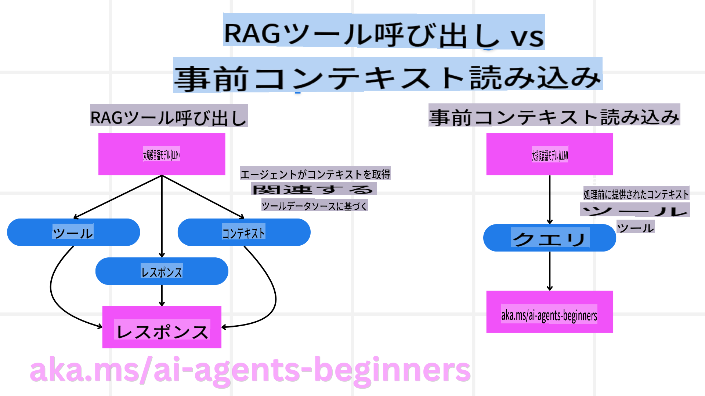

<!--
CO_OP_TRANSLATOR_METADATA:
{
  "original_hash": "3171ed887315c3ddeaccf966e40e9a50",
  "translation_date": "2025-03-28T12:22:07+00:00",
  "source_file": "09-metacognition\\README.md",
  "language_code": "ja"
}
-->
[](https://youtu.be/His9R6gw6Ec?si=3_RMb8VprNvdLRhX)

> _(上の画像をクリックすると、このレッスンの動画をご覧いただけます)_

# AIエージェントにおけるメタ認知

## はじめに

AIエージェントにおけるメタ認知に関するレッスンへようこそ！この章は、AIエージェントが自分自身の思考プロセスをどのように考えることができるのかに興味を持つ初心者向けに設計されています。このレッスンを終える頃には、メタ認知の基本概念を理解し、それをAIエージェント設計に応用するための実践的な例を身につけることができます。

## 学習目標

このレッスンを修了すると、次のことができるようになります：
1. エージェント定義における思考ループの影響を理解する。
2. 自己修正可能なエージェントを支援する計画および評価手法を使用する。
3. タスクを達成するためにコードを操作できるエージェントを作成する。

## メタ認知の概要

メタ認知とは、自分自身の思考について考える高次の認知プロセスを指します。AIエージェントにおいては、自己認識や過去の経験に基づいて行動を評価し、調整する能力を意味します。つまり、「思考について考える」能力は、エージェント型AIシステムの開発において重要な概念です。AIシステムが自分自身の内部プロセスを認識し、それを監視・調整し、適応する能力を持つことが含まれます。これは、私たちが状況を読み取ったり問題を考えるときに行うことと似ています。

この自己認識は、AIシステムがより良い意思決定を行い、エラーを特定し、時間とともにパフォーマンスを向上させるのに役立ちます。これは、チューリングテストやAIが人間を超えるかどうかという議論にも関連しています。

エージェント型AIシステムの文脈では、メタ認知は以下のような課題に対処するのに役立ちます：
- **透明性**: AIシステムがその推論や決定を説明できるようにする。
- **推論**: AIシステムの情報統合能力と適切な意思決定能力を向上させる。
- **適応性**: 新しい環境や変化する条件に適応できるようにする。
- **認識**: 環境から得たデータを正確に認識し解釈する能力を向上させる。

### メタ認知とは？

メタ認知、つまり「思考について考える」ことは、自己認識や認知プロセスの自己調整を伴う高次の認知プロセスです。AIの領域において、メタ認知はエージェントに戦略や行動を評価し適応させる能力を与え、問題解決能力や意思決定能力を向上させます。

メタ認知を理解することで、より知的で適応性が高く効率的なAIエージェントを設計できるようになります。真のメタ認知では、AIが自分自身の推論について明確に考える様子が見られます。

例: 「安いフライトを優先したけれど...直行便を見落としているかもしれないから、もう一度確認してみよう。」  
どのように、またはなぜ特定のルートを選んだのかを記録する。  
- 前回のユーザーの好みに過度に依存したためにミスをしたと気づき、最終的な提案だけでなく意思決定戦略自体を修正する。  
- 「ユーザーが『混雑しすぎている』と言った場合、特定の観光地を除外するだけでなく、『人気順』で常にランク付けする自分の方法が欠陥であることを反映すべきだ」といったパターンを診断する。

### AIエージェントにおけるメタ認知の重要性

メタ認知は、AIエージェント設計においていくつかの理由で重要な役割を果たします：

  
- **自己反省**: エージェントは自分のパフォーマンスを評価し、改善が必要な領域を特定できる。  
- **適応性**: エージェントは過去の経験や変化する環境に基づいて戦略を修正できる。  
- **エラー修正**: エージェントはエラーを自律的に検出し修正することで、より正確な結果を導き出せる。  
- **リソース管理**: エージェントは計画と評価を通じて時間や計算リソースの利用を最適化できる。

## AIエージェントの構成要素

メタ認知プロセスに入る前に、AIエージェントの基本的な構成要素を理解することが重要です。AIエージェントは通常、以下の要素で構成されます：
- **ペルソナ**: エージェントの個性や特性で、ユーザーとの対話方法を定義する。  
- **ツール**: エージェントが実行可能な機能や能力。  
- **スキル**: エージェントが持つ知識や専門性。  

これらの要素が連携して「専門性ユニット」を形成し、特定のタスクを実行します。

**例**: 旅行代理店サービスを考えてみましょう。このエージェントは、旅行計画を立てるだけでなく、リアルタイムデータや過去の顧客体験に基づいてルートを調整します。

### 例: 旅行代理店サービスにおけるメタ認知

AIを活用した旅行代理店サービスを設計していると想像してください。このエージェント「Travel Agent」は、ユーザーの休暇計画を支援します。メタ認知を組み込むことで、Travel Agentは自己認識や過去の経験に基づいて行動を評価し調整することができます。

#### 現在のタスク

現在のタスクは、ユーザーのパリ旅行を計画することです。

#### タスクを完了するための手順

1. **ユーザーの好みを収集する**: 旅行日程、予算、興味（例: 美術館、料理、ショッピング）、特定の要件についてユーザーに尋ねる。  
2. **情報を取得する**: ユーザーの好みに合ったフライト、宿泊施設、観光地、レストランを検索する。  
3. **提案を作成する**: フライト詳細、ホテル予約、推奨アクティビティを含む個別の旅程を提供する。  
4. **フィードバックに基づいて調整する**: 提案に対するユーザーのフィードバックを求め、必要な調整を行う。

#### 必要なリソース

- フライトとホテル予約のデータベースへのアクセス。  
- パリの観光地やレストランに関する情報。  
- 過去のインタラクションからのユーザーフィードバックデータ。  

#### 経験と自己反省

Travel Agentは、パフォーマンスを評価し、過去の経験から学ぶためにメタ認知を活用します。例えば：

1. **ユーザーフィードバックの分析**: Travel Agentは、どの提案が好評で、どれがそうでなかったかを確認し、今後の提案を調整する。  
2. **適応性**: ユーザーが以前に混雑した場所を嫌っていた場合、Travel Agentは次回以降、ピーク時間に人気の観光地を推奨しないようにする。  
3. **エラー修正**: 過去に満室のホテルを提案するなどのエラーがあった場合、Travel Agentは今後の提案前に空室状況をより厳密に確認することを学ぶ。  

#### 実践的な開発者向け例

Travel Agentのコードがメタ認知を組み込む際のシンプルな例を以下に示します：  
```python
class Travel_Agent:
    def __init__(self):
        self.user_preferences = {}
        self.experience_data = []

    def gather_preferences(self, preferences):
        self.user_preferences = preferences

    def retrieve_information(self):
        # Search for flights, hotels, and attractions based on preferences
        flights = search_flights(self.user_preferences)
        hotels = search_hotels(self.user_preferences)
        attractions = search_attractions(self.user_preferences)
        return flights, hotels, attractions

    def generate_recommendations(self):
        flights, hotels, attractions = self.retrieve_information()
        itinerary = create_itinerary(flights, hotels, attractions)
        return itinerary

    def adjust_based_on_feedback(self, feedback):
        self.experience_data.append(feedback)
        # Analyze feedback and adjust future recommendations
        self.user_preferences = adjust_preferences(self.user_preferences, feedback)

# Example usage
travel_agent = Travel_Agent()
preferences = {
    "destination": "Paris",
    "dates": "2025-04-01 to 2025-04-10",
    "budget": "moderate",
    "interests": ["museums", "cuisine"]
}
travel_agent.gather_preferences(preferences)
itinerary = travel_agent.generate_recommendations()
print("Suggested Itinerary:", itinerary)
feedback = {"liked": ["Louvre Museum"], "disliked": ["Eiffel Tower (too crowded)"]}
travel_agent.adjust_based_on_feedback(feedback)
```

#### メタ認知が重要な理由

- **自己反省**: エージェントはパフォーマンスを分析し、改善点を特定できる。  
- **適応性**: フィードバックや変化する条件に基づいて戦略を修正できる。  
- **エラー修正**: エージェントは自律的にミスを検出し修正できる。  
- **リソース管理**: 時間や計算リソースの利用を最適化できる。  

メタ認知を組み込むことで、Travel Agentはより個別化された正確な旅行提案を提供でき、全体的なユーザー体験を向上させます。

---

## 2. エージェントにおける計画

計画は、AIエージェントの行動において重要な要素です。計画には、目標を達成するために必要なステップを明確にし、現在の状況、リソース、可能な障害を考慮することが含まれます。

### 計画の要素

- **現在のタスク**: タスクを明確に定義する。  
- **タスクを完了するためのステップ**: タスクを管理しやすいステップに分解する。  
- **必要なリソース**: 必要なリソースを特定する。  
- **経験**: 過去の経験を計画に活用する。  

**例**: Travel Agentがユーザーの旅行計画を効果的に支援するために必要なステップを以下に示します：

### Travel Agentの手順

1. **ユーザーの好みを収集する**  
   - 旅行日程、予算、興味、特定の要件についてユーザーに尋ねる。  
   - 例: 「旅行の日程はいつですか？」 「予算の範囲はどのくらいですか？」 「休暇中にどのようなアクティビティを楽しみたいですか？」  

2. **情報を取得する**  
   - ユーザーの好みに基づいて関連する旅行オプションを検索する。  
   - **フライト**: ユーザーの予算と希望する旅行日程に合ったフライトを探す。  
   - **宿泊施設**: ロケーション、価格、アメニティの好みに合ったホテルやレンタル物件を見つける。  
   - **観光地とレストラン**: ユーザーの興味に合った人気の観光地、アクティビティ、飲食店を特定する。  

3. **提案を作成する**  
   - 検索した情報を個別の旅程にまとめる。  
   - フライトオプション、ホテル予約、推奨アクティビティの詳細を提供し、ユーザーの好みに合わせて提案をカスタマイズする。  

4. **旅程をユーザーに提示する**  
   - 作成した旅程をユーザーに共有し、レビューを依頼する。  
   - 例: 「パリ旅行の提案された旅程はこちらです。フライトの詳細、ホテルの予約、おすすめのアクティビティとレストランが含まれています。ご意見をお聞かせください！」  

5. **フィードバックを収集する**  
   - 提案された旅程に対するユーザーのフィードバックを求める。  
   - 例: 「フライトオプションは気に入りましたか？」 「ホテルはご希望に合っていますか？」 「追加したい、または削除したいアクティビティはありますか？」  

6. **フィードバックに基づいて調整する**  
   - ユーザーのフィードバックに基づいて旅程を修正する。  
   - フライト、宿泊施設、アクティビティの提案をユーザーの好みにより合うように調整する。  

7. **最終確認**  
   - 修正後の旅程をユーザーに提示し、最終確認を依頼する。  
   - 例: 「フィードバックに基づいて調整しました。こちらが更新された旅程です。すべて問題ないかご確認ください。」  

8. **予約と確認**  
   - ユーザーが旅程を承認したら、フライト、宿泊施設、事前計画されたアクティビティを予約する。  
   - 確認詳細をユーザーに送信する。  

9. **継続的なサポートを提供する**  
   - ユーザーの旅行中および旅行前に、変更や追加リクエストに対応できるようにする。  
   - 例: 「旅行中に何かサポートが必要な場合は、いつでもご連絡ください！」  

### 例: インタラクション

```python
class Travel_Agent:
    def __init__(self):
        self.user_preferences = {}
        self.experience_data = []

    def gather_preferences(self, preferences):
        self.user_preferences = preferences

    def retrieve_information(self):
        flights = search_flights(self.user_preferences)
        hotels = search_hotels(self.user_preferences)
        attractions = search_attractions(self.user_preferences)
        return flights, hotels, attractions

    def generate_recommendations(self):
        flights, hotels, attractions = self.retrieve_information()
        itinerary = create_itinerary(flights, hotels, attractions)
        return itinerary

    def adjust_based_on_feedback(self, feedback):
        self.experience_data.append(feedback)
        self.user_preferences = adjust_preferences(self.user_preferences, feedback)

# Example usage within a booing request
travel_agent = Travel_Agent()
preferences = {
    "destination": "Paris",
    "dates": "2025-04-01 to 2025-04-10",
    "budget": "moderate",
    "interests": ["museums", "cuisine"]
}
travel_agent.gather_preferences(preferences)
itinerary = travel_agent.generate_recommendations()
print("Suggested Itinerary:", itinerary)
feedback = {"liked": ["Louvre Museum"], "disliked": ["Eiffel Tower (too crowded)"]}
travel_agent.adjust_based_on_feedback(feedback)
```

## 3. 修正型RAGシステム

まず、RAGツールと事前コンテキスト読み込みの違いを理解しましょう。  



### 情報検索拡張生成（RAG）

RAGは検索システムと生成モデルを組み合わせたものです。クエリが行われると、検索システムが外部ソースから関連する文書やデータを取得し、この取得した情報が生成モデルへの入力を補強します。これにより、モデルはより正確で文脈に合った応答を生成することができます。

RAGシステムでは、エージェントが知識ベースから関連情報を取得し、それを使用して適切な応答や行動を生成します。

### 修正型RAGアプローチ

修正型RAGアプローチは、RAG技術を使用してエラーを修正し、AIエージェントの精度を向上させることに焦点を当てています。これには次のことが含まれます：

1. **プロンプト技術**: エージェントが関連情報を取得するのをガイドする特定のプロンプトを使用する。  
2. **ツール**: 取得した情報の関連性を評価し、正確な応答を生成するアルゴリズムやメカニズムを実装する。  
3. **評価**: エージェントのパフォーマンスを継続的に評価し、精度と効率を向上させるための調整を行う。  
検索エージェントにおける修正型RAG  
ウェブから情報を取得してユーザーの質問に答える検索エージェントを考えてみましょう。修正型RAGアプローチは以下を含む可能性があります：  
1. **プロンプト技法**: ユーザーの入力に基づいて検索クエリを作成する。  
2. **ツール**: 自然言語処理と機械学習アルゴリズムを使用して検索結果をランク付けし、フィルタリングする。  
3. **評価**: ユーザーのフィードバックを分析し、取得した情報の不正確さを修正する。  

### 旅行エージェントにおける修正型RAG  
修正型RAG（Retrieval-Augmented Generation）は、AIが情報を取得・生成する能力を向上させ、不正確さを修正する手法です。旅行エージェントが修正型RAGアプローチを活用して、より正確で関連性の高い旅行推奨を提供する方法を見てみましょう。このアプローチは以下を含みます：  
- **プロンプト技法**: エージェントが関連情報を取得する際にガイドする特定のプロンプトを使用する。  
- **ツール**: エージェントが取得した情報の関連性を評価し、正確な回答を生成するアルゴリズムや仕組みを導入する。  
- **評価**: エージェントのパフォーマンスを継続的に評価し、正確性と効率性を向上させるために調整を行う。  

#### 旅行エージェントにおける修正型RAGの実装手順  
1. **初期のユーザーインタラクション**  
   - 旅行エージェントは、目的地、旅行日程、予算、興味など、ユーザーから初期の好みを収集する。  
   - 例: ```python
     preferences = {
         "destination": "Paris",
         "dates": "2025-04-01 to 2025-04-10",
         "budget": "moderate",
         "interests": ["museums", "cuisine"]
     }
     ```  

2. **情報の取得**  
   - 旅行エージェントは、ユーザーの好みに基づいてフライト、宿泊施設、観光地、レストランに関する情報を取得する。  
   - 例: ```python
     flights = search_flights(preferences)
     hotels = search_hotels(preferences)
     attractions = search_attractions(preferences)
     ```  

3. **初期推奨の生成**  
   - 旅行エージェントは、取得した情報を使用して個別化された旅程を生成する。  
   - 例: ```python
     itinerary = create_itinerary(flights, hotels, attractions)
     print("Suggested Itinerary:", itinerary)
     ```  

4. **ユーザーのフィードバック収集**  
   - 旅行エージェントは、初期推奨に対するユーザーのフィードバックを求める。  
   - 例: ```python
     feedback = {
         "liked": ["Louvre Museum"],
         "disliked": ["Eiffel Tower (too crowded)"]
     }
     ```  

5. **修正型RAGプロセス**  
   - **プロンプト技法**: 旅行エージェントは、ユーザーのフィードバックに基づいて新しい検索クエリを作成する。  
     - 例: ```python
       if "disliked" in feedback:
           preferences["avoid"] = feedback["disliked"]
       ```  
   - **ツール**: 旅行エージェントはアルゴリズムを使用して新しい検索結果をランク付けし、ユーザーのフィードバックに基づいて関連性を強調する。  
     - 例: ```python
       new_attractions = search_attractions(preferences)
       new_itinerary = create_itinerary(flights, hotels, new_attractions)
       print("Updated Itinerary:", new_itinerary)
       ```  
   - **評価**: 旅行エージェントは、ユーザーのフィードバックを分析し、推奨の関連性と正確性を継続的に評価し、必要な調整を行う。  
     - 例: ```python
       def adjust_preferences(preferences, feedback):
           if "liked" in feedback:
               preferences["favorites"] = feedback["liked"]
           if "disliked" in feedback:
               preferences["avoid"] = feedback["disliked"]
           return preferences

       preferences = adjust_preferences(preferences, feedback)
       ```  

#### 実践的な例  
旅行エージェントにおける修正型RAGアプローチを組み込んだ簡易的なPythonコード例を以下に示します：  
```python
class Travel_Agent:
    def __init__(self):
        self.user_preferences = {}
        self.experience_data = []

    def gather_preferences(self, preferences):
        self.user_preferences = preferences

    def retrieve_information(self):
        flights = search_flights(self.user_preferences)
        hotels = search_hotels(self.user_preferences)
        attractions = search_attractions(self.user_preferences)
        return flights, hotels, attractions

    def generate_recommendations(self):
        flights, hotels, attractions = self.retrieve_information()
        itinerary = create_itinerary(flights, hotels, attractions)
        return itinerary

    def adjust_based_on_feedback(self, feedback):
        self.experience_data.append(feedback)
        self.user_preferences = adjust_preferences(self.user_preferences, feedback)
        new_itinerary = self.generate_recommendations()
        return new_itinerary

# Example usage
travel_agent = Travel_Agent()
preferences = {
    "destination": "Paris",
    "dates": "2025-04-01 to 2025-04-10",
    "budget": "moderate",
    "interests": ["museums", "cuisine"]
}
travel_agent.gather_preferences(preferences)
itinerary = travel_agent.generate_recommendations()
print("Suggested Itinerary:", itinerary)
feedback = {"liked": ["Louvre Museum"], "disliked": ["Eiffel Tower (too crowded)"]}
new_itinerary = travel_agent.adjust_based_on_feedback(feedback)
print("Updated Itinerary:", new_itinerary)
```  

### 事前のコンテキストロード  
事前のコンテキストロードは、クエリを処理する前に関連するコンテキストや背景情報をモデルにロードすることを指します。これにより、モデルはプロセス中に追加データを取得する必要なく、最初からこの情報にアクセスでき、より情報に基づいた回答を生成するのに役立ちます。旅行エージェントアプリケーションにおける事前コンテキストロードの簡易的な例をPythonで以下に示します：  
```python
class TravelAgent:
    def __init__(self):
        # Pre-load popular destinations and their information
        self.context = {
            "Paris": {"country": "France", "currency": "Euro", "language": "French", "attractions": ["Eiffel Tower", "Louvre Museum"]},
            "Tokyo": {"country": "Japan", "currency": "Yen", "language": "Japanese", "attractions": ["Tokyo Tower", "Shibuya Crossing"]},
            "New York": {"country": "USA", "currency": "Dollar", "language": "English", "attractions": ["Statue of Liberty", "Times Square"]},
            "Sydney": {"country": "Australia", "currency": "Dollar", "language": "English", "attractions": ["Sydney Opera House", "Bondi Beach"]}
        }

    def get_destination_info(self, destination):
        # Fetch destination information from pre-loaded context
        info = self.context.get(destination)
        if info:
            return f"{destination}:\nCountry: {info['country']}\nCurrency: {info['currency']}\nLanguage: {info['language']}\nAttractions: {', '.join(info['attractions'])}"
        else:
            return f"Sorry, we don't have information on {destination}."

# Example usage
travel_agent = TravelAgent()
print(travel_agent.get_destination_info("Paris"))
print(travel_agent.get_destination_info("Tokyo"))
```  

#### 説明  
1. **初期化 (`__init__` method)**: The `TravelAgent` class pre-loads a dictionary containing information about popular destinations such as Paris, Tokyo, New York, and Sydney. This dictionary includes details like the country, currency, language, and major attractions for each destination.

2. **Retrieving Information (`get_destination_info` method)**: When a user queries about a specific destination, the `get_destination_info` メソッド)**: このメソッドは事前ロードされたコンテキスト辞書から関連情報を取得します。コンテキストを事前ロードすることで、旅行エージェントアプリケーションは、リアルタイムで外部ソースから情報を取得することなく、迅速にユーザーのクエリに応答できます。これにより、アプリケーションはより効率的で応答性が向上します。  

### ゴールを設定して計画をブートストラップする  
計画をブートストラップする際にゴールを設定することは、明確な目的や目標を最初に定義することを指します。このゴールを事前に定義することで、モデルは反復プロセス全体を通じてこれを指針として使用できます。これにより、各反復が望ましい結果の達成に近づくことを保証し、プロセスをより効率的かつ集中させることができます。旅行エージェントにおけるゴールを設定して計画をブートストラップする方法の例をPythonで以下に示します：  

### シナリオ  
旅行エージェントは、クライアントのためにカスタマイズされた休暇プランを計画したいと考えています。目標は、クライアントの好みと予算に基づいて満足度を最大化する旅行計画を作成することです。  

### 手順  
1. クライアントの好みと予算を定義する。  
2. これらの好みに基づいて初期計画をブートストラップする。  
3. クライアントの満足度を最適化するために計画を反復的に洗練する。  

#### Pythonコード  
```python
class TravelAgent:
    def __init__(self, destinations):
        self.destinations = destinations

    def bootstrap_plan(self, preferences, budget):
        plan = []
        total_cost = 0

        for destination in self.destinations:
            if total_cost + destination['cost'] <= budget and self.match_preferences(destination, preferences):
                plan.append(destination)
                total_cost += destination['cost']

        return plan

    def match_preferences(self, destination, preferences):
        for key, value in preferences.items():
            if destination.get(key) != value:
                return False
        return True

    def iterate_plan(self, plan, preferences, budget):
        for i in range(len(plan)):
            for destination in self.destinations:
                if destination not in plan and self.match_preferences(destination, preferences) and self.calculate_cost(plan, destination) <= budget:
                    plan[i] = destination
                    break
        return plan

    def calculate_cost(self, plan, new_destination):
        return sum(destination['cost'] for destination in plan) + new_destination['cost']

# Example usage
destinations = [
    {"name": "Paris", "cost": 1000, "activity": "sightseeing"},
    {"name": "Tokyo", "cost": 1200, "activity": "shopping"},
    {"name": "New York", "cost": 900, "activity": "sightseeing"},
    {"name": "Sydney", "cost": 1100, "activity": "beach"},
]

preferences = {"activity": "sightseeing"}
budget = 2000

travel_agent = TravelAgent(destinations)
initial_plan = travel_agent.bootstrap_plan(preferences, budget)
print("Initial Plan:", initial_plan)

refined_plan = travel_agent.iterate_plan(initial_plan, preferences, budget)
print("Refined Plan:", refined_plan)
```  

#### コードの説明  
1. **初期化 (`__init__` method)**: The `TravelAgent` class is initialized with a list of potential destinations, each having attributes like name, cost, and activity type.

2. **Bootstrapping the Plan (`bootstrap_plan` method)**: This method creates an initial travel plan based on the client's preferences and budget. It iterates through the list of destinations and adds them to the plan if they match the client's preferences and fit within the budget.

3. **Matching Preferences (`match_preferences` method)**: This method checks if a destination matches the client's preferences.

4. **Iterating the Plan (`iterate_plan` method)**: This method refines the initial plan by trying to replace each destination in the plan with a better match, considering the client's preferences and budget constraints.

5. **Calculating Cost (`calculate_cost` メソッド)**: このメソッドは現在の計画の総費用を計算し、潜在的な新しい目的地を含めます。  

#### 使用例  
- **初期計画**: 旅行エージェントは、観光を希望するクライアントの好みと予算（2000ドル）に基づいて初期計画を作成します。  
- **洗練された計画**: 旅行エージェントは計画を反復し、クライアントの好みと予算を最適化します。  

ゴール（例：クライアントの満足度の最大化）を明確に設定して計画をブートストラップし、反復的に計画を洗練することで、旅行エージェントはクライアントのためにカスタマイズされ最適化された旅行計画を作成できます。このアプローチにより、旅行計画がクライアントの好みと予算に最初から一致し、反復を重ねるごとに改善されます。  

### LLMを活用したリランキングとスコアリング  
大規模言語モデル（LLM）は、取得したドキュメントや生成された回答の関連性と品質を評価することで、リランキングとスコアリングに使用できます。以下はその仕組みです：  
**取得**: 初期取得ステップで、クエリに基づいて候補ドキュメントや回答のセットを取得します。  
**リランキング**: LLMがこれらの候補を評価し、関連性と品質に基づいてリランキングします。このステップにより、最も関連性が高く高品質な情報が優先的に提示されます。  
**スコアリング**: LLMが各候補にスコアを割り当て、関連性と品質を反映します。これにより、ユーザーに最適な回答やドキュメントを選択するのに役立ちます。  

LLMをリランキングとスコアリングに活用することで、システムはより正確で文脈的に関連性の高い情報を提供し、ユーザー体験を向上させることができます。旅行エージェントがPythonでユーザーの好みに基づいて旅行先をリランキングとスコアリングする方法の例を以下に示します：  

#### シナリオ - 好みに基づいた旅行  
旅行エージェントは、クライアントの好みに基づいて最適な旅行先を推薦したいと考えています。LLMは旅行先をリランキングとスコアリングし、最も関連性の高いオプションを提示するのに役立ちます。  

#### 手順:  
1. ユーザーの好みを収集する。  
2. 潜在的な旅行先のリストを取得する。  
3. LLMを使用して、ユーザーの好みに基づいて旅行先をリランキングとスコアリングする。  

Azure OpenAIサービスを使用するように前の例を更新する方法を以下に示します：  

#### 必要条件  
1. Azureサブスクリプションが必要です。  
2. Azure OpenAIリソースを作成し、APIキーを取得します。  

#### Pythonコード例  
```python
import requests
import json

class TravelAgent:
    def __init__(self, destinations):
        self.destinations = destinations

    def get_recommendations(self, preferences, api_key, endpoint):
        # Generate a prompt for the Azure OpenAI
        prompt = self.generate_prompt(preferences)
        
        # Define headers and payload for the request
        headers = {
            'Content-Type': 'application/json',
            'Authorization': f'Bearer {api_key}'
        }
        payload = {
            "prompt": prompt,
            "max_tokens": 150,
            "temperature": 0.7
        }
        
        # Call the Azure OpenAI API to get the re-ranked and scored destinations
        response = requests.post(endpoint, headers=headers, json=payload)
        response_data = response.json()
        
        # Extract and return the recommendations
        recommendations = response_data['choices'][0]['text'].strip().split('\n')
        return recommendations

    def generate_prompt(self, preferences):
        prompt = "Here are the travel destinations ranked and scored based on the following user preferences:\n"
        for key, value in preferences.items():
            prompt += f"{key}: {value}\n"
        prompt += "\nDestinations:\n"
        for destination in self.destinations:
            prompt += f"- {destination['name']}: {destination['description']}\n"
        return prompt

# Example usage
destinations = [
    {"name": "Paris", "description": "City of lights, known for its art, fashion, and culture."},
    {"name": "Tokyo", "description": "Vibrant city, famous for its modernity and traditional temples."},
    {"name": "New York", "description": "The city that never sleeps, with iconic landmarks and diverse culture."},
    {"name": "Sydney", "description": "Beautiful harbour city, known for its opera house and stunning beaches."},
]

preferences = {"activity": "sightseeing", "culture": "diverse"}
api_key = 'your_azure_openai_api_key'
endpoint = 'https://your-endpoint.com/openai/deployments/your-deployment-name/completions?api-version=2022-12-01'

travel_agent = TravelAgent(destinations)
recommendations = travel_agent.get_recommendations(preferences, api_key, endpoint)
print("Recommended Destinations:")
for rec in recommendations:
    print(rec)
```  

#### コードの説明 - Preference Booker  
1. **初期化**: `TravelAgent` class is initialized with a list of potential travel destinations, each having attributes like name and description.

2. **Getting Recommendations (`get_recommendations` method)**: This method generates a prompt for the Azure OpenAI service based on the user's preferences and makes an HTTP POST request to the Azure OpenAI API to get re-ranked and scored destinations.

3. **Generating Prompt (`generate_prompt` method)**: This method constructs a prompt for the Azure OpenAI, including the user's preferences and the list of destinations. The prompt guides the model to re-rank and score the destinations based on the provided preferences.

4. **API Call**: The `requests` library is used to make an HTTP POST request to the Azure OpenAI API endpoint. The response contains the re-ranked and scored destinations.

5. **Example Usage**: The travel agent collects user preferences (e.g., interest in sightseeing and diverse culture) and uses the Azure OpenAI service to get re-ranked and scored recommendations for travel destinations.

Make sure to replace `your_azure_openai_api_key` with your actual Azure OpenAI API key and `https://your-endpoint.com/...` に、Azure OpenAIデプロイメントの実際のエンドポイントURLを入力します。  

LLMをリランキングとスコアリングに活用することで、旅行エージェントはクライアントに対してより個別化された関連性の高い旅行推奨を提供し、全体的な体験を向上させることができます。  

### RAG: プロンプト技法とツール  
Retrieval-Augmented Generation（RAG）は、AIエージェントの開発においてプロンプト技法とツールの両方として活用できます。この2つの違いを理解することで、プロジェクトでRAGをより効果的に活用できます。  

#### RAGとしてのプロンプト技法  
**何か？**  
- プロンプト技法としてのRAGは、大規模なコーパスやデータベースから関連情報を取得するための特定のクエリやプロンプトを作成することを含みます。この情報は、回答やアクションを生成するために使用されます。  

**仕組み:**  
1. **プロンプトを作成**: タスクやユーザーの入力に基づいて構造化されたプロンプトやクエリを作成します。  
2. **情報を取得**: プロンプトを使用して既存の知識ベースやデータセットから関連データを検索します。  
3. **回答を生成**: 取得した情報を生成AIモデルと組み合わせて、包括的で一貫性のある回答を生成します。  

**旅行エージェントでの例**:  
- ユーザー入力: 「パリで博物館に行きたいです。」  
- プロンプト: 「パリのトップ博物館を見つけてください。」  
- 取得情報: ルーブル美術館、オルセー美術館などの詳細。  
- 生成された回答: 「パリのトップ博物館はこちらです：ルーブル美術館、オルセー美術館、ポンピドゥー・センター。」  

#### RAGとしてのツール  
**何か？**  
- ツールとしてのRAGは、取得と生成プロセスを自動化し、開発者が各クエリに対して手動でプロンプトを作成する必要なく、複雑なAI機能を簡単に実装できる統合システムです。  

**仕組み:**  
1. **統合**: RAGをAIエージェントのアーキテクチャに組み込み、取得と生成タスクを自動的に処理できるようにします。  
2. **自動化**: ツールがユーザー入力の受信から最終回答の生成までのプロセスを管理し、各ステップで明示的なプロンプトを必要としません。  
3. **効率性**: 取得と生成プロセスを合理化し、より迅速かつ正確な回答を可能にすることで、エージェントの性能を向上させます。  

**旅行エージェントでの例**:  
- ユーザー入力: 「パリで博物館に行きたいです。」  
- RAGツール: 自動的に博物館に関する情報を取得し、回答を生成します。  
- 生成された回答: 「パリのトップ博物館はこちらです：ルーブル美術館、オルセー美術館、ポンピドゥー・センター。」  

### 比較  

| 項目 | プロンプト技法 | ツール |  
|------------------------|-------------------------------------------------------------|-------------------------------------------------------|  
| **手動 vs 自動** | 各クエリのプロンプトを手動で作成。 | 取得と生成のプロセスを自動化。 |  
| **コントロール** | 取得プロセスをより細かく制御可能。 | 取得と生成を合理化し自動化。 |  
| **柔軟性** | 特定のニーズに基づいてカスタマイズされたプロンプトを作成可能。 | 大規模な実装においてより効率的。 |  
| **複雑さ** | プロンプトの作成と調整が必要。 | AIエージェントのアーキテクチャに簡単に統合可能。 |  

### 実践的な例  

**プロンプト技法の例:**  
```python
def search_museums_in_paris():
    prompt = "Find top museums in Paris"
    search_results = search_web(prompt)
    return search_results

museums = search_museums_in_paris()
print("Top Museums in Paris:", museums)
```  

**ツールの例:**  
```python
class Travel_Agent:
    def __init__(self):
        self.rag_tool = RAGTool()

    def get_museums_in_paris(self):
        user_input = "I want to visit museums in Paris."
        response = self.rag_tool.retrieve_and_generate(user_input)
        return response

travel_agent = Travel_Agent()
museums = travel_agent.get_museums_in_paris()
print("Top Museums in Paris:", museums)
```  

### 関連性の評価  
関連性の評価は、AIエージェントの性能において重要な側面です。これにより、エージェントが取得・生成した情報が適切で正確であり、ユーザーにとって有益であることを保証します。AIエージェントにおける関連性評価の方法を、実践的な例や技術を含めて探ってみましょう。  

#### 関連性評価の主要概念  
1. **コンテキスト認識**:  
   - エージェントはユーザーのクエリのコンテキストを理解し、関連する情報を取得・生成する必要があります。  
   - 例: ユーザーが「パリのベストレストラン」を尋ねた場合、エージェントはユーザーの好み（料理の種類や予算など）を考慮するべきです。  

2. **正確性**:  
   - エージェントが提供する情報は事実に基づいて正確で最新であるべきです。  
   - 例: 営業中のレストランでレビューが良いものを推薦し、閉店済みや古い情報を避ける。  

3. **ユーザーの意図**:  
エージェントは、ユーザーのクエリの意図を推測して最も関連性の高い情報を提供する必要があります。  
- 例: ユーザーが「予算に優しいホテル」を求めた場合、エージェントは手頃な価格のオプションを優先するべきです。  

4. **フィードバックループ**:  
- ユーザーのフィードバックを継続的に収集・分析することで、エージェントの関連性評価プロセスを改善します。  
- 例: 過去の推奨事項に関するユーザーの評価やフィードバックを組み込み、将来の応答を向上させる。  

#### 実用的な関連性評価技術  
1. **関連性スコアリング**:  
- ユーザーのクエリや好みにどれだけ一致するかに基づいて、取得した項目に関連性スコアを割り当てます。  
- 例: ```python
     def relevance_score(item, query):
         score = 0
         if item['category'] in query['interests']:
             score += 1
         if item['price'] <= query['budget']:
             score += 1
         if item['location'] == query['destination']:
             score += 1
         return score
     ```  

2. **フィルタリングとランキング**:  
- 無関係な項目を除外し、関連性スコアに基づいて残りの項目をランク付けします。  
- 例: ```python
     def filter_and_rank(items, query):
         ranked_items = sorted(items, key=lambda item: relevance_score(item, query), reverse=True)
         return ranked_items[:10]  # Return top 10 relevant items
     ```  

3. **自然言語処理 (NLP)**:  
- NLP技術を使用してユーザーのクエリを理解し、関連情報を取得します。  
- 例: ```python
     def process_query(query):
         # Use NLP to extract key information from the user's query
         processed_query = nlp(query)
         return processed_query
     ```  

4. **ユーザーフィードバックの統合**:  
- 提供された推奨事項に対するユーザーのフィードバックを収集し、それを使用して将来の関連性評価を調整します。  
- 例: ```python
     def adjust_based_on_feedback(feedback, items):
         for item in items:
             if item['name'] in feedback['liked']:
                 item['relevance'] += 1
             if item['name'] in feedback['disliked']:
                 item['relevance'] -= 1
         return items
     ```  

#### 例: 旅行エージェントにおける関連性評価  
旅行エージェントが旅行の推奨事項の関連性を評価する方法の実用的な例を以下に示します: ```python
class Travel_Agent:
    def __init__(self):
        self.user_preferences = {}
        self.experience_data = []

    def gather_preferences(self, preferences):
        self.user_preferences = preferences

    def retrieve_information(self):
        flights = search_flights(self.user_preferences)
        hotels = search_hotels(self.user_preferences)
        attractions = search_attractions(self.user_preferences)
        return flights, hotels, attractions

    def generate_recommendations(self):
        flights, hotels, attractions = self.retrieve_information()
        ranked_hotels = self.filter_and_rank(hotels, self.user_preferences)
        itinerary = create_itinerary(flights, ranked_hotels, attractions)
        return itinerary

    def filter_and_rank(self, items, query):
        ranked_items = sorted(items, key=lambda item: self.relevance_score(item, query), reverse=True)
        return ranked_items[:10]  # Return top 10 relevant items

    def relevance_score(self, item, query):
        score = 0
        if item['category'] in query['interests']:
            score += 1
        if item['price'] <= query['budget']:
            score += 1
        if item['location'] == query['destination']:
            score += 1
        return score

    def adjust_based_on_feedback(self, feedback, items):
        for item in items:
            if item['name'] in feedback['liked']:
                item['relevance'] += 1
            if item['name'] in feedback['disliked']:
                item['relevance'] -= 1
        return items

# Example usage
travel_agent = Travel_Agent()
preferences = {
    "destination": "Paris",
    "dates": "2025-04-01 to 2025-04-10",
    "budget": "moderate",
    "interests": ["museums", "cuisine"]
}
travel_agent.gather_preferences(preferences)
itinerary = travel_agent.generate_recommendations()
print("Suggested Itinerary:", itinerary)
feedback = {"liked": ["Louvre Museum"], "disliked": ["Eiffel Tower (too crowded)"]}
updated_items = travel_agent.adjust_based_on_feedback(feedback, itinerary['hotels'])
print("Updated Itinerary with Feedback:", updated_items)
```  

### 意図を持った検索  
意図を持った検索は、ユーザーのクエリの根底にある目的や目標を理解し解釈することで、最も関連性の高い有用な情報を取得・生成することを目指します。このアプローチは単にキーワードを一致させるだけでなく、ユーザーの実際のニーズやコンテキストを把握することに焦点を当てています。  

#### 意図を持った検索の重要な概念  
1. **ユーザー意図の理解**:  
- ユーザー意図は主に以下の3つに分類できます: 情報的、ナビゲーション的、取引的。  
  - **情報的意図**: ユーザーがトピックに関する情報を求めている (例: 「パリの最高の美術館はどこですか？」)。  
  - **ナビゲーション的意図**: ユーザーが特定のウェブサイトやページに移動したい (例: 「ルーブル美術館公式サイト」)。  
  - **取引的意図**: ユーザーが取引を行おうとしている (例: 「パリ行きのフライトを予約する」)。  

2. **コンテキスト認識**:  
- ユーザーのクエリのコンテキストを分析することで、意図を正確に特定できます。これには、過去のやり取り、ユーザーの好み、現在のクエリの具体的な詳細を考慮することが含まれます。  

3. **自然言語処理 (NLP)**:  
- NLP技術を使用して、ユーザーが提供する自然言語のクエリを理解し解釈します。これには、エンティティ認識、感情分析、クエリ解析などのタスクが含まれます。  

4. **パーソナライゼーション**:  
- ユーザーの履歴、好み、フィードバックに基づいて検索結果をパーソナライズすることで、取得した情報の関連性を高めます。  

#### 実用例: 旅行エージェントにおける意図を持った検索  
旅行エージェントで意図を持った検索がどのように実装されるかを以下に示します。  

1. **ユーザーの好みを収集する** ```python
   class Travel_Agent:
       def __init__(self):
           self.user_preferences = {}

       def gather_preferences(self, preferences):
           self.user_preferences = preferences
   ```  
2. **ユーザー意図を理解する** ```python
   def identify_intent(query):
       if "book" in query or "purchase" in query:
           return "transactional"
       elif "website" in query or "official" in query:
           return "navigational"
       else:
           return "informational"
   ```  
3. **コンテキスト認識** ```python
   def analyze_context(query, user_history):
       # Combine current query with user history to understand context
       context = {
           "current_query": query,
           "user_history": user_history
       }
       return context
   ```  
4. **検索して結果をパーソナライズする** ```python
   def search_with_intent(query, preferences, user_history):
       intent = identify_intent(query)
       context = analyze_context(query, user_history)
       if intent == "informational":
           search_results = search_information(query, preferences)
       elif intent == "navigational":
           search_results = search_navigation(query)
       elif intent == "transactional":
           search_results = search_transaction(query, preferences)
       personalized_results = personalize_results(search_results, user_history)
       return personalized_results

   def search_information(query, preferences):
       # Example search logic for informational intent
       results = search_web(f"best {preferences['interests']} in {preferences['destination']}")
       return results

   def search_navigation(query):
       # Example search logic for navigational intent
       results = search_web(query)
       return results

   def search_transaction(query, preferences):
       # Example search logic for transactional intent
       results = search_web(f"book {query} to {preferences['destination']}")
       return results

   def personalize_results(results, user_history):
       # Example personalization logic
       personalized = [result for result in results if result not in user_history]
       return personalized[:10]  # Return top 10 personalized results
   ```  
5. **使用例** ```python
   travel_agent = Travel_Agent()
   preferences = {
       "destination": "Paris",
       "interests": ["museums", "cuisine"]
   }
   travel_agent.gather_preferences(preferences)
   user_history = ["Louvre Museum website", "Book flight to Paris"]
   query = "best museums in Paris"
   results = search_with_intent(query, preferences, user_history)
   print("Search Results:", results)
   ```  

---  

## 4. ツールとしてのコード生成  
コード生成エージェントはAIモデルを使用してコードを記述および実行し、複雑な問題を解決したりタスクを自動化します。  

### コード生成エージェント  
コード生成エージェントは生成AIモデルを使用してコードを記述および実行します。これらのエージェントは、複雑な問題を解決したり、タスクを自動化したり、さまざまなプログラミング言語でコードを生成および実行することで貴重な洞察を提供します。  

#### 実用的な応用  
1. **自動コード生成**: データ分析、ウェブスクレイピング、機械学習など特定のタスクのコードスニペットを生成します。  
2. **RAGとしてのSQL**: SQLクエリを使用してデータベースからデータを取得および操作します。  
3. **問題解決**: 特定の問題を解決するためのコードを作成および実行します (例: アルゴリズムの最適化やデータ分析)。  

#### 例: データ分析のためのコード生成エージェント  
コード生成エージェントを設計していると想定します。その動作は以下の通りです:  

1. **タスク**: データセットを分析してトレンドやパターンを特定する。  
2. **ステップ**:  
   - データセットをデータ分析ツールにロードする。  
   - SQLクエリを生成してデータをフィルタリングおよび集計する。  
   - クエリを実行して結果を取得する。  
   - 結果を使用して視覚化および洞察を生成する。  
3. **必要なリソース**: データセットへのアクセス、データ分析ツール、SQL機能。  
4. **経験**: 過去の分析結果を使用して将来の分析の精度と関連性を向上させる。  

### 旅行エージェントのためのコード生成エージェントの例  
この例では、旅行エージェントを設計し、旅行計画を支援するためにコードを生成および実行します。このエージェントは、旅行オプションの取得、結果のフィルタリング、生成AIを使用した旅程の作成などのタスクを処理できます。  

#### コード生成エージェントの概要  
1. **ユーザーの好みを収集する**: 目的地、旅行日程、予算、興味などのユーザー入力を収集します。  
2. **データを取得するコードを生成する**: フライト、ホテル、アトラクションに関するデータを取得するコードスニペットを生成します。  
3. **生成されたコードを実行する**: リアルタイム情報を取得するために生成されたコードを実行します。  
4. **旅程を生成する**: 取得したデータを個人化された旅行計画にまとめます。  
5. **フィードバックに基づいて調整する**: ユーザーのフィードバックを受け取り、必要に応じて結果を改善するためにコードを再生成します。  

#### 実装のステップバイステップ  
1. **ユーザーの好みを収集する** ```python
   class Travel_Agent:
       def __init__(self):
           self.user_preferences = {}

       def gather_preferences(self, preferences):
           self.user_preferences = preferences
   ```  
2. **データを取得するコードを生成する** ```python
   def generate_code_to_fetch_data(preferences):
       # Example: Generate code to search for flights based on user preferences
       code = f"""
       def search_flights():
           import requests
           response = requests.get('https://api.example.com/flights', params={preferences})
           return response.json()
       """
       return code

   def generate_code_to_fetch_hotels(preferences):
       # Example: Generate code to search for hotels
       code = f"""
       def search_hotels():
           import requests
           response = requests.get('https://api.example.com/hotels', params={preferences})
           return response.json()
       """
       return code
   ```  
3. **生成されたコードを実行する** ```python
   def execute_code(code):
       # Execute the generated code using exec
       exec(code)
       result = locals()
       return result

   travel_agent = Travel_Agent()
   preferences = {
       "destination": "Paris",
       "dates": "2025-04-01 to 2025-04-10",
       "budget": "moderate",
       "interests": ["museums", "cuisine"]
   }
   travel_agent.gather_preferences(preferences)
   
   flight_code = generate_code_to_fetch_data(preferences)
   hotel_code = generate_code_to_fetch_hotels(preferences)
   
   flights = execute_code(flight_code)
   hotels = execute_code(hotel_code)

   print("Flight Options:", flights)
   print("Hotel Options:", hotels)
   ```  
4. **旅程を生成する** ```python
   def generate_itinerary(flights, hotels, attractions):
       itinerary = {
           "flights": flights,
           "hotels": hotels,
           "attractions": attractions
       }
       return itinerary

   attractions = search_attractions(preferences)
   itinerary = generate_itinerary(flights, hotels, attractions)
   print("Suggested Itinerary:", itinerary)
   ```  
5. **フィードバックに基づいて調整する** ```python
   def adjust_based_on_feedback(feedback, preferences):
       # Adjust preferences based on user feedback
       if "liked" in feedback:
           preferences["favorites"] = feedback["liked"]
       if "disliked" in feedback:
           preferences["avoid"] = feedback["disliked"]
       return preferences

   feedback = {"liked": ["Louvre Museum"], "disliked": ["Eiffel Tower (too crowded)"]}
   updated_preferences = adjust_based_on_feedback(feedback, preferences)
   
   # Regenerate and execute code with updated preferences
   updated_flight_code = generate_code_to_fetch_data(updated_preferences)
   updated_hotel_code = generate_code_to_fetch_hotels(updated_preferences)
   
   updated_flights = execute_code(updated_flight_code)
   updated_hotels = execute_code(updated_hotel_code)
   
   updated_itinerary = generate_itinerary(updated_flights, updated_hotels, attractions)
   print("Updated Itinerary:", updated_itinerary)
   ```  

### 環境認識と推論の活用  
テーブルのスキーマに基づいて環境認識と推論を活用することで、クエリ生成プロセスを強化できます。以下にその例を示します:  

1. **スキーマの理解**: システムはテーブルのスキーマを理解し、この情報をクエリ生成の基盤として使用します。  
2. **フィードバックに基づいて調整する**: システムはフィードバックに基づいてユーザーの好みを調整し、スキーマのどのフィールドを更新する必要があるかを推論します。  
3. **クエリを生成して実行する**: システムは新しい好みに基づいてクエリを生成および実行し、更新されたフライトやホテルデータを取得します。  

以下はこれらの概念を組み込んだ更新されたPythonコード例です: ```python
def adjust_based_on_feedback(feedback, preferences, schema):
    # Adjust preferences based on user feedback
    if "liked" in feedback:
        preferences["favorites"] = feedback["liked"]
    if "disliked" in feedback:
        preferences["avoid"] = feedback["disliked"]
    # Reasoning based on schema to adjust other related preferences
    for field in schema:
        if field in preferences:
            preferences[field] = adjust_based_on_environment(feedback, field, schema)
    return preferences

def adjust_based_on_environment(feedback, field, schema):
    # Custom logic to adjust preferences based on schema and feedback
    if field in feedback["liked"]:
        return schema[field]["positive_adjustment"]
    elif field in feedback["disliked"]:
        return schema[field]["negative_adjustment"]
    return schema[field]["default"]

def generate_code_to_fetch_data(preferences):
    # Generate code to fetch flight data based on updated preferences
    return f"fetch_flights(preferences={preferences})"

def generate_code_to_fetch_hotels(preferences):
    # Generate code to fetch hotel data based on updated preferences
    return f"fetch_hotels(preferences={preferences})"

def execute_code(code):
    # Simulate execution of code and return mock data
    return {"data": f"Executed: {code}"}

def generate_itinerary(flights, hotels, attractions):
    # Generate itinerary based on flights, hotels, and attractions
    return {"flights": flights, "hotels": hotels, "attractions": attractions}

# Example schema
schema = {
    "favorites": {"positive_adjustment": "increase", "negative_adjustment": "decrease", "default": "neutral"},
    "avoid": {"positive_adjustment": "decrease", "negative_adjustment": "increase", "default": "neutral"}
}

# Example usage
preferences = {"favorites": "sightseeing", "avoid": "crowded places"}
feedback = {"liked": ["Louvre Museum"], "disliked": ["Eiffel Tower (too crowded)"]}
updated_preferences = adjust_based_on_feedback(feedback, preferences, schema)

# Regenerate and execute code with updated preferences
updated_flight_code = generate_code_to_fetch_data(updated_preferences)
updated_hotel_code = generate_code_to_fetch_hotels(updated_preferences)

updated_flights = execute_code(updated_flight_code)
updated_hotels = execute_code(updated_hotel_code)

updated_itinerary = generate_itinerary(updated_flights, updated_hotels, feedback["liked"])
print("Updated Itinerary:", updated_itinerary)
```  

#### 説明 - フィードバックに基づいた予約  
1. **スキーマ認識**: `schema` dictionary defines how preferences should be adjusted based on feedback. It includes fields like `favorites` and `avoid`, with corresponding adjustments.
2. **Adjusting Preferences (`adjust_based_on_feedback` method)**: This method adjusts preferences based on user feedback and the schema.
3. **Environment-Based Adjustments (`adjust_based_on_environment` メソッド)**: このメソッドはスキーマとフィードバックに基づいた調整をカスタマイズします。  
4. **クエリを生成して実行する**: システムは調整された好みに基づいてコードを生成し、これらのクエリの実行をシミュレートします。  
5. **旅程を生成する**: システムは新しいフライト、ホテル、アトラクションデータに基づいて更新された旅程を作成します。  

システムを環境認識可能にし、スキーマに基づいて推論することで、より正確で関連性の高いクエリを生成でき、より良い旅行推奨と個人化されたユーザー体験を提供できます。  

### RAG手法としてのSQLの使用  
SQL (Structured Query Language) はデータベースとやり取りするための強力なツールです。RAG (Retrieval-Augmented Generation) アプローチの一環としてSQLを使用すると、データベースから関連データを取得し、AIエージェントの応答やアクションを情報に基づいて生成できます。旅行エージェントの文脈でSQLがどのように使用されるかを探ります。  

#### 重要な概念  
1. **データベースとのやり取り**:  
- SQLを使用してデータベースをクエリし、関連情報を取得し、データを操作します。  
- 例: 旅行データベースからフライト詳細、ホテル情報、アトラクションを取得する。  

2. **RAGとの統合**:  
- SQLクエリはユーザー入力と好みに基づいて生成されます。  
- 取得されたデータは、個人化された推奨事項やアクションを生成するために使用されます。  

3. **動的クエリ生成**:  
- AIエージェントはコンテキストやユーザーのニーズに基づいて動的なSQLクエリを生成します。  
- 例: 予算、日程、興味に基づいて結果をフィルタリングするSQLクエリをカスタマイズする。  

#### 応用例  
- **自動コード生成**: 特定のタスクのコードスニペットを生成する。  
- **RAGとしてのSQL**: SQLクエリを使用してデータを操作する。  
- **問題解決**: 問題を解決するコードを作成して実行する。  

**例**: データ分析エージェント:  
1. **タスク**: データセットを分析してトレンドを見つける。  
2. **ステップ**:  
   - データセットをロードする。  
   - SQLクエリを生成してデータをフィルタリングする。  
   - クエリを実行して結果を取得する。  
   - 視覚化と洞察を生成する。  
3. **リソース**: データセットアクセス、SQL機能。  
4. **経験**: 過去の結果を使用して将来の分析を改善する。  

#### 実用例: 旅行エージェントでのSQLの使用  
1. **ユーザーの好みを収集する** ```python
   class Travel_Agent:
       def __init__(self):
           self.user_preferences = {}

       def gather_preferences(self, preferences):
           self.user_preferences = preferences
   ```  
2. **SQLクエリを生成する** ```python
   def generate_sql_query(table, preferences):
       query = f"SELECT * FROM {table} WHERE "
       conditions = []
       for key, value in preferences.items():
           conditions.append(f"{key}='{value}'")
       query += " AND ".join(conditions)
       return query
   ```  
3. **SQLクエリを実行する** ```python
   import sqlite3

   def execute_sql_query(query, database="travel.db"):
       connection = sqlite3.connect(database)
       cursor = connection.cursor()
       cursor.execute(query)
       results = cursor.fetchall()
       connection.close()
       return results
   ```  
4. **推奨事項を生成する** ```python
   def generate_recommendations(preferences):
       flight_query = generate_sql_query("flights", preferences)
       hotel_query = generate_sql_query("hotels", preferences)
       attraction_query = generate_sql_query("attractions", preferences)
       
       flights = execute_sql_query(flight_query)
       hotels = execute_sql_query(hotel_query)
       attractions = execute_sql_query(attraction_query)
       
       itinerary = {
           "flights": flights,
           "hotels": hotels,
           "attractions": attractions
       }
       return itinerary

   travel_agent = Travel_Agent()
   preferences = {
       "destination": "Paris",
       "dates": "2025-04-01 to 2025-04-10",
       "budget": "moderate",
       "interests": ["museums", "cuisine"]
   }
   travel_agent.gather_preferences(preferences)
   itinerary = generate_recommendations(preferences)
   print("Suggested Itinerary:", itinerary)
   ```  

#### SQLクエリ例  
1. **フライトクエリ** ```sql
   SELECT * FROM flights WHERE destination='Paris' AND dates='2025-04-01 to 2025-04-10' AND budget='moderate';
   ```  
2. **ホテルクエリ** ```sql
   SELECT * FROM hotels WHERE destination='Paris' AND budget='moderate';
   ```  
3. **アトラクションクエリ** ```sql
   SELECT * FROM attractions WHERE destination='Paris' AND interests='museums, cuisine';
   ```  

SQLをRetrieval-Augmented Generation (RAG) 手法の一部として活用することで、旅行エージェントのようなAIエージェントは関連性のあるデータを動的に取得し、正確で個人化された推奨事項を提供することができます。  

### メタ認知の例  
メタ認知の実装例を示すために、問題を解決する際に意思決定プロセスを「振り返る」簡単なエージェントを作成します。この例では、エージェントがホテルの選択を最適化しようとしますが、誤りや非最適な選択を行った場合に自分の推論を評価し戦略を調整します。  

ホテルを価格と品質の組み合わせに基づいて選択するエージェントをシミュレーションし、「振り返り」を行い調整します。  

#### メタ認知を示す方法:  
1. **初期決定**: エージェントは品質の影響を理解せずに最も安いホテルを選びます。  
2. **振り返りと評価**: 初期選択後、エージェントはホテルが「悪い」選択であるかどうかをユーザーフィードバックを使用して確認します。ホテルの品質が低すぎる場合、エージェントは推論を振り返ります。  
3. **戦略の調整**: エージェントは振り返りに基づいて戦略を調整し、「最も安い」から「最高品質」に切り替え、将来の意思決定プロセスを改善します。  

以下は例です: ```python
class HotelRecommendationAgent:
    def __init__(self):
        self.previous_choices = []  # Stores the hotels chosen previously
        self.corrected_choices = []  # Stores the corrected choices
        self.recommendation_strategies = ['cheapest', 'highest_quality']  # Available strategies

    def recommend_hotel(self, hotels, strategy):
        """
        Recommend a hotel based on the chosen strategy.
        The strategy can either be 'cheapest' or 'highest_quality'.
        """
        if strategy == 'cheapest':
            recommended = min(hotels, key=lambda x: x['price'])
        elif strategy == 'highest_quality':
            recommended = max(hotels, key=lambda x: x['quality'])
        else:
            recommended = None
        self.previous_choices.append((strategy, recommended))
        return recommended

    def reflect_on_choice(self):
        """
        Reflect on the last choice made and decide if the agent should adjust its strategy.
        The agent considers if the previous choice led to a poor outcome.
        """
        if not self.previous_choices:
            return "No choices made yet."

        last_choice_strategy, last_choice = self.previous_choices[-1]
        # Let's assume we have some user feedback that tells us whether the last choice was good or not
        user_feedback = self.get_user_feedback(last_choice)

        if user_feedback == "bad":
            # Adjust strategy if the previous choice was unsatisfactory
            new_strategy = 'highest_quality' if last_choice_strategy == 'cheapest' else 'cheapest'
            self.corrected_choices.append((new_strategy, last_choice))
            return f"Reflecting on choice. Adjusting strategy to {new_strategy}."
        else:
            return "The choice was good. No need to adjust."

    def get_user_feedback(self, hotel):
        """
        Simulate user feedback based on hotel attributes.
        For simplicity, assume if the hotel is too cheap, the feedback is "bad".
        If the hotel has quality less than 7, feedback is "bad".
        """
        if hotel['price'] < 100 or hotel['quality'] < 7:
            return "bad"
        return "good"

# Simulate a list of hotels (price and quality)
hotels = [
    {'name': 'Budget Inn', 'price': 80, 'quality': 6},
    {'name': 'Comfort Suites', 'price': 120, 'quality': 8},
    {'name': 'Luxury Stay', 'price': 200, 'quality': 9}
]

# Create an agent
agent = HotelRecommendationAgent()

# Step 1: The agent recommends a hotel using the "cheapest" strategy
recommended_hotel = agent.recommend_hotel(hotels, 'cheapest')
print(f"Recommended hotel (cheapest): {recommended_hotel['name']}")

# Step 2: The agent reflects on the choice and adjusts strategy if necessary
reflection_result = agent.reflect_on_choice()
print(reflection_result)

# Step 3: The agent recommends again, this time using the adjusted strategy
adjusted_recommendation = agent.recommend_hotel(hotels, 'highest_quality')
print(f"Adjusted hotel recommendation (highest_quality): {adjusted_recommendation['name']}")
```  

#### エージェントのメタ認知能力  
重要なのはエージェントの以下の能力です:  
- 過去の選択や意思決定プロセスを評価する。  
- 振り返りに基づいて戦略を調整する、つまりメタ認知の実践。  

これはシステムが内部フィードバックに基づいて推論プロセスを調整する能力を持つ、メタ認知の簡単な形式です。  

### 結論  
メタ認知はAIエージェントの能力を大幅に向上させる強力なツールです。メタ認知を取り入れることで、エージェントの推論能力を強化し、より良い意思決定と問題解決を可能にします。
プロセスを通じて、より知的で適応性があり効率的なエージェントを設計することができます。追加のリソースを使用して、AIエージェントにおけるメタ認知の魅力的な世界をさらに探求してください。  
## 前のレッスン  
[マルチエージェントデザインパターン](../08-multi-agent/README.md)  
## 次のレッスン  
[AIエージェントの運用](../10-ai-agents-production/README.md)

**免責事項**:  
この文書はAI翻訳サービス [Co-op Translator](https://github.com/Azure/co-op-translator) を使用して翻訳されています。正確性を追求していますが、自動翻訳には誤りや不正確な部分が含まれる可能性があります。元の言語で作成された文書が正式な情報源とみなされるべきです。重要な情報については、専門の人間による翻訳を推奨します。この翻訳の使用に起因する誤解や誤読について、当方は一切の責任を負いません。