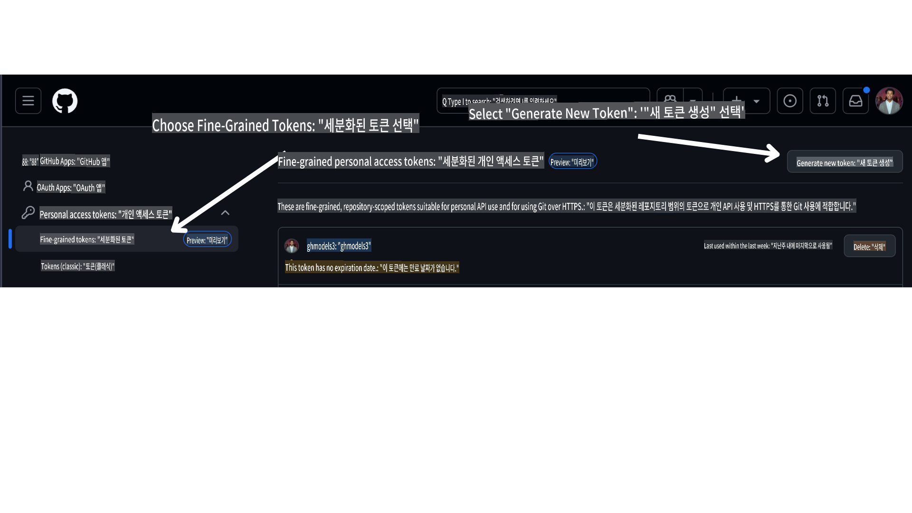

<!--
CO_OP_TRANSLATOR_METADATA:
{
  "original_hash": "366bc6709dd95b8a32ec7c705b0f179c",
  "translation_date": "2025-03-28T13:40:17+00:00",
  "source_file": "00-course-setup\\README.md",
  "language_code": "ko"
}
-->
# 코스 설정

## 소개

이 강의에서는 코스의 코드 샘플을 실행하는 방법을 다룹니다.

## 요구 사항

- GitHub 계정
- Python 3.12 이상
- Azure 구독
- Azure AI Foundry 계정

## 이 저장소를 클론 또는 포크하기

시작하려면 GitHub 저장소를 클론하거나 포크하세요. 이렇게 하면 코스 자료의 개인 버전을 만들어 코드를 실행, 테스트, 수정할 수 있습니다!

이를 위해 링크를 클릭하세요.

이제 다음 링크에서 이 코스의 포크된 버전을 가지고 있어야 합니다:


## GitHub 개인 액세스 토큰(PAT) 가져오기

현재 이 코스는 Github Models Marketplace를 사용하여 AI 에이전트를 생성하는 데 사용될 대규모 언어 모델(LLM)에 무료 액세스를 제공합니다.

이 서비스를 사용하려면 GitHub 개인 액세스 토큰을 생성해야 합니다.

이를 위해 GitHub 계정으로 이동하세요.

화면 왼쪽에서 `Fine-grained tokens` 옵션을 선택하세요.

그런 다음 `Generate new token`를 선택하세요.



방금 생성한 새 토큰을 복사하세요. 이제 이 토큰을 코스에 포함된 `.env` 파일에 추가합니다.

## 환경 변수에 추가하기

`.env` 파일을 생성하려면 터미널에서 다음 명령을 실행하세요:

```bash
cp .env.example .env
```

이 명령은 예제 파일을 복사하여 디렉터리에 `.env`를 생성합니다. 환경 변수의 값을 채우세요. 각 환경 변수의 값은 [Azure AI Foundry](https://ai.azure.com?WT.mc_id=academic-105485-koreyst) 포털의 다음 위치에서 찾을 수 있습니다:

파일을 열고 방금 생성한 토큰을 `GITHUB_TOKEN=` field of the .env file. 
- `AZURE_SUBSCRIPTION_ID` - On the **Overview** page of your project within **Project details**.
- `AZURE_AI_PROJECT_NAME` - At the top of the **Overview** page for your project.
- `AZURE_OPENAI_RESOURCE_GROUP` - On the **Overview** page of the **Management Center** within **Project properties**.
- `AZURE_OPENAI_SERVICE` - On the **Overview** page of your project in the **Included capabilities** tab for **Azure OpenAI Service**.
- `AZURE_OPENAI_API_VERSION` - On the [API version lifecycle](https://learn.microsoft.com/azure/ai-services/openai/api-version-deprecation#latest-ga-api-release?WT.mc_id=academic-105485-koreyst) webpage within the **Latest GA API release** section.
- `AZURE_OPENAI_ENDPOINT`에 붙여넣으세요 - 모델 배포의 **세부 정보** 탭에서 **엔드포인트** (예: **Target URI**)를 참조하세요.

## 필수 패키지 설치하기

코드 실행에 필요한 모든 Python 패키지를 설치하려면 터미널에서 다음 명령을 실행하세요.

Python 가상 환경을 생성하여 충돌 및 문제를 방지하는 것을 권장합니다.

```bash
pip install -r requirements.txt
```

이 명령은 필요한 Python 패키지를 설치합니다.

# Azure 로그인

보안 모범 사례로서, Microsoft Entra ID를 사용하여 Azure OpenAI에 [키리스 인증](https://learn.microsoft.com/azure/developer/ai/keyless-connections?tabs=csharp%2Cazure-cli?WT.mc_id=academic-105485-koreyst)을 사용할 것입니다. 이를 위해 먼저 운영 체제에 맞는 [설치 지침](https://learn.microsoft.com/cli/azure/install-azure-cli?WT.mc_id=academic-105485-koreyst)에 따라 **Azure CLI**를 설치해야 합니다.

그런 다음 터미널을 열고 `az login` to sign in to your Azure account.

## Sign in to Azure

Login with your Azure AI account used to provision the Azure resources.

Open a new terminal and enter the following command and follow the instructions in the terminal:

`az login --use-device-code`

Once you've logged in, select your subscription in the terminal.

## Access the environment variables.

We'll import `os` and `load_dotenv`를 실행하여 환경 변수에 액세스할 수 있습니다.

```python
import os
from dotenv import load_dotenv

load_dotenv()
```

## 키리스 인증 설정하기

자격 증명을 하드코딩하는 대신 Azure OpenAI와 키리스 연결을 사용합니다. 이를 위해 `DefaultAzureCredential` and later call the `DefaultAzureCredential` 함수를 가져와 자격 증명을 얻습니다.

```python
from azure.identity import DefaultAzureCredential, InteractiveBrowserCredential
```

이제 코스의 코드를 실행할 준비가 되었습니다. AI 에이전트의 세계를 더 배우는 즐거운 시간을 보내세요!

설정 실행 중 문제가 발생하면 우리와 함께 하세요.

## 다음 강의

[AI 에이전트 소개 및 에이전트 사용 사례](../01-intro-to-ai-agents/README.md)

**면책 조항**:  
이 문서는 AI 번역 서비스 [Co-op Translator](https://github.com/Azure/co-op-translator)를 사용하여 번역되었습니다. 정확성을 위해 노력하고 있지만, 자동 번역에는 오류나 부정확성이 포함될 수 있습니다. 원본 문서를 해당 언어로 작성된 권위 있는 자료로 간주해야 합니다. 중요한 정보의 경우, 전문적인 인간 번역을 권장합니다. 이 번역 사용으로 인해 발생하는 오해나 잘못된 해석에 대해 당사는 책임을 지지 않습니다.