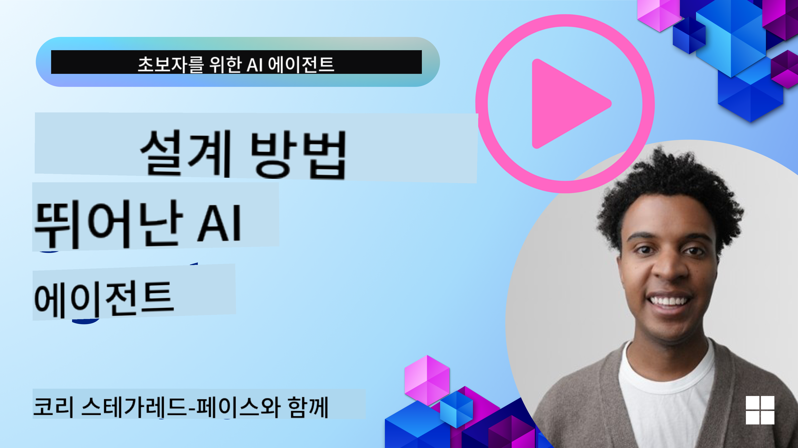
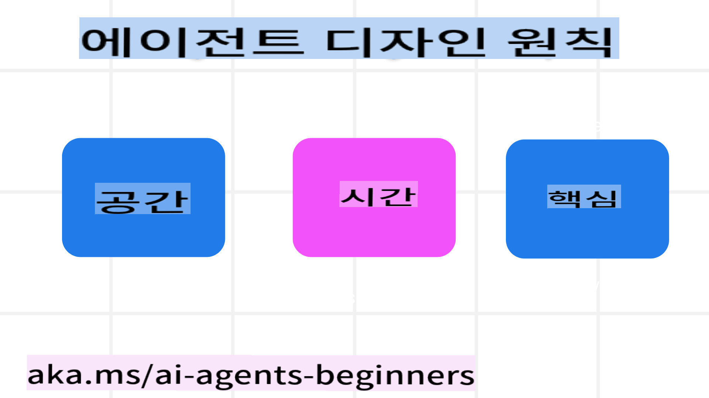

<!--
CO_OP_TRANSLATOR_METADATA:
{
  "original_hash": "969885aab5f923f67f134ce115fbbcaf",
  "translation_date": "2025-03-28T13:44:32+00:00",
  "source_file": "03-agentic-design-patterns\\README.md",
  "language_code": "ko"
}
-->

> _(위 이미지를 클릭하면 이 강의의 동영상을 볼 수 있습니다)_
# AI 에이전트 디자인 원칙

## 소개

AI 에이전트 시스템을 구축하는 방법에는 여러 가지가 있습니다. 생성형 AI 설계에서 모호성이 결함이 아니라 특징으로 간주되기 때문에, 엔지니어들이 어디서부터 시작해야 할지 막막할 때가 있습니다. 우리는 개발자들이 비즈니스 요구를 해결하기 위해 고객 중심의 에이전트 시스템을 구축할 수 있도록, 인간 중심의 UX 설계 원칙을 마련했습니다. 이 설계 원칙은 정해진 아키텍처를 제시하는 것이 아니라, 에이전트 경험을 정의하고 구축하려는 팀에게 출발점을 제공하는 역할을 합니다.

일반적으로 에이전트는 다음과 같은 역할을 해야 합니다:

- 인간의 능력을 확장하고 확대하기 (브레인스토밍, 문제 해결, 자동화 등)
- 지식 격차 메우기 (지식 영역에 대한 빠른 이해, 번역 등)
- 우리가 다른 사람들과 협력하는 방식을 지원하고 촉진하기
- 더 나은 자신이 되도록 돕기 (예: 라이프 코치/태스크 마스터, 감정 조절 및 마음챙김 기술 학습, 회복력 구축 등)

## 이 강의에서 다룰 내용

- 에이전트 디자인 원칙이란 무엇인가
- 이 설계 원칙을 구현할 때 따를 지침은 무엇인가
- 설계 원칙을 사용하는 몇 가지 사례

## 학습 목표

이 강의를 마친 후, 여러분은 다음을 할 수 있습니다:

1. 에이전트 디자인 원칙이 무엇인지 설명하기
2. 에이전트 디자인 원칙을 사용할 때의 지침 설명하기
3. 에이전트 디자인 원칙을 사용하여 에이전트를 구축하는 방법 이해하기

## 에이전트 디자인 원칙

### 에이전트 (공간)

이는 에이전트가 작동하는 환경입니다. 이러한 원칙은 물리적 및 디지털 세계에서의 에이전트 설계 방법을 안내합니다.

- **연결하기, 단절시키지 않기** – 사람들을 다른 사람, 이벤트, 실행 가능한 지식과 연결하여 협업과 연결을 가능하게 합니다.
  - 에이전트는 이벤트, 지식, 사람들을 연결합니다.
  - 에이전트는 사람들을 더 가까이 연결합니다. 사람들을 대체하거나 깎아내리기 위해 설계된 것이 아닙니다.
- **쉽게 접근 가능하되 때로는 보이지 않게** – 에이전트는 주로 배경에서 작동하며, 관련성과 적절성에 따라 우리를 살짝 자극합니다.
  - 에이전트는 인증된 사용자가 어떤 기기나 플랫폼에서든 쉽게 발견하고 접근할 수 있도록 합니다.
  - 에이전트는 다중 모달 입력 및 출력(소리, 음성, 텍스트 등)을 지원합니다.
  - 에이전트는 사용자 필요를 감지하여 전경과 배경, 능동적과 수동적 상태를 원활하게 전환할 수 있습니다.
  - 에이전트는 보이지 않는 형태로 작동할 수 있지만, 백그라운드 프로세스 경로와 다른 에이전트와의 협력은 사용자에게 투명하고 통제 가능해야 합니다.

### 에이전트 (시간)

이는 에이전트가 시간에 따라 작동하는 방식입니다. 이러한 원칙은 과거, 현재, 미래에 걸쳐 에이전트가 상호작용하는 방식을 설계하는 데 도움을 줍니다.

- **과거**: 상태와 맥락을 포함한 역사를 반영하기.
  - 에이전트는 단순히 이벤트, 사람, 상태에 국한되지 않고 더 풍부한 과거 데이터를 분석하여 더 관련성 높은 결과를 제공합니다.
  - 에이전트는 과거 사건과 연결을 생성하고 메모리를 적극적으로 반영하여 현재 상황에 대응합니다.
- **현재**: 알림보다 더 나아가기.
  - 에이전트는 사람들과 상호작용하는 데 포괄적인 접근 방식을 취합니다. 이벤트가 발생하면 단순 알림 이상의 역할을 수행합니다. 에이전트는 흐름을 단순화하거나 동적으로 신호를 생성하여 사용자의 주의를 적시에 유도합니다.
  - 에이전트는 맥락적 환경, 사회적 및 문화적 변화에 기반한 정보를 제공하며, 사용자 의도에 맞게 조정됩니다.
  - 에이전트 상호작용은 점진적으로 이루어지며, 시간이 지남에 따라 복잡성이 증가하여 사용자를 강화합니다.
- **미래**: 적응하고 진화하기.
  - 에이전트는 다양한 기기, 플랫폼 및 모달리티에 적응합니다.
  - 에이전트는 사용자 행동, 접근성 요구에 적응하며, 자유롭게 사용자화 가능합니다.
  - 에이전트는 지속적인 사용자 상호작용을 통해 형성되고 발전합니다.

### 에이전트 (핵심)

이는 에이전트 설계의 핵심 요소들입니다.

- **불확실성을 수용하되 신뢰를 구축하기**.
  - 에이전트의 일정 수준의 불확실성은 예상됩니다. 불확실성은 에이전트 설계의 핵심 요소입니다.
  - 신뢰와 투명성은 에이전트 설계의 기본 층위입니다.
  - 에이전트가 켜져 있거나 꺼져 있는 상태는 항상 명확히 보이며, 사용자가 이를 제어할 수 있습니다.

## 이 원칙을 구현하기 위한 지침

위의 설계 원칙을 사용할 때는 다음 지침을 따르세요:

1. **투명성**: AI가 관여되어 있다는 사실, 그 작동 방식(과거 작업 포함), 피드백 제공 및 시스템 수정 방법을 사용자에게 알립니다.
2. **제어**: 사용자가 시스템 및 속성을 사용자화하고, 선호도를 지정하며, 개인화할 수 있도록 하고, 시스템을 통제할 수 있도록 합니다(예: 잊을 권리 포함).
3. **일관성**: 기기와 엔드포인트 전반에서 일관되고 다중 모달 경험을 목표로 합니다. 가능한 경우 익숙한 UI/UX 요소를 사용하고(예: 음성 상호작용을 위한 마이크 아이콘), 고객의 인지적 부담을 최대한 줄입니다(예: 간결한 응답, 시각적 도움, ‘더 알아보기’ 콘텐츠 제공).

## 이 원칙과 지침을 사용해 여행 에이전트 설계하기

여행 에이전트를 설계한다고 가정했을 때, 다음과 같이 설계 원칙과 지침을 활용할 수 있습니다:

1. **투명성** – 여행 에이전트가 AI 기반 에이전트임을 사용자에게 알립니다. 시작 방법에 대한 기본 지침을 제공합니다(예: “안녕하세요” 메시지, 샘플 프롬프트). 제품 페이지에 이를 명확히 문서화합니다. 사용자가 과거에 요청한 프롬프트 목록을 보여줍니다. 피드백 제공 방법을 명확히 합니다(예: 좋아요/싫어요 버튼, 피드백 보내기 버튼 등). 에이전트가 사용 제한이나 주제 제한이 있는 경우 이를 명확히 설명합니다.
2. **제어** – 시스템 프롬프트와 같은 요소를 통해 에이전트를 수정하는 방법을 명확히 합니다. 에이전트의 응답 길이, 문체, 다루지 말아야 할 주제 등을 사용자가 선택할 수 있도록 합니다. 사용자에게 관련 파일, 데이터, 프롬프트, 과거 대화 등을 보고 삭제할 수 있는 권한을 부여합니다.
3. **일관성** – 프롬프트 공유, 파일 또는 사진 추가, 사람이나 항목 태그 지정과 관련된 아이콘이 표준적이고 알아보기 쉽게 만듭니다. 파일 업로드/공유를 나타내는 클립 모양 아이콘과 그래픽 업로드를 나타내는 이미지 아이콘을 사용합니다.

## 추가 자료

- 

## 이전 강의

[에이전트 프레임워크 탐구하기](../02-explore-agentic-frameworks/README.md)

## 다음 강의

[도구 사용 설계 패턴](../04-tool-use/README.md)

**면책 조항**:  
이 문서는 AI 번역 서비스 [Co-op Translator](https://github.com/Azure/co-op-translator)를 사용하여 번역되었습니다. 정확성을 위해 노력하고 있지만, 자동 번역에는 오류나 부정확성이 포함될 수 있음을 유의하시기 바랍니다. 원본 문서(원어로 작성된 문서)가 권위 있는 자료로 간주되어야 합니다. 중요한 정보의 경우, 전문적인 인간 번역을 권장합니다. 이 번역을 사용함으로 인해 발생하는 오해나 잘못된 해석에 대해 책임을 지지 않습니다.