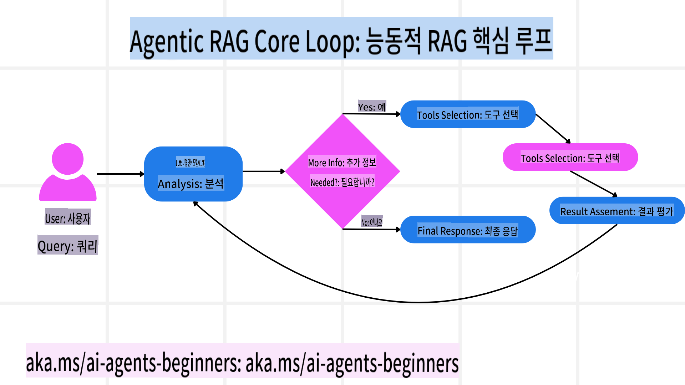
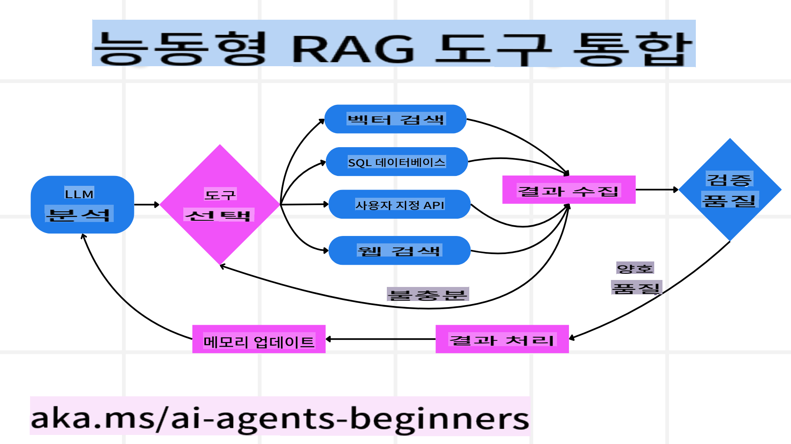
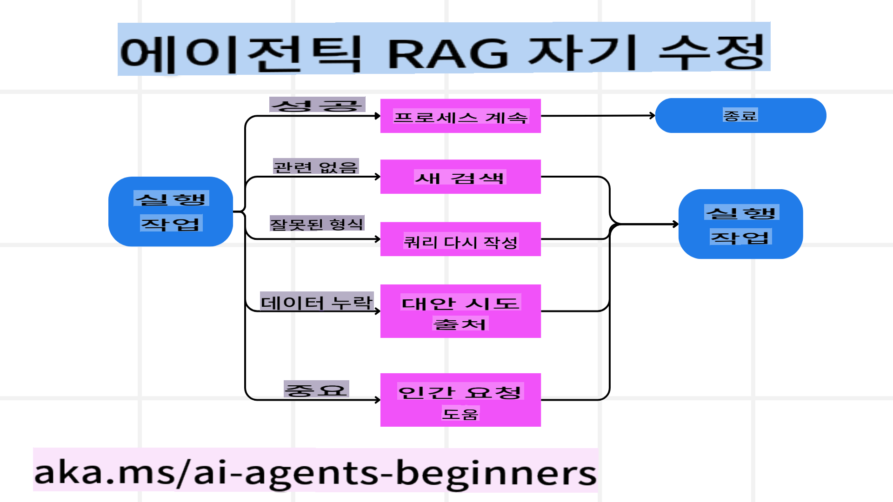
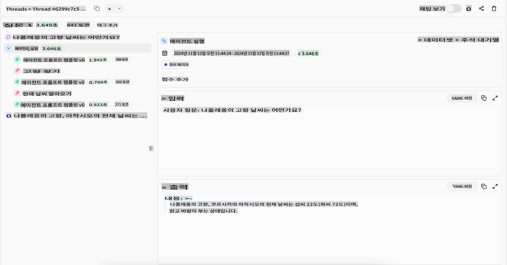
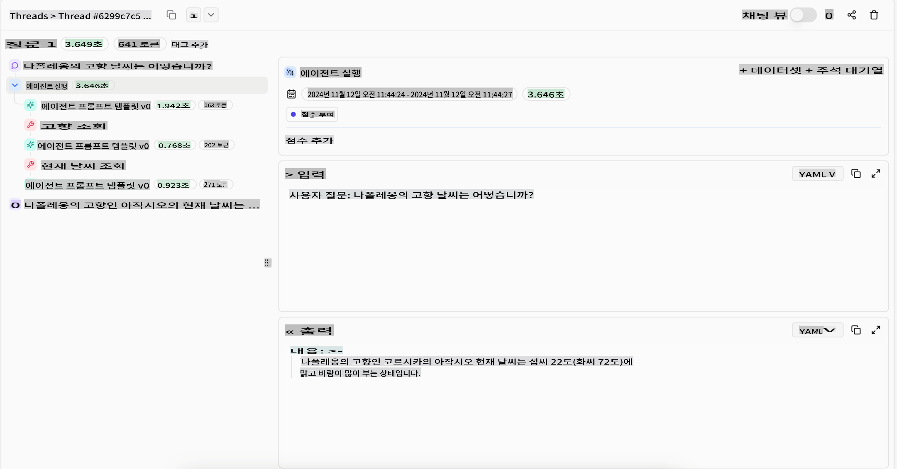

<!--
CO_OP_TRANSLATOR_METADATA:
{
  "original_hash": "4d215d159f2f3b96644fd62657988d23",
  "translation_date": "2025-03-28T13:46:09+00:00",
  "source_file": "05-agentic-rag\\README.md",
  "language_code": "ko"
}
-->

> _(위 이미지를 클릭하면 이 레슨의 동영상을 시청할 수 있습니다)_

# Agentic RAG

이 레슨에서는 Agentic Retrieval-Augmented Generation (Agentic RAG)에 대해 종합적으로 다룹니다. 이는 대규모 언어 모델(LLM)이 외부 소스에서 정보를 가져오면서 다음 단계를 자율적으로 계획하는 신흥 AI 패러다임입니다. 정적인 정보 검색 후 읽기 방식과 달리, Agentic RAG는 LLM 호출과 도구 또는 함수 호출 및 구조화된 출력이 반복적으로 이루어지는 방식입니다. 시스템은 결과를 평가하고, 쿼리를 수정하며, 필요 시 추가 도구를 호출하여 만족스러운 솔루션이 나올 때까지 이 과정을 반복합니다.

## 소개

이 레슨에서 다룰 내용:

- **Agentic RAG 이해하기:** LLM이 외부 데이터 소스를 활용하며 자율적으로 다음 단계를 계획하는 AI의 새로운 패러다임에 대해 학습합니다.
- **반복적인 Maker-Checker 스타일 이해하기:** LLM 호출과 도구 또는 함수 호출 및 구조화된 출력이 반복되는 루프를 이해하여 정확성을 높이고 잘못된 쿼리를 처리하는 방식을 배웁니다.
- **실용적인 응용 사례 탐구:** 정확성을 우선시하는 환경, 복잡한 데이터베이스 상호작용, 확장된 워크플로우 등에서 Agentic RAG가 유용한 상황을 식별합니다.

## 학습 목표

이 레슨을 완료한 후, 여러분은 다음을 이해하거나 할 수 있게 됩니다:

- **Agentic RAG 이해:** LLM이 외부 데이터 소스를 활용하며 자율적으로 다음 단계를 계획하는 AI의 새로운 패러다임에 대해 학습합니다.
- **반복적인 Maker-Checker 스타일:** LLM 호출과 도구 또는 함수 호출 및 구조화된 출력이 반복되는 루프를 이해하여 정확성을 높이고 잘못된 쿼리를 처리하는 방식을 배웁니다.
- **추론 프로세스 소유:** 시스템이 사전 정의된 경로에 의존하지 않고 문제를 해결하는 방식을 스스로 결정하는 능력을 이해합니다.
- **워크플로우:** 에이전트 모델이 시장 동향 보고서를 검색하고, 경쟁사 데이터를 식별하며, 내부 판매 지표를 연관짓고, 결과를 종합하여 전략을 평가하는 과정을 이해합니다.
- **반복 루프, 도구 통합 및 메모리:** 시스템이 반복 상호작용 패턴에 의존하며, 반복 루프를 피하고 정보에 근거한 결정을 내리기 위해 단계 간 상태와 메모리를 유지하는 방식을 배웁니다.
- **실패 모드 처리 및 자기 수정:** 쿼리 반복 및 재작성, 진단 도구 활용, 인간 감독에 의존하는 등 시스템의 강력한 자기 수정 메커니즘을 탐구합니다.
- **에이전시의 한계:** 도메인별 자율성, 인프라 의존성, 가드레일 준수에 중점을 두고 Agentic RAG의 한계를 이해합니다.
- **실용적인 사용 사례와 가치:** 정확성을 우선시하는 환경, 복잡한 데이터베이스 상호작용, 확장된 워크플로우 등에서 Agentic RAG가 유용한 상황을 식별합니다.
- **거버넌스, 투명성 및 신뢰:** 설명 가능한 추론, 편향 제어, 인간 감독 등 거버넌스와 투명성의 중요성을 학습합니다.

## Agentic RAG란 무엇인가?

Agentic Retrieval-Augmented Generation (Agentic RAG)은 대규모 언어 모델(LLM)이 외부 소스에서 정보를 가져오면서 자율적으로 다음 단계를 계획하는 신흥 AI 패러다임입니다. 정적인 정보 검색 후 읽기 방식과 달리, Agentic RAG는 LLM 호출과 도구 또는 함수 호출 및 구조화된 출력이 반복적으로 이루어지는 방식입니다. 시스템은 결과를 평가하고, 쿼리를 수정하며, 필요 시 추가 도구를 호출하여 만족스러운 솔루션이 나올 때까지 이 과정을 반복합니다. 이러한 반복적인 “Maker-Checker” 스타일은 정확성을 높이고, 잘못된 쿼리를 처리하며, 고품질의 결과를 보장합니다.

시스템은 추론 과정을 적극적으로 소유하며, 실패한 쿼리를 다시 작성하고, 다양한 검색 방법을 선택하며, 최종 답변을 도출하기 전에 Azure AI Search의 벡터 검색, SQL 데이터베이스 또는 사용자 지정 API와 같은 여러 도구를 통합합니다. 에이전트 시스템의 가장 큰 특징은 추론 과정을 스스로 소유하는 능력입니다. 전통적인 RAG 구현은 사전에 정의된 경로에 의존하지만, 에이전트 시스템은 발견된 정보의 품질에 따라 단계 순서를 자율적으로 결정합니다.

## Agentic Retrieval-Augmented Generation (Agentic RAG)의 정의

Agentic Retrieval-Augmented Generation (Agentic RAG)은 LLM이 외부 데이터 소스에서 정보를 가져올 뿐만 아니라 자율적으로 다음 단계를 계획하는 AI 개발의 신흥 패러다임입니다. 정적인 검색 후 읽기 패턴이나 신중하게 스크립트화된 프롬프트 시퀀스와 달리, Agentic RAG는 LLM 호출과 도구 또는 함수 호출 및 구조화된 출력이 반복적으로 이루어지는 루프를 포함합니다. 매 단계마다 시스템은 얻은 결과를 평가하고, 쿼리를 수정하거나, 필요 시 추가 도구를 호출하며, 만족스러운 솔루션이 나올 때까지 이 과정을 반복합니다.

이 반복적인 “Maker-Checker” 스타일은 정확성을 높이고, 구조화된 데이터베이스(예: NL2SQL)에 대한 잘못된 쿼리를 처리하며, 균형 잡힌 고품질 결과를 보장하도록 설계되었습니다. 신중하게 설계된 프롬프트 체인에만 의존하는 대신, 시스템은 추론 과정을 적극적으로 소유합니다. 실패한 쿼리를 다시 작성하고, 다양한 검색 방법을 선택하며, 최종 답변을 도출하기 전에 Azure AI Search의 벡터 검색, SQL 데이터베이스 또는 사용자 지정 API와 같은 여러 도구를 통합할 수 있습니다. 이를 통해 복잡한 오케스트레이션 프레임워크의 필요성이 줄어들며, “LLM 호출 → 도구 사용 → LLM 호출 → …”이라는 비교적 간단한 루프만으로도 정교하고 근거 있는 출력을 생성할 수 있습니다.

## 추론 과정 소유하기

시스템을 “에이전트적”으로 만드는 가장 큰 특징은 추론 과정을 스스로 소유하는 능력입니다. 전통적인 RAG 구현은 모델이 무엇을 검색하고 언제 검색할지를 명시하는 인간이 미리 정의한 경로에 의존합니다.  
하지만 진정한 에이전트 시스템은 문제 접근 방식을 내부적으로 결정합니다. 단순히 스크립트를 실행하는 것이 아니라, 발견된 정보의 품질에 따라 단계 순서를 자율적으로 결정합니다.  
예를 들어, 제품 출시 전략을 수립하라는 요청을 받았을 때, 연구 및 의사결정 워크플로우 전체를 명시한 프롬프트에만 의존하지 않습니다. 대신, 에이전트 모델은 독립적으로 다음을 결정합니다:

1. Bing Web Grounding을 사용해 현재 시장 동향 보고서를 검색합니다.
2. Azure AI Search를 통해 관련 경쟁사 데이터를 식별합니다.
3. Azure SQL Database를 사용해 과거 내부 판매 지표를 연관시킵니다.
4. Azure OpenAI Service를 통해 결과를 종합하여 일관된 전략을 만듭니다.
5. 전략의 빈틈이나 불일치를 평가하고, 필요 시 추가 검색을 진행합니다.

이 모든 단계—쿼리 수정, 소스 선택, 만족할 때까지 반복—는 모델에 의해 결정되며, 인간이 미리 스크립트화하지 않습니다.

## 반복 루프, 도구 통합 및 메모리

에이전트 시스템은 반복적인 상호작용 패턴에 의존합니다:

- **초기 호출:** 사용자의 목표(즉, 사용자 프롬프트)가 LLM에 전달됩니다.
- **도구 호출:** 모델이 누락된 정보나 모호한 지침을 식별하면, 벡터 데이터베이스 쿼리(예: Azure AI Search 하이브리드 검색)나 구조화된 SQL 호출과 같은 도구나 검색 방법을 선택하여 더 많은 컨텍스트를 수집합니다.
- **평가 및 수정:** 반환된 데이터를 검토한 후, 모델은 정보가 충분한지 판단합니다. 그렇지 않을 경우, 쿼리를 수정하거나 다른 도구를 시도하거나 접근 방식을 조정합니다.
- **만족할 때까지 반복:** 이 과정은 모델이 명확성과 증거를 충분히 확보했다고 판단할 때까지 계속됩니다.
- **메모리 및 상태:** 시스템은 단계 간 상태와 메모리를 유지하므로, 이전 시도와 그 결과를 기억하여 반복 루프를 피하고 점점 더 정보에 근거한 결정을 내릴 수 있습니다.

시간이 지남에 따라, 이러한 방식은 점진적인 이해를 형성하며, 인간이 지속적으로 개입하거나 프롬프트를 재구성할 필요 없이 복잡하고 다단계의 작업을 수행할 수 있게 합니다.

## 실패 모드 처리 및 자기 수정

Agentic RAG의 자율성에는 강력한 자기 수정 메커니즘도 포함됩니다. 시스템이 막다른 길에 도달했을 때—예를 들어, 관련 없는 문서를 검색하거나 잘못된 쿼리를 마주했을 때—다음과 같은 조치를 취할 수 있습니다:

- **반복 및 재쿼리:** 낮은 가치의 응답을 반환하는 대신, 새로운 검색 전략을 시도하거나 데이터베이스 쿼리를 다시 작성하거나 대체 데이터 세트를 검색합니다.
- **진단 도구 사용:** 시스템은 추론 단계를 디버그하거나 검색된 데이터의 정확성을 확인하기 위해 설계된 추가 기능을 호출할 수 있습니다. Azure AI Tracing과 같은 도구는 강력한 관찰성과 모니터링을 가능하게 합니다.
- **인간 감독 의존:** 고위험 또는 반복적으로 실패하는 시나리오에서는 모델이 불확실성을 플래그로 표시하고 인간의 지침을 요청할 수 있습니다. 인간이 교정 피드백을 제공하면, 모델은 이를 학습하여 이후에 반영할 수 있습니다.

이 반복적이고 역동적인 접근 방식은 모델이 지속적으로 개선되도록 하며, 단발성 시스템이 아니라 세션 중 실수를 학습하는 시스템으로 만듭니다.

## 에이전시의 한계

특정 작업 내에서의 자율성에도 불구하고, Agentic RAG는 인공지능 일반화(Artificial General Intelligence)와 동일하지 않습니다. 그 “에이전트적” 능력은 인간 개발자가 제공한 도구, 데이터 소스 및 정책에 제한됩니다. 자체 도구를 발명하거나 설정된 도메인 경계를 넘어설 수는 없습니다. 대신, 현재 제공된 리소스를 동적으로 조정하는 데 뛰어납니다.  
더 발전된 AI 형태와의 주요 차이점은 다음과 같습니다:

1. **도메인별 자율성:** Agentic RAG 시스템은 사용자가 정의한 목표를 달성하기 위해 쿼리 재작성 또는 도구 선택과 같은 전략을 사용하여 결과를 개선하는 데 초점을 맞춥니다.
2. **인프라 의존성:** 시스템의 기능은 개발자가 통합한 도구와 데이터에 의존합니다. 인간의 개입 없이는 이러한 경계를 넘어설 수 없습니다.
3. **가드레일 준수:** 윤리적 지침, 준수 규칙 및 비즈니스 정책은 여전히 매우 중요합니다. 에이전트의 자유는 항상 안전 장치와 감독 메커니즘에 의해 제한됩니다.

## 실용적인 사용 사례와 가치

Agentic RAG는 반복적인 정제와 정확성이 요구되는 시나리오에서 빛을 발합니다:

1. **정확성 우선 환경:** 규정 준수 검사, 규제 분석 또는 법률 연구에서 에이전트 모델은 사실을 반복적으로 확인하고, 여러 소스를 참조하며, 쿼리를 다시 작성하여 철저히 검증된 답변을 생성할 수 있습니다.
2. **복잡한 데이터베이스 상호작용:** 구조화된 데이터와 작업할 때 쿼리가 자주 실패하거나 조정이 필요할 경우, 시스템은 Azure SQL 또는 Microsoft Fabric OneLake를 사용하여 쿼리를 자율적으로 수정하여 최종 검색이 사용자의 의도에 부합하도록 합니다.
3. **확장된 워크플로우:** 새로운 정보가 나타남에 따라 장기적인 세션이 진화할 수 있습니다. Agentic RAG는 새로운 데이터를 지속적으로 통합하며 문제 공간에 대해 더 많이 학습하면서 전략을 변경할 수 있습니다.

## 거버넌스, 투명성 및 신뢰

이러한 시스템이 추론 과정에서 더 자율적이 됨에 따라, 거버넌스와 투명성이 중요합니다:

- **설명 가능한 추론:** 모델은 만든 쿼리, 참조한 소스, 결론에 도달하기 위해 거친 추론 단계를 감사할 수 있는 기록을 제공합니다. Azure AI Content Safety 및 Azure AI Tracing / GenAIOps와 같은 도구는 투명성을 유지하고 위험을 완화하는 데 도움을 줄 수 있습니다.
- **편향 제어 및 균형 잡힌 검색:** 개발자는 균형 잡힌 대표적인 데이터 소스가 고려되도록 검색 전략을 조정할 수 있으며, Azure Machine Learning을 사용하는 고급 데이터 과학 조직의 맞춤형 모델을 통해 출력의 편향이나 왜곡 패턴을 정기적으로 감사할 수 있습니다.
- **인간 감독 및 준수:** 민감한 작업에서는 인간 검토가 여전히 필수적입니다. Agentic RAG는 고위험 결정에서 인간의 판단을 대체하지 않으며, 더 철저히 검토된 옵션을 제공하여 이를 보완합니다.

행동 기록을 명확히 제공하는 도구는 필수적입니다. 그렇지 않으면 다단계 프로세스를 디버깅하는 것이 매우 어려울 수 있습니다. 아래는 Literal AI(Chainlit의 회사)의 Agent 실행 예시입니다:

## 결론

Agentic RAG는 AI 시스템이 복잡하고 데이터 중심적인 작업을 처리하는 방식에서 자연스러운 진화를 나타냅니다. 반복 상호작용 패턴을 채택하고, 도구를 자율적으로 선택하며, 고품질 결과를 달성할 때까지 쿼리를 정제함으로써, 시스템은 정적인 프롬프트 수행을 넘어 더 적응적이고 상황을 인식하며 결정을 내릴 수 있게 됩니다. 여전히 인간이 정의한 인프라와 윤리적 지침에 제한을 받지만, 이러한 에이전트적 기능은 기업과 최종 사용자 모두에게 더 풍부하고 역동적이며 궁극적으로 더 유용한 AI 상호작용을 가능하게 합니다.

## 추가 자료

- <a href="https://learn.microsoft.com/training/modules/use-own-data-azure-openai" target="_blank">Azure OpenAI Service로 Retrieval Augmented Generation (RAG) 구현하기: Azure OpenAI Service를 사용하여 자체 데이터를 활용하는 방법을 학습할 수 있는 Microsoft Learn 모듈입니다.</a>
- <a href="https://learn.microsoft.com/azure/ai-studio/concepts/evaluation-approach-gen-ai" target="_blank">Azure AI Foundry로 생성형 AI 애플리케이션 평가: 공개 데이터 세트를 기반으로 모델을 평가하고 비교하는 방법을 다루며, Agentic AI 애플리케이션 및 RAG 아키텍처도 포함됩니다.</a>
- <a href="https://weaviate.io/blog/what-is-agentic-rag" target="_blank">Agentic RAG란 무엇인가 | Weaviate</a>
- <a href="https://ragaboutit.com/agentic-rag-a-complete-guide-to-agent-based-retrieval-augmented-generation/" target="_blank">Agentic RAG: Agent 기반 Retrieval Augmented Generation에 대한 완전한 가이드 – generation RAG 뉴스</a>
- <a href="https://huggingface.co/learn/cookbook/agent_rag" target="_blank">Agentic RAG: 쿼리 재구성과 자체 쿼리로 RAG를 강화하세요! Hugging Face 오픈 소스 AI 요리책</a>
- <a href="https://youtu.be/aQ4yQXeB1Ss?si=2HUqBzHoeB5tR04U" target="_blank">RAG에 Agentic 계층 추가하기</a>
- <a href="https://www.youtube.com/watch?v=zeAyuLc_f3Q&t=244s" target="_blank">지식 어시스턴트의 미래: Jerry Liu</a>
- <a href="https://www.youtube.com/watch?v=AOSjiXP1jmQ" target="_blank">Agentic RAG 시스템 구축 방법</a>
- <a href="https://ignite.microsoft.com/sessions/BRK102?source=sessions" target="_blank">Azure AI Foundry Agent Service를 사용하여 AI 에이전트 확장하기</a>

### 학술 논문

- <a href="https://arxiv.org/abs/2303.17651" target="_blank">2303.17651 Self-Refine: Iterative Refinement with Self-Feedback</a>
- <a href="https://arxiv.org/abs/2303.11366" target="_blank">2303.11366 Reflexion: Language Agents with Verbal Reinforcement Learning</a>
- <a href="https://arxiv.org/abs/2305.11738" target="_blank">

**면책 조항**:  
이 문서는 AI 번역 서비스 [Co-op Translator](https://github.com/Azure/co-op-translator)를 사용하여 번역되었습니다. 정확성을 위해 노력하고 있지만, 자동 번역에는 오류나 부정확성이 포함될 수 있음을 유의하시기 바랍니다. 원본 문서의 원어 버전을 신뢰할 수 있는 권위 있는 자료로 간주해야 합니다. 중요한 정보의 경우, 전문 인간 번역을 권장합니다. 이 번역을 사용함으로써 발생하는 오해나 잘못된 해석에 대해 당사는 책임을 지지 않습니다.