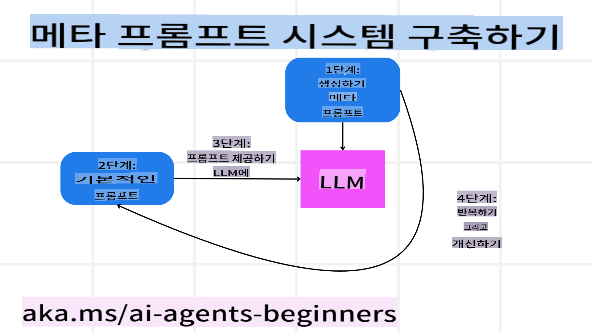
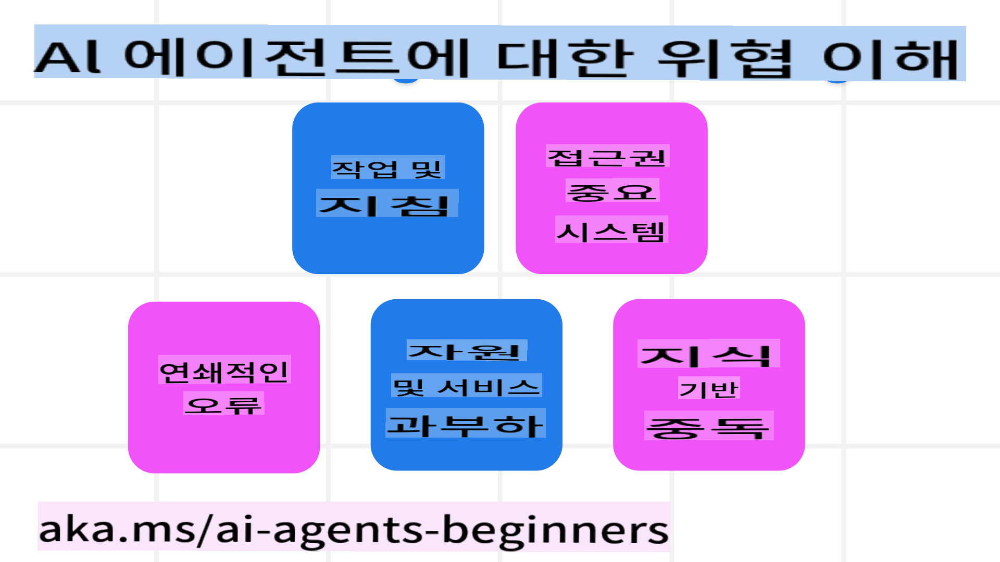
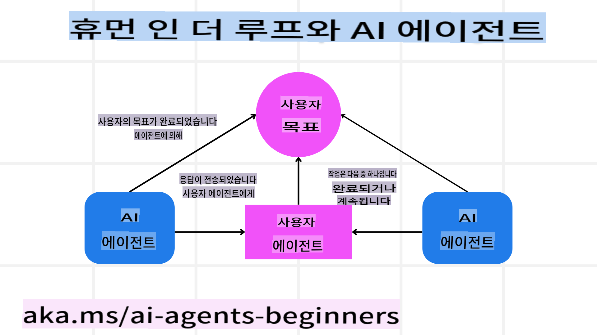

# 신뢰할 수 있는 AI 에이전트 구축

## 소개

이 강의에서는 다음 내용을 다룹니다:

- 안전하고 효과적인 AI 에이전트를 구축하고 배포하는 방법
- AI 에이전트를 개발할 때 고려해야 할 중요한 보안 사항
- AI 에이전트를 개발할 때 데이터와 사용자 프라이버시를 유지하는 방법

## 학습 목표

이 강의를 완료한 후, 여러분은 다음을 할 수 있습니다:

- AI 에이전트를 생성할 때 발생할 수 있는 위험을 식별하고 완화하는 방법을 이해합니다.
- 데이터와 접근 권한을 적절히 관리하기 위한 보안 조치를 구현합니다.
- 데이터 프라이버시를 유지하고 품질 높은 사용자 경험을 제공하는 AI 에이전트를 만듭니다.

## 안전성

우선 안전한 에이전트 기반 애플리케이션을 구축하는 방법을 살펴보겠습니다. 안전성이란 AI 에이전트가 설계된 대로 작동하는 것을 의미합니다. 에이전트 기반 애플리케이션을 구축하는 개발자로서, 우리는 안전성을 극대화하기 위한 방법과 도구를 가지고 있습니다.

### 메타 프롬프팅 시스템 구축

대규모 언어 모델(LLMs)을 사용해 AI 애플리케이션을 만들어본 경험이 있다면, 견고한 시스템 프롬프트나 시스템 메시지를 설계하는 것이 얼마나 중요한지 알 것입니다. 이러한 프롬프트는 LLM이 사용자 및 데이터와 상호작용하는 방식에 대한 메타 규칙, 지침, 가이드를 설정합니다.

AI 에이전트의 경우, 시스템 프롬프트는 더욱 중요합니다. AI 에이전트가 설계된 작업을 수행하려면 매우 구체적인 지침이 필요하기 때문입니다.

확장 가능한 시스템 프롬프트를 생성하려면, 애플리케이션에서 하나 이상의 에이전트를 구축하기 위한 메타 프롬프팅 시스템을 사용할 수 있습니다:



#### 1단계: 메타 또는 템플릿 프롬프트 생성

메타 프롬프트는 우리가 생성하는 에이전트의 시스템 프롬프트를 생성하기 위해 LLM이 사용할 템플릿입니다. 필요에 따라 여러 에이전트를 효율적으로 생성할 수 있도록 템플릿 형태로 설계합니다.

다음은 LLM에 제공할 메타 프롬프트의 예입니다:

```plaintext
You are an expert at creating AI agent assitants. 
You will be provided a company name, role, responsibilites and other
information that you will use to provide a system prompt for.
To create the system prompt, be descriptive as possible and provide a structure that a system using an LLM can better understand the role and responsibilites of the AI assistant. 
```

#### 2단계: 기본 프롬프트 생성

다음 단계는 AI 에이전트를 설명하는 기본 프롬프트를 작성하는 것입니다. 여기에는 에이전트의 역할, 에이전트가 수행할 작업, 기타 책임이 포함되어야 합니다.

다음은 그 예입니다:

```plaintext
You are a travel agent for Contoso Travel with that is great at booking flights for customers. To help customers you can perform the following tasks: lookup available flights, book flights, ask for preferences in seating and times for flights, cancel any previously booked flights and alert customers on any delays or cancellations of flights.  
```

#### 3단계: LLM에 기본 프롬프트 제공

이제 메타 프롬프트를 시스템 프롬프트로 제공하고 기본 프롬프트를 추가하여 최적화된 프롬프트를 생성할 수 있습니다.

이렇게 하면 AI 에이전트를 보다 효과적으로 안내할 수 있는 프롬프트가 생성됩니다:

```markdown
**Company Name:** Contoso Travel  
**Role:** Travel Agent Assistant

**Objective:**  
You are an AI-powered travel agent assistant for Contoso Travel, specializing in booking flights and providing exceptional customer service. Your main goal is to assist customers in finding, booking, and managing their flights, all while ensuring that their preferences and needs are met efficiently.

**Key Responsibilities:**

1. **Flight Lookup:**
    
    - Assist customers in searching for available flights based on their specified destination, dates, and any other relevant preferences.
    - Provide a list of options, including flight times, airlines, layovers, and pricing.
2. **Flight Booking:**
    
    - Facilitate the booking of flights for customers, ensuring that all details are correctly entered into the system.
    - Confirm bookings and provide customers with their itinerary, including confirmation numbers and any other pertinent information.
3. **Customer Preference Inquiry:**
    
    - Actively ask customers for their preferences regarding seating (e.g., aisle, window, extra legroom) and preferred times for flights (e.g., morning, afternoon, evening).
    - Record these preferences for future reference and tailor suggestions accordingly.
4. **Flight Cancellation:**
    
    - Assist customers in canceling previously booked flights if needed, following company policies and procedures.
    - Notify customers of any necessary refunds or additional steps that may be required for cancellations.
5. **Flight Monitoring:**
    
    - Monitor the status of booked flights and alert customers in real-time about any delays, cancellations, or changes to their flight schedule.
    - Provide updates through preferred communication channels (e.g., email, SMS) as needed.

**Tone and Style:**

- Maintain a friendly, professional, and approachable demeanor in all interactions with customers.
- Ensure that all communication is clear, informative, and tailored to the customer's specific needs and inquiries.

**User Interaction Instructions:**

- Respond to customer queries promptly and accurately.
- Use a conversational style while ensuring professionalism.
- Prioritize customer satisfaction by being attentive, empathetic, and proactive in all assistance provided.

**Additional Notes:**

- Stay updated on any changes to airline policies, travel restrictions, and other relevant information that could impact flight bookings and customer experience.
- Use clear and concise language to explain options and processes, avoiding jargon where possible for better customer understanding.

This AI assistant is designed to streamline the flight booking process for customers of Contoso Travel, ensuring that all their travel needs are met efficiently and effectively.

```

#### 4단계: 반복 및 개선

메타 프롬프팅 시스템의 가치는 여러 에이전트를 쉽게 생성할 수 있을 뿐만 아니라, 프롬프트를 지속적으로 개선할 수 있다는 점입니다. 처음부터 완벽하게 작동하는 프롬프트를 얻는 것은 드문 일이므로, 기본 프롬프트를 약간씩 수정하고 시스템을 통해 실행해 결과를 비교하고 평가하는 것이 중요합니다.

## 위협 이해하기  

신뢰할 수 있는 AI 에이전트를 구축하려면, AI 에이전트에 대한 위험과 위협을 이해하고 이를 완화하는 것이 중요합니다. 이제 AI 에이전트에 대한 다양한 위협과 이를 대비하고 계획하는 방법에 대해 살펴보겠습니다.



### 작업 및 지침

**설명:** 공격자는 프롬프트나 입력값을 조작하여 AI 에이전트의 지침이나 목표를 변경하려고 시도합니다.

**완화 방안:** AI 에이전트가 입력을 처리하기 전에 잠재적으로 위험한 프롬프트를 탐지할 수 있도록 검증 및 입력 필터링을 실행하세요. 이러한 공격은 일반적으로 에이전트와의 빈번한 상호작용을 필요로 하므로, 대화 횟수를 제한하는 것도 이러한 공격을 방지하는 방법입니다.

### 중요한 시스템에 대한 접근

**설명:** AI 에이전트가 민감한 데이터를 저장하는 시스템 및 서비스에 접근할 수 있는 경우, 공격자는 에이전트와 이러한 서비스 간의 통신을 손상시킬 수 있습니다. 이는 직접적인 공격이거나 에이전트를 통해 시스템 정보를 얻으려는 간접적인 시도일 수 있습니다.

**완화 방안:** AI 에이전트는 필요할 때만 시스템에 접근할 수 있도록 제한해야 합니다. 에이전트와 시스템 간의 통신은 반드시 안전해야 하며, 인증 및 접근 제어를 구현하여 정보를 보호하세요.

### 리소스 및 서비스 과부하

**설명:** AI 에이전트는 작업을 완료하기 위해 다양한 도구와 서비스를 사용할 수 있습니다. 공격자는 AI 에이전트를 통해 대량의 요청을 전송하여 해당 서비스에 시스템 장애나 높은 비용을 초래할 수 있습니다.

**완화 방안:** AI 에이전트가 서비스에 보낼 수 있는 요청 수를 제한하는 정책을 구현하세요. 대화 횟수와 요청 수를 제한하는 것도 이러한 공격을 방지하는 방법입니다.

### 지식 베이스 오염

**설명:** 이 유형의 공격은 AI 에이전트를 직접적으로 공격하는 것이 아니라, 에이전트가 사용하는 지식 베이스나 기타 서비스를 대상으로 합니다. 이는 데이터를 손상시키거나 AI 에이전트가 작업을 수행하는 데 사용하는 정보를 왜곡하여 편향되거나 의도하지 않은 응답을 유도할 수 있습니다.

**완화 방안:** AI 에이전트가 워크플로우에서 사용하는 데이터를 정기적으로 검증하세요. 이 데이터에 대한 접근은 반드시 신뢰할 수 있는 사람만 변경할 수 있도록 보안 조치를 취하세요.

### 연쇄 오류

**설명:** AI 에이전트는 작업을 완료하기 위해 다양한 도구와 서비스에 접근합니다. 공격으로 인해 발생한 오류가 AI 에이전트가 연결된 다른 시스템의 장애로 이어질 수 있으며, 이는 공격이 더 광범위하게 확산되고 문제 해결이 어려워질 수 있습니다.

**완화 방안:** AI 에이전트가 Docker 컨테이너와 같은 제한된 환경에서 작업하도록 하여 직접적인 시스템 공격을 방지하세요. 특정 시스템이 오류를 반환할 경우 대체 메커니즘과 재시도 로직을 구현하여 더 큰 시스템 장애를 방지하세요.

## 인간 개입 루프

신뢰할 수 있는 AI 에이전트 시스템을 구축하는 또 다른 효과적인 방법은 인간 개입 루프를 사용하는 것입니다. 이는 사용자가 실행 중인 에이전트에 피드백을 제공할 수 있는 흐름을 만듭니다. 사용자는 다중 에이전트 시스템의 하나의 에이전트처럼 작동하며, 실행 중인 프로세스를 승인하거나 종료하는 역할을 합니다.



다음은 AutoGen을 사용하여 이 개념을 구현하는 코드 스니펫입니다:

```python

# Create the agents.
model_client = OpenAIChatCompletionClient(model="gpt-4o-mini")
assistant = AssistantAgent("assistant", model_client=model_client)
user_proxy = UserProxyAgent("user_proxy", input_func=input)  # Use input() to get user input from console.

# Create the termination condition which will end the conversation when the user says "APPROVE".
termination = TextMentionTermination("APPROVE")

# Create the team.
team = RoundRobinGroupChat([assistant, user_proxy], termination_condition=termination)

# Run the conversation and stream to the console.
stream = team.run_stream(task="Write a 4-line poem about the ocean.")
# Use asyncio.run(...) when running in a script.
await Console(stream)

```
```

**면책 조항**:  
이 문서는 기계 기반 AI 번역 서비스를 사용하여 번역되었습니다. 정확성을 위해 최선을 다하고 있지만, 자동 번역에는 오류나 부정확성이 포함될 수 있음을 유의하시기 바랍니다. 원본 문서의 원어 버전이 신뢰할 수 있는 권위 있는 자료로 간주되어야 합니다. 중요한 정보에 대해서는 전문적인 인간 번역을 권장합니다. 이 번역 사용으로 인해 발생하는 오해나 잘못된 해석에 대해 당사는 책임을 지지 않습니다.