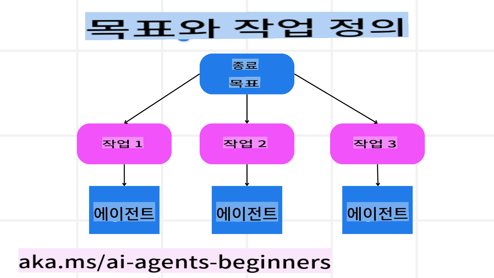

<!--
CO_OP_TRANSLATOR_METADATA:
{
  "original_hash": "8dd9a05d4dc18d3ff510e68e3798a080",
  "translation_date": "2025-03-28T13:48:09+00:00",
  "source_file": "07-planning-design\\README.md",
  "language_code": "ko"
}
-->
[](https://youtu.be/kPfJ2BrBCMY?si=9pYpPXp0sSbK91Dr)

> _(위 이미지를 클릭하면 해당 강의 영상을 볼 수 있습니다)_

# 계획 설계

## 소개

이 강의에서는 다음 내용을 다룹니다:

* 명확한 목표를 정의하고 복잡한 작업을 관리 가능한 작업으로 나누는 방법.
* 구조화된 출력을 활용하여 더 신뢰할 수 있고 기계가 읽을 수 있는 응답 생성.
* 이벤트 중심 접근 방식을 적용해 동적인 작업과 예기치 못한 입력을 처리하는 방법.

## 학습 목표

이 강의를 완료한 후, 다음에 대한 이해를 갖게 됩니다:

* AI 에이전트를 위한 명확한 목표를 설정하고, 달성해야 할 내용을 명확히 알게 하기.
* 복잡한 작업을 관리 가능한 하위 작업으로 나누고 이를 논리적인 순서로 구성하기.
* 적합한 도구(예: 검색 도구나 데이터 분석 도구)를 에이전트에 제공하고, 이를 언제 어떻게 사용할지 결정하며, 발생하는 예기치 못한 상황 처리.
* 하위 작업의 결과를 평가하고, 성과를 측정하며, 최종 결과를 개선하기 위해 행동을 반복적으로 수정하기.

## 전체 목표 정의 및 작업 분해



대부분의 현실 세계 작업은 한 번에 처리하기엔 너무 복잡합니다. AI 에이전트는 계획과 행동을 안내할 간결한 목표가 필요합니다. 예를 들어, 다음과 같은 목표를 생각해 보세요:

    "3일간의 여행 일정표를 생성하세요."

이 목표는 간단히 표현되지만, 여전히 세부적으로 다듬어야 합니다. 목표가 명확할수록 에이전트(및 인간 협력자)가 올바른 결과를 얻는 데 더 집중할 수 있습니다. 예를 들어, 항공편 옵션, 호텔 추천, 활동 제안을 포함한 포괄적인 일정표를 생성하는 것이 좋은 목표입니다.

### 작업 분해

크거나 복잡한 작업은 더 작고 목표 지향적인 하위 작업으로 나누면 더 관리하기 쉬워집니다.  
여행 일정표 예시의 경우, 목표를 다음과 같이 분해할 수 있습니다:

* 항공편 예약
* 호텔 예약
* 렌터카 예약
* 개인화

각 하위 작업은 전담 에이전트나 프로세스가 처리할 수 있습니다. 한 에이전트는 최적의 항공권을 검색하는 데 특화되고, 다른 에이전트는 호텔 예약에 집중하는 식입니다. 이후, 조정 역할을 하는 에이전트나 "다운스트림" 에이전트가 이러한 결과를 통합하여 최종 사용자에게 하나의 완성된 일정표로 제공합니다.

이 모듈형 접근법은 점진적 개선도 가능하게 합니다. 예를 들어, 음식 추천이나 현지 활동 제안에 특화된 에이전트를 추가하여 일정표를 점점 더 정교하게 만들 수 있습니다.

### 구조화된 출력

대규모 언어 모델(LLM)은 다운스트림 에이전트나 서비스가 더 쉽게 구문 분석하고 처리할 수 있는 구조화된 출력(예: JSON)을 생성할 수 있습니다. 이는 특히 계획 출력이 수신된 후 작업을 실행할 수 있는 다중 에이전트 환경에서 유용합니다. 간단한 개요는 다음과 같습니다.

다음 Python 코드 스니펫은 목표를 하위 작업으로 분해하고 구조화된 계획을 생성하는 간단한 계획 에이전트를 보여줍니다:

```python
from pydantic import BaseModel
from enum import Enum
from typing import List, Optional, Union
import json
import os
from typing import Optional
from pprint import pprint
from autogen_core.models import UserMessage, SystemMessage, AssistantMessage
from autogen_ext.models.azure import AzureAIChatCompletionClient
from azure.core.credentials import AzureKeyCredential

class AgentEnum(str, Enum):
    FlightBooking = "flight_booking"
    HotelBooking = "hotel_booking"
    CarRental = "car_rental"
    ActivitiesBooking = "activities_booking"
    DestinationInfo = "destination_info"
    DefaultAgent = "default_agent"
    GroupChatManager = "group_chat_manager"

# Travel SubTask Model
class TravelSubTask(BaseModel):
    task_details: str
    assigned_agent: AgentEnum  # we want to assign the task to the agent

class TravelPlan(BaseModel):
    main_task: str
    subtasks: List[TravelSubTask]
    is_greeting: bool

client = AzureAIChatCompletionClient(
    model="gpt-4o-mini",
    endpoint="https://models.inference.ai.azure.com",
    # To authenticate with the model you will need to generate a personal access token (PAT) in your GitHub settings.
    # Create your PAT token by following instructions here: https://docs.github.com/en/authentication/keeping-your-account-and-data-secure/managing-your-personal-access-tokens
    credential=AzureKeyCredential(os.environ["GITHUB_TOKEN"]),
    model_info={
        "json_output": False,
        "function_calling": True,
        "vision": True,
        "family": "unknown",
    },
)

# Define the user message
messages = [
    SystemMessage(content="""You are an planner agent.
    Your job is to decide which agents to run based on the user's request.
                      Provide your response in JSON format with the following structure:
{'main_task': 'Plan a family trip from Singapore to Melbourne.',
 'subtasks': [{'assigned_agent': 'flight_booking',
               'task_details': 'Book round-trip flights from Singapore to '
                               'Melbourne.'}
    Below are the available agents specialised in different tasks:
    - FlightBooking: For booking flights and providing flight information
    - HotelBooking: For booking hotels and providing hotel information
    - CarRental: For booking cars and providing car rental information
    - ActivitiesBooking: For booking activities and providing activity information
    - DestinationInfo: For providing information about destinations
    - DefaultAgent: For handling general requests""", source="system"),
    UserMessage(
        content="Create a travel plan for a family of 2 kids from Singapore to Melboune", source="user"),
]

response = await client.create(messages=messages, extra_create_args={"response_format": 'json_object'})

response_content: Optional[str] = response.content if isinstance(
    response.content, str) else None
if response_content is None:
    raise ValueError("Response content is not a valid JSON string" )

pprint(json.loads(response_content))

# # Ensure the response content is a valid JSON string before loading it
# response_content: Optional[str] = response.content if isinstance(
#     response.content, str) else None
# if response_content is None:
#     raise ValueError("Response content is not a valid JSON string")

# # Print the response content after loading it as JSON
# pprint(json.loads(response_content))

# Validate the response content with the MathReasoning model
# TravelPlan.model_validate(json.loads(response_content))
```

### 다중 에이전트 조정이 가능한 계획 에이전트

이 예에서는 Semantic Router Agent가 사용자 요청(예: "여행을 위한 호텔 계획이 필요합니다.")을 수신합니다.

플래너는 다음을 수행합니다:

* 호텔 계획 수신: 플래너는 사용자의 메시지를 수신하고, 시스템 프롬프트(사용 가능한 에이전트 정보 포함)를 기반으로 구조화된 여행 계획을 생성합니다.
* 에이전트 및 도구 목록 작성: 에이전트 레지스트리는 항공편, 호텔, 렌터카, 활동과 같은 작업을 수행하는 에이전트와 해당 기능 또는 도구 목록을 보유합니다.
* 계획을 해당 에이전트에 라우팅: 하위 작업 수에 따라, 플래너는 메시지를 단일 작업 시나리오에서는 전용 에이전트에 직접 보내거나, 다중 에이전트 협업을 위해 그룹 채팅 관리자를 통해 조정합니다.
* 결과 요약: 마지막으로, 플래너는 생성된 계획을 명확히 요약합니다.  
다음 Python 코드 샘플은 이러한 단계를 보여줍니다:

```python

from pydantic import BaseModel

from enum import Enum
from typing import List, Optional, Union

class AgentEnum(str, Enum):
    FlightBooking = "flight_booking"
    HotelBooking = "hotel_booking"
    CarRental = "car_rental"
    ActivitiesBooking = "activities_booking"
    DestinationInfo = "destination_info"
    DefaultAgent = "default_agent"
    GroupChatManager = "group_chat_manager"

# Travel SubTask Model

class TravelSubTask(BaseModel):
    task_details: str
    assigned_agent: AgentEnum # we want to assign the task to the agent

class TravelPlan(BaseModel):
    main_task: str
    subtasks: List[TravelSubTask]
    is_greeting: bool
import json
import os
from typing import Optional

from autogen_core.models import UserMessage, SystemMessage, AssistantMessage
from autogen_ext.models.openai import AzureOpenAIChatCompletionClient

# Create the client with type-checked environment variables

client = AzureOpenAIChatCompletionClient(
    azure_deployment=os.getenv("AZURE_OPENAI_DEPLOYMENT_NAME"),
    model=os.getenv("AZURE_OPENAI_DEPLOYMENT_NAME"),
    api_version=os.getenv("AZURE_OPENAI_API_VERSION"),
    azure_endpoint=os.getenv("AZURE_OPENAI_ENDPOINT"),
    api_key=os.getenv("AZURE_OPENAI_API_KEY"),
)

from pprint import pprint

# Define the user message

messages = [
    SystemMessage(content="""You are an planner agent.
    Your job is to decide which agents to run based on the user's request.
    Below are the available agents specialized in different tasks:
    - FlightBooking: For booking flights and providing flight information
    - HotelBooking: For booking hotels and providing hotel information
    - CarRental: For booking cars and providing car rental information
    - ActivitiesBooking: For booking activities and providing activity information
    - DestinationInfo: For providing information about destinations
    - DefaultAgent: For handling general requests""", source="system"),
    UserMessage(content="Create a travel plan for a family of 2 kids from Singapore to Melbourne", source="user"),
]

response = await client.create(messages=messages, extra_create_args={"response_format": TravelPlan})

# Ensure the response content is a valid JSON string before loading it

response_content: Optional[str] = response.content if isinstance(response.content, str) else None
if response_content is None:
    raise ValueError("Response content is not a valid JSON string")

# Print the response content after loading it as JSON

pprint(json.loads(response_content))
```

이전 코드에서 생성된 출력은 구조화된 출력으로, 이를 `assigned_agent`로 라우팅하고 최종 사용자에게 여행 계획을 요약하는 데 사용할 수 있습니다.

```json
{
    "is_greeting": "False",
    "main_task": "Plan a family trip from Singapore to Melbourne.",
    "subtasks": [
        {
            "assigned_agent": "flight_booking",
            "task_details": "Book round-trip flights from Singapore to Melbourne."
        },
        {
            "assigned_agent": "hotel_booking",
            "task_details": "Find family-friendly hotels in Melbourne."
        },
        {
            "assigned_agent": "car_rental",
            "task_details": "Arrange a car rental suitable for a family of four in Melbourne."
        },
        {
            "assigned_agent": "activities_booking",
            "task_details": "List family-friendly activities in Melbourne."
        },
        {
            "assigned_agent": "destination_info",
            "task_details": "Provide information about Melbourne as a travel destination."
        }
    ]
}
```

이전 코드 샘플이 포함된 예제 노트북은 [여기](../../../07-planning-design/07-autogen.ipynb)에서 확인할 수 있습니다.

### 반복 계획

일부 작업은 상호작용이나 재계획이 필요하며, 한 하위 작업의 결과가 다음 작업에 영향을 미칠 수 있습니다. 예를 들어, 에이전트가 항공편 예약 중 예상치 못한 데이터 형식을 발견하면, 호텔 예약으로 넘어가기 전에 전략을 조정해야 할 수도 있습니다.

또한, 사용자 피드백(예: 사용자가 더 이른 항공편을 선호한다고 결정하는 경우)은 부분적인 재계획을 유발할 수 있습니다. 이러한 동적이고 반복적인 접근 방식은 최종 솔루션이 현실적인 제약 조건과 변화하는 사용자 선호도에 부합하도록 보장합니다.

예: 샘플 코드

```python
from autogen_core.models import UserMessage, SystemMessage, AssistantMessage
#.. same as previous code and pass on the user history, current plan
messages = [
    SystemMessage(content="""You are a planner agent to optimize the
    Your job is to decide which agents to run based on the user's request.
    Below are the available agents specialized in different tasks:
    - FlightBooking: For booking flights and providing flight information
    - HotelBooking: For booking hotels and providing hotel information
    - CarRental: For booking cars and providing car rental information
    - ActivitiesBooking: For booking activities and providing activity information
    - DestinationInfo: For providing information about destinations
    - DefaultAgent: For handling general requests""", source="system"),
    UserMessage(content="Create a travel plan for a family of 2 kids from Singapore to Melbourne", source="user"),
    AssistantMessage(content=f"Previous travel plan - {TravelPlan}", source="assistant")
]
# .. re-plan and send the tasks to respective agents
```

더 포괄적인 계획을 위해 Magnetic One을 확인해 보세요.

## 요약

이 기사에서는 사용 가능한 에이전트를 동적으로 선택할 수 있는 플래너를 만드는 방법에 대해 살펴보았습니다. 플래너의 출력은 작업을 분해하고 에이전트를 할당하여 실행할 수 있도록 합니다. 에이전트는 작업 수행에 필요한 함수/도구에 접근할 수 있다고 가정합니다. 에이전트 외에도 반영, 요약, 라운드 로빈 채팅과 같은 다른 패턴을 추가하여 더욱 맞춤화할 수 있습니다.

## 추가 자료

* AutoGen Magnetic One - 복잡한 작업을 해결하기 위한 일반적인 다중 에이전트 시스템으로, 여러 도전적인 에이전트 벤치마크에서 놀라운 결과를 달성했습니다. 참고 자료:

. 이 구현에서 오케스트레이터는 작업별 계획을 생성하고 이러한 작업을 사용 가능한 에이전트에 위임합니다. 오케스트레이터는 계획뿐만 아니라 작업 진행 상황을 모니터링하고 필요시 재계획하는 추적 메커니즘도 사용합니다.

## 이전 강의

[신뢰할 수 있는 AI 에이전트 구축](../06-building-trustworthy-agents/README.md)

## 다음 강의

[다중 에이전트 설계 패턴](../08-multi-agent/README.md)

**면책 조항**:  
이 문서는 AI 번역 서비스 [Co-op Translator](https://github.com/Azure/co-op-translator)를 사용하여 번역되었습니다. 정확성을 위해 최선을 다하고 있으나, 자동 번역은 오류나 부정확성을 포함할 수 있음을 유의하시기 바랍니다. 원본 문서(원어로 작성된 문서)가 권위 있는 자료로 간주되어야 합니다. 중요한 정보의 경우, 전문적인 인간 번역을 권장합니다. 이 번역 사용으로 인해 발생하는 오해나 잘못된 해석에 대해 당사는 책임을 지지 않습니다.