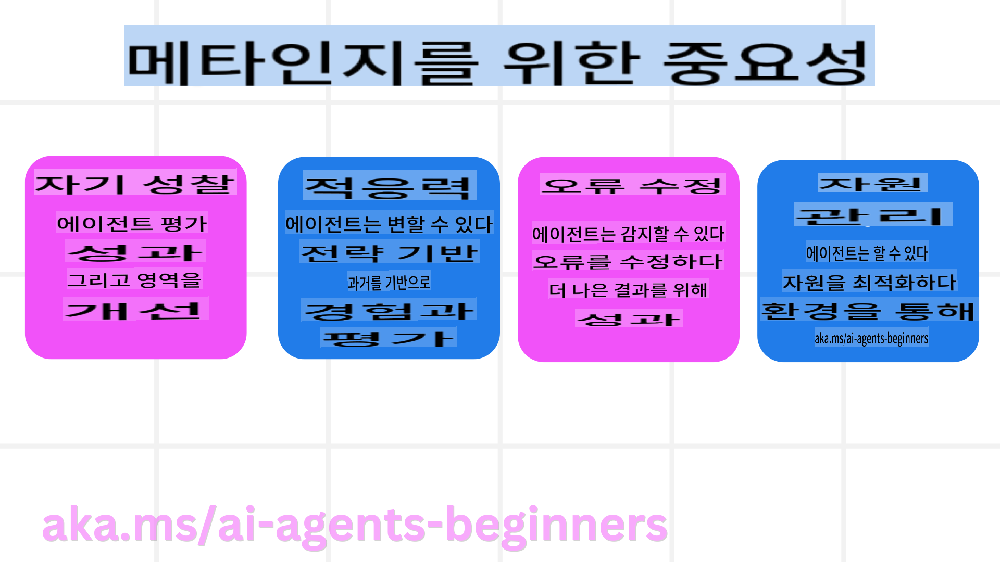

# AI 에이전트의 메타인지  
## 소개  
AI 에이전트의 메타인지에 대한 수업에 오신 것을 환영합니다! 이 장은 AI 에이전트가 자신의 사고 과정을 어떻게 인식하고 평가할 수 있는지 궁금해하는 초보자를 위해 설계되었습니다. 이 수업이 끝날 때쯤에는 주요 개념을 이해하고 AI 에이전트 설계에 메타인지를 적용할 수 있는 실용적인 예제를 갖추게 될 것입니다.  

## 학습 목표  
이 수업을 완료한 후, 다음을 할 수 있습니다:  
1. 에이전트 정의에서 추론 루프의 의미를 이해합니다.  
2. 자기 수정 에이전트를 돕기 위한 계획 및 평가 기법을 사용합니다.  
3. 작업을 수행하기 위해 코드를 조작할 수 있는 자신만의 에이전트를 만듭니다.  

## 메타인지 소개  
메타인지는 자신의 사고를 생각하는 고차원적인 인지 과정을 의미합니다. AI 에이전트의 경우, 이는 자기 인식과 과거 경험을 기반으로 자신의 행동을 평가하고 조정할 수 있는 능력을 의미합니다.  

### 메타인지란 무엇인가?  
메타인지, 즉 "생각에 대한 생각"은 자기 인식과 자신의 인지 과정을 자기 조절하는 고차원적인 인지 과정입니다. AI 분야에서 메타인지는 에이전트가 전략과 행동을 평가하고 적응할 수 있는 능력을 부여하여 문제 해결 및 의사 결정 능력을 향상시킵니다. 메타인지를 이해함으로써 더 지능적이고 적응 가능하며 효율적인 AI 에이전트를 설계할 수 있습니다.  

### AI 에이전트에서 메타인지의 중요성  
메타인지는 다음과 같은 이유로 AI 에이전트 설계에서 중요한 역할을 합니다:  
  
- **자기 성찰**: 에이전트는 자신의 성과를 평가하고 개선이 필요한 영역을 식별할 수 있습니다.  
- **적응성**: 에이전트는 과거 경험과 변화하는 환경에 따라 전략을 수정할 수 있습니다.  
- **오류 수정**: 에이전트는 오류를 자율적으로 감지하고 수정하여 더 정확한 결과를 제공합니다.  
- **자원 관리**: 에이전트는 행동을 계획하고 평가하여 시간 및 계산 자원과 같은 자원의 사용을 최적화할 수 있습니다.  

## AI 에이전트의 구성 요소  
메타인지 프로세스를 다루기 전에 AI 에이전트의 기본 구성 요소를 이해하는 것이 중요합니다. AI 에이전트는 일반적으로 다음으로 구성됩니다:  
- **페르소나**: 사용자와 상호 작용하는 방식을 정의하는 에이전트의 성격 및 특성.  
- **도구**: 에이전트가 수행할 수 있는 기능 및 능력.  
- **기술**: 에이전트가 보유한 지식과 전문성.  

이 구성 요소는 특정 작업을 수행할 수 있는 "전문성 단위"를 만듭니다.  

**예제**: 여행 에이전트를 고려해 보세요. 이 에이전트는 사용자의 여행 계획을 세울 뿐만 아니라 실시간 데이터 및 과거 고객 경험을 기반으로 경로를 조정합니다.  

### 예제: 여행 에이전트 서비스에서의 메타인지  
AI로 구동되는 여행 에이전트 서비스를 설계한다고 상상해보세요. 이 에이전트, "여행 에이전트,"는 사용자가 휴가를 계획하도록 돕습니다. 메타인지를 통합하기 위해 여행 에이전트는 자기 인식과 과거 경험을 기반으로 자신의 행동을 평가하고 조정해야 합니다.  

#### 현재 작업  
현재 작업은 사용자가 파리로 여행을 계획하도록 돕는 것입니다.  

#### 작업 완료 단계  
1. **사용자 선호 수집**: 사용자에게 여행 날짜, 예산, 관심사(예: 박물관, 요리, 쇼핑), 특정 요구 사항에 대해 묻습니다.  
2. **정보 검색**: 사용자의 선호에 맞는 항공편 옵션, 숙박 시설, 관광 명소 및 레스토랑을 검색합니다.  
3. **추천 생성**: 항공편 세부 정보, 호텔 예약 및 제안된 활동이 포함된 개인 맞춤형 일정표를 제공합니다.  
4. **피드백에 따라 조정**: 추천에 대한 사용자 피드백을 요청하고 필요한 조정을 합니다.  

#### 필요한 자원  
- 항공편 및 호텔 예약 데이터베이스에 대한 액세스.  
- 파리 관광 명소 및 레스토랑에 대한 정보.  
- 이전 상호작용에서의 사용자 피드백 데이터.  

#### 경험 및 자기 성찰  
여행 에이전트는 성과를 평가하고 과거 경험에서 학습하기 위해 메타인지를 사용합니다. 예를 들어:  
1. **사용자 피드백 분석**: 여행 에이전트는 사용자가 긍정적으로 평가한 추천과 그렇지 않은 추천을 검토합니다. 그리고 이를 기반으로 미래의 제안을 조정합니다.  
2. **적응성**: 사용자가 이전에 붐비는 장소를 싫어한다고 언급한 경우, 여행 에이전트는 향후 혼잡한 관광지를 피크 시간대에 추천하지 않습니다.  
3. **오류 수정**: 과거에 예약이 꽉 찬 호텔을 추천하는 오류를 범했다면, 여행 에이전트는 추천을 하기 전에 가용성을 더 철저히 확인하도록 학습합니다.  

#### 실용적인 개발자 예제  
다음은 메타인지를 통합할 때 여행 에이전트 코드가 어떻게 보일 수 있는지에 대한 간단한 예입니다:  
```python
class Travel_Agent:
    def __init__(self):
        self.user_preferences = {}
        self.experience_data = []

    def gather_preferences(self, preferences):
        self.user_preferences = preferences

    def retrieve_information(self):
        # Search for flights, hotels, and attractions based on preferences
        flights = search_flights(self.user_preferences)
        hotels = search_hotels(self.user_preferences)
        attractions = search_attractions(self.user_preferences)
        return flights, hotels, attractions

    def generate_recommendations(self):
        flights, hotels, attractions = self.retrieve_information()
        itinerary = create_itinerary(flights, hotels, attractions)
        return itinerary

    def adjust_based_on_feedback(self, feedback):
        self.experience_data.append(feedback)
        # Analyze feedback and adjust future recommendations
        self.user_preferences = adjust_preferences(self.user_preferences, feedback)

# Example usage
travel_agent = Travel_Agent()
preferences = {
    "destination": "Paris",
    "dates": "2025-04-01 to 2025-04-10",
    "budget": "moderate",
    "interests": ["museums", "cuisine"]
}
travel_agent.gather_preferences(preferences)
itinerary = travel_agent.generate_recommendations()
print("Suggested Itinerary:", itinerary)
feedback = {"liked": ["Louvre Museum"], "disliked": ["Eiffel Tower (too crowded)"]}
travel_agent.adjust_based_on_feedback(feedback)
```  

#### 메타인지가 중요한 이유  
- **자기 성찰**: 에이전트는 성과를 분석하고 개선이 필요한 영역을 식별할 수 있습니다.  
- **적응성**: 에이전트는 피드백과 변화하는 조건에 따라 전략을 수정할 수 있습니다.  
- **오류 수정**: 에이전트는 자율적으로 실수를 감지하고 수정할 수 있습니다.  
- **자원 관리**: 에이전트는 시간 및 계산 자원과 같은 자원의 사용을 최적화할 수 있습니다.  

메타인지를 통합함으로써, 여행 에이전트는 더 개인화되고 정확한 여행 추천을 제공하여 전체 사용자 경험을 향상시킬 수 있습니다.  

---  

## 2. 에이전트의 계획  
계획은 AI 에이전트 행동의 중요한 구성 요소입니다. 계획에는 현재 상태, 자원 및 가능한 장애물을 고려하여 목표를 달성하기 위한 단계를 개략적으로 설명하는 것이 포함됩니다.  

### 계획의 요소  
- **현재 작업**: 작업을 명확히 정의합니다.  
- **작업 완료 단계**: 작업을 관리 가능한 단계로 세분화합니다.  
- **필요한 자원**: 필요한 자원을 식별합니다.  
- **경험**: 계획을 알리기 위해 과거 경험을 활용합니다.  

**예제**: 여행 에이전트가 사용자의 여행 계획을 효과적으로 돕기 위해 수행해야 하는 단계는 다음과 같습니다:  

### 여행 에이전트를 위한 단계  
1. **사용자 선호 수집**  
   - 사용자에게 여행 날짜, 예산, 관심사 및 특정 요구 사항에 대한 세부 정보를 요청합니다.  
   - 예: "언제 여행을 계획 중이신가요?" "예산 범위는 얼마인가요?" "휴가에서 어떤 활동을 즐기시나요?"  
2. **정보 검색**  
   - 사용자 선호를 기반으로 관련 여행 옵션을 검색합니다.  
   - **항공편**: 사용자의 예산 및 선호하는 여행 날짜 내에서 이용 가능한 항공편을 찾습니다.  
   - **숙박 시설**: 위치, 가격, 편의 시설에 대한 사용자의 선호와 일치하는 호텔 또는 렌탈 숙소를 찾습니다.  
   - **관광 명소 및 레스토랑**: 사용자의 관심사에 맞는 인기 관광 명소, 활동 및 식사 옵션을 식별합니다.  
3. **추천 생성**  
   - 검색된 정보를 개인 맞춤형 일정표로 컴파일합니다.  
   - 사용자 선호에 맞게 추천을 조정하여 항공편 옵션, 호텔 예약 및 제안된 활동 세부 정보를 제공합니다.  
4. **일정표를 사용자에게 제시**  
   - 제안된 일정표를 사용자에게 공유하여 검토를 요청합니다.  
   - 예: "여기 파리 여행을 위한 제안된 일정표가 있습니다. 항공편 세부 정보, 호텔 예약 및 추천 활동 목록이 포함되어 있습니다. 의견을 알려주세요!"  
5. **피드백 수집**  
   - 제안된 일정표에 대한 사용자 피드백을 요청합니다.  
   - 예: "항공편 옵션이 마음에 드시나요?" "호텔이 필요에 적합한가요?" "추가하거나 제거하고 싶은 활동이 있나요?"  
6. **피드백에 따라 조정**  
   - 사용자의 피드백을 기반으로 일정표를 수정합니다.  
   - 사용자 선호에 더 잘 맞도록 항공편, 숙박 및 활동 추천을 변경합니다.  
7. **최종 확인**  
   - 업데이트된 일정표를 사용자에게 최종 확인을 위해 제시합니다.  
   - 예: "피드백을 기반으로 조정을 완료했습니다. 업데이트된 일정표입니다. 모두 괜찮으신가요?"  
8. **예약 및 확인**  
   - 사용자가 일정표를 승인하면 항공편, 숙박 시설 및 사전 계획된 활동 예약을 진행합니다.  
   - 확인 세부 정보를 사용자에게 보냅니다.  
9. **지속적인 지원 제공**  
   - 여행 전후에 사용자의 변경 요청이나 추가 요청을 돕기 위해 대기합니다.  
   - 예: "여행 중 추가 도움이 필요하시면 언제든지 연락 주세요!"  

### 예제 상호작용  
```python
class Travel_Agent:
    def __init__(self):
        self.user_preferences = {}
        self.experience_data = []

    def gather_preferences(self, preferences):
        self.user_preferences = preferences

    def retrieve_information(self):
        flights = search_flights(self.user_preferences)
        hotels = search_hotels(self.user_preferences)
        attractions = search_attractions(self.user_preferences)
        return flights, hotels, attractions

    def generate_recommendations(self):
        flights, hotels, attractions = self.retrieve_information()
        itinerary = create_itinerary(flights, hotels, attractions)
        return itinerary

    def adjust_based_on_feedback(self, feedback):
        self.experience_data.append(feedback)
        self.user_preferences = adjust_preferences(self.user_preferences, feedback)

# Example usage within a booing request
travel_agent = Travel_Agent()
preferences = {
    "destination": "Paris",
    "dates": "2025-04-01 to 2025-04-10",
    "budget": "moderate",
    "interests": ["museums", "cuisine"]
}
travel_agent.gather_preferences(preferences)
itinerary = travel_agent.generate_recommendations()
print("Suggested Itinerary:", itinerary)
feedback = {"liked": ["Louvre Museum"], "disliked": ["Eiffel Tower (too crowded)"]}
travel_agent.adjust_based_on_feedback(feedback)
```  
```  
```markdown
여행 에이전트는 사용자 피드백을 기반으로 새로운 검색 쿼리를 작성합니다.  
- 예: ```python
       if "disliked" in feedback:
           preferences["avoid"] = feedback["disliked"]
       ```  
- **도구**: 여행 에이전트는 알고리즘을 사용하여 새로운 검색 결과를 순위 매기고 필터링하며, 사용자 피드백을 기반으로 관련성을 강조합니다.  
- 예: ```python
       new_attractions = search_attractions(preferences)
       new_itinerary = create_itinerary(flights, hotels, new_attractions)
       print("Updated Itinerary:", new_itinerary)
       ```  
- **평가**: 여행 에이전트는 사용자 피드백을 분석하고 필요한 조정을 수행하여 추천의 관련성과 정확성을 지속적으로 평가합니다.  
- 예: ```python
       def adjust_preferences(preferences, feedback):
           if "liked" in feedback:
               preferences["favorites"] = feedback["liked"]
           if "disliked" in feedback:
               preferences["avoid"] = feedback["disliked"]
           return preferences

       preferences = adjust_preferences(preferences, feedback)
       ```  

#### 실용적인 예  
다음은 여행 에이전트에서 Corrective RAG 접근 방식을 통합한 간단한 Python 코드 예제입니다:  
```python
class Travel_Agent:
    def __init__(self):
        self.user_preferences = {}
        self.experience_data = []

    def gather_preferences(self, preferences):
        self.user_preferences = preferences

    def retrieve_information(self):
        flights = search_flights(self.user_preferences)
        hotels = search_hotels(self.user_preferences)
        attractions = search_attractions(self.user_preferences)
        return flights, hotels, attractions

    def generate_recommendations(self):
        flights, hotels, attractions = self.retrieve_information()
        itinerary = create_itinerary(flights, hotels, attractions)
        return itinerary

    def adjust_based_on_feedback(self, feedback):
        self.experience_data.append(feedback)
        self.user_preferences = adjust_preferences(self.user_preferences, feedback)
        new_itinerary = self.generate_recommendations()
        return new_itinerary

# Example usage
travel_agent = Travel_Agent()
preferences = {
    "destination": "Paris",
    "dates": "2025-04-01 to 2025-04-10",
    "budget": "moderate",
    "interests": ["museums", "cuisine"]
}
travel_agent.gather_preferences(preferences)
itinerary = travel_agent.generate_recommendations()
print("Suggested Itinerary:", itinerary)
feedback = {"liked": ["Louvre Museum"], "disliked": ["Eiffel Tower (too crowded)"]}
new_itinerary = travel_agent.adjust_based_on_feedback(feedback)
print("Updated Itinerary:", new_itinerary)
```  

### 사전 컨텍스트 로드  
사전 컨텍스트 로드는 쿼리를 처리하기 전에 관련 컨텍스트 또는 배경 정보를 모델에 로드하는 것을 포함합니다. 이는 모델이 프로세스 중에 추가 데이터를 검색할 필요 없이 더 많은 정보를 바탕으로 응답을 생성할 수 있도록 도와줍니다.  

다음은 Python에서 여행 에이전트 애플리케이션에 사전 컨텍스트 로드를 구현하는 간단한 예입니다:  
```python
class TravelAgent:
    def __init__(self):
        # Pre-load popular destinations and their information
        self.context = {
            "Paris": {"country": "France", "currency": "Euro", "language": "French", "attractions": ["Eiffel Tower", "Louvre Museum"]},
            "Tokyo": {"country": "Japan", "currency": "Yen", "language": "Japanese", "attractions": ["Tokyo Tower", "Shibuya Crossing"]},
            "New York": {"country": "USA", "currency": "Dollar", "language": "English", "attractions": ["Statue of Liberty", "Times Square"]},
            "Sydney": {"country": "Australia", "currency": "Dollar", "language": "English", "attractions": ["Sydney Opera House", "Bondi Beach"]}
        }

    def get_destination_info(self, destination):
        # Fetch destination information from pre-loaded context
        info = self.context.get(destination)
        if info:
            return f"{destination}:\nCountry: {info['country']}\nCurrency: {info['currency']}\nLanguage: {info['language']}\nAttractions: {', '.join(info['attractions'])}"
        else:
            return f"Sorry, we don't have information on {destination}."

# Example usage
travel_agent = TravelAgent()
print(travel_agent.get_destination_info("Paris"))
print(travel_agent.get_destination_info("Tokyo"))
```  

#### 설명  
1. **초기화 (`__init__` method)**: The `TravelAgent` class pre-loads a dictionary containing information about popular destinations such as Paris, Tokyo, New York, and Sydney. This dictionary includes details like the country, currency, language, and major attractions for each destination.

2. **Retrieving Information (`get_destination_info` method)**: When a user queries about a specific destination, the `get_destination_info` 메서드)**: 이 메서드는 미리 로드된 컨텍스트 사전에서 관련 정보를 검색합니다. 컨텍스트를 미리 로드함으로써, 여행 에이전트 애플리케이션은 실시간으로 외부 소스에서 이 정보를 검색할 필요 없이 사용자 쿼리에 빠르게 응답할 수 있습니다. 이는 애플리케이션을 더 효율적이고 응답성이 높게 만듭니다.  

### 목표를 설정한 계획 부트스트래핑 후 반복  
목표를 설정한 계획 부트스트래핑은 명확한 목표 또는 원하는 결과를 염두에 두고 시작하는 것을 포함합니다. 이 목표를 사전에 정의함으로써, 모델은 반복 과정 내내 이를 안내 원칙으로 사용할 수 있습니다. 이는 각 반복이 원하는 결과 달성에 한 걸음 더 가까워지도록 보장하여 프로세스를 더 효율적이고 집중되게 만듭니다.  

다음은 Python에서 여행 에이전트에 대해 목표를 설정한 여행 계획을 부트스트래핑하는 예입니다:  

### 시나리오  
여행 에이전트는 고객을 위해 맞춤형 휴가를 계획하려고 합니다. 목표는 고객의 선호도와 예산을 기반으로 고객 만족도를 극대화하는 여행 일정을 만드는 것입니다.  

### 단계  
1. 고객의 선호도와 예산을 정의합니다.  
2. 이러한 선호도를 기반으로 초기 계획을 부트스트래핑합니다.  
3. 고객의 만족도를 최적화하기 위해 계획을 반복적으로 개선합니다.  

#### Python 코드  
```python
class TravelAgent:
    def __init__(self, destinations):
        self.destinations = destinations

    def bootstrap_plan(self, preferences, budget):
        plan = []
        total_cost = 0

        for destination in self.destinations:
            if total_cost + destination['cost'] <= budget and self.match_preferences(destination, preferences):
                plan.append(destination)
                total_cost += destination['cost']

        return plan

    def match_preferences(self, destination, preferences):
        for key, value in preferences.items():
            if destination.get(key) != value:
                return False
        return True

    def iterate_plan(self, plan, preferences, budget):
        for i in range(len(plan)):
            for destination in self.destinations:
                if destination not in plan and self.match_preferences(destination, preferences) and self.calculate_cost(plan, destination) <= budget:
                    plan[i] = destination
                    break
        return plan

    def calculate_cost(self, plan, new_destination):
        return sum(destination['cost'] for destination in plan) + new_destination['cost']

# Example usage
destinations = [
    {"name": "Paris", "cost": 1000, "activity": "sightseeing"},
    {"name": "Tokyo", "cost": 1200, "activity": "shopping"},
    {"name": "New York", "cost": 900, "activity": "sightseeing"},
    {"name": "Sydney", "cost": 1100, "activity": "beach"},
]

preferences = {"activity": "sightseeing"}
budget = 2000

travel_agent = TravelAgent(destinations)
initial_plan = travel_agent.bootstrap_plan(preferences, budget)
print("Initial Plan:", initial_plan)

refined_plan = travel_agent.iterate_plan(initial_plan, preferences, budget)
print("Refined Plan:", refined_plan)
```  

#### 코드 설명  
1. **초기화 (`__init__` method)**: The `TravelAgent` class is initialized with a list of potential destinations, each having attributes like name, cost, and activity type.

2. **Bootstrapping the Plan (`bootstrap_plan` method)**: This method creates an initial travel plan based on the client's preferences and budget. It iterates through the list of destinations and adds them to the plan if they match the client's preferences and fit within the budget.

3. **Matching Preferences (`match_preferences` method)**: This method checks if a destination matches the client's preferences.

4. **Iterating the Plan (`iterate_plan` method)**: This method refines the initial plan by trying to replace each destination in the plan with a better match, considering the client's preferences and budget constraints.

5. **Calculating Cost (`calculate_cost` 메서드)**: 이 메서드는 현재 계획의 총 비용(새로운 목적지를 포함할 수 있음)을 계산합니다.  

#### 예제 사용법  
- **초기 계획**: 여행 에이전트는 고객의 관광 선호도와 $2000의 예산을 기반으로 초기 계획을 생성합니다.  
- **개선된 계획**: 여행 에이전트는 계획을 반복적으로 개선하여 고객의 선호도와 예산을 최적화합니다.  

목표(예: 고객 만족 극대화)를 명확히 설정한 상태에서 계획을 부트스트래핑하고 이를 개선하기 위해 반복함으로써, 여행 에이전트는 고객을 위한 맞춤형 최적화된 여행 일정을 생성할 수 있습니다. 이 접근 방식은 여행 계획이 처음부터 고객의 선호도와 예산에 부합하도록 보장하며, 각 반복마다 개선됩니다.  

### LLM을 활용한 재순위 매기기 및 점수화  
대규모 언어 모델(LLM)은 검색된 문서나 생성된 응답의 관련성과 품질을 평가하여 재순위 매기기 및 점수화에 사용될 수 있습니다. 다음은 그 작동 방식입니다:  

**검색:** 초기 검색 단계는 쿼리를 기반으로 후보 문서나 응답 세트를 가져옵니다.  
**재순위 매기기:** LLM은 이러한 후보를 평가하고 관련성과 품질에 따라 재순위를 매깁니다. 이 단계는 가장 관련성이 높고 품질이 좋은 정보가 먼저 제공되도록 보장합니다.  
**점수화:** LLM은 각 후보에게 관련성과 품질을 반영하는 점수를 할당합니다. 이는 사용자에게 가장 적합한 응답이나 문서를 선택하는 데 도움을 줍니다.  

LLM을 재순위 매기기 및 점수화에 활용함으로써 시스템은 더 정확하고 맥락적으로 관련성 있는 정보를 제공하여 전체 사용자 경험을 개선할 수 있습니다.  

다음은 여행 에이전트가 사용자 선호도를 기반으로 여행지를 재순위 매기고 점수화하기 위해 대규모 언어 모델(LLM)을 사용하는 방법의 예입니다:  

#### 시나리오 - 선호도 기반 여행  
여행 에이전트는 사용자 선호도를 기반으로 고객에게 최고의 여행지를 추천하고자 합니다. LLM은 여행지를 재순위 매기고 점수화하여 가장 관련성 높은 옵션을 제공하도록 도와줍니다.  

#### 단계:  
1. 사용자 선호도를 수집합니다.  
2. 잠재적인 여행지 목록을 검색합니다.  
3. LLM을 사용하여 사용자 선호도를 기반으로 여행지를 재순위 매기고 점수화합니다.  

Azure OpenAI 서비스를 사용하여 이전 예제를 업데이트하는 방법은 다음과 같습니다:  

#### 요구 사항  
1. Azure 구독이 필요합니다.  
2. Azure OpenAI 리소스를 생성하고 API 키를 가져옵니다.  

#### Python 코드 예제  
```python
import requests
import json

class TravelAgent:
    def __init__(self, destinations):
        self.destinations = destinations

    def get_recommendations(self, preferences, api_key, endpoint):
        # Generate a prompt for the Azure OpenAI
        prompt = self.generate_prompt(preferences)
        
        # Define headers and payload for the request
        headers = {
            'Content-Type': 'application/json',
            'Authorization': f'Bearer {api_key}'
        }
        payload = {
            "prompt": prompt,
            "max_tokens": 150,
            "temperature": 0.7
        }
        
        # Call the Azure OpenAI API to get the re-ranked and scored destinations
        response = requests.post(endpoint, headers=headers, json=payload)
        response_data = response.json()
        
        # Extract and return the recommendations
        recommendations = response_data['choices'][0]['text'].strip().split('\n')
        return recommendations

    def generate_prompt(self, preferences):
        prompt = "Here are the travel destinations ranked and scored based on the following user preferences:\n"
        for key, value in preferences.items():
            prompt += f"{key}: {value}\n"
        prompt += "\nDestinations:\n"
        for destination in self.destinations:
            prompt += f"- {destination['name']}: {destination['description']}\n"
        return prompt

# Example usage
destinations = [
    {"name": "Paris", "description": "City of lights, known for its art, fashion, and culture."},
    {"name": "Tokyo", "description": "Vibrant city, famous for its modernity and traditional temples."},
    {"name": "New York", "description": "The city that never sleeps, with iconic landmarks and diverse culture."},
    {"name": "Sydney", "description": "Beautiful harbour city, known for its opera house and stunning beaches."},
]

preferences = {"activity": "sightseeing", "culture": "diverse"}
api_key = 'your_azure_openai_api_key'
endpoint = 'https://your-endpoint.com/openai/deployments/your-deployment-name/completions?api-version=2022-12-01'

travel_agent = TravelAgent(destinations)
recommendations = travel_agent.get_recommendations(preferences, api_key, endpoint)
print("Recommended Destinations:")
for rec in recommendations:
    print(rec)
```  

#### 코드 설명 - 선호도 기반 추천  
1. **초기화**: `TravelAgent` class is initialized with a list of potential travel destinations, each having attributes like name and description.

2. **Getting Recommendations (`get_recommendations` method)**: This method generates a prompt for the Azure OpenAI service based on the user's preferences and makes an HTTP POST request to the Azure OpenAI API to get re-ranked and scored destinations.

3. **Generating Prompt (`generate_prompt` method)**: This method constructs a prompt for the Azure OpenAI, including the user's preferences and the list of destinations. The prompt guides the model to re-rank and score the destinations based on the provided preferences.

4. **API Call**: The `requests` library is used to make an HTTP POST request to the Azure OpenAI API endpoint. The response contains the re-ranked and scored destinations.

5. **Example Usage**: The travel agent collects user preferences (e.g., interest in sightseeing and diverse culture) and uses the Azure OpenAI service to get re-ranked and scored recommendations for travel destinations.

Make sure to replace `your_azure_openai_api_key` with your actual Azure OpenAI API key and `https://your-endpoint.com/...`를 Azure OpenAI 배포의 실제 엔드포인트 URL로 대체합니다.  

LLM을 재순위 매기기 및 점수화에 활용함으로써, 여행 에이전트는 고객에게 더 개인화되고 관련성 높은 여행 추천을 제공하여 전체 경험을 향상시킬 수 있습니다.  
```
```markdown
파리 최고의 박물관?"). - **탐색 의도**: 사용자가 특정 웹사이트나 페이지로 이동하려고 함 (예: "루브르 박물관 공식 웹사이트"). - **거래 의도**: 사용자가 항공편 예약 또는 구매와 같은 거래를 수행하려고 함 (예: "파리행 항공편 예약"). 2. **컨텍스트 인식**: - 사용자의 쿼리 컨텍스트를 분석하면 의도를 정확하게 식별하는 데 도움이 됨. 여기에는 이전 상호작용, 사용자 선호도, 현재 쿼리의 세부 정보가 포함됨. 3. **자연어 처리 (NLP)**: - NLP 기술을 사용하여 사용자가 제공한 자연어 쿼리를 이해하고 해석함. 여기에는 엔터티 인식, 감정 분석, 쿼리 구문 분석과 같은 작업이 포함됨. 4. **개인화**: - 사용자의 기록, 선호도, 피드백을 기반으로 검색 결과를 개인화하면 검색된 정보의 관련성을 높일 수 있음. #### 실용적인 예: 여행 에이전트에서 의도를 활용한 검색 여행 에이전트를 예로 들어 의도를 활용한 검색이 어떻게 구현될 수 있는지 살펴보자. 1. **사용자 선호도 수집** ```python
   class Travel_Agent:
       def __init__(self):
           self.user_preferences = {}

       def gather_preferences(self, preferences):
           self.user_preferences = preferences
   ``` 2. **사용자 의도 이해** ```python
   def identify_intent(query):
       if "book" in query or "purchase" in query:
           return "transactional"
       elif "website" in query or "official" in query:
           return "navigational"
       else:
           return "informational"
   ``` 3. **컨텍스트 인식** ```python
   def analyze_context(query, user_history):
       # Combine current query with user history to understand context
       context = {
           "current_query": query,
           "user_history": user_history
       }
       return context
   ``` 4. **검색 및 결과 개인화** ```python
   def search_with_intent(query, preferences, user_history):
       intent = identify_intent(query)
       context = analyze_context(query, user_history)
       if intent == "informational":
           search_results = search_information(query, preferences)
       elif intent == "navigational":
           search_results = search_navigation(query)
       elif intent == "transactional":
           search_results = search_transaction(query, preferences)
       personalized_results = personalize_results(search_results, user_history)
       return personalized_results

   def search_information(query, preferences):
       # Example search logic for informational intent
       results = search_web(f"best {preferences['interests']} in {preferences['destination']}")
       return results

   def search_navigation(query):
       # Example search logic for navigational intent
       results = search_web(query)
       return results

   def search_transaction(query, preferences):
       # Example search logic for transactional intent
       results = search_web(f"book {query} to {preferences['destination']}")
       return results

   def personalize_results(results, user_history):
       # Example personalization logic
       personalized = [result for result in results if result not in user_history]
       return personalized[:10]  # Return top 10 personalized results
   ``` 5. **예제 사용법** ```python
   travel_agent = Travel_Agent()
   preferences = {
       "destination": "Paris",
       "interests": ["museums", "cuisine"]
   }
   travel_agent.gather_preferences(preferences)
   user_history = ["Louvre Museum website", "Book flight to Paris"]
   query = "best museums in Paris"
   results = search_with_intent(query, preferences, user_history)
   print("Search Results:", results)
   ``` --- ## 4. 도구로서의 코드 생성 코드 생성 에이전트는 AI 모델을 사용하여 코드를 작성하고 실행하며 복잡한 문제를 해결하고 작업을 자동화함. ### 코드 생성 에이전트 코드 생성 에이전트는 생성적 AI 모델을 사용하여 코드를 작성하고 실행함. 이러한 에이전트는 다양한 프로그래밍 언어로 코드를 생성하고 실행하여 복잡한 문제를 해결하고 작업을 자동화하며 귀중한 통찰력을 제공할 수 있음. #### 실용적인 응용 1. **자동 코드 생성**: 데이터 분석, 웹 스크래핑, 기계 학습과 같은 특정 작업에 대한 코드 스니펫 생성. 2. **RAG로서의 SQL**: 데이터베이스에서 데이터를 검색하고 조작하기 위해 SQL 쿼리를 사용. 3. **문제 해결**: 알고리즘 최적화 또는 데이터 분석과 같은 특정 문제를 해결하기 위해 코드 생성 및 실행. #### 예제: 데이터 분석을 위한 코드 생성 에이전트 데이터 분석을 위한 코드 생성 에이전트를 설계한다고 가정해 보자. 작동 방식은 다음과 같음: 1. **작업**: 데이터셋을 분석하여 트렌드와 패턴을 식별. 2. **단계**: - 데이터셋을 데이터 분석 도구에 로드. - 데이터를 필터링하고 집계하기 위한 SQL 쿼리 생성. - 쿼리를 실행하고 결과를 검색. - 결과를 사용하여 시각화 및 인사이트 생성. 3. **필요한 리소스**: 데이터셋, 데이터 분석 도구, SQL 기능에 대한 접근. 4. **경험**: 이전 분석 결과를 사용하여 향후 분석의 정확성과 관련성을 향상. ### 예제: 여행 에이전트를 위한 코드 생성 에이전트 이번 예제에서는 사용자가 여행을 계획할 수 있도록 코드 생성 및 실행을 통해 지원하는 코드 생성 에이전트인 여행 에이전트를 설계함. 이 에이전트는 항공편 옵션 검색, 결과 필터링, 생성적 AI를 사용한 일정 작성과 같은 작업을 처리할 수 있음. #### 코드 생성 에이전트 개요 1. **사용자 선호도 수집**: 목적지, 여행 날짜, 예산, 관심사 등 사용자 입력을 수집. 2. **데이터 검색을 위한 코드 생성**: 항공편, 호텔, 명소에 대한 데이터를 검색하기 위한 코드 스니펫 생성. 3. **생성된 코드 실행**: 생성된 코드를 실행하여 실시간 정보를 검색. 4. **일정 생성**: 검색된 데이터를 개인화된 여행 계획으로 컴파일. 5. **피드백 기반 조정**: 사용자 피드백을 받고 필요하면 코드를 다시 생성하여 결과를 개선. #### 단계별 구현 1. **사용자 선호도 수집** ```python
   class Travel_Agent:
       def __init__(self):
           self.user_preferences = {}

       def gather_preferences(self, preferences):
           self.user_preferences = preferences
   ``` 2. **데이터 검색을 위한 코드 생성** ```python
   def generate_code_to_fetch_data(preferences):
       # Example: Generate code to search for flights based on user preferences
       code = f"""
       def search_flights():
           import requests
           response = requests.get('https://api.example.com/flights', params={preferences})
           return response.json()
       """
       return code

   def generate_code_to_fetch_hotels(preferences):
       # Example: Generate code to search for hotels
       code = f"""
       def search_hotels():
           import requests
           response = requests.get('https://api.example.com/hotels', params={preferences})
           return response.json()
       """
       return code
   ``` 3. **생성된 코드 실행** ```python
   def execute_code(code):
       # Execute the generated code using exec
       exec(code)
       result = locals()
       return result

   travel_agent = Travel_Agent()
   preferences = {
       "destination": "Paris",
       "dates": "2025-04-01 to 2025-04-10",
       "budget": "moderate",
       "interests": ["museums", "cuisine"]
   }
   travel_agent.gather_preferences(preferences)
   
   flight_code = generate_code_to_fetch_data(preferences)
   hotel_code = generate_code_to_fetch_hotels(preferences)
   
   flights = execute_code(flight_code)
   hotels = execute_code(hotel_code)

   print("Flight Options:", flights)
   print("Hotel Options:", hotels)
   ``` 4. **일정 생성** ```python
   def generate_itinerary(flights, hotels, attractions):
       itinerary = {
           "flights": flights,
           "hotels": hotels,
           "attractions": attractions
       }
       return itinerary

   attractions = search_attractions(preferences)
   itinerary = generate_itinerary(flights, hotels, attractions)
   print("Suggested Itinerary:", itinerary)
   ``` 5. **피드백 기반 조정** ```python
   def adjust_based_on_feedback(feedback, preferences):
       # Adjust preferences based on user feedback
       if "liked" in feedback:
           preferences["favorites"] = feedback["liked"]
       if "disliked" in feedback:
           preferences["avoid"] = feedback["disliked"]
       return preferences

   feedback = {"liked": ["Louvre Museum"], "disliked": ["Eiffel Tower (too crowded)"]}
   updated_preferences = adjust_based_on_feedback(feedback, preferences)
   
   # Regenerate and execute code with updated preferences
   updated_flight_code = generate_code_to_fetch_data(updated_preferences)
   updated_hotel_code = generate_code_to_fetch_hotels(updated_preferences)
   
   updated_flights = execute_code(updated_flight_code)
   updated_hotels = execute_code(updated_hotel_code)
   
   updated_itinerary = generate_itinerary(updated_flights, updated_hotels, attractions)
   print("Updated Itinerary:", updated_itinerary)
   ``` ### 환경 인식 및 추론 활용 테이블 스키마 기반으로 쿼리 생성 프로세스를 개선하기 위해 환경 인식 및 추론을 활용할 수 있음. 다음은 이를 구현하는 방법의 예임: 1. **스키마 이해**: 시스템이 테이블 스키마를 이해하고 이를 쿼리 생성에 반영. 2. **피드백 기반 조정**: 시스템이 피드백을 기반으로 사용자 선호도를 조정하고 스키마의 어떤 필드를 업데이트해야 하는지 추론. 3. **쿼리 생성 및 실행**: 새로운 선호도를 기반으로 업데이트된 항공편 및 호텔 데이터를 검색하기 위해 쿼리를 생성 및 실행. 다음은 이러한 개념을 통합한 업데이트된 Python 코드 예제임: ```python
def adjust_based_on_feedback(feedback, preferences, schema):
    # Adjust preferences based on user feedback
    if "liked" in feedback:
        preferences["favorites"] = feedback["liked"]
    if "disliked" in feedback:
        preferences["avoid"] = feedback["disliked"]
    # Reasoning based on schema to adjust other related preferences
    for field in schema:
        if field in preferences:
            preferences[field] = adjust_based_on_environment(feedback, field, schema)
    return preferences

def adjust_based_on_environment(feedback, field, schema):
    # Custom logic to adjust preferences based on schema and feedback
    if field in feedback["liked"]:
        return schema[field]["positive_adjustment"]
    elif field in feedback["disliked"]:
        return schema[field]["negative_adjustment"]
    return schema[field]["default"]

def generate_code_to_fetch_data(preferences):
    # Generate code to fetch flight data based on updated preferences
    return f"fetch_flights(preferences={preferences})"

def generate_code_to_fetch_hotels(preferences):
    # Generate code to fetch hotel data based on updated preferences
    return f"fetch_hotels(preferences={preferences})"

def execute_code(code):
    # Simulate execution of code and return mock data
    return {"data": f"Executed: {code}"}

def generate_itinerary(flights, hotels, attractions):
    # Generate itinerary based on flights, hotels, and attractions
    return {"flights": flights, "hotels": hotels, "attractions": attractions}

# Example schema
schema = {
    "favorites": {"positive_adjustment": "increase", "negative_adjustment": "decrease", "default": "neutral"},
    "avoid": {"positive_adjustment": "decrease", "negative_adjustment": "increase", "default": "neutral"}
}

# Example usage
preferences = {"favorites": "sightseeing", "avoid": "crowded places"}
feedback = {"liked": ["Louvre Museum"], "disliked": ["Eiffel Tower (too crowded)"]}
updated_preferences = adjust_based_on_feedback(feedback, preferences, schema)

# Regenerate and execute code with updated preferences
updated_flight_code = generate_code_to_fetch_data(updated_preferences)
updated_hotel_code = generate_code_to_fetch_hotels(updated_preferences)

updated_flights = execute_code(updated_flight_code)
updated_hotels = execute_code(updated_hotel_code)

updated_itinerary = generate_itinerary(updated_flights, updated_hotels, feedback["liked"])
print("Updated Itinerary:", updated_itinerary)
``` #### 설명 - 피드백 기반 예약 1. **스키마 인식**: `schema` dictionary defines how preferences should be adjusted based on feedback. It includes fields like `favorites` and `avoid`, with corresponding adjustments.
2. **Adjusting Preferences (`adjust_based_on_feedback` method)**: This method adjusts preferences based on user feedback and the schema.
3. **Environment-Based Adjustments (`adjust_based_on_environment` 메서드)**: 이 메서드는 스키마와 피드백을 기반으로 조정을 맞춤화. 4. **쿼리 생성 및 실행**: 조정된 선호도를 기반으로 업데이트된 항공편 및 호텔 데이터를 검색하기 위한 코드를 생성하고 이러한 쿼리 실행을 시뮬레이션. 5. **일정 생성**: 새로운 항공편, 호텔, 명소 데이터를 기반으로 업데이트된 일정을 생성. 시스템을 환경 인식적으로 만들고 스키마를 기반으로 추론함으로써 더 정확하고 관련성 높은 쿼리를 생성할 수 있으며, 이를 통해 더 나은 여행 추천과 개인화된 사용자 경험을 제공할 수 있음. ### RAG 기법으로서의 SQL 사용 SQL(구조적 질의 언어)은 데이터베이스와 상호작용하기 위한 강력한 도구임. RAG(Retrieval-Augmented Generation) 접근 방식의 일부로 사용될 때, SQL은 데이터베이스에서 관련 데이터를 검색하여 AI 에이전트의 응답 또는 작업을 알리고 생성하는 데 활용될 수 있음. 여행 에이전트의 맥락에서 SQL이 RAG 기법으로 어떻게 사용될 수 있는지 살펴보자. #### 핵심 개념 1. **데이터베이스 상호작용**: - SQL은 데이터베이스를 쿼리하고 관련 정보를 검색하며 데이터를 조작하는 데 사용됨. - 예: 항공편 세부 정보, 호텔 정보, 명소를 여행 데이터베이스에서 검색. 2. **RAG와의 통합**: - SQL 쿼리는 사용자 입력 및 선호도를 기반으로 생성됨. - 검색된 데이터는 개인화된 추천 또는 작업을 생성하는 데 사용됨. 3. **동적 쿼리 생성**: - AI 에이전트는 컨텍스트와 사용자 요구에 따라 동적인 SQL 쿼리를 생성. - 예: 예산, 날짜, 관심사를 기반으로 결과를 필터링하도록 SQL 쿼리를 맞춤화. #### 응용 - **자동 코드 생성**: 특정 작업에 대한 코드 스니펫 생성. - **RAG로서의 SQL**: 데이터를 조작하기 위해 SQL 쿼리를 사용. - **문제 해결**: 문제를 해결하기 위해 코드 생성 및 실행. **예제**: 데이터 분석 에이전트: 1. **작업**: 데이터셋을 분석하여 트렌드 찾기. 2. **단계**: - 데이터셋 로드. - 데이터를 필터링하기 위한 SQL 쿼리 생성. - 쿼리를 실행하고 결과 검색. - 시각화 및 인사이트 생성. 3. **리소스**: 데이터셋 접근, SQL 기능. 4. **경험**: 이전 결과를 사용하여 미래 분석 개선. #### 실용적인 예: 여행 에이전트에서 SQL 사용 1. **사용자 선호도 수집** ```python
   class Travel_Agent:
       def __init__(self):
           self.user_preferences = {}

       def gather_preferences(self, preferences):
           self.user_preferences = preferences
   ``` 2. **SQL 쿼리 생성** ```python
   def generate_sql_query(table, preferences):
       query = f"SELECT * FROM {table} WHERE "
       conditions = []
       for key, value in preferences.items():
           conditions.append(f"{key}='{value}'")
       query += " AND ".join(conditions)
       return query
   ``` 3. **SQL 쿼리 실행** ```python
   import sqlite3

   def execute_sql_query(query, database="travel.db"):
       connection = sqlite3.connect(database)
       cursor = connection.cursor()
       cursor.execute(query)
       results = cursor.fetchall()
       connection.close()
       return results
   ``` 4. **추천 생성** ```python
   def generate_recommendations(preferences):
       flight_query = generate_sql_query("flights", preferences)
       hotel_query = generate_sql_query("hotels", preferences)
       attraction_query = generate_sql_query("attractions", preferences)
       
       flights = execute_sql_query(flight_query)
       hotels = execute_sql_query(hotel_query)
       attractions = execute_sql_query(attraction_query)
       
       itinerary = {
           "flights": flights,
           "hotels": hotels,
           "attractions": attractions
       }
       return itinerary

   travel_agent = Travel_Agent()
   preferences = {
       "destination": "Paris",
       "dates": "2025-04-01 to 2025-04-10",
       "budget": "moderate",
       "interests": ["museums", "cuisine"]
   }
   travel_agent.gather_preferences(preferences)
   itinerary = generate_recommendations(preferences)
   print("Suggested Itinerary:", itinerary)
   ``` #### SQL 쿼리 예제 1. **항공편 쿼리** ```sql
   SELECT * FROM flights WHERE destination='Paris' AND dates='2025-04-01 to 2025-04-10' AND budget='moderate';
   ``` 2. **호텔 쿼리** ```sql
   SELECT * FROM hotels WHERE destination='Paris' AND budget='moderate';
   ``` 3. **명소 쿼리** ```sql
   SELECT * FROM attractions WHERE destination='Paris' AND interests='museums, cuisine';
   ``` SQL을 Retrieval-Augmented Generation(RAG) 기법의 일부로 활용하면 여행 에이전트와 같은 AI 에이전트가 관련 데이터를 동적으로 검색하고 활용하여 정확하고 개인화된 추천을 제공할 수 있음. ### 결론 메타인지(Metacognition)는 AI 에이전트의 기능을 크게 향상시킬 수 있는 강력한 도구임. 메타인지 프로세스를 통합함으로써 더 지능적이고 적응력이 뛰어나며 효율적인 에이전트를 설계할 수 있음. 추가 리소스를 사용하여 AI 에이전트의 메타인지라는 흥미로운 세계를 더 탐구해 보세요.
```

**면책 조항**:  
이 문서는 기계 기반 AI 번역 서비스를 사용하여 번역되었습니다. 정확성을 위해 노력하고 있지만, 자동 번역에는 오류나 부정확성이 포함될 수 있음을 유의하시기 바랍니다. 원어로 작성된 원본 문서를 신뢰할 수 있는 권위 있는 자료로 간주해야 합니다. 중요한 정보의 경우, 전문 번역가에 의한 번역을 권장합니다. 이 번역 사용으로 인해 발생하는 오해나 잘못된 해석에 대해 당사는 책임을 지지 않습니다.