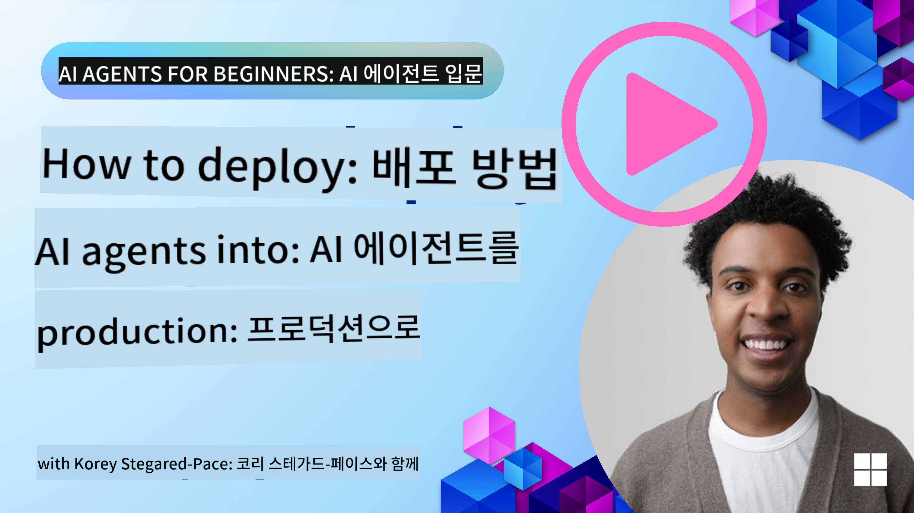

<!--
CO_OP_TRANSLATOR_METADATA:
{
  "original_hash": "44013a98d980c8b92d4b814dc49b545d",
  "translation_date": "2025-03-28T13:55:57+00:00",
  "source_file": "10-ai-agents-production\\README.md",
  "language_code": "ko"
}
-->

> _(위 이미지를 클릭하면 이 강의의 영상을 볼 수 있습니다)_

# 프로덕션에서의 AI 에이전트

## 소개

이번 강의에서는 다음 내용을 다룹니다:

- AI 에이전트를 프로덕션 환경에 효과적으로 배포하는 방법.
- AI 에이전트를 프로덕션에 배포할 때 직면할 수 있는 일반적인 실수와 문제.
- 성능을 유지하면서 비용을 관리하는 방법.

신뢰할 수 있는 AI 에이전트를 배포하는 것이 중요합니다. "신뢰할 수 있는 AI 에이전트 구축" 강의도 확인해보세요.

## 학습 목표

이 강의를 완료한 후, 여러분은 다음을 이해하고 실행할 수 있습니다:

- 프로덕션 AI 에이전트 시스템의 성능, 비용, 효과를 개선하는 기술.
- AI 에이전트를 평가하는 방법과 평가해야 할 요소.
- AI 에이전트를 프로덕션에 배포할 때 비용을 관리하는 방법.

## AI 에이전트 평가하기

AI 에이전트를 배포하기 전, 배포 중, 그리고 배포 후에는 AI 에이전트를 평가할 적절한 시스템을 갖추는 것이 중요합니다. 이를 통해 시스템이 사용자와 여러분의 목표에 부합하는지 확인할 수 있습니다.

AI 에이전트를 평가하기 위해서는 에이전트의 출력뿐만 아니라 에이전트가 작동하는 전체 시스템을 평가할 수 있는 능력이 필요합니다. 여기에는 다음이 포함됩니다:

- 초기 모델 요청.
- 사용자의 의도를 파악하는 에이전트의 능력.
- 작업을 수행하기 위해 적합한 도구를 선택하는 에이전트의 능력.
- 에이전트가 요청한 도구의 응답.
- 도구 응답을 해석하는 에이전트의 능력.
- 에이전트의 응답에 대한 사용자의 피드백.

이를 통해 개선이 필요한 영역을 보다 모듈화된 방식으로 식별할 수 있습니다. 이후 모델, 프롬프트, 도구, 기타 구성 요소의 변경 효과를 효율적으로 모니터링할 수 있습니다.

## AI 에이전트의 일반적인 문제와 잠재적 해결책

| **문제**                                       | **잠재적 해결책**                                                                                                                                                                                                      |
| ---------------------------------------------- | --------------------------------------------------------------------------------------------------------------------------------------------------------------------------------------------------------------------- |
| AI 에이전트가 작업을 일관되게 수행하지 못함    | - AI 에이전트에 제공되는 프롬프트를 개선하고 목표를 명확히 설정하세요. - 작업을 여러 하위 작업으로 나누고 이를 여러 에이전트가 처리하도록 하면 도움이 될 수 있습니다.                                                |
| AI 에이전트가 연속적인 루프에 빠짐             | - 에이전트가 프로세스를 종료해야 하는 명확한 조건을 설정하세요. - 추론과 계획이 필요한 복잡한 작업에는 추론 작업에 특화된 더 큰 모델을 사용하세요.                                                                 |
| AI 에이전트의 도구 호출이 제대로 작동하지 않음 | - 에이전트 시스템 외부에서 도구의 출력을 테스트하고 검증하세요. - 도구의 정의된 매개변수, 프롬프트, 이름을 개선하세요.                                                                                             |
| 멀티 에이전트 시스템이 일관되게 작동하지 않음  | - 각 에이전트에 제공되는 프롬프트를 개선하여 구체적이고 서로 뚜렷하게 만드세요. - "라우팅" 또는 컨트롤러 에이전트를 사용해 어느 에이전트가 적합한지 결정하는 계층적 시스템을 구축하세요.                             |

## 비용 관리

AI 에이전트를 프로덕션에 배포할 때 비용을 관리하기 위한 몇 가지 전략은 다음과 같습니다:

- **응답 캐싱** - 일반적인 요청과 작업을 식별하고, 에이전트 시스템을 거치기 전에 응답을 제공하는 방식으로 비슷한 요청의 볼륨을 줄일 수 있습니다. 더 기본적인 AI 모델을 사용해 요청이 캐싱된 요청과 얼마나 유사한지 식별하는 흐름을 구현할 수도 있습니다.

- **작은 모델 사용** - 작은 언어 모델(SLM)은 특정 에이전트 활용 사례에서 잘 작동하며 비용을 크게 줄일 수 있습니다. 앞서 언급했듯이, 평가 시스템을 구축해 성능과 대형 모델을 비교하여 SLM이 특정 활용 사례에서 얼마나 잘 작동하는지 이해하는 것이 가장 좋습니다.

- **라우터 모델 사용** - 다양한 모델과 크기를 사용하는 유사한 전략입니다. 요청의 복잡도에 따라 가장 적합한 모델로 요청을 라우팅하기 위해 LLM/SLM 또는 서버리스 함수를 사용할 수 있습니다. 이를 통해 비용을 줄이면서도 적합한 작업에서 성능을 유지할 수 있습니다.

## 축하합니다

"초보자를 위한 AI 에이전트"의 마지막 강의에 도달하셨습니다.

이 빠르게 성장하는 산업의 변화와 피드백을 바탕으로 계속해서 강의를 추가할 예정이니 가까운 미래에 다시 방문해보세요.

AI 에이전트를 활용한 학습과 구축을 계속하고 싶다면 <a href="https://discord.gg/kzRShWzttr" target="_blank">Azure AI 커뮤니티 Discord</a>에 참여하세요.

워크숍, 커뮤니티 라운드테이블, "무엇이든 물어보세요" 세션을 진행하고 있습니다.

또한 프로덕션에서 AI 에이전트를 구축하는 데 도움이 될 추가 자료를 제공하는 학습 컬렉션도 있습니다.

## 이전 강의

[메타인지 디자인 패턴](../09-metacognition/README.md)

**면책 조항**:  
이 문서는 AI 번역 서비스 [Co-op Translator](https://github.com/Azure/co-op-translator)를 사용하여 번역되었습니다. 최대한 정확한 번역을 제공하기 위해 노력하고 있지만, 자동 번역에는 오류나 부정확성이 포함될 수 있습니다. 원문 문서를 해당 언어로 작성된 상태에서 권위 있는 자료로 간주해야 합니다. 중요한 정보의 경우, 전문적인 인간 번역을 권장합니다. 이 번역 사용으로 인해 발생하는 오해나 잘못된 해석에 대해 책임을 지지 않습니다.