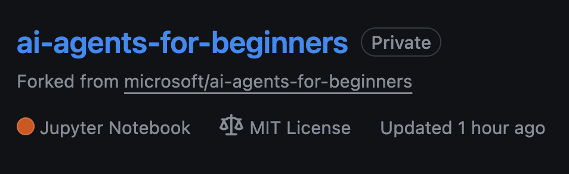
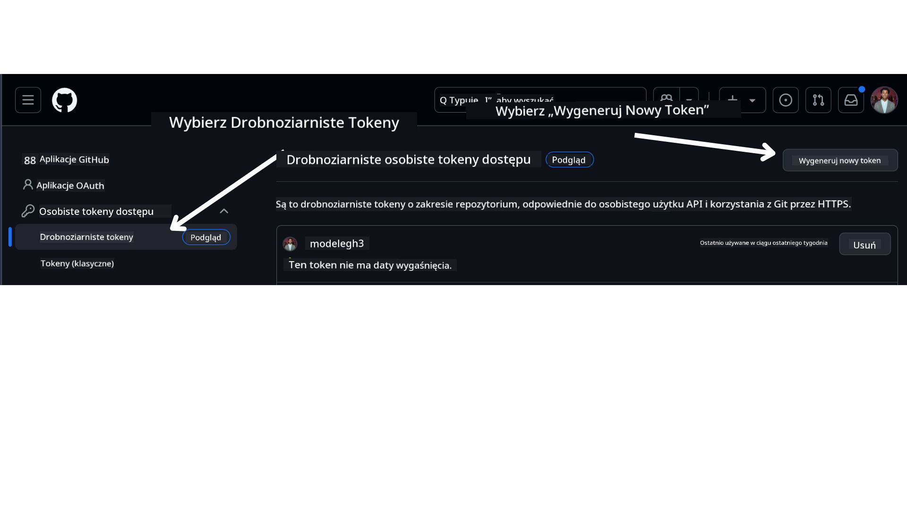

<!--
CO_OP_TRANSLATOR_METADATA:
{
  "original_hash": "366bc6709dd95b8a32ec7c705b0f179c",
  "translation_date": "2025-03-28T09:12:06+00:00",
  "source_file": "00-course-setup\\README.md",
  "language_code": "pl"
}
-->
# Konfiguracja kursu

## Wprowadzenie

Ta lekcja obejmie sposób uruchamiania przykładów kodu z tego kursu.

## Wymagania

- Konto GitHub
- Python 3.12+
- Subskrypcja Azure
- Konto Azure AI Foundry

## Sklonuj lub rozwidl ten repozytorium

Na początek sklonuj lub rozwidl repozytorium GitHub. Dzięki temu utworzysz własną wersję materiałów kursu, aby móc uruchamiać, testować i modyfikować kod!

Można to zrobić, klikając link do

Powinieneś teraz mieć własną rozwidloną wersję tego kursu pod poniższym linkiem:



## Pobierz swój GitHub Personal Access Token (PAT)

Obecnie ten kurs korzysta z Github Models Marketplace, aby zapewnić darmowy dostęp do modeli językowych dużej skali (LLMs), które będą używane do tworzenia agentów AI.

Aby uzyskać dostęp do tej usługi, musisz utworzyć GitHub Personal Access Token.

Można to zrobić, przechodząc do swojego konta GitHub.

Wybierz opcję `Fine-grained tokens` po lewej stronie ekranu.

Następnie wybierz `Generate new token`.



Skopiuj nowo utworzony token. Teraz dodasz go do pliku `.env` dołączonego do tego kursu.

## Dodaj to do zmiennych środowiskowych

Aby utworzyć plik `.env`, uruchom następujące polecenie w terminalu:

```bash
cp .env.example .env
```

To polecenie skopiuje plik przykładowy i utworzy `.env` w twoim katalogu. Uzupełnij wartości zmiennych środowiskowych. Możesz znaleźć wartości dla każdej zmiennej środowiskowej w następujących lokalizacjach na portalu [Azure AI Foundry](https://ai.azure.com?WT.mc_id=academic-105485-koreyst):

Otwórz ten plik i wklej utworzony token w `GITHUB_TOKEN=` field of the .env file. 
- `AZURE_SUBSCRIPTION_ID` - On the **Overview** page of your project within **Project details**.
- `AZURE_AI_PROJECT_NAME` - At the top of the **Overview** page for your project.
- `AZURE_OPENAI_RESOURCE_GROUP` - On the **Overview** page of the **Management Center** within **Project properties**.
- `AZURE_OPENAI_SERVICE` - On the **Overview** page of your project in the **Included capabilities** tab for **Azure OpenAI Service**.
- `AZURE_OPENAI_API_VERSION` - On the [API version lifecycle](https://learn.microsoft.com/azure/ai-services/openai/api-version-deprecation#latest-ga-api-release?WT.mc_id=academic-105485-koreyst) webpage within the **Latest GA API release** section.
- `AZURE_OPENAI_ENDPOINT` - Na karcie **Details** twojego wdrożenia modelu w sekcji **Endpoint** (czyli **Target URI**).

## Zainstaluj wymagane pakiety

Aby upewnić się, że masz wszystkie wymagane pakiety Pythona do uruchomienia kodu, uruchom następujące polecenie w terminalu.

Zalecamy utworzenie wirtualnego środowiska Pythona, aby uniknąć konfliktów i problemów.

```bash
pip install -r requirements.txt
```

To powinno zainstalować wymagane pakiety Pythona.

# Zaloguj się do Azure

Zgodnie z najlepszymi praktykami bezpieczeństwa użyjemy [uwierzytelniania bez klucza](https://learn.microsoft.com/azure/developer/ai/keyless-connections?tabs=csharp%2Cazure-cli?WT.mc_id=academic-105485-koreyst) do uwierzytelniania w Azure OpenAI przy użyciu Microsoft Entra ID. Zanim to zrobisz, musisz najpierw zainstalować **Azure CLI** zgodnie z [instrukcjami instalacji](https://learn.microsoft.com/cli/azure/install-azure-cli?WT.mc_id=academic-105485-koreyst) dla twojego systemu operacyjnego.

Następnie otwórz terminal i uruchom `az login` to sign in to your Azure account.

## Sign in to Azure

Login with your Azure AI account used to provision the Azure resources.

Open a new terminal and enter the following command and follow the instructions in the terminal:

`az login --use-device-code`

Once you've logged in, select your subscription in the terminal.

## Access the environment variables.

We'll import `os` and `load_dotenv`, aby uzyskać dostęp do zmiennych środowiskowych.

```python
import os
from dotenv import load_dotenv

load_dotenv()
```

## Konfiguracja uwierzytelniania bez klucza

Zamiast kodować swoje dane uwierzytelniające na stałe, użyjemy połączenia bez klucza z Azure OpenAI. W tym celu zaimportujemy funkcję `DefaultAzureCredential` and later call the `DefaultAzureCredential`, aby uzyskać dane uwierzytelniające.

```python
from azure.identity import DefaultAzureCredential, InteractiveBrowserCredential
```

Teraz jesteś gotowy do uruchamiania kodu z tego kursu. Powodzenia w zgłębianiu świata agentów AI!

Jeśli napotkasz jakiekolwiek problemy z konfiguracją, dołącz do naszego

lub

## Następna lekcja

[Wprowadzenie do agentów AI i ich zastosowań](../01-intro-to-ai-agents/README.md)

**Zastrzeżenie**:  
Ten dokument został przetłumaczony za pomocą usługi tłumaczenia AI [Co-op Translator](https://github.com/Azure/co-op-translator). Chociaż staramy się zapewnić dokładność, prosimy pamiętać, że automatyczne tłumaczenia mogą zawierać błędy lub nieścisłości. Oryginalny dokument w jego rodzimym języku powinien być uznawany za wiążące źródło. W przypadku informacji krytycznych zaleca się skorzystanie z profesjonalnego tłumaczenia wykonanego przez człowieka. Nie ponosimy odpowiedzialności za jakiekolwiek nieporozumienia lub błędne interpretacje wynikające z użycia tego tłumaczenia.