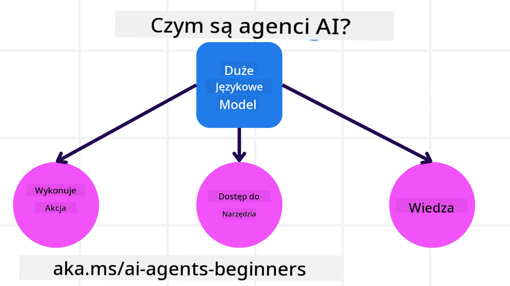
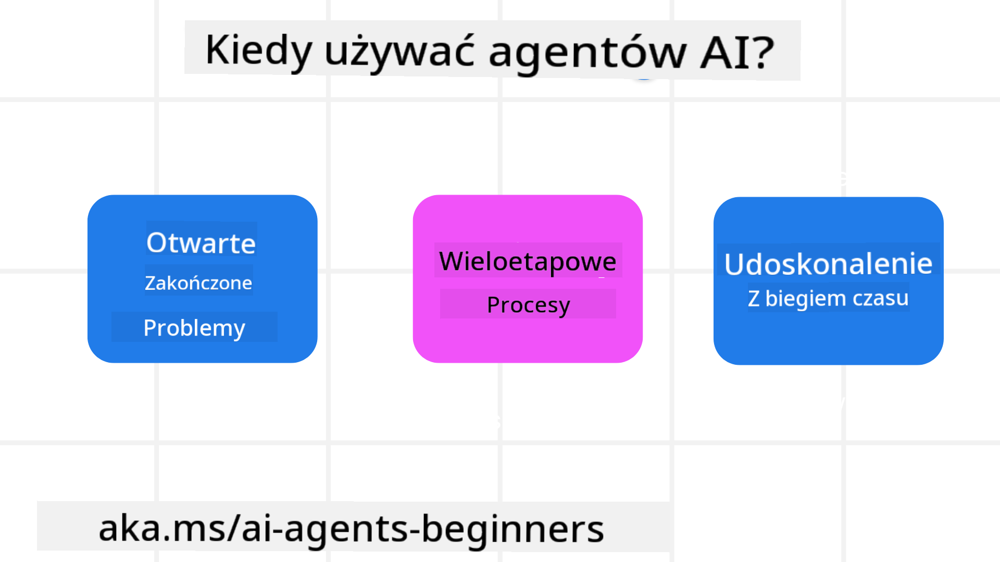

<!--
CO_OP_TRANSLATOR_METADATA:
{
  "original_hash": "233e7a18025a27eae95b653e9b5b5aa5",
  "translation_date": "2025-03-28T09:13:07+00:00",
  "source_file": "01-intro-to-ai-agents\\README.md",
  "language_code": "pl"
}
-->

> _(Kliknij obrazek powyżej, aby obejrzeć wideo do tej lekcji)_

# Wprowadzenie do Agentów AI i ich Zastosowań

Witamy w kursie "Agenci AI dla Początkujących"! Ten kurs dostarcza podstawowej wiedzy oraz praktycznych przykładów budowy Agentów AI.

Dołącz do społeczności, aby spotkać innych uczestników kursu i twórców Agentów AI, a także zadać pytania dotyczące tego kursu.

Na początek przyjrzymy się, czym są Agenci AI i jak możemy ich używać w aplikacjach i procesach, które tworzymy.

## Wprowadzenie

Ta lekcja obejmuje:

- Czym są Agenci AI i jakie są ich różne rodzaje?
- Jakie przypadki użycia najlepiej nadają się dla Agentów AI i w czym mogą nam pomóc?
- Jakie są podstawowe elementy projektowania rozwiązań agentowych?

## Cele Nauki
Po ukończeniu tej lekcji będziesz w stanie:

- Zrozumieć koncepcję Agentów AI i czym różnią się od innych rozwiązań AI.
- Skutecznie stosować Agenty AI.
- Projektować produktywne rozwiązania agentowe zarówno dla użytkowników, jak i klientów.

## Definicja Agentów AI i ich Rodzaje

### Czym są Agenci AI?

Agenci AI to **systemy**, które umożliwiają **Modelom Języka Naturalnego (LLMs)** **wykonywanie działań** poprzez rozszerzanie ich możliwości, dając im **dostęp do narzędzi** i **wiedzy**.

Rozbijmy tę definicję na mniejsze części:

- **System** - Ważne jest, aby postrzegać agentów nie jako pojedynczy komponent, ale jako system składający się z wielu elementów. Na podstawowym poziomie, elementy systemu Agenta AI to:
  - **Środowisko** - Określona przestrzeń, w której działa Agent AI. Na przykład, jeśli mielibyśmy agenta rezerwacji podróży, środowiskiem byłby system rezerwacji podróży, z którego agent korzysta do realizacji zadań.
  - **Czujniki** - Środowiska dostarczają informacji i dają odpowiedzi zwrotne. Agenci AI używają czujników, aby zbierać i interpretować te informacje o aktualnym stanie środowiska. W przykładzie agenta rezerwacji podróży, system rezerwacji może dostarczać informacje, takie jak dostępność hoteli czy ceny lotów.
  - **Aktuatory** - Gdy Agent AI otrzyma aktualny stan środowiska, określa, jakie działanie należy podjąć, aby zmienić środowisko. W przypadku agenta rezerwacji podróży może to być zarezerwowanie dostępnego pokoju dla użytkownika.

**Modele Języka Naturalnego** - Koncepcja agentów istniała przed powstaniem LLM. Przewaga budowy Agentów AI z LLM polega na ich zdolności do interpretacji języka ludzkiego i danych. Ta zdolność pozwala LLM interpretować informacje środowiskowe i tworzyć plan zmiany środowiska.

**Wykonywanie Działań** - Poza systemami Agentów AI, LLM są ograniczone do sytuacji, w których działanie polega na generowaniu treści lub informacji na podstawie polecenia użytkownika. W systemach Agentów AI LLM mogą realizować zadania poprzez interpretację żądań użytkownika i korzystanie z dostępnych narzędzi w swoim środowisku.

**Dostęp do Narzędzi** - To, jakie narzędzia ma dostępne LLM, jest definiowane przez 1) środowisko, w którym działa, oraz 2) twórcę Agenta AI. W naszym przykładzie agenta podróży, narzędzia agenta są ograniczone przez operacje dostępne w systemie rezerwacji, a deweloper może dodatkowo ograniczyć dostęp agenta do określonych funkcji, takich jak loty.

**Wiedza** - Poza informacjami dostarczanymi przez środowisko, Agenci AI mogą także pozyskiwać wiedzę z innych systemów, usług, narzędzi, a nawet od innych agentów. W przykładzie agenta podróży, wiedza ta mogłaby obejmować informacje o preferencjach podróży użytkownika zapisane w bazie danych klientów.

### Różne Rodzaje Agentów

Teraz, gdy mamy ogólną definicję Agentów AI, przyjrzyjmy się niektórym konkretnym typom agentów i ich zastosowaniom na przykładzie agenta rezerwacji podróży.

| **Typ Agenta**                | **Opis**                                                                                                                       | **Przykład**                                                                                                                                                                                                                   |
| ----------------------------- | ----------------------------------------------------------------------------------------------------------------------------- | ----------------------------------------------------------------------------------------------------------------------------------------------------------------------------------------------------------------------------- |
| **Proste Agenty Reaktywne**      | Wykonują natychmiastowe działania na podstawie zdefiniowanych reguł.                                                                 | Agent podróży interpretuje kontekst e-maila i przekazuje skargi dotyczące podróży do działu obsługi klienta.                                                                                                                          |
| **Modelowe Agenty Reaktywne** | Wykonują działania na podstawie modelu świata i zmian w tym modelu.                                                              | Agent podróży priorytetowo traktuje trasy z istotnymi zmianami cen na podstawie dostępu do historycznych danych o cenach.                                                                                                             |
| **Agenty Celowe**         | Tworzą plany osiągania konkretnych celów, interpretując cel i określając działania potrzebne do jego realizacji.                                  | Agent podróży rezerwuje podróż, określając konieczne środki transportu (samochód, transport publiczny, loty) od obecnej lokalizacji do celu podróży.                                                                                |
| **Agenty Użytecznościowe**      | Rozważają preferencje i dokonują numerycznych kompromisów, aby określić, jak osiągnąć cele.                                               | Agent podróży maksymalizuje użyteczność, rozważając wygodę vs. koszt podczas rezerwacji podróży.                                                                                                                                          |
| **Agenty Uczące się**           | Ulepszają się z czasem, reagując na informacje zwrotne i dostosowując swoje działania.                                                        | Agent podróży poprawia się, korzystając z opinii klientów z ankiet po podróży, aby dokonać korekt w przyszłych rezerwacjach.                                                                                                               |
| **Agenty Hierarchiczne**       | Składają się z wielu agentów w systemie warstwowym, gdzie agenci wyższego poziomu dzielą zadania na podzadania dla agentów niższego poziomu. | Agent podróży anuluje podróż, dzieląc zadanie na podzadania (np. anulowanie konkretnych rezerwacji) i zlecając ich realizację agentom niższego poziomu, którzy raportują do agenta wyższego poziomu.                                     |
| **Systemy Wieloagentowe (MAS)** | Agenci wykonują zadania niezależnie, działając kooperacyjnie lub konkurencyjnie.                                                           | Kooperacja: Wielu agentów rezerwuje konkretne usługi podróżnicze, takie jak hotele, loty i rozrywka. Konkurencja: Wielu agentów zarządza wspólnym kalendarzem rezerwacji hotelowych, konkurując o zarezerwowanie miejsc dla klientów. |

## Kiedy Używać Agentów AI

We wcześniejszej sekcji użyliśmy przykładu Agenta Podróży, aby wyjaśnić, jak różne typy agentów mogą być używane w różnych scenariuszach rezerwacji podróży. Będziemy kontynuować korzystanie z tej aplikacji w całym kursie.

Przyjrzyjmy się typom przypadków użycia, w których Agenci AI sprawdzają się najlepiej:

- **Problemy Otwarte** - pozwalając LLM określić potrzebne kroki do wykonania zadania, ponieważ nie zawsze można je zakodować w procesie.
- **Procesy Wieloetapowe** - zadania wymagające pewnego poziomu złożoności, w których Agent AI musi korzystać z narzędzi lub informacji przez wiele etapów, a nie tylko jednorazowo.  
- **Ulepszanie z Czasem** - zadania, w których agent może się ulepszać, otrzymując informacje zwrotne od środowiska lub użytkowników, aby zapewnić lepszą użyteczność.

Więcej rozważań na temat korzystania z Agentów AI omówimy w lekcji Budowanie Wiarygodnych Agentów AI.

## Podstawy Rozwiązań Agentowych

### Tworzenie Agentów

Pierwszym krokiem w projektowaniu systemu Agenta AI jest zdefiniowanie narzędzi, działań i zachowań. W tym kursie skupiamy się na korzystaniu z **Azure AI Agent Service** do definiowania naszych Agentów. Oferuje ona funkcje takie jak:

- Wybór otwartych modeli, takich jak OpenAI, Mistral i Llama
- Wykorzystanie licencjonowanych danych od dostawców, takich jak Tripadvisor
- Użycie standaryzowanych narzędzi OpenAPI 3.0

### Wzorce Agentowe

Komunikacja z LLM odbywa się poprzez podpowiedzi. Ze względu na półautonomiczną naturę Agentów AI, nie zawsze jest możliwe lub konieczne ręczne dostosowanie podpowiedzi po zmianie w środowisku. Używamy **Wzorców Agentowych**, które pozwalają na podpowiadanie LLM w wielu krokach w bardziej skalowalny sposób.

Ten kurs jest podzielony na niektóre z obecnie popularnych wzorców agentowych.

### Frameworki Agentowe

Frameworki Agentowe umożliwiają deweloperom implementację wzorców agentowych za pomocą kodu. Frameworki te oferują szablony, wtyczki i narzędzia do lepszej współpracy Agentów AI. Dzięki temu zapewniają lepszą obserwowalność i możliwość rozwiązywania problemów w systemach Agentów AI.

W tym kursie zbadamy oparty na badaniach framework AutoGen oraz gotowy do produkcji framework Agent z Semantic Kernel.

## Poprzednia Lekcja

[Konfiguracja Kursu](../00-course-setup/README.md)

## Następna Lekcja

[Badanie Frameworków Agentowych](../02-explore-agentic-frameworks/README.md)

**Zastrzeżenie**:  
Ten dokument został przetłumaczony za pomocą usługi tłumaczenia AI [Co-op Translator](https://github.com/Azure/co-op-translator). Chociaż staramy się zapewnić dokładność, należy pamiętać, że automatyczne tłumaczenia mogą zawierać błędy lub nieścisłości. Oryginalny dokument w jego rodzimym języku powinien być uznawany za wiarygodne źródło. W przypadku istotnych informacji zaleca się skorzystanie z profesjonalnego tłumaczenia przez człowieka. Nie ponosimy odpowiedzialności za jakiekolwiek nieporozumienia lub błędne interpretacje wynikające z użycia tego tłumaczenia.