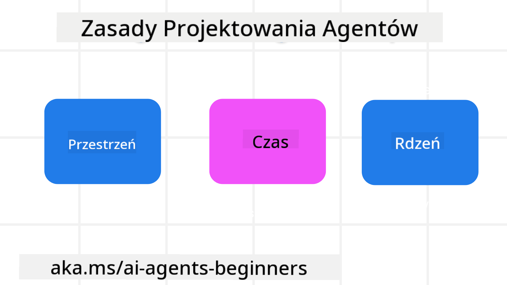

<!--
CO_OP_TRANSLATOR_METADATA:
{
  "original_hash": "969885aab5f923f67f134ce115fbbcaf",
  "translation_date": "2025-03-28T09:21:00+00:00",
  "source_file": "03-agentic-design-patterns\\README.md",
  "language_code": "pl"
}
-->

> _(Kliknij obrazek powyżej, aby obejrzeć wideo z tej lekcji)_
# Zasady projektowania agentów AI

## Wprowadzenie

Istnieje wiele sposobów myślenia o budowaniu systemów agentów AI. Biorąc pod uwagę, że niejednoznaczność jest cechą, a nie błędem w projektowaniu generatywnej AI, inżynierowie czasami mają trudności z ustaleniem, od czego zacząć. Stworzyliśmy zestaw zasad projektowania UX skoncentrowanych na człowieku, aby umożliwić deweloperom tworzenie systemów agentów skoncentrowanych na kliencie, które odpowiadają na potrzeby biznesowe. Te zasady projektowania nie są sztywną architekturą, lecz punktem wyjścia dla zespołów definiujących i budujących doświadczenia z agentami.

Ogólnie rzecz biorąc, agenci powinni:

- Rozszerzać i skalować ludzkie możliwości (burza mózgów, rozwiązywanie problemów, automatyzacja itp.)
- Uzupełniać luki w wiedzy (pomagać w zrozumieniu nowych dziedzin wiedzy, tłumaczenia itp.)
- Ułatwiać i wspierać współpracę w sposób, w jaki lubimy pracować z innymi
- Pomagać nam stać się lepszymi wersjami samych siebie (np. jako trenerzy życiowi, mistrzowie zadań, pomagając w nauce regulacji emocjonalnej, umiejętności uważności, budowaniu odporności itp.)

## W tej lekcji omówimy

- Czym są zasady projektowania agentów
- Jakie wytyczne należy stosować podczas wdrażania tych zasad
- Przykłady zastosowania zasad projektowania

## Cele nauki

Po ukończeniu tej lekcji będziesz w stanie:

1. Wyjaśnić, czym są zasady projektowania agentów
2. Wyjaśnić wytyczne dotyczące stosowania zasad projektowania agentów
3. Zrozumieć, jak zbudować agenta, stosując zasady projektowania agentów

## Zasady projektowania agentów

### Agent (Przestrzeń)

To środowisko, w którym działa agent. Te zasady informują, jak projektować agentów do działania w fizycznym i cyfrowym świecie.

- **Łączyć, nie zastępować** – pomagają łączyć ludzi z innymi ludźmi, wydarzeniami i praktyczną wiedzą, wspierając współpracę i budowanie relacji.
- Agenci pomagają łączyć wydarzenia, wiedzę i ludzi.
- Agenci zbliżają ludzi do siebie. Nie są projektowani, aby zastępować lub umniejszać ludzi.
- **Łatwo dostępni, ale czasem niewidoczni** – agent działa głównie w tle i przypomina o sobie tylko wtedy, gdy jest to istotne i odpowiednie.
  - Agent jest łatwo dostępny i odkrywalny dla autoryzowanych użytkowników na dowolnym urządzeniu lub platformie.
  - Agent obsługuje różne tryby wejścia i wyjścia (dźwięk, głos, tekst itp.).
  - Agent płynnie przechodzi między pierwszym planem a tłem; między trybem proaktywnym a reaktywnym, w zależności od potrzeb użytkownika.
  - Agent może działać w sposób niewidoczny, ale procesy w tle i współpraca z innymi agentami są przejrzyste i kontrolowane przez użytkownika.

### Agent (Czas)

To sposób, w jaki agent działa w czasie. Te zasady informują, jak projektować agentów wchodzących w interakcje z przeszłością, teraźniejszością i przyszłością.

- **Przeszłość**: Refleksja nad historią, która obejmuje zarówno stan, jak i kontekst.
  - Agent dostarcza bardziej trafne wyniki, analizując bogatsze dane historyczne, a nie tylko wydarzenia, ludzi czy stany.
  - Agent tworzy połączenia z przeszłych wydarzeń i aktywnie odwołuje się do pamięci, aby angażować się w bieżące sytuacje.
- **Teraźniejszość**: Podsuwanie sugestii zamiast powiadomień.
  - Agent przyjmuje kompleksowe podejście do interakcji z ludźmi. Gdy wydarzenie ma miejsce, agent wychodzi poza statyczne powiadomienia czy inne formalności. Może uprościć procesy lub dynamicznie generować wskazówki, aby skierować uwagę użytkownika w odpowiednim momencie.
  - Agent dostarcza informacje uwzględniając kontekst środowiskowy, zmiany społeczne i kulturowe oraz intencje użytkownika.
  - Interakcja z agentem może być stopniowa, ewoluująca/rozwijająca się w złożoność, aby wspierać użytkowników w dłuższej perspektywie.
- **Przyszłość**: Adaptacja i rozwój.
  - Agent dostosowuje się do różnych urządzeń, platform i sposobów komunikacji.
  - Agent dostosowuje się do zachowań użytkownika, jego potrzeb w zakresie dostępności i jest w pełni konfigurowalny.
  - Agent kształtuje się i rozwija dzięki ciągłym interakcjom z użytkownikiem.

### Agent (Rdzeń)

To kluczowe elementy w centrum projektu agenta.

- **Akceptuj niepewność, ale buduj zaufanie**.
  - Pewien poziom niepewności agenta jest oczekiwany. Niepewność to kluczowy element projektowania agenta.
  - Zaufanie i przejrzystość to podstawowe warstwy projektowania agenta.
  - Człowiek ma kontrolę nad tym, kiedy agent jest włączony/wyłączony, a jego status jest zawsze widoczny.

## Wytyczne do wdrażania tych zasad

Podczas korzystania z powyższych zasad projektowania stosuj następujące wytyczne:

1. **Przejrzystość**: Informuj użytkownika, że zaangażowane jest AI, jak działa (w tym wcześniejsze działania) oraz jak przekazać opinię i zmodyfikować system.
2. **Kontrola**: Umożliwiaj użytkownikowi dostosowanie, określenie preferencji i personalizację, a także kontrolę nad systemem i jego atrybutami (w tym możliwość zapomnienia danych).
3. **Spójność**: Dąż do spójnych, wielomodalnych doświadczeń na różnych urządzeniach i punktach kontaktu. Używaj znanych elementów UI/UX tam, gdzie to możliwe (np. ikona mikrofonu do interakcji głosowej) i maksymalnie zmniejsz obciążenie poznawcze użytkownika (np. krótkie odpowiedzi, pomoce wizualne i treści „Dowiedz się więcej”).

## Jak zaprojektować agenta podróży, stosując te zasady i wytyczne

Wyobraź sobie, że projektujesz agenta podróży. Oto jak możesz wykorzystać zasady projektowania i wytyczne:

1. **Przejrzystość** – Poinformuj użytkownika, że agent podróży jest wspierany przez AI. Podaj podstawowe instrukcje, jak zacząć (np. wiadomość powitalną, przykładowe pytania). Wyraźnie opisz to na stronie produktu. Pokaż listę zapytań, które użytkownik zadawał w przeszłości. Wyjaśnij, jak przekazać opinię (np. przyciski „kciuk w górę” i „kciuk w dół”, przycisk „Prześlij opinię” itp.). Jasno określ, czy agent ma jakieś ograniczenia w zakresie użycia lub tematów.
2. **Kontrola** – Upewnij się, że użytkownik wie, jak zmodyfikować agenta po jego utworzeniu, np. poprzez System Prompt. Umożliw użytkownikowi wybór, jak szczegółowe mają być odpowiedzi agenta, jego styl pisania oraz jakich tematów agent powinien unikać. Pozwól użytkownikowi przeglądać i usuwać wszelkie powiązane pliki, dane, zapytania i wcześniejsze rozmowy.
3. **Spójność** – Upewnij się, że ikony do udostępniania zapytań, dodawania plików lub zdjęć oraz oznaczania osób lub rzeczy są standardowe i rozpoznawalne. Użyj ikony spinacza do papieru, aby wskazać przesyłanie/udostępnianie plików agentowi, oraz ikony obrazu, aby wskazać przesyłanie grafiki.

## Dodatkowe zasoby

- ## Poprzednia lekcja

[Odkrywanie ram agentów](../02-explore-agentic-frameworks/README.md)

## Następna lekcja

[Wzorzec projektowania użycia narzędzi](../04-tool-use/README.md)

**Zastrzeżenie**:  
Ten dokument został przetłumaczony przy użyciu usługi tłumaczenia AI [Co-op Translator](https://github.com/Azure/co-op-translator). Chociaż staramy się zapewnić dokładność, należy pamiętać, że tłumaczenia automatyczne mogą zawierać błędy lub nieścisłości. Oryginalny dokument w jego języku źródłowym powinien być uważany za autorytatywne źródło. W przypadku informacji o krytycznym znaczeniu zaleca się skorzystanie z profesjonalnego tłumaczenia przez człowieka. Nie ponosimy odpowiedzialności za wszelkie nieporozumienia lub błędne interpretacje wynikające z korzystania z tego tłumaczenia.