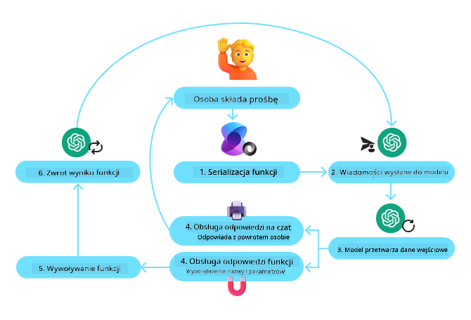
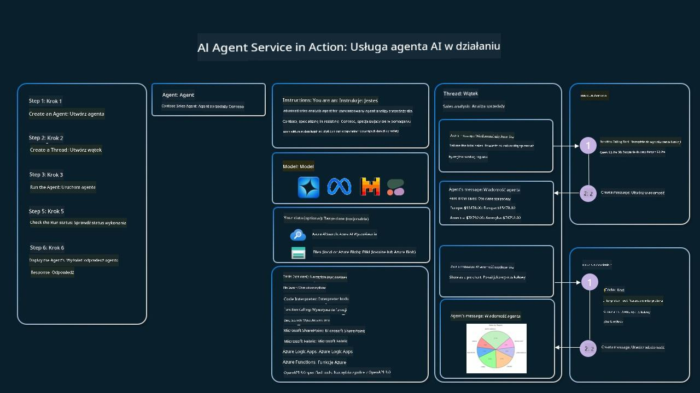

<!--
CO_OP_TRANSLATOR_METADATA:
{
  "original_hash": "b8ea2abd1a674f736d5fc08982e6ec06",
  "translation_date": "2025-03-28T09:22:30+00:00",
  "source_file": "04-tool-use\\README.md",
  "language_code": "pl"
}
-->
[](https://youtu.be/vieRiPRx-gI?si=cEZ8ApnT6Sus9rhn)

> _(Kliknij obrazek powyżej, aby obejrzeć wideo z tej lekcji)_

# Wzorzec projektowy korzystania z narzędzi

Narzędzia są interesujące, ponieważ umożliwiają agentom AI poszerzenie zakresu ich możliwości. Zamiast ograniczonego zestawu działań, które agent może wykonać, dodanie narzędzia pozwala agentowi na realizację szerokiego zakresu zadań. W tym rozdziale przyjrzymy się wzorcowi projektowemu korzystania z narzędzi, który opisuje, jak agenci AI mogą używać określonych narzędzi do osiągania swoich celów.

## Wprowadzenie

W tej lekcji odpowiemy na następujące pytania:

- Czym jest wzorzec projektowy korzystania z narzędzi?
- Jakie są przypadki użycia, do których można go zastosować?
- Jakie są elementy/podstawowe składniki potrzebne do wdrożenia wzorca projektowego?
- Jakie szczególne aspekty należy uwzględnić, aby budować wiarygodnych agentów AI z wykorzystaniem tego wzorca?

## Cele nauki

Po ukończeniu tej lekcji będziesz w stanie:

- Zdefiniować wzorzec projektowy korzystania z narzędzi i jego cel.
- Rozpoznać przypadki użycia, w których wzorzec projektowy korzystania z narzędzi jest odpowiedni.
- Zrozumieć kluczowe elementy potrzebne do wdrożenia wzorca projektowego.
- Zidentyfikować aspekty zapewniające wiarygodność agentów AI korzystających z tego wzorca.

## Czym jest wzorzec projektowy korzystania z narzędzi?

**Wzorzec projektowy korzystania z narzędzi** skupia się na umożliwieniu LLM interakcji z zewnętrznymi narzędziami w celu realizacji określonych celów. Narzędzia to kod, który może być wykonywany przez agenta w celu realizacji działań. Narzędzie może być prostą funkcją, taką jak kalkulator, lub wywołaniem API do usługi zewnętrznej, na przykład sprawdzenie cen akcji czy prognozy pogody. W kontekście agentów AI narzędzia są projektowane tak, aby były wykonywane przez agentów w odpowiedzi na **wywołania funkcji generowane przez model**.

## Jakie są przypadki użycia?

Agenci AI mogą wykorzystywać narzędzia do realizacji złożonych zadań, pozyskiwania informacji lub podejmowania decyzji. Wzorzec projektowy korzystania z narzędzi jest często stosowany w scenariuszach wymagających dynamicznej interakcji z systemami zewnętrznymi, takimi jak bazy danych, usługi internetowe czy interpretery kodu. Ta zdolność jest przydatna w wielu przypadkach użycia, w tym:

- **Dynamiczne pozyskiwanie informacji:** Agenci mogą wyszukiwać dane w zewnętrznych API lub bazach danych, aby uzyskać aktualne informacje (np. zapytania do bazy SQLite w celu analizy danych, pozyskiwanie cen akcji lub informacji o pogodzie).
- **Wykonywanie i interpretacja kodu:** Agenci mogą wykonywać kod lub skrypty w celu rozwiązywania problemów matematycznych, generowania raportów lub przeprowadzania symulacji.
- **Automatyzacja przepływu pracy:** Automatyzowanie powtarzalnych lub wieloetapowych przepływów pracy poprzez integrację narzędzi takich jak harmonogramy zadań, usługi e-mail czy potoki danych.
- **Obsługa klienta:** Agenci mogą wchodzić w interakcje z systemami CRM, platformami zgłoszeniowymi lub bazami wiedzy, aby rozwiązywać problemy użytkowników.
- **Tworzenie i edycja treści:** Agenci mogą korzystać z narzędzi takich jak korektory gramatyczne, narzędzia do podsumowywania tekstu czy oceny bezpieczeństwa treści, aby wspierać zadania związane z tworzeniem treści.

## Jakie są elementy/podstawowe składniki potrzebne do wdrożenia wzorca projektowego korzystania z narzędzi?

Te elementy pozwalają agentowi AI realizować szeroki zakres zadań. Przyjrzyjmy się kluczowym składnikom potrzebnym do wdrożenia wzorca projektowego korzystania z narzędzi:

- **Wywoływanie funkcji/narzędzi:** To podstawowy sposób umożliwienia LLM interakcji z narzędziami. Funkcje lub narzędzia to bloki wielokrotnego użytku kodu, które agenci wykorzystują do realizacji zadań. Mogą to być proste funkcje, takie jak kalkulator, lub wywołania API do usług zewnętrznych, takich jak sprawdzenie cen akcji czy prognozy pogody.

- **Dynamiczne pozyskiwanie informacji:** Agenci mogą wyszukiwać dane w zewnętrznych API lub bazach danych, aby uzyskać aktualne informacje. Jest to przydatne w zadaniach takich jak analiza danych, pozyskiwanie cen akcji czy informacji o pogodzie.

- **Wykonywanie i interpretacja kodu:** Agenci mogą wykonywać kod lub skrypty w celu rozwiązywania problemów matematycznych, generowania raportów lub przeprowadzania symulacji.

- **Automatyzacja przepływu pracy:** Automatyzowanie powtarzalnych lub wieloetapowych przepływów pracy poprzez integrację narzędzi takich jak harmonogramy zadań, usługi e-mail czy potoki danych.

- **Obsługa klienta:** Agenci mogą wchodzić w interakcje z systemami CRM, platformami zgłoszeniowymi lub bazami wiedzy, aby rozwiązywać problemy użytkowników.

- **Tworzenie i edycja treści:** Agenci mogą korzystać z narzędzi takich jak korektory gramatyczne, narzędzia do podsumowywania tekstu czy oceny bezpieczeństwa treści, aby wspierać zadania związane z tworzeniem treści.

Następnie przyjrzymy się szczegółowo wywoływaniu funkcji/narzędzi.

### Wywoływanie funkcji/narzędzi

Wywoływanie funkcji to podstawowy sposób, w jaki umożliwiamy dużym modelom językowym (LLM) interakcję z narzędziami. Często terminy „funkcja” i „narzędzie” są używane zamiennie, ponieważ „funkcje” (bloki kodu wielokrotnego użytku) są „narzędziami”, które agenci wykorzystują do realizacji zadań. Aby kod funkcji mógł zostać wywołany, LLM musi porównać żądanie użytkownika z opisem funkcji. W tym celu do LLM przesyłany jest schemat zawierający opisy wszystkich dostępnych funkcji. Następnie LLM wybiera najbardziej odpowiednią funkcję dla danego zadania i zwraca jej nazwę oraz argumenty. Wybrana funkcja jest wywoływana, jej odpowiedź jest przesyłana z powrotem do LLM, który wykorzystuje informacje do odpowiedzi na żądanie użytkownika.

Aby deweloperzy mogli wdrożyć wywoływanie funkcji dla agentów, potrzebne są:

1. Model LLM, który obsługuje wywoływanie funkcji
2. Schemat zawierający opisy funkcji
3. Kod dla każdej opisanej funkcji

Przeanalizujmy przykład uzyskania aktualnego czasu w określonym mieście:

1. **Zainicjowanie LLM obsługującego wywoływanie funkcji:**

    Nie wszystkie modele obsługują wywoływanie funkcji, dlatego ważne jest, aby sprawdzić, czy LLM, którego używasz, to robi. <a href="https://learn.microsoft.com/azure/ai-services/openai/how-to/function-calling" target="_blank">Azure OpenAI</a> obsługuje wywoływanie funkcji. Możemy zacząć od inicjalizacji klienta Azure OpenAI.

    ```python
    # Initialize the Azure OpenAI client
    client = AzureOpenAI(
        azure_endpoint = os.getenv("AZURE_OPENAI_ENDPOINT"), 
        api_key=os.getenv("AZURE_OPENAI_API_KEY"),  
        api_version="2024-05-01-preview"
    )
    ```

1. **Tworzenie schematu funkcji:**

    Następnie zdefiniujemy schemat JSON zawierający nazwę funkcji, opis jej działania oraz nazwy i opisy parametrów funkcji. Następnie przekażemy ten schemat do wcześniej utworzonego klienta wraz z żądaniem użytkownika dotyczącym znalezienia czasu w San Francisco. Ważne jest, aby zauważyć, że zwracane jest **wywołanie narzędzia**, a **nie** ostateczna odpowiedź na pytanie. Jak wspomniano wcześniej, LLM zwraca nazwę funkcji wybranej dla danego zadania oraz argumenty, które zostaną do niej przekazane.

    ```python
    # Function description for the model to read
    tools = [
        {
            "type": "function",
            "function": {
                "name": "get_current_time",
                "description": "Get the current time in a given location",
                "parameters": {
                    "type": "object",
                    "properties": {
                        "location": {
                            "type": "string",
                            "description": "The city name, e.g. San Francisco",
                        },
                    },
                    "required": ["location"],
                },
            }
        }
    ]
    ```
   
    ```python
  
    # Initial user message
    messages = [{"role": "user", "content": "What's the current time in San Francisco"}] 
  
    # First API call: Ask the model to use the function
      response = client.chat.completions.create(
          model=deployment_name,
          messages=messages,
          tools=tools,
          tool_choice="auto",
      )
  
      # Process the model's response
      response_message = response.choices[0].message
      messages.append(response_message)
  
      print("Model's response:")  

      print(response_message)
  
    ```

    ```bash
    Model's response:
    ChatCompletionMessage(content=None, role='assistant', function_call=None, tool_calls=[ChatCompletionMessageToolCall(id='call_pOsKdUlqvdyttYB67MOj434b', function=Function(arguments='{"location":"San Francisco"}', name='get_current_time'), type='function')])
    ```
  
1. **Kod funkcji potrzebny do realizacji zadania:**

    Teraz, gdy LLM wybrał funkcję, która musi zostać uruchomiona, kod realizujący zadanie musi zostać zaimplementowany i wykonany. Możemy zaimplementować kod uzyskania aktualnego czasu w Pythonie. Konieczne będzie również napisanie kodu do wyodrębnienia nazwy i argumentów z response_message, aby uzyskać ostateczny wynik.

    ```python
      def get_current_time(location):
        """Get the current time for a given location"""
        print(f"get_current_time called with location: {location}")  
        location_lower = location.lower()
        
        for key, timezone in TIMEZONE_DATA.items():
            if key in location_lower:
                print(f"Timezone found for {key}")  
                current_time = datetime.now(ZoneInfo(timezone)).strftime("%I:%M %p")
                return json.dumps({
                    "location": location,
                    "current_time": current_time
                })
      
        print(f"No timezone data found for {location_lower}")  
        return json.dumps({"location": location, "current_time": "unknown"})
    ```

     ```python
     # Handle function calls
      if response_message.tool_calls:
          for tool_call in response_message.tool_calls:
              if tool_call.function.name == "get_current_time":
     
                  function_args = json.loads(tool_call.function.arguments)
     
                  time_response = get_current_time(
                      location=function_args.get("location")
                  )
     
                  messages.append({
                      "tool_call_id": tool_call.id,
                      "role": "tool",
                      "name": "get_current_time",
                      "content": time_response,
                  })
      else:
          print("No tool calls were made by the model.")  
  
      # Second API call: Get the final response from the model
      final_response = client.chat.completions.create(
          model=deployment_name,
          messages=messages,
      )
  
      return final_response.choices[0].message.content
     ```

     ```bash
      get_current_time called with location: San Francisco
      Timezone found for san francisco
      The current time in San Francisco is 09:24 AM.
     ```

Wywoływanie funkcji jest kluczowym elementem większości, jeśli nie wszystkich projektów agentów korzystających z narzędzi, jednak jego wdrożenie od podstaw może być czasami trudne. Jak nauczyliśmy się w [Lekcji 2](../../../02-explore-agentic-frameworks) frameworki agentowe dostarczają nam gotowe elementy do implementacji korzystania z narzędzi.

## Przykłady korzystania z narzędzi z frameworkami agentowymi

Oto kilka przykładów, jak można wdrożyć wzorzec projektowy korzystania z narzędzi za pomocą różnych frameworków agentowych:

### Semantic Kernel

<a href="https://learn.microsoft.com/azure/ai-services/agents/overview" target="_blank">Semantic Kernel</a> to otwarty framework AI dla deweloperów .NET, Python i Java pracujących z dużymi modelami językowymi (LLM). Upraszcza proces korzystania z wywoływania funkcji, automatycznie opisując funkcje i ich parametry dla modelu poprzez proces zwany <a href="https://learn.microsoft.com/semantic-kernel/concepts/ai-services/chat-completion/function-calling/?pivots=programming-language-python#1-serializing-the-functions" target="_blank">serializacją</a>. Obsługuje również komunikację między modelem a twoim kodem. Kolejną zaletą korzystania z frameworku agentowego, takiego jak Semantic Kernel, jest dostęp do gotowych narzędzi, takich jak <a href="https://github.com/microsoft/semantic-kernel/blob/main/python/samples/getting_started_with_agents/openai_assistant/step4_assistant_tool_file_search.py" target="_blank">Wyszukiwanie plików</a> i <a href="https://github.com/microsoft/semantic-kernel/blob/main/python/samples/getting_started_with_agents/openai_assistant/step3_assistant_tool_code_interpreter.py" target="_blank">Interpreter kodu</a>.

Poniższy diagram ilustruje proces wywoływania funkcji w Semantic Kernel:



W Semantic Kernel funkcje/narzędzia są nazywane <a href="https://learn.microsoft.com/semantic-kernel/concepts/plugins/?pivots=programming-language-python" target="_blank">Pluginami</a>. Możemy skonwertować `get_current_time` function we saw earlier into a plugin by turning it into a class with the function in it. We can also import the `kernel_function` za pomocą dekoratora, który przyjmuje opis funkcji. Kiedy następnie tworzysz kernel z GetCurrentTimePlugin, kernel automatycznie serializuje funkcję i jej parametry, tworząc schemat do przesłania do LLM w procesie.

```python
from semantic_kernel.functions import kernel_function

class GetCurrentTimePlugin:
    async def __init__(self, location):
        self.location = location

    @kernel_function(
        description="Get the current time for a given location"
    )
    def get_current_time(location: str = ""):
        ...

```

```python 
from semantic_kernel import Kernel

# Create the kernel
kernel = Kernel()

# Create the plugin
get_current_time_plugin = GetCurrentTimePlugin(location)

# Add the plugin to the kernel
kernel.add_plugin(get_current_time_plugin)
```
  
### Azure AI Agent Service

<a href="https://learn.microsoft.com/azure/ai-services/agents/overview" target="_blank">Azure AI Agent Service</a> to nowy framework agentowy zaprojektowany, aby umożliwić deweloperom bezpieczne budowanie, wdrażanie i skalowanie wysokiej jakości, rozszerzalnych agentów AI bez konieczności zarządzania zasobami obliczeniowymi i pamięci masowej. Jest szczególnie przydatny w aplikacjach korporacyjnych, ponieważ jest w pełni zarządzaną usługą z zabezpieczeniami na poziomie przedsiębiorstwa.

W porównaniu do pracy bezpośrednio z API LLM, Azure AI Agent Service oferuje kilka korzyści, w tym:

- Automatyczne wywoływanie narzędzi – brak konieczności analizowania wywołania narzędzia, uruchamiania narzędzia i obsługi odpowiedzi; wszystko to jest teraz realizowane po stronie serwera
- Bezpiecznie zarządzane dane – zamiast zarządzać stanem rozmowy, można polegać na wątkach do przechowywania wszystkich potrzebnych informacji
- Gotowe narzędzia – Narzędzia umożliwiające interakcję z twoimi źródłami danych, takie jak Bing, Azure AI Search i Azure Functions.

Narzędzia dostępne w Azure AI Agent Service można podzielić na dwie kategorie:

1. Narzędzia wiedzy:
    - <a href="https://learn.microsoft.com/azure/ai-services/agents/how-to/tools/bing-grounding?tabs=python&pivots=overview" target="_blank">Podstawy z Bing Search</a>
    - <a href="https://learn.microsoft.com/azure/ai-services/agents/how-to/tools/file-search?tabs=python&pivots=overview" target="_blank">Wyszukiwanie plików</a>
    - <a href="https://learn.microsoft.com/azure/ai-services/agents/how-to/tools/azure-ai-search?tabs=azurecli%2Cpython&pivots=overview-azure-ai-search" target="_blank">Azure AI Search</a>

2. Narzędzia działania:
    - <a href="https://learn.microsoft.com/azure/ai-services/agents/how-to/tools/function-calling?tabs=python&pivots=overview" target="_blank">Wywoływanie funkcji</a>
    - <a href="https://learn.microsoft.com/azure/ai-services/agents/how-to/tools/code-interpreter?tabs=python&pivots=overview" target="_blank">Interpreter kodu</a>
    - <a href="https://learn.microsoft.com/azure/ai-services/agents/how-to/tools/openapi-spec?tabs=python&pivots=overview" target="_blank">Narzędzia zdefiniowane przez OpenAI</a>
    - <a href="https://learn.microsoft.com/azure/ai-services/agents/how-to/tools/azure-functions?pivots=overview" target="_blank">Azure Functions</a>

Agent Service pozwala nam korzystać z tych narzędzi razem jako `toolset`. It also utilizes `threads` which keep track of the history of messages from a particular conversation.

Imagine you are a sales agent at a company called Contoso. You want to develop a conversational agent that can answer questions about your sales data.

The following image illustrates how you could use Azure AI Agent Service to analyze your sales data:



To use any of these tools with the service we can create a client and define a tool or toolset. To implement this practically we can use the following Python code. The LLM will be able to look at the toolset and decide whether to use the user created function, `fetch_sales_data_using_sqlite_query`, lub z gotowego interpretera kodu w zależności od żądania użytkownika.

```python 
import os
from azure.ai.projects import AIProjectClient
from azure.identity import DefaultAzureCredential
from fecth_sales_data_functions import fetch_sales_data_using_sqlite_query # fetch_sales_data_using_sqlite_query function which can be found in a fetch_sales_data_functions.py file.
from azure.ai.projects.models import ToolSet, FunctionTool, CodeInterpreterTool

project_client = AIProjectClient.from_connection_string(
    credential=DefaultAzureCredential(),
    conn_str=os.environ["PROJECT_CONNECTION_STRING"],
)

# Initialize function calling agent with the fetch_sales_data_using_sqlite_query function and adding it to the toolset
fetch_data_function = FunctionTool(fetch_sales_data_using_sqlite_query)
toolset = ToolSet()
toolset.add(fetch_data_function)

# Initialize Code Interpreter tool and adding it to the toolset. 
code_interpreter = code_interpreter = CodeInterpreterTool()
toolset = ToolSet()
toolset.add(code_interpreter)

agent = project_client.agents.create_agent(
    model="gpt-4o-mini", name="my-agent", instructions="You are helpful agent", 
    toolset=toolset
)
```

## Jakie szczególne aspekty należy uwzględnić, aby budować wiarygodnych agentów AI z wykorzystaniem wzorca projektowego korzystania z narzędzi?

Częstym problemem związanym z dynamicznie generowanym przez LLM kodem SQL jest bezpieczeństwo, w szczególności ryzyko wstrzyknięcia SQL lub złośliwych działań, takich jak usunięcie lub manipulacja bazą danych. Choć te obawy są uzasadnione, można je skutecznie złagodzić poprzez odpowiednie skonfigurowanie uprawnień dostępu do bazy danych. W przypadku większości baz danych wiąże się to z skonfigurowaniem bazy jako tylko do odczytu. W przypadku usług baz danych, takich jak PostgreSQL czy Azure SQL, aplikacji należy przypisać rolę tylko do odczytu (SELECT).

Uruchamianie aplikacji w bezpiecznym środowisku dodatkowo zwiększa ochronę. W scenariuszach korporacyjnych dane są zazwyczaj wyodrębniane i przekształcane z systemów operacyjnych do bazy danych tylko do odczytu lub hurtowni danych z przyjaznym dla użytkownika schematem. Takie podejście zapewnia, że dane są bezpieczne, zoptymalizowane pod kątem wydajności i dostępności, a aplikacja ma ograniczony, tylko do odczytu dostęp.

## Dodatkowe zasoby

- <a href="https://microsoft.github.io/build-your-first-agent-with-azure-ai-agent-service-workshop/" target="_blank">Warsztat Azure AI Agents Service</a>
- <a href="https://github.com/Azure-Samples/contoso-creative-writer/tree/main/docs/workshop" target="_blank">Warsztat wieloagentowy Contoso Creative Writer</a>
- <a href="https://learn.microsoft.com/semantic-kernel/concepts/ai-services/chat-completion/function-calling/?pivots=programming-language-python#1-serializing-the-functions" target="_blank">Tutorial wywoływania funkcji w Semantic Kernel</a>
- <a href="https://github.com/microsoft/semantic-kernel/blob/main/python/samples/getting_started_with_agents/openai_assistant/step3_assistant_tool_code_interpreter.py" target="_blank">Interpreter kodu w Semantic Kernel</a>
- <a href="

**Zastrzeżenie**:  
Ten dokument został przetłumaczony za pomocą usługi tłumaczenia AI [Co-op Translator](https://github.com/Azure/co-op-translator). Chociaż staramy się zapewnić dokładność, prosimy pamiętać, że automatyczne tłumaczenia mogą zawierać błędy lub nieścisłości. Oryginalny dokument w jego rodzimym języku powinien być uznawany za wiarygodne źródło. W przypadku informacji krytycznych zaleca się skorzystanie z profesjonalnego tłumaczenia wykonanego przez człowieka. Nie ponosimy odpowiedzialności za jakiekolwiek nieporozumienia lub błędne interpretacje wynikające z użycia tego tłumaczenia.