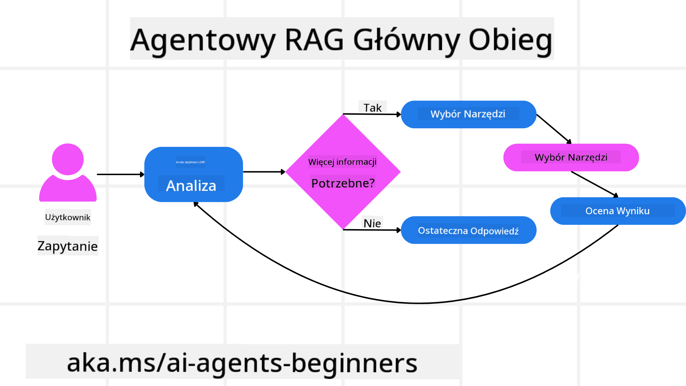
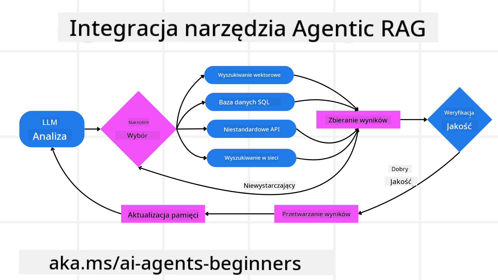
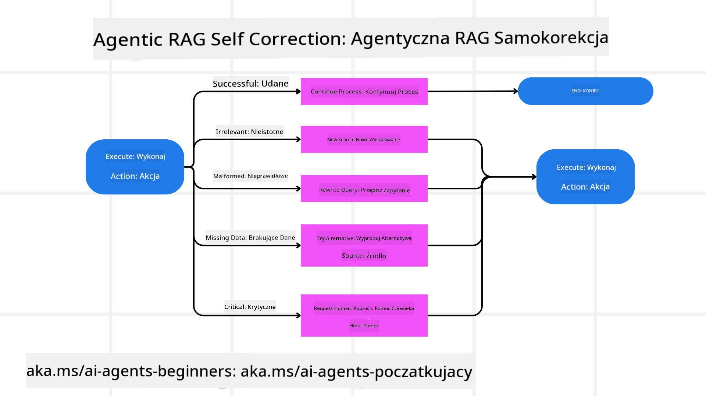
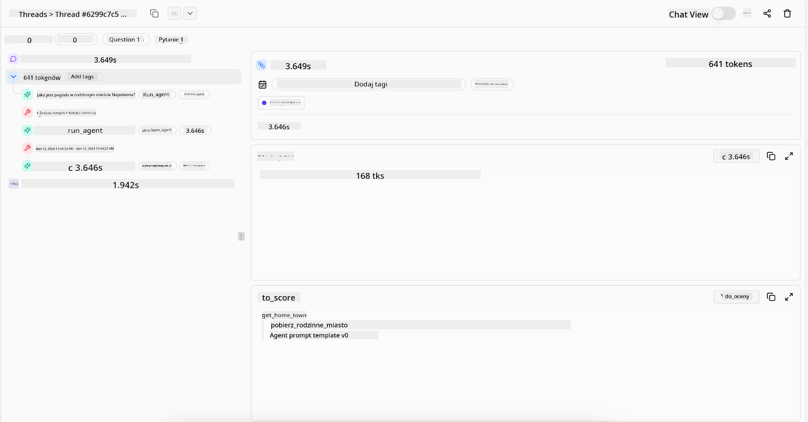
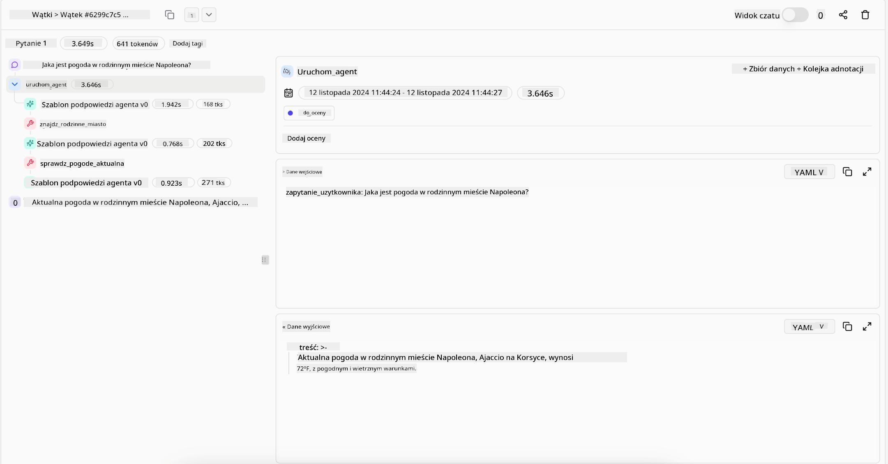

<!--
CO_OP_TRANSLATOR_METADATA:
{
  "original_hash": "4d215d159f2f3b96644fd62657988d23",
  "translation_date": "2025-03-28T09:24:57+00:00",
  "source_file": "05-agentic-rag\\README.md",
  "language_code": "pl"
}
-->

> _(Kliknij na obrazek powyżej, aby obejrzeć wideo z tej lekcji)_

# Agentic RAG

Ta lekcja przedstawia szczegółowy przegląd Agentic Retrieval-Augmented Generation (Agentic RAG), nowego paradygmatu AI, w którym modele językowe (LLM) samodzielnie planują kolejne kroki, jednocześnie pozyskując informacje z zewnętrznych źródeł. W przeciwieństwie do statycznych wzorców „wyszukiwanie-odczyt”, Agentic RAG obejmuje iteracyjne wywołania LLM, przeplatane użyciem narzędzi lub funkcji oraz strukturalnymi wynikami. System ocenia rezultaty, udoskonala zapytania, wywołuje dodatkowe narzędzia, jeśli jest to konieczne, i kontynuuje ten cykl, aż osiągnie satysfakcjonujące rozwiązanie.

## Wprowadzenie

W tej lekcji omówimy:

- **Zrozumienie Agentic RAG:** Poznaj nowy paradygmat AI, w którym modele językowe (LLM) samodzielnie planują kolejne kroki, pozyskując informacje z zewnętrznych źródeł danych.
- **Iteracyjny styl Maker-Checker:** Zrozum proces iteracyjnych wywołań LLM, przeplatanych użyciem narzędzi lub funkcji oraz strukturalnymi wynikami, zaprojektowany w celu poprawy dokładności i radzenia sobie z błędnymi zapytaniami.
- **Praktyczne zastosowania:** Zidentyfikuj scenariusze, w których Agentic RAG się wyróżnia, takie jak środowiska z naciskiem na poprawność, złożone interakcje z bazami danych i rozbudowane procesy robocze.

## Cele nauki

Po ukończeniu tej lekcji będziesz wiedzieć, jak/zrozumiesz:

- **Zrozumienie Agentic RAG:** Poznaj nowy paradygmat AI, w którym modele językowe (LLM) samodzielnie planują kolejne kroki, pozyskując informacje z zewnętrznych źródeł danych.
- **Iteracyjny styl Maker-Checker:** Zrozum koncepcję pętli iteracyjnych wywołań LLM, przeplatanych użyciem narzędzi lub funkcji oraz strukturalnymi wynikami, zaprojektowaną w celu poprawy dokładności i radzenia sobie z błędnymi zapytaniami.
- **Przejęcie procesu rozumowania:** Zrozum zdolność systemu do samodzielnego podejmowania decyzji dotyczących sposobu rozwiązywania problemów bez polegania na z góry określonych ścieżkach.
- **Proces roboczy:** Zrozum, jak model agentowy samodzielnie decyduje o pozyskiwaniu raportów o trendach rynkowych, identyfikowaniu danych o konkurencji, korelowaniu wewnętrznych metryk sprzedaży, syntezowaniu wyników i ocenie strategii.
- **Iteracyjne pętle, integracja narzędzi i pamięć:** Poznaj zależność systemu od wzorca interakcji w pętli, utrzymywanie stanu i pamięci w kolejnych krokach, aby unikać powtarzalnych pętli i podejmować świadome decyzje.
- **Radzenie sobie z trybami awarii i autokorekta:** Zbadaj solidne mechanizmy autokorekty systemu, w tym iteracje i ponowne zapytania, korzystanie z narzędzi diagnostycznych oraz powrót do nadzoru ludzkiego.
- **Granice autonomii:** Zrozum ograniczenia Agentic RAG, koncentrując się na autonomii specyficznej dla domeny, zależności od infrastruktury i przestrzeganiu wytycznych.
- **Praktyczne przypadki użycia i wartość:** Zidentyfikuj scenariusze, w których Agentic RAG się wyróżnia, takie jak środowiska z naciskiem na poprawność, złożone interakcje z bazami danych i rozbudowane procesy robocze.
- **Zarządzanie, przejrzystość i zaufanie:** Dowiedz się o znaczeniu zarządzania i przejrzystości, w tym wyjaśnialnego rozumowania, kontroli uprzedzeń i nadzoru ludzkiego.

## Co to jest Agentic RAG?

Agentic Retrieval-Augmented Generation (Agentic RAG) to nowy paradygmat AI, w którym modele językowe (LLM) samodzielnie planują kolejne kroki, jednocześnie pozyskując informacje z zewnętrznych źródeł. W przeciwieństwie do statycznych wzorców „wyszukiwanie-odczyt”, Agentic RAG obejmuje iteracyjne wywołania LLM, przeplatane użyciem narzędzi lub funkcji oraz strukturalnymi wynikami. System ocenia rezultaty, udoskonala zapytania, wywołuje dodatkowe narzędzia, jeśli jest to konieczne, i kontynuuje ten cykl, aż osiągnie satysfakcjonujące rozwiązanie. Ten iteracyjny styl „maker-checker” poprawia dokładność, radzi sobie z błędnymi zapytaniami i zapewnia wysoką jakość wyników.

System aktywnie przejmuje proces rozumowania, poprawiając nieudane zapytania, wybierając różne metody wyszukiwania i integrując wiele narzędzi—takich jak wyszukiwanie wektorowe w Azure AI Search, bazy danych SQL czy niestandardowe API—zanim sfinalizuje swoją odpowiedź. Charakterystyczną cechą systemu agentowego jest jego zdolność do przejęcia procesu rozumowania. Tradycyjne implementacje RAG opierają się na z góry określonych ścieżkach, podczas gdy system agentowy samodzielnie decyduje o kolejności kroków na podstawie jakości znalezionych informacji.

## Definicja Agentic Retrieval-Augmented Generation (Agentic RAG)

Agentic Retrieval-Augmented Generation (Agentic RAG) to nowy paradygmat w rozwoju AI, w którym modele językowe (LLM) nie tylko pozyskują informacje z zewnętrznych źródeł danych, ale także samodzielnie planują kolejne kroki. W przeciwieństwie do statycznych wzorców „wyszukiwanie-odczyt” czy starannie zaprojektowanych sekwencji promptów, Agentic RAG obejmuje pętlę iteracyjnych wywołań LLM, przeplatanych użyciem narzędzi lub funkcji oraz strukturalnymi wynikami. Na każdym etapie system ocenia uzyskane wyniki, decyduje, czy należy udoskonalić zapytania, wywołuje dodatkowe narzędzia, jeśli jest to konieczne, i kontynuuje ten cykl, aż osiągnie satysfakcjonujące rozwiązanie.

Ten iteracyjny styl „maker-checker” jest zaprojektowany w celu poprawy dokładności, radzenia sobie z błędnymi zapytaniami do baz danych strukturalnych (np. NL2SQL) i zapewnienia zrównoważonych, wysokiej jakości wyników. Zamiast polegać wyłącznie na starannie zaprojektowanych łańcuchach promptów, system aktywnie przejmuje proces rozumowania. Może poprawiać nieudane zapytania, wybierać różne metody wyszukiwania i integrować wiele narzędzi—takich jak wyszukiwanie wektorowe w Azure AI Search, bazy danych SQL czy niestandardowe API—zanim sfinalizuje swoją odpowiedź. To eliminuje potrzebę stosowania zbyt skomplikowanych frameworków orkiestracji. Zamiast tego stosunkowo prosta pętla „wywołanie LLM → użycie narzędzia → wywołanie LLM → …” może prowadzić do zaawansowanych i dobrze ugruntowanych wyników.

## Przejęcie procesu rozumowania

Charakterystyczną cechą systemu „agentowego” jest jego zdolność do przejęcia procesu rozumowania. Tradycyjne implementacje RAG często zależą od ludzi, którzy z góry definiują ścieżkę dla modelu: ciąg rozumowania określający, co pozyskać i kiedy. Jednak gdy system jest naprawdę agentowy, sam decyduje, jak podejść do problemu. Nie wykonuje tylko skryptu; autonomicznie określa kolejność kroków na podstawie jakości znalezionych informacji. 

Na przykład, jeśli poprosimy go o stworzenie strategii wprowadzenia produktu na rynek, nie polega wyłącznie na promptach, które określają cały proces badawczy i decyzyjny. Zamiast tego model agentowy samodzielnie decyduje o:

1. Pozyskaniu raportów o aktualnych trendach rynkowych za pomocą Bing Web Grounding.
2. Zidentyfikowaniu odpowiednich danych o konkurencji za pomocą Azure AI Search.
3. Korelowaniu historycznych wewnętrznych metryk sprzedaży za pomocą Azure SQL Database.
4. Syntezie wyników w spójną strategię, zarządzaną przez Azure OpenAI Service.
5. Oceny strategii pod kątem luk lub niespójności, co może skutkować kolejną rundą pozyskiwania danych.

Wszystkie te kroki—udoskonalanie zapytań, wybór źródeł, iteracja aż do uzyskania „satysfakcjonującej” odpowiedzi—są podejmowane przez model, a nie wcześniej zaplanowane przez człowieka.

## Iteracyjne pętle, integracja narzędzi i pamięć

System agentowy opiera się na wzorcu interakcji w pętli:

- **Pierwsze wywołanie:** Cel użytkownika (tzw. prompt użytkownika) jest przedstawiany LLM.
- **Wywołanie narzędzia:** Jeśli model identyfikuje brakujące informacje lub niejasne instrukcje, wybiera narzędzie lub metodę pozyskiwania—np. zapytanie do bazy danych wektorowych (np. Azure AI Search Hybrid search na prywatnych danych) lub strukturalne zapytanie SQL—aby uzyskać więcej kontekstu.
- **Ocena i udoskonalenie:** Po przeanalizowaniu zwróconych danych model decyduje, czy informacje są wystarczające. Jeśli nie, udoskonala zapytanie, próbuje innego narzędzia lub dostosowuje swoje podejście.
- **Powtarzanie aż do satysfakcji:** Cykl trwa, aż model uzna, że ma wystarczającą jasność i dowody, aby dostarczyć ostateczną, dobrze uzasadnioną odpowiedź.
- **Pamięć i stan:** Ponieważ system utrzymuje stan i pamięć w kolejnych krokach, może przypominać sobie poprzednie próby i ich wyniki, unikając powtarzalnych pętli i podejmując bardziej świadome decyzje w miarę postępu.

Z czasem tworzy to poczucie ewoluującego rozumienia, umożliwiając modelowi poruszanie się po złożonych, wieloetapowych zadaniach bez konieczności ciągłej interwencji lub zmiany promptu przez człowieka.

## Radzenie sobie z trybami awarii i autokorekta

Autonomia Agentic RAG obejmuje również solidne mechanizmy autokorekty. Gdy system napotyka problemy—np. pozyskuje nieistotne dokumenty lub napotyka błędne zapytania—może:

- **Iteracja i ponowne zapytanie:** Zamiast zwracać odpowiedzi o niskiej wartości, model próbuje nowych strategii wyszukiwania, poprawia zapytania do bazy danych lub analizuje alternatywne zestawy danych.
- **Użycie narzędzi diagnostycznych:** System może wywoływać dodatkowe funkcje zaprojektowane, aby pomóc mu debugować kroki rozumowania lub potwierdzić poprawność pozyskanych danych. Narzędzia takie jak Azure AI Tracing będą kluczowe dla zapewnienia solidnej obserwowalności i monitorowania.
- **Powrót do nadzoru ludzkiego:** W scenariuszach o wysokim ryzyku lub powtarzających się awariach model może zgłaszać niepewność i prosić o pomoc człowieka. Gdy człowiek dostarczy korekty, model może uwzględnić tę lekcję w przyszłości.

To iteracyjne i dynamiczne podejście pozwala modelowi na ciągłe doskonalenie, zapewniając, że nie jest to system jednorazowy, lecz taki, który uczy się na swoich błędach w trakcie sesji.

## Granice autonomii

Pomimo swojej autonomii w ramach zadania, Agentic RAG nie jest odpowiednikiem sztucznej inteligencji ogólnej. Jego zdolności „agentowe” są ograniczone do narzędzi, źródeł danych i polityk dostarczonych przez ludzkich programistów. Nie może tworzyć własnych narzędzi ani wychodzić poza granice domeny, które zostały ustalone. Zamiast tego doskonale radzi sobie z dynamiczną orkiestracją dostępnych zasobów.

Główne różnice w porównaniu z bardziej zaawansowanymi formami AI obejmują:

1. **Autonomia specyficzna dla domeny:** Systemy Agentic RAG koncentrują się na osiąganiu celów zdefiniowanych przez użytkownika w znanej domenie, stosując strategie takie jak poprawianie zapytań czy wybór narzędzi w celu poprawy wyników.
2. **Zależność od infrastruktury:** Zdolności systemu zależą od narzędzi i danych zintegrowanych przez programistów. Nie może przekroczyć tych granic bez interwencji człowieka.
3. **Poszanowanie wytycznych:** Wytyczne etyczne, zasady zgodności i polityki biznesowe pozostają bardzo ważne. Wolność agenta zawsze jest ograniczona przez mechanizmy bezpieczeństwa i nadzoru (przynajmniej tak powinno być).

## Praktyczne przypadki użycia i wartość

Agentic RAG wyróżnia się w scenariuszach wymagających iteracyjnego udoskonalania i precyzji:

1. **Środowiska z naciskiem na poprawność:** W analizach zgodności, badaniach regulacyjnych czy badaniach prawnych model agentowy może wielokrotnie weryfikować fakty, konsultować się z wieloma źródłami i poprawiać zapytania, aż do uzyskania dokładnie zweryfikowanej odpowiedzi.
2. **Złożone interakcje z bazami danych:** Przy pracy z danymi strukturalnymi, gdzie zapytania często zawodzą lub wymagają korekty, system może samodzielnie poprawiać zapytania za pomocą Azure SQL lub Microsoft Fabric OneLake, zapewniając, że końcowy wynik odpowiada zamiarom użytkownika.
3. **Rozbudowane procesy robocze:** Dłuższe sesje mogą ewoluować w miarę pojawiania się nowych informacji. Agentic RAG może stale uwzględniać nowe dane, zmieniając strategie w miarę zdobywania wiedzy o problemie.

## Zarządzanie, przejrzystość i zaufanie

W miarę jak te systemy stają się bardziej autonomiczne w swoim rozumowaniu, zarządzanie i przejrzystość stają się kluczowe:

- **Wyjaśnialne rozumowanie:** Model może dostarczyć ścieżkę audytu zapytań, które wykonał, źródeł, które skonsultował, i kroków rozumowania, które podjął, aby dojść do swojego wniosku. Narzędzia takie jak Azure AI Content Safety i Azure AI Tracing / GenAIOps mogą pomóc w utrzymaniu przejrzystości i ograniczeniu ryzyka.
- **Kontrola uprzedzeń i zrównoważone pozyskiwanie:** Programiści mogą dostosować strategie pozyskiwania, aby zapewnić uwzględnienie zrównoważonych, reprezentatywnych źródeł danych oraz regularnie audytować wyniki w celu wykrycia uprzedzeń lub schematów odchylenia, używając niestandardowych modeli dla zaawansowanych organizacji zajmujących się nauką o danych, korzystających z Azure Machine Learning.
- **Nadzór ludzki i zgodność:** W przypadku zadań wrażliwych nadzór ludzki pozostaje niezbędny. Agentic RAG nie zastępuje ludzkiego osądu w decyzjach o wysokiej stawce—wzmacnia go, dostarczając bardziej dokładnie zweryfikowane opcje.

Posiadanie narzędzi, które dostarczają wyraźny zapis działań, jest kluczowe. Bez nich debugowanie procesu wieloetapowego może być bardzo trudne. Zobacz poniższy przykład od Literal AI (firma stojąca za Chainlit) dotyczący działania agenta:

## Podsumowanie

Agentic RAG reprezentuje naturalną ewolucję w sposobie, w jaki systemy AI radzą sobie ze złożonymi, intensywnymi danymi zadaniami. Dzięki zastosowaniu wzorca interakcji

**Zastrzeżenie**:  
Ten dokument został przetłumaczony za pomocą usługi tłumaczenia AI [Co-op Translator](https://github.com/Azure/co-op-translator). Chociaż dokładamy wszelkich starań, aby zapewnić dokładność, prosimy mieć na uwadze, że automatyczne tłumaczenia mogą zawierać błędy lub nieścisłości. Oryginalny dokument w jego rodzimym języku powinien być uznawany za wiarygodne źródło. W przypadku kluczowych informacji zaleca się skorzystanie z profesjonalnego tłumaczenia przez człowieka. Nie ponosimy odpowiedzialności za jakiekolwiek nieporozumienia lub błędne interpretacje wynikające z użycia tego tłumaczenia.