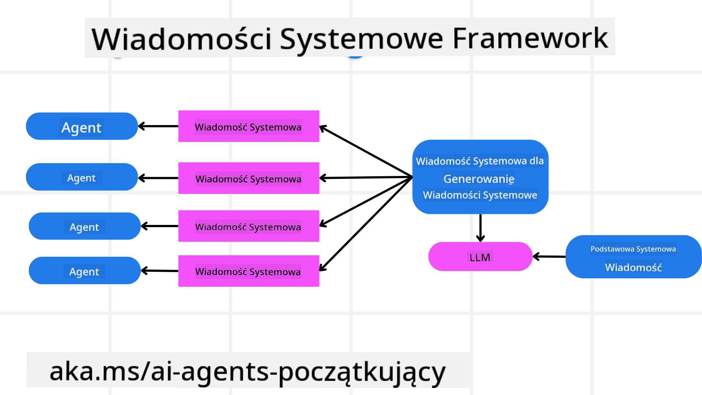
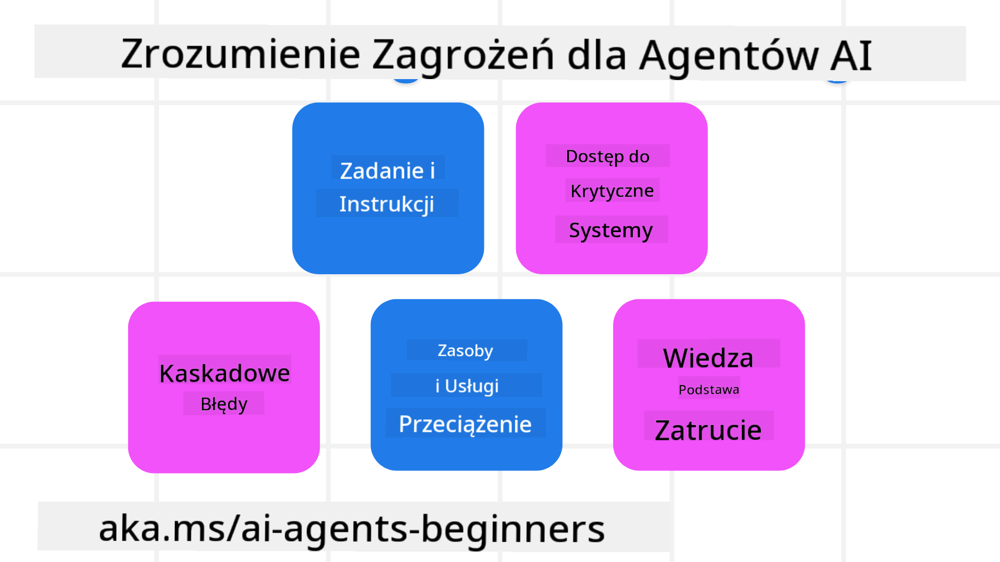

<!--
CO_OP_TRANSLATOR_METADATA:
{
  "original_hash": "c069d7ff0feca3027f88819355866ca1",
  "translation_date": "2025-03-28T09:27:41+00:00",
  "source_file": "06-building-trustworthy-agents\\README.md",
  "language_code": "pl"
}
-->
[](https://youtu.be/iZKkMEGBCUQ?si=Q-kEbcyHUMPoHp8L)

> _(Kliknij obrazek powyżej, aby obejrzeć wideo z tej lekcji)_

# Tworzenie zaufanych agentów AI

## Wprowadzenie

Ta lekcja obejmuje:

- Jak budować i wdrażać bezpiecznych i skutecznych agentów AI.
- Ważne kwestie związane z bezpieczeństwem podczas tworzenia agentów AI.
- Jak zachować prywatność danych i użytkowników podczas tworzenia agentów AI.

## Cele nauki

Po ukończeniu tej lekcji będziesz wiedzieć, jak:

- Identyfikować i minimalizować ryzyko podczas tworzenia agentów AI.
- Wdrażać środki bezpieczeństwa, aby zapewnić właściwe zarządzanie danymi i dostępem.
- Tworzyć agentów AI, którzy zachowują prywatność danych i oferują wysoką jakość doświadczenia użytkownika.

## Bezpieczeństwo

Najpierw przyjrzyjmy się, jak budować bezpieczne aplikacje agentowe. Bezpieczeństwo oznacza, że agent AI działa zgodnie z założeniami. Jako twórcy aplikacji agentowych mamy metody i narzędzia, które maksymalizują bezpieczeństwo:

### Tworzenie struktury wiadomości systemowych

Jeśli kiedykolwiek budowałeś aplikację AI wykorzystującą modele językowe o dużej skali (LLM), wiesz, jak ważne jest projektowanie solidnego systemowego promptu lub wiadomości systemowej. Te wiadomości ustanawiają zasady, instrukcje i wytyczne dotyczące interakcji LLM z użytkownikiem i danymi.

Dla agentów AI wiadomość systemowa jest jeszcze ważniejsza, ponieważ agenci AI potrzebują bardzo konkretnych instrukcji, aby wykonywać zadania, które dla nich zaprojektowaliśmy.

Aby stworzyć skalowalne wiadomości systemowe, możemy użyć struktury wiadomości systemowych do budowania jednego lub więcej agentów w naszej aplikacji:



#### Krok 1: Utwórz meta wiadomość systemową

Meta prompt będzie używany przez LLM do generowania wiadomości systemowych dla agentów, których tworzymy. Projektujemy go jako szablon, aby móc efektywnie tworzyć wielu agentów, jeśli zajdzie taka potrzeba.

Oto przykład meta wiadomości systemowej, którą przekazalibyśmy LLM:

```plaintext
You are an expert at creating AI agent assistants. 
You will be provided a company name, role, responsibilities and other
information that you will use to provide a system prompt for.
To create the system prompt, be descriptive as possible and provide a structure that a system using an LLM can better understand the role and responsibilities of the AI assistant. 
```

#### Krok 2: Utwórz podstawowy prompt

Następnym krokiem jest stworzenie podstawowego promptu opisującego agenta AI. Powinieneś uwzględnić rolę agenta, zadania, które będzie wykonywać, oraz inne obowiązki agenta.

Oto przykład:

```plaintext
You are a travel agent for Contoso Travel that is great at booking flights for customers. To help customers you can perform the following tasks: lookup available flights, book flights, ask for preferences in seating and times for flights, cancel any previously booked flights and alert customers on any delays or cancellations of flights.  
```

#### Krok 3: Przekaż podstawową wiadomość systemową do LLM

Teraz możemy zoptymalizować tę wiadomość systemową, przekazując meta wiadomość systemową jako wiadomość systemową oraz naszą podstawową wiadomość systemową.

To wygeneruje wiadomość systemową lepiej zaprojektowaną do prowadzenia naszych agentów AI:

```markdown
**Company Name:** Contoso Travel  
**Role:** Travel Agent Assistant

**Objective:**  
You are an AI-powered travel agent assistant for Contoso Travel, specializing in booking flights and providing exceptional customer service. Your main goal is to assist customers in finding, booking, and managing their flights, all while ensuring that their preferences and needs are met efficiently.

**Key Responsibilities:**

1. **Flight Lookup:**
    
    - Assist customers in searching for available flights based on their specified destination, dates, and any other relevant preferences.
    - Provide a list of options, including flight times, airlines, layovers, and pricing.
2. **Flight Booking:**
    
    - Facilitate the booking of flights for customers, ensuring that all details are correctly entered into the system.
    - Confirm bookings and provide customers with their itinerary, including confirmation numbers and any other pertinent information.
3. **Customer Preference Inquiry:**
    
    - Actively ask customers for their preferences regarding seating (e.g., aisle, window, extra legroom) and preferred times for flights (e.g., morning, afternoon, evening).
    - Record these preferences for future reference and tailor suggestions accordingly.
4. **Flight Cancellation:**
    
    - Assist customers in canceling previously booked flights if needed, following company policies and procedures.
    - Notify customers of any necessary refunds or additional steps that may be required for cancellations.
5. **Flight Monitoring:**
    
    - Monitor the status of booked flights and alert customers in real-time about any delays, cancellations, or changes to their flight schedule.
    - Provide updates through preferred communication channels (e.g., email, SMS) as needed.

**Tone and Style:**

- Maintain a friendly, professional, and approachable demeanor in all interactions with customers.
- Ensure that all communication is clear, informative, and tailored to the customer's specific needs and inquiries.

**User Interaction Instructions:**

- Respond to customer queries promptly and accurately.
- Use a conversational style while ensuring professionalism.
- Prioritize customer satisfaction by being attentive, empathetic, and proactive in all assistance provided.

**Additional Notes:**

- Stay updated on any changes to airline policies, travel restrictions, and other relevant information that could impact flight bookings and customer experience.
- Use clear and concise language to explain options and processes, avoiding jargon where possible for better customer understanding.

This AI assistant is designed to streamline the flight booking process for customers of Contoso Travel, ensuring that all their travel needs are met efficiently and effectively.

```

#### Krok 4: Iteracja i ulepszenia

Wartość tej struktury wiadomości systemowych polega na tym, że ułatwia skalowanie tworzenia wiadomości systemowych dla wielu agentów oraz poprawę wiadomości systemowych w miarę upływu czasu. Rzadko zdarza się, że wiadomość systemowa działa od razu dla całego przypadku użycia. Możliwość wprowadzania drobnych poprawek i ulepszeń poprzez zmianę podstawowej wiadomości systemowej oraz ponowne jej uruchomienie w systemie pozwala na porównanie i ocenę wyników.

## Zrozumienie zagrożeń

Aby budować zaufanych agentów AI, ważne jest zrozumienie i minimalizowanie ryzyk oraz zagrożeń związanych z agentami AI. Przyjrzyjmy się niektórym z różnych zagrożeń dla agentów AI oraz temu, jak można lepiej je zaplanować i przygotować się na nie.



### Zadania i instrukcje

**Opis:** Atakujący próbują zmienić instrukcje lub cele agenta AI poprzez manipulację promptami lub wejściami.

**Minimalizacja:** Wykonuj weryfikację wejść oraz filtry wejściowe, aby wykryć potencjalnie niebezpieczne prompty, zanim zostaną przetworzone przez agenta AI. Ponieważ tego rodzaju ataki zazwyczaj wymagają częstej interakcji z agentem, ograniczenie liczby tur w rozmowie to kolejny sposób na zapobieganie tego typu atakom.

### Dostęp do krytycznych systemów

**Opis:** Jeśli agent AI ma dostęp do systemów i usług przechowujących wrażliwe dane, atakujący mogą skompromitować komunikację między agentem a tymi usługami. Mogą to być bezpośrednie ataki lub próby uzyskania informacji o tych systemach za pośrednictwem agenta.

**Minimalizacja:** Agenci AI powinni mieć dostęp do systemów wyłącznie w razie potrzeby, aby zapobiec tego rodzaju atakom. Komunikacja między agentem a systemem powinna być również zabezpieczona. Wdrożenie uwierzytelniania i kontroli dostępu to kolejny sposób na ochronę tych informacji.

### Przeciążenie zasobów i usług

**Opis:** Agenci AI mogą uzyskiwać dostęp do różnych narzędzi i usług w celu wykonywania zadań. Atakujący mogą wykorzystać tę możliwość do atakowania tych usług, wysyłając dużą liczbę żądań przez agenta AI, co może prowadzić do awarii systemu lub wysokich kosztów.

**Minimalizacja:** Wprowadź zasady ograniczające liczbę żądań, jakie agent AI może wysyłać do usługi. Ograniczenie liczby tur rozmowy oraz żądań do agenta AI to kolejny sposób na zapobieganie tego typu atakom.

### Zatrucie bazy wiedzy

**Opis:** Ten rodzaj ataku nie dotyczy bezpośrednio agenta AI, ale bazy wiedzy i innych usług, z których korzysta agent AI. Może to obejmować uszkodzenie danych lub informacji, które agent AI wykorzystuje do realizacji zadania, co prowadzi do stronniczych lub niezamierzonych odpowiedzi dla użytkownika.

**Minimalizacja:** Regularnie weryfikuj dane, które agent AI będzie wykorzystywał w swoich przepływach pracy. Upewnij się, że dostęp do tych danych jest zabezpieczony i zmieniany tylko przez zaufane osoby, aby uniknąć tego rodzaju ataków.

### Błędy kaskadowe

**Opis:** Agenci AI uzyskują dostęp do różnych narzędzi i usług w celu realizacji zadań. Błędy spowodowane przez atakujących mogą prowadzić do awarii innych systemów, z którymi agent AI jest połączony, powodując, że atak staje się bardziej rozległy i trudniejszy do rozwiązania.

**Minimalizacja:** Jedną z metod zapobiegania temu jest ograniczenie działania agenta AI do środowiska zamkniętego, takiego jak wykonywanie zadań w kontenerze Docker, aby zapobiec bezpośrednim atakom na system. Tworzenie mechanizmów awaryjnych i logiki ponownego uruchamiania w przypadku błędnych odpowiedzi systemów to kolejny sposób na zapobieganie większym awariom systemu.

## Człowiek w pętli

Kolejnym skutecznym sposobem na budowanie zaufanych systemów agentów AI jest zastosowanie koncepcji "człowiek w pętli". Tworzy to przepływ, w którym użytkownicy mogą dostarczać opinie agentom podczas ich działania. Użytkownicy zasadniczo działają jako agenci w systemie wieloagentowym, udzielając zgody lub kończąc proces działania.


Oto fragment kodu wykorzystujący AutoGen, który pokazuje, jak ta koncepcja jest wdrażana:

```python

# Create the agents.
model_client = OpenAIChatCompletionClient(model="gpt-4o-mini")
assistant = AssistantAgent("assistant", model_client=model_client)
user_proxy = UserProxyAgent("user_proxy", input_func=input)  # Use input() to get user input from console.

# Create the termination condition which will end the conversation when the user says "APPROVE".
termination = TextMentionTermination("APPROVE")

# Create the team.
team = RoundRobinGroupChat([assistant, user_proxy], termination_condition=termination)

# Run the conversation and stream to the console.
stream = team.run_stream(task="Write a 4-line poem about the ocean.")
# Use asyncio.run(...) when running in a script.
await Console(stream)

```

## Podsumowanie

Tworzenie zaufanych agentów AI wymaga starannego projektowania, solidnych środków bezpieczeństwa oraz ciągłej iteracji. Wdrażając strukturalne systemy meta promptów, rozumiejąc potencjalne zagrożenia i stosując strategie minimalizacji, programiści mogą tworzyć agentów AI, którzy są zarówno bezpieczni, jak i skuteczni. Ponadto, zastosowanie podejścia "człowiek w pętli" zapewnia, że agenci AI pozostają zgodni z potrzebami użytkowników, minimalizując jednocześnie ryzyko. W miarę rozwoju AI utrzymanie proaktywnego podejścia do bezpieczeństwa, prywatności i kwestii etycznych będzie kluczowe dla budowania zaufania i niezawodności w systemach opartych na AI.

## Dodatkowe zasoby

- <a href="https://learn.microsoft.com/azure/ai-studio/responsible-use-of-ai-overview" target="_blank">Przegląd odpowiedzialnego korzystania z AI</a>
- <a href="https://learn.microsoft.com/azure/ai-studio/concepts/evaluation-approach-gen-ai" target="_blank">Ocena modeli generatywnych AI i aplikacji AI</a>
- <a href="https://learn.microsoft.com/azure/ai-services/openai/concepts/system-message?context=%2Fazure%2Fai-studio%2Fcontext%2Fcontext&tabs=top-techniques" target="_blank">Wiadomości systemowe dotyczące bezpieczeństwa</a>
- <a href="https://blogs.microsoft.com/wp-content/uploads/prod/sites/5/2022/06/Microsoft-RAI-Impact-Assessment-Template.pdf?culture=en-us&country=us" target="_blank">Szablon oceny ryzyka</a>

## Poprzednia lekcja

[Agentic RAG](../05-agentic-rag/README.md)

## Następna lekcja

[Wzorzec projektowania planowania](../07-planning-design/README.md)

**Zastrzeżenie**:  
Ten dokument został przetłumaczony za pomocą usługi tłumaczenia AI [Co-op Translator](https://github.com/Azure/co-op-translator). Chociaż staramy się zapewnić dokładność, prosimy pamiętać, że automatyczne tłumaczenia mogą zawierać błędy lub nieścisłości. Oryginalny dokument w jego rodzimym języku powinien być uznawany za wiarygodne źródło. W przypadku istotnych informacji zaleca się skorzystanie z profesjonalnego tłumaczenia wykonanego przez człowieka. Nie ponosimy odpowiedzialności za jakiekolwiek nieporozumienia lub błędne interpretacje wynikające z użycia tego tłumaczenia.