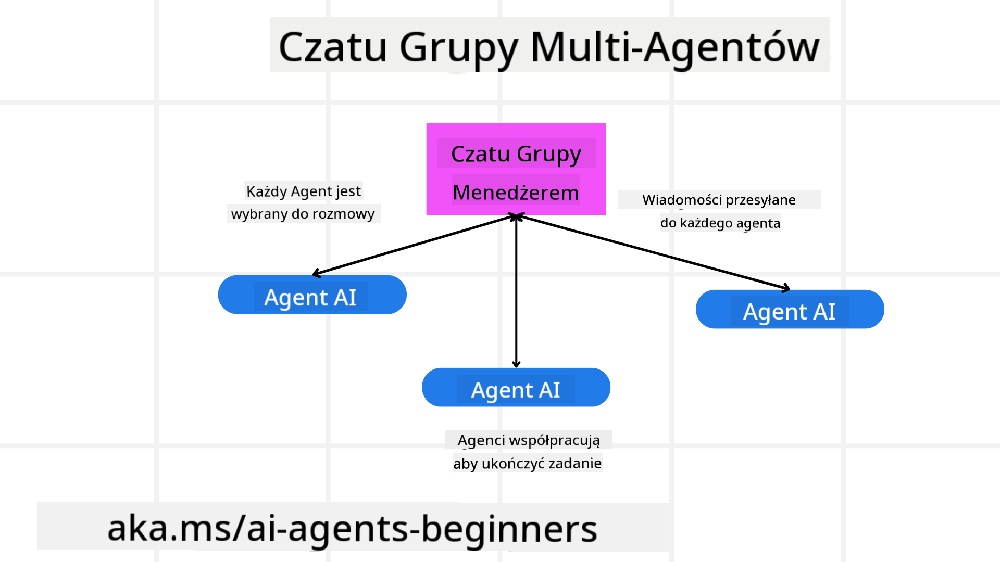
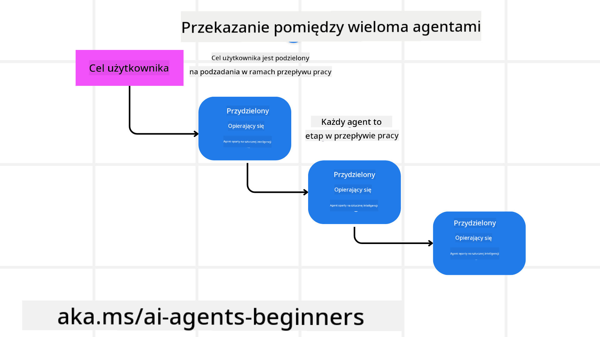
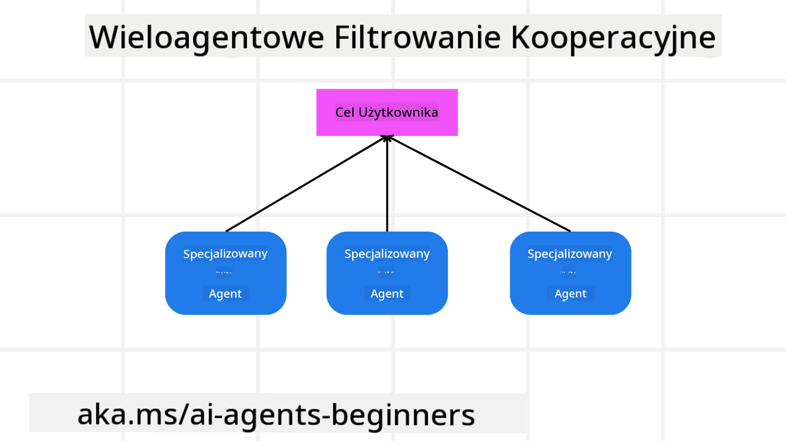

<!--
CO_OP_TRANSLATOR_METADATA:
{
  "original_hash": "bdb0a92e5a437d5fa985a6863f4a836c",
  "translation_date": "2025-03-28T09:31:42+00:00",
  "source_file": "08-multi-agent\\README.md",
  "language_code": "pl"
}
-->

> _(Kliknij obrazek powyżej, aby obejrzeć wideo do tej lekcji)_

# Wzorce projektowania wieloagentowego

Gdy tylko zaczniesz pracować nad projektem, który obejmuje wiele agentów, będziesz musiał rozważyć wzorzec projektowania wieloagentowego. Jednak może nie być od razu jasne, kiedy przejść na podejście wieloagentowe i jakie są jego zalety.

## Wprowadzenie

W tej lekcji chcemy odpowiedzieć na następujące pytania:

- W jakich scenariuszach warto zastosować podejście wieloagentowe?
- Jakie są korzyści wynikające z zastosowania wielu agentów w porównaniu z jednym agentem realizującym wiele zadań?
- Jakie są podstawowe elementy wdrażania wzorca projektowania wieloagentowego?
- Jak uzyskać wgląd w interakcje między wieloma agentami?

## Cele nauki

Po tej lekcji powinieneś być w stanie:

- Zidentyfikować scenariusze, w których podejście wieloagentowe ma zastosowanie.
- Rozpoznać korzyści wynikające z zastosowania wielu agentów w porównaniu z jednym agentem.
- Zrozumieć podstawowe elementy wdrażania wzorca projektowania wieloagentowego.

Jak wygląda szerszy kontekst?

*Wielu agentów to wzorzec projektowania, który pozwala na współpracę wielu agentów w celu osiągnięcia wspólnego celu.*

Ten wzorzec jest szeroko stosowany w różnych dziedzinach, takich jak robotyka, systemy autonomiczne i obliczenia rozproszone.

## Scenariusze, w których zastosowanie wielu agentów jest odpowiednie

Jakie scenariusze są dobrym przypadkiem użycia dla podejścia wieloagentowego? Odpowiedź brzmi, że istnieje wiele sytuacji, w których zastosowanie wielu agentów jest korzystne, szczególnie w następujących przypadkach:

- **Duże obciążenie pracą**: Duże obciążenia można podzielić na mniejsze zadania i przypisać je różnym agentom, co pozwala na przetwarzanie równoległe i szybsze ukończenie. Przykładem może być duże zadanie przetwarzania danych.
- **Złożone zadania**: Złożone zadania, podobnie jak duże obciążenia, można podzielić na mniejsze podzadania i przypisać je różnym agentom, z których każdy specjalizuje się w konkretnym aspekcie zadania. Dobrym przykładem są pojazdy autonomiczne, gdzie różni agenci zarządzają nawigacją, wykrywaniem przeszkód i komunikacją z innymi pojazdami.
- **Różnorodne kompetencje**: Różni agenci mogą mieć różnorodne kompetencje, co pozwala im skuteczniej radzić sobie z różnymi aspektami zadania niż jeden agent. W tym przypadku dobrym przykładem jest opieka zdrowotna, gdzie agenci mogą zarządzać diagnostyką, planami leczenia i monitorowaniem pacjenta.

## Korzyści wynikające z zastosowania wielu agentów w porównaniu z jednym agentem

System jednego agenta może dobrze sprawdzać się w przypadku prostych zadań, ale w przypadku bardziej złożonych zadań zastosowanie wielu agentów może przynieść kilka korzyści:

- **Specjalizacja**: Każdy agent może być wyspecjalizowany w konkretnym zadaniu. Brak specjalizacji w przypadku jednego agenta oznacza, że może on wykonywać wszystko, ale może mieć trudności z realizacją złożonych zadań. Na przykład może podjąć się zadania, do którego nie jest najlepiej przystosowany.
- **Skalowalność**: Łatwiej jest skalować systemy poprzez dodanie większej liczby agentów niż przeciążenie jednego agenta.
- **Odporność na awarie**: Jeśli jeden agent zawiedzie, inni mogą nadal działać, zapewniając niezawodność systemu.

Weźmy przykład: zarezerwujmy wycieczkę dla użytkownika. System jednego agenta musiałby obsłużyć wszystkie aspekty procesu rezerwacji, od wyszukiwania lotów po rezerwację hoteli i samochodów do wynajęcia. Aby to osiągnąć, agent musiałby mieć narzędzia do obsługi wszystkich tych zadań. Może to prowadzić do skomplikowanego i monolitycznego systemu, który trudno utrzymać i skalować. System wieloagentowy, z drugiej strony, mógłby mieć różnych agentów wyspecjalizowanych w wyszukiwaniu lotów, rezerwacji hoteli i samochodów do wynajęcia. Dzięki temu system byłby bardziej modułowy, łatwiejszy w utrzymaniu i skalowalny.

Porównaj to z biurem podróży prowadzonym jako mały rodzinny sklep kontra biurem podróży prowadzonym jako franczyza. Mały rodzinny sklep miałby jednego agenta obsługującego wszystkie aspekty procesu rezerwacji, podczas gdy franczyza miałaby różnych agentów zajmujących się różnymi aspektami procesu rezerwacji.

## Podstawowe elementy wdrażania wzorca projektowania wieloagentowego

Zanim będziesz mógł wdrożyć wzorzec projektowania wieloagentowego, musisz zrozumieć elementy składowe, które go tworzą.

Uczyńmy to bardziej konkretnym, ponownie przyglądając się przykładowi rezerwacji wycieczki dla użytkownika. W tym przypadku elementy składowe obejmowałyby:

- **Komunikacja między agentami**: Agenci odpowiedzialni za wyszukiwanie lotów, rezerwację hoteli i samochodów do wynajęcia muszą się komunikować i dzielić informacjami na temat preferencji i ograniczeń użytkownika. Musisz zdecydować o protokołach i metodach tej komunikacji. Oznacza to, że agent odpowiedzialny za wyszukiwanie lotów musi komunikować się z agentem odpowiedzialnym za rezerwację hoteli, aby upewnić się, że hotel jest zarezerwowany na te same daty co lot. To oznacza, że agenci muszą dzielić się informacjami o datach podróży użytkownika, co oznacza, że musisz zdecydować *które agenty dzielą się informacjami i jak się nimi dzielą*.
- **Mechanizmy koordynacji**: Agenci muszą koordynować swoje działania, aby upewnić się, że preferencje i ograniczenia użytkownika są spełnione. Preferencją użytkownika może być hotel blisko lotniska, a ograniczeniem może być dostępność samochodów do wynajęcia tylko na lotnisku. Oznacza to, że agent odpowiedzialny za rezerwację hoteli musi koordynować działania z agentem odpowiedzialnym za rezerwację samochodów do wynajęcia, aby upewnić się, że preferencje i ograniczenia użytkownika są spełnione. To oznacza, że musisz zdecydować *jak agenci koordynują swoje działania*.
- **Architektura agentów**: Agenci muszą mieć wewnętrzną strukturę pozwalającą na podejmowanie decyzji i uczenie się na podstawie interakcji z użytkownikiem. Oznacza to, że agent odpowiedzialny za wyszukiwanie lotów musi mieć wewnętrzną strukturę pozwalającą na podejmowanie decyzji o tym, które loty polecić użytkownikowi. To oznacza, że musisz zdecydować *jak agenci podejmują decyzje i uczą się na podstawie interakcji z użytkownikiem*. Przykłady tego, jak agent się uczy i rozwija, mogą obejmować użycie modelu uczenia maszynowego przez agenta odpowiedzialnego za wyszukiwanie lotów, który rekomenduje loty użytkownikowi na podstawie jego wcześniejszych preferencji.
- **Widoczność interakcji między agentami**: Musisz mieć wgląd w to, jak wieloagentowe systemy współdziałają ze sobą. Oznacza to, że musisz mieć narzędzia i techniki do śledzenia działań i interakcji agentów. Może to być w formie narzędzi do logowania i monitorowania, narzędzi do wizualizacji oraz metryk wydajności.
- **Wzorce wieloagentowe**: Istnieją różne wzorce wdrażania systemów wieloagentowych, takie jak architektury scentralizowane, zdecentralizowane i hybrydowe. Musisz zdecydować, który wzorzec najlepiej pasuje do twojego przypadku użycia.
- **Człowiek w procesie**: W większości przypadków będziesz miał człowieka w procesie i musisz poinstruować agentów, kiedy mają prosić o interwencję człowieka. Może to być w formie użytkownika proszącego o konkretny hotel lub lot, którego agenci nie polecili, lub proszącego o potwierdzenie przed dokonaniem rezerwacji lotu lub hotelu.

## Widoczność interakcji między agentami

Ważne jest, aby mieć wgląd w to, jak wieloagentowe systemy współdziałają ze sobą. Ta widoczność jest kluczowa dla debugowania, optymalizacji i zapewnienia skuteczności całego systemu. Aby to osiągnąć, musisz mieć narzędzia i techniki do śledzenia działań i interakcji agentów. Może to być w formie narzędzi do logowania i monitorowania, narzędzi do wizualizacji oraz metryk wydajności.

Na przykład w przypadku rezerwacji wycieczki dla użytkownika możesz mieć pulpit, który pokazuje status każdego agenta, preferencje i ograniczenia użytkownika oraz interakcje między agentami. Ten pulpit może pokazywać daty podróży użytkownika, loty polecane przez agenta lotów, hotele polecane przez agenta hoteli oraz samochody do wynajęcia polecane przez agenta wynajmu samochodów. Dzięki temu uzyskasz jasny obraz tego, jak agenci współdziałają ze sobą i czy preferencje i ograniczenia użytkownika są spełnione.

Przyjrzyjmy się bardziej szczegółowo każdemu z tych aspektów.

- **Narzędzia do logowania i monitorowania**: Chcesz, aby każde działanie podjęte przez agenta było logowane. Wpis w logu może zawierać informacje o agencie, który podjął działanie, działaniu, czasie jego podjęcia i wyniku działania. Te informacje mogą być następnie używane do debugowania, optymalizacji i innych celów.

- **Narzędzia do wizualizacji**: Narzędzia do wizualizacji mogą pomóc w bardziej intuicyjnym zobaczeniu interakcji między agentami. Na przykład możesz mieć graf, który pokazuje przepływ informacji między agentami. To może pomóc w identyfikacji wąskich gardeł, nieefektywności i innych problemów w systemie.

- **Metryki wydajności**: Metryki wydajności mogą pomóc w śledzeniu skuteczności systemu wieloagentowego. Na przykład możesz śledzić czas potrzebny na ukończenie zadania, liczbę ukończonych zadań na jednostkę czasu oraz dokładność rekomendacji składanych przez agentów. Te informacje mogą pomóc w identyfikacji obszarów wymagających poprawy i optymalizacji systemu.

## Wzorce wieloagentowe

Przyjrzyjmy się konkretnym wzorcom, które można wykorzystać do tworzenia aplikacji wieloagentowych. Oto kilka interesujących wzorców, które warto rozważyć:

### Czat grupowy

Ten wzorzec jest przydatny, gdy chcesz stworzyć aplikację czatu grupowego, w której wielu agentów może się komunikować. Typowe przypadki użycia tego wzorca obejmują współpracę zespołową, obsługę klienta i sieci społecznościowe.

W tym wzorcu każdy agent reprezentuje użytkownika w czacie grupowym, a wiadomości są wymieniane między agentami za pomocą protokołu komunikacyjnego. Agenci mogą wysyłać wiadomości do czatu grupowego, odbierać wiadomości z czatu grupowego i odpowiadać na wiadomości od innych agentów.

Ten wzorzec można zaimplementować za pomocą architektury scentralizowanej, gdzie wszystkie wiadomości są przekazywane przez centralny serwer, lub architektury zdecentralizowanej, gdzie wiadomości są wymieniane bezpośrednio.

### Przekazywanie zadań

Ten wzorzec jest przydatny, gdy chcesz stworzyć aplikację, w której wielu agentów może przekazywać sobie zadania.

Typowe przypadki użycia tego wzorca obejmują obsługę klienta, zarządzanie zadaniami i automatyzację przepływu pracy.

W tym wzorcu każdy agent reprezentuje zadanie lub krok w przepływie pracy, a agenci mogą przekazywać zadania innym agentom na podstawie zdefiniowanych reguł.

### Filtracja współpracy

Ten wzorzec jest przydatny, gdy chcesz stworzyć aplikację, w której wielu agentów może współpracować, aby rekomendować użytkownikom różne opcje.

Dlaczego warto, aby wielu agentów współpracowało? Ponieważ każdy agent może mieć różne kompetencje i wnosić różne wartości do procesu rekomendacji.

Weźmy przykład, w którym użytkownik chce uzyskać rekomendację najlepszej akcji do kupienia na rynku giełdowym.

- **Ekspert branżowy**: Jeden agent może być ekspertem w konkretnej branży.
- **Analiza techniczna**: Inny agent może być ekspertem w analizie technicznej.
- **Analiza fundamentalna**: Jeszcze inny agent może być ekspertem w analizie fundamentalnej. Dzięki współpracy ci agenci mogą dostarczyć bardziej kompleksową rekomendację użytkownikowi.

## Scenariusz: Proces zwrotu

Rozważmy scenariusz, w którym klient próbuje uzyskać zwrot pieniędzy za produkt. Może być zaangażowanych wiele agentów, ale podzielmy je na agentów specyficznych dla tego procesu oraz agentów ogólnych, którzy mogą być używani w innych procesach.

**Agenci specyficzni dla procesu zwrotu**:

Poniżej znajdują się niektórzy agenci, którzy mogą być zaangażowani w proces zwrotu:

- **Agent klienta**: Ten agent reprezentuje klienta i jest odpowiedzialny za inicjowanie procesu zwrotu.
- **Agent sprzedawcy**: Ten agent reprezentuje sprzedawcę i jest odpowiedzialny za przetwarzanie zwrotu.
- **Agent płatności**: Ten agent reprezentuje proces płatności i jest odpowiedzialny za zwrot pieniędzy klientowi.
- **Agent rozwiązywania problemów**: Ten agent reprezentuje proces rozwiązywania problemów i jest odpowiedzialny za rozwiązywanie wszelkich problemów, które mogą pojawić się podczas procesu zwrotu.
- **Agent zgodności**: Ten agent reprezentuje proces zgodności i jest odpowiedzialny za zapewnienie, że proces zwrotu jest zgodny z przepisami i politykami.

**Agenci ogólni**:

Ci agenci mogą być używani przez inne części twojego biznesu.

- **Agent wysyłki**: Ten agent reprezentuje proces wysyłki i jest odpowiedzialny za wysyłkę produktu z powrotem do sprzedawcy. Ten agent może być używany zarówno w procesie zwrotu, jak i w ogólnej wysyłce produktu, na przykład w przypadku zakupu.
- **Agent opinii**: Ten agent reprezentuje proces opinii i jest odpowiedzialny za zbieranie opinii od klienta. Opinie mogą być zbierane w dowolnym momencie, nie tylko podczas procesu zwrotu.
- **Agent eskalacji**: Ten agent reprezentuje proces eskalacji i jest odpowiedzialny za eskalację problemów na wyższy poziom wsparcia. Tego typu agent można używać w dowolnym procesie, w którym konieczna jest eskalacja problemu.
- **Agent powiadomień**: Ten agent reprezentuje proces powiadomień i jest odpowiedzialny za wysyłanie powiadomień do klienta na różnych etapach procesu zwrotu.
- **Agent analityki**: Ten agent reprezentuje proces analityki i jest odpowiedzialny za analizowanie danych związanych z procesem zwrotu.
- **Agent audytu**: Ten agent reprezentuje proces audytu i jest odpowiedzialny za audytowanie procesu zwrotu w celu upewnienia się, że jest on przeprowadzany poprawnie.
- **Agent raportowania**: Ten agent reprezentuje proces raportowania i jest odpowiedzialny za generowanie raportów dotyczących procesu zwrotu.
- **Agent wiedzy**: Ten agent reprezentuje proces wiedzy i jest odpowiedzialny za utrzymywanie bazy wiedzy związanej z procesem zwrotu. Ten agent może posiadać wiedzę zarówno o zwrotach, jak i innych częściach twojego biznesu.
- **Agent bezpieczeństwa**: Ten agent reprezentuje proces bezpieczeństwa i jest odpowiedzialny za zapewnienie bezpieczeństwa procesu zwrotu.
- **Agent jakości**: Ten agent reprezentuje proces jakości i jest odpowiedzialny za zapewnienie jakości procesu zwrotu.

Wymieniono wiele agentów zarówno specyficznych dla procesu zwrotu, jak i ogólnych, które mogą być używane w innych częściach twojego biznesu. Mamy nad

**Zastrzeżenie**:  
Ten dokument został przetłumaczony za pomocą usługi tłumaczenia AI [Co-op Translator](https://github.com/Azure/co-op-translator). Chociaż staramy się zapewnić dokładność, prosimy pamiętać, że automatyczne tłumaczenia mogą zawierać błędy lub nieścisłości. Oryginalny dokument w jego rodzimym języku powinien być uznawany za autorytatywne źródło. W przypadku kluczowych informacji zaleca się skorzystanie z profesjonalnego tłumaczenia przez człowieka. Nie ponosimy odpowiedzialności za jakiekolwiek nieporozumienia lub błędne interpretacje wynikające z użycia tego tłumaczenia.