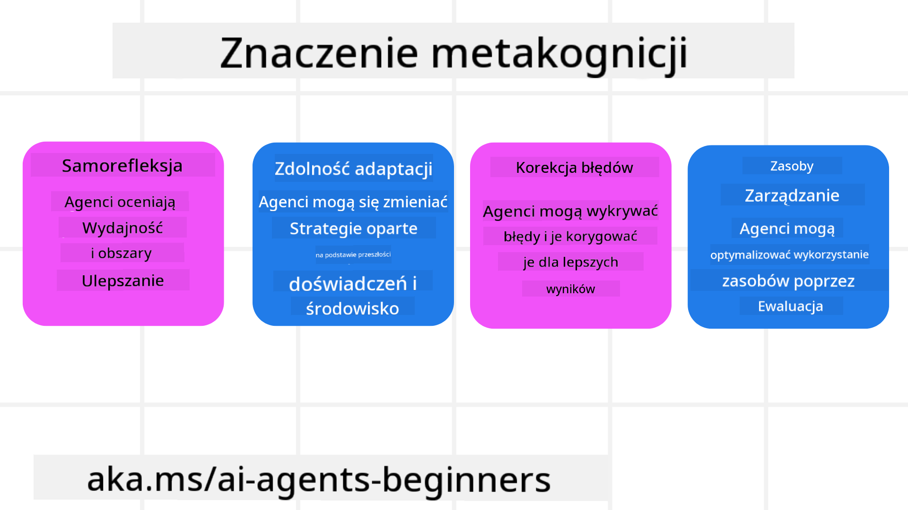
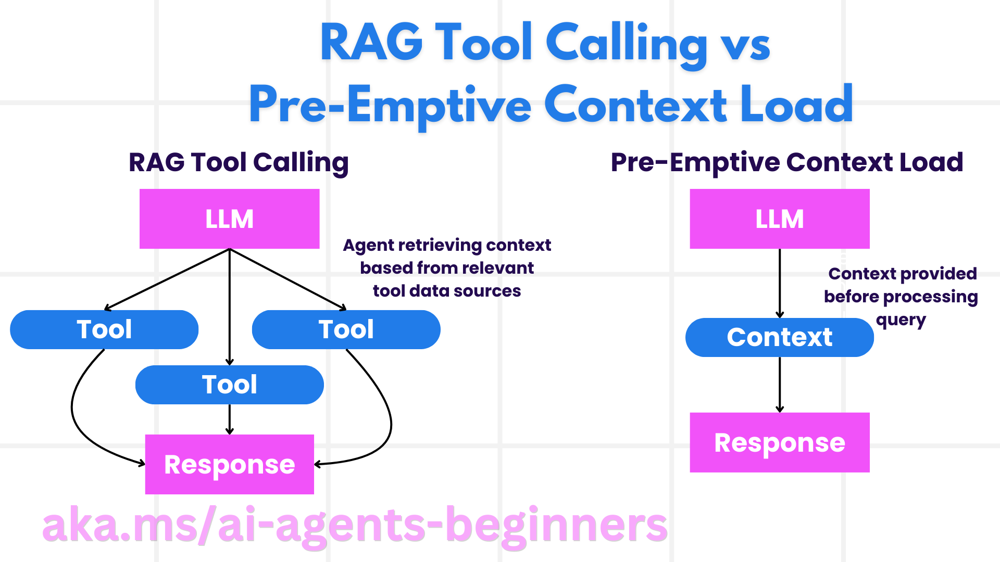

<!--
CO_OP_TRANSLATOR_METADATA:
{
  "original_hash": "3171ed887315c3ddeaccf966e40e9a50",
  "translation_date": "2025-03-28T09:36:35+00:00",
  "source_file": "09-metacognition\\README.md",
  "language_code": "pl"
}
-->
[](https://youtu.be/His9R6gw6Ec?si=3_RMb8VprNvdLRhX)

> _(Kliknij obrazek powyżej, aby obejrzeć wideo z tej lekcji)_
# Metakognicja w agentach AI ## Wprowadzenie Witaj w lekcji dotyczącej metakognicji w agentach AI! Ten rozdział jest przeznaczony dla początkujących, którzy chcą dowiedzieć się, jak agenci AI mogą analizować swoje własne procesy myślowe. Po zakończeniu tej lekcji zrozumiesz kluczowe pojęcia i zdobędziesz praktyczne przykłady zastosowania metakognicji w projektowaniu agentów AI. ## Cele nauki Po ukończeniu tej lekcji będziesz w stanie: 1. Zrozumieć znaczenie pętli rozumowania w definicji agentów. 2. Stosować techniki planowania i oceny w celu wspierania agentów samokorygujących się. 3. Tworzyć własnych agentów zdolnych do manipulowania kodem w celu realizacji zadań. ## Wprowadzenie do metakognicji Metakognicja odnosi się do wyższych procesów poznawczych, które polegają na analizowaniu własnego sposobu myślenia. Dla agentów AI oznacza to umiejętność oceny i dostosowywania swoich działań na podstawie samoświadomości i wcześniejszych doświadczeń. Metakognicja, czyli "myślenie o myśleniu", jest ważnym pojęciem w rozwoju systemów agentowych AI. Oznacza, że systemy AI są świadome swoich własnych procesów wewnętrznych i potrafią monitorować, regulować oraz dostosowywać swoje zachowanie. Podobnie jak my, kiedy analizujemy sytuację lub rozwiązujemy problem. Ta samoświadomość może pomóc systemom AI podejmować lepsze decyzje, identyfikować błędy i poprawiać swoją wydajność w czasie – nawiązując do testu Turinga i debaty, czy AI przejmie kontrolę. W kontekście systemów agentowych AI metakognicja może pomóc rozwiązać kilka wyzwań, takich jak: - Przejrzystość: Zapewnienie, że systemy AI mogą wyjaśniać swoje rozumowanie i decyzje. - Rozumowanie: Zwiększenie zdolności systemów AI do syntezowania informacji i podejmowania trafnych decyzji. - Adaptacja: Umożliwienie systemom AI dostosowania się do nowych środowisk i zmieniających się warunków. - Percepcja: Poprawa dokładności systemów AI w rozpoznawaniu i interpretowaniu danych z otoczenia. ### Czym jest metakognicja? Metakognicja, czyli "myślenie o myśleniu", to wyższy proces poznawczy, który obejmuje samoświadomość i samoregulację własnych procesów poznawczych. W obszarze AI metakognicja pozwala agentom oceniać i dostosowywać swoje strategie oraz działania, co prowadzi do lepszego rozwiązywania problemów i podejmowania decyzji. Dzięki zrozumieniu metakognicji możesz projektować agentów AI, którzy są nie tylko bardziej inteligentni, ale także bardziej elastyczni i efektywni. W prawdziwej metakognicji widzielibyśmy, jak AI jawnie rozważa swoje własne rozumowanie. Przykład: „Priorytetowo traktowałem tańsze loty, ponieważ… Mogę pomijać loty bezpośrednie, więc sprawdzę to ponownie.”. Śledzenie, jak i dlaczego wybrał określoną trasę. - Zauważanie błędów wynikających z nadmiernego polegania na preferencjach użytkownika z poprzedniego razu i modyfikowanie swojej strategii decyzyjnej, a nie tylko końcowej rekomendacji. - Diagnozowanie wzorców, takich jak: „Za każdym razem, gdy użytkownik wspomina „zbyt tłoczno”, powinienem nie tylko usuwać określone atrakcje, ale także rozważyć, że moja metoda wyboru „najlepszych atrakcji” jest wadliwa, jeśli zawsze kieruję się popularnością.” ### Znaczenie metakognicji w agentach AI Metakognicja odgrywa kluczową rolę w projektowaniu agentów AI z kilku powodów:  - Samorefleksja: Agenci mogą oceniać swoje działania i identyfikować obszary wymagające poprawy. - Adaptacja: Agenci mogą modyfikować swoje strategie na podstawie wcześniejszych doświadczeń i zmieniających się warunków. - Korekcja błędów: Agenci mogą autonomicznie wykrywać i poprawiać błędy, co prowadzi do bardziej precyzyjnych wyników. - Zarządzanie zasobami: Agenci mogą optymalizować wykorzystanie zasobów, takich jak czas i moc obliczeniowa, poprzez planowanie i ocenę swoich działań. ## Komponenty agenta AI Zanim zagłębimy się w procesy metakognitywne, ważne jest zrozumienie podstawowych komponentów agenta AI. Agent AI zazwyczaj składa się z: - Persona: Osobowość i cechy agenta, które definiują sposób jego interakcji z użytkownikami. - Narzędzia: Zdolności i funkcje, które agent może wykonywać. - Umiejętności: Wiedza i ekspertyza, którą agent posiada. Te komponenty współpracują, tworząc "jednostkę ekspertyzy", która może realizować określone zadania. **Przykład**: Rozważ agenta podróży, który nie tylko planuje Twoje wakacje, ale także dostosowuje swoją ścieżkę na podstawie danych w czasie rzeczywistym i wcześniejszych doświadczeń klientów. ### Przykład: Metakognicja w serwisie agenta podróży Wyobraź sobie, że projektujesz serwis agenta podróży zasilany AI. Ten agent, "Travel Agent", pomaga użytkownikom w planowaniu ich wakacji. Aby uwzględnić metakognicję, Travel Agent musi oceniać i dostosowywać swoje działania na podstawie samoświadomości i wcześniejszych doświadczeń. Oto jak metakognicja mogłaby odegrać rolę: #### Obecne zadanie Obecnym zadaniem jest pomoc użytkownikowi w zaplanowaniu podróży do Paryża. #### Kroki realizacji zadania 1. **Zbieranie preferencji użytkownika**: Zapytaj użytkownika o daty podróży, budżet, zainteresowania (np. muzea, kuchnia, zakupy) oraz wszelkie szczególne wymagania. 2. **Pobieranie informacji**: Wyszukaj opcje lotów, zakwaterowania, atrakcji i restauracji, które odpowiadają preferencjom użytkownika. 3. **Generowanie rekomendacji**: Zaproponuj spersonalizowany plan podróży zawierający szczegóły lotów, rezerwacje hotelowe i sugerowane aktywności. 4. **Dostosowanie na podstawie opinii**: Poproś użytkownika o opinię na temat rekomendacji i wprowadź niezbędne poprawki. #### Wymagane zasoby - Dostęp do baz danych rezerwacji lotów i hoteli. - Informacje o atrakcjach i restauracjach w Paryżu. - Dane opinii użytkowników z wcześniejszych interakcji. #### Doświadczenie i samorefleksja Travel Agent korzysta z metakognicji, aby ocenić swoje działania i uczyć się na podstawie wcześniejszych doświadczeń. Na przykład: 1. **Analiza opinii użytkownika**: Travel Agent analizuje opinie użytkownika, aby określić, które rekomendacje były dobrze odebrane, a które nie. Odpowiednio dostosowuje swoje przyszłe sugestie. 2. **Adaptacja**: Jeśli użytkownik wcześniej wspomniał o niechęci do zatłoczonych miejsc, Travel Agent unika rekomendowania popularnych atrakcji w godzinach szczytu w przyszłości. 3. **Korekcja błędów**: Jeśli Travel Agent popełnił błąd w poprzedniej rezerwacji, np. sugerując hotel, który był w pełni zarezerwowany, uczy się, aby bardziej dokładnie sprawdzać dostępność przed składaniem rekomendacji. #### Praktyczny przykład dla programistów Oto uproszczony przykład, jak może wyglądać kod Travel Agent uwzględniający metakognicję: ```python
class Travel_Agent:
    def __init__(self):
        self.user_preferences = {}
        self.experience_data = []

    def gather_preferences(self, preferences):
        self.user_preferences = preferences

    def retrieve_information(self):
        # Search for flights, hotels, and attractions based on preferences
        flights = search_flights(self.user_preferences)
        hotels = search_hotels(self.user_preferences)
        attractions = search_attractions(self.user_preferences)
        return flights, hotels, attractions

    def generate_recommendations(self):
        flights, hotels, attractions = self.retrieve_information()
        itinerary = create_itinerary(flights, hotels, attractions)
        return itinerary

    def adjust_based_on_feedback(self, feedback):
        self.experience_data.append(feedback)
        # Analyze feedback and adjust future recommendations
        self.user_preferences = adjust_preferences(self.user_preferences, feedback)

# Example usage
travel_agent = Travel_Agent()
preferences = {
    "destination": "Paris",
    "dates": "2025-04-01 to 2025-04-10",
    "budget": "moderate",
    "interests": ["museums", "cuisine"]
}
travel_agent.gather_preferences(preferences)
itinerary = travel_agent.generate_recommendations()
print("Suggested Itinerary:", itinerary)
feedback = {"liked": ["Louvre Museum"], "disliked": ["Eiffel Tower (too crowded)"]}
travel_agent.adjust_based_on_feedback(feedback)
``` #### Dlaczego metakognicja ma znaczenie - **Samorefleksja**: Agenci mogą analizować swoje działania i identyfikować obszary wymagające poprawy. - **Adaptacja**: Agenci mogą modyfikować strategie na podstawie opinii i zmieniających się warunków. - **Korekcja błędów**: Agenci mogą autonomicznie wykrywać i poprawiać błędy. - **Zarządzanie zasobami**: Agenci mogą optymalizować wykorzystanie zasobów, takich jak czas i moc obliczeniowa. Dzięki uwzględnieniu metakognicji Travel Agent może oferować bardziej spersonalizowane i precyzyjne rekomendacje podróżne, poprawiając ogólne doświadczenie użytkownika. --- ## 2. Planowanie w agentach Planowanie jest kluczowym elementem zachowania agentów AI. Polega na określeniu kroków potrzebnych do osiągnięcia celu, z uwzględnieniem obecnego stanu, zasobów i możliwych przeszkód. ### Elementy planowania - **Obecne zadanie**: Jasno zdefiniuj zadanie. - **Kroki realizacji zadania**: Podziel zadanie na możliwe do wykonania kroki. - **Wymagane zasoby**: Określ niezbędne zasoby. - **Doświadczenie**: Wykorzystaj wcześniejsze doświadczenia do informowania planowania. **Przykład**: Oto kroki, które Travel Agent musi podjąć, aby skutecznie pomóc użytkownikowi w planowaniu podróży: ### Kroki dla Travel Agent 1. **Zbieranie preferencji użytkownika** - Zapytaj użytkownika o szczegóły dotyczące dat podróży, budżetu, zainteresowań i wszelkich szczególnych wymagań. - Przykłady: „Kiedy planujesz podróż?” „Jaki jest Twój przedział budżetowy?” „Jakie aktywności lubisz podczas wakacji?” 2. **Pobieranie informacji** - Wyszukaj odpowiednie opcje podróży na podstawie preferencji użytkownika. - **Loty**: Znajdź dostępne loty w ramach budżetu i preferowanych dat podróży użytkownika. - **Zakwaterowanie**: Znajdź hotele lub nieruchomości na wynajem, które odpowiadają preferencjom użytkownika dotyczącym lokalizacji, ceny i udogodnień. - **Atrakcje i restauracje**: Zidentyfikuj popularne atrakcje, aktywności i opcje gastronomiczne zgodne z zainteresowaniami użytkownika. 3. **Generowanie rekomendacji** - Połącz zebrane informacje w spersonalizowany plan podróży. - Podaj szczegóły, takie jak opcje lotów, rezerwacje hotelowe i sugerowane aktywności, dostosowując rekomendacje do preferencji użytkownika. 4. **Przedstawienie planu podróży użytkownikowi** - Udostępnij proponowany plan podróży użytkownikowi do przeglądu. - Przykład: „Oto sugerowany plan podróży do Paryża. Zawiera szczegóły dotyczące lotów, rezerwacji hotelowych oraz listę polecanych aktywności i restauracji. Daj znać, co sądzisz!” 5. **Zbieranie opinii** - Poproś użytkownika o opinię na temat proponowanego planu podróży. - Przykłady: „Czy podobają Ci się opcje lotów?” „Czy hotel odpowiada Twoim potrzebom?” „Czy są jakieś aktywności, które chciałbyś dodać lub usunąć?” 6. **Dostosowanie na podstawie opinii** - Zmień plan podróży na podstawie opinii użytkownika. - Wprowadź niezbędne zmiany w rekomendacjach dotyczących lotów, zakwaterowania i aktywności, aby lepiej odpowiadały preferencjom użytkownika. 7. **Ostateczne potwierdzenie** - Przedstaw zaktualizowany plan podróży użytkownikowi do ostatecznego zatwierdzenia. - Przykład: „Dokonałem zmian na podstawie Twojej opinii. Oto zaktualizowany plan podróży. Czy wszystko wygląda dobrze?” 8. **Rezerwacja i potwierdzenie** - Po zatwierdzeniu planu przez użytkownika, przystąp do rezerwacji lotów, zakwaterowania i wszelkich zaplanowanych aktywności. - Wyślij użytkownikowi szczegóły potwierdzenia. 9. **Zapewnienie wsparcia na bieżąco** - Pozostań dostępny, aby pomóc użytkownikowi w przypadku jakichkolwiek zmian lub dodatkowych próśb przed i w trakcie podróży. - Przykład: „Jeśli potrzebujesz dalszej pomocy podczas podróży, skontaktuj się ze mną w dowolnym momencie!” ### Przykład interakcji ```python
class Travel_Agent:
    def __init__(self):
        self.user_preferences = {}
        self.experience_data = []

    def gather_preferences(self, preferences):
        self.user_preferences = preferences

    def retrieve_information(self):
        flights = search_flights(self.user_preferences)
        hotels = search_hotels(self.user_preferences)
        attractions = search_attractions(self.user_preferences)
        return flights, hotels, attractions

    def generate_recommendations(self):
        flights, hotels, attractions = self.retrieve_information()
        itinerary = create_itinerary(flights, hotels, attractions)
        return itinerary

    def adjust_based_on_feedback(self, feedback):
        self.experience_data.append(feedback)
        self.user_preferences = adjust_preferences(self.user_preferences, feedback)

# Example usage within a booing request
travel_agent = Travel_Agent()
preferences = {
    "destination": "Paris",
    "dates": "2025-04-01 to 2025-04-10",
    "budget": "moderate",
    "interests": ["museums", "cuisine"]
}
travel_agent.gather_preferences(preferences)
itinerary = travel_agent.generate_recommendations()
print("Suggested Itinerary:", itinerary)
feedback = {"liked": ["Louvre Museum"], "disliked": ["Eiffel Tower (too crowded)"]}
travel_agent.adjust_based_on_feedback(feedback)
``` ## 3. Korekcyjny system RAG Najpierw zacznijmy od zrozumienia różnicy między narzędziem RAG a wczytywaniem kontekstu zapobiegawczego  ### Retrieval-Augmented Generation (RAG) RAG łączy system wyszukiwania z modelem generatywnym. Gdy zadane jest zapytanie, system wyszukiwania pobiera odpowiednie dokumenty lub dane z zewnętrznego źródła, a pobrane informacje są wykorzystywane do wzbogacenia wejścia dla modelu generatywnego. Dzięki temu model generuje bardziej precyzyjne i kontekstowo odpowiednie odpowiedzi. W systemie RAG agent pobiera odpowiednie informacje z bazy wiedzy i wykorzystuje je do generowania odpowiednich odpowiedzi lub działań. ### Korekcyjne podejście RAG Korekcyjne podejście RAG koncentruje się na wykorzystaniu technik RAG do poprawy błędów i zwiększenia precyzji agentów AI. Obejmuje to: 1. **Technika podpowiedzi**: Użycie konkretnych podpowiedzi, aby kierować agenta w wyszukiwaniu odpowiednich informacji. 2. **Narzędzie**: Implementacja algorytmów i mechanizmów umożliwiających agentowi ocenę trafności pobranych informacji i generowanie precyzyjnych odpowiedzi. 3. **Ocena**: Ciągłe monitorowanie działania agenta i wprowadzanie poprawek w celu zwiększenia jego precyzji i efektywności. ####
Poprawne RAG w agencie wyszukiwania Rozważ agenta wyszukiwania, który pobiera informacje z internetu, aby odpowiedzieć na zapytania użytkowników. Podejście Corrective RAG może obejmować: 1. **Technika podpowiedzi**: Formułowanie zapytań wyszukiwania na podstawie danych wejściowych użytkownika. 2. **Narzędzie**: Wykorzystanie algorytmów przetwarzania języka naturalnego i uczenia maszynowego do oceniania i filtrowania wyników wyszukiwania. 3. **Ocena**: Analiza opinii użytkowników w celu identyfikacji i poprawy nieścisłości w pobranych informacjach.

### Corrective RAG w agencie podróży Corrective RAG (Retrieval-Augmented Generation) zwiększa zdolność AI do pobierania i generowania informacji, jednocześnie poprawiając wszelkie nieścisłości. Zobaczmy, jak agent podróży może wykorzystać podejście Corrective RAG, aby dostarczać bardziej precyzyjne i odpowiednie rekomendacje podróży. Obejmuje to: - **Technika podpowiedzi:** Używanie konkretnych podpowiedzi, aby kierować agenta w pobieraniu odpowiednich informacji. - **Narzędzie:** Wdrożenie algorytmów i mechanizmów umożliwiających agentowi ocenę trafności pobranych informacji i generowanie precyzyjnych odpowiedzi. - **Ocena:** Ciągła ocena wydajności agenta i wprowadzanie zmian w celu poprawy jego dokładności i efektywności.

#### Kroki wdrożenia Corrective RAG w agencie podróży 1. **Początkowa interakcja z użytkownikiem** - Agent podróży zbiera początkowe preferencje użytkownika, takie jak miejsce docelowe, daty podróży, budżet i zainteresowania. - Przykład: ```python
     preferences = {
         "destination": "Paris",
         "dates": "2025-04-01 to 2025-04-10",
         "budget": "moderate",
         "interests": ["museums", "cuisine"]
     }
     ``` 2. **Pobieranie informacji** - Agent podróży pobiera informacje o lotach, zakwaterowaniu, atrakcjach i restauracjach na podstawie preferencji użytkownika. - Przykład: ```python
     flights = search_flights(preferences)
     hotels = search_hotels(preferences)
     attractions = search_attractions(preferences)
     ``` 3. **Generowanie początkowych rekomendacji** - Agent podróży wykorzystuje pobrane informacje do stworzenia spersonalizowanego planu podróży. - Przykład: ```python
     itinerary = create_itinerary(flights, hotels, attractions)
     print("Suggested Itinerary:", itinerary)
     ``` 4. **Zbieranie opinii użytkownika** - Agent podróży prosi użytkownika o opinię na temat początkowych rekomendacji. - Przykład: ```python
     feedback = {
         "liked": ["Louvre Museum"],
         "disliked": ["Eiffel Tower (too crowded)"]
     }
     ``` 5. **Proces Corrective RAG** - **Technika podpowiedzi**: Agent podróży formułuje nowe zapytania wyszukiwania na podstawie opinii użytkownika. - Przykład: ```python
       if "disliked" in feedback:
           preferences["avoid"] = feedback["disliked"]
       ``` - **Narzędzie**: Agent podróży używa algorytmów do oceniania i filtrowania nowych wyników wyszukiwania, podkreślając trafność na podstawie opinii użytkownika. - Przykład: ```python
       new_attractions = search_attractions(preferences)
       new_itinerary = create_itinerary(flights, hotels, new_attractions)
       print("Updated Itinerary:", new_itinerary)
       ``` - **Ocena**: Agent podróży ciągle ocenia trafność i dokładność swoich rekomendacji, analizując opinie użytkowników i wprowadzając niezbędne zmiany. - Przykład: ```python
       def adjust_preferences(preferences, feedback):
           if "liked" in feedback:
               preferences["favorites"] = feedback["liked"]
           if "disliked" in feedback:
               preferences["avoid"] = feedback["disliked"]
           return preferences

       preferences = adjust_preferences(preferences, feedback)
       ```

#### Praktyczny przykład Oto uproszczony przykład kodu w Pythonie, który wykorzystuje podejście Corrective RAG w agencie podróży: ```python
class Travel_Agent:
    def __init__(self):
        self.user_preferences = {}
        self.experience_data = []

    def gather_preferences(self, preferences):
        self.user_preferences = preferences

    def retrieve_information(self):
        flights = search_flights(self.user_preferences)
        hotels = search_hotels(self.user_preferences)
        attractions = search_attractions(self.user_preferences)
        return flights, hotels, attractions

    def generate_recommendations(self):
        flights, hotels, attractions = self.retrieve_information()
        itinerary = create_itinerary(flights, hotels, attractions)
        return itinerary

    def adjust_based_on_feedback(self, feedback):
        self.experience_data.append(feedback)
        self.user_preferences = adjust_preferences(self.user_preferences, feedback)
        new_itinerary = self.generate_recommendations()
        return new_itinerary

# Example usage
travel_agent = Travel_Agent()
preferences = {
    "destination": "Paris",
    "dates": "2025-04-01 to 2025-04-10",
    "budget": "moderate",
    "interests": ["museums", "cuisine"]
}
travel_agent.gather_preferences(preferences)
itinerary = travel_agent.generate_recommendations()
print("Suggested Itinerary:", itinerary)
feedback = {"liked": ["Louvre Museum"], "disliked": ["Eiffel Tower (too crowded)"]}
new_itinerary = travel_agent.adjust_based_on_feedback(feedback)
print("Updated Itinerary:", new_itinerary)
```

### Pre-emptive Context Load Pre-emptive Context Load polega na ładowaniu odpowiedniego kontekstu lub informacji w tle do modelu przed przetwarzaniem zapytania. Oznacza to, że model ma dostęp do tych informacji od początku, co może pomóc w generowaniu bardziej świadomych odpowiedzi bez konieczności pobierania dodatkowych danych podczas procesu. Oto uproszczony przykład, jak może wyglądać pre-emptive context load dla aplikacji agenta podróży w Pythonie: ```python
class TravelAgent:
    def __init__(self):
        # Pre-load popular destinations and their information
        self.context = {
            "Paris": {"country": "France", "currency": "Euro", "language": "French", "attractions": ["Eiffel Tower", "Louvre Museum"]},
            "Tokyo": {"country": "Japan", "currency": "Yen", "language": "Japanese", "attractions": ["Tokyo Tower", "Shibuya Crossing"]},
            "New York": {"country": "USA", "currency": "Dollar", "language": "English", "attractions": ["Statue of Liberty", "Times Square"]},
            "Sydney": {"country": "Australia", "currency": "Dollar", "language": "English", "attractions": ["Sydney Opera House", "Bondi Beach"]}
        }

    def get_destination_info(self, destination):
        # Fetch destination information from pre-loaded context
        info = self.context.get(destination)
        if info:
            return f"{destination}:\nCountry: {info['country']}\nCurrency: {info['currency']}\nLanguage: {info['language']}\nAttractions: {', '.join(info['attractions'])}"
        else:
            return f"Sorry, we don't have information on {destination}."

# Example usage
travel_agent = TravelAgent()
print(travel_agent.get_destination_info("Paris"))
print(travel_agent.get_destination_info("Tokyo"))
```

#### Wyjaśnienie 1. **Inicjalizacja (`__init__` method)**: The `TravelAgent` class pre-loads a dictionary containing information about popular destinations such as Paris, Tokyo, New York, and Sydney. This dictionary includes details like the country, currency, language, and major attractions for each destination.

2. **Retrieving Information (`get_destination_info` method)**: When a user queries about a specific destination, the `get_destination_info` metoda pobiera odpowiednie informacje z wstępnie załadowanego słownika kontekstu. Dzięki pre-ładowaniu kontekstu aplikacja agenta podróży może szybko odpowiadać na zapytania użytkowników bez konieczności pobierania tych informacji z zewnętrznego źródła w czasie rzeczywistym. To sprawia, że aplikacja jest bardziej wydajna i responsywna.

### Bootstrapping the Plan with a Goal Before Iterating Bootstrapping planu z celem polega na rozpoczęciu od jasnego celu lub oczekiwanego wyniku. Definiując ten cel z góry, model może wykorzystać go jako zasadę przewodnią podczas procesu iteracyjnego. Pomaga to zapewnić, że każda iteracja zbliża się do osiągnięcia pożądanego rezultatu, czyniąc proces bardziej efektywnym i skoncentrowanym. Oto przykład, jak można bootstrapować plan podróży z celem przed iterowaniem dla agenta podróży w Pythonie:

### Scenariusz Agent podróży chce zaplanować spersonalizowane wakacje dla klienta. Celem jest stworzenie planu podróży, który maksymalizuje zadowolenie klienta na podstawie jego preferencji i budżetu.

### Kroki 1. Zdefiniowanie preferencji klienta i budżetu. 2. Bootstrapowanie początkowego planu na podstawie tych preferencji. 3. Iterowanie w celu udoskonalenia planu, optymalizując zadowolenie klienta.

#### Kod w Pythonie ```python
class TravelAgent:
    def __init__(self, destinations):
        self.destinations = destinations

    def bootstrap_plan(self, preferences, budget):
        plan = []
        total_cost = 0

        for destination in self.destinations:
            if total_cost + destination['cost'] <= budget and self.match_preferences(destination, preferences):
                plan.append(destination)
                total_cost += destination['cost']

        return plan

    def match_preferences(self, destination, preferences):
        for key, value in preferences.items():
            if destination.get(key) != value:
                return False
        return True

    def iterate_plan(self, plan, preferences, budget):
        for i in range(len(plan)):
            for destination in self.destinations:
                if destination not in plan and self.match_preferences(destination, preferences) and self.calculate_cost(plan, destination) <= budget:
                    plan[i] = destination
                    break
        return plan

    def calculate_cost(self, plan, new_destination):
        return sum(destination['cost'] for destination in plan) + new_destination['cost']

# Example usage
destinations = [
    {"name": "Paris", "cost": 1000, "activity": "sightseeing"},
    {"name": "Tokyo", "cost": 1200, "activity": "shopping"},
    {"name": "New York", "cost": 900, "activity": "sightseeing"},
    {"name": "Sydney", "cost": 1100, "activity": "beach"},
]

preferences = {"activity": "sightseeing"}
budget = 2000

travel_agent = TravelAgent(destinations)
initial_plan = travel_agent.bootstrap_plan(preferences, budget)
print("Initial Plan:", initial_plan)

refined_plan = travel_agent.iterate_plan(initial_plan, preferences, budget)
print("Refined Plan:", refined_plan)
```

#### Wyjaśnienie kodu 1. **Inicjalizacja (`__init__` method)**: The `TravelAgent` class is initialized with a list of potential destinations, each having attributes like name, cost, and activity type.

2. **Bootstrapping the Plan (`bootstrap_plan` method)**: This method creates an initial travel plan based on the client's preferences and budget. It iterates through the list of destinations and adds them to the plan if they match the client's preferences and fit within the budget.

3. **Matching Preferences (`match_preferences` method)**: This method checks if a destination matches the client's preferences.

4. **Iterating the Plan (`iterate_plan` method)**: This method refines the initial plan by trying to replace each destination in the plan with a better match, considering the client's preferences and budget constraints.

5. **Calculating Cost (`calculate_cost` metoda)**: Ta metoda oblicza całkowity koszt bieżącego planu, w tym potencjalne nowe miejsce docelowe.

#### Przykład użycia - **Początkowy plan**: Agent podróży tworzy początkowy plan na podstawie preferencji klienta dotyczących zwiedzania i budżetu wynoszącego 2000 USD. - **Udowodniony plan**: Agent podróży iteruje plan, optymalizując go pod kątem preferencji i budżetu klienta. Bootstrapując plan z jasnym celem (np. maksymalizacja zadowolenia klienta) i iterując w celu jego udoskonalenia, agent podróży może stworzyć spersonalizowany i zoptymalizowany plan podróży dla klienta. Takie podejście zapewnia, że plan podróży od początku odpowiada preferencjom i budżetowi klienta, a następnie jest ulepszany z każdą iteracją.

### Wykorzystanie LLM do ponownego rankingu i oceniania Duże modele językowe (LLM) mogą być wykorzystywane do ponownego rankingu i oceniania, oceniając trafność i jakość pobranych dokumentów lub wygenerowanych odpowiedzi. Oto jak to działa: **Pobieranie:** Pierwszy krok pobierania polega na uzyskaniu zestawu kandydatów dokumentów lub odpowiedzi na podstawie zapytania. **Ponowny ranking:** LLM ocenia tych kandydatów i ponownie ich rangę na podstawie ich trafności i jakości. Ten krok zapewnia, że najbardziej trafne i wysokiej jakości informacje są przedstawiane jako pierwsze. **Ocenianie:** LLM przypisuje oceny każdemu kandydatowi, odzwierciedlając ich trafność i jakość. Pomaga to w wyborze najlepszej odpowiedzi lub dokumentu dla użytkownika. Wykorzystując LLM do ponownego rankingu i oceniania, system może dostarczać bardziej precyzyjne i kontekstowo trafne informacje, poprawiając ogólne doświadczenie użytkownika. Oto przykład, jak agent podróży może wykorzystać duży model językowy (LLM) do ponownego rankingu i oceniania miejsc podróży na podstawie preferencji użytkownika w Pythonie:

#### Scenariusz - Podróż na podstawie preferencji Agent podróży chce polecić najlepsze miejsca podróży klientowi na podstawie jego preferencji. LLM pomoże ponownie rankować i oceniać miejsca, aby zapewnić przedstawienie najbardziej odpowiednich opcji.

#### Kroki: 1. Zbieranie preferencji użytkownika. 2. Pobieranie listy potencjalnych miejsc podróży. 3. Wykorzystanie LLM do ponownego rankingu i oceniania miejsc na podstawie preferencji użytkownika.

Oto jak można zaktualizować poprzedni przykład, aby użyć Azure OpenAI Services:

#### Wymagania 1. Musisz mieć subskrypcję Azure. 2. Utwórz zasób Azure OpenAI i uzyskaj swój klucz API.

#### Kod w Pythonie ```python
import requests
import json

class TravelAgent:
    def __init__(self, destinations):
        self.destinations = destinations

    def get_recommendations(self, preferences, api_key, endpoint):
        # Generate a prompt for the Azure OpenAI
        prompt = self.generate_prompt(preferences)
        
        # Define headers and payload for the request
        headers = {
            'Content-Type': 'application/json',
            'Authorization': f'Bearer {api_key}'
        }
        payload = {
            "prompt": prompt,
            "max_tokens": 150,
            "temperature": 0.7
        }
        
        # Call the Azure OpenAI API to get the re-ranked and scored destinations
        response = requests.post(endpoint, headers=headers, json=payload)
        response_data = response.json()
        
        # Extract and return the recommendations
        recommendations = response_data['choices'][0]['text'].strip().split('\n')
        return recommendations

    def generate_prompt(self, preferences):
        prompt = "Here are the travel destinations ranked and scored based on the following user preferences:\n"
        for key, value in preferences.items():
            prompt += f"{key}: {value}\n"
        prompt += "\nDestinations:\n"
        for destination in self.destinations:
            prompt += f"- {destination['name']}: {destination['description']}\n"
        return prompt

# Example usage
destinations = [
    {"name": "Paris", "description": "City of lights, known for its art, fashion, and culture."},
    {"name": "Tokyo", "description": "Vibrant city, famous for its modernity and traditional temples."},
    {"name": "New York", "description": "The city that never sleeps, with iconic landmarks and diverse culture."},
    {"name": "Sydney", "description": "Beautiful harbour city, known for its opera house and stunning beaches."},
]

preferences = {"activity": "sightseeing", "culture": "diverse"}
api_key = 'your_azure_openai_api_key'
endpoint = 'https://your-endpoint.com/openai/deployments/your-deployment-name/completions?api-version=2022-12-01'

travel_agent = TravelAgent(destinations)
recommendations = travel_agent.get_recommendations(preferences, api_key, endpoint)
print("Recommended Destinations:")
for rec in recommendations:
    print(rec)
```

#### Wyjaśnienie kodu - Preference Booker 1. **Inicjalizacja**: `TravelAgent` class is initialized with a list of potential travel destinations, each having attributes like name and description.

2. **Getting Recommendations (`get_recommendations` method)**: This method generates a prompt for the Azure OpenAI service based on the user's preferences and makes an HTTP POST request to the Azure OpenAI API to get re-ranked and scored destinations.

3. **Generating Prompt (`generate_prompt` method)**: This method constructs a prompt for the Azure OpenAI, including the user's preferences and the list of destinations. The prompt guides the model to re-rank and score the destinations based on the provided preferences.

4. **API Call**: The `requests` library is used to make an HTTP POST request to the Azure OpenAI API endpoint. The response contains the re-ranked and scored destinations.

5. **Example Usage**: The travel agent collects user preferences (e.g., interest in sightseeing and diverse culture) and uses the Azure OpenAI service to get re-ranked and scored recommendations for travel destinations.

Make sure to replace `your_azure_openai_api_key` with your actual Azure OpenAI API key and `https://your-endpoint.com/...` z rzeczywistym URL endpointu Twojego wdrożenia Azure OpenAI. Wykorzystując LLM do ponownego rankingu i oceniania, agent podróży może dostarczać bardziej spersonalizowane i trafne rekomendacje podróży klientom, poprawiając ich ogólne doświadczenie.

### RAG: Technika podpowiedzi vs narzędzie Retrieval-Augmented Generation (RAG) może być zarówno techniką podpowiedzi, jak i narzędziem w rozwoju agentów AI. Zrozumienie różnicy między nimi może pomóc w bardziej efektywnym wykorzystaniu RAG w Twoich projektach.

#### RAG jako technika podpowiedzi **Co to jest?** - Jako technika podpowiedzi, RAG polega na formułowaniu konkretnych zapytań lub podpowiedzi w celu kierowania pobieraniem odpowiednich informacji z dużego korpusu lub bazy danych. Te informacje są następnie wykorzystywane do generowania odpowiedzi lub działań. **Jak to działa:** 1. **Formułowanie podpowiedzi**: Tworzenie dobrze skonstruowanych podpowiedzi lub zapytań na podstawie zadania lub danych wejściowych użytkownika. 2. **Pobieranie informacji**: Wykorzystanie podpowiedzi do wyszukiwania odpowiednich danych w istniejącej bazie wiedzy lub zestawie danych. 3. **Generowanie odpowiedzi**: Łączenie pobranych informacji z generatywnymi modelami AI w celu uzyskania kompleksowej i spójnej odpowiedzi. **Przykład w agencie podróży**: - Dane wejściowe użytkownika: "Chcę odwiedzić muzea w Paryżu." - Podpowiedź: "Znajdź najlepsze muzea w Paryżu." - Pobierane informacje: Szczegóły dotyczące Luwru, Musée d'Orsay itp. - Generowana odpowiedź: "Oto kilka najlepszych muzeów w Paryżu: Luwr, Musée d'Orsay i Centrum Pompidou."

#### RAG jako narzędzie **Co to jest?** - Jako narzędzie, RAG jest zintegrowanym systemem, który automatyzuje proces pobierania i generowania, ułatwiając programistom implementację złożonych funkcji AI bez ręcznego tworzenia podpowiedzi dla każdego zapytania. **Jak to działa:** 1. **Integracja**: Wbudowanie RAG w architekturę agenta AI, umożliwiając mu automatyczne obsługiwanie zadań pobierania i generowania. 2. **Automatyzacja**: Narzędzie zarządza całym procesem, od odbierania danych wejściowych użytkownika po generowanie końcowej odpowiedzi, bez konieczności stosowania wyraźnych podpowiedzi dla każdego kroku. 3. **Efektywność**: Zwiększa wydajność agenta, usprawniając proces pobierania i generowania, umożliwiając szybsze i bardziej precyzyjne odpowiedzi. **Przykład w agencie podróży**: - Dane wejściowe użytkownika: "Chcę odwiedzić muzea w Paryżu." - Narzędzie RAG: Automatycznie pobiera informacje o muzeach i generuje odpowiedź. - Generowana odpowiedź: "Oto kilka najlepszych muzeów w Paryżu: Luwr, Musée d'Orsay i Centrum Pompidou."

### Porównanie | Aspekt | Technika podpowiedzi | Narzędzie | |------------------------|-------------------------------------------------------------|-------------------------------------------------------| | **Ręczne vs automatyczne**| Ręczne formułowanie podpowiedzi dla każdego zapytania. | Zautomatyzowany proces pobierania i generowania. | | **Kontrola** | Zapewnia większą kontrolę nad procesem pobierania. | Usprawnia i automatyzuje pobieranie i generowanie.| | **Elastyczność** | Pozwala na dostosowane podpowiedzi w zależności od konkretnych potrzeb. | Bardziej efektywne dla implementacji na dużą skalę. | | **Złożoność** | Wymaga tworzenia i dostosowywania podpowiedzi. | Łatwiejsze do integracji w architekturze agenta AI. |

### Praktyczne przykłady **Przykład techniki podpowiedzi:** ```python
def search_museums_in_paris():
    prompt = "Find top museums in Paris"
    search_results = search_web(prompt)
    return search_results

museums = search_museums_in_paris()
print("Top Museums in Paris:", museums)
``` **Przykład narzędzia:** ```python
class Travel_Agent:
    def __init__(self):
        self.rag_tool = RAGTool()

    def get_museums_in_paris(self):
        user_input = "I want to visit museums in Paris."
        response = self.rag_tool.retrieve_and_generate(user_input)
        return response

travel_agent = Travel_Agent()
museums = travel_agent.get_museums_in_paris()
print("Top Museums in Paris:", museums)
```

### Ocena trafności Ocena trafności jest kluczowym aspektem wydajności agenta AI. Zapewnia, że informacje pobrane i wygenerowane przez agenta są odpowiednie, dokładne i przydatne dla użytkownika. Przyjrzyjmy się, jak oceniać trafność w agentach AI, w tym praktyczne przykłady i techniki.

#### Kluczowe pojęcia w ocenie trafności 1. **Świadomość kontekstu**: - Agent musi rozumieć kontekst zapytania użytkownika, aby pobrać i wygenerować trafne informacje. - Przykład: Jeśli użytkownik pyta o "najlepsze restauracje w Paryżu", agent powinien uwzględnić preferencje użytkownika, takie jak typ kuchni i budżet. 2. **Dokładność**: - Informacje dostarczane przez agenta powinny być faktograficznie poprawne i aktualne. - Przykład: Polecanie obecnie otwartych restauracji z dobrymi opiniami zamiast przestarzałych lub zamkniętych opcji. 3. **Intencja użytkownika**: -
Agent powinien wnioskować o zamiarach użytkownika na podstawie zapytania, aby dostarczyć najbardziej odpowiednie informacje. - Przykład: Jeśli użytkownik pyta o "tanie hotele", agent powinien priorytetowo traktować opcje przystępne cenowo. 4. **Pętla informacji zwrotnej**: - Ciągłe zbieranie i analizowanie opinii użytkowników pomaga agentowi udoskonalić proces oceny trafności. - Przykład: Uwzględnianie ocen użytkowników i opinii na temat wcześniejszych rekomendacji w celu poprawy przyszłych odpowiedzi. #### Praktyczne techniki oceny trafności 1. **Punktacja trafności**: - Przypisanie wyniku trafności każdemu odzyskanemu elementowi na podstawie tego, jak dobrze odpowiada zapytaniu i preferencjom użytkownika. - Przykład: ```python
     def relevance_score(item, query):
         score = 0
         if item['category'] in query['interests']:
             score += 1
         if item['price'] <= query['budget']:
             score += 1
         if item['location'] == query['destination']:
             score += 1
         return score
     ``` 2. **Filtrowanie i ranking**: - Wykluczanie nieistotnych elementów i rangowanie pozostałych na podstawie ich wyników trafności. - Przykład: ```python
     def filter_and_rank(items, query):
         ranked_items = sorted(items, key=lambda item: relevance_score(item, query), reverse=True)
         return ranked_items[:10]  # Return top 10 relevant items
     ``` 3. **Przetwarzanie języka naturalnego (NLP)**: - Wykorzystywanie technik NLP do zrozumienia zapytania użytkownika i odzyskania istotnych informacji. - Przykład: ```python
     def process_query(query):
         # Use NLP to extract key information from the user's query
         processed_query = nlp(query)
         return processed_query
     ``` 4. **Integracja opinii użytkowników**: - Zbieranie opinii użytkowników na temat dostarczonych rekomendacji i wykorzystywanie ich do dostosowania przyszłych ocen trafności. - Przykład: ```python
     def adjust_based_on_feedback(feedback, items):
         for item in items:
             if item['name'] in feedback['liked']:
                 item['relevance'] += 1
             if item['name'] in feedback['disliked']:
                 item['relevance'] -= 1
         return items
     ``` #### Przykład: Ocena trafności w Travel Agent Oto praktyczny przykład, jak Travel Agent może oceniać trafność rekomendacji podróżnych: ```python
class Travel_Agent:
    def __init__(self):
        self.user_preferences = {}
        self.experience_data = []

    def gather_preferences(self, preferences):
        self.user_preferences = preferences

    def retrieve_information(self):
        flights = search_flights(self.user_preferences)
        hotels = search_hotels(self.user_preferences)
        attractions = search_attractions(self.user_preferences)
        return flights, hotels, attractions

    def generate_recommendations(self):
        flights, hotels, attractions = self.retrieve_information()
        ranked_hotels = self.filter_and_rank(hotels, self.user_preferences)
        itinerary = create_itinerary(flights, ranked_hotels, attractions)
        return itinerary

    def filter_and_rank(self, items, query):
        ranked_items = sorted(items, key=lambda item: self.relevance_score(item, query), reverse=True)
        return ranked_items[:10]  # Return top 10 relevant items

    def relevance_score(self, item, query):
        score = 0
        if item['category'] in query['interests']:
            score += 1
        if item['price'] <= query['budget']:
            score += 1
        if item['location'] == query['destination']:
            score += 1
        return score

    def adjust_based_on_feedback(self, feedback, items):
        for item in items:
            if item['name'] in feedback['liked']:
                item['relevance'] += 1
            if item['name'] in feedback['disliked']:
                item['relevance'] -= 1
        return items

# Example usage
travel_agent = Travel_Agent()
preferences = {
    "destination": "Paris",
    "dates": "2025-04-01 to 2025-04-10",
    "budget": "moderate",
    "interests": ["museums", "cuisine"]
}
travel_agent.gather_preferences(preferences)
itinerary = travel_agent.generate_recommendations()
print("Suggested Itinerary:", itinerary)
feedback = {"liked": ["Louvre Museum"], "disliked": ["Eiffel Tower (too crowded)"]}
updated_items = travel_agent.adjust_based_on_feedback(feedback, itinerary['hotels'])
print("Updated Itinerary with Feedback:", updated_items)
``` ### Wyszukiwanie z uwzględnieniem intencji Wyszukiwanie z uwzględnieniem intencji polega na zrozumieniu i interpretacji ukrytego celu lub zamierzenia stojącego za zapytaniem użytkownika w celu odzyskania i wygenerowania najbardziej trafnych i użytecznych informacji. Podejście to wykracza poza proste dopasowanie słów kluczowych, koncentrując się na uchwyceniu rzeczywistych potrzeb i kontekstu użytkownika. #### Kluczowe pojęcia w wyszukiwaniu z uwzględnieniem intencji 1. **Zrozumienie intencji użytkownika**: - Intencje użytkownika można podzielić na trzy główne typy: informacyjne, nawigacyjne i transakcyjne. - **Intencja informacyjna**: Użytkownik szuka informacji na temat tematu (np. "Jakie są najlepsze muzea w Paryżu?"). - **Intencja nawigacyjna**: Użytkownik chce przejść do konkretnej strony internetowej lub strony (np. "Oficjalna strona muzeum Luwru"). - **Intencja transakcyjna**: Użytkownik zamierza dokonać transakcji, takiej jak rezerwacja lotu lub dokonanie zakupu (np. "Zarezerwuj lot do Paryża"). 2. **Świadomość kontekstu**: - Analiza kontekstu zapytania użytkownika pomaga w dokładnym określeniu jego intencji. Obejmuje to uwzględnienie wcześniejszych interakcji, preferencji użytkownika i szczegółów bieżącego zapytania. 3. **Przetwarzanie języka naturalnego (NLP)**: - Techniki NLP są wykorzystywane do zrozumienia i interpretacji naturalnych zapytań językowych dostarczonych przez użytkowników. Obejmuje to zadania takie jak rozpoznawanie encji, analiza sentymentu i parsowanie zapytań. 4. **Personalizacja**: - Personalizowanie wyników wyszukiwania na podstawie historii użytkownika, preferencji i opinii zwiększa trafność odzyskanych informacji. #### Praktyczny przykład: Wyszukiwanie z uwzględnieniem intencji w Travel Agent Weźmy Travel Agent jako przykład, aby zobaczyć, jak można wdrożyć wyszukiwanie z uwzględnieniem intencji. 1. **Zbieranie preferencji użytkownika** ```python
   class Travel_Agent:
       def __init__(self):
           self.user_preferences = {}

       def gather_preferences(self, preferences):
           self.user_preferences = preferences
   ``` 2. **Zrozumienie intencji użytkownika** ```python
   def identify_intent(query):
       if "book" in query or "purchase" in query:
           return "transactional"
       elif "website" in query or "official" in query:
           return "navigational"
       else:
           return "informational"
   ``` 3. **Świadomość kontekstu** ```python
   def analyze_context(query, user_history):
       # Combine current query with user history to understand context
       context = {
           "current_query": query,
           "user_history": user_history
       }
       return context
   ``` 4. **Wyszukiwanie i personalizacja wyników** ```python
   def search_with_intent(query, preferences, user_history):
       intent = identify_intent(query)
       context = analyze_context(query, user_history)
       if intent == "informational":
           search_results = search_information(query, preferences)
       elif intent == "navigational":
           search_results = search_navigation(query)
       elif intent == "transactional":
           search_results = search_transaction(query, preferences)
       personalized_results = personalize_results(search_results, user_history)
       return personalized_results

   def search_information(query, preferences):
       # Example search logic for informational intent
       results = search_web(f"best {preferences['interests']} in {preferences['destination']}")
       return results

   def search_navigation(query):
       # Example search logic for navigational intent
       results = search_web(query)
       return results

   def search_transaction(query, preferences):
       # Example search logic for transactional intent
       results = search_web(f"book {query} to {preferences['destination']}")
       return results

   def personalize_results(results, user_history):
       # Example personalization logic
       personalized = [result for result in results if result not in user_history]
       return personalized[:10]  # Return top 10 personalized results
   ``` 5. **Przykładowe użycie** ```python
   travel_agent = Travel_Agent()
   preferences = {
       "destination": "Paris",
       "interests": ["museums", "cuisine"]
   }
   travel_agent.gather_preferences(preferences)
   user_history = ["Louvre Museum website", "Book flight to Paris"]
   query = "best museums in Paris"
   results = search_with_intent(query, preferences, user_history)
   print("Search Results:", results)
   ``` --- ## 4. Generowanie kodu jako narzędzie Agenci generujący kod wykorzystują modele AI do pisania i wykonywania kodu, rozwiązując złożone problemy i automatyzując zadania. ### Agenci generujący kod Agenci generujący kod wykorzystują generatywne modele AI do pisania i wykonywania kodu. Tacy agenci mogą rozwiązywać złożone problemy, automatyzować zadania i dostarczać cenne spostrzeżenia poprzez generowanie i uruchamianie kodu w różnych językach programowania. #### Praktyczne zastosowania 1. **Automatyczne generowanie kodu**: Generowanie fragmentów kodu dla określonych zadań, takich jak analiza danych, web scraping czy uczenie maszynowe. 2. **SQL jako RAG**: Wykorzystanie zapytań SQL do odzyskiwania i manipulowania danymi z baz danych. 3. **Rozwiązywanie problemów**: Tworzenie i wykonywanie kodu w celu rozwiązania określonych problemów, takich jak optymalizacja algorytmów czy analiza danych. #### Przykład: Agent generujący kod dla analizy danych Wyobraź sobie, że projektujesz agenta generującego kod. Oto jak może działać: 1. **Zadanie**: Analiza zestawu danych w celu identyfikacji trendów i wzorców. 2. **Kroki**: - Załaduj zestaw danych do narzędzia analizy danych. - Generuj zapytania SQL w celu filtrowania i agregowania danych. - Wykonaj zapytania i odzyskaj wyniki. - Użyj wyników do generowania wizualizacji i spostrzeżeń. 3. **Wymagane zasoby**: Dostęp do zestawu danych, narzędzia analizy danych i możliwości SQL. 4. **Doświadczenie**: Wykorzystaj wyniki wcześniejszych analiz w celu poprawy dokładności i trafności przyszłych analiz. ### Przykład: Agent generujący kod dla Travel Agent W tym przykładzie zaprojektujemy agenta generującego kod, Travel Agent, aby pomóc użytkownikom w planowaniu podróży poprzez generowanie i wykonywanie kodu. Ten agent może obsługiwać zadania takie jak pobieranie opcji podróży, filtrowanie wyników i kompilowanie planu podróży za pomocą generatywnej AI. #### Przegląd agenta generującego kod 1. **Zbieranie preferencji użytkownika**: Zbiera dane wejściowe użytkownika, takie jak miejsce docelowe, daty podróży, budżet i zainteresowania. 2. **Generowanie kodu do pobierania danych**: Generuje fragmenty kodu w celu odzyskania danych o lotach, hotelach i atrakcjach. 3. **Wykonywanie wygenerowanego kodu**: Uruchamia wygenerowany kod w celu pobrania informacji w czasie rzeczywistym. 4. **Generowanie planu podróży**: Kompiluje pobrane dane w spersonalizowany plan podróży. 5. **Dostosowywanie na podstawie opinii**: Otrzymuje opinie użytkownika i ponownie generuje kod, jeśli to konieczne, aby udoskonalić wyniki. #### Implementacja krok po kroku 1. **Zbieranie preferencji użytkownika** ```python
   class Travel_Agent:
       def __init__(self):
           self.user_preferences = {}

       def gather_preferences(self, preferences):
           self.user_preferences = preferences
   ``` 2. **Generowanie kodu do pobierania danych** ```python
   def generate_code_to_fetch_data(preferences):
       # Example: Generate code to search for flights based on user preferences
       code = f"""
       def search_flights():
           import requests
           response = requests.get('https://api.example.com/flights', params={preferences})
           return response.json()
       """
       return code

   def generate_code_to_fetch_hotels(preferences):
       # Example: Generate code to search for hotels
       code = f"""
       def search_hotels():
           import requests
           response = requests.get('https://api.example.com/hotels', params={preferences})
           return response.json()
       """
       return code
   ``` 3. **Wykonywanie wygenerowanego kodu** ```python
   def execute_code(code):
       # Execute the generated code using exec
       exec(code)
       result = locals()
       return result

   travel_agent = Travel_Agent()
   preferences = {
       "destination": "Paris",
       "dates": "2025-04-01 to 2025-04-10",
       "budget": "moderate",
       "interests": ["museums", "cuisine"]
   }
   travel_agent.gather_preferences(preferences)
   
   flight_code = generate_code_to_fetch_data(preferences)
   hotel_code = generate_code_to_fetch_hotels(preferences)
   
   flights = execute_code(flight_code)
   hotels = execute_code(hotel_code)

   print("Flight Options:", flights)
   print("Hotel Options:", hotels)
   ``` 4. **Generowanie planu podróży** ```python
   def generate_itinerary(flights, hotels, attractions):
       itinerary = {
           "flights": flights,
           "hotels": hotels,
           "attractions": attractions
       }
       return itinerary

   attractions = search_attractions(preferences)
   itinerary = generate_itinerary(flights, hotels, attractions)
   print("Suggested Itinerary:", itinerary)
   ``` 5. **Dostosowywanie na podstawie opinii** ```python
   def adjust_based_on_feedback(feedback, preferences):
       # Adjust preferences based on user feedback
       if "liked" in feedback:
           preferences["favorites"] = feedback["liked"]
       if "disliked" in feedback:
           preferences["avoid"] = feedback["disliked"]
       return preferences

   feedback = {"liked": ["Louvre Museum"], "disliked": ["Eiffel Tower (too crowded)"]}
   updated_preferences = adjust_based_on_feedback(feedback, preferences)
   
   # Regenerate and execute code with updated preferences
   updated_flight_code = generate_code_to_fetch_data(updated_preferences)
   updated_hotel_code = generate_code_to_fetch_hotels(updated_preferences)
   
   updated_flights = execute_code(updated_flight_code)
   updated_hotels = execute_code(updated_hotel_code)
   
   updated_itinerary = generate_itinerary(updated_flights, updated_hotels, attractions)
   print("Updated Itinerary:", updated_itinerary)
   ``` ### Wykorzystanie świadomości środowiskowej i rozumowania W oparciu o schemat tabeli można rzeczywiście ulepszyć proces generowania zapytań, wykorzystując świadomość środowiskową i rozumowanie. Oto przykład, jak można to zrobić: 1. **Zrozumienie schematu**: System zrozumie schemat tabeli i wykorzysta te informacje do uzasadnienia generowania zapytań. 2. **Dostosowywanie na podstawie opinii**: System dostosuje preferencje użytkownika na podstawie opinii i rozważy, które pola w schemacie należy zaktualizować. 3. **Generowanie i wykonywanie zapytań**: System wygeneruje i wykona zapytania w celu pobrania zaktualizowanych danych o lotach i hotelach na podstawie nowych preferencji. Oto zaktualizowany przykład kodu w Pythonie, który uwzględnia te koncepcje: ```python
def adjust_based_on_feedback(feedback, preferences, schema):
    # Adjust preferences based on user feedback
    if "liked" in feedback:
        preferences["favorites"] = feedback["liked"]
    if "disliked" in feedback:
        preferences["avoid"] = feedback["disliked"]
    # Reasoning based on schema to adjust other related preferences
    for field in schema:
        if field in preferences:
            preferences[field] = adjust_based_on_environment(feedback, field, schema)
    return preferences

def adjust_based_on_environment(feedback, field, schema):
    # Custom logic to adjust preferences based on schema and feedback
    if field in feedback["liked"]:
        return schema[field]["positive_adjustment"]
    elif field in feedback["disliked"]:
        return schema[field]["negative_adjustment"]
    return schema[field]["default"]

def generate_code_to_fetch_data(preferences):
    # Generate code to fetch flight data based on updated preferences
    return f"fetch_flights(preferences={preferences})"

def generate_code_to_fetch_hotels(preferences):
    # Generate code to fetch hotel data based on updated preferences
    return f"fetch_hotels(preferences={preferences})"

def execute_code(code):
    # Simulate execution of code and return mock data
    return {"data": f"Executed: {code}"}

def generate_itinerary(flights, hotels, attractions):
    # Generate itinerary based on flights, hotels, and attractions
    return {"flights": flights, "hotels": hotels, "attractions": attractions}

# Example schema
schema = {
    "favorites": {"positive_adjustment": "increase", "negative_adjustment": "decrease", "default": "neutral"},
    "avoid": {"positive_adjustment": "decrease", "negative_adjustment": "increase", "default": "neutral"}
}

# Example usage
preferences = {"favorites": "sightseeing", "avoid": "crowded places"}
feedback = {"liked": ["Louvre Museum"], "disliked": ["Eiffel Tower (too crowded)"]}
updated_preferences = adjust_based_on_feedback(feedback, preferences, schema)

# Regenerate and execute code with updated preferences
updated_flight_code = generate_code_to_fetch_data(updated_preferences)
updated_hotel_code = generate_code_to_fetch_hotels(updated_preferences)

updated_flights = execute_code(updated_flight_code)
updated_hotels = execute_code(updated_hotel_code)

updated_itinerary = generate_itinerary(updated_flights, updated_hotels, feedback["liked"])
print("Updated Itinerary:", updated_itinerary)
``` #### Wyjaśnienie - Rezerwacja na podstawie opinii 1. **Świadomość schematu**: Metoda `schema` dictionary defines how preferences should be adjusted based on feedback. It includes fields like `favorites` and `avoid`, with corresponding adjustments.
2. **Adjusting Preferences (`adjust_based_on_feedback` method)**: This method adjusts preferences based on user feedback and the schema.
3. **Environment-Based Adjustments (`adjust_based_on_environment` dostosowuje zmiany na podstawie schematu i opinii. 4. **Generowanie i wykonywanie zapytań**: System generuje kod w celu pobrania zaktualizowanych danych o lotach i hotelach na podstawie dostosowanych preferencji i symuluje wykonanie tych zapytań. 5. **Generowanie planu podróży**: System tworzy zaktualizowany plan podróży na podstawie nowych danych o lotach, hotelach i atrakcjach. Dzięki uczynieniu systemu świadomym środowiska i rozumowaniu opartemu na schemacie, może on generować bardziej dokładne i trafne zapytania, prowadząc do lepszych rekomendacji podróżnych i bardziej spersonalizowanego doświadczenia użytkownika. ### Wykorzystanie SQL jako techniki Retrieval-Augmented Generation (RAG) SQL (Structured Query Language) to potężne narzędzie do interakcji z bazami danych. Wykorzystując SQL jako część podejścia Retrieval-Augmented Generation (RAG), można odzyskiwać odpowiednie dane z baz danych, aby informować i generować odpowiedzi lub działania w agentach AI. Przyjrzyjmy się, jak SQL może być używany jako technika RAG w kontekście Travel Agent. #### Kluczowe pojęcia 1. **Interakcja z bazą danych**: - SQL jest używany do zapytań do baz danych, odzyskiwania istotnych informacji i manipulowania danymi. - Przykład: Pobieranie szczegółów lotów, informacji o hotelach i atrakcjach z bazy danych podróży. 2. **Integracja z RAG**: - Zapytania SQL są generowane na podstawie danych wejściowych i preferencji użytkownika. - Odzyskane dane są następnie wykorzystywane do generowania spersonalizowanych rekomendacji lub działań. 3. **Dynamiczne generowanie zapytań**: - Agent AI generuje dynamiczne zapytania SQL na podstawie kontekstu i potrzeb użytkownika. - Przykład: Dostosowywanie zapytań SQL w celu filtrowania wyników na podstawie budżetu, dat i zainteresowań. #### Zastosowania - **Automatyczne generowanie kodu**: Generowanie fragmentów kodu dla określonych zadań. - **SQL jako RAG**: Wykorzystanie zapytań SQL do manipulowania danymi. - **Rozwiązywanie problemów**: Tworzenie i wykonywanie kodu w celu rozwiązania problemów. **Przykład**: Agent analizy danych: 1. **Zadanie**: Analiza zestawu danych w celu znalezienia trendów. 2. **Kroki**: - Załaduj zestaw danych. - Generuj zapytania SQL w celu filtrowania danych. - Wykonaj zapytania i odzyskaj wyniki. - Generuj wizualizacje i spostrzeżenia. 3. **Zasoby**: Dostęp do zestawu danych, możliwości SQL. 4. **Doświadczenie**: Wykorzystaj wyniki wcześniejszych analiz w celu poprawy przyszłych analiz. #### Praktyczny przykład: Wykorzystanie SQL w Travel Agent 1. **Zbieranie preferencji użytkownika** ```python
   class Travel_Agent:
       def __init__(self):
           self.user_preferences = {}

       def gather_preferences(self, preferences):
           self.user_preferences = preferences
   ``` 2. **Generowanie zapytań SQL** ```python
   def generate_sql_query(table, preferences):
       query = f"SELECT * FROM {table} WHERE "
       conditions = []
       for key, value in preferences.items():
           conditions.append(f"{key}='{value}'")
       query += " AND ".join(conditions)
       return query
   ``` 3. **Wykonywanie zapytań SQL** ```python
   import sqlite3

   def execute_sql_query(query, database="travel.db"):
       connection = sqlite3.connect(database)
       cursor = connection.cursor()
       cursor.execute(query)
       results = cursor.fetchall()
       connection.close()
       return results
   ``` 4. **Generowanie rekomendacji** ```python
   def generate_recommendations(preferences):
       flight_query = generate_sql_query("flights", preferences)
       hotel_query = generate_sql_query("hotels", preferences)
       attraction_query = generate_sql_query("attractions", preferences)
       
       flights = execute_sql_query(flight_query)
       hotels = execute_sql_query(hotel_query)
       attractions = execute_sql_query(attraction_query)
       
       itinerary = {
           "flights": flights,
           "hotels": hotels,
           "attractions": attractions
       }
       return itinerary

   travel_agent = Travel_Agent()
   preferences = {
       "destination": "Paris",
       "dates": "2025-04-01 to 2025-04-10",
       "budget": "moderate",
       "interests": ["museums", "cuisine"]
   }
   travel_agent.gather_preferences(preferences)
   itinerary = generate_recommendations(preferences)
   print("Suggested Itinerary:", itinerary)
   ``` #### Przykłady zapytań SQL 1. **Zapytanie o loty** ```sql
   SELECT * FROM flights WHERE destination='Paris' AND dates='2025-04-01 to 2025-04-10' AND budget='moderate';
   ``` 2. **Zapytanie o hotele** ```sql
   SELECT * FROM hotels WHERE destination='Paris' AND budget='moderate';
   ``` 3. **Zapytanie o atrakcje** ```sql
   SELECT * FROM attractions WHERE destination='Paris' AND interests='museums, cuisine';
   ``` Wykorzystując SQL jako część techniki Retrieval-Augmented Generation (RAG), agenci AI, tacy jak Travel Agent, mogą dynamicznie odzyskiwać i wykorzystywać istotne dane, aby dostarczać dokładne i spersonalizowane rekomendacje. ### Przykład metakognicji Aby zademonstrować implementację metakognicji, stwórzmy prostego agenta, który *reflektuje nad procesem podejmowania decyzji*, rozwiązując problem. W tym przykładzie zbudujemy system, w którym agent próbuje zoptymalizować wybór hotelu, a następnie ocenia własne rozumowanie i dostosowuje strategię, gdy popełni błędy lub wybory suboptymalne. Zasymulujemy to za pomocą podstawowego przykładu, w którym agent wybiera hotele na podstawie kombinacji ceny i jakości, ale "reflektuje" nad swoimi decyzjami i odpowiednio je dostosowuje. #### Jak to ilustruje metakognicję: 1. **Początkowa decyzja**: Agent wybierze najtańszy hotel, nie rozumiejąc wpływu jakości. 2. **Refleksja i ocena**: Po początkowym wyborze agent sprawdzi, czy hotel był "złym" wyborem na podstawie opinii użytkownika. Jeśli uzna, że jakość hotelu była zbyt niska, reflektuje nad swoim rozumowaniem. 3. **Dostosowanie strategii**: Agent dostosowuje swoją strategię na podstawie refleksji, przechodząc od "najtańszego" do "najwyższej jakości", poprawiając tym samym proces podejmowania decyzji w przyszłych iteracjach. Oto przykład: ```python
class HotelRecommendationAgent:
    def __init__(self):
        self.previous_choices = []  # Stores the hotels chosen previously
        self.corrected_choices = []  # Stores the corrected choices
        self.recommendation_strategies = ['cheapest', 'highest_quality']  # Available strategies

    def recommend_hotel(self, hotels, strategy):
        """
        Recommend a hotel based on the chosen strategy.
        The strategy can either be 'cheapest' or 'highest_quality'.
        """
        if strategy == 'cheapest':
            recommended = min(hotels, key=lambda x: x['price'])
        elif strategy == 'highest_quality':
            recommended = max(hotels, key=lambda x: x['quality'])
        else:
            recommended = None
        self.previous_choices.append((strategy, recommended))
        return recommended

    def reflect_on_choice(self):
        """
        Reflect on the last choice made and decide if the agent should adjust its strategy.
        The agent considers if the previous choice led to a poor outcome.
        """
        if not self.previous_choices:
            return "No choices made yet."

        last_choice_strategy, last_choice = self.previous_choices[-1]
        # Let's assume we have some user feedback that tells us whether the last choice was good or not
        user_feedback = self.get_user_feedback(last_choice)

        if user_feedback == "bad":
            # Adjust strategy if the previous choice was unsatisfactory
            new_strategy = 'highest_quality' if last_choice_strategy == 'cheapest' else 'cheapest'
            self.corrected_choices.append((new_strategy, last_choice))
            return f"Reflecting on choice. Adjusting strategy to {new_strategy}."
        else:
            return "The choice was good. No need to adjust."

    def get_user_feedback(self, hotel):
        """
        Simulate user feedback based on hotel attributes.
        For simplicity, assume if the hotel is too cheap, the feedback is "bad".
        If the hotel has quality less than 7, feedback is "bad".
        """
        if hotel['price'] < 100 or hotel['quality'] < 7:
            return "bad"
        return "good"

# Simulate a list of hotels (price and quality)
hotels = [
    {'name': 'Budget Inn', 'price': 80, 'quality': 6},
    {'name': 'Comfort Suites', 'price': 120, 'quality': 8},
    {'name': 'Luxury Stay', 'price': 200, 'quality': 9}
]

# Create an agent
agent = HotelRecommendationAgent()

# Step 1: The agent recommends a hotel using the "cheapest" strategy
recommended_hotel = agent.recommend_hotel(hotels, 'cheapest')
print(f"Recommended hotel (cheapest): {recommended_hotel['name']}")

# Step 2: The agent reflects on the choice and adjusts strategy if necessary
reflection_result = agent.reflect_on_choice()
print(reflection_result)

# Step 3: The agent recommends again, this time using the adjusted strategy
adjusted_recommendation = agent.recommend_hotel(hotels, 'highest_quality')
print(f"Adjusted hotel recommendation (highest_quality): {adjusted_recommendation['name']}")
``` #### Zdolności metakognicyjne agenta Kluczowe tutaj jest zdolność agenta do: - Oceny swoich wcześniejszych wyborów i procesu podejmowania decyzji. - Dostosowania strategii na podstawie tej refleksji, czyli metakognicji w działaniu. To prosty przykład metakognicji, w którym system jest zdolny do dostosowania procesu rozumowania na podstawie wewnętrznej opinii. ### Wniosek Metakognicja to potężne narzędzie, które może znacząco zwiększyć możliwości agentów AI. Poprzez uwzględnienie metakognicji
procesy, możesz projektować agentów, którzy są bardziej inteligentni, elastyczni i wydajni. Skorzystaj z dodatkowych zasobów, aby dalej zgłębiać fascynujący świat metapoznania w agentach AI. ## Poprzednia lekcja [Wzorzec projektowy dla wielu agentów](../08-multi-agent/README.md) ## Następna lekcja [Agenci AI w produkcji](../10-ai-agents-production/README.md)

**Zastrzeżenie**:  
Ten dokument został przetłumaczony za pomocą usługi tłumaczeniowej AI [Co-op Translator](https://github.com/Azure/co-op-translator). Chociaż staramy się zapewnić dokładność, prosimy mieć na uwadze, że automatyczne tłumaczenia mogą zawierać błędy lub nieścisłości. Oryginalny dokument w jego rodzimym języku powinien być uznawany za wiarygodne źródło. W przypadku kluczowych informacji zaleca się skorzystanie z profesjonalnego tłumaczenia ludzkiego. Nie ponosimy odpowiedzialności za jakiekolwiek nieporozumienia lub błędne interpretacje wynikające z użycia tego tłumaczenia.