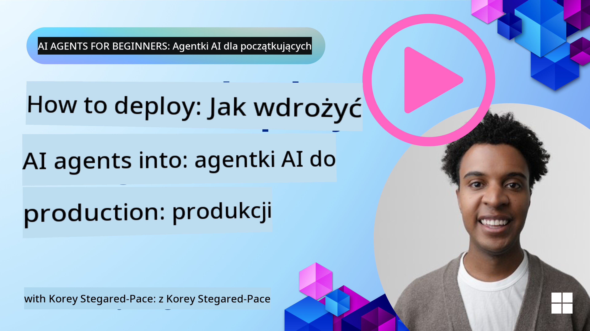

<!--
CO_OP_TRANSLATOR_METADATA:
{
  "original_hash": "44013a98d980c8b92d4b814dc49b545d",
  "translation_date": "2025-03-28T09:44:34+00:00",
  "source_file": "10-ai-agents-production\\README.md",
  "language_code": "pl"
}
-->

> _(Kliknij obrazek powyżej, aby obejrzeć wideo z tej lekcji)_
# Agenci AI w produkcji

## Wprowadzenie

W tej lekcji omówimy:

- Jak skutecznie zaplanować wdrożenie swojego agenta AI do produkcji.
- Typowe błędy i problemy, które mogą pojawić się podczas wdrażania agenta AI do produkcji.
- Jak zarządzać kosztami, jednocześnie utrzymując wydajność swojego agenta AI.

## Cele nauki

Po ukończeniu tej lekcji będziesz wiedzieć/jednocześnie rozumieć:

- Techniki poprawy wydajności, kosztów i efektywności systemu produkcyjnego agenta AI.
- Co i jak oceniać w przypadku swoich agentów AI.
- Jak kontrolować koszty podczas wdrażania agentów AI do produkcji.

Ważne jest, aby wdrażać agentów AI, którym można zaufać. Sprawdź lekcję „Budowanie godnych zaufania agentów AI”.

## Ocena agentów AI

Przed, w trakcie i po wdrożeniu agentów AI kluczowe jest posiadanie odpowiedniego systemu oceny swoich agentów AI. Dzięki temu upewnisz się, że system jest zgodny z celami Twoimi i Twoich użytkowników.

Aby ocenić agenta AI, ważne jest, aby mieć możliwość oceny nie tylko wyników agenta, ale także całego systemu, w którym działa agent AI. Obejmuje to między innymi:

- Początkowe zapytanie do modelu.
- Zdolność agenta do identyfikacji intencji użytkownika.
- Zdolność agenta do wybrania odpowiedniego narzędzia do wykonania zadania.
- Odpowiedź narzędzia na zapytanie agenta.
- Zdolność agenta do interpretacji odpowiedzi narzędzia.
- Informację zwrotną użytkownika na odpowiedź agenta.

Dzięki temu możesz zidentyfikować obszary wymagające poprawy w bardziej modułowy sposób. Następnie możesz monitorować efekty zmian w modelach, promptach, narzędziach i innych komponentach z większą efektywnością.

## Typowe problemy i możliwe rozwiązania dotyczące agentów AI

| **Problem**                                   | **Możliwe rozwiązanie**                                                                                                                                                                                                     |
| --------------------------------------------- | ---------------------------------------------------------------------------------------------------------------------------------------------------------------------------------------------------------------------------- |
| Agent AI nie wykonuje zadań konsekwentnie     | - Popraw prompt podawany agentowi AI; wyraźnie określ cele. - Zidentyfikuj, gdzie podział zadań na podzadania i obsługa ich przez wielu agentów może pomóc.                                                               |
| Agent AI wpada w ciągłe pętle                 | - Upewnij się, że masz jasno określone warunki zakończenia procesu, aby agent wiedział, kiedy zatrzymać proces. - W przypadku złożonych zadań wymagających rozumowania i planowania użyj większego modelu specjalizującego się w takich zadaniach. |
| Wywołania narzędzi przez agenta AI są nieskuteczne | - Przetestuj i zweryfikuj odpowiedzi narzędzia poza systemem agenta. - Popraw zdefiniowane parametry, prompty i nazwy narzędzi.                                                                                            |
| System wieloagentowy działa niespójnie        | - Popraw prompty podawane każdemu agentowi, aby były specyficzne i wyraźnie różniły się od siebie. - Zbuduj hierarchiczny system wykorzystujący agenta „routingowego” lub kontrolującego do określenia, który agent jest właściwy. |

## Zarządzanie kosztami

Oto kilka strategii zarządzania kosztami wdrożenia agentów AI do produkcji:

- **Buforowanie odpowiedzi** - Identyfikacja typowych zapytań i zadań oraz dostarczanie odpowiedzi przed przejściem przez system agentów to dobry sposób na zmniejszenie liczby podobnych zapytań. Możesz nawet wdrożyć przepływ, który identyfikuje, jak bardzo dane zapytanie jest podobne do zapytań w buforze, wykorzystując bardziej podstawowe modele AI.

- **Używanie mniejszych modeli** - Małe modele językowe (SLM) mogą dobrze sprawdzać się w przypadku niektórych zastosowań agentów i znacząco obniżyć koszty. Jak wspomniano wcześniej, zbudowanie systemu oceny w celu określenia i porównania wydajności względem większych modeli to najlepszy sposób, aby zrozumieć, jak dobrze SLM sprawdzi się w Twoim przypadku.

- **Używanie modelu routingowego** - Podobną strategią jest wykorzystanie różnorodności modeli i ich rozmiarów. Możesz użyć LLM/SLM lub funkcji serverless do kierowania zapytań w zależności od ich złożoności do modeli najlepiej dopasowanych. Dzięki temu możesz również obniżyć koszty, jednocześnie zapewniając wydajność w odpowiednich zadaniach.

## Gratulacje

To jest obecnie ostatnia lekcja kursu „Agenci AI dla początkujących”.

Planujemy dodawać kolejne lekcje na podstawie opinii i zmian w tej dynamicznie rozwijającej się branży, więc zajrzyj ponownie w najbliższej przyszłości.

Jeśli chcesz kontynuować naukę i budowanie z agentami AI, dołącz do <a href="https://discord.gg/kzRShWzttr" target="_blank">Azure AI Community Discord</a>.

Organizujemy tam warsztaty, dyskusje społecznościowe i sesje „zapytaj mnie o wszystko”.

Mamy również kolekcję materiałów edukacyjnych, które mogą pomóc Ci rozpocząć budowanie agentów AI w produkcji.

## Poprzednia lekcja

[Metacognition Design Pattern](../09-metacognition/README.md)

**Zastrzeżenie**:  
Ten dokument został przetłumaczony przy użyciu usługi tłumaczeniowej AI [Co-op Translator](https://github.com/Azure/co-op-translator). Chociaż staramy się zapewnić dokładność, należy pamiętać, że automatyczne tłumaczenia mogą zawierać błędy lub nieścisłości. Oryginalny dokument w jego rodzimym języku powinien być uznawany za wiarygodne źródło. W przypadku informacji krytycznych zaleca się skorzystanie z profesjonalnego tłumaczenia przez człowieka. Nie ponosimy odpowiedzialności za jakiekolwiek nieporozumienia lub błędne interpretacje wynikające z korzystania z tego tłumaczenia.