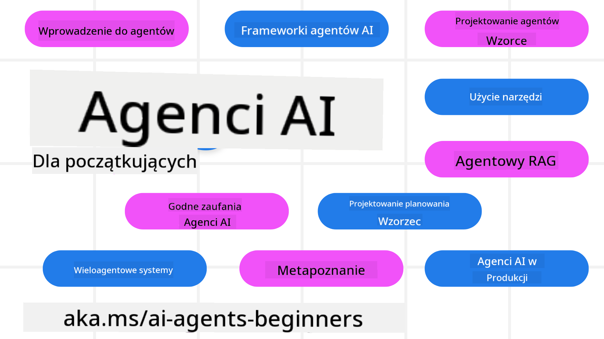

<!--
CO_OP_TRANSLATOR_METADATA:
{
  "original_hash": "9fefa40e18c7568cb137fbbf89ac784d",
  "translation_date": "2025-03-28T09:04:46+00:00",
  "source_file": "README.md",
  "language_code": "pl"
}
-->
# AI Agenci dla Początkujących - Kurs

## 10 lekcji uczących wszystkiego, co musisz wiedzieć, aby zacząć budować AI Agentów

### Wsparcie językowe

     
 

 

  
 
 

## 🌱 Rozpoczęcie pracy

Ten kurs zawiera 10 lekcji omawiających podstawy tworzenia AI Agentów. Każda lekcja dotyczy innego tematu, więc możesz zacząć od dowolnego miejsca!

Kurs jest dostępny w różnych językach. Zobacz [dostępne języki tutaj](../..). 

Jeśli po raz pierwszy pracujesz z modelami generatywnej AI, zapoznaj się z naszym kursem [Generative AI For Beginners](https://aka.ms/genai-beginners), który obejmuje 21 lekcji na temat pracy z GenAI.

Nie zapomnij [dodać gwiazdki (🌟) do tego repozytorium](https://docs.github.com/en/get-started/exploring-projects-on-github/saving-repositories-with-stars?WT.mc_id=academic-105485-koreyst) i [zforkować repozytorium](https://github.com/microsoft/ai-agents-for-beginners/fork), aby uruchomić kod.

### Co będzie potrzebne 

Każda lekcja w tym kursie zawiera przykłady kodu, które znajdziesz w folderze code_samples. Możesz [zforkować to repozytorium](https://github.com/microsoft/ai-agents-for-beginners/fork), aby stworzyć własną kopię.  

Przykłady kodu w tych ćwiczeniach wykorzystują Azure AI Foundry oraz GitHub Model Catalogs do interakcji z modelami językowymi:

- [Github Models](https://aka.ms/ai-agents-beginners/github-models) - Bezpłatne / Ograniczone
- [Azure AI Foundry](https://aka.ms/ai-agents-beginners/ai-foundry) - Wymagane konto Azure

Kurs korzysta również z następujących frameworków i usług AI Agentów od Microsoft:

- [Azure AI Agent Service](https://aka.ms/ai-agents-beginners/ai-agent-service)
- [Semantic Kernel](https://aka.ms/ai-agents-beginners/semantic-kernel)  
- [AutoGen](https://aka.ms/ai-agents/autogen)  

Więcej informacji na temat uruchamiania kodu z tego kursu znajdziesz w [Course Setup](./00-course-setup/README.md).  

## 🙏 Chcesz pomóc?  

Masz sugestie lub znalazłeś błędy w pisowni lub kodzie? [Zgłoś problem](https://github.com/microsoft/ai-agents-for-beginners/issues?WT.mc_id=academic-105485-koreyst) lub [Utwórz pull request](https://github.com/microsoft/ai-agents-for-beginners/pulls?WT.mc_id=academic-105485-koreyst).  

Jeśli utkniesz lub masz pytania dotyczące tworzenia agentów AI, dołącz do naszego [Azure AI Community Discord](https://discord.gg/kzRShWzttr).  

## 📂 Każda lekcja zawiera  

- Pisemną lekcję znajdującą się w README oraz krótki film  
- Przykłady kodu w Pythonie wspierające Azure AI Foundry i Github Models (bezpłatnie)  
- Linki do dodatkowych zasobów umożliwiających dalszą naukę  

## 🗃️ Lekcje  

| **Lekcja**                               | **Tekst i Kod**                                   | **Wideo**                                                   | **Dodatkowa Nauka**                                                                    |
|------------------------------------------|--------------------------------------------------|------------------------------------------------------------|----------------------------------------------------------------------------------------|
| Wprowadzenie do agentów AI i przypadki użycia | [Link](./01-intro-to-ai-agents/README.md)         | [Video](https://youtu.be/3zgm60bXmQk?si=z8QygFvYQv-9WtO1)  | [Link](https://aka.ms/ai-agents-beginners/collection?WT.mc_id=academic-105485-koreyst) |
| Eksploracja frameworków agentów AI       | [Link](./02-explore-agentic-frameworks/README.md) | [Video](https://youtu.be/ODwF-EZo_O8?si=Vawth4hzVaHv-u0H)  | [Link](https://aka.ms/ai-agents-beginners/collection?WT.mc_id=academic-105485-koreyst) |
| Zrozumienie wzorców projektowych agentów AI | [Link](./03-agentic-design-patterns/README.md)    | [Video](https://youtu.be/m9lM8qqoOEA?si=BIzHwzstTPL8o9GF)  | [Link](https://aka.ms/ai-agents-beginners/collection?WT.mc_id=academic-105485-koreyst) |
| Wzorzec projektowy użycia narzędzi       | [Link](./04-tool-use/README.md)                   | [Video](https://youtu.be/vieRiPRx-gI?si=2z6O2Xu2cu_Jz46N)  | [Link](https://aka.ms/ai-agents-beginners/collection?WT.mc_id=academic-105485-koreyst) |
| Agentic RAG                              | [Link](./05-agentic-rag/README.md)                | [Video](https://youtu.be/WcjAARvdL7I?si=gKPWsQpKiIlDH9A3)  | [Link](https://aka.ms/ai-agents-beginners/collection?WT.mc_id=academic-105485-koreyst) |
| Budowanie godnych zaufania agentów AI    | [Link](./06-building-trustworthy-agents/README.md)| [Video](https://youtu.be/iZKkMEGBCUQ?si=jZjpiMnGFOE9L8OK ) | [Link](https://aka.ms/ai-agents-beginners/collection?WT.mc_id=academic-105485-koreyst) |
| Wzorzec projektowy planowania            | [Link](./07-planning-design/README.md)            | [Video](https://youtu.be/kPfJ2BrBCMY?si=6SC_iv_E5-mzucnC)  | [Link](https://aka.ms/ai-agents-beginners/collection?WT.mc_id=academic-105485-koreyst) |
| Wzorzec projektowy wielu agentów         | [Link](./08-multi-agent/README.md)                | [Video](https://youtu.be/V6HpE9hZEx0?si=rMgDhEu7wXo2uo6g)  | [Link](https://aka.ms/ai-agents-beginners/collection?WT.mc_id=academic-105485-koreyst) |  
| Wzorzec projektowania Metakognicji       | [Link](./09-metacognition/README.md)               | [Wideo](https://youtu.be/His9R6gw6Ec?si=8gck6vvdSNCt6OcF)  | [Link](https://aka.ms/ai-agents-beginners/collection?WT.mc_id=academic-105485-koreyst) |
| Agenci AI w produkcji                    | [Link](./10-ai-agents-production/README.md)        | [Wideo](https://youtu.be/l4TP6IyJxmQ?si=31dnhexRo6yLRJDl)  | [Link](https://aka.ms/ai-agents-beginners/collection?WT.mc_id=academic-105485-koreyst) |

## 🌐 Obsługa wielu języków

| Język               | Kod  | Link do przetłumaczonego README                          | Ostatnia aktualizacja |
|---------------------|------|---------------------------------------------------------|-----------------------|
| Chiński (uproszczony) | zh   | [Chińskie tłumaczenie](../zh/README.md)     | 2025-03-24           |
| Chiński (tradycyjny) | tw   | [Chińskie tłumaczenie](../tw/README.md)     | 2025-02-13           |
| Chiński (Hongkong)   | hk   | [Chińskie (Hongkong) tłumaczenie](../hk/README.md) | 2025-02-13           |
| Francuski            | fr   | [Francuskie tłumaczenie](../fr/README.md)   | 2025-02-13           |
| Japoński             | ja   | [Japońskie tłumaczenie](../ja/README.md)    | 2025-02-13           |
| Koreański            | ko   | [Koreańskie tłumaczenie](../ko/README.md)   | 2025-02-13           |
| Portugalski          | pt   | [Portugalskie tłumaczenie](../pt/README.md) | 2025-02-13           |
| Hiszpański           | es   | [Hiszpańskie tłumaczenie](../es/README.md)  | 2025-02-13           |
| Niemiecki            | de   | [Niemieckie tłumaczenie](../de/README.md)   | 2025-02-13           |
| Perski               | fa   | [Perskie tłumaczenie](../fa/README.md)     | 2025-03-26           |
| Polski               | pl   | [Polskie tłumaczenie](./README.md)     | 2025-03-26           |

## 🎒 Inne kursy

Nasza ekipa tworzy inne kursy! Sprawdź:

- [**NOWY** Generatywna AI dla początkujących z użyciem .NET](https://github.com/microsoft/Generative-AI-for-beginners-dotnet?WT.mc_id=academic-105485-koreyst)
- [Generatywna AI dla początkujących](https://github.com/microsoft/generative-ai-for-beginners?WT.mc_id=academic-105485-koreyst)
- [ML dla początkujących](https://aka.ms/ml-beginners?WT.mc_id=academic-105485-koreyst)
- [Data Science dla początkujących](https://aka.ms/datascience-beginners?WT.mc_id=academic-105485-koreyst)
- [AI dla początkujących](https://aka.ms/ai-beginners?WT.mc_id=academic-105485-koreyst)
- [Cyberbezpieczeństwo dla początkujących](https://github.com/microsoft/Security-101??WT.mc_id=academic-96948-sayoung)
- [Web Dev dla początkujących](https://aka.ms/webdev-beginners?WT.mc_id=academic-105485-koreyst)
- [IoT dla początkujących](https://aka.ms/iot-beginners?WT.mc_id=academic-105485-koreyst)
- [Rozwój XR dla początkujących](https://github.com/microsoft/xr-development-for-beginners?WT.mc_id=academic-105485-koreyst)
- [Opanowanie GitHub Copilot dla AI i programowania w parach](https://aka.ms/GitHubCopilotAI?WT.mc_id=academic-105485-koreyst)
- [Opanowanie GitHub Copilot dla programistów C#/.NET](https://github.com/microsoft/mastering-github-copilot-for-dotnet-csharp-developers?WT.mc_id=academic-105485-koreyst)
- [Wybierz swoją własną przygodę z Copilot](https://github.com/microsoft/CopilotAdventures?WT.mc_id=academic-105485-koreyst)

## 🌟 Podziękowania dla społeczności

Dziękujemy [Shivamowi Goyalowi](https://www.linkedin.com/in/shivam2003/) za dostarczenie ważnych przykładów kodu demonstrujących Agentic RAG.

## Wkład w projekt

Ten projekt przyjmuje wkład i sugestie. Większość wkładów wymaga zgody na Umowę Licencyjną Współtwórcy (CLA), która deklaruje, że masz prawo i faktycznie udzielasz nam prawa do korzystania z Twojego wkładu. Szczegóły znajdziesz na <https://cla.opensource.microsoft.com>.

Gdy przesyłasz pull request, bot CLA automatycznie określi, czy musisz dostarczyć CLA i odpowiednio oznaczy PR (np. status, komentarz). Po prostu postępuj zgodnie z instrukcjami podanymi przez bota. Musisz to zrobić tylko raz we wszystkich repozytoriach korzystających z naszego CLA.
Ten projekt przyjął [Kodeks postępowania Microsoft Open Source](https://opensource.microsoft.com/codeofconduct/).  
Więcej informacji znajdziesz w [FAQ dotyczących kodeksu postępowania](https://opensource.microsoft.com/codeofconduct/faq/) lub  
skontaktuj się z [opencode@microsoft.com](mailto:opencode@microsoft.com) w przypadku dodatkowych pytań lub uwag.

## Znaki towarowe

Ten projekt może zawierać znaki towarowe lub logotypy dotyczące projektów, produktów lub usług. Upoważnione użycie znaków towarowych lub logotypów Microsoft  
podlega i musi być zgodne z [Wytycznymi Microsoft dotyczącymi znaków towarowych i marki](https://www.microsoft.com/legal/intellectualproperty/trademarks/usage/general).  
Użycie znaków towarowych lub logotypów Microsoft w zmodyfikowanych wersjach tego projektu nie może powodować dezorientacji ani sugerować sponsorowania przez Microsoft.  
Jakiekolwiek użycie znaków towarowych lub logotypów należących do stron trzecich podlega zasadom tych stron trzecich.  

**Zastrzeżenie**:  
Ten dokument został przetłumaczony za pomocą usługi tłumaczenia AI [Co-op Translator](https://github.com/Azure/co-op-translator). Chociaż dokładamy wszelkich starań, aby tłumaczenie było dokładne, prosimy mieć na uwadze, że automatyczne tłumaczenia mogą zawierać błędy lub nieścisłości. Oryginalny dokument w jego języku źródłowym powinien być uznawany za autorytatywne źródło. W przypadku informacji krytycznych zaleca się skorzystanie z profesjonalnego tłumaczenia przez człowieka. Nie ponosimy odpowiedzialności za jakiekolwiek nieporozumienia lub błędne interpretacje wynikające z korzystania z tego tłumaczenia.