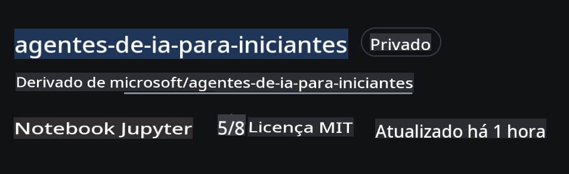
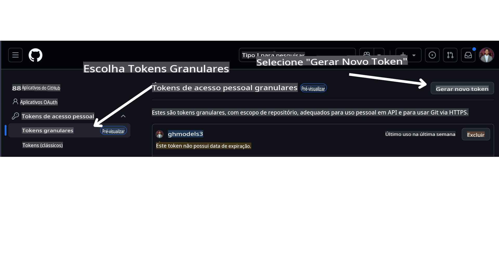

<!--
CO_OP_TRANSLATOR_METADATA:
{
  "original_hash": "366bc6709dd95b8a32ec7c705b0f179c",
  "translation_date": "2025-03-28T11:35:12+00:00",
  "source_file": "00-course-setup\\README.md",
  "language_code": "pt"
}
-->
# Configuração do Curso

## Introdução

Esta lição abordará como executar os exemplos de código deste curso.

## Requisitos

- Uma conta no GitHub
- Python 3.12 ou superior
- Assinatura do Azure
- Conta no Azure AI Foundry

## Clone ou Fork deste Repositório

Para começar, faça o clone ou fork do repositório do GitHub. Isso criará sua própria versão do material do curso, permitindo que você execute, teste e ajuste o código!

Isso pode ser feito clicando no link.

Você deve agora ter sua própria versão do curso no seguinte link:



## Recupere seu Token de Acesso Pessoal (PAT) do GitHub

Atualmente, este curso utiliza o Github Models Marketplace para oferecer acesso gratuito a Modelos de Linguagem de Grande Escala (LLMs) que serão usados para criar Agentes de IA.

Para acessar este serviço, você precisará criar um Token de Acesso Pessoal no GitHub.

Isso pode ser feito acessando sua conta no GitHub.

Selecione a opção `Fine-grained tokens` no lado esquerdo da tela.

Em seguida, selecione `Generate new token`.



Copie o novo token que você acabou de criar. Você irá adicioná-lo ao arquivo `.env` incluído neste curso.

## Adicione isso às suas Variáveis de Ambiente

Para criar seu arquivo `.env`, execute o seguinte comando no terminal:

```bash
cp .env.example .env
```

Isso copiará o arquivo de exemplo e criará um `.env` no seu diretório. Preencha os valores para as variáveis de ambiente. Você pode localizar os valores para cada variável de ambiente nos seguintes locais no portal [Azure AI Foundry](https://ai.azure.com?WT.mc_id=academic-105485-koreyst):

Abra o arquivo e cole o token que você criou no campo `GITHUB_TOKEN=` field of the .env file. 
- `AZURE_SUBSCRIPTION_ID` - On the **Overview** page of your project within **Project details**.
- `AZURE_AI_PROJECT_NAME` - At the top of the **Overview** page for your project.
- `AZURE_OPENAI_RESOURCE_GROUP` - On the **Overview** page of the **Management Center** within **Project properties**.
- `AZURE_OPENAI_SERVICE` - On the **Overview** page of your project in the **Included capabilities** tab for **Azure OpenAI Service**.
- `AZURE_OPENAI_API_VERSION` - On the [API version lifecycle](https://learn.microsoft.com/azure/ai-services/openai/api-version-deprecation#latest-ga-api-release?WT.mc_id=academic-105485-koreyst) webpage within the **Latest GA API release** section.
- `AZURE_OPENAI_ENDPOINT` - Na aba **Details** do seu modelo implantado, dentro de **Endpoint** (ex.: **Target URI**).

## Instale os Pacotes Necessários

Para garantir que você tenha todos os pacotes Python necessários para executar o código, execute o seguinte comando no terminal.

Recomendamos criar um ambiente virtual Python para evitar conflitos e problemas.

```bash
pip install -r requirements.txt
```

Isso deve instalar os pacotes Python necessários.

# Faça login no Azure

Como prática recomendada de segurança, utilizaremos [autenticação sem chave](https://learn.microsoft.com/azure/developer/ai/keyless-connections?tabs=csharp%2Cazure-cli?WT.mc_id=academic-105485-koreyst) para autenticar no Azure OpenAI com o Microsoft Entra ID. Antes de fazer isso, será necessário instalar o **Azure CLI** seguindo as [instruções de instalação](https://learn.microsoft.com/cli/azure/install-azure-cli?WT.mc_id=academic-105485-koreyst) para seu sistema operacional.

Depois, abra um terminal e execute `az login` to sign in to your Azure account.

## Sign in to Azure

Login with your Azure AI account used to provision the Azure resources.

Open a new terminal and enter the following command and follow the instructions in the terminal:

`az login --use-device-code`

Once you've logged in, select your subscription in the terminal.

## Access the environment variables.

We'll import `os` and `load_dotenv` para acessar as variáveis de ambiente.

```python
import os
from dotenv import load_dotenv

load_dotenv()
```

## Configurar autenticação sem chave

Em vez de codificar suas credenciais diretamente, utilizaremos uma conexão sem chave com o Azure OpenAI. Para isso, importaremos a função `DefaultAzureCredential` and later call the `DefaultAzureCredential` para obter as credenciais.

```python
from azure.identity import DefaultAzureCredential, InteractiveBrowserCredential
```

Agora você está pronto para executar o código deste curso. Aproveite para aprender mais sobre o mundo dos Agentes de IA!

Se tiver problemas ao configurar isso, entre em nosso fórum ou comunidade.

## Próxima Lição

[Introdução aos Agentes de IA e Casos de Uso de Agentes](../01-intro-to-ai-agents/README.md)

**Aviso Legal**:  
Este documento foi traduzido utilizando o serviço de tradução por IA [Co-op Translator](https://github.com/Azure/co-op-translator). Embora nos esforcemos para garantir a precisão, é importante ressaltar que traduções automáticas podem conter erros ou imprecisões. O documento original em seu idioma nativo deve ser considerado a fonte autoritária. Para informações críticas, recomenda-se uma tradução profissional realizada por humanos. Não nos responsabilizamos por quaisquer mal-entendidos ou interpretações incorretas decorrentes do uso desta tradução.