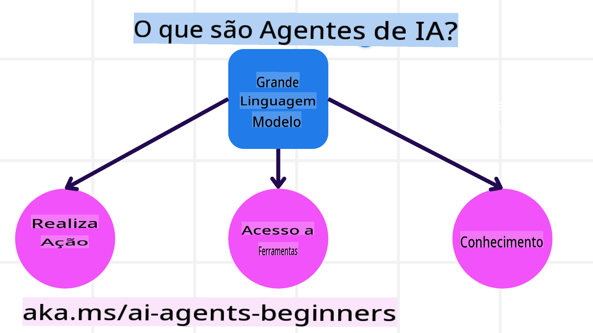
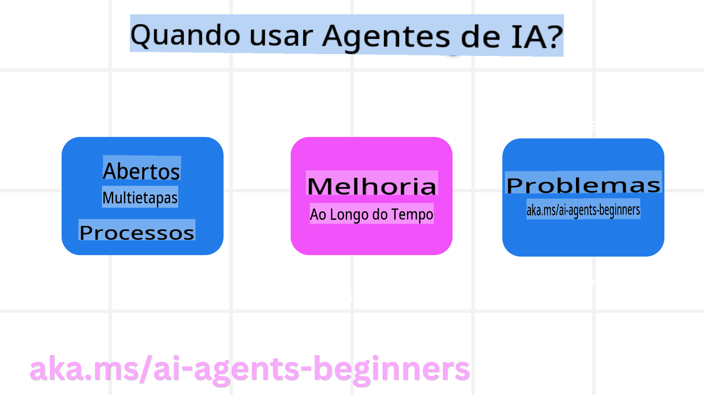

<!--
CO_OP_TRANSLATOR_METADATA:
{
  "original_hash": "233e7a18025a27eae95b653e9b5b5aa5",
  "translation_date": "2025-03-28T11:37:53+00:00",
  "source_file": "01-intro-to-ai-agents\\README.md",
  "language_code": "pt"
}
-->

> _(Clique na imagem acima para assistir ao vídeo desta aula)_

# Introdução aos Agentes de IA e Casos de Uso

Bem-vindo ao curso "Agentes de IA para Iniciantes"! Este curso oferece conhecimentos fundamentais e exemplos práticos para construir Agentes de IA.

Junte-se ao grupo para conhecer outros alunos e desenvolvedores de Agentes de IA e tirar quaisquer dúvidas que tenha sobre o curso.

Para começar, vamos entender melhor o que são Agentes de IA e como podemos usá-los em aplicativos e fluxos de trabalho que desenvolvemos.

## Introdução

Nesta aula, abordaremos:

- O que são Agentes de IA e quais são os diferentes tipos de agentes?
- Quais casos de uso são mais adequados para Agentes de IA e como eles podem nos ajudar?
- Quais são alguns dos elementos básicos ao projetar Soluções Agênticas?

## Objetivos de Aprendizagem

Após concluir esta aula, você deverá ser capaz de:

- Compreender os conceitos de Agentes de IA e como eles diferem de outras soluções de IA.
- Aplicar Agentes de IA de maneira eficiente.
- Projetar soluções agênticas de forma produtiva para usuários e clientes.

## Definindo Agentes de IA e Tipos de Agentes de IA

### O que são Agentes de IA?

Agentes de IA são **sistemas** que permitem que **Modelos de Linguagem de Grande Escala (LLMs)** **realizem ações** ao ampliar suas capacidades, dando aos LLMs **acesso a ferramentas** e **conhecimento**.

Vamos dividir essa definição em partes menores:

- **Sistema** - É importante pensar nos agentes não como um único componente, mas como um sistema composto por vários componentes. No nível básico, os componentes de um Agente de IA são:
  - **Ambiente** - O espaço definido onde o Agente de IA opera. Por exemplo, se tivermos um Agente de IA para reservas de viagens, o ambiente pode ser o sistema de reservas que o agente utiliza para realizar tarefas.
  - **Sensores** - Ambientes têm informações e fornecem feedback. Agentes de IA usam sensores para coletar e interpretar essas informações sobre o estado atual do ambiente. No exemplo do Agente de Reservas, o sistema de reservas pode fornecer informações como disponibilidade de hotéis ou preços de voos.
  - **Atuadores** - Depois que o Agente de IA recebe o estado atual do ambiente, ele determina qual ação realizar para alterar o ambiente. No caso do Agente de Reservas, isso pode significar reservar um quarto disponível para o usuário.

**Modelos de Linguagem de Grande Escala** - O conceito de agentes existia antes da criação dos LLMs. A vantagem de construir Agentes de IA com LLMs é sua capacidade de interpretar linguagem humana e dados. Essa habilidade permite que os LLMs interpretem informações do ambiente e definam um plano para modificá-lo.

**Realizar Ações** - Fora dos sistemas de Agentes de IA, os LLMs são limitados a situações em que a ação é gerar conteúdo ou informações com base no prompt do usuário. Dentro dos sistemas de Agentes de IA, os LLMs podem realizar tarefas interpretando o pedido do usuário e utilizando ferramentas disponíveis no ambiente.

**Acesso a Ferramentas** - Quais ferramentas o LLM tem acesso depende de 1) o ambiente em que está operando e 2) o desenvolvedor do Agente de IA. No exemplo do agente de viagens, as ferramentas do agente são limitadas pelas operações disponíveis no sistema de reservas e/ou o desenvolvedor pode restringir o acesso às ferramentas, como voos.

**Conhecimento** - Além das informações fornecidas pelo ambiente, os Agentes de IA também podem recuperar conhecimento de outros sistemas, serviços, ferramentas e até outros agentes. No exemplo do agente de viagens, esse conhecimento pode incluir informações sobre as preferências de viagem do usuário armazenadas em um banco de dados de clientes.

### Os diferentes tipos de agentes

Agora que temos uma definição geral de Agentes de IA, vamos explorar alguns tipos específicos de agentes e como eles seriam aplicados a um agente de reservas de viagens.

| **Tipo de Agente**             | **Descrição**                                                                                                                       | **Exemplo**                                                                                                                                                                                                                   |
| ----------------------------- | ------------------------------------------------------------------------------------------------------------------------------------- | ----------------------------------------------------------------------------------------------------------------------------------------------------------------------------------------------------------------------------- |
| **Agentes Reflexos Simples**  | Realizam ações imediatas com base em regras predefinidas.                                                                             | O agente de viagens interpreta o contexto de um e-mail e encaminha reclamações de viagens para o atendimento ao cliente.                                                                                                      |
| **Agentes Reflexos Baseados em Modelo** | Realizam ações com base em um modelo do mundo e alterações nesse modelo.                                                              | O agente de viagens prioriza rotas com mudanças significativas de preço com base em acesso a dados históricos de preços.                                                                                                     |
| **Agentes Baseados em Objetivos** | Criam planos para alcançar objetivos específicos, interpretando o objetivo e determinando ações para alcançá-lo.                        | O agente de viagens reserva uma jornada ao determinar os arranjos necessários (carro, transporte público, voos) do local atual ao destino.                                                                                   |
| **Agentes Baseados em Utilidade** | Consideram preferências e avaliam compensações numericamente para determinar como alcançar objetivos.                                  | O agente de viagens maximiza a utilidade ao ponderar conveniência versus custo ao reservar viagens.                                                                                                                          |
| **Agentes de Aprendizado**      | Melhoram ao longo do tempo ao responder a feedbacks e ajustar ações conforme necessário.                                               | O agente de viagens melhora utilizando feedback dos clientes em pesquisas pós-viagem para ajustar reservas futuras.                                                                                                           |
| **Agentes Hierárquicos**        | Contêm múltiplos agentes em um sistema hierárquico, onde agentes de nível superior dividem tarefas em subtarefas para agentes de nível inferior completarem. | O agente de viagens cancela uma viagem dividindo a tarefa em subtarefas (por exemplo, cancelar reservas específicas) e delegando-as a agentes de nível inferior, que reportam ao agente de nível superior.                                                          |
| **Sistemas Multiagentes (MAS)** | Agentes completam tarefas de forma independente, seja cooperativa ou competitiva.                                                     | Cooperativo: Múltiplos agentes reservam serviços específicos de viagem, como hotéis, voos e entretenimento. Competitivo: Múltiplos agentes gerenciam e competem por um calendário compartilhado de reservas de hotéis para atender clientes. |

## Quando usar Agentes de IA

Na seção anterior, usamos o caso de uso do Agente de Viagens para explicar como diferentes tipos de agentes podem ser usados em diferentes cenários de reservas de viagens. Continuaremos utilizando esse aplicativo ao longo do curso.

Vamos analisar os tipos de casos de uso em que os Agentes de IA são mais adequados:

- **Problemas de Resposta Aberta** - Permitir que o LLM determine os passos necessários para concluir uma tarefa, pois nem sempre é possível codificar tudo em um fluxo de trabalho.
- **Processos de Múltiplas Etapas** - Tarefas que requerem um nível de complexidade em que o Agente de IA precisa usar ferramentas ou informações ao longo de várias interações, em vez de uma única consulta.  
- **Melhoria ao Longo do Tempo** - Tarefas em que o agente pode melhorar ao receber feedback do ambiente ou dos usuários, proporcionando maior utilidade.

Cobriremos mais considerações sobre o uso de Agentes de IA na aula sobre Construção de Agentes de IA Confiáveis.

## Fundamentos de Soluções Agênticas

### Desenvolvimento de Agentes

O primeiro passo para projetar um sistema de Agente de IA é definir as ferramentas, ações e comportamentos. Neste curso, focamos no uso do **Azure AI Agent Service** para definir nossos agentes. Ele oferece recursos como:

- Seleção de Modelos Abertos, como OpenAI, Mistral e Llama
- Uso de Dados Licenciados por provedores como Tripadvisor
- Uso de ferramentas padronizadas OpenAPI 3.0

### Padrões Agênticos

A comunicação com LLMs ocorre por meio de prompts. Dada a natureza semi-autônoma dos Agentes de IA, nem sempre é possível ou necessário repromptar manualmente o LLM após uma mudança no ambiente. Usamos **Padrões Agênticos** que nos permitem promptar o LLM em várias etapas de maneira mais escalável.

Este curso está dividido em alguns dos padrões agênticos mais populares atualmente.

### Frameworks Agênticos

Frameworks Agênticos permitem que os desenvolvedores implementem padrões agênticos por meio de código. Esses frameworks oferecem templates, plugins e ferramentas para melhor colaboração entre Agentes de IA. Esses benefícios proporcionam maior capacidade de observação e solução de problemas em sistemas de Agentes de IA.

Neste curso, exploraremos o framework AutoGen, baseado em pesquisa, e o framework Agent, pronto para produção, do Semantic Kernel.

## Aula Anterior

[Configuração do Curso](../00-course-setup/README.md)

## Próxima Aula

[Explorando Frameworks Agênticos](../02-explore-agentic-frameworks/README.md)

**Aviso Legal**:  
Este documento foi traduzido utilizando o serviço de tradução por IA [Co-op Translator](https://github.com/Azure/co-op-translator). Embora nos esforcemos para garantir a precisão, esteja ciente de que traduções automatizadas podem conter erros ou imprecisões. O documento original em seu idioma nativo deve ser considerado a fonte autoritativa. Para informações críticas, recomenda-se a tradução profissional feita por humanos. Não nos responsabilizamos por quaisquer mal-entendidos ou interpretações incorretas decorrentes do uso desta tradução.