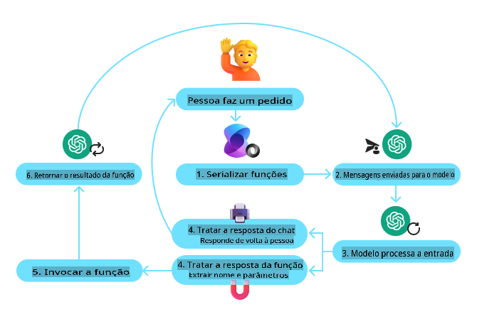
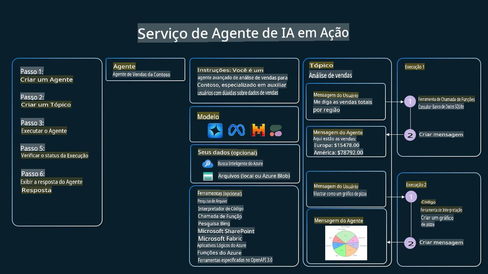

<!--
CO_OP_TRANSLATOR_METADATA:
{
  "original_hash": "b8ea2abd1a674f736d5fc08982e6ec06",
  "translation_date": "2025-03-28T11:50:28+00:00",
  "source_file": "04-tool-use\\README.md",
  "language_code": "pt"
}
-->
[](https://youtu.be/vieRiPRx-gI?si=cEZ8ApnT6Sus9rhn)

> _(Clique na imagem acima para assistir ao vídeo desta lição)_

# Padrão de Design para Uso de Ferramentas

Ferramentas são interessantes porque permitem que agentes de IA tenham uma gama mais ampla de capacidades. Em vez de o agente ter um conjunto limitado de ações que pode realizar, ao adicionar uma ferramenta, o agente pode agora executar uma ampla variedade de ações. Neste capítulo, vamos explorar o Padrão de Design para Uso de Ferramentas, que descreve como agentes de IA podem utilizar ferramentas específicas para alcançar seus objetivos.

## Introdução

Nesta lição, buscamos responder às seguintes perguntas:

- O que é o padrão de design para uso de ferramentas?
- Quais são os casos de uso em que ele pode ser aplicado?
- Quais são os elementos/blocos de construção necessários para implementar o padrão de design?
- Quais são as considerações especiais ao usar o Padrão de Design para Uso de Ferramentas para construir agentes de IA confiáveis?

## Objetivos de Aprendizagem

Após concluir esta lição, você será capaz de:

- Definir o Padrão de Design para Uso de Ferramentas e seu propósito.
- Identificar casos de uso onde o Padrão de Design para Uso de Ferramentas é aplicável.
- Compreender os elementos-chave necessários para implementar o padrão de design.
- Reconhecer considerações para garantir confiabilidade em agentes de IA que utilizam este padrão de design.

## O que é o Padrão de Design para Uso de Ferramentas?

O **Padrão de Design para Uso de Ferramentas** se concentra em dar aos LLMs a capacidade de interagir com ferramentas externas para alcançar objetivos específicos. Ferramentas são códigos que podem ser executados por um agente para realizar ações. Uma ferramenta pode ser uma função simples, como uma calculadora, ou uma chamada de API para um serviço de terceiros, como consulta de preços de ações ou previsão do tempo. No contexto de agentes de IA, as ferramentas são projetadas para serem executadas pelos agentes em resposta a **chamadas de função geradas pelo modelo**.

## Quais são os casos de uso em que ele pode ser aplicado?

Agentes de IA podem utilizar ferramentas para concluir tarefas complexas, recuperar informações ou tomar decisões. O padrão de design para uso de ferramentas é frequentemente utilizado em cenários que exigem interação dinâmica com sistemas externos, como bancos de dados, serviços web ou interpretadores de código. Essa habilidade é útil para vários casos de uso, incluindo:

- **Recuperação Dinâmica de Informações:** Agentes podem consultar APIs externas ou bancos de dados para buscar dados atualizados (por exemplo, consultar um banco de dados SQLite para análise de dados, buscar preços de ações ou informações meteorológicas).
- **Execução e Interpretação de Código:** Agentes podem executar códigos ou scripts para resolver problemas matemáticos, gerar relatórios ou realizar simulações.
- **Automação de Fluxos de Trabalho:** Automatizar fluxos de trabalho repetitivos ou de múltiplas etapas integrando ferramentas como agendadores de tarefas, serviços de e-mail ou pipelines de dados.
- **Suporte ao Cliente:** Agentes podem interagir com sistemas de CRM, plataformas de tickets ou bases de conhecimento para resolver dúvidas dos usuários.
- **Geração e Edição de Conteúdo:** Agentes podem utilizar ferramentas como verificadores gramaticais, resumidores de texto ou avaliadores de segurança de conteúdo para auxiliar em tarefas de criação de conteúdo.

## Quais são os elementos/blocos de construção necessários para implementar o padrão de design para uso de ferramentas?

Esses blocos de construção permitem que o agente de IA realize uma ampla gama de tarefas. Vamos analisar os elementos-chave necessários para implementar o Padrão de Design para Uso de Ferramentas:

- **Chamadas de Função/Ferramenta:** Esta é a principal maneira de habilitar LLMs para interagir com ferramentas. Funções ou ferramentas são blocos de código reutilizável que os agentes usam para realizar tarefas. Isso pode variar de funções simples, como uma calculadora, até chamadas de API para serviços de terceiros, como consultas de preços de ações ou previsões meteorológicas.

- **Recuperação Dinâmica de Informações:** Agentes podem consultar APIs externas ou bancos de dados para buscar dados atualizados. Isso é útil para tarefas como análise de dados, consulta de preços de ações ou informações meteorológicas.

- **Execução e Interpretação de Código:** Agentes podem executar códigos ou scripts para resolver problemas matemáticos, gerar relatórios ou realizar simulações.

- **Automação de Fluxos de Trabalho:** Isso envolve automatizar fluxos de trabalho repetitivos ou de múltiplas etapas integrando ferramentas como agendadores de tarefas, serviços de e-mail ou pipelines de dados.

- **Suporte ao Cliente:** Agentes podem interagir com sistemas de CRM, plataformas de tickets ou bases de conhecimento para resolver dúvidas dos usuários.

- **Geração e Edição de Conteúdo:** Agentes podem utilizar ferramentas como verificadores gramaticais, resumidores de texto ou avaliadores de segurança de conteúdo para auxiliar em tarefas de criação de conteúdo.

A seguir, vamos analisar as Chamadas de Função/Ferramenta em mais detalhes.

### Chamadas de Função/Ferramenta

Chamadas de função são a principal maneira de habilitar Modelos de Linguagem de Grande Escala (LLMs) para interagir com ferramentas. Você frequentemente verá os termos 'Função' e 'Ferramenta' usados de forma intercambiável porque 'funções' (blocos de código reutilizável) são as 'ferramentas' que os agentes utilizam para realizar tarefas. Para que o código de uma função seja invocado, um LLM deve comparar a solicitação do usuário com a descrição da função. Para isso, um esquema contendo as descrições de todas as funções disponíveis é enviado ao LLM. O LLM então seleciona a função mais apropriada para a tarefa e retorna seu nome e argumentos. A função selecionada é invocada, sua resposta é enviada de volta ao LLM, que utiliza as informações para responder à solicitação do usuário.

Para que os desenvolvedores implementem chamadas de função para agentes, você precisará de:

1. Um modelo de LLM que suporte chamadas de função
2. Um esquema contendo descrições das funções
3. O código para cada função descrita

Vamos usar o exemplo de obter o horário atual em uma cidade para ilustrar:

1. **Inicializar um LLM que suporte chamadas de função:**

    Nem todos os modelos suportam chamadas de função, então é importante verificar se o LLM que você está utilizando suporta essa funcionalidade. <a href="https://learn.microsoft.com/azure/ai-services/openai/how-to/function-calling" target="_blank">Azure OpenAI</a> suporta chamadas de função. Podemos começar iniciando o cliente do Azure OpenAI.

    ```python
    # Initialize the Azure OpenAI client
    client = AzureOpenAI(
        azure_endpoint = os.getenv("AZURE_OPENAI_ENDPOINT"), 
        api_key=os.getenv("AZURE_OPENAI_API_KEY"),  
        api_version="2024-05-01-preview"
    )
    ```

1. **Criar um Esquema de Função:**

    Em seguida, definiremos um esquema JSON que contém o nome da função, descrição do que a função faz, e os nomes e descrições dos parâmetros da função. 
    Passaremos esse esquema ao cliente criado anteriormente, junto com a solicitação do usuário para encontrar o horário em San Francisco. É importante observar que o que é retornado é uma **chamada de ferramenta**, **não** a resposta final à pergunta. Conforme mencionado anteriormente, o LLM retorna o nome da função que selecionou para a tarefa e os argumentos que serão passados para ela.

    ```python
    # Function description for the model to read
    tools = [
        {
            "type": "function",
            "function": {
                "name": "get_current_time",
                "description": "Get the current time in a given location",
                "parameters": {
                    "type": "object",
                    "properties": {
                        "location": {
                            "type": "string",
                            "description": "The city name, e.g. San Francisco",
                        },
                    },
                    "required": ["location"],
                },
            }
        }
    ]
    ```
   
    ```python
  
    # Initial user message
    messages = [{"role": "user", "content": "What's the current time in San Francisco"}] 
  
    # First API call: Ask the model to use the function
      response = client.chat.completions.create(
          model=deployment_name,
          messages=messages,
          tools=tools,
          tool_choice="auto",
      )
  
      # Process the model's response
      response_message = response.choices[0].message
      messages.append(response_message)
  
      print("Model's response:")  

      print(response_message)
  
    ```

    ```bash
    Model's response:
    ChatCompletionMessage(content=None, role='assistant', function_call=None, tool_calls=[ChatCompletionMessageToolCall(id='call_pOsKdUlqvdyttYB67MOj434b', function=Function(arguments='{"location":"San Francisco"}', name='get_current_time'), type='function')])
    ```
  
1. **O código da função necessário para realizar a tarefa:**

    Agora que o LLM escolheu qual função precisa ser executada, o código que realiza a tarefa precisa ser implementado e executado.
    Podemos implementar o código para obter o horário atual em Python. Também será necessário escrever o código para extrair o nome e os argumentos da resposta_message para obter o resultado final.

    ```python
      def get_current_time(location):
        """Get the current time for a given location"""
        print(f"get_current_time called with location: {location}")  
        location_lower = location.lower()
        
        for key, timezone in TIMEZONE_DATA.items():
            if key in location_lower:
                print(f"Timezone found for {key}")  
                current_time = datetime.now(ZoneInfo(timezone)).strftime("%I:%M %p")
                return json.dumps({
                    "location": location,
                    "current_time": current_time
                })
      
        print(f"No timezone data found for {location_lower}")  
        return json.dumps({"location": location, "current_time": "unknown"})
    ```

     ```python
     # Handle function calls
      if response_message.tool_calls:
          for tool_call in response_message.tool_calls:
              if tool_call.function.name == "get_current_time":
     
                  function_args = json.loads(tool_call.function.arguments)
     
                  time_response = get_current_time(
                      location=function_args.get("location")
                  )
     
                  messages.append({
                      "tool_call_id": tool_call.id,
                      "role": "tool",
                      "name": "get_current_time",
                      "content": time_response,
                  })
      else:
          print("No tool calls were made by the model.")  
  
      # Second API call: Get the final response from the model
      final_response = client.chat.completions.create(
          model=deployment_name,
          messages=messages,
      )
  
      return final_response.choices[0].message.content
     ```

     ```bash
      get_current_time called with location: San Francisco
      Timezone found for san francisco
      The current time in San Francisco is 09:24 AM.
     ```

Chamadas de Função estão no centro da maioria, se não de todos os designs de uso de ferramentas para agentes, porém implementá-las do zero pode ser desafiador. 
Como aprendemos na [Lição 2](../../../02-explore-agentic-frameworks), frameworks agentivos nos fornecem blocos de construção pré-definidos para implementar o uso de ferramentas.

## Exemplos de Uso de Ferramentas com Frameworks Agentivos

Aqui estão alguns exemplos de como você pode implementar o Padrão de Design para Uso de Ferramentas utilizando diferentes frameworks agentivos:

### Semantic Kernel

<a href="https://learn.microsoft.com/azure/ai-services/agents/overview" target="_blank">Semantic Kernel</a> é um framework de IA de código aberto para desenvolvedores .NET, Python e Java que trabalham com Modelos de Linguagem de Grande Escala (LLMs). Ele simplifica o processo de uso de chamadas de função descrevendo automaticamente suas funções e seus parâmetros ao modelo por meio de um processo chamado <a href="https://learn.microsoft.com/semantic-kernel/concepts/ai-services/chat-completion/function-calling/?pivots=programming-language-python#1-serializing-the-functions" target="_blank">serialização</a>. Ele também gerencia a comunicação entre o modelo e seu código. Outra vantagem de usar um framework agentivo como Semantic Kernel é que ele permite acessar ferramentas pré-definidas como <a href="https://github.com/microsoft/semantic-kernel/blob/main/python/samples/getting_started_with_agents/openai_assistant/step4_assistant_tool_file_search.py" target="_blank">Busca de Arquivos</a> e <a href="https://github.com/microsoft/semantic-kernel/blob/main/python/samples/getting_started_with_agents/openai_assistant/step3_assistant_tool_code_interpreter.py" target="_blank">Interpretador de Código</a>.

O diagrama a seguir ilustra o processo de chamadas de função com Semantic Kernel:



No Semantic Kernel, funções/ferramentas são chamadas de <a href="https://learn.microsoft.com/semantic-kernel/concepts/plugins/?pivots=programming-language-python" target="_blank">Plugins</a>. Podemos converter o `get_current_time` function we saw earlier into a plugin by turning it into a class with the function in it. We can also import the `kernel_function` decorator, que inclui a descrição da função. Quando você cria um kernel com o GetCurrentTimePlugin, o kernel automaticamente serializa a função e seus parâmetros, criando o esquema para enviar ao LLM no processo.

```python
from semantic_kernel.functions import kernel_function

class GetCurrentTimePlugin:
    async def __init__(self, location):
        self.location = location

    @kernel_function(
        description="Get the current time for a given location"
    )
    def get_current_time(location: str = ""):
        ...

```

```python 
from semantic_kernel import Kernel

# Create the kernel
kernel = Kernel()

# Create the plugin
get_current_time_plugin = GetCurrentTimePlugin(location)

# Add the plugin to the kernel
kernel.add_plugin(get_current_time_plugin)
```
  
### Azure AI Agent Service

<a href="https://learn.microsoft.com/azure/ai-services/agents/overview" target="_blank">Azure AI Agent Service</a> é um framework agentivo mais recente projetado para capacitar desenvolvedores a construir, implantar e escalar agentes de IA de alta qualidade e extensíveis de forma segura, sem a necessidade de gerenciar os recursos de computação e armazenamento subjacentes. Ele é particularmente útil para aplicações empresariais, já que é um serviço totalmente gerenciado com segurança de nível empresarial.

Comparado ao desenvolvimento direto com a API de LLM, o Azure AI Agent Service oferece algumas vantagens, incluindo:

- Chamadas de ferramentas automáticas – não é necessário analisar uma chamada de ferramenta, invocar a ferramenta e lidar com a resposta; tudo isso agora é feito no servidor
- Gerenciamento seguro de dados – em vez de gerenciar seu próprio estado de conversação, você pode contar com threads para armazenar todas as informações necessárias
- Ferramentas prontas para uso – Ferramentas que você pode usar para interagir com suas fontes de dados, como Bing, Azure AI Search e Azure Functions.

As ferramentas disponíveis no Azure AI Agent Service podem ser divididas em duas categorias:

1. Ferramentas de Conhecimento:
    - <a href="https://learn.microsoft.com/azure/ai-services/agents/how-to/tools/bing-grounding?tabs=python&pivots=overview" target="_blank">Grounding com Bing Search</a>
    - <a href="https://learn.microsoft.com/azure/ai-services/agents/how-to/tools/file-search?tabs=python&pivots=overview" target="_blank">Busca de Arquivos</a>
    - <a href="https://learn.microsoft.com/azure/ai-services/agents/how-to/tools/azure-ai-search?tabs=azurecli%2Cpython&pivots=overview-azure-ai-search" target="_blank">Azure AI Search</a>

2. Ferramentas de Ação:
    - <a href="https://learn.microsoft.com/azure/ai-services/agents/how-to/tools/function-calling?tabs=python&pivots=overview" target="_blank">Chamadas de Função</a>
    - <a href="https://learn.microsoft.com/azure/ai-services/agents/how-to/tools/code-interpreter?tabs=python&pivots=overview" target="_blank">Interpretador de Código</a>
    - <a href="https://learn.microsoft.com/azure/ai-services/agents/how-to/tools/openapi-spec?tabs=python&pivots=overview" target="_blank">Ferramentas Definidas pelo OpenAI</a>
    - <a href="https://learn.microsoft.com/azure/ai-services/agents/how-to/tools/azure-functions?pivots=overview" target="_blank">Azure Functions</a>

O Agent Service nos permite usar essas ferramentas juntas como um `toolset`. It also utilizes `threads` which keep track of the history of messages from a particular conversation.

Imagine you are a sales agent at a company called Contoso. You want to develop a conversational agent that can answer questions about your sales data.

The following image illustrates how you could use Azure AI Agent Service to analyze your sales data:



To use any of these tools with the service we can create a client and define a tool or toolset. To implement this practically we can use the following Python code. The LLM will be able to look at the toolset and decide whether to use the user created function, `fetch_sales_data_using_sqlite_query`, ou o Interpretador de Código pré-definido dependendo da solicitação do usuário.

```python 
import os
from azure.ai.projects import AIProjectClient
from azure.identity import DefaultAzureCredential
from fecth_sales_data_functions import fetch_sales_data_using_sqlite_query # fetch_sales_data_using_sqlite_query function which can be found in a fetch_sales_data_functions.py file.
from azure.ai.projects.models import ToolSet, FunctionTool, CodeInterpreterTool

project_client = AIProjectClient.from_connection_string(
    credential=DefaultAzureCredential(),
    conn_str=os.environ["PROJECT_CONNECTION_STRING"],
)

# Initialize function calling agent with the fetch_sales_data_using_sqlite_query function and adding it to the toolset
fetch_data_function = FunctionTool(fetch_sales_data_using_sqlite_query)
toolset = ToolSet()
toolset.add(fetch_data_function)

# Initialize Code Interpreter tool and adding it to the toolset. 
code_interpreter = code_interpreter = CodeInterpreterTool()
toolset = ToolSet()
toolset.add(code_interpreter)

agent = project_client.agents.create_agent(
    model="gpt-4o-mini", name="my-agent", instructions="You are helpful agent", 
    toolset=toolset
)
```

## Quais são as considerações especiais ao usar o Padrão de Design para Uso de Ferramentas para construir agentes de IA confiáveis?

Uma preocupação comum com SQL gerado dinamicamente por LLMs é a segurança, particularmente o risco de injeção de SQL ou ações maliciosas, como excluir ou alterar o banco de dados. Embora essas preocupações sejam válidas, elas podem ser efetivamente mitigadas configurando corretamente as permissões de acesso ao banco de dados. Para a maioria dos bancos de dados, isso envolve configurá-los como somente leitura. Para serviços de banco de dados como PostgreSQL ou Azure SQL, o aplicativo deve ser atribuído a uma função de somente leitura (SELECT).

Executar o aplicativo em um ambiente seguro melhora ainda mais a proteção. Em cenários empresariais, os dados geralmente são extraídos e transformados de sistemas operacionais para um banco de dados somente leitura ou data warehouse com um esquema amigável ao usuário. Essa abordagem garante que os dados sejam seguros, otimizados para desempenho e acessibilidade, e que o aplicativo tenha acesso restrito e somente leitura.

## Recursos Adicionais

- <a href="https://microsoft.github.io/build-your-first-agent-with-azure-ai-agent-service-workshop/" target="_blank">Workshop do Azure AI Agents Service</a>
- <a href="https://github.com/Azure-Samples/contoso-creative-writer/tree/main/docs/workshop" target="_blank">Workshop Multi-Agente Contoso Creative Writer</a>
- <a href="https://learn.microsoft.com/semantic-kernel/concepts/ai-services/chat-completion/function-calling/?pivots=programming-language-python#1-serializing-the-functions" target="_blank">Tutorial de Chamadas de Função do Semantic Kernel</a>
- <a href="https://github.com/microsoft/semantic-kernel/blob/main/python/samples/getting_started_with_agents/openai_assistant/step3_assistant_tool_code_interpreter.py" target="_blank">Interpretador de Código do Semantic Kernel</a>
- <a href="https://microsoft.github.io/autogen/dev/user-guide/core-user-guide/components/tools.html" target="_blank">Ferramentas Autogen</a>

## Lição Anterior

[Compreendendo Padrões de Design Agentivos](../03-agentic-design-patterns/README.md)

## Próxima Lição

[Agentic RAG](../05-agentic-rag/README.md)

**Aviso Legal**:  
Este documento foi traduzido utilizando o serviço de tradução por IA [Co-op Translator](https://github.com/Azure/co-op-translator). Embora nos esforcemos para garantir a precisão, é importante observar que traduções automatizadas podem conter erros ou imprecisões. O documento original em seu idioma nativo deve ser considerado a fonte autoritária. Para informações críticas, recomenda-se uma tradução profissional realizada por humanos. Não nos responsabilizamos por quaisquer mal-entendidos ou interpretações incorretas decorrentes do uso desta tradução.