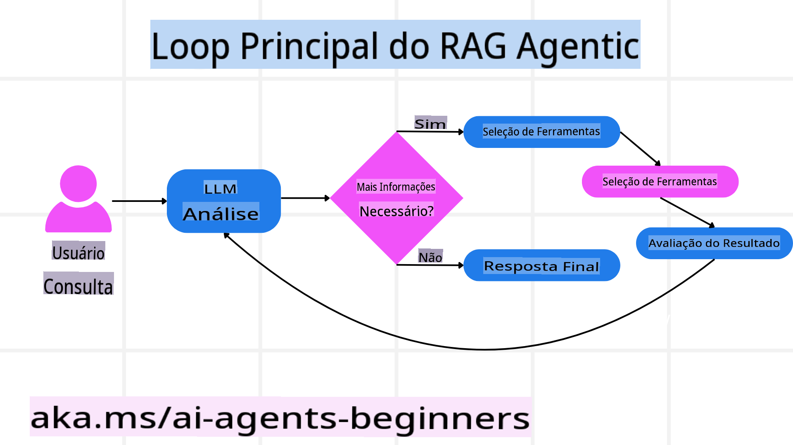
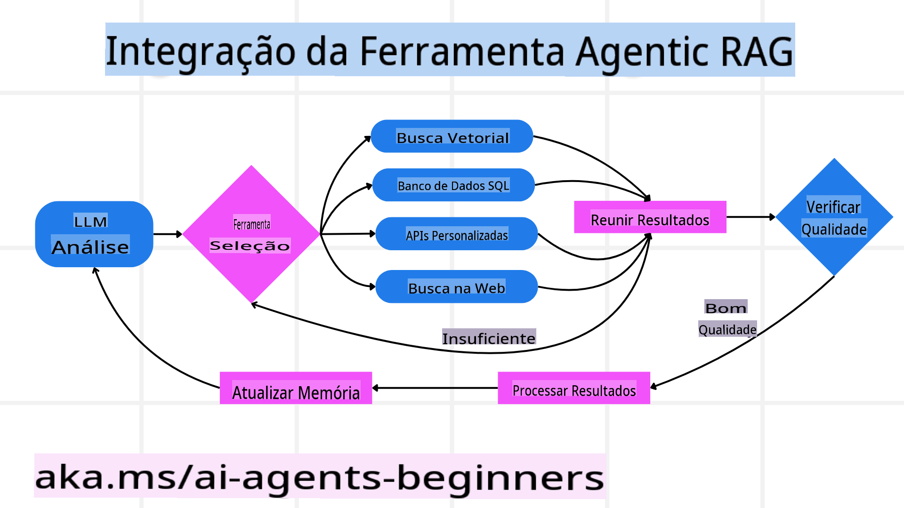
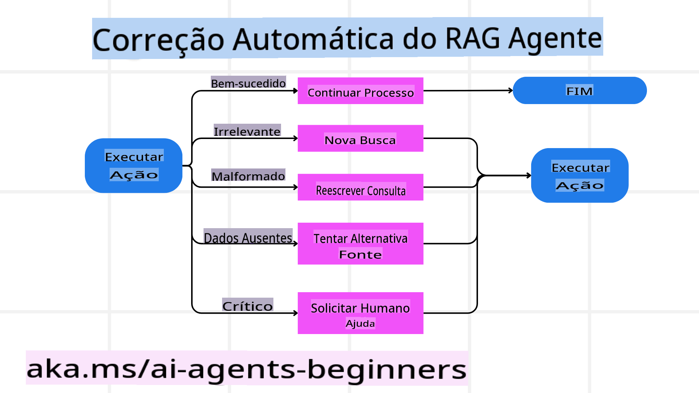
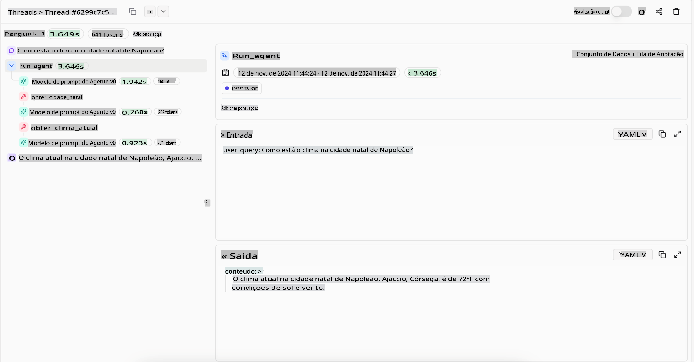

```markdown
# Agentic RAG

Esta lição oferece uma visão abrangente sobre o Agentic Retrieval-Augmented Generation (Agentic RAG), um paradigma emergente de IA em que grandes modelos de linguagem (LLMs) planejam autonomamente seus próximos passos enquanto obtêm informações de fontes externas. Diferentemente dos padrões estáticos de recuperação e leitura, o Agentic RAG envolve chamadas iterativas ao LLM, intercaladas com chamadas de ferramentas ou funções e saídas estruturadas. O sistema avalia os resultados, refina consultas, invoca ferramentas adicionais, se necessário, e continua esse ciclo até alcançar uma solução satisfatória.

## Introdução

Esta lição abordará:

- **Compreender o Agentic RAG:** Aprenda sobre o paradigma emergente em IA onde grandes modelos de linguagem (LLMs) planejam autonomamente seus próximos passos enquanto obtêm informações de fontes de dados externas.
- **Entender o Estilo Iterativo Maker-Checker:** Compreenda o loop de chamadas iterativas ao LLM, intercaladas com chamadas de ferramentas ou funções e saídas estruturadas, projetado para melhorar a precisão e lidar com consultas malformadas.
- **Explorar Aplicações Práticas:** Identifique cenários onde o Agentic RAG se destaca, como ambientes com foco em precisão, interações complexas com bancos de dados e fluxos de trabalho prolongados.

## Objetivos de Aprendizagem

Após concluir esta lição, você será capaz de:

- **Compreender o Agentic RAG:** Entender o paradigma emergente em IA onde grandes modelos de linguagem (LLMs) planejam autonomamente seus próximos passos enquanto obtêm informações de fontes de dados externas.
- **Estilo Iterativo Maker-Checker:** Entender o conceito de um loop de chamadas iterativas ao LLM, intercaladas com chamadas de ferramentas ou funções e saídas estruturadas, projetado para melhorar a precisão e lidar com consultas malformadas.
- **Assumir o Processo de Raciocínio:** Compreender a capacidade do sistema de assumir seu próprio processo de raciocínio, tomando decisões sobre como abordar problemas sem depender de caminhos predefinidos.
- **Fluxo de Trabalho:** Entender como um modelo agentic decide de forma independente recuperar relatórios de tendências de mercado, identificar dados de concorrentes, correlacionar métricas internas de vendas, sintetizar descobertas e avaliar a estratégia.
- **Loops Iterativos, Integração de Ferramentas e Memória:** Aprender sobre a dependência do sistema em um padrão de interação em loop, mantendo estado e memória entre etapas para evitar loops repetitivos e tomar decisões informadas.
- **Lidar com Modos de Falha e Autocorreção:** Explorar os mecanismos robustos de autocorreção do sistema, incluindo iteração e reconsulta, uso de ferramentas de diagnóstico e retorno à supervisão humana.
- **Limitações da Autonomia:** Entender as limitações do Agentic RAG, com foco na autonomia específica do domínio, dependência de infraestrutura e respeito a diretrizes.
- **Casos de Uso Práticos e Valor:** Identificar cenários onde o Agentic RAG se destaca, como ambientes com foco em precisão, interações complexas com bancos de dados e fluxos de trabalho prolongados.
- **Governança, Transparência e Confiança:** Aprender sobre a importância da governança e transparência, incluindo raciocínio explicável, controle de viés e supervisão humana.

## O que é Agentic RAG?

Agentic Retrieval-Augmented Generation (Agentic RAG) é um paradigma emergente de IA em que grandes modelos de linguagem (LLMs) planejam autonomamente seus próximos passos enquanto obtêm informações de fontes externas. Diferentemente dos padrões estáticos de recuperação e leitura, o Agentic RAG envolve chamadas iterativas ao LLM, intercaladas com chamadas de ferramentas ou funções e saídas estruturadas. O sistema avalia os resultados, refina consultas, invoca ferramentas adicionais, se necessário, e continua esse ciclo até alcançar uma solução satisfatória. Esse estilo iterativo “maker-checker” melhora a precisão, lida com consultas malformadas e garante resultados de alta qualidade.

O sistema assume ativamente seu processo de raciocínio, reescrevendo consultas que falham, escolhendo diferentes métodos de recuperação e integrando várias ferramentas—como busca vetorial no Azure AI Search, bancos de dados SQL ou APIs personalizadas—antes de finalizar sua resposta. A qualidade distintiva de um sistema agentic é sua capacidade de assumir seu processo de raciocínio. Implementações tradicionais de RAG dependem de caminhos predefinidos, mas um sistema agentic determina autonomamente a sequência de etapas com base na qualidade da informação encontrada.

## Definindo Agentic Retrieval-Augmented Generation (Agentic RAG)

Agentic Retrieval-Augmented Generation (Agentic RAG) é um paradigma emergente no desenvolvimento de IA onde LLMs não apenas obtêm informações de fontes de dados externas, mas também planejam autonomamente seus próximos passos. Diferentemente dos padrões estáticos de recuperação e leitura ou sequências de prompts cuidadosamente roteirizadas, o Agentic RAG envolve um loop de chamadas iterativas ao LLM, intercaladas com chamadas de ferramentas ou funções e saídas estruturadas. A cada passo, o sistema avalia os resultados obtidos, decide se deve refinar suas consultas, invoca ferramentas adicionais, se necessário, e continua esse ciclo até alcançar uma solução satisfatória.

Esse estilo iterativo “maker-checker” é projetado para melhorar a precisão, lidar com consultas malformadas para bancos de dados estruturados (por exemplo, NL2SQL) e garantir resultados equilibrados e de alta qualidade. Em vez de depender exclusivamente de cadeias de prompts cuidadosamente projetadas, o sistema assume ativamente seu processo de raciocínio. Ele pode reescrever consultas que falham, escolher diferentes métodos de recuperação e integrar várias ferramentas—como busca vetorial no Azure AI Search, bancos de dados SQL ou APIs personalizadas—antes de finalizar sua resposta. Isso elimina a necessidade de frameworks de orquestração excessivamente complexos. Em vez disso, um loop relativamente simples de “chamada LLM → uso de ferramenta → chamada LLM → ...” pode produzir saídas sofisticadas e bem fundamentadas.



## Assumindo o Processo de Raciocínio

A qualidade distintiva que torna um sistema “agentic” é sua capacidade de assumir seu processo de raciocínio. Implementações tradicionais de RAG frequentemente dependem de humanos para pré-definir um caminho para o modelo: uma cadeia de pensamento que delineia o que recuperar e quando. Mas quando um sistema é verdadeiramente agentic, ele decide internamente como abordar o problema. Ele não está apenas executando um script; está determinando autonomamente a sequência de etapas com base na qualidade das informações que encontra. 

Por exemplo, se for solicitado que ele crie uma estratégia de lançamento de produto, ele não depende apenas de um prompt que descreve todo o fluxo de trabalho de pesquisa e tomada de decisão. Em vez disso, o modelo agentic decide de forma independente:

1. Recuperar relatórios de tendências de mercado atuais usando Bing Web Grounding.
2. Identificar dados relevantes de concorrentes usando Azure AI Search.
3. Correlacionar métricas históricas internas de vendas usando Azure SQL Database.
4. Sintetizar as descobertas em uma estratégia coesa orquestrada via Azure OpenAI Service.
5. Avaliar a estratégia em busca de lacunas ou inconsistências, iniciando outra rodada de recuperação, se necessário.

Todas essas etapas—refinando consultas, escolhendo fontes, iterando até “ficar satisfeito” com a resposta—são decididas pelo modelo, e não pré-roteirizadas por um humano.

## Loops Iterativos, Integração de Ferramentas e Memória



Um sistema agentic depende de um padrão de interação em loop:

- **Chamada Inicial:** O objetivo do usuário (ou seja, o prompt do usuário) é apresentado ao LLM.
- **Invocação de Ferramentas:** Se o modelo identificar informações ausentes ou instruções ambíguas, ele seleciona uma ferramenta ou método de recuperação—como uma consulta a um banco de dados vetorial (por exemplo, Azure AI Search Hybrid search sobre dados privados) ou uma chamada SQL estruturada—para obter mais contexto.
- **Avaliação e Refinamento:** Após revisar os dados retornados, o modelo decide se as informações são suficientes. Caso contrário, ele refina a consulta, tenta uma ferramenta diferente ou ajusta sua abordagem.
- **Repetir Até Estar Satisfeito:** Esse ciclo continua até que o modelo determine que possui clareza e evidências suficientes para entregar uma resposta final bem fundamentada.
- **Memória e Estado:** Como o sistema mantém estado e memória entre as etapas, ele pode recordar tentativas anteriores e seus resultados, evitando loops repetitivos e tomando decisões mais informadas à medida que avança.

Com o tempo, isso cria um senso de entendimento em evolução, permitindo que o modelo navegue por tarefas complexas e de múltiplas etapas sem exigir que um humano intervenha constantemente ou reformule o prompt.

## Lidando com Modos de Falha e Autocorreção

A autonomia do Agentic RAG também envolve mecanismos robustos de autocorreção. Quando o sistema encontra impasses—como recuperar documentos irrelevantes ou lidar com consultas malformadas—ele pode:

- **Iterar e Reconsultar:** Em vez de retornar respostas de baixo valor, o modelo tenta novas estratégias de busca, reescreve consultas de banco de dados ou analisa conjuntos de dados alternativos.
- **Usar Ferramentas de Diagnóstico:** O sistema pode invocar funções adicionais projetadas para ajudá-lo a depurar seus passos de raciocínio ou confirmar a precisão dos dados recuperados. Ferramentas como Azure AI Tracing serão importantes para possibilitar uma observabilidade e monitoramento robustos.
- **Recorrer à Supervisão Humana:** Para cenários de alto risco ou falhas repetidas, o modelo pode sinalizar incertezas e solicitar orientação humana. Após receber feedback corretivo, o modelo pode incorporar essa lição para frente.

Essa abordagem iterativa e dinâmica permite que o modelo melhore continuamente, garantindo que ele não seja apenas um sistema de tentativa única, mas sim um que aprende com seus erros durante uma sessão específica.



## Limitações da Autonomia

Apesar de sua autonomia dentro de uma tarefa, o Agentic RAG não é análogo à Inteligência Geral Artificial. Suas capacidades “agentic” estão confinadas às ferramentas, fontes de dados e políticas fornecidas pelos desenvolvedores humanos. Ele não pode inventar suas próprias ferramentas ou sair dos limites do domínio que foram definidos. Em vez disso, ele se destaca ao orquestrar dinamicamente os recursos disponíveis.

Diferenças-chave em relação a formas mais avançadas de IA incluem:

1. **Autonomia Específica do Domínio:** Sistemas Agentic RAG são focados em alcançar objetivos definidos pelo usuário dentro de um domínio conhecido, empregando estratégias como reescrita de consultas ou seleção de ferramentas para melhorar os resultados.
2. **Dependência de Infraestrutura:** As capacidades do sistema dependem das ferramentas e dados integrados pelos desenvolvedores. Ele não pode superar esses limites sem intervenção humana.
3. **Respeito às Diretrizes:** Diretrizes éticas, regras de conformidade e políticas empresariais permanecem muito importantes. A liberdade do agente é sempre restringida por medidas de segurança e mecanismos de supervisão (esperançosamente?).

## Casos de Uso Práticos e Valor

O Agentic RAG se destaca em cenários que exigem refinamento iterativo e precisão:

1. **Ambientes com Foco em Precisão:** Em verificações de conformidade, análises regulatórias ou pesquisas jurídicas, o modelo agentic pode verificar fatos repetidamente, consultar várias fontes e reescrever consultas até produzir uma resposta minuciosamente validada.

2. **Interações Complexas com Bancos de Dados:** Ao lidar com dados estruturados onde as consultas frequentemente falham ou precisam de ajustes, o sistema pode refinar autonomamente suas consultas usando Azure SQL ou Microsoft Fabric OneLake, garantindo que a recuperação final esteja alinhada com a intenção do usuário.

3. **Fluxos de Trabalho Prolongados:** Sessões de longa duração podem evoluir à medida que novas informações surgem. O Agentic RAG pode incorporar continuamente novos dados, ajustando estratégias à medida que aprende mais sobre o problema.

## Governança, Transparência e Confiança

À medida que esses sistemas se tornam mais autônomos em seu raciocínio, a governança e a transparência são cruciais:

- **Raciocínio Explicável:** O modelo pode fornecer um registro auditável das consultas que realizou, das fontes que consultou e dos passos de raciocínio que seguiu para chegar à sua conclusão. Ferramentas como Azure AI Content Safety e Azure AI Tracing / GenAIOps podem ajudar a manter a transparência e mitigar riscos.
- **Controle de Viés e Recuperação Balanceada:** Desenvolvedores podem ajustar estratégias de recuperação para garantir que fontes de dados balanceadas e representativas sejam consideradas, além de auditar regularmente as saídas para detectar viés ou padrões distorcidos usando modelos personalizados para organizações avançadas de ciência de dados com Azure Machine Learning.
- **Supervisão Humana e Conformidade:** Para tarefas sensíveis, a revisão humana permanece essencial. O Agentic RAG não substitui o julgamento humano em decisões de alto risco—ele o complementa, entregando opções mais bem validadas.

Ter ferramentas que forneçam um registro claro das ações é essencial. Sem elas, depurar um processo de múltiplas etapas pode ser muito difícil. Veja abaixo um exemplo de execução de agente da Literal AI (empresa por trás do Chainlit):




## Conclusão

O Agentic RAG representa uma evolução natural em como os sistemas de IA lidam com tarefas complexas e intensivas em dados. Ao adotar um padrão de interação em loop, selecionar ferramentas autonomamente e refinar consultas até alcançar um resultado de alta qualidade, o sistema vai além do simples seguimento de prompts estáticos para se tornar um tomador de decisões mais adaptável e consciente do contexto. Embora ainda esteja limitado por infraestruturas e diretrizes éticas definidas por humanos, essas capacidades agentic possibilitam interações de IA mais ricas, dinâmicas e, em última análise, mais úteis para empresas e usuários finais.

## Recursos Adicionais

- Implementar Retrieval Augmented Generation (RAG) com Azure OpenAI Service: Aprenda como usar seus próprios dados com o Azure OpenAI Service. [Este módulo do Microsoft Learn fornece um guia abrangente sobre como implementar RAG](https://learn.microsoft.com/training/modules/use-own-data-azure-openai)
- Avaliação de aplicativos de IA generativa com Azure AI Foundry: Este artigo aborda a avaliação e comparação de modelos em conjuntos de dados disponíveis publicamente, incluindo [aplicações de IA Agentic e arquiteturas RAG](https://learn.microsoft.com/azure/ai-studio/concepts/evaluation-approach-gen-ai)
- [What is Agentic RAG | Weaviate](https://weaviate.io/blog/what-is-agentic-rag)
- [Agentic RAG: A Complete Guide to Agent-Based Retrieval Augmented Generation – News from generation RAG](https://ragaboutit.com/agentic-rag-a-complete-guide-to-agent-based-retrieval-augmented-generation/)
- [Agentic RAG: turbocharge your RAG with query reformulation and self-query! Hugging Face Open-Source AI Cookbook](https://huggingface.co/learn/cookbook/agent_rag)
- [Adding Agentic Layers to RAG](https://youtu.be/aQ4yQXeB1Ss?si=2HUqBzHoeB5tR04U)
- [The Future of Knowledge Assistants: Jerry Liu](https://www.youtube.com/watch?v=zeAyuLc_f3Q&t=244s)
- [How to Build Agentic RAG Systems](https://www.youtube.com/watch?v=AOSjiXP1jmQ)
- [Using Azure AI Foundry Agent Service to scale your AI agents](https://ignite.microsoft.com/en-US/sessions/BRK102?source=sessions)

### Artigos Acadêmicos

- [2303.17651 Self-Refine: Iterative Refinement with Self-Feedback](https://arxiv.org/abs/2303.17651)
- [2303.11366 Reflexion: Language Agents with Verbal Reinforcement Learning](https://arxiv.org/abs/2303.11366)
- [2305.11738 CRITIC: Large Language Models Can Self-Correct with Tool-Interactive Critiquing](https://arxiv.org/abs/2305.11738)
```

**Aviso Legal**:  
Este documento foi traduzido utilizando serviços de tradução baseados em IA. Embora nos esforcemos para garantir a precisão, esteja ciente de que traduções automatizadas podem conter erros ou imprecisões. O documento original em seu idioma nativo deve ser considerado a fonte autoritativa. Para informações críticas, recomenda-se a tradução profissional feita por humanos. Não nos responsabilizamos por quaisquer mal-entendidos ou interpretações equivocadas decorrentes do uso desta tradução.