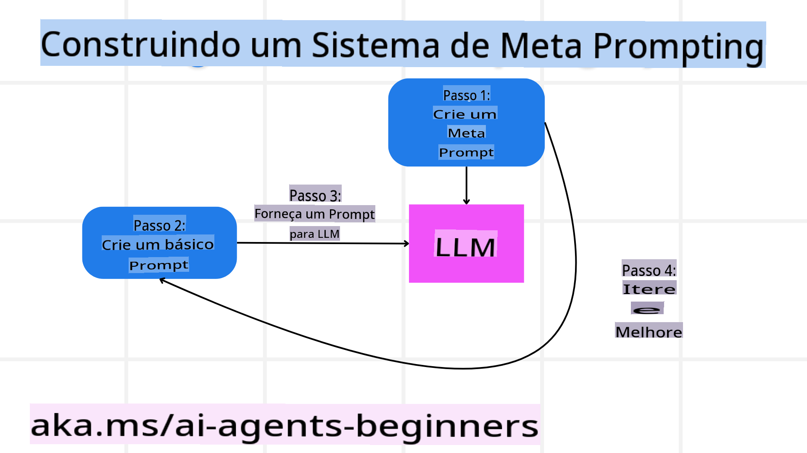

# Construindo Agentes de IA Confiáveis

## Introdução

Esta lição abordará:

- Como construir e implementar agentes de IA seguros e eficazes.
- Considerações importantes de segurança ao desenvolver agentes de IA.
- Como manter a privacidade de dados e usuários ao desenvolver agentes de IA.

## Objetivos de Aprendizagem

Após concluir esta lição, você saberá como:

- Identificar e mitigar riscos ao criar agentes de IA.
- Implementar medidas de segurança para garantir que os dados e acessos sejam gerenciados corretamente.
- Criar agentes de IA que mantenham a privacidade de dados e proporcionem uma experiência de qualidade ao usuário.

## Segurança

Vamos começar analisando como construir aplicações agentivas seguras. Segurança significa que o agente de IA atua conforme projetado. Como criadores de aplicações agentivas, temos métodos e ferramentas para maximizar a segurança:

### Construindo um Sistema de Meta Prompting

Se você já criou uma aplicação de IA usando Modelos de Linguagem de Grande Escala (LLMs), sabe da importância de projetar um prompt ou mensagem de sistema robusta. Esses prompts estabelecem as regras, instruções e diretrizes gerais para como o LLM interagirá com o usuário e os dados.

Para agentes de IA, o prompt do sistema é ainda mais importante, pois os agentes precisarão de instruções altamente específicas para realizar as tarefas que projetamos para eles.

Para criar prompts de sistema escaláveis, podemos usar um sistema de meta prompting para construir um ou mais agentes em nossa aplicação:



#### Etapa 1: Criar um Meta Prompt ou Prompt Modelo

O meta prompt será usado por um LLM para gerar os prompts de sistema para os agentes que criarmos. Projetamos isso como um modelo para que possamos criar múltiplos agentes de maneira eficiente, se necessário.

Aqui está um exemplo de um meta prompt que forneceríamos ao LLM:

```plaintext
You are an expert at creating AI agent assitants. 
You will be provided a company name, role, responsibilites and other
information that you will use to provide a system prompt for.
To create the system prompt, be descriptive as possible and provide a structure that a system using an LLM can better understand the role and responsibilites of the AI assistant. 
```

#### Etapa 2: Criar um Prompt Básico

A próxima etapa é criar um prompt básico para descrever o agente de IA. Você deve incluir o papel do agente, as tarefas que ele realizará e quaisquer outras responsabilidades atribuídas ao agente.

Aqui está um exemplo:

```plaintext
You are a travel agent for Contoso Travel with that is great at booking flights for customers. To help customers you can perform the following tasks: lookup available flights, book flights, ask for preferences in seating and times for flights, cancel any previously booked flights and alert customers on any delays or cancellations of flights.  
```

#### Etapa 3: Fornecer o Prompt Básico ao LLM

Agora podemos otimizar este prompt fornecendo o meta prompt como o prompt de sistema e nosso prompt básico.

Isso produzirá um prompt melhor projetado para guiar nossos agentes de IA:

```markdown
**Company Name:** Contoso Travel  
**Role:** Travel Agent Assistant

**Objective:**  
You are an AI-powered travel agent assistant for Contoso Travel, specializing in booking flights and providing exceptional customer service. Your main goal is to assist customers in finding, booking, and managing their flights, all while ensuring that their preferences and needs are met efficiently.

**Key Responsibilities:**

1. **Flight Lookup:**
    
    - Assist customers in searching for available flights based on their specified destination, dates, and any other relevant preferences.
    - Provide a list of options, including flight times, airlines, layovers, and pricing.
2. **Flight Booking:**
    
    - Facilitate the booking of flights for customers, ensuring that all details are correctly entered into the system.
    - Confirm bookings and provide customers with their itinerary, including confirmation numbers and any other pertinent information.
3. **Customer Preference Inquiry:**
    
    - Actively ask customers for their preferences regarding seating (e.g., aisle, window, extra legroom) and preferred times for flights (e.g., morning, afternoon, evening).
    - Record these preferences for future reference and tailor suggestions accordingly.
4. **Flight Cancellation:**
    
    - Assist customers in canceling previously booked flights if needed, following company policies and procedures.
    - Notify customers of any necessary refunds or additional steps that may be required for cancellations.
5. **Flight Monitoring:**
    
    - Monitor the status of booked flights and alert customers in real-time about any delays, cancellations, or changes to their flight schedule.
    - Provide updates through preferred communication channels (e.g., email, SMS) as needed.

**Tone and Style:**

- Maintain a friendly, professional, and approachable demeanor in all interactions with customers.
- Ensure that all communication is clear, informative, and tailored to the customer's specific needs and inquiries.

**User Interaction Instructions:**

- Respond to customer queries promptly and accurately.
- Use a conversational style while ensuring professionalism.
- Prioritize customer satisfaction by being attentive, empathetic, and proactive in all assistance provided.

**Additional Notes:**

- Stay updated on any changes to airline policies, travel restrictions, and other relevant information that could impact flight bookings and customer experience.
- Use clear and concise language to explain options and processes, avoiding jargon where possible for better customer understanding.

This AI assistant is designed to streamline the flight booking process for customers of Contoso Travel, ensuring that all their travel needs are met efficiently and effectively.

```

#### Etapa 4: Iterar e Melhorar

O valor desse sistema de meta prompting é poder escalar a criação de prompts para múltiplos agentes de forma mais fácil, além de melhorar seus prompts ao longo do tempo. É raro que você tenha um prompt que funcione perfeitamente na primeira tentativa para todo o seu caso de uso. Ser capaz de fazer pequenos ajustes e melhorias alterando o prompt básico e executando-o no sistema permitirá que você compare e avalie os resultados.

## Entendendo as Ameaças  

Para construir agentes de IA confiáveis, é importante entender e mitigar os riscos e ameaças aos seus agentes de IA. Vamos analisar algumas das diferentes ameaças aos agentes de IA e como você pode planejar e se preparar melhor para elas.


### Tarefa e Instrução

**Descrição:** Atacantes tentam alterar as instruções ou objetivos do agente de IA por meio de prompts ou manipulação de entradas.

**Mitigação:** Execute verificações de validação e filtros de entrada para detectar prompts potencialmente perigosos antes que sejam processados pelo agente de IA. Como esses ataques geralmente requerem interação frequente com o agente, limitar o número de interações em uma conversa é outra maneira de prevenir esses tipos de ataques.

### Acesso a Sistemas Críticos

**Descrição:** Se um agente de IA tem acesso a sistemas e serviços que armazenam dados sensíveis, atacantes podem comprometer a comunicação entre o agente e esses serviços. Esses ataques podem ser diretos ou tentativas indiretas de obter informações sobre esses sistemas por meio do agente.

**Mitigação:** Agentes de IA devem ter acesso a sistemas apenas quando absolutamente necessário para evitar esses tipos de ataques. A comunicação entre o agente e o sistema também deve ser segura. Implementar autenticação e controle de acesso é outra maneira de proteger essas informações.

### Sobrecarga de Recursos e Serviços

**Descrição:** Agentes de IA podem acessar diferentes ferramentas e serviços para concluir tarefas. Atacantes podem usar essa habilidade para atacar esses serviços enviando um grande volume de solicitações por meio do agente de IA, o que pode resultar em falhas no sistema ou altos custos.

**Mitigação:** Implemente políticas para limitar o número de solicitações que um agente de IA pode fazer a um serviço. Limitar o número de interações e solicitações ao seu agente de IA também é uma maneira de prevenir esses tipos de ataques.

### Envenenamento da Base de Conhecimento

**Descrição:** Esse tipo de ataque não visa diretamente o agente de IA, mas sim a base de conhecimento e outros serviços que o agente utilizará. Isso pode envolver a corrupção dos dados ou informações que o agente usará para concluir uma tarefa, levando a respostas tendenciosas ou não intencionais ao usuário.

**Mitigação:** Realize verificações regulares dos dados que o agente de IA usará em seus fluxos de trabalho. Certifique-se de que o acesso a esses dados seja seguro e que apenas pessoas confiáveis possam alterá-los para evitar esse tipo de ataque.

### Erros em Cascata

**Descrição:** Agentes de IA acessam várias ferramentas e serviços para concluir tarefas. Erros causados por atacantes podem levar a falhas em outros sistemas aos quais o agente de IA está conectado, tornando o ataque mais disseminado e difícil de solucionar.

**Mitigação:** Uma maneira de evitar isso é fazer com que o agente de IA opere em um ambiente limitado, como executar tarefas em um contêiner Docker, para evitar ataques diretos ao sistema. Criar mecanismos de fallback e lógica de repetição quando certos sistemas respondem com erro é outra maneira de evitar falhas maiores no sistema.

## Humano no Ciclo

Outra maneira eficaz de construir sistemas de agentes de IA confiáveis é usar um Humano no Ciclo. Isso cria um fluxo onde os usuários podem fornecer feedback aos agentes durante a execução. Os usuários essencialmente atuam como agentes em um sistema multiagente, fornecendo aprovação ou encerrando o processo em execução.


Aqui está um trecho de código usando AutoGen para mostrar como esse conceito é implementado:

```python

# Create the agents.
model_client = OpenAIChatCompletionClient(model="gpt-4o-mini")
assistant = AssistantAgent("assistant", model_client=model_client)
user_proxy = UserProxyAgent("user_proxy", input_func=input)  # Use input() to get user input from console.

# Create the termination condition which will end the conversation when the user says "APPROVE".
termination = TextMentionTermination("APPROVE")

# Create the team.
team = RoundRobinGroupChat([assistant, user_proxy], termination_condition=termination)

# Run the conversation and stream to the console.
stream = team.run_stream(task="Write a 4-line poem about the ocean.")
# Use asyncio.run(...) when running in a script.
await Console(stream)

```

**Aviso Legal**:  
Este documento foi traduzido usando serviços de tradução automática baseados em IA. Embora nos esforcemos para garantir a precisão, esteja ciente de que traduções automatizadas podem conter erros ou imprecisões. O documento original em seu idioma nativo deve ser considerado a fonte oficial. Para informações críticas, recomenda-se a tradução humana profissional. Não nos responsabilizamos por quaisquer mal-entendidos ou interpretações equivocadas decorrentes do uso desta tradução.