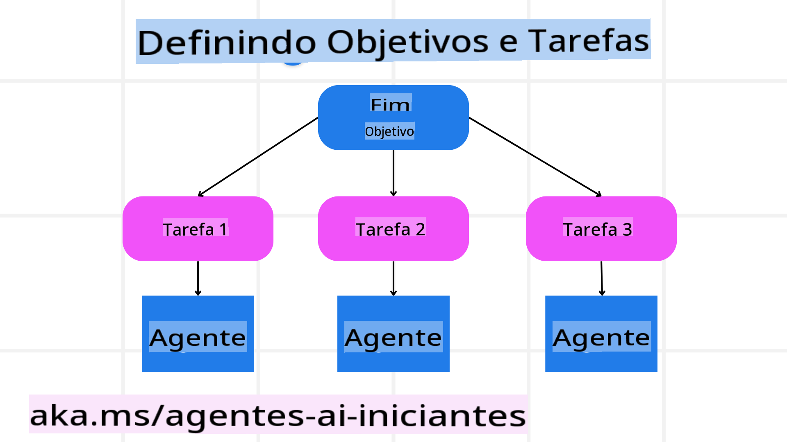

<!--
CO_OP_TRANSLATOR_METADATA:
{
  "original_hash": "8dd9a05d4dc18d3ff510e68e3798a080",
  "translation_date": "2025-03-28T12:01:08+00:00",
  "source_file": "07-planning-design\\README.md",
  "language_code": "pt"
}
-->
[](https://youtu.be/kPfJ2BrBCMY?si=9pYpPXp0sSbK91Dr)

> _(Clique na imagem acima para assistir ao vídeo desta lição)_

# Planejamento de Design

## Introdução

Esta lição abordará:

* Definir um objetivo geral claro e dividir uma tarefa complexa em tarefas mais gerenciáveis.
* Utilizar saída estruturada para respostas mais confiáveis e legíveis por máquinas.
* Aplicar uma abordagem orientada a eventos para lidar com tarefas dinâmicas e entradas inesperadas.

## Objetivos de Aprendizado

Após concluir esta lição, você terá uma compreensão sobre:

* Identificar e estabelecer um objetivo geral para um agente de IA, garantindo que ele saiba claramente o que precisa ser alcançado.
* Dividir uma tarefa complexa em subtarefas gerenciáveis e organizá-las em uma sequência lógica.
* Equipar agentes com as ferramentas certas (por exemplo, ferramentas de busca ou análise de dados), decidir quando e como utilizá-las e lidar com situações inesperadas que surgirem.
* Avaliar os resultados das subtarefas, medir o desempenho e iterar ações para melhorar o resultado final.

## Definindo o Objetivo Geral e Dividindo uma Tarefa



A maioria das tarefas do mundo real é muito complexa para ser abordada em um único passo. Um agente de IA precisa de um objetivo conciso para guiar seu planejamento e ações. Por exemplo, considere o objetivo:

    "Gerar um itinerário de viagem de 3 dias."

Embora seja simples de enunciar, ainda precisa de refinamento. Quanto mais claro for o objetivo, melhor o agente (e qualquer colaborador humano) poderá se concentrar em alcançar o resultado correto, como criar um itinerário abrangente com opções de voo, recomendações de hotéis e sugestões de atividades.

### Decomposição de Tarefa

Tarefas grandes ou complexas tornam-se mais gerenciáveis quando divididas em subtarefas menores e orientadas por objetivos. Para o exemplo do itinerário de viagem, você poderia decompor o objetivo em:

* Reserva de Voos
* Reserva de Hotéis
* Aluguel de Carros
* Personalização

Cada subtarefa pode ser tratada por agentes ou processos dedicados. Um agente pode se especializar em buscar as melhores ofertas de voos, outro em reservas de hotéis, e assim por diante. Um agente coordenador ou "descendente" pode então compilar esses resultados em um itinerário coeso para o usuário final.

Essa abordagem modular também permite aprimoramentos incrementais. Por exemplo, você pode adicionar agentes especializados em recomendações gastronômicas ou sugestões de atividades locais e refinar o itinerário ao longo do tempo.

### Saída Estruturada

Modelos de Linguagem de Grande Escala (LLMs) podem gerar saídas estruturadas (por exemplo, JSON) que são mais fáceis de serem analisadas e processadas por agentes ou serviços subsequentes. Isso é especialmente útil em um contexto de múltiplos agentes, onde podemos executar essas tarefas após receber o resultado do planejamento. Para uma visão geral rápida, veja o exemplo abaixo.

O snippet de Python a seguir demonstra um agente de planejamento simples decompondo um objetivo em subtarefas e gerando um plano estruturado:

```python
from pydantic import BaseModel
from enum import Enum
from typing import List, Optional, Union
import json
import os
from typing import Optional
from pprint import pprint
from autogen_core.models import UserMessage, SystemMessage, AssistantMessage
from autogen_ext.models.azure import AzureAIChatCompletionClient
from azure.core.credentials import AzureKeyCredential

class AgentEnum(str, Enum):
    FlightBooking = "flight_booking"
    HotelBooking = "hotel_booking"
    CarRental = "car_rental"
    ActivitiesBooking = "activities_booking"
    DestinationInfo = "destination_info"
    DefaultAgent = "default_agent"
    GroupChatManager = "group_chat_manager"

# Travel SubTask Model
class TravelSubTask(BaseModel):
    task_details: str
    assigned_agent: AgentEnum  # we want to assign the task to the agent

class TravelPlan(BaseModel):
    main_task: str
    subtasks: List[TravelSubTask]
    is_greeting: bool

client = AzureAIChatCompletionClient(
    model="gpt-4o-mini",
    endpoint="https://models.inference.ai.azure.com",
    # To authenticate with the model you will need to generate a personal access token (PAT) in your GitHub settings.
    # Create your PAT token by following instructions here: https://docs.github.com/en/authentication/keeping-your-account-and-data-secure/managing-your-personal-access-tokens
    credential=AzureKeyCredential(os.environ["GITHUB_TOKEN"]),
    model_info={
        "json_output": False,
        "function_calling": True,
        "vision": True,
        "family": "unknown",
    },
)

# Define the user message
messages = [
    SystemMessage(content="""You are an planner agent.
    Your job is to decide which agents to run based on the user's request.
                      Provide your response in JSON format with the following structure:
{'main_task': 'Plan a family trip from Singapore to Melbourne.',
 'subtasks': [{'assigned_agent': 'flight_booking',
               'task_details': 'Book round-trip flights from Singapore to '
                               'Melbourne.'}
    Below are the available agents specialised in different tasks:
    - FlightBooking: For booking flights and providing flight information
    - HotelBooking: For booking hotels and providing hotel information
    - CarRental: For booking cars and providing car rental information
    - ActivitiesBooking: For booking activities and providing activity information
    - DestinationInfo: For providing information about destinations
    - DefaultAgent: For handling general requests""", source="system"),
    UserMessage(
        content="Create a travel plan for a family of 2 kids from Singapore to Melboune", source="user"),
]

response = await client.create(messages=messages, extra_create_args={"response_format": 'json_object'})

response_content: Optional[str] = response.content if isinstance(
    response.content, str) else None
if response_content is None:
    raise ValueError("Response content is not a valid JSON string" )

pprint(json.loads(response_content))

# # Ensure the response content is a valid JSON string before loading it
# response_content: Optional[str] = response.content if isinstance(
#     response.content, str) else None
# if response_content is None:
#     raise ValueError("Response content is not a valid JSON string")

# # Print the response content after loading it as JSON
# pprint(json.loads(response_content))

# Validate the response content with the MathReasoning model
# TravelPlan.model_validate(json.loads(response_content))
```

### Agente de Planejamento com Orquestração Multi-Agente

Neste exemplo, um Agente Roteador Semântico recebe uma solicitação do usuário (por exemplo, "Preciso de um plano de hotel para minha viagem.").

O planejador então:

* Recebe o Plano de Hotel: O planejador analisa a mensagem do usuário e, com base em um prompt de sistema (incluindo detalhes dos agentes disponíveis), gera um plano de viagem estruturado.
* Lista os Agentes e Suas Ferramentas: O registro de agentes mantém uma lista de agentes (por exemplo, para voos, hotéis, aluguel de carros e atividades) junto com as funções ou ferramentas que oferecem.
* Encaminha o Plano para os Agentes Correspondentes: Dependendo do número de subtarefas, o planejador envia a mensagem diretamente para um agente dedicado (em cenários de tarefa única) ou coordena via um gerenciador de bate-papo em grupo para colaboração multi-agente.
* Resume o Resultado: Finalmente, o planejador resume o plano gerado para maior clareza.

O exemplo de código Python a seguir ilustra essas etapas:

```python

from pydantic import BaseModel

from enum import Enum
from typing import List, Optional, Union

class AgentEnum(str, Enum):
    FlightBooking = "flight_booking"
    HotelBooking = "hotel_booking"
    CarRental = "car_rental"
    ActivitiesBooking = "activities_booking"
    DestinationInfo = "destination_info"
    DefaultAgent = "default_agent"
    GroupChatManager = "group_chat_manager"

# Travel SubTask Model

class TravelSubTask(BaseModel):
    task_details: str
    assigned_agent: AgentEnum # we want to assign the task to the agent

class TravelPlan(BaseModel):
    main_task: str
    subtasks: List[TravelSubTask]
    is_greeting: bool
import json
import os
from typing import Optional

from autogen_core.models import UserMessage, SystemMessage, AssistantMessage
from autogen_ext.models.openai import AzureOpenAIChatCompletionClient

# Create the client with type-checked environment variables

client = AzureOpenAIChatCompletionClient(
    azure_deployment=os.getenv("AZURE_OPENAI_DEPLOYMENT_NAME"),
    model=os.getenv("AZURE_OPENAI_DEPLOYMENT_NAME"),
    api_version=os.getenv("AZURE_OPENAI_API_VERSION"),
    azure_endpoint=os.getenv("AZURE_OPENAI_ENDPOINT"),
    api_key=os.getenv("AZURE_OPENAI_API_KEY"),
)

from pprint import pprint

# Define the user message

messages = [
    SystemMessage(content="""You are an planner agent.
    Your job is to decide which agents to run based on the user's request.
    Below are the available agents specialized in different tasks:
    - FlightBooking: For booking flights and providing flight information
    - HotelBooking: For booking hotels and providing hotel information
    - CarRental: For booking cars and providing car rental information
    - ActivitiesBooking: For booking activities and providing activity information
    - DestinationInfo: For providing information about destinations
    - DefaultAgent: For handling general requests""", source="system"),
    UserMessage(content="Create a travel plan for a family of 2 kids from Singapore to Melbourne", source="user"),
]

response = await client.create(messages=messages, extra_create_args={"response_format": TravelPlan})

# Ensure the response content is a valid JSON string before loading it

response_content: Optional[str] = response.content if isinstance(response.content, str) else None
if response_content is None:
    raise ValueError("Response content is not a valid JSON string")

# Print the response content after loading it as JSON

pprint(json.loads(response_content))
```

O que segue é a saída do código anterior, que pode ser usada para encaminhar para `assigned_agent` e resumir o plano de viagem para o usuário final.

```json
{
    "is_greeting": "False",
    "main_task": "Plan a family trip from Singapore to Melbourne.",
    "subtasks": [
        {
            "assigned_agent": "flight_booking",
            "task_details": "Book round-trip flights from Singapore to Melbourne."
        },
        {
            "assigned_agent": "hotel_booking",
            "task_details": "Find family-friendly hotels in Melbourne."
        },
        {
            "assigned_agent": "car_rental",
            "task_details": "Arrange a car rental suitable for a family of four in Melbourne."
        },
        {
            "assigned_agent": "activities_booking",
            "task_details": "List family-friendly activities in Melbourne."
        },
        {
            "assigned_agent": "destination_info",
            "task_details": "Provide information about Melbourne as a travel destination."
        }
    ]
}
```

Um notebook de exemplo com o código anterior está disponível [aqui](../../../07-planning-design/07-autogen.ipynb).

### Planejamento Iterativo

Algumas tarefas requerem um processo de ida e volta ou replanejamento, onde o resultado de uma subtarefa influencia a próxima. Por exemplo, se o agente descobrir um formato de dados inesperado ao reservar voos, ele pode precisar adaptar sua estratégia antes de prosseguir para as reservas de hotéis.

Além disso, o feedback do usuário (por exemplo, um humano decidir que prefere um voo mais cedo) pode desencadear um replanejamento parcial. Essa abordagem dinâmica e iterativa garante que a solução final esteja alinhada com as restrições do mundo real e as preferências do usuário em evolução.

Exemplo de código:

```python
from autogen_core.models import UserMessage, SystemMessage, AssistantMessage
#.. same as previous code and pass on the user history, current plan
messages = [
    SystemMessage(content="""You are a planner agent to optimize the
    Your job is to decide which agents to run based on the user's request.
    Below are the available agents specialized in different tasks:
    - FlightBooking: For booking flights and providing flight information
    - HotelBooking: For booking hotels and providing hotel information
    - CarRental: For booking cars and providing car rental information
    - ActivitiesBooking: For booking activities and providing activity information
    - DestinationInfo: For providing information about destinations
    - DefaultAgent: For handling general requests""", source="system"),
    UserMessage(content="Create a travel plan for a family of 2 kids from Singapore to Melbourne", source="user"),
    AssistantMessage(content=f"Previous travel plan - {TravelPlan}", source="assistant")
]
# .. re-plan and send the tasks to respective agents
```

Para um planejamento mais abrangente, confira Magnetic One para resolver tarefas complexas.

## Resumo

Neste artigo, vimos um exemplo de como criar um planejador que pode selecionar dinamicamente os agentes disponíveis definidos. A saída do planejador decompõe as tarefas e atribui os agentes para que possam ser executadas. Presume-se que os agentes tenham acesso às funções/ferramentas necessárias para realizar a tarefa. Além dos agentes, você pode incluir outros padrões como reflexão, sumarizador e bate-papo em rodízio para personalizar ainda mais.

## Recursos Adicionais

* AutoGen Magnetic One - Um sistema multi-agente generalista para resolver tarefas complexas, que alcançou resultados impressionantes em múltiplos benchmarks desafiadores de agentes. Referência:

. Nesta implementação, o orquestrador cria um plano específico para a tarefa e delega essas tarefas aos agentes disponíveis. Além do planejamento, o orquestrador também emprega um mecanismo de rastreamento para monitorar o progresso da tarefa e replanejar conforme necessário.

## Lição Anterior

[Construindo Agentes de IA Confiáveis](../06-building-trustworthy-agents/README.md)

## Próxima Lição

[Padrão de Design Multi-Agente](../08-multi-agent/README.md)

**Aviso Legal**:  
Este documento foi traduzido utilizando o serviço de tradução por IA [Co-op Translator](https://github.com/Azure/co-op-translator). Embora nos esforcemos para garantir a precisão, esteja ciente de que traduções automáticas podem conter erros ou imprecisões. O documento original em seu idioma nativo deve ser considerado a fonte autoritativa. Para informações críticas, recomenda-se a tradução profissional realizada por humanos. Não nos responsabilizamos por quaisquer mal-entendidos ou interpretações equivocadas decorrentes do uso desta tradução.