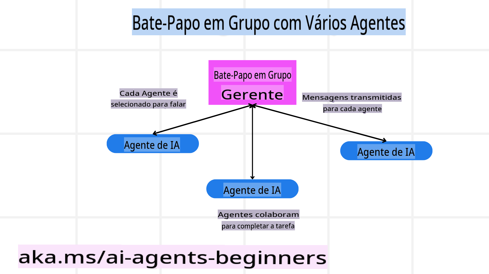
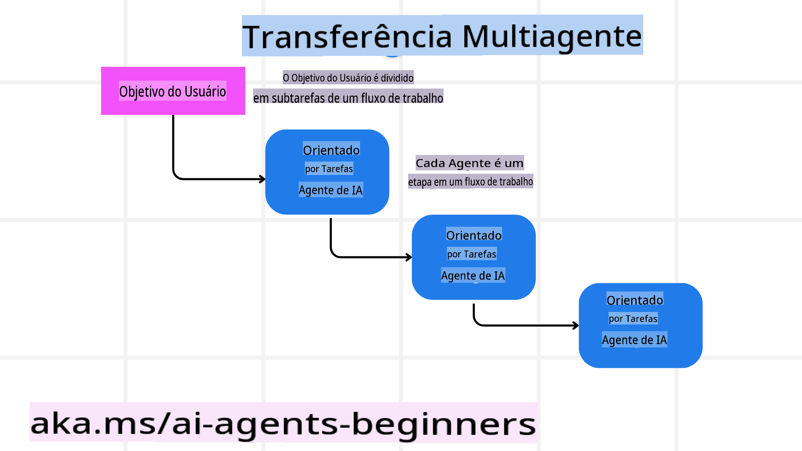
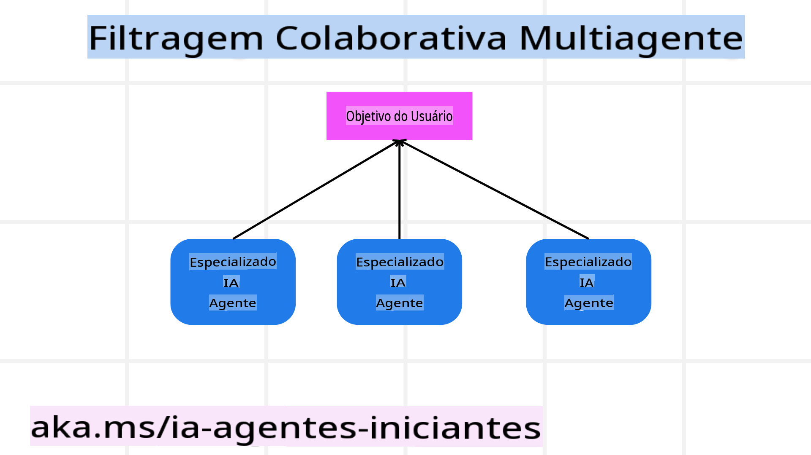

<!--
CO_OP_TRANSLATOR_METADATA:
{
  "original_hash": "bdb0a92e5a437d5fa985a6863f4a836c",
  "translation_date": "2025-03-28T12:03:46+00:00",
  "source_file": "08-multi-agent\\README.md",
  "language_code": "pt"
}
-->

> _(Clique na imagem acima para assistir ao vídeo desta lição)_

# Padrões de design multiagente

Assim que você começar a trabalhar em um projeto que envolva múltiplos agentes, será necessário considerar o padrão de design multiagente. No entanto, pode não ser imediatamente claro quando mudar para multiagentes e quais são as vantagens disso.

## Introdução

Nesta lição, buscamos responder às seguintes perguntas:

- Quais são os cenários onde os multiagentes são aplicáveis?
- Quais são as vantagens de usar multiagentes em vez de um único agente realizando várias tarefas?
- Quais são os blocos de construção para implementar o padrão de design multiagente?
- Como podemos ter visibilidade sobre como os múltiplos agentes estão interagindo uns com os outros?

## Objetivos de aprendizado

Após esta lição, você deverá ser capaz de:

- Identificar cenários onde multiagentes são aplicáveis.
- Reconhecer as vantagens de usar multiagentes em vez de um único agente.
- Compreender os blocos de construção para implementar o padrão de design multiagente.

Qual é o panorama geral?

*Multiagentes são um padrão de design que permite que múltiplos agentes trabalhem juntos para alcançar um objetivo comum*.

Esse padrão é amplamente utilizado em vários campos, incluindo robótica, sistemas autônomos e computação distribuída.

## Cenários onde os multiagentes são aplicáveis

Então, quais cenários são bons casos de uso para multiagentes? A resposta é que existem muitos cenários onde empregar múltiplos agentes é benéfico, especialmente nos seguintes casos:

- **Altas cargas de trabalho**: Altas cargas de trabalho podem ser divididas em tarefas menores e atribuídas a diferentes agentes, permitindo o processamento em paralelo e uma conclusão mais rápida. Um exemplo disso é no caso de uma grande tarefa de processamento de dados.
- **Tarefas complexas**: Tarefas complexas, assim como grandes cargas de trabalho, podem ser divididas em subtarefas menores e atribuídas a diferentes agentes, cada um especializado em um aspecto específico da tarefa. Um bom exemplo disso é no caso de veículos autônomos, onde diferentes agentes gerenciam navegação, detecção de obstáculos e comunicação com outros veículos.
- **Diversidade de especialização**: Diferentes agentes podem ter especializações diversas, permitindo que lidem com diferentes aspectos de uma tarefa de maneira mais eficaz do que um único agente. Para este caso, um bom exemplo é na área de saúde, onde agentes podem gerenciar diagnósticos, planos de tratamento e monitoramento de pacientes.

## Vantagens de usar multiagentes em vez de um único agente

Um sistema de agente único pode funcionar bem para tarefas simples, mas para tarefas mais complexas, usar múltiplos agentes pode oferecer várias vantagens:

- **Especialização**: Cada agente pode ser especializado em uma tarefa específica. A falta de especialização em um único agente significa que você tem um agente que pode fazer tudo, mas pode se confundir sobre o que fazer quando confrontado com uma tarefa complexa. Ele pode, por exemplo, acabar realizando uma tarefa para a qual não está melhor preparado.
- **Escalabilidade**: É mais fácil escalar sistemas adicionando mais agentes em vez de sobrecarregar um único agente.
- **Tolerância a falhas**: Se um agente falhar, outros podem continuar funcionando, garantindo a confiabilidade do sistema.

Vamos a um exemplo: vamos reservar uma viagem para um usuário. Um sistema de agente único teria que lidar com todos os aspectos do processo de reserva de viagem, desde encontrar voos até reservar hotéis e carros de aluguel. Para conseguir isso com um único agente, ele precisaria ter ferramentas para lidar com todas essas tarefas. Isso poderia levar a um sistema complexo e monolítico que seria difícil de manter e escalar. Um sistema multiagente, por outro lado, poderia ter diferentes agentes especializados em encontrar voos, reservar hotéis e carros de aluguel. Isso tornaria o sistema mais modular, fácil de manter e escalável.

Compare isso com uma agência de viagens administrada como uma loja familiar versus uma agência de viagens operada como uma franquia. A loja familiar teria um único agente lidando com todos os aspectos do processo de reserva de viagem, enquanto a franquia teria diferentes agentes lidando com diferentes aspectos do processo.

## Blocos de construção para implementar o padrão de design multiagente

Antes de implementar o padrão de design multiagente, é necessário entender os blocos de construção que compõem o padrão.

Vamos tornar isso mais concreto olhando novamente para o exemplo de reservar uma viagem para um usuário. Nesse caso, os blocos de construção incluiriam:

- **Comunicação entre agentes**: Agentes para encontrar voos, reservar hotéis e carros de aluguel precisam se comunicar e compartilhar informações sobre as preferências e restrições do usuário. Você precisa decidir os protocolos e métodos para essa comunicação. O que isso significa concretamente é que o agente para encontrar voos precisa se comunicar com o agente para reservar hotéis para garantir que o hotel seja reservado para as mesmas datas do voo. Isso significa que os agentes precisam compartilhar informações sobre as datas de viagem do usuário, o que implica decidir *quais agentes estão compartilhando informações e como estão fazendo isso*.
- **Mecanismos de coordenação**: Os agentes precisam coordenar suas ações para garantir que as preferências e restrições do usuário sejam atendidas. Uma preferência do usuário pode ser que ele queira um hotel próximo ao aeroporto, enquanto uma restrição pode ser que carros de aluguel estejam disponíveis apenas no aeroporto. Isso significa que o agente para reservar hotéis precisa coordenar com o agente para reservar carros de aluguel para garantir que as preferências e restrições do usuário sejam atendidas. Isso implica decidir *como os agentes estão coordenando suas ações*.
- **Arquitetura dos agentes**: Os agentes precisam ter uma estrutura interna para tomar decisões e aprender com suas interações com o usuário. Isso significa que o agente para encontrar voos precisa ter uma estrutura interna para tomar decisões sobre quais voos recomendar ao usuário. Isso implica decidir *como os agentes estão tomando decisões e aprendendo com suas interações com o usuário*. Exemplos de como um agente aprende e melhora podem incluir o uso de um modelo de aprendizado de máquina pelo agente para encontrar voos, recomendando voos ao usuário com base em suas preferências anteriores.
- **Visibilidade nas interações entre agentes**: É necessário ter visibilidade sobre como os múltiplos agentes estão interagindo uns com os outros. Isso implica ter ferramentas e técnicas para rastrear as atividades e interações dos agentes. Isso pode incluir ferramentas de registro e monitoramento, ferramentas de visualização e métricas de desempenho.
- **Padrões de multiagentes**: Existem diferentes padrões para implementar sistemas multiagentes, como arquiteturas centralizadas, descentralizadas e híbridas. É necessário decidir o padrão que melhor se adapta ao seu caso de uso.
- **Humano no circuito**: Na maioria dos casos, haverá um humano no circuito, e é necessário instruir os agentes sobre quando pedir intervenção humana. Isso pode incluir o usuário solicitando um hotel ou voo específico que os agentes não recomendaram ou pedindo confirmação antes de reservar um voo ou hotel.

## Visibilidade nas interações entre agentes

É importante ter visibilidade sobre como os múltiplos agentes estão interagindo uns com os outros. Essa visibilidade é essencial para depuração, otimização e garantia da eficácia geral do sistema. Para alcançar isso, é necessário ter ferramentas e técnicas para rastrear as atividades e interações dos agentes. Isso pode incluir ferramentas de registro e monitoramento, ferramentas de visualização e métricas de desempenho.

Por exemplo, no caso de reservar uma viagem para um usuário, você poderia ter um painel que mostra o status de cada agente, as preferências e restrições do usuário e as interações entre os agentes. Esse painel poderia mostrar as datas de viagem do usuário, os voos recomendados pelo agente de voos, os hotéis recomendados pelo agente de hotéis e os carros de aluguel recomendados pelo agente de carros de aluguel. Isso daria uma visão clara de como os agentes estão interagindo uns com os outros e se as preferências e restrições do usuário estão sendo atendidas.

Vamos examinar cada um desses aspectos com mais detalhes.

- **Ferramentas de registro e monitoramento**: Você deseja que cada ação realizada por um agente seja registrada. Um registro pode armazenar informações sobre o agente que realizou a ação, a ação realizada, o momento em que a ação foi realizada e o resultado da ação. Essas informações podem ser usadas para depuração, otimização e mais.

- **Ferramentas de visualização**: Ferramentas de visualização podem ajudar você a ver as interações entre agentes de maneira mais intuitiva. Por exemplo, você poderia ter um gráfico que mostra o fluxo de informações entre os agentes. Isso pode ajudar a identificar gargalos, ineficiências e outros problemas no sistema.

- **Métricas de desempenho**: Métricas de desempenho podem ajudar você a acompanhar a eficácia do sistema multiagente. Por exemplo, você poderia acompanhar o tempo necessário para concluir uma tarefa, o número de tarefas concluídas por unidade de tempo e a precisão das recomendações feitas pelos agentes. Essas informações podem ajudar a identificar áreas para melhoria e otimizar o sistema.

## Padrões de multiagentes

Vamos explorar alguns padrões concretos que podemos usar para criar aplicativos multiagentes. Aqui estão alguns padrões interessantes que vale a pena considerar:

### Chat em grupo

Este padrão é útil quando você deseja criar um aplicativo de chat em grupo onde múltiplos agentes podem se comunicar uns com os outros. Casos de uso típicos para este padrão incluem colaboração em equipe, suporte ao cliente e redes sociais.

Neste padrão, cada agente representa um usuário no chat em grupo, e as mensagens são trocadas entre os agentes usando um protocolo de mensagens. Os agentes podem enviar mensagens ao chat em grupo, receber mensagens do chat em grupo e responder a mensagens de outros agentes.

Este padrão pode ser implementado usando uma arquitetura centralizada, onde todas as mensagens são roteadas por um servidor central, ou uma arquitetura descentralizada, onde as mensagens são trocadas diretamente.

### Transferência de tarefas

Este padrão é útil quando você deseja criar um aplicativo onde múltiplos agentes podem transferir tarefas uns para os outros.

Casos de uso típicos para este padrão incluem suporte ao cliente, gerenciamento de tarefas e automação de fluxo de trabalho.

Neste padrão, cada agente representa uma tarefa ou uma etapa em um fluxo de trabalho, e os agentes podem transferir tarefas para outros agentes com base em regras predefinidas.

### Filtragem colaborativa

Este padrão é útil quando você deseja criar um aplicativo onde múltiplos agentes podem colaborar para fazer recomendações aos usuários.

Por que você gostaria que múltiplos agentes colaborassem? Porque cada agente pode ter diferentes especializações e contribuir para o processo de recomendação de maneiras distintas.

Vamos a um exemplo onde um usuário deseja uma recomendação sobre o melhor estoque para comprar no mercado de ações.

- **Especialista em indústria**: Um agente poderia ser um especialista em um setor específico.
- **Análise técnica**: Outro agente poderia ser especialista em análise técnica.
- **Análise fundamental**: E outro agente poderia ser especialista em análise fundamental. Ao colaborar, esses agentes podem fornecer uma recomendação mais abrangente ao usuário.

## Cenário: Processo de reembolso

Considere um cenário onde um cliente está tentando obter um reembolso por um produto. Pode haver vários agentes envolvidos nesse processo, mas vamos dividi-los entre agentes específicos para esse processo e agentes gerais que podem ser usados em outros processos.

**Agentes específicos para o processo de reembolso**:

A seguir estão alguns agentes que poderiam estar envolvidos no processo de reembolso:

- **Agente do cliente**: Este agente representa o cliente e é responsável por iniciar o processo de reembolso.
- **Agente do vendedor**: Este agente representa o vendedor e é responsável por processar o reembolso.
- **Agente de pagamento**: Este agente representa o processo de pagamento e é responsável por reembolsar o pagamento do cliente.
- **Agente de resolução**: Este agente representa o processo de resolução e é responsável por resolver quaisquer problemas que surjam durante o processo de reembolso.
- **Agente de conformidade**: Este agente representa o processo de conformidade e é responsável por garantir que o processo de reembolso esteja em conformidade com regulamentos e políticas.

**Agentes gerais**:

Esses agentes podem ser usados em outras partes do seu negócio.

- **Agente de envio**: Este agente representa o processo de envio e é responsável por enviar o produto de volta ao vendedor. Este agente pode ser usado tanto no processo de reembolso quanto no envio geral de um produto, como em uma compra, por exemplo.
- **Agente de feedback**: Este agente representa o processo de feedback e é responsável por coletar feedback do cliente. O feedback pode ser coletado a qualquer momento, não apenas durante o processo de reembolso.
- **Agente de escalonamento**: Este agente representa o processo de escalonamento e é responsável por escalonar problemas para um nível mais alto de suporte. Você pode usar este tipo de agente para qualquer processo onde seja necessário escalonar um problema.
- **Agente de notificações**: Este agente representa o processo de notificações e é responsável por enviar notificações ao cliente em várias etapas do processo de reembolso.
- **Agente de análise**: Este agente representa o processo de análise e é responsável por analisar dados relacionados ao processo de reembolso.
- **Agente de auditoria**: Este agente representa o processo de auditoria e é responsável por auditar o processo de reembolso para garantir que está sendo realizado corretamente.
- **Agente de relatórios**: Este agente representa o processo de relatórios e é responsável por gerar relatórios sobre o processo de reembolso.
- **Agente de conhecimento**: Este agente representa o processo de conhecimento e é responsável por manter uma base de conhecimento de informações relacionadas ao processo de reembolso. Este agente pode ser útil tanto para reembolsos quanto para outras partes do seu negócio.
- **Agente de segurança**: Este agente representa o processo de segurança e é responsável por garantir a segurança do processo de reembolso.
- **Agente de qualidade**: Este agente representa o processo de qualidade e é responsável por garantir a qualidade do processo de reembolso.

Há muitos agentes listados anteriormente, tanto para o processo específico de reembolso quanto para os agentes gerais que podem ser usados em outras partes do seu negócio. Esperamos que isso lhe dê uma ideia de como decidir quais agentes usar em seu sistema multiagente.

## Tarefa

Desenhe um sistema multiagente para um processo de suporte ao cliente. Identifique os agentes envolvidos no processo, seus papéis e responsabilidades, e como eles interagem uns com os outros. Considere tanto agentes específicos para o processo de suporte ao cliente quanto agentes gerais que podem ser usados em outras partes do seu negócio.

> Pense antes de ler a solução a seguir; você pode precisar de mais agentes do que imagina.

> DICA: Pense nas diferentes etapas do processo de suporte ao cliente e também considere os agentes necessários para qualquer sistema.

## Solução

[Solução](./solution/solution.md)

## Verificação de conhecimento

Pergunta: Quando você deve considerar usar multiagentes?

- [ ] A1: Quando você tem uma carga de trabalho pequena e uma tarefa simples.
- [ ] A2: Quando você tem uma grande carga de trabalho.
- [ ] A3: Quando você tem uma tarefa simples.

[Quiz de solução](./solution/solution-quiz.md)

## Resumo

Nesta lição, examinamos o padrão de design multiagente, incluindo os cenários onde os multiagentes são aplicáveis, as vantagens de usar multiagentes em vez de um único agente, os blocos de construção para implementar o padrão de design multiagente e como ter visibilidade sobre como os múltiplos agentes estão interagindo uns com os outros.

## Recursos adicionais

## Lição anterior

[Design de planejamento](../07-planning-design/README.md)

## Próxima lição

[Metacognição em agentes de IA](../09-metacognition/README.md)

**Aviso Legal**:  
Este documento foi traduzido utilizando o serviço de tradução por IA [Co-op Translator](https://github.com/Azure/co-op-translator). Embora nos esforcemos pela precisão, esteja ciente de que traduções automáticas podem conter erros ou imprecisões. O documento original em seu idioma nativo deve ser considerado a fonte autoritária. Para informações críticas, recomenda-se a tradução profissional feita por humanos. Não nos responsabilizamos por quaisquer mal-entendidos ou interpretações equivocadas decorrentes do uso desta tradução.