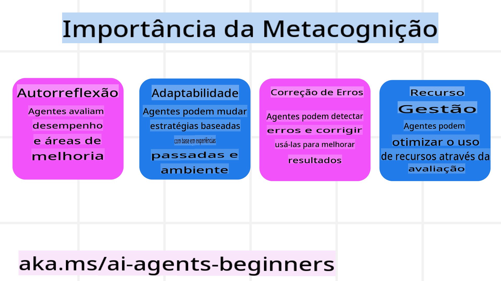
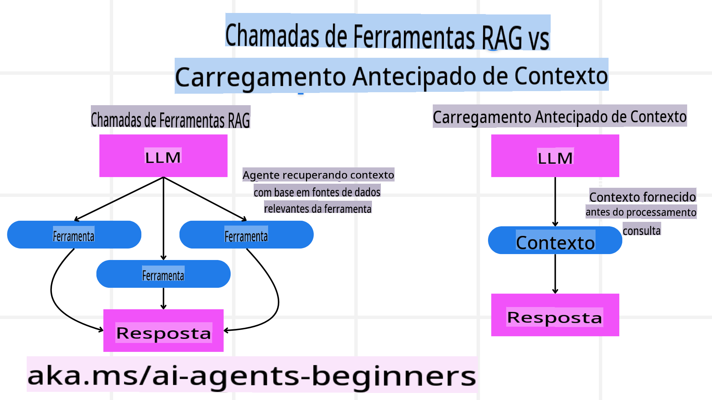

<!--
CO_OP_TRANSLATOR_METADATA:
{
  "original_hash": "3171ed887315c3ddeaccf966e40e9a50",
  "translation_date": "2025-03-28T12:13:27+00:00",
  "source_file": "09-metacognition\\README.md",
  "language_code": "pt"
}
-->
[](https://youtu.be/His9R6gw6Ec?si=3_RMb8VprNvdLRhX)

> _(Clique na imagem acima para assistir ao vídeo desta aula)_
# Metacognição em Agentes de IA ## Introdução Bem-vindo à aula sobre metacognição em agentes de IA! Este capítulo foi criado para iniciantes que têm curiosidade sobre como os agentes de IA podem refletir sobre seus próprios processos de pensamento. Ao final desta aula, você entenderá conceitos-chave e terá exemplos práticos para aplicar metacognição no design de agentes de IA. ## Objetivos de Aprendizado Após completar esta aula, você será capaz de: 1. Compreender as implicações de ciclos de raciocínio nas definições de agentes. 2. Utilizar técnicas de planejamento e avaliação para ajudar agentes a se corrigirem. 3. Criar seus próprios agentes capazes de manipular código para realizar tarefas. ## Introdução à Metacognição Metacognição refere-se aos processos cognitivos de ordem superior que envolvem pensar sobre o próprio pensamento. Para agentes de IA, isso significa ser capaz de avaliar e ajustar suas ações com base na autoconsciência e em experiências passadas. Metacognição, ou "pensar sobre pensar", é um conceito importante no desenvolvimento de sistemas de IA com características de agência. Isso envolve sistemas de IA que têm consciência de seus próprios processos internos e são capazes de monitorar, regular e adaptar seu comportamento de forma correspondente. Assim como fazemos quando analisamos o ambiente ou enfrentamos um problema. Essa autoconsciência pode ajudar os sistemas de IA a tomarem decisões melhores, identificarem erros e melhorarem seu desempenho ao longo do tempo — conectando-se novamente ao teste de Turing e ao debate sobre se a IA vai dominar o mundo. No contexto de sistemas de IA com características de agência, a metacognição pode ajudar a resolver vários desafios, como: - Transparência: Garantir que os sistemas de IA possam explicar seu raciocínio e decisões. - Raciocínio: Melhorar a capacidade dos sistemas de IA de sintetizar informações e tomar decisões sólidas. - Adaptação: Permitir que os sistemas de IA se ajustem a novos ambientes e condições em mudança. - Percepção: Melhorar a precisão dos sistemas de IA ao reconhecer e interpretar dados de seu ambiente. ### O que é Metacognição? Metacognição, ou "pensar sobre pensar", é um processo cognitivo de ordem superior que envolve autoconsciência e autorregulação dos próprios processos cognitivos. No campo da IA, a metacognição capacita agentes a avaliarem e adaptarem suas estratégias e ações, levando a melhores habilidades de resolução de problemas e tomada de decisão. Ao entender a metacognição, você pode projetar agentes de IA que não apenas sejam mais inteligentes, mas também mais adaptáveis e eficientes. Em verdadeira metacognição, você veria a IA raciocinando explicitamente sobre seu próprio raciocínio. Exemplo: “Eu priorizei voos mais baratos porque… talvez esteja perdendo voos diretos, então deixe-me verificar novamente.” Mantendo registro de como ou por que escolheu uma determinada rota. - Observando que cometeu erros porque confiou demais nas preferências do usuário da última vez, então modifica sua estratégia de tomada de decisão, não apenas a recomendação final. - Diagnosticando padrões como: “Sempre que vejo o usuário mencionar ‘muito cheio’, não devo apenas remover certas atrações, mas também refletir que meu método de escolher ‘principais atrações’ é falho se eu sempre classifico por popularidade.” ### Importância da Metacognição em Agentes de IA A metacognição desempenha um papel crucial no design de agentes de IA por várias razões:  - Auto-reflexão: Agentes podem avaliar seu próprio desempenho e identificar áreas para melhoria. - Adaptabilidade: Agentes podem modificar suas estratégias com base em experiências passadas e ambientes em mudança. - Correção de Erros: Agentes podem detectar e corrigir erros de forma autônoma, levando a resultados mais precisos. - Gestão de Recursos: Agentes podem otimizar o uso de recursos, como tempo e poder computacional, planejando e avaliando suas ações. ## Componentes de um Agente de IA Antes de mergulhar nos processos metacognitivos, é essencial entender os componentes básicos de um agente de IA. Um agente de IA normalmente consiste em: - Persona: A personalidade e características do agente, que definem como ele interage com os usuários. - Ferramentas: As capacidades e funções que o agente pode realizar. - Habilidades: O conhecimento e a expertise que o agente possui. Esses componentes trabalham juntos para criar uma "unidade de expertise" capaz de realizar tarefas específicas. **Exemplo**: Considere um agente de viagens, serviços de agentes que não apenas planejam sua viagem, mas também ajustam seu caminho com base em dados em tempo real e experiências anteriores de jornada do cliente. ### Exemplo: Metacognição em um Serviço de Agente de Viagem Imagine que você está projetando um serviço de agente de viagens movido por IA. Esse agente, "Agente de Viagem", ajuda usuários a planejarem suas férias. Para incorporar metacognição, o Agente de Viagem precisa avaliar e ajustar suas ações com base na autoconsciência e em experiências passadas. Veja como a metacognição pode desempenhar um papel: #### Tarefa Atual A tarefa atual é ajudar um usuário a planejar uma viagem para Paris. #### Etapas para Completar a Tarefa 1. **Coletar Preferências do Usuário**: Perguntar ao usuário sobre datas de viagem, orçamento, interesses (ex.: museus, gastronomia, compras) e quaisquer requisitos específicos. 2. **Buscar Informações**: Procurar opções de voos, acomodações, atrações e restaurantes que correspondam às preferências do usuário. 3. **Gerar Recomendações**: Fornecer um itinerário personalizado com detalhes de voos, reservas de hotéis e atividades sugeridas. 4. **Ajustar com Base no Feedback**: Pedir feedback ao usuário sobre as recomendações e fazer os ajustes necessários. #### Recursos Necessários - Acesso a bancos de dados de reservas de voos e hotéis. - Informações sobre atrações e restaurantes parisienses. - Dados de feedback de interações anteriores com usuários. #### Experiência e Auto-reflexão O Agente de Viagem usa metacognição para avaliar seu desempenho e aprender com experiências passadas. Por exemplo: 1. **Analisando o Feedback do Usuário**: O Agente de Viagem revisa o feedback do usuário para determinar quais recomendações foram bem recebidas e quais não foram. Ajusta suas sugestões futuras de acordo. 2. **Adaptabilidade**: Se um usuário mencionou anteriormente que não gosta de lugares lotados, o Agente de Viagem evitará recomendar pontos turísticos populares em horários de pico no futuro. 3. **Correção de Erros**: Se o Agente de Viagem cometeu um erro em uma reserva anterior, como sugerir um hotel que estava totalmente reservado, ele aprende a verificar a disponibilidade com mais rigor antes de fazer recomendações. #### Exemplo Prático para Desenvolvedores Aqui está um exemplo simplificado de como o código do Agente de Viagem poderia ser ao incorporar metacognição: ```python
class Travel_Agent:
    def __init__(self):
        self.user_preferences = {}
        self.experience_data = []

    def gather_preferences(self, preferences):
        self.user_preferences = preferences

    def retrieve_information(self):
        # Search for flights, hotels, and attractions based on preferences
        flights = search_flights(self.user_preferences)
        hotels = search_hotels(self.user_preferences)
        attractions = search_attractions(self.user_preferences)
        return flights, hotels, attractions

    def generate_recommendations(self):
        flights, hotels, attractions = self.retrieve_information()
        itinerary = create_itinerary(flights, hotels, attractions)
        return itinerary

    def adjust_based_on_feedback(self, feedback):
        self.experience_data.append(feedback)
        # Analyze feedback and adjust future recommendations
        self.user_preferences = adjust_preferences(self.user_preferences, feedback)

# Example usage
travel_agent = Travel_Agent()
preferences = {
    "destination": "Paris",
    "dates": "2025-04-01 to 2025-04-10",
    "budget": "moderate",
    "interests": ["museums", "cuisine"]
}
travel_agent.gather_preferences(preferences)
itinerary = travel_agent.generate_recommendations()
print("Suggested Itinerary:", itinerary)
feedback = {"liked": ["Louvre Museum"], "disliked": ["Eiffel Tower (too crowded)"]}
travel_agent.adjust_based_on_feedback(feedback)
``` #### Por que a Metacognição é Importante - **Auto-reflexão**: Agentes podem analisar seu desempenho e identificar áreas para melhoria. - **Adaptabilidade**: Agentes podem modificar estratégias com base em feedback e condições em mudança. - **Correção de Erros**: Agentes podem detectar e corrigir erros de forma autônoma. - **Gestão de Recursos**: Agentes podem otimizar o uso de recursos, como tempo e poder computacional. Ao incorporar metacognição, o Agente de Viagem pode fornecer recomendações de viagem mais personalizadas e precisas, melhorando a experiência geral do usuário. --- ## 2. Planejamento em Agentes Planejamento é um componente crítico do comportamento de agentes de IA. Ele envolve delinear as etapas necessárias para alcançar um objetivo, considerando o estado atual, recursos e possíveis obstáculos. ### Elementos do Planejamento - **Tarefa Atual**: Definir claramente a tarefa. - **Etapas para Completar a Tarefa**: Dividir a tarefa em etapas gerenciáveis. - **Recursos Necessários**: Identificar os recursos necessários. - **Experiência**: Utilizar experiências passadas para informar o planejamento. **Exemplo**: Aqui estão as etapas que o Agente de Viagem precisa seguir para ajudar um usuário a planejar sua viagem de forma eficaz: ### Etapas para o Agente de Viagem 1. **Coletar Preferências do Usuário** - Perguntar ao usuário detalhes sobre suas datas de viagem, orçamento, interesses e quaisquer requisitos específicos. - Exemplos: "Quando você planeja viajar?" "Qual é a sua faixa de orçamento?" "Que atividades você gosta de fazer nas férias?" 2. **Buscar Informações** - Procurar opções de viagem relevantes com base nas preferências do usuário. - **Voos**: Procurar voos disponíveis dentro do orçamento e datas de viagem preferidas do usuário. - **Acomodações**: Encontrar hotéis ou propriedades para alugar que correspondam às preferências do usuário em localização, preço e comodidades. - **Atrações e Restaurantes**: Identificar atrações populares, atividades e opções de restaurantes que se alinhem aos interesses do usuário. 3. **Gerar Recomendações** - Compilar as informações buscadas em um itinerário personalizado. - Fornecer detalhes como opções de voos, reservas de hotéis e atividades sugeridas, garantindo que as recomendações sejam adaptadas às preferências do usuário. 4. **Apresentar Itinerário ao Usuário** - Compartilhar o itinerário proposto com o usuário para sua revisão. - Exemplo: "Aqui está um itinerário sugerido para sua viagem a Paris. Ele inclui detalhes de voos, reservas de hotéis e uma lista de atividades e restaurantes recomendados. Diga-me o que achou!" 5. **Coletar Feedback** - Pedir ao usuário feedback sobre o itinerário proposto. - Exemplos: "Você gostou das opções de voos?" "O hotel atende às suas necessidades?" "Há alguma atividade que você gostaria de adicionar ou remover?" 6. **Ajustar com Base no Feedback** - Modificar o itinerário com base no feedback do usuário. - Fazer as alterações necessárias nas recomendações de voos, acomodações e atividades para melhor atender às preferências do usuário. 7. **Confirmação Final** - Apresentar o itinerário atualizado ao usuário para confirmação final. - Exemplo: "Fiz os ajustes com base no seu feedback. Aqui está o itinerário atualizado. Tudo está de acordo com o que você queria?" 8. **Reservar e Confirmar** - Após a aprovação do usuário, proceder com as reservas de voos, acomodações e quaisquer atividades pré-planejadas. - Enviar os detalhes das confirmações ao usuário. 9. **Oferecer Suporte Contínuo** - Permanecer disponível para ajudar o usuário com quaisquer mudanças ou solicitações adicionais antes e durante sua viagem. - Exemplo: "Se precisar de mais assistência durante sua viagem, entre em contato comigo a qualquer momento!" ### Exemplo de Interação ```python
class Travel_Agent:
    def __init__(self):
        self.user_preferences = {}
        self.experience_data = []

    def gather_preferences(self, preferences):
        self.user_preferences = preferences

    def retrieve_information(self):
        flights = search_flights(self.user_preferences)
        hotels = search_hotels(self.user_preferences)
        attractions = search_attractions(self.user_preferences)
        return flights, hotels, attractions

    def generate_recommendations(self):
        flights, hotels, attractions = self.retrieve_information()
        itinerary = create_itinerary(flights, hotels, attractions)
        return itinerary

    def adjust_based_on_feedback(self, feedback):
        self.experience_data.append(feedback)
        self.user_preferences = adjust_preferences(self.user_preferences, feedback)

# Example usage within a booing request
travel_agent = Travel_Agent()
preferences = {
    "destination": "Paris",
    "dates": "2025-04-01 to 2025-04-10",
    "budget": "moderate",
    "interests": ["museums", "cuisine"]
}
travel_agent.gather_preferences(preferences)
itinerary = travel_agent.generate_recommendations()
print("Suggested Itinerary:", itinerary)
feedback = {"liked": ["Louvre Museum"], "disliked": ["Eiffel Tower (too crowded)"]}
travel_agent.adjust_based_on_feedback(feedback)
``` ## 3. Sistema RAG Corretivo Primeiramente, vamos começar entendendo a diferença entre a Ferramenta RAG e o Carregamento de Contexto Pré-Emptivo  ### Geração com Recuperação Aprimorada (RAG) RAG combina um sistema de recuperação com um modelo generativo. Quando uma consulta é feita, o sistema de recuperação busca documentos ou dados relevantes de uma fonte externa, e essas informações recuperadas são usadas para aprimorar a entrada do modelo generativo. Isso ajuda o modelo a gerar respostas mais precisas e relevantes em termos de contexto. Em um sistema RAG, o agente recupera informações relevantes de uma base de conhecimento e as utiliza para gerar respostas ou ações apropriadas. ### Abordagem RAG Corretiva A abordagem RAG Corretiva foca em usar técnicas RAG para corrigir erros e melhorar a precisão dos agentes de IA. Isso envolve: 1. **Técnica de Prompt**: Utilizar prompts específicos para orientar o agente na recuperação de informações relevantes. 2. **Ferramenta**: Implementar algoritmos e mecanismos que permitam ao agente avaliar a relevância das informações recuperadas e gerar respostas precisas. 3. **Avaliação**: Avaliar continuamente o desempenho do agente e fazer ajustes para melhorar sua precisão e eficiência.
Exemplo: RAG Corretivo em um Agente de Busca Considere um agente de busca que recupera informações da web para responder às consultas dos usuários. A abordagem RAG Corretivo pode envolver: 1. **Técnica de Prompt**: Formular consultas de busca com base na entrada do usuário. 2. **Ferramenta**: Utilizar processamento de linguagem natural e algoritmos de aprendizado de máquina para classificar e filtrar os resultados da busca. 3. **Avaliação**: Analisar o feedback do usuário para identificar e corrigir imprecisões nas informações recuperadas. ### RAG Corretivo em Agente de Viagens RAG Corretivo (Geração Aumentada por Recuperação) melhora a capacidade de uma IA de recuperar e gerar informações enquanto corrige quaisquer imprecisões. Vamos ver como o Agente de Viagens pode usar a abordagem RAG Corretivo para fornecer recomendações de viagem mais precisas e relevantes. Isso envolve: - **Técnica de Prompt:** Usar prompts específicos para orientar o agente na recuperação de informações relevantes. - **Ferramenta:** Implementar algoritmos e mecanismos que permitam ao agente avaliar a relevância das informações recuperadas e gerar respostas precisas. - **Avaliação:** Avaliar continuamente o desempenho do agente e fazer ajustes para melhorar sua precisão e eficiência. #### Etapas para Implementar RAG Corretivo no Agente de Viagens 1. **Interação Inicial com o Usuário** - O Agente de Viagens coleta preferências iniciais do usuário, como destino, datas de viagem, orçamento e interesses. - Exemplo: ```python
     preferences = {
         "destination": "Paris",
         "dates": "2025-04-01 to 2025-04-10",
         "budget": "moderate",
         "interests": ["museums", "cuisine"]
     }
     ``` 2. **Recuperação de Informações** - O Agente de Viagens recupera informações sobre voos, acomodações, atrações e restaurantes com base nas preferências do usuário. - Exemplo: ```python
     flights = search_flights(preferences)
     hotels = search_hotels(preferences)
     attractions = search_attractions(preferences)
     ``` 3. **Geração de Recomendações Iniciais** - O Agente de Viagens utiliza as informações recuperadas para gerar um itinerário personalizado. - Exemplo: ```python
     itinerary = create_itinerary(flights, hotels, attractions)
     print("Suggested Itinerary:", itinerary)
     ``` 4. **Coleta de Feedback do Usuário** - O Agente de Viagens solicita ao usuário feedback sobre as recomendações iniciais. - Exemplo: ```python
     feedback = {
         "liked": ["Louvre Museum"],
         "disliked": ["Eiffel Tower (too crowded)"]
     }
     ``` 5. **Processo RAG Corretivo** - **Técnica de Prompt**: O Agente de Viagens formula novas consultas de busca com base no feedback do usuário. - Exemplo: ```python
       if "disliked" in feedback:
           preferences["avoid"] = feedback["disliked"]
       ``` - **Ferramenta**: O Agente de Viagens utiliza algoritmos para classificar e filtrar novos resultados de busca, enfatizando a relevância com base no feedback do usuário. - Exemplo: ```python
       new_attractions = search_attractions(preferences)
       new_itinerary = create_itinerary(flights, hotels, new_attractions)
       print("Updated Itinerary:", new_itinerary)
       ``` - **Avaliação**: O Agente de Viagens avalia continuamente a relevância e a precisão de suas recomendações analisando o feedback do usuário e fazendo os ajustes necessários. - Exemplo: ```python
       def adjust_preferences(preferences, feedback):
           if "liked" in feedback:
               preferences["favorites"] = feedback["liked"]
           if "disliked" in feedback:
               preferences["avoid"] = feedback["disliked"]
           return preferences

       preferences = adjust_preferences(preferences, feedback)
       ``` #### Exemplo Prático Aqui está um exemplo simplificado de código Python incorporando a abordagem RAG Corretivo no Agente de Viagens: ```python
class Travel_Agent:
    def __init__(self):
        self.user_preferences = {}
        self.experience_data = []

    def gather_preferences(self, preferences):
        self.user_preferences = preferences

    def retrieve_information(self):
        flights = search_flights(self.user_preferences)
        hotels = search_hotels(self.user_preferences)
        attractions = search_attractions(self.user_preferences)
        return flights, hotels, attractions

    def generate_recommendations(self):
        flights, hotels, attractions = self.retrieve_information()
        itinerary = create_itinerary(flights, hotels, attractions)
        return itinerary

    def adjust_based_on_feedback(self, feedback):
        self.experience_data.append(feedback)
        self.user_preferences = adjust_preferences(self.user_preferences, feedback)
        new_itinerary = self.generate_recommendations()
        return new_itinerary

# Example usage
travel_agent = Travel_Agent()
preferences = {
    "destination": "Paris",
    "dates": "2025-04-01 to 2025-04-10",
    "budget": "moderate",
    "interests": ["museums", "cuisine"]
}
travel_agent.gather_preferences(preferences)
itinerary = travel_agent.generate_recommendations()
print("Suggested Itinerary:", itinerary)
feedback = {"liked": ["Louvre Museum"], "disliked": ["Eiffel Tower (too crowded)"]}
new_itinerary = travel_agent.adjust_based_on_feedback(feedback)
print("Updated Itinerary:", new_itinerary)
``` ### Carregamento de Contexto Pré-Emptivo O Carregamento de Contexto Pré-Emptivo envolve carregar informações relevantes ou contexto no modelo antes de processar uma consulta. Isso significa que o modelo tem acesso a essas informações desde o início, o que pode ajudá-lo a gerar respostas mais informadas sem precisar recuperar dados adicionais durante o processo. Aqui está um exemplo simplificado de como um carregamento de contexto pré-emptivo pode ser aplicado em um agente de viagens em Python: ```python
class TravelAgent:
    def __init__(self):
        # Pre-load popular destinations and their information
        self.context = {
            "Paris": {"country": "France", "currency": "Euro", "language": "French", "attractions": ["Eiffel Tower", "Louvre Museum"]},
            "Tokyo": {"country": "Japan", "currency": "Yen", "language": "Japanese", "attractions": ["Tokyo Tower", "Shibuya Crossing"]},
            "New York": {"country": "USA", "currency": "Dollar", "language": "English", "attractions": ["Statue of Liberty", "Times Square"]},
            "Sydney": {"country": "Australia", "currency": "Dollar", "language": "English", "attractions": ["Sydney Opera House", "Bondi Beach"]}
        }

    def get_destination_info(self, destination):
        # Fetch destination information from pre-loaded context
        info = self.context.get(destination)
        if info:
            return f"{destination}:\nCountry: {info['country']}\nCurrency: {info['currency']}\nLanguage: {info['language']}\nAttractions: {', '.join(info['attractions'])}"
        else:
            return f"Sorry, we don't have information on {destination}."

# Example usage
travel_agent = TravelAgent()
print(travel_agent.get_destination_info("Paris"))
print(travel_agent.get_destination_info("Tokyo"))
``` #### Explicação 1. **Inicialização (`__init__` method)**: The `TravelAgent` class pre-loads a dictionary containing information about popular destinations such as Paris, Tokyo, New York, and Sydney. This dictionary includes details like the country, currency, language, and major attractions for each destination.

2. **Retrieving Information (`get_destination_info` method)**: When a user queries about a specific destination, the `get_destination_info` método recupera as informações relevantes do dicionário de contexto pré-carregado. Ao pré-carregar o contexto, o aplicativo do agente de viagens pode responder rapidamente às consultas do usuário sem precisar recuperar essas informações de uma fonte externa em tempo real. Isso torna o aplicativo mais eficiente e responsivo. ### Inicialização do Plano com um Objetivo Antes de Iterar Inicializar um plano com um objetivo envolve começar com um objetivo ou resultado claro em mente. Ao definir esse objetivo antecipadamente, o modelo pode usá-lo como princípio orientador durante o processo iterativo. Isso ajuda a garantir que cada iteração avance em direção ao resultado desejado, tornando o processo mais eficiente e focado. Aqui está um exemplo de como você pode inicializar um plano de viagem com um objetivo antes de iterar para um agente de viagens em Python: ### Cenário Um agente de viagens deseja planejar férias personalizadas para um cliente. O objetivo é criar um itinerário de viagem que maximize a satisfação do cliente com base em suas preferências e orçamento. ### Etapas 1. Definir as preferências e o orçamento do cliente. 2. Inicializar o plano inicial com base nessas preferências. 3. Iterar para refinar o plano, otimizando a satisfação do cliente. #### Código Python ```python
class TravelAgent:
    def __init__(self, destinations):
        self.destinations = destinations

    def bootstrap_plan(self, preferences, budget):
        plan = []
        total_cost = 0

        for destination in self.destinations:
            if total_cost + destination['cost'] <= budget and self.match_preferences(destination, preferences):
                plan.append(destination)
                total_cost += destination['cost']

        return plan

    def match_preferences(self, destination, preferences):
        for key, value in preferences.items():
            if destination.get(key) != value:
                return False
        return True

    def iterate_plan(self, plan, preferences, budget):
        for i in range(len(plan)):
            for destination in self.destinations:
                if destination not in plan and self.match_preferences(destination, preferences) and self.calculate_cost(plan, destination) <= budget:
                    plan[i] = destination
                    break
        return plan

    def calculate_cost(self, plan, new_destination):
        return sum(destination['cost'] for destination in plan) + new_destination['cost']

# Example usage
destinations = [
    {"name": "Paris", "cost": 1000, "activity": "sightseeing"},
    {"name": "Tokyo", "cost": 1200, "activity": "shopping"},
    {"name": "New York", "cost": 900, "activity": "sightseeing"},
    {"name": "Sydney", "cost": 1100, "activity": "beach"},
]

preferences = {"activity": "sightseeing"}
budget = 2000

travel_agent = TravelAgent(destinations)
initial_plan = travel_agent.bootstrap_plan(preferences, budget)
print("Initial Plan:", initial_plan)

refined_plan = travel_agent.iterate_plan(initial_plan, preferences, budget)
print("Refined Plan:", refined_plan)
``` #### Explicação do Código 1. **Inicialização (`__init__` method)**: The `TravelAgent` class is initialized with a list of potential destinations, each having attributes like name, cost, and activity type.

2. **Bootstrapping the Plan (`bootstrap_plan` method)**: This method creates an initial travel plan based on the client's preferences and budget. It iterates through the list of destinations and adds them to the plan if they match the client's preferences and fit within the budget.

3. **Matching Preferences (`match_preferences` method)**: This method checks if a destination matches the client's preferences.

4. **Iterating the Plan (`iterate_plan` method)**: This method refines the initial plan by trying to replace each destination in the plan with a better match, considering the client's preferences and budget constraints.

5. **Calculating Cost (`calculate_cost` método)**: Este método calcula o custo total do plano atual, incluindo um novo destino potencial. #### Exemplo de Uso - **Plano Inicial**: O agente de viagens cria um plano inicial com base nas preferências do cliente para passeios turísticos e um orçamento de $2000. - **Plano Refinado**: O agente de viagens itera o plano, otimizando as preferências e o orçamento do cliente. Ao inicializar o plano com um objetivo claro (por exemplo, maximizar a satisfação do cliente) e iterar para refiná-lo, o agente de viagens pode criar um itinerário de viagem personalizado e otimizado para o cliente. Essa abordagem garante que o plano de viagem esteja alinhado com as preferências e o orçamento do cliente desde o início e melhore a cada iteração. ### Aproveitando LLM para Reclassificação e Pontuação Grandes Modelos de Linguagem (LLMs) podem ser usados para reclassificação e pontuação avaliando a relevância e qualidade de documentos recuperados ou respostas geradas. Veja como funciona: **Recuperação:** A etapa inicial de recuperação busca um conjunto de documentos ou respostas candidatos com base na consulta. **Reclassificação:** O LLM avalia esses candidatos e os reclassifica com base em sua relevância e qualidade. Essa etapa garante que as informações mais relevantes e de alta qualidade sejam apresentadas primeiro. **Pontuação:** O LLM atribui pontuações a cada candidato, refletindo sua relevância e qualidade. Isso ajuda a selecionar a melhor resposta ou documento para o usuário. Ao aproveitar os LLMs para reclassificação e pontuação, o sistema pode fornecer informações mais precisas e contextualmente relevantes, melhorando a experiência geral do usuário. Aqui está um exemplo de como um agente de viagens pode usar um Grande Modelo de Linguagem (LLM) para reclassificar e pontuar destinos de viagem com base nas preferências do usuário em Python: #### Cenário - Viagem com Base nas Preferências Um agente de viagens deseja recomendar os melhores destinos de viagem para um cliente com base em suas preferências. O LLM ajudará a reclassificar e pontuar os destinos para garantir que as opções mais relevantes sejam apresentadas. #### Etapas: 1. Coletar as preferências do usuário. 2. Recuperar uma lista de destinos de viagem potenciais. 3. Usar o LLM para reclassificar e pontuar os destinos com base nas preferências do usuário. Aqui está como você pode atualizar o exemplo anterior para usar os Serviços Azure OpenAI: #### Requisitos 1. Você precisa ter uma assinatura do Azure. 2. Criar um recurso Azure OpenAI e obter sua chave de API. #### Código Python Exemplo ```python
import requests
import json

class TravelAgent:
    def __init__(self, destinations):
        self.destinations = destinations

    def get_recommendations(self, preferences, api_key, endpoint):
        # Generate a prompt for the Azure OpenAI
        prompt = self.generate_prompt(preferences)
        
        # Define headers and payload for the request
        headers = {
            'Content-Type': 'application/json',
            'Authorization': f'Bearer {api_key}'
        }
        payload = {
            "prompt": prompt,
            "max_tokens": 150,
            "temperature": 0.7
        }
        
        # Call the Azure OpenAI API to get the re-ranked and scored destinations
        response = requests.post(endpoint, headers=headers, json=payload)
        response_data = response.json()
        
        # Extract and return the recommendations
        recommendations = response_data['choices'][0]['text'].strip().split('\n')
        return recommendations

    def generate_prompt(self, preferences):
        prompt = "Here are the travel destinations ranked and scored based on the following user preferences:\n"
        for key, value in preferences.items():
            prompt += f"{key}: {value}\n"
        prompt += "\nDestinations:\n"
        for destination in self.destinations:
            prompt += f"- {destination['name']}: {destination['description']}\n"
        return prompt

# Example usage
destinations = [
    {"name": "Paris", "description": "City of lights, known for its art, fashion, and culture."},
    {"name": "Tokyo", "description": "Vibrant city, famous for its modernity and traditional temples."},
    {"name": "New York", "description": "The city that never sleeps, with iconic landmarks and diverse culture."},
    {"name": "Sydney", "description": "Beautiful harbour city, known for its opera house and stunning beaches."},
]

preferences = {"activity": "sightseeing", "culture": "diverse"}
api_key = 'your_azure_openai_api_key'
endpoint = 'https://your-endpoint.com/openai/deployments/your-deployment-name/completions?api-version=2022-12-01'

travel_agent = TravelAgent(destinations)
recommendations = travel_agent.get_recommendations(preferences, api_key, endpoint)
print("Recommended Destinations:")
for rec in recommendations:
    print(rec)
``` #### Explicação do Código - Preference Booker 1. **Inicialização**: O `TravelAgent` class is initialized with a list of potential travel destinations, each having attributes like name and description.

2. **Getting Recommendations (`get_recommendations` method)**: This method generates a prompt for the Azure OpenAI service based on the user's preferences and makes an HTTP POST request to the Azure OpenAI API to get re-ranked and scored destinations.

3. **Generating Prompt (`generate_prompt` method)**: This method constructs a prompt for the Azure OpenAI, including the user's preferences and the list of destinations. The prompt guides the model to re-rank and score the destinations based on the provided preferences.

4. **API Call**: The `requests` library is used to make an HTTP POST request to the Azure OpenAI API endpoint. The response contains the re-ranked and scored destinations.

5. **Example Usage**: The travel agent collects user preferences (e.g., interest in sightseeing and diverse culture) and uses the Azure OpenAI service to get re-ranked and scored recommendations for travel destinations.

Make sure to replace `your_azure_openai_api_key` with your actual Azure OpenAI API key and `https://your-endpoint.com/...` com a URL do endpoint real de sua implantação Azure OpenAI. Ao aproveitar o LLM para reclassificação e pontuação, o agente de viagens pode fornecer recomendações de viagem mais personalizadas e relevantes para os clientes, aprimorando sua experiência geral. ### RAG: Técnica de Prompt vs Ferramenta Geração Aumentada por Recuperação (RAG) pode ser tanto uma técnica de prompt quanto uma ferramenta no desenvolvimento de agentes de IA. Entender a distinção entre os dois pode ajudá-lo a aproveitar o RAG de forma mais eficaz em seus projetos. #### RAG como Técnica de Prompt **O que é?** - Como técnica de prompt, o RAG envolve a formulação de consultas ou prompts específicos para orientar a recuperação de informações relevantes de um grande corpus ou banco de dados. Essas informações são então usadas para gerar respostas ou ações. **Como funciona:** 1. **Formular Prompts**: Criar prompts ou consultas bem estruturadas com base na tarefa em questão ou na entrada do usuário. 2. **Recuperar Informações**: Usar os prompts para buscar dados relevantes de uma base de conhecimento ou conjunto de dados pré-existente. 3. **Gerar Resposta**: Combinar as informações recuperadas com modelos de IA generativa para produzir uma resposta abrangente e coerente. **Exemplo em Agente de Viagens**: - Entrada do Usuário: "Quero visitar museus em Paris." - Prompt: "Encontre os principais museus em Paris." - Informações Recuperadas: Detalhes sobre o Museu do Louvre, Musée d'Orsay, etc. - Resposta Gerada: "Aqui estão alguns dos principais museus em Paris: Museu do Louvre, Musée d'Orsay e Centre Pompidou." #### RAG como Ferramenta **O que é?** - Como ferramenta, o RAG é um sistema integrado que automatiza o processo de recuperação e geração, facilitando para os desenvolvedores a implementação de funcionalidades complexas de IA sem a necessidade de criar prompts manualmente para cada consulta. **Como funciona:** 1. **Integração**: Incorporar o RAG na arquitetura do agente de IA, permitindo que ele lide automaticamente com as tarefas de recuperação e geração. 2. **Automação**: A ferramenta gerencia todo o processo, desde receber a entrada do usuário até gerar a resposta final, sem exigir prompts explícitos para cada etapa. 3. **Eficiência**: Melhora o desempenho do agente ao simplificar o processo de recuperação e geração, permitindo respostas mais rápidas e precisas. **Exemplo em Agente de Viagens**: - Entrada do Usuário: "Quero visitar museus em Paris." - Ferramenta RAG: Recupera automaticamente informações sobre museus e gera uma resposta. - Resposta Gerada: "Aqui estão alguns dos principais museus em Paris: Museu do Louvre, Musée d'Orsay e Centre Pompidou." ### Comparação | Aspecto | Técnica de Prompt | Ferramenta | |------------------------|-------------------------------------------------------------|-------------------------------------------------------| | **Manual vs Automático**| Formulação manual de prompts para cada consulta. | Processo automatizado para recuperação e geração. | | **Controle** | Oferece mais controle sobre o processo de recuperação. | Simplifica e automatiza a recuperação e geração. | | **Flexibilidade** | Permite prompts personalizados com base em necessidades específicas. | Mais eficiente para implementações em larga escala. | | **Complexidade** | Requer criação e ajuste de prompts. | Mais fácil de integrar na arquitetura de um agente de IA. | ### Exemplos Práticos **Exemplo de Técnica de Prompt:** ```python
def search_museums_in_paris():
    prompt = "Find top museums in Paris"
    search_results = search_web(prompt)
    return search_results

museums = search_museums_in_paris()
print("Top Museums in Paris:", museums)
``` **Exemplo de Ferramenta:** ```python
class Travel_Agent:
    def __init__(self):
        self.rag_tool = RAGTool()

    def get_museums_in_paris(self):
        user_input = "I want to visit museums in Paris."
        response = self.rag_tool.retrieve_and_generate(user_input)
        return response

travel_agent = Travel_Agent()
museums = travel_agent.get_museums_in_paris()
print("Top Museums in Paris:", museums)
``` ### Avaliação de Relevância Avaliar a relevância é um aspecto crucial do desempenho de agentes de IA. Isso garante que as informações recuperadas e geradas pelo agente sejam apropriadas, precisas e úteis para o usuário. Vamos explorar como avaliar a relevância em agentes de IA, incluindo exemplos práticos e técnicas. #### Conceitos-Chave na Avaliação de Relevância 1. **Consciência de Contexto**: - O agente deve entender o contexto da consulta do usuário para recuperar e gerar informações relevantes. - Exemplo: Se um usuário perguntar sobre "melhores restaurantes em Paris", o agente deve considerar as preferências do usuário, como tipo de culinária e orçamento. 2. **Precisão**: - As informações fornecidas pelo agente devem ser factualmente corretas e atualizadas. - Exemplo: Recomendar restaurantes atualmente abertos com boas avaliações em vez de opções desatualizadas ou fechadas. 3. **Intenção do Usuário**: -
O agente deve inferir a intenção do usuário por trás da consulta para fornecer as informações mais relevantes. - Exemplo: Se um usuário perguntar sobre "hotéis econômicos", o agente deve priorizar opções acessíveis. 4. **Ciclo de Feedback**: - Coletar e analisar continuamente o feedback dos usuários ajuda o agente a aprimorar seu processo de avaliação de relevância. - Exemplo: Incorporar classificações e feedback dos usuários sobre recomendações anteriores para melhorar respostas futuras. #### Técnicas Práticas para Avaliar Relevância 1. **Pontuação de Relevância**: - Atribuir uma pontuação de relevância a cada item recuperado com base em quão bem ele corresponde à consulta e às preferências do usuário. - Exemplo: ```python
     def relevance_score(item, query):
         score = 0
         if item['category'] in query['interests']:
             score += 1
         if item['price'] <= query['budget']:
             score += 1
         if item['location'] == query['destination']:
             score += 1
         return score
     ``` 2. **Filtragem e Classificação**: - Filtrar itens irrelevantes e classificar os restantes com base em suas pontuações de relevância. - Exemplo: ```python
     def filter_and_rank(items, query):
         ranked_items = sorted(items, key=lambda item: relevance_score(item, query), reverse=True)
         return ranked_items[:10]  # Return top 10 relevant items
     ``` 3. **Processamento de Linguagem Natural (PLN)**: - Utilizar técnicas de PLN para compreender a consulta do usuário e recuperar informações relevantes. - Exemplo: ```python
     def process_query(query):
         # Use NLP to extract key information from the user's query
         processed_query = nlp(query)
         return processed_query
     ``` 4. **Integração de Feedback do Usuário**: - Coletar feedback dos usuários sobre as recomendações fornecidas e usá-lo para ajustar futuras avaliações de relevância. - Exemplo: ```python
     def adjust_based_on_feedback(feedback, items):
         for item in items:
             if item['name'] in feedback['liked']:
                 item['relevance'] += 1
             if item['name'] in feedback['disliked']:
                 item['relevance'] -= 1
         return items
     ``` #### Exemplo: Avaliação de Relevância no Agente de Viagem Aqui está um exemplo prático de como o Agente de Viagem pode avaliar a relevância das recomendações de viagem: ```python
class Travel_Agent:
    def __init__(self):
        self.user_preferences = {}
        self.experience_data = []

    def gather_preferences(self, preferences):
        self.user_preferences = preferences

    def retrieve_information(self):
        flights = search_flights(self.user_preferences)
        hotels = search_hotels(self.user_preferences)
        attractions = search_attractions(self.user_preferences)
        return flights, hotels, attractions

    def generate_recommendations(self):
        flights, hotels, attractions = self.retrieve_information()
        ranked_hotels = self.filter_and_rank(hotels, self.user_preferences)
        itinerary = create_itinerary(flights, ranked_hotels, attractions)
        return itinerary

    def filter_and_rank(self, items, query):
        ranked_items = sorted(items, key=lambda item: self.relevance_score(item, query), reverse=True)
        return ranked_items[:10]  # Return top 10 relevant items

    def relevance_score(self, item, query):
        score = 0
        if item['category'] in query['interests']:
            score += 1
        if item['price'] <= query['budget']:
            score += 1
        if item['location'] == query['destination']:
            score += 1
        return score

    def adjust_based_on_feedback(self, feedback, items):
        for item in items:
            if item['name'] in feedback['liked']:
                item['relevance'] += 1
            if item['name'] in feedback['disliked']:
                item['relevance'] -= 1
        return items

# Example usage
travel_agent = Travel_Agent()
preferences = {
    "destination": "Paris",
    "dates": "2025-04-01 to 2025-04-10",
    "budget": "moderate",
    "interests": ["museums", "cuisine"]
}
travel_agent.gather_preferences(preferences)
itinerary = travel_agent.generate_recommendations()
print("Suggested Itinerary:", itinerary)
feedback = {"liked": ["Louvre Museum"], "disliked": ["Eiffel Tower (too crowded)"]}
updated_items = travel_agent.adjust_based_on_feedback(feedback, itinerary['hotels'])
print("Updated Itinerary with Feedback:", updated_items)
``` ### Busca com Intenção Buscar com intenção envolve entender e interpretar o propósito ou objetivo subjacente à consulta de um usuário para recuperar e gerar as informações mais relevantes e úteis. Essa abordagem vai além de simplesmente corresponder palavras-chave e foca em compreender as necessidades reais e o contexto do usuário. #### Conceitos-Chave na Busca com Intenção 1. **Compreensão da Intenção do Usuário**: - A intenção do usuário pode ser categorizada em três tipos principais: informacional, de navegação e transacional. - **Intenção Informacional**: O usuário busca informações sobre um tópico (por exemplo, "Quais são os melhores museus em Paris?"). - **Intenção de Navegação**: O usuário deseja navegar para um site ou página específica (por exemplo, "Site oficial do Museu do Louvre"). - **Intenção Transacional**: O usuário pretende realizar uma transação, como reservar um voo ou fazer uma compra (por exemplo, "Reservar um voo para Paris"). 2. **Consciência de Contexto**: - Analisar o contexto da consulta do usuário ajuda a identificar com precisão sua intenção. Isso inclui considerar interações anteriores, preferências do usuário e os detalhes específicos da consulta atual. 3. **Processamento de Linguagem Natural (PLN)**: - Técnicas de PLN são empregadas para entender e interpretar as consultas em linguagem natural fornecidas pelos usuários. Isso inclui tarefas como reconhecimento de entidades, análise de sentimentos e análise de consultas. 4. **Personalização**: - Personalizar os resultados da busca com base no histórico, nas preferências e no feedback do usuário melhora a relevância das informações recuperadas. #### Exemplo Prático: Busca com Intenção no Agente de Viagem Vamos usar o Agente de Viagem como exemplo para ver como a busca com intenção pode ser implementada. 1. **Coleta de Preferências do Usuário** ```python
   class Travel_Agent:
       def __init__(self):
           self.user_preferences = {}

       def gather_preferences(self, preferences):
           self.user_preferences = preferences
   ``` 2. **Compreensão da Intenção do Usuário** ```python
   def identify_intent(query):
       if "book" in query or "purchase" in query:
           return "transactional"
       elif "website" in query or "official" in query:
           return "navigational"
       else:
           return "informational"
   ``` 3. **Consciência de Contexto** ```python
   def analyze_context(query, user_history):
       # Combine current query with user history to understand context
       context = {
           "current_query": query,
           "user_history": user_history
       }
       return context
   ``` 4. **Busca e Personalização de Resultados** ```python
   def search_with_intent(query, preferences, user_history):
       intent = identify_intent(query)
       context = analyze_context(query, user_history)
       if intent == "informational":
           search_results = search_information(query, preferences)
       elif intent == "navigational":
           search_results = search_navigation(query)
       elif intent == "transactional":
           search_results = search_transaction(query, preferences)
       personalized_results = personalize_results(search_results, user_history)
       return personalized_results

   def search_information(query, preferences):
       # Example search logic for informational intent
       results = search_web(f"best {preferences['interests']} in {preferences['destination']}")
       return results

   def search_navigation(query):
       # Example search logic for navigational intent
       results = search_web(query)
       return results

   def search_transaction(query, preferences):
       # Example search logic for transactional intent
       results = search_web(f"book {query} to {preferences['destination']}")
       return results

   def personalize_results(results, user_history):
       # Example personalization logic
       personalized = [result for result in results if result not in user_history]
       return personalized[:10]  # Return top 10 personalized results
   ``` 5. **Exemplo de Uso** ```python
   travel_agent = Travel_Agent()
   preferences = {
       "destination": "Paris",
       "interests": ["museums", "cuisine"]
   }
   travel_agent.gather_preferences(preferences)
   user_history = ["Louvre Museum website", "Book flight to Paris"]
   query = "best museums in Paris"
   results = search_with_intent(query, preferences, user_history)
   print("Search Results:", results)
   ``` --- ## 4. Geração de Código como Ferramenta Agentes geradores de código utilizam modelos de IA para escrever e executar código, resolvendo problemas complexos e automatizando tarefas. ### Agentes Geradores de Código Agentes geradores de código utilizam modelos de IA generativa para escrever e executar código. Esses agentes podem resolver problemas complexos, automatizar tarefas e fornecer insights valiosos ao gerar e executar código em várias linguagens de programação. #### Aplicações Práticas 1. **Geração Automática de Código**: Gerar trechos de código para tarefas específicas, como análise de dados, raspagem de web ou aprendizado de máquina. 2. **SQL como RAG**: Usar consultas SQL para recuperar e manipular dados de bancos de dados. 3. **Resolução de Problemas**: Criar e executar código para resolver problemas específicos, como otimizar algoritmos ou analisar dados. #### Exemplo: Agente Gerador de Código para Análise de Dados Imagine que você está projetando um agente gerador de código. Veja como ele pode funcionar: 1. **Tarefa**: Analisar um conjunto de dados para identificar tendências e padrões. 2. **Etapas**: - Carregar o conjunto de dados em uma ferramenta de análise de dados. - Gerar consultas SQL para filtrar e agregar os dados. - Executar as consultas e recuperar os resultados. - Usar os resultados para gerar visualizações e insights. 3. **Recursos Necessários**: Acesso ao conjunto de dados, ferramentas de análise de dados e capacidades de SQL. 4. **Experiência**: Utilizar resultados de análises anteriores para melhorar a precisão e relevância de análises futuras. ### Exemplo: Agente Gerador de Código para Agente de Viagem Neste exemplo, projetaremos um agente gerador de código, Agente de Viagem, para ajudar os usuários a planejar suas viagens gerando e executando código. Esse agente pode lidar com tarefas como buscar opções de viagem, filtrar resultados e compilar um itinerário usando IA generativa. #### Visão Geral do Agente Gerador de Código 1. **Coleta de Preferências do Usuário**: Coleta informações do usuário, como destino, datas de viagem, orçamento e interesses. 2. **Geração de Código para Buscar Dados**: Gera trechos de código para recuperar dados sobre voos, hotéis e atrações. 3. **Execução do Código Gerado**: Executa o código gerado para buscar informações em tempo real. 4. **Geração de Itinerário**: Compila os dados recuperados em um plano de viagem personalizado. 5. **Ajustes com Base no Feedback**: Recebe feedback do usuário e regenera o código, se necessário, para refinar os resultados. #### Implementação Passo a Passo 1. **Coleta de Preferências do Usuário** ```python
   class Travel_Agent:
       def __init__(self):
           self.user_preferences = {}

       def gather_preferences(self, preferences):
           self.user_preferences = preferences
   ``` 2. **Geração de Código para Buscar Dados** ```python
   def generate_code_to_fetch_data(preferences):
       # Example: Generate code to search for flights based on user preferences
       code = f"""
       def search_flights():
           import requests
           response = requests.get('https://api.example.com/flights', params={preferences})
           return response.json()
       """
       return code

   def generate_code_to_fetch_hotels(preferences):
       # Example: Generate code to search for hotels
       code = f"""
       def search_hotels():
           import requests
           response = requests.get('https://api.example.com/hotels', params={preferences})
           return response.json()
       """
       return code
   ``` 3. **Execução do Código Gerado** ```python
   def execute_code(code):
       # Execute the generated code using exec
       exec(code)
       result = locals()
       return result

   travel_agent = Travel_Agent()
   preferences = {
       "destination": "Paris",
       "dates": "2025-04-01 to 2025-04-10",
       "budget": "moderate",
       "interests": ["museums", "cuisine"]
   }
   travel_agent.gather_preferences(preferences)
   
   flight_code = generate_code_to_fetch_data(preferences)
   hotel_code = generate_code_to_fetch_hotels(preferences)
   
   flights = execute_code(flight_code)
   hotels = execute_code(hotel_code)

   print("Flight Options:", flights)
   print("Hotel Options:", hotels)
   ``` 4. **Geração de Itinerário** ```python
   def generate_itinerary(flights, hotels, attractions):
       itinerary = {
           "flights": flights,
           "hotels": hotels,
           "attractions": attractions
       }
       return itinerary

   attractions = search_attractions(preferences)
   itinerary = generate_itinerary(flights, hotels, attractions)
   print("Suggested Itinerary:", itinerary)
   ``` 5. **Ajustes com Base no Feedback** ```python
   def adjust_based_on_feedback(feedback, preferences):
       # Adjust preferences based on user feedback
       if "liked" in feedback:
           preferences["favorites"] = feedback["liked"]
       if "disliked" in feedback:
           preferences["avoid"] = feedback["disliked"]
       return preferences

   feedback = {"liked": ["Louvre Museum"], "disliked": ["Eiffel Tower (too crowded)"]}
   updated_preferences = adjust_based_on_feedback(feedback, preferences)
   
   # Regenerate and execute code with updated preferences
   updated_flight_code = generate_code_to_fetch_data(updated_preferences)
   updated_hotel_code = generate_code_to_fetch_hotels(updated_preferences)
   
   updated_flights = execute_code(updated_flight_code)
   updated_hotels = execute_code(updated_hotel_code)
   
   updated_itinerary = generate_itinerary(updated_flights, updated_hotels, attractions)
   print("Updated Itinerary:", updated_itinerary)
   ``` ### Aproveitando a Consciência Ambiental e o Raciocínio Com base no esquema da tabela, é possível aprimorar o processo de geração de consultas aproveitando a consciência ambiental e o raciocínio. Aqui está um exemplo de como isso pode ser feito: 1. **Compreensão do Esquema**: O sistema entenderá o esquema da tabela e usará essas informações para fundamentar a geração de consultas. 2. **Ajustes com Base no Feedback**: O sistema ajustará as preferências do usuário com base no feedback e raciocinará sobre quais campos no esquema precisam ser atualizados. 3. **Geração e Execução de Consultas**: O sistema gerará e executará consultas para buscar dados atualizados de voos e hotéis com base nas novas preferências. Aqui está um exemplo atualizado de código Python que incorpora esses conceitos: ```python
def adjust_based_on_feedback(feedback, preferences, schema):
    # Adjust preferences based on user feedback
    if "liked" in feedback:
        preferences["favorites"] = feedback["liked"]
    if "disliked" in feedback:
        preferences["avoid"] = feedback["disliked"]
    # Reasoning based on schema to adjust other related preferences
    for field in schema:
        if field in preferences:
            preferences[field] = adjust_based_on_environment(feedback, field, schema)
    return preferences

def adjust_based_on_environment(feedback, field, schema):
    # Custom logic to adjust preferences based on schema and feedback
    if field in feedback["liked"]:
        return schema[field]["positive_adjustment"]
    elif field in feedback["disliked"]:
        return schema[field]["negative_adjustment"]
    return schema[field]["default"]

def generate_code_to_fetch_data(preferences):
    # Generate code to fetch flight data based on updated preferences
    return f"fetch_flights(preferences={preferences})"

def generate_code_to_fetch_hotels(preferences):
    # Generate code to fetch hotel data based on updated preferences
    return f"fetch_hotels(preferences={preferences})"

def execute_code(code):
    # Simulate execution of code and return mock data
    return {"data": f"Executed: {code}"}

def generate_itinerary(flights, hotels, attractions):
    # Generate itinerary based on flights, hotels, and attractions
    return {"flights": flights, "hotels": hotels, "attractions": attractions}

# Example schema
schema = {
    "favorites": {"positive_adjustment": "increase", "negative_adjustment": "decrease", "default": "neutral"},
    "avoid": {"positive_adjustment": "decrease", "negative_adjustment": "increase", "default": "neutral"}
}

# Example usage
preferences = {"favorites": "sightseeing", "avoid": "crowded places"}
feedback = {"liked": ["Louvre Museum"], "disliked": ["Eiffel Tower (too crowded)"]}
updated_preferences = adjust_based_on_feedback(feedback, preferences, schema)

# Regenerate and execute code with updated preferences
updated_flight_code = generate_code_to_fetch_data(updated_preferences)
updated_hotel_code = generate_code_to_fetch_hotels(updated_preferences)

updated_flights = execute_code(updated_flight_code)
updated_hotels = execute_code(updated_hotel_code)

updated_itinerary = generate_itinerary(updated_flights, updated_hotels, feedback["liked"])
print("Updated Itinerary:", updated_itinerary)
``` #### Explicação - Reserva com Base no Feedback 1. **Consciência do Esquema**: O método `schema` dictionary defines how preferences should be adjusted based on feedback. It includes fields like `favorites` and `avoid`, with corresponding adjustments.
2. **Adjusting Preferences (`adjust_based_on_feedback` method)**: This method adjusts preferences based on user feedback and the schema.
3. **Environment-Based Adjustments (`adjust_based_on_environment` personaliza os ajustes com base no esquema e no feedback. 4. **Geração e Execução de Consultas**: O sistema gera código para buscar dados atualizados de voos e hotéis com base nas preferências ajustadas e simula a execução dessas consultas. 5. **Geração de Itinerário**: O sistema cria um itinerário atualizado com base nos novos dados de voos, hotéis e atrações. Ao tornar o sistema consciente do ambiente e raciocinar com base no esquema, ele pode gerar consultas mais precisas e relevantes, levando a melhores recomendações de viagem e uma experiência mais personalizada para o usuário. ### Usando SQL como Técnica de Recuperação-Augmentada (RAG) SQL (Structured Query Language) é uma ferramenta poderosa para interagir com bancos de dados. Quando usado como parte de uma abordagem de Recuperação-Augmentada (RAG), o SQL pode recuperar dados relevantes de bancos de dados para informar e gerar respostas ou ações em agentes de IA. Vamos explorar como o SQL pode ser usado como técnica de RAG no contexto do Agente de Viagem. #### Conceitos-Chave 1. **Interação com Banco de Dados**: - SQL é usado para consultar bancos de dados, recuperar informações relevantes e manipular dados. - Exemplo: Buscar detalhes de voos, informações de hotéis e atrações em um banco de dados de viagens. 2. **Integração com RAG**: - Consultas SQL são geradas com base na entrada e nas preferências do usuário. - Os dados recuperados são então usados para gerar recomendações ou ações personalizadas. 3. **Geração Dinâmica de Consultas**: - O agente de IA gera consultas SQL dinâmicas com base no contexto e nas necessidades do usuário. - Exemplo: Personalizar consultas SQL para filtrar resultados com base em orçamento, datas e interesses. #### Aplicações - **Geração Automática de Código**: Gerar trechos de código para tarefas específicas. - **SQL como RAG**: Usar consultas SQL para manipular dados. - **Resolução de Problemas**: Criar e executar código para resolver problemas. **Exemplo**: Um agente de análise de dados: 1. **Tarefa**: Analisar um conjunto de dados para encontrar tendências. 2. **Etapas**: - Carregar o conjunto de dados. - Gerar consultas SQL para filtrar dados. - Executar consultas e recuperar resultados. - Gerar visualizações e insights. 3. **Recursos**: Acesso ao conjunto de dados, capacidades de SQL. 4. **Experiência**: Utilizar resultados anteriores para melhorar análises futuras. #### Exemplo Prático: Usando SQL no Agente de Viagem 1. **Coleta de Preferências do Usuário** ```python
   class Travel_Agent:
       def __init__(self):
           self.user_preferences = {}

       def gather_preferences(self, preferences):
           self.user_preferences = preferences
   ``` 2. **Geração de Consultas SQL** ```python
   def generate_sql_query(table, preferences):
       query = f"SELECT * FROM {table} WHERE "
       conditions = []
       for key, value in preferences.items():
           conditions.append(f"{key}='{value}'")
       query += " AND ".join(conditions)
       return query
   ``` 3. **Execução de Consultas SQL** ```python
   import sqlite3

   def execute_sql_query(query, database="travel.db"):
       connection = sqlite3.connect(database)
       cursor = connection.cursor()
       cursor.execute(query)
       results = cursor.fetchall()
       connection.close()
       return results
   ``` 4. **Geração de Recomendações** ```python
   def generate_recommendations(preferences):
       flight_query = generate_sql_query("flights", preferences)
       hotel_query = generate_sql_query("hotels", preferences)
       attraction_query = generate_sql_query("attractions", preferences)
       
       flights = execute_sql_query(flight_query)
       hotels = execute_sql_query(hotel_query)
       attractions = execute_sql_query(attraction_query)
       
       itinerary = {
           "flights": flights,
           "hotels": hotels,
           "attractions": attractions
       }
       return itinerary

   travel_agent = Travel_Agent()
   preferences = {
       "destination": "Paris",
       "dates": "2025-04-01 to 2025-04-10",
       "budget": "moderate",
       "interests": ["museums", "cuisine"]
   }
   travel_agent.gather_preferences(preferences)
   itinerary = generate_recommendations(preferences)
   print("Suggested Itinerary:", itinerary)
   ``` #### Exemplos de Consultas SQL 1. **Consulta de Voos** ```sql
   SELECT * FROM flights WHERE destination='Paris' AND dates='2025-04-01 to 2025-04-10' AND budget='moderate';
   ``` 2. **Consulta de Hotéis** ```sql
   SELECT * FROM hotels WHERE destination='Paris' AND budget='moderate';
   ``` 3. **Consulta de Atrações** ```sql
   SELECT * FROM attractions WHERE destination='Paris' AND interests='museums, cuisine';
   ``` Ao aproveitar o SQL como parte da técnica de Recuperação-Augmentada (RAG), agentes de IA como o Agente de Viagem podem recuperar e utilizar dinamicamente dados relevantes para fornecer recomendações precisas e personalizadas. ### Exemplo de Metacognição Para demonstrar uma implementação de metacognição, vamos criar um agente simples que *reflete sobre seu processo de tomada de decisão* enquanto resolve um problema. Neste exemplo, construiremos um sistema onde um agente tenta otimizar a escolha de um hotel, mas avalia seu próprio raciocínio e ajusta sua estratégia quando comete erros ou faz escolhas subótimas. Vamos simular isso usando um exemplo básico onde o agente seleciona hotéis com base em uma combinação de preço e qualidade, mas "reflete" sobre suas decisões e ajusta conforme necessário. #### Como isso ilustra metacognição: 1. **Decisão Inicial**: O agente escolherá o hotel mais barato, sem entender o impacto na qualidade. 2. **Reflexão e Avaliação**: Após a escolha inicial, o agente verificará se o hotel é uma escolha "ruim" usando feedback do usuário. Se descobrir que a qualidade do hotel era muito baixa, ele refletirá sobre seu raciocínio. 3. **Ajuste de Estratégia**: O agente ajusta sua estratégia com base em sua reflexão, mudando de "mais barato" para "melhor qualidade", assim melhorando seu processo de tomada de decisão em futuras iterações. Aqui está um exemplo: ```python
class HotelRecommendationAgent:
    def __init__(self):
        self.previous_choices = []  # Stores the hotels chosen previously
        self.corrected_choices = []  # Stores the corrected choices
        self.recommendation_strategies = ['cheapest', 'highest_quality']  # Available strategies

    def recommend_hotel(self, hotels, strategy):
        """
        Recommend a hotel based on the chosen strategy.
        The strategy can either be 'cheapest' or 'highest_quality'.
        """
        if strategy == 'cheapest':
            recommended = min(hotels, key=lambda x: x['price'])
        elif strategy == 'highest_quality':
            recommended = max(hotels, key=lambda x: x['quality'])
        else:
            recommended = None
        self.previous_choices.append((strategy, recommended))
        return recommended

    def reflect_on_choice(self):
        """
        Reflect on the last choice made and decide if the agent should adjust its strategy.
        The agent considers if the previous choice led to a poor outcome.
        """
        if not self.previous_choices:
            return "No choices made yet."

        last_choice_strategy, last_choice = self.previous_choices[-1]
        # Let's assume we have some user feedback that tells us whether the last choice was good or not
        user_feedback = self.get_user_feedback(last_choice)

        if user_feedback == "bad":
            # Adjust strategy if the previous choice was unsatisfactory
            new_strategy = 'highest_quality' if last_choice_strategy == 'cheapest' else 'cheapest'
            self.corrected_choices.append((new_strategy, last_choice))
            return f"Reflecting on choice. Adjusting strategy to {new_strategy}."
        else:
            return "The choice was good. No need to adjust."

    def get_user_feedback(self, hotel):
        """
        Simulate user feedback based on hotel attributes.
        For simplicity, assume if the hotel is too cheap, the feedback is "bad".
        If the hotel has quality less than 7, feedback is "bad".
        """
        if hotel['price'] < 100 or hotel['quality'] < 7:
            return "bad"
        return "good"

# Simulate a list of hotels (price and quality)
hotels = [
    {'name': 'Budget Inn', 'price': 80, 'quality': 6},
    {'name': 'Comfort Suites', 'price': 120, 'quality': 8},
    {'name': 'Luxury Stay', 'price': 200, 'quality': 9}
]

# Create an agent
agent = HotelRecommendationAgent()

# Step 1: The agent recommends a hotel using the "cheapest" strategy
recommended_hotel = agent.recommend_hotel(hotels, 'cheapest')
print(f"Recommended hotel (cheapest): {recommended_hotel['name']}")

# Step 2: The agent reflects on the choice and adjusts strategy if necessary
reflection_result = agent.reflect_on_choice()
print(reflection_result)

# Step 3: The agent recommends again, this time using the adjusted strategy
adjusted_recommendation = agent.recommend_hotel(hotels, 'highest_quality')
print(f"Adjusted hotel recommendation (highest_quality): {adjusted_recommendation['name']}")
``` #### Habilidades de Metacognição do Agente O ponto chave aqui é a capacidade do agente de: - Avaliar suas escolhas anteriores e processo de tomada de decisão. - Ajustar sua estratégia com base nessa reflexão, ou seja, metacognição em ação. Este é um exemplo simples de metacognição onde o sistema é capaz de ajustar seu processo de raciocínio com base em feedback interno. ### Conclusão Metacognição é uma ferramenta poderosa que pode melhorar significativamente as capacidades de agentes de IA. Ao incorporar habilidades metacognitivas
processos, você pode projetar agentes mais inteligentes, adaptáveis e eficientes. Use os recursos adicionais para explorar ainda mais o fascinante mundo da metacognição em agentes de IA. ## Aula Anterior [Padrão de Design Multiagente](../08-multi-agent/README.md) ## Próxima Aula [Agentes de IA em Produção](../10-ai-agents-production/README.md)

**Aviso Legal**:  
Este documento foi traduzido utilizando o serviço de tradução por IA [Co-op Translator](https://github.com/Azure/co-op-translator). Embora nos esforcemos para garantir a precisão, esteja ciente de que traduções automáticas podem conter erros ou imprecisões. O documento original em seu idioma nativo deve ser considerado a fonte autoritativa. Para informações críticas, recomenda-se a tradução profissional humana. Não nos responsabilizamos por quaisquer mal-entendidos ou interpretações incorretas decorrentes do uso desta tradução.