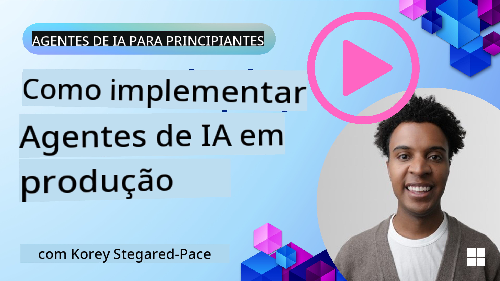

<!--
CO_OP_TRANSLATOR_METADATA:
{
  "original_hash": "44013a98d980c8b92d4b814dc49b545d",
  "translation_date": "2025-03-28T12:25:13+00:00",
  "source_file": "10-ai-agents-production\\README.md",
  "language_code": "pt"
}
-->

> _(Clique na imagem acima para assistir ao vídeo desta lição)_
# Agentes de IA em Produção

## Introdução

Esta lição abordará:

- Como planejar a implantação do seu Agente de IA em produção de forma eficaz.
- Erros e problemas comuns que você pode enfrentar ao implantar seu Agente de IA em produção.
- Como gerenciar custos enquanto mantém o desempenho do seu Agente de IA.

## Objetivos de Aprendizado

Após completar esta lição, você saberá como/entenderá:

- Técnicas para melhorar o desempenho, os custos e a eficácia de um sistema de Agente de IA em produção.
- O que avaliar e como avaliar seus Agentes de IA.
- Como controlar custos ao implantar Agentes de IA em produção.

É importante implantar Agentes de IA confiáveis. Confira a lição "Construindo Agentes de IA Confiáveis" também.

## Avaliando Agentes de IA

Antes, durante e depois de implantar Agentes de IA, ter um sistema adequado para avaliar seus Agentes de IA é essencial. Isso garantirá que seu sistema esteja alinhado com os objetivos seus e de seus usuários.

Para avaliar um Agente de IA, é importante ter a capacidade de avaliar não apenas a saída do agente, mas também todo o sistema em que seu Agente de IA está operando. Isso inclui, mas não se limita a:

- A solicitação inicial ao modelo.
- A capacidade do agente de identificar a intenção do usuário.
- A capacidade do agente de identificar a ferramenta certa para realizar a tarefa.
- A resposta da ferramenta à solicitação do agente.
- A capacidade do agente de interpretar a resposta da ferramenta.
- O feedback do usuário à resposta do agente.

Isso permite identificar áreas de melhoria de forma mais modular. Assim, você pode monitorar o impacto de alterações nos modelos, prompts, ferramentas e outros componentes com maior eficiência.

## Problemas Comuns e Soluções Potenciais com Agentes de IA

| **Problema**                                   | **Solução Potencial**                                                                                                                                                                                                       |
| ---------------------------------------------- | --------------------------------------------------------------------------------------------------------------------------------------------------------------------------------------------------------------------------- |
| Agente de IA não realiza tarefas de forma consistente | - Refinar o prompt dado ao Agente de IA; seja claro nos objetivos. - Identificar onde dividir as tarefas em subtarefas e tratá-las com múltiplos agentes pode ajudar.                                                     |
| Agente de IA entrando em loops contínuos       | - Certifique-se de ter termos e condições claras de término para que o Agente saiba quando parar o processo. - Para tarefas complexas que exigem raciocínio e planejamento, use um modelo maior especializado em tarefas de raciocínio. |
| Chamadas de ferramentas pelo Agente de IA não estão funcionando bem | - Teste e valide a saída da ferramenta fora do sistema do agente. - Refine os parâmetros definidos, prompts e nomes das ferramentas.                                                                                      |
| Sistema de múltiplos agentes não funciona de forma consistente | - Refinar os prompts dados a cada agente para garantir que sejam específicos e distintos entre si. - Construir um sistema hierárquico usando um agente "roteador" ou controlador para determinar qual agente é o mais adequado. |

## Gerenciando Custos

Aqui estão algumas estratégias para gerenciar os custos de implantar Agentes de IA em produção:

- **Cache de Respostas** - Identificar solicitações e tarefas comuns e fornecer as respostas antes que elas passem pelo sistema de agentes é uma boa maneira de reduzir o volume de solicitações semelhantes. Você pode até implementar um fluxo para identificar quão semelhante uma solicitação é às solicitações em cache usando modelos de IA mais básicos.

- **Uso de Modelos Menores** - Modelos de Linguagem Pequenos (SLMs) podem ter um bom desempenho em certos casos de uso de agentes e reduzir significativamente os custos. Como mencionado anteriormente, construir um sistema de avaliação para determinar e comparar o desempenho em relação a modelos maiores é a melhor maneira de entender o quão bem um SLM funcionará no seu caso de uso.

- **Uso de um Modelo Roteador** - Uma estratégia semelhante é usar uma diversidade de modelos e tamanhos. Você pode usar um LLM/SLM ou uma função serverless para direcionar solicitações com base na complexidade para os modelos mais adequados. Isso também ajudará a reduzir custos enquanto garante o desempenho nas tarefas certas.

## Parabéns

Esta é atualmente a última lição de "Agentes de IA para Iniciantes".

Planejamos continuar adicionando lições com base no feedback e nas mudanças nesta indústria em constante crescimento, então volte em breve.

Se você quiser continuar aprendendo e desenvolvendo com Agentes de IA, junte-se ao <a href="https://discord.gg/kzRShWzttr" target="_blank">Discord da Comunidade Azure AI</a>.

Lá organizamos workshops, mesas redondas da comunidade e sessões de "pergunte-me qualquer coisa".

Também temos uma coleção de aprendizado com materiais adicionais que podem ajudá-lo a começar a construir Agentes de IA em produção.

## Lição Anterior

[Metacognition Design Pattern](../09-metacognition/README.md)

**Aviso Legal**:  
Este documento foi traduzido utilizando o serviço de tradução por IA [Co-op Translator](https://github.com/Azure/co-op-translator). Embora nos esforcemos para garantir a precisão, esteja ciente de que traduções automáticas podem conter erros ou imprecisões. O documento original em seu idioma nativo deve ser considerado a fonte oficial. Para informações críticas, recomenda-se a tradução profissional feita por humanos. Não nos responsabilizamos por quaisquer mal-entendidos ou interpretações equivocadas decorrentes do uso desta tradução.